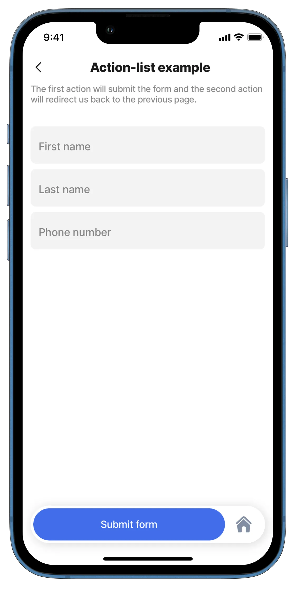
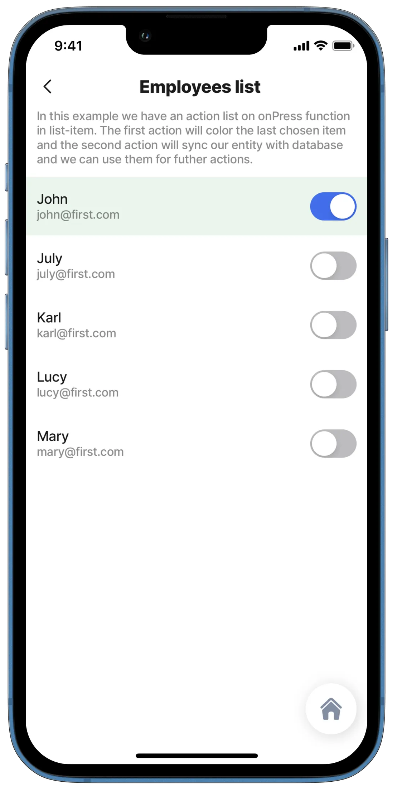

# action-list

This action allows for multiple actions to be run while only requiring the user to press a single button. The actions can be set to run sequentially or executed as a bulk functionality.

## Configuration options

An `action list` can be set up in various ways:

1. As a primary action button.
2. In onPress/onChange events - usually triggered by [list](../Widgets/list.md) or [jig.list](<../Jig Types/jig_list.md>) related items.
3. In onRefresh/onFocus events on any type of jig.

## Examples and code snippets

### Action-list as a primary action button



<figure><figcaption><p>Action List</p></figcaption></figure>



This example shows an action-list with two actions. The first action is [submit-form](https://docs.jigx.com/examples/examples/readme/actions/submit-form), which will save the entered data, and the second action, [go-back](https://docs.jigx.com/examples/readme/actions/go-back), will redirect us back to the previous page.

**Example:** See the full example of action-list in [GitHub](https://github.com/jigx-com/jigx-samples/blob/main/quickstart/jigx-samples/jigs/jigx-actions/action-list/action-list-primary.jigx)




```yaml
title: Action-list example
type: jig.default
description: The first action will submit the form and the second action will redirect us back to the previous page.

actions:
  - children:
    - type: action.execute-entity
      options:
        title: Create Record
        provider: DATA_PROVIDER_DYNAMIC
        entity: default/employees
        method: save
        data:
          firstname: =@ctx.components.firstname.state.value
          lastname: =@ctx.components.lastname.state.value
          phone:  =@ctx.components.phone.state.value
        onSuccess: 
          type: action.go-back
            
children:
  - type: component.form
    instanceId: simple-form
    options:
      isDiscardChangesAlertEnabled: false
      children:
        - type: component.text-field
          instanceId: firstname
          options:
            label: First name
        - type: component.text-field
          instanceId: lastname
          options:
            label: Last name
        - type: component.text-field
          instanceId: phone
          options:
            label: Phone number
            keyboardType: decimal-pad
```


### Action list as onPress/onChange



<figure><figcaption><p>Action-list with onPress</p></figcaption></figure>



In this example, we have an action list with the onPress function in the list-item. The first action will color the last chosen item and the second action will sync our entity with the database and we can use them for further actions.

**Example:** See the full example of action-list in onPress in [GitHub](https://github.com/jigx-com/jigx-samples/blob/main/quickstart/jigx-samples/jigs/jigx-actions/action-list/action-list-onPress.jigx). See the full example of action-list in onChange in [GitHub](https://github.com/jigx-com/jigx-samples/blob/main/quickstart/jigx-samples/jigs/jigx-actions/action-list/action-list-onChange.jigx)





```yaml
item: 
  type: component.list-item
  options:
    title: =@ctx.current.item.firstname
    subtitle: =@ctx.current.item.email
    progress: =@ctx.current.item.id = @ctx.solution.state.activeItemId ? 1 :0
    color:
      - when: =@ctx.current.item.id = @ctx.solution.state.activeItemId ? true :false
        color: color2
    onPress: 
      type: action.action-list
      options:
        actions:
          - type: action.set-state
            options:
              state: =@ctx.solution.state.activeItemId
              value: =@ctx.current.item.id
          - type: action.sync-entities
            options:
              provider: DATA_PROVIDER_DYNAMIC
              entities:
                - default/employees
```



```yaml
item: 
  type: component.list-item
  options:
    title: =@ctx.current.item.firstname
    subtitle: =@ctx.current.item.email
    progress: =@ctx.current.item.id = @ctx.solution.state.activeItemId ? 1 :0
    color:
      - when: =@ctx.current.item.id = @ctx.solution.state.activeItemId ? true :false
        color: color2
    rightElement: 
      element: switch
      onChange: 
        type: action.action-list
        options:
          actions:
            - type: action.set-state
              options:
                state: =@ctx.solution.state.activeItemId
                value: =@ctx.current.item.id
            - type: action.sync-entities
              options:
                provider: DATA_PROVIDER_DYNAMIC
                entities:
                  - default/employees
```



### Action list as onRefresh/onFocus

In this example when we refresh the jig/jig is focused, we call set-state and sync-entities actions.

**Example:** See the full example of the action list onRefresh in [GitHub](https://github.com/jigx-com/jigx-samples/blob/main/quickstart/jigx-samples/jigs/jigx-actions/action-list/action-list-onRefresh.jigx). See the full example of the action list onFocus in [GitHub](https://github.com/jigx-com/jigx-samples/blob/main/quickstart/jigx-samples/jigs/jigx-actions/action-list/action-list-onFocus.jigx).



```yaml
onRefresh: 
  type: action.action-list
  options:
    isSequential: true
    actions:
      - type: action.set-state
        options:
          state: =@ctx.solution.state.refresh-key
          value: refreshed
      - type: action.sync-entities
        options:
          provider: DATA_PROVIDER_DYNAMIC
          entities:
            - default/employees
```



```yaml
onFocus: 
  type: action.action-list
  options:
    isSequential: true
    actions:
      - type: action.set-state
        options:
          state: =@ctx.solution.state.focus-key
          value: focused
      - type: action.sync-entities
        options:
          provider: DATA_PROVIDER_DYNAMIC
          entities:
            - default/employees
```


