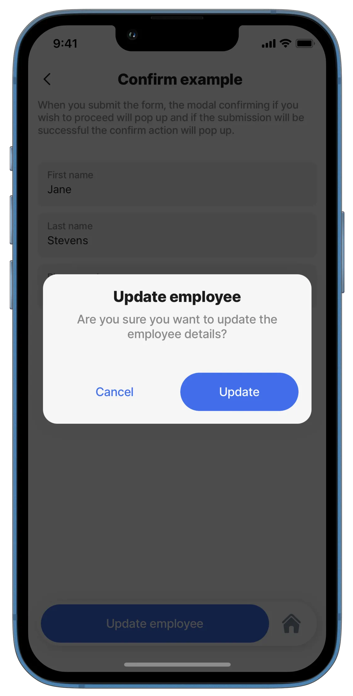

# confirm

The confirm action creates a pop-up prior to an action being performed. This usually serves as a safety net for a user attempting either a destructive action or an action that could have other implications for the user, such as asking whether a user wishes to proceed with deleting a record.

This action can also be used as a confirmation to provide feedback after an action has been performed.

The action allows for customizable wording on the confirmation modal and can be set to take place automatically or not.

## Configuration options

A `confirm` action can be set up in various ways:

1. You can use it as a confirmation to request confirmation before performing an action
2. You can use it as a confirmation after an action has successfully been performed

## Examples and code snippets

### Confirm action with modal



<figure><figcaption><p>Confirm</p></figcaption></figure>



This example has a c`onfirm` action with a nested `execute-entity` action. After pressing the button 'Update employee', a modal will be displayed - here, you confirm if you wish to proceed. When confirmed, the `execute-entity` action will proceed.

**Example:**

See the full example of confirm with modal in [GitHub](https://github.com/jigx-com/jigx-samples/blob/main/quickstart/jigx-samples/jigs/actions/confirm/confirm-with-modal.jigx).




```yaml
actions:
  - children:
      - type: action.action-list
        options:
          title: Add an employee
          isSequential: true
          actions: 
            - type: action.confirm
              options:
                isConfirmedAutomatically: false
                onConfirmed: 
                    type: action.execute-entity
                    options:
                      provider: DATA_PROVIDER_DYNAMIC
                      entity: default/form
                      method: create
                      data:
                        firstname: =@ctx.components.firstname.state.value
                        lastname: =@ctx.components.lastname.state.value
                        phone: =@ctx.components.phone.state.value 
                modal:
                  title: Add an employee
                  description: Are you sure you want to add a new employee?
                  confirm: 'Add'
                  cancel: 'Cancel'
            - type: action.go-back      
```


### Confirm action



<figure><figcaption><p>Confirm action</p></figcaption></figure>



This example has a confirm action nested inside an `execute-entity` action. When the form is submitted, the `confirm` action will show a pop-up stating that "Employee was added successfully". Note that as seen in the image, there is no option to confirm since _isConfirmedAutomatically_ is set to true. But you can see the result of the automatically confirmed action by tapping on "See the confirmation".

**Example:**

See the full example of confirm in [GitHub](https://github.com/jigx-com/jigx-samples/blob/main/quickstart/jigx-samples/jigs/jigx-actions/confirm/confirm.jigx).

See the helper file [GitHub](https://github.com/jigx-com/jigx-samples/blob/main/quickstart/jigx-samples/jigs/jigx-actions/confirm/confirmation.jigx).




```yaml
actions:
  - children:
      - type: action.action-list
        options:
          title: Add an employee
          isSequential: true
          actions:
            - type: action.execute-entity
              options:
                provider: DATA_PROVIDER_DYNAMIC
                entity: default/form
                method: create
                data:
                  firstname: =@ctx.components.firstname.state.value
                  lastname: =@ctx.components.lastname.state.value
                  phone: =@ctx.components.phone.state.value
                onSuccess: 
                  title: Employee was added sucessfuly
                  actions:
                  - type: action.confirm
                    options:
                      title: See the confirmation
                      isConfirmedAutomatically: true
                      onConfirmed: 
                        type: action.go-to
                        options:
                          linkTo: confirmation
                      modal:
                        title: ''
            - type: action.go-back
```

