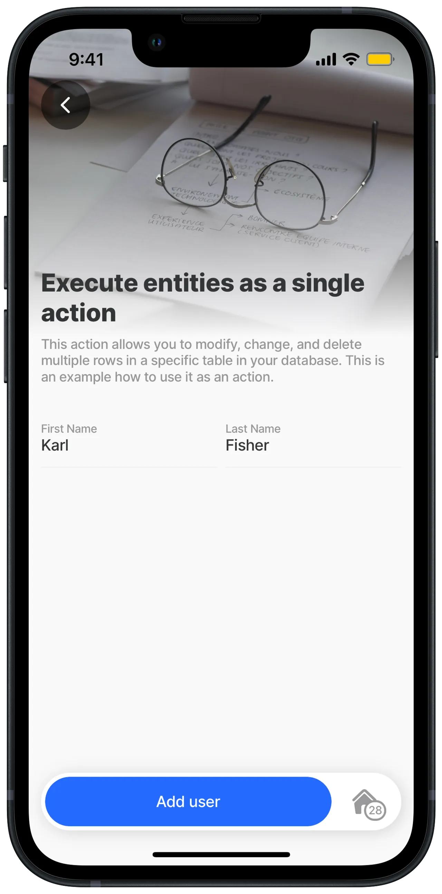
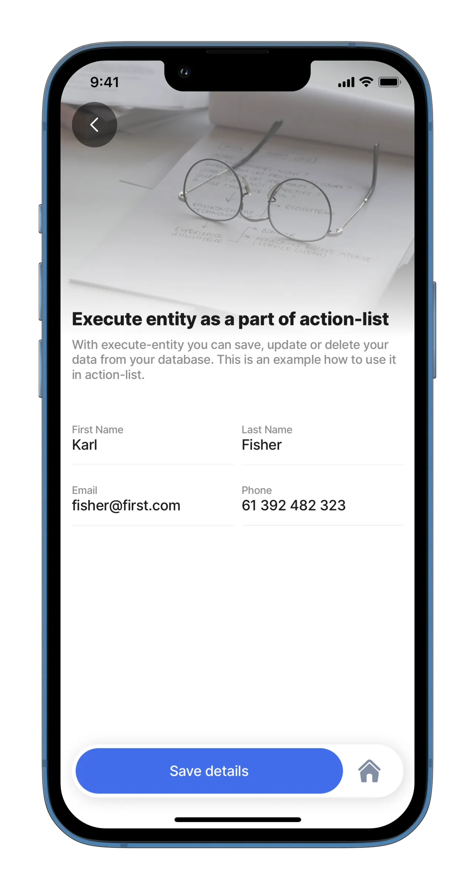
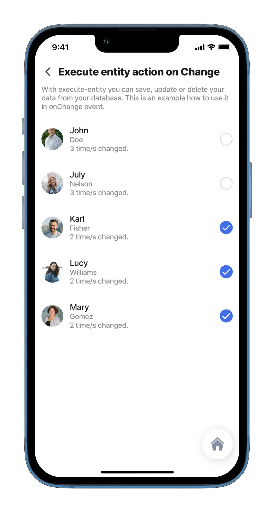
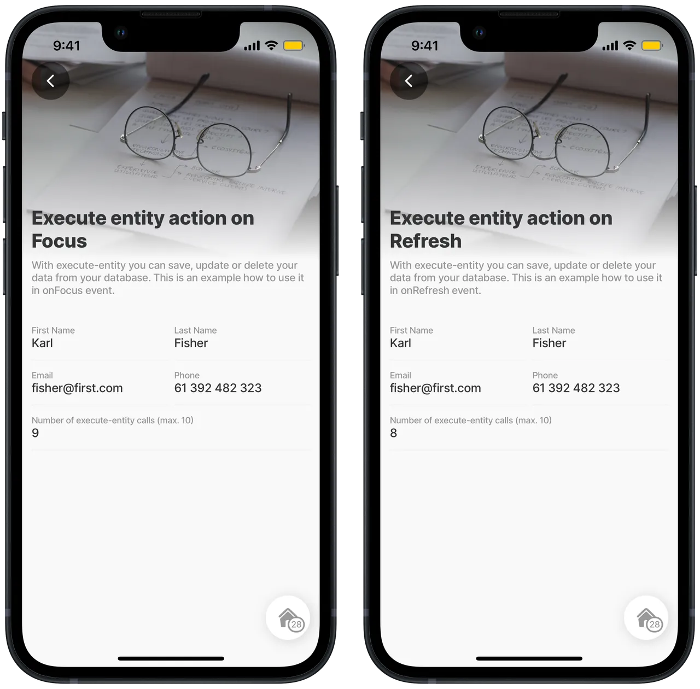

# execute-entity

Execute-entity can save, update, or delete data in a **single row** from a database, depending on the chosen method. Each datasource type (Dynamic / SQL / REST) will have a different syntax for updating, saving, and deleting data.

For the Dynamic datasource, values will be saved under the `data` option. For SQL/REST datasource, values will be saved under the `Parameters` option.


This action can't be used if you are using [Static Data](https://docs.jigx.com/examples/readme/datasource/static).


## Configuration options

An `execute-entity` action can be used in multiple areas:

1. Under the action button
2. In action list
3. In onPress/onChange events (if the component you are setting up has these options)
4. In onRefresh/onFocus




The execute-entity has a `go-back` option, which is set to on by default. That means when you run execute-entity, it will automatically return you to the previous jig.


## Offline remote data handling

Dealing with offline remote data ensures consistent synchronization with the remote data source. It also lets users continue working without a connection. [Offline remote data handling](https://docs.jigx.com/building-apps-with-jigx/data/offline-remote-data-handling) explains the `queueOperation` property and provides examples.

### Group queued commands

Use `batchId` to group related queued writes. Group commands in the offline command queue. Commands sharing a `batchId` are processed top-to-bottom; if one fails, the remaining members of the batch are paused until the failed command is retried or deleted.

If a `sync` or `parallel` command fails, later commands in that batch pause. Retry or delete the failed command before continuing the batch. Failed `async` commands do not pause their batch.

Use `processingType` to control how the command is processed in the queue.&#x20;

<table><thead><tr><th width="117.2734375">Value</th><th>Behavior</th></tr></thead><tbody><tr><td><code>sync</code></td><td>Runs one command at a time. This is the default.</td></tr><tr><td><code>parallel</code></td><td>Starts with adjacent parallel commands. The next sync command waits for all of them.</td></tr><tr><td><code>async</code></td><td>Starts without waiting. Later commands can run immediately.</td></tr></tbody></table>

Omit both properties to retain the existing serial queue behavior.

`retry-queue-command` and `delete-queue-command` accept `batchId` as well as `id`, to act on a whole batch at once, plus an optional `force` (default `false`) needed to touch in-flight (`starting`/`processing`) rows, otherwise those are skipped.

The example groups related updates under `employee-update-41`. It sends two file updates concurrently. It then waits before updating the employee record.

```yaml
actions:
  - children:
      - type: action.action-list
        options:
          isSequential: true
          title: Update employee file and record
          actions:
            - type: action.execute-entity
              options:
                provider: DATA_PROVIDER_REST
                entity: employee-files
                method: update
                function: update-file
                queueOperation: add
                batchId: employee-update-42
                processingType: parallel
                parameters:
                  id: =@ctx.datasources.pending-file.id
                data:
                  id: =@ctx.datasources.pending-file.id
            - type: action.execute-entity
              options:
                provider: DATA_PROVIDER_REST
                entity: employees
                method: update
                function: update-employee
                queueOperation: add
                batchId: employee-update-42
                processingType: sync
                parameters:
                  id: =@ctx.datasources.employee.id
                data:
                  id: =@ctx.datasources.employee.id
```

## Examples and code snippets

### Execute-entity in action



<figure><figcaption><p>Execute enitity</p></figcaption></figure>



In this example, execute entity is used in _action_ with the _create_ method. This example results in creating a new record with the First name, Last name, Email, and Phone number information. Execute entity is called by the press of the _Save details_ button on the bottom.

**Example:** See the full example of execute-entity in [GitHub](https://github.com/jigx-com/jigx-samples/blob/main/quickstart/jigx-samples/jigs/jigx-actions/ja-execute-entity/ja-execute-entity-action.jigx).




```yaml
actions:
  - children:
      - type: action.execute-entity
        options:
          title: Save details
          provider: DATA_PROVIDER_DYNAMIC
          method: create
          entity: default/form
          data:
            firstname: =@ctx.datasources.employee-detail-dynamic.firstname
            lastname: =@ctx.datasources.employee-detail-dynamic.lastname
            email: =@ctx.datasources.employee-detail-dynamic.email
            phone: =@ctx.datasources.employee-detail-dynamic.phone
          onSuccess:
            type: action.go-back
```


### Execute-entity in action list



<figure><figcaption><p>Execute entity in action-list</p></figcaption></figure>



By pressing the _Save details_ button the execute-entity action will be followed by the go-to action.

**Examples:** See the full example of execute-entity in [GitHub](https://github.com/jigx-com/jigx-samples/blob/main/quickstart/jigx-samples/jigs/jigx-actions/ja-execute-entity/ja-execute-entity-actionlist.jigx).




```yaml
actions:
  - children:
      - type: action.action-list
        options:
          isSequential: true
          title: Save details
          actions:
            - type: action.execute-entity
              options:
                provider: DATA_PROVIDER_DYNAMIC
                method: create
                entity: default/form
                data:
                  firstname: =@ctx.datasources.employee-detail-dynamic.firstname
                  lastname: =@ctx.datasources.employee-detail-dynamic.lastname
                  email: =@ctx.datasources.employee-detail-dynamic.email
                  phone: =@ctx.datasources.employee-detail-dynamic.phone
            - type: action.info-modal
              options:
                modal:
                  title: Details successfully saved
                  buttonText: View list
                  element:
                    type: icon
                    icon: cog-approved
                    color: primary
                onConfirmed:
                  type: action.go-to
                  options:
                    linkTo: ja-execute-entity-onPress
```


### Execute-entity in onPress/onChange event



<figure><figcaption><p>Execute-entity in onPress</p></figcaption></figure>



Here is the example of execute-entity in onPress/onChange event in list-item.

**Examples:** See the full example using onChange in [GitHub](https://github.com/jigx-com/jigx-samples/blob/main/quickstart/jigx-samples/jigs/jigx-actions/ja-execute-entity/ja-execute-entity-onChange.jigx). See the full example using onPress you in [GitHub](https://github.com/jigx-com/jigx-samples/blob/main/quickstart/jigx-samples/jigs/jigx-actions/ja-execute-entity/ja-execute-entity-onPress.jigx).





```yaml
item:
  type: component.list-item
  options:
    title: =@ctx.current.item.firstname
    subtitle: =@ctx.current.item.lastname
    description: =(@ctx.current.item.modify = 0 ? 0 :@ctx.current.item.modify) & ' time/s changed.'
    leftElement:
      element: avatar
      text: ""
      uri: =@ctx.current.item.photo
    onPress:
      type: action.execute-entity
      options:
        provider: DATA_PROVIDER_LOCAL
        method: update
        entity: default/employees
        data:
          id: =@ctx.current.item.id
          modify: =($number(@ctx.current.item.modify) + 1)
```



```yaml
item:
  type: component.list-item
  options:
    title: =@ctx.current.item.firstname
    subtitle: =@ctx.current.item.lastname
    description: =(@ctx.current.item.modify = 0 ? 0 :@ctx.current.item.modify) & ' time/s changed.'
    leftElement:
      element: avatar
      text: ""
      uri: =@ctx.current.item.photo
    rightElement:
      element: checkbox
      value: true
      onChange:
        type: action.execute-entity
        options:
          provider: DATA_PROVIDER_LOCAL
          method: update
          entity: default/employees
          data:
            id: =@ctx.current.item.id
            modify: =$number(@ctx.current.item.modify) + 1
```



### Execute-entity in onRefresh/onFocus



<figure><figcaption><p>Execute entity</p></figcaption></figure>



Here is the example of execute-entity in onRefresh/onFocus.

See the full example using onRefresh in [GitHub](https://github.com/jigx-com/jigx-samples/blob/main/quickstart/jigx-samples/jigs/jigx-actions/ja-execute-entity/ja-execute-entity-onRefresh.jigx).\
See the full example using onFocus in [GitHub](https://github.com/jigx-com/jigx-samples/blob/main/quickstart/jigx-samples/jigs/jigx-actions/ja-execute-entity/ja-execute-entity-onFocus.jigx)





```yaml
onRefresh:
  type: action.execute-entity
  options:
    provider: DATA_PROVIDER_DYNAMIC
    method: update
    entity: default/employees
    data:
      id: =@ctx.datasources.employee-detail-dynamic.id
      modify: =@ctx.datasources.employee-detail-dynamic.modify >= 10 ? 1 :($number(@ctx.datasources.employee-detail-dynamic.modify) + 1)
```



```yaml
onFocus:
  type: action.execute-entity
  options:
    provider: DATA_PROVIDER_DYNAMIC
    method: update
    entity: default/employees
    data:
      id: =@ctx.datasources.employee-detail-dynamic.id
      modify: =@ctx.datasources.employee-detail-dynamic.modify >= 10 ? 1 :($number(@ctx.datasources.employee-detail-dynamic.modify) + 1)
```



### Deleting data using execute-entity

Here is an example of deleting different data using execute-entity. There are always 2 options for how you can delete a record:

1. Using SQL Select
2. Using JSONata function

In the first two examples, you can see the same situation where you are deleting all the records where the name equals Jane.

The third example shows how to delete the first 3 records from your datasource.



```yaml
datasource:
  people:
    type: datasource.sqlite
    options:
      provider: DATA_PROVIDER_DYNAMIC
      entities:
        - entity: people
      query: |
        SELECT
          id,
          '$.name',
          '$.surname',
          '$.address'
        FROM [people] WHERE '$.name' LIKE 'Jane'

actions:
  - type: "action.execute-entity"
    options:
      entity: people
      method: delete
      provider: DATA_PROVIDER_DYNAMIC
      data:
        id: =@ctx.datasource.people.id
```



```yaml
type: "action.execute-entity"
options:
  goBack: stay
  entity: form
  provider: DATA_PROVIDER_LOCAL
  method: delete
  data: "=@ctx.datasources.people[name = 'Jane']{'id':id}[]"
```



```yaml
datasource:
  people:
    type: datasource.sqlite
    options:
      provider: DATA_PROVIDER_DYNAMIC
      entities:
        - default/people
      query: |
        SELECT
          id,
          '$.name',
          '$.surname',
          '$.address'
        FROM [default/people] LIMIT 3

actions:
  - type: "action.execute-entity"
    options:
      goBack: stay
      entity: deafult/people
      method: delete
      provider: DATA_PROVIDER_DYNAMIC
      data:
        id: =@ctx.datasource.people.id
```


