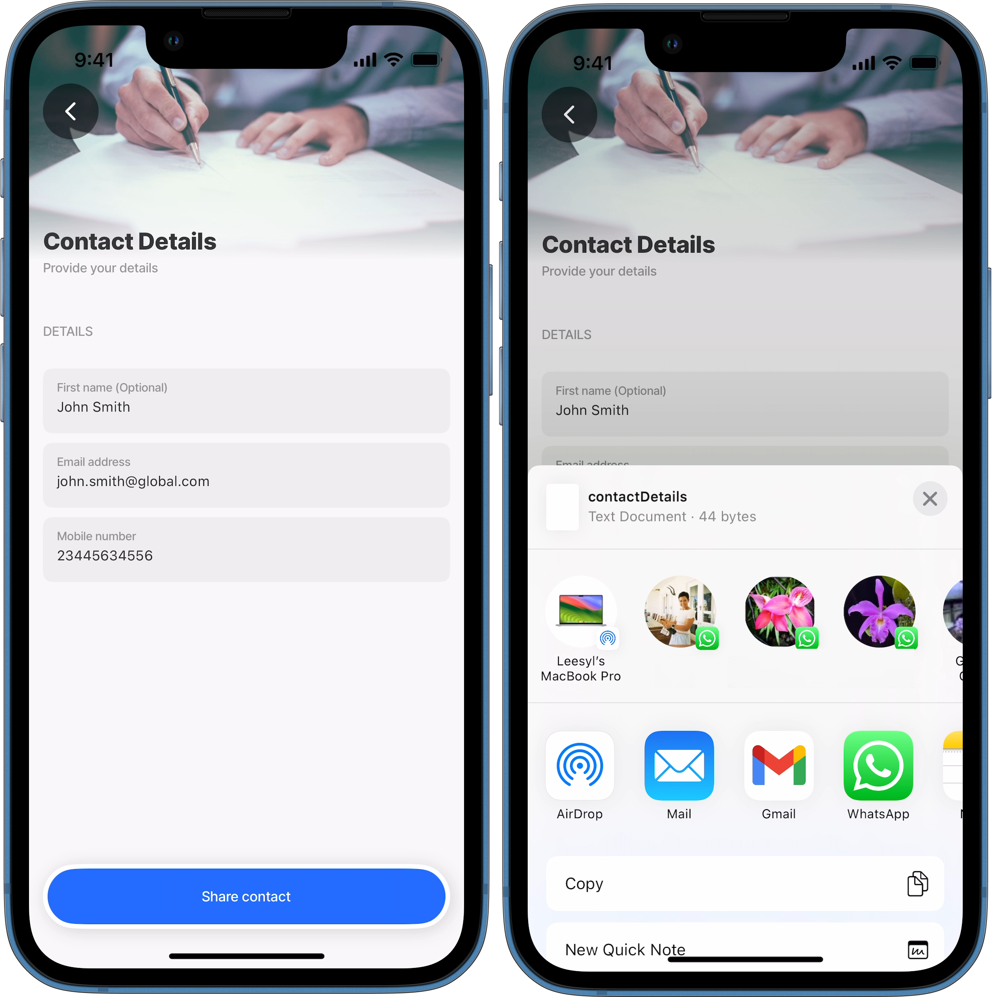

# generate-file

This action generates files such as PDFs, CSVs, or text files. It accepts content to be written to the file, along with an optional encoding parameter. Once generated, the file's URI is returned and included in the action instance output.

## Configuration options

Some properties are common to all components, see [Common component properties](https://docs.jigx.com/examples/common-component-properties) for a list and their configuration options.

<table><thead><tr><th width="154.05078125">Core structure</th><th></th></tr></thead><tbody><tr><td><code>content</code></td><td>The content to be included in the file. You can use datasources, expressions, or text.</td></tr><tr><td><code>fileName</code></td><td>Give the file a name, this name is used as the local file name, and is referenced as part of the uri, which can be accessed via the action's instance output (<code>=@ctx.actions.generateFile.outputs.uri</code>). The file extension must be included in the <code>fileName</code>, e.g., Application.txt.</td></tr><tr><td><code>instanceId</code></td><td>Provide a unique identifier for the action, which provides access to the action's state.</td></tr><tr><td><code>title</code></td><td>Provide the action button with a title, for example, Create Application.</td></tr></tbody></table>

<table><thead><tr><th width="155.33984375">Other options</th><th></th></tr></thead><tbody><tr><td><code>encoding</code></td><td><p>The <code>encoding</code> parameter specifies how an already encoded file should be interpreted when it is read. It does not encode the file itself but rather determines how the provided file content is decoded. Accepted encoding options:</p><ul><li><code>utf8</code> - default</li><li><code>ascii</code></li><li><code>base64</code> - All three encoding types are supported and will return errors if the provided file content is incompatible with the selected encoding. If a plain text string (e.g., "Hello World") is supplied with base64 encoding, the file will appear empty because it is not a valid base64-encoded string. When a valid base64 string (e.g., "SGVsbG8sIFdvcmx" for "Hello World") is provided, it will be decoded correctly, resulting in a readable file with the expected content. After reading the file, can be configured if needed.</li></ul></td></tr></tbody></table>

## Considerations

* You can reference the local file using the action's output uri in other actions or components, `=@ctx.actions.generateFile.outputs.uri`. For example, generate the file then [share](share.md) the file.
* Depending on where you save and use the saved file, you might need to use [conversions](https://docs.jigx.com/file-handling).
* The file extension must be included in the `fileName`, e.g., FormA.docx.

## Examples and code snippets

### Generate and share the file



<figure><figcaption><p>Generate text file</p></figcaption></figure>



In this example, an action list contains two actions: the first generates a text file, the second shares the file via a sharing app on the device.




```yaml
title: Contact Details
description: Provide your details
type: jig.default

header:
  type: component.jig-header
  options:
    height: small
    children:
      type: component.image
      options:
        source:
          uri: https://images.unsplash.com/photo-1450101499163-c8848c66ca85?w=900&auto=format&fit=crop&q=60&ixlib=rb-4.0.3&ixid=M3wxMjA3fDB8MHxzZWFyY2h8MTR8fGludm9pY2luZ3xlbnwwfHwwfHx8MA%3D%3D

children:
  - type: component.section
    options:
      title: Details
      children:
        - type: component.form
          instanceId: inputValues
          options:
            children:
              - type: component.text-field
                instanceId: firstName
                options:
                  initialValue: John Smith
                  label: First name
                  isRequired: false
              - type: component.email-field
                instanceId: email
                options:
                  initialValue: john.smith@global.com
                  label: Email address
              - type: component.number-field
                instanceId: phoneNumber
                options:
                  initialValue: 23445634556
                  label: Mobile number
# Create an action list that will first create the text file,
# secondly share the text file via one of the devices sharing apps.
actions:
  - children:
      # Use the action.list so that the file is accessible as an action output.
      - type: action.action-list
        options:
          title: Share contact
          isSequential: true
          actions:
            - type: action.generate-file
              # Provide the unique identifier used in the action output callback.
              instanceId: file-contact
              options:
                # Specify the content to display in the file.
                content: >
                  =(
                    @ctx.components.firstName.state.value 
                    & ' ' 
                    & @ctx.components.email.state.value 
                    & ' ' 
                    & @ctx.components.phoneNumber.state.value
                  )
                # Give the file a name, the extenstion must be supplied.
                fileName: contactDetails.txt
            # Share the file using the device's apps.
            - type: action.share
              options:
                # Use the action instance output to reference the file.
                fileUri: =@ctx.actions.file-contact.outputs.uri
                message: =@ctx.components.firstName.state.value & ' ' & 'Details'
                subject: =@ctx.components.firstName.state.value & ' ' & 'Details'
```

