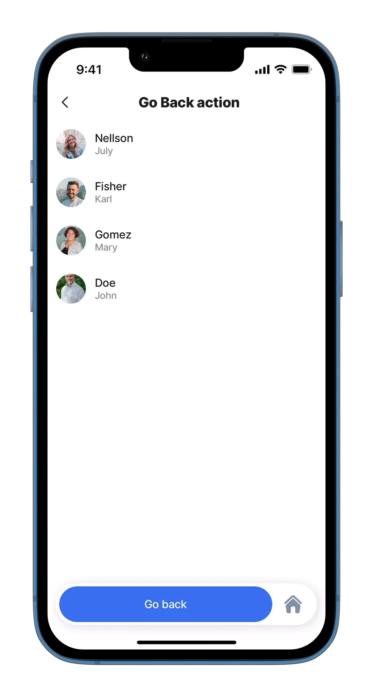
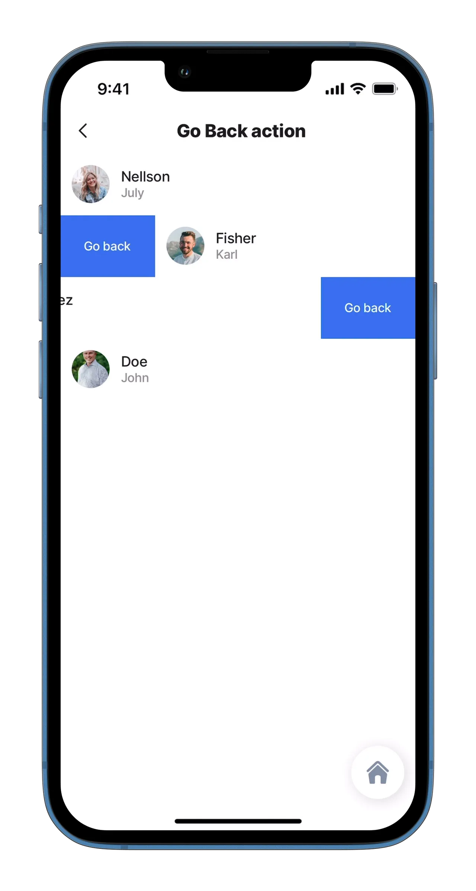
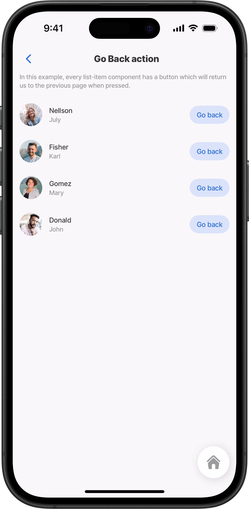
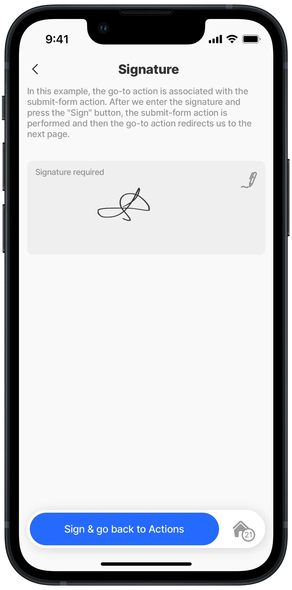

# go-back

This action is used to return to a previous point in the navigation stack. Most jigs include this action automatically as an arrow to the left of the jig title. You can use `go-back` in an action list, in `swipeable`, in `rightElement`, or together with another action.

By default, `go-back` returns the user to the previous screen. You can also configure it to return to the Home screen or to a specific jig already in the navigation stack.&#x20;

## Configuration options

A go-back action can be set up in various ways:

1. As a separate action or in the action list.
2. As a `swipeable` action in the left or right direction.
3. As `rightElement` in the list.
4. As an associated action in the action list.
5. By using the `to` property to navigate to the `previous` screen, the `home`  screen, or a specific jig using the `jigId` in the navigation stack.



<table><thead><tr><th width="157.7109375">Core structure</th><th></th></tr></thead><tbody><tr><td><code>to</code></td><td>Optional navigation target. Use <code>previous</code> to go to the previous screen, <code>home</code> to go to the Home screen, or provide a specific <code>jigId</code> already in the navigation stack. If omitted, the default behavior is <code>previous</code>.</td></tr><tr><td><code>title</code></td><td>Provide the action button with a title, for example, Go back.</td></tr></tbody></table>

<table><thead><tr><th width="158.5234375">Other options</th><th></th></tr></thead><tbody><tr><td><code>icon</code></td><td>Select an <a href="https://docs.jigx.com/jigx-icons">icon</a> to display when the action is configured as the secondary button or in a header action.</td></tr><tr><td><code>isHidden</code></td><td><code>false</code> hides the action button, <code>true</code> shows the action button. The default setting is <code>true</code>.</td></tr><tr><td><code>style</code></td><td><code>isDanger</code> - Styles the action button in red or your brand's designated danger color. <code>isDisabled</code> - Displays the action button as greyed out. <code>isPrimary</code> - Styles the action button in blue or your brand's designated primary color. <code>isSecondary</code> - Sets the action as a secondary button, accessible via the ellipsis. The <code>icon</code> property can be used when the action button is displayed as a secondary button.</td></tr></tbody></table>


`go-back` supports these navigation targets:

* `to: previous` - goes to the previous screen. This is the default behavior.
* `to: home` - goes to the Home screen.
* `to: jigId` - goes back to a specific jig already in the navigation stack.
* `to: =@ctx.solution.state.targetJigId` - uses an expression for dynamic navigation.


## Considerations

* If `to` is omitted, `go-back` behaves exactly as before and returns to the previous screen.
* When `to` references a specific `jigId`, the action finds that jig in the navigation stack and removes all screens above it.
* Use `to: home` when you want to return directly to the Home screen instead of stepping back screen by screen.
* Use expressions in `to` when the navigation target must be determined at runtime.

## Examples and code snippets

### go-back as an action



<figure><figcaption><p>go-back as an action</p></figcaption></figure>



The simplest example of a go-back action is to use it as a separate action. When configured, a button will appear at the bottom which will return us to the previous page, home or a specific jig when pressed. In this case, there is an arrow to the left in the upper left corner. This means that this jig already has a go-back action automatically in it to go back to the previous screen,  the "Go back" button below takes you back to a specific jig.

**Examples:**

See the full example using static data in [GitHub](https://github.com/jigx-com/jigx-samples/blob/main/quickstart/jigx-samples/jigs/jigx-actions/go-back/static-data/go-back-action/go-back-action.jigx).\
See the full example using dynamic data in [GitHub](https://github.com/jigx-com/jigx-samples/blob/main/quickstart/jigx-samples/jigs/jigx-actions/go-back/dynamic-data/go-back-action/go-back-action-dynamic.jigx).




```yaml
actions:
  - children:
      - type: action.go-back
        options:
          title: Go back
          to: actions-summary
```


### go-back swipeable left/right



<figure><figcaption><p>swipeable go-back</p></figcaption></figure>



This example uses the go-back action as a swipeable property. We can choose the swipe direction left or right. After pressing the button, we return to the previous page.

**Examples left:** See the full example using static data in [GitHub](https://github.com/jigx-com/jigx-samples/blob/main/quickstart/jigx-samples/jigs/jigx-actions/go-back/static-data/go-back-swipeable/go-back-swipeable-left.jigx). See the full example using dynamic data in [GitHub](https://github.com/jigx-com/jigx-samples/blob/main/quickstart/jigx-samples/jigs/jigx-actions/go-back/dynamic-data/go-back-swipeable/go-back-left-dynamic.jigx).

**Examples right:** See the full example using static data in [GitHub](https://github.com/jigx-com/jigx-samples/blob/main/quickstart/jigx-samples/jigs/jigx-actions/go-back/static-data/go-back-swipeable/go-back-swipeable-right.jigx). See the full example using dynamic data in [GitHub](https://github.com/jigx-com/jigx-samples/blob/main/quickstart/jigx-samples/jigs/jigx-actions/go-back/dynamic-data/go-back-swipeable/go-back-right-dynamic.jigx).





```yaml
swipeable:
    left:
        - label: Go back
          color: primary
          onPress:
            type: action.go-back
            
```



```yaml
swipeable:
    right:
        - label: Go back
          color: primary
          onPress: 
            type: action.go-back
```



### go-back rightElement



<figure><figcaption><p>rightElement go-back</p></figcaption></figure>



In this example, we use the `go-back` action as the `rightElement` in the `list-item` component to go to the home screen. There is a button for each item.

**Examples:**\
See the full example using static data in [GitHub](https://github.com/jigx-com/jigx-samples/blob/main/quickstart/jigx-samples/jigs/jigx-actions/go-back/static-data/go-back-right-element/go-back-right-element.jigx).\
See the full example using dynamic data in [GitHub](https://github.com/jigx-com/jigx-samples/blob/main/quickstart/jigx-samples/jigs/jigx-actions/go-back/dynamic-data/go-back-right-element/go-back-right-element-dynamic.jigx)




```yaml
rightElement: 
      element: button
      title: Go back
      onPress:
        type: action.go-back
        options:
          to: home
```


### go-back-on-success



In this example, we use the `action.go-back` with `onSuccess` to take you back to the main list after signing a form.

**Examples:**\
See the full example using static data in [GitHub](https://github.com/jigx-com/jigx-samples/blob/main/quickstart/jigx-samples/jigs/jigx-actions/go-back/static-data/go-back-on-success/go-back-on-success.jigx).



<figure><figcaption><p>go-back onSuccess</p></figcaption></figure>




```yaml
title: Signature
type: jig.default
description: In this example, the go-to action is associated with the
  submit-form action. After we enter the signature and press the "Sign" button,
  the submit-form action is performed and then the go-to action redirects us to
  the next page.
  
onRefresh: 
  type: action.reset-state
  options:
    state: =@ctx.jig.components.send-signature-go-to.state.data

onFocus: 
  type: action.reset-state
  options:
    state: =@ctx.jig.components.send-signature-go-to.state.data
    
actions:
  - children:
       - type: action.execute-entity
         options:
           title: Sign & go back to Actions
           provider: DATA_PROVIDER_DYNAMIC
           entity: default/form
           method: create
           data:
             signature: =@ctx.components.signature.state.value
           onSuccess: 
             type: action.go-back
   
children:
  - instanceId: send-signature-go-to
    type: component.form
    options:
      isDiscardChangesAlertEnabled: false
      children:
        - instanceId: signature
          type: component.signature-field
          options:
            label: Signature required         
```

