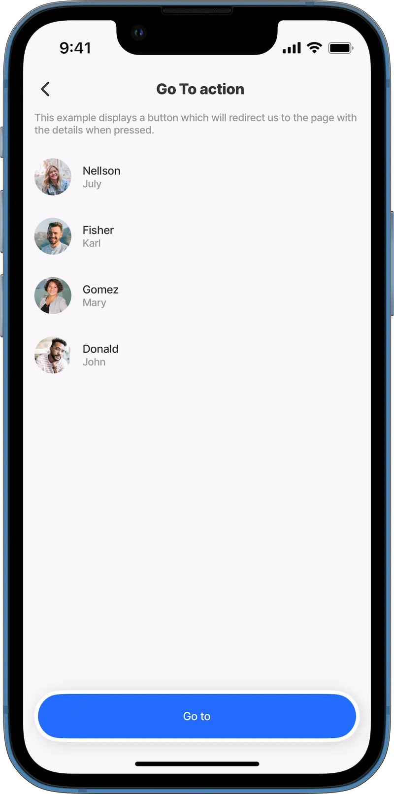
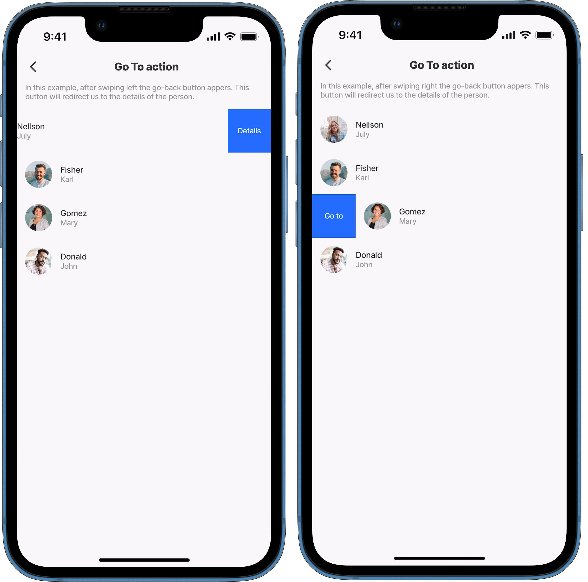
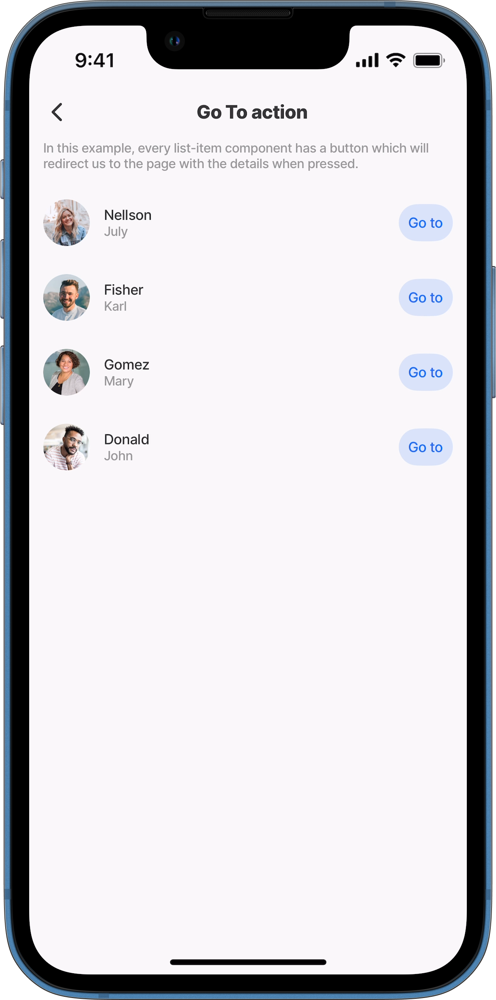
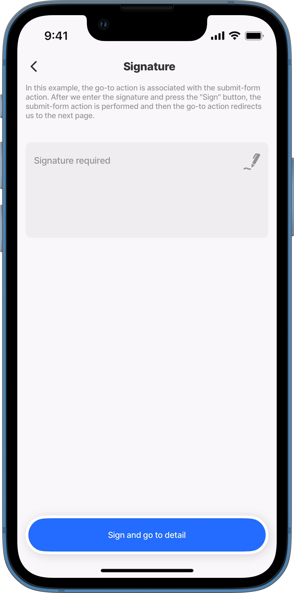
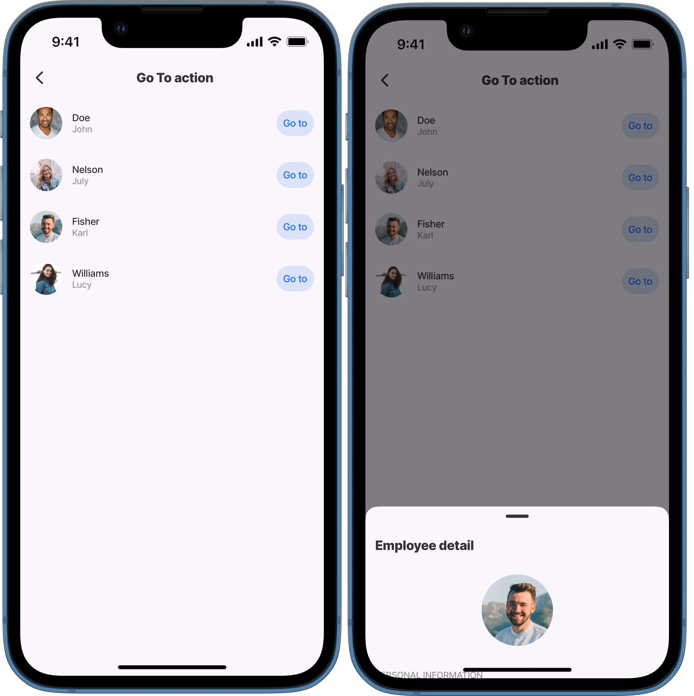

---
layout:
  width: wide
  title:
    visible: true
  description:
    visible: true
  tableOfContents:
    visible: true
  outline:
    visible: true
  pagination:
    visible: true
  metadata:
    visible: true
---

# go-to

This action redirects you to another jig. The `go-to` action can be used with elements like `swipeable` and `rightElement` or combined with another action. When paired with another action, it is triggered after the main action to navigate to a specified screen, for example, saving a date in a form and then opening a list of customers. `go-to` helps configure navigation, ensuring a seamless app flow. See [Navigation](https://docs.jigx.com/building-apps-with-jigx/logic/navigation) for more information.

## Configuration option

A go-to action can be set up in various ways:

1. As a separate action or in the action list.
2. As an associated action in the action list.
3. As a `swipeable` action in the left or right direction.
4. As `rightElement` in the list.
5. Use the `go-to` to open a jig as a modal using the `isModal` property set to `true`. Set to `false` opens navigates to the specified jig.
6. Use the `behaviour` property to determine if you want to push the jig into the history of navigation, by using the `new` value, or reuse the one you already have in history by using the `existing` value.

## Considerations

* Current known limitations when using the `isModal` property include:
  * Unable to send a value from the jig modal to the parent jig.
    * Depending on the device used different behavior can be expected, such as the jig will slide from the bottom to top, but the entire screen will be covered. This applies to:
      * On any Android device (phones and tablets).
      * On an iPad in landscape mode:
        1. When the drawer is open, it will only open in the jig panel.
        2. When the drawer is closed, it will cover the entire screen, but it will not display as a modal.

## Examples and code snippets

### go-to as an action



<figure><figcaption><p>go-to action</p></figcaption></figure>



The simplest example of using a go-to action is to use it as a separate action. When configured, a button will appear at the bottom, redirecting us to the details page when pressed.

**Examples:**\
See the full example using static data in [GitHub](https://github.com/jigx-com/jigx-samples/blob/main/quickstart/jigx-samples/jigs/jigx-actions/go-to/static/go-to-action/go-to-action.jigx).\
See the full example using dynamic data in [GitHub](https://github.com/jigx-com/jigx-samples/blob/main/quickstart/jigx-samples/jigs/jigx-actions/go-to/dynamic/go-to-action/go-to-action-dynamic.jigx).




```yaml
actions:
  - children:
      - type: action.go-to
        options:
          title: Go to
          linkTo: default-employee-detail
```


### go-to swipeable left/right



<figure><figcaption><p>go-to with swipeable</p></figcaption></figure>



This example uses the go-to action as a swipeable property. We can choose the swipe direction left or right. After pressing the button, it will redirect to the details of the person.

**Examples left:** See the full example using static data in [GitHub](https://github.com/jigx-com/jigx-samples/blob/main/quickstart/jigx-samples/jigs/jigx-actions/go-to/static/go-to-swipeable/go-to-swipeable-left.jigx). See the full example using dynamic data in [GitHub](https://github.com/jigx-com/jigx-samples/blob/main/quickstart/jigx-samples/jigs/jigx-actions/go-to/dynamic/go-to-swipeable/go-to-left-dynamic.jigx).

**Examples right:** See the full example using static data in [GitHub](https://github.com/jigx-com/jigx-samples/blob/main/quickstart/jigx-samples/jigs/jigx-actions/go-to/static/go-to-swipeable/go-to-swipeable-right.jigx). See the full example using dynamic data in [GitHub](https://github.com/jigx-com/jigx-samples/blob/main/quickstart/jigx-samples/jigs/jigx-actions/go-to/dynamic/go-to-swipeable/go-to-right-dynamic.jigx).





```yaml
item:
  type: component.list-item
  options:
    title: =@ctx.current.item.lastname
    subtitle: =@ctx.current.item.firstname
    leftElement:
      element: avatar
      text: " "
      uri: =@ctx.current.item.img
    rightElement:
      element: button
      title: Go to
      onPress:
        type: action.go-to
        options:
          linkTo: default-employee-detail
```



```yaml
item:
  type: component.list-item
  options:
    title: =@ctx.current.item.lastname
    subtitle: =@ctx.current.item.firstname
    leftElement:
      element: avatar
      text: " "
      uri: =@ctx.current.item.img
    swipeable:
      right:
        - label: Go to
          color: primary
          onPress:
            type: action.go-to
            options:
              linkTo: default-employee-detail
```



### go-to right button element



<figure><figcaption><p>go-to button</p></figcaption></figure>



In this example, we use the go-to action as the rightElement in the list-item component. There is a button for each item.

**Examples:**\
See the full example using static data in [GitHub](https://github.com/jigx-com/jigx-samples/blob/main/quickstart/jigx-samples/jigs/jigx-actions/go-to/static/go-to-right-element/go-to-right-element.jigx).\
See the full example using dynamic data in [GitHub](https://github.com/jigx-com/jigx-samples/blob/main/quickstart/jigx-samples/jigs/jigx-actions/go-to/dynamic/go-to-right-element/go-to-right-element-dynamic.jigx).




```yaml
item:
  type: component.list-item
  options:
    title: =@ctx.current.item.lastname
    subtitle: =@ctx.current.item.firstname
    leftElement:
      element: avatar
      text: " "
      uri: =@ctx.current.item.img
    rightElement:
      element: button
      title: Go to
      onPress:
        type: action.go-to
        options:
          linkTo: default-employee-detail
```


### go-to onSuccess



<figure><figcaption><p>go-to onSuccess</p></figcaption></figure>



In this example, the go-back action is associated with the submit-form action. After we enter the signature and press the "Sign" button, the submit-form action is performed and then the go-to action redirects us to the next page.

**Examples:**\
See the full example using dynamic data in [GitHub](https://github.com/jigx-com/jigx-samples/blob/main/quickstart/jigx-samples/jigs/jigx-actions/go-to/dynamic/go-to-on-success/go-to-on-success.jigx).




```yaml
actions:
  - children:
      - type: action.action-list
        options:
          title: Sign and go to detail
          isSequential: true
          actions:
            - type: action.execute-entity
              options:
                provider: DATA_PROVIDER_DYNAMIC
                entity: default/form
                method: create
                data:
                  signature: =@ctx.components.signature.state.value
                onSuccess:
                  title: Succesfully signed
                  actions:
                    - type: action.go-to
                      options:
                        title: Go to employee detail
                        linkTo: default-employee-detail
            - type: action.go-back
```


### go-to open a jig as a modal



In this example, we use the `go-to` action as the `rightElement` in the `list-item` component. There is a button for each item. When tapped the `go-to` will open the jig as a modal when the `isModal` property is set to `true`.

**Examples:**\
See the full example using dynamic data in GitHub.



<figure><figcaption><p>Open jig in a modal</p></figcaption></figure>





```yaml
title: Go To action
type: jig.list

data: =@ctx.datasources.employees-dynamic
item:
  type: component.list-item
  options:
    title: =@ctx.current.item.lastname
    subtitle: =@ctx.current.item.firstname
    leftElement:
      element: avatar
      text: " "
      uri: =@ctx.current.item.photo
    rightElement:
      element: button
      title: Go to
      onPress:
        type: action.go-to
        options:
          # When navigating to the jig, the jig opens as a modal,
          # specifying false will open as a normal jig.
          isModal: true
          linkTo: default-employee-detail
```



```yaml
title: Employee detail
type: jig.default

children:
  - type: component.avatar
    options:
      title: ""
      uri: https://images.unsplash.com/photo-1591084728795-1149f32d9866?ixlib=rb-1.2.1&ixid=MnwxMjA3fDB8MHxwaG90by1wYWdlfHx8fGVufDB8fHx8&auto=format&fit=crop&w=928&q=80
      size: large
      align: center

  - type: component.entity
    options:
      children:
        - type: component.section
          options:
            title: Personal information
            children:
              - type: component.field-row
                options:
                  children:
                    - type: component.entity-field
                      options:
                        label: Birth date
                        value: "12.02.1993"
                    - type: component.entity-field
                      options:
                        label: Gender
                        value: Male
              - type: component.field-row
                options:
                  children:
                    - type: component.entity-field
                      options:
                        label: Email
                        value: fisher@first.com
                        contentType: email
                    - type: component.entity-field
                      options:
                        label: Phone
                        value: "+61 392 482 323"
                        contentType: phone
        - type: component.section
          options:
            title: Address
            children:
              - type: component.field-row
                options:
                  children:
                    - type: component.entity-field
                      options:
                        label: Street
                        value: 14 Argyle Street
                    - type: component.entity-field
                      options:
                        label: City
                        value: Titaatee Creek
              - type: component.field-row
                options:
                  children:
                    - type: component.entity-field
                      options:
                        label: State
                        value: New South Wales
                    - type: component.entity-field
                      options:
                        label: Country
                        value: Australia

  - type: component.list
    options:
      data: =@ctx.datasources.quartal
      isHorizontal: true
      item:
        type: component.pie-chart
        options:
          chart:
            title:
              text: =@ctx.current.item.title
              verticalAlign: center
            subtitle:
              text: =@ctx.current.item.subtitle
              verticalAlign: center
            width: 140
            height: 140
            isAnimated: true
          legend:
            isHidden: true
          series:
            - data: =@ctx.current.item.data
```



```yaml
type: datasource.sqlite
options:
  provider: DATA_PROVIDER_DYNAMIC
  entities:
    - entity: default/employees
  query: |
    SELECT 
      id,
      '$.firstname',
      '$.lastname',
      '$.picture', 
      '$.modify', 
      '$.date_from', 
      '$.date_to', 
      '$.email',
      '$.phone', 
      '$.percentage', 
      '$.category', 
      '$.photo',
      '$.time'
    FROM [default/employees] 
    WHERE '$.category' = "employees" ORDER BY '$.firstname' ASC
```



```yaml
type: datasource.static
options:
  data:
    - title: 91%
      subtitle: Q1/2022
      data:
        - y: 91
          color: positive
        - y: 9
          color: transparent
    - title: 99%
      subtitle: Q2/2022
      data:
        - y: 99
          color: positive
        - y: 1
          color: transparent
    - title: 10%
      subtitle: Q3/2022
      data:
        - y: 10
          color: positive
        - y: 90
          color: transparent
    - title: 0%
      subtitle: Q4/2022
      data:
        - y: 0
          color: positive
        - y: 100
          color: transparent
```



### go-to using new & existing behaviour

In this example, three jigs are configured to create a stack of data for each guest, including their Name, Age, and Address. Each jig's `go-to` action is set with the `behaviour` property as `new`, enabling new guest details to be pushed into the app history. In the final jig, a secondary `go-to` action is added. This action introduces a button to review each guest's data by setting the `behaviour` property to `existing` and linking to the first jig in the stack via the `linkTo` property. The review process will cycle through each guest's details in the stack before completing.



<figure><figcaption><p>Go-to new guest</p></figcaption></figure>



<figure><figcaption><p>Review guests</p></figcaption></figure>





```yaml
title: Name
type: jig.default

onFocus:
  type: action.reset-state
  options:
    state: =@ctx.solution.state

header:
  type: component.jig-header
  options:
    height: medium
    children:
      type: component.image
      options:
        source:
          uri: https://images.unsplash.com/photo-1521336575822-6da63fb45455?w=800&auto=format&fit=crop&q=60&ixlib=rb-4.0.3&ixid=M3wxMjA3fDB8MHxzZWFyY2h8MTB8fGFkdmVudHVyZXxlbnwwfHwwfHx8MA%3D%3D

children:
  - type: component.form
    instanceId: form-a
    options:
      isDiscardChangesAlertEnabled: false
      children:
        - type: component.text-field
          instanceId: fullName
          options:
            label: Name

actions:
  - children:
      - type: action.action-list
        options:
          title: NEXT
          isSequential: true
          actions:
            - type: action.execute-entity
              options:
                provider: DATA_PROVIDER_LOCAL
                entity: guests
                method: save
                data:
                  fullName: =@ctx.components.fullName.state.value
            # The go-to action is configured to open the next jig in the stack.
            - type: action.go-to
              options:
                # Set the parameters to use the value held in the state,
                # this will be used as an input throughout the stack.
                inputs:
                  fullName: =@ctx.components.fullName.state.value
                # Select new to push the jig into the app history,
                # this allows you to capture the next jig's data in the stack.
                behaviour: new
                # Configure which jig must open next.
                linkTo: jig-b
```



```yaml
title: Age
type: jig.default

# Use inputs from the first jig in the stack.
inputs:
  fullName:
    type: string
    required: true

header:
  type: component.jig-header
  options:
    height: medium
    children:
      type: component.image
      options:
        source:
          uri: https://images.unsplash.com/photo-1471400974796-1c823d00a96f?w=800&auto=format&fit=crop&q=60&ixlib=rb-4.0.3&ixid=M3wxMjA3fDB8MHxzZWFyY2h8M3x8YWR2ZW50dXJlfGVufDB8fDB8fHww

children:
  - type: component.form
    instanceId: form-a
    options:
      isDiscardChangesAlertEnabled: false
      children:
        - type: component.number-field
          instanceId: age
          options:
            label: age
actions:
  - children:
      - type: action.action-list
        options:
          title: NEXT
          isSequential: true
          actions:
            - type: action.execute-entity
              options:
                provider: DATA_PROVIDER_LOCAL
                entity: guests
                method: save
                data:
                  age: =@ctx.components.age.state.value
            # Select new to push the jig into the app history,
            # this allows you to capture the next jig's data in the stack.
            - type: action.go-to
              options:
                # Set the parameters to use the input value passed from the 
                # first jig in the stack.
                inputs:
                  fullName: =@ctx.jig.inputs.fullName
                # Select new to push the jig into the app history,
                # this allows you to capture the next jig's data in the stack.
                behaviour: new
                # Configure which jig must open next in the stack.
                linkTo: jig-c
```



```yaml
title: Address
type: jig.default

# Use inputs from the first jig in the stack.
inputs:
  fullName:
    type: string
    required: true

header:
  type: component.jig-header
  options:
    height: medium
    children:
      type: component.image
      options:
        source:
          uri: https://images.unsplash.com/photo-1563013544-824ae1b704d3?w=800&auto=format&fit=crop&q=60&ixlib=rb-4.0.3&ixid=M3wxMjA3fDB8MHxzZWFyY2h8MTB8fG9ubGluZSUyMGNhcnR8ZW58MHx8MHx8fDA%3D

children:
  - type: component.form
    instanceId: form-a
    options:
      isDiscardChangesAlertEnabled: false
      children:
        - type: component.text-field
          instanceId: address
          options:
            isMultiline: true
            label: Address

actions:
  - children:
      - type: action.go-to
        options:
          inputs:
            fullName: =@ctx.jig.inputs.fullName
          # In this go-to action we go back to start capturing the next stack
          # in the data set.
          title: Add another guest
          # Select new to push the jig into the app history,
          # this allows you to capture the next set of data for a new stack.
          behaviour: new
          # Open the first jig in the stack to start capturing the new stack 
          # of data.
          linkTo: jig-a
      # Add a second go-to action that will create a secondary button,
      # allowing you to review the existing data set in the stack.
      # Add existing to behaviour which will cycle through all the jigs in 
      # the history, showing the jig with the data for each jig.
      # Note the jigs will cycle through the screens for each capture,
      # meaning if you captured 3 sets in the stack, all 3 stacks are shown.
      - type: action.go-to
        options:
          title: Review details
          # Select existing to return and display the jig data
          # that is held in the app history.
          behaviour: existing
          # Open the first jig in the stack to start cycling through the data
          # for each stack captured.
          linkTo: jig-a
```


