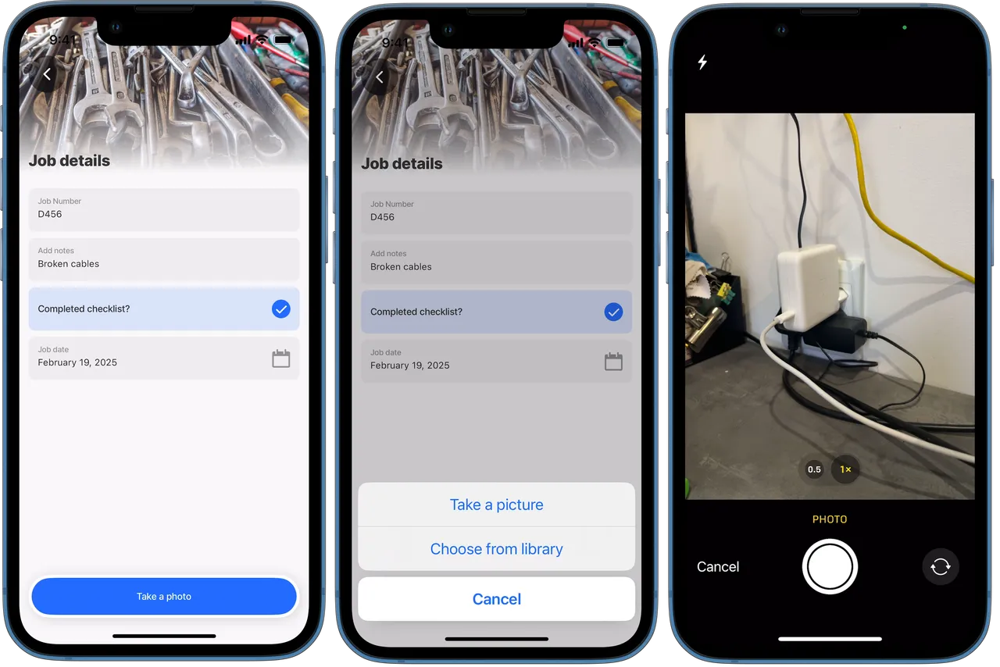

---
layout:
  width: wide
  title:
    visible: true
  description:
    visible: true
  tableOfContents:
    visible: true
  outline:
    visible: true
  pagination:
    visible: true
  metadata:
    visible: true
---

# open-media-picker

This action lets you immediately open the media picker, enabling you to capture images and videos or select media files, then output the selected files.

## Configuration options

<table><thead><tr><th width="154.51171875">Core structure</th><th></th></tr></thead><tbody><tr><td><code>title</code></td><td>Provide a short title to display on the action button. You can use text, an expression or a datasource to set the title.</td></tr><tr><td><code>mediaType</code></td><td>By default the value is set to <code>image</code>. The following options are available for selection: 1) <code>any</code> is for files of any extension such as pdf, jpeg, png, mpeg, txt, or docx. Set to <code>any</code> allows you to take a picture, record a video, select an image or video from the library, or select a document. Using <code>mediaType: any</code> is recommended when uploading multiple media files as it caters for any file type. 2) <code>csv</code> - select CSV files. 3) <code>doc</code> - select DOC or DOCX files. 4) <code>image</code> - used to take a picture or select from the image library. 5) <code>imageAndVideo</code> - take a picture, record a video or select an image or video from the library. 6) <code>pdf</code> - select PDF files. 7) <code>plainText</code> - select plain text files. 8) <code>ppt</code> - select PPT or PPTX files. 9) <code>video</code> - record a video or upload one from the library. 10) <code>xls</code> - select XLS or XLSX files. Configure filters to restrict media types based on your app’s requirements, for example, only allow document files DOC, PDF or plain text. <code>mediaType:</code> <code>- doc</code> <code>- pdf</code></td></tr></tbody></table>

<table><thead><tr><th width="168.33984375">Other options</th><th></th></tr></thead><tbody><tr><td><code>icon</code></td><td>Specify the to display on the action button. The icon only applies to <code>swipeable</code>, <code>secondary</code>, and <a href="../Components/jig-header.md">header</a> actions. Icon setups are not supported on primary actions.</td></tr><tr><td><code>imageCropping</code></td><td><p>You can set any of the following with <code>imageCropping</code> :</p><ul><li><code>isEnabled</code> - allows you to crop an image.</li><li><code>height</code> - maximum allowed is 5000px.</li><li><code>width</code>- maximum allowed is 5000px.</li><li><code>isFreeStyleCropEnabled</code> - when set to <code>true</code> it supports custom cropping to change the size or aspect ratio of an image.</li></ul></td></tr><tr><td><code>imageQuality</code></td><td>Image quality after compression (from 0 to 100, where 100 is the best quality). On iOS, values larger than 80 don't produce a noticeable quality increase in most images, while a value of 80 will reduce the file size by about half or less compared to a value of 100. Default: 100 (Android)/ 80 (iOS).</td></tr><tr><td><code>isHidden</code></td><td>When set to <code>true</code> the action button is hidden.</td></tr><tr><td><code>isMultiple</code></td><td>Set to <code>true</code> allows for multiple files to be added or shown. Set to <code>false</code> allows for a single file.</td></tr><tr><td><code>maximumFileSize</code></td><td><code>maximumFileSize =6 * 1024 * 1024</code> by default. Set the value to <code>none</code> if no size evaluations must be performed. File size format is in bytes. Applies to images and videos.</td></tr><tr><td><code>style</code></td><td><p>Add styling to the action button. More than one can be set to true, evaluation is based on priority.</p><ul><li><code>isDanger</code> - Change the button style to error</li><li><code>isDisabled</code> - Disables the button preventing it from being tapped.</li><li><code>isPrimary</code> - Change style of the button to primary. Default is primary.</li></ul></td></tr></tbody></table>

<table><thead><tr><th width="304.3984375">Outputs</th><th width="117.82421875">Key</th><th>Notes</th></tr></thead><tbody><tr><td><code>=@ctx.actions.instanceId.outputs.</code></td><td>newItems</td><td>string[] Used for newly added items that were successfully uploaded.</td></tr><tr><td><code>=@ctx.actions.instanceId.outputs.</code></td><td>invalidItems</td><td>string[] Used for options that are invalid or failed to upload successfully.</td></tr></tbody></table>

## Considerations

* Files captured using the `media-field` component can be saved to [Dynamic Files](<../Data Providers/Dynamic Files/Dynamic Files.md>) by assigning them to the `file` property of a dynamic data entity, enabling seamless upload and storage in Amazon S3.

## Examples and code snippets

### Open-media-picker to capture an image

In this example, the button opens the media-picker. The configuration is set to take a picture or choose from library. The image is saved to the local database. **Example:** See the full code example in GitHub.

<figure><figcaption></figcaption></figure>


```yaml
title: Job details 
type: jig.default

header:
  type: component.jig-header
  options:
    height: small
    children:
      type: component.image
      options:
        source:
          uri: >
            https://images.unsplash.com/photo-1640682841767-cdfce3aea6e0
            ?w=800&auto=format&fit=crop&q=60&ixlib=rb-4.0.3
            &ixid=M3wxMjA3fDB8MHxzZWFyY2h8MTB8fHBsdW1iZXJ8ZW58MHx8MHx8fDA%3D

children:
  - type: component.form
    instanceId: form-details
    options:
      isDiscardChangesAlertEnabled: false
      children:
        - type: component.text-field
          instanceId: job-number
          options:
            label: Job Number
        - type: component.text-field
          instanceId: job-notes
          options:
            isMultiline: true
            label: Add notes
        - type: component.checkbox
          instanceId: checklist
          options:
            icon: check
            color: positive
            label: Completed checklist?
        - type: component.date-picker
          instanceId: job-date
          options:
            label: Job date
actions:
  - children:
      - type: action.action-list
        options:
          title: Take a photo
          isSequential: true
          actions:
          # Add the media-picker action to open the media modal.
          - type: action.open-media-picker
            # Use an id that is used to reference
            # the action's output when saved as data.
            instanceId: job-photo
            options:
              # Specify the type of media required.
              mediaType: image
          # Use an action to save the images to a data provider.    
          - type: action.execute-entities
            options: 
              provider: DATA_PROVIDER_LOCAL
              method: save
              entity: local-images
              # Use the action's output to reference the image file.
              data: =@ctx.actions.job-photo.outputs      
```

