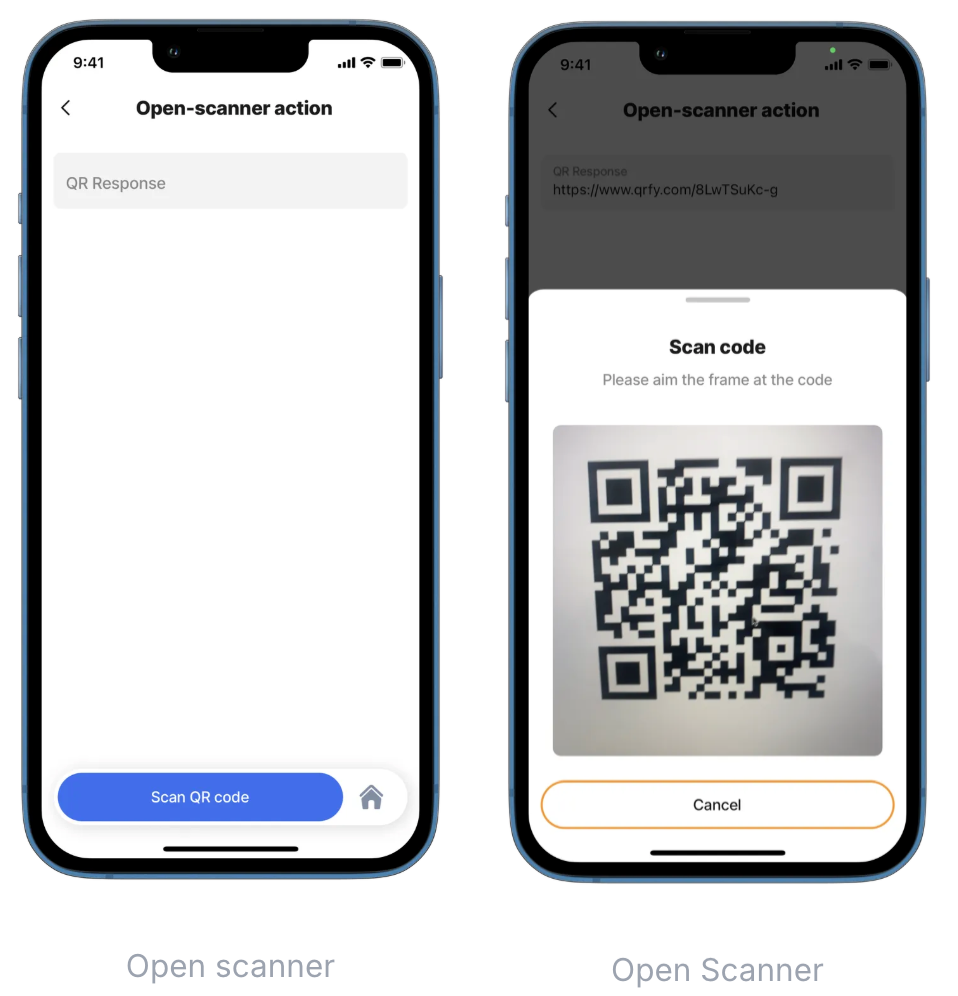
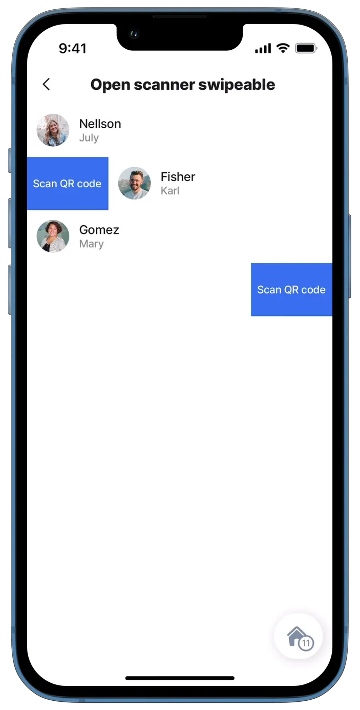
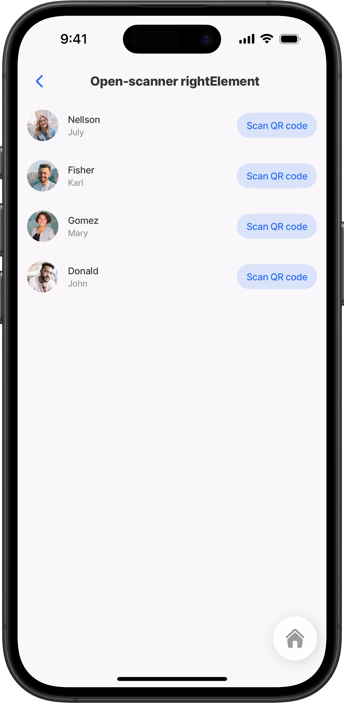
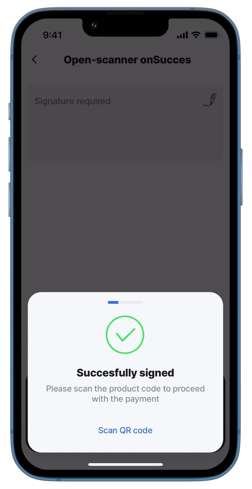

# open-scanner

This action is used to scan a QR code. The `open-scanner` can be used in a list of actions, such as the swipe action and the right element, or with another action where the `open-scanner` action is invoked after the main action is performed, opening access to the camera.

## Configuration options

An `open-scanner` action can be set up in various ways:

1. As a separate action or in the [action-list](action-list.md)
2. As a swipeable action in the left or right direction.
3. As a `rightElement` in the list.
4. As an associated action in the action list.

## Examples and code snippets

### Open-scanner action



<figure><figcaption><p>Open scanner</p></figcaption></figure>



This is an example of using the open-scanner as a stand-alone action. In this case, the button appears at the bottom, and when pressed, it accesses the camera and allows us to scan the QR code.\
\
**Examples**:\
See the full example in [GitHub](https://github.com/jigx-com/jigx-samples/blob/main/quickstart/jigx-samples/jigs/jigx-actions/open-scanner/open-scanner-action.jigx).




```yaml
children:
  - type: component.form
    options:
      children:
        - type: component.text-field
          instanceId: qr-value
          options:
            label: "QR Response"
            initialValue: =@ctx.components.scanner-action.state.value

actions:
  - children:
      - type: action.open-scanner
        instanceId: scanner-action
        options:
          title: "Scan QR code"
          modal:
            title: Scan complete
          onSuccess: 
            type: action.go-back
```


### Open-scanner swipeable left/right



<figure><figcaption><p>Swipe to open scanner</p></figcaption></figure>



This example uses the open-scanner action as a swipeable property. We can choose the swipe direction left or right. After pressing the button, it accesses the camera and allows us to scan the QR code.

**Examples:** See the full example in [GitHub](https://github.com/jigx-com/jigx-samples/blob/main/quickstart/jigx-samples/jigs/jigx-actions/open-scanner/open-scanner-swipeable.jigx).




```yaml
data: =@ctx.datasources.employees-static
item:
  type: component.list-item
  options:
    title: =@ctx.current.item.lastname
    subtitle: =@ctx.current.item.firstname
    leftElement: 
      element: avatar
      text: " "
      uri: =@ctx.current.item.img
    swipeable:
      left:
        - label: Scan QR code 
          onPress:
            type: action.open-scanner
            instanceId: scanner-swipeable-left
            options:
              modal:
                title: Scan complete
              onSuccess: 
                type: action.go-back
      right:
        - label: Scan QR code 
          onPress:
            type: action.open-scanner
            instanceId: scanner-swipeable-right
            options:
              modal:
                title: Scan complete
              onSuccess: 
                type: action.go-back
```


### Open-scanner rightElement



<figure><figcaption><p>Button to open scanner</p></figcaption></figure>



In this example, we use the open-scanner action as the rightElement in the list-item component. There is a button for each item.

**Examples:** See the full example in [GitHub](https://github.com/jigx-com/jigx-samples/blob/main/quickstart/jigx-samples/jigs/jigx-actions/open-scanner/open-scanner-rightElement.jigx).




```yaml
data: =@ctx.datasources.employees-static
item:
  type: component.list-item
  options:
    title: =@ctx.current.item.lastname
    subtitle: =@ctx.current.item.firstname
    leftElement: 
      element: avatar
      text: " "
      uri: =@ctx.current.item.img
    rightElement: 
      element: button
      title: Scan QR code
      onPress:
        type: action.open-scanner
        instanceId: scanner-rightElement
        options:
          modal:
            title: Scan complete
          onSuccess: 
            type: action.go-back
```


### Open-scanner onSuccess



<figure><figcaption><p>Open scanner onSuccess</p></figcaption></figure>



In this example, the open-scanner action is associated with the submit-form action. After we enter the signature and press the "Sign" button, the submit-form action is performed and the action for open-scanner is shown. Access to the camera is not shown automatically. You have to click on "Scan QR code".

**Examples:** See the full example in [GitHub](https://github.com/jigx-com/jigx-samples/blob/main/quickstart/jigx-samples/jigs/jigx-actions/open-scanner/open-scanner-onSuccess.jigx).




```yaml
actions:
  - children:
      - type: action.action-list
        options:
          title: Sign and proceed with the payment
          isSequential: true
          actions:
            - type: action.execute-entity
              options:
                provider: DATA_PROVIDER_DYNAMIC
                entity: default/form
                method: create
                data:
                  signature: =@ctx.components.signature.state.value
                onSuccess:
                  title: Succesfully signed
                  description: Please scan the product code to proceed with the payment
                  actions:
                    - type: action.open-scanner
                      instanceId: scanner-onsuccess
                      options:
                        title: Scan QR code
                        modal:
                          title: Scan complete
                        onSuccess:
                          type: action.go-back
            - type: action.go-back
        
children:
  - type: component.form
    instanceId: send-signature-scan
    options:
      isDiscardChangesAlertEnabled: false
      children:
        - type: component.signature-field
          instanceId: signature
          options:
            label: Signature required
```

