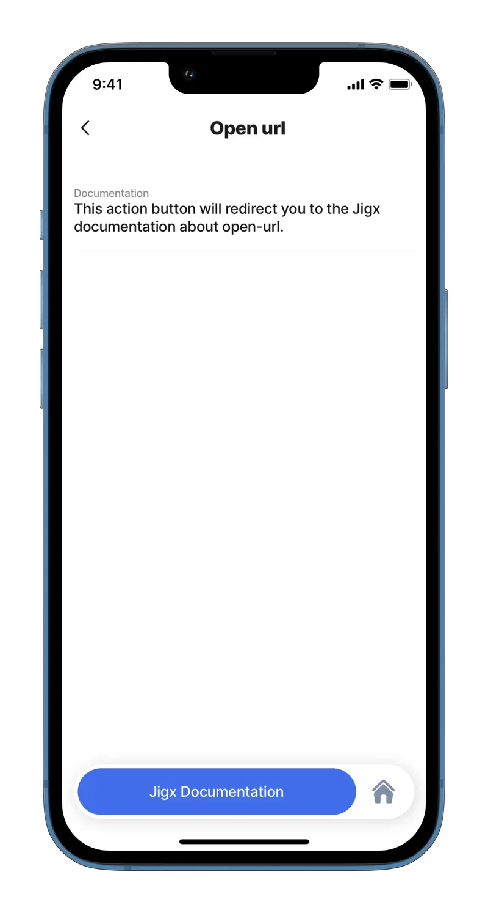
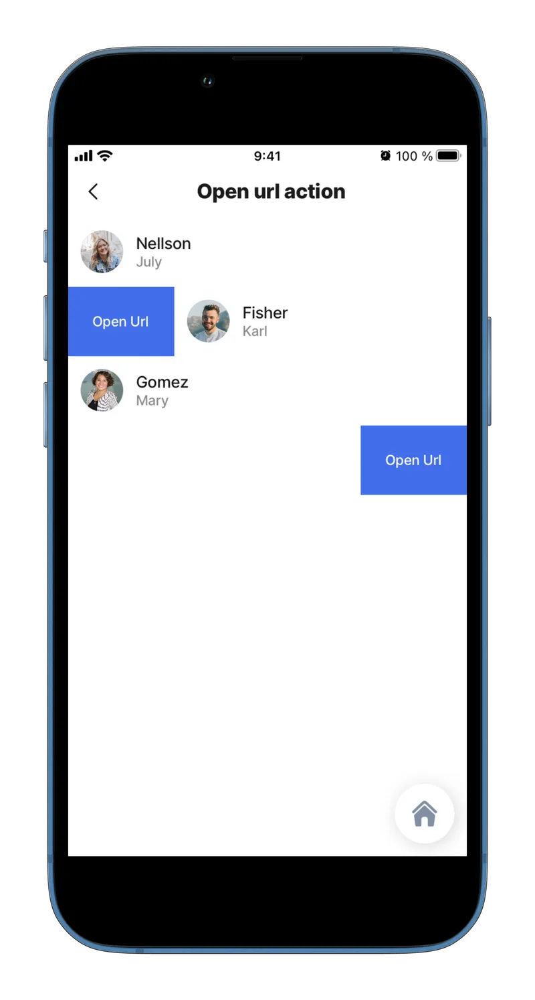
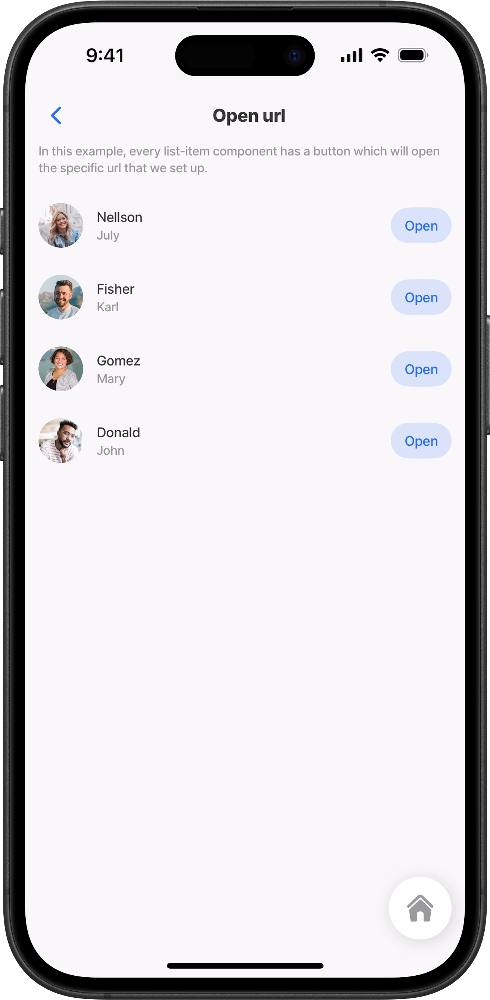
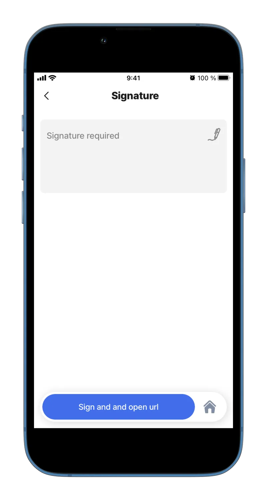
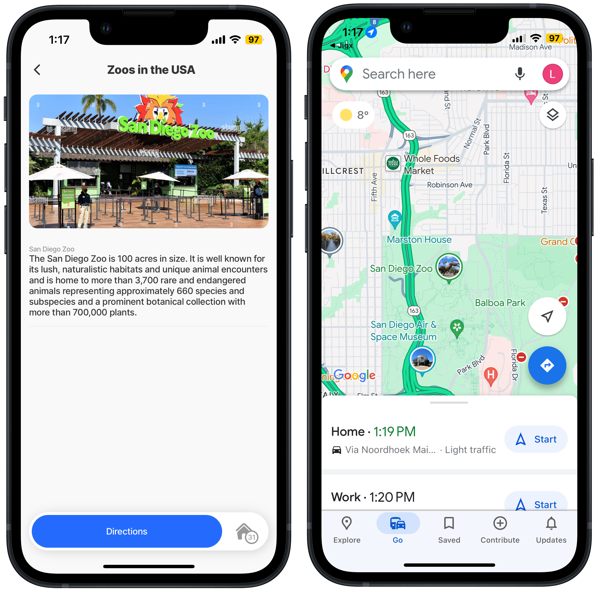

# open-url

This action opens a web page or [deep link](https://docs.jigx.com/building-apps-with-jigx/additional-functionality/deep-links) to an external app. Use `open-url` in an action list, as `swipeable`, as `rightElement`, or after another action completes.

Use the `headers` option to send custom HTTP request headers with the URL request. This is useful for authenticated reports, internal tools, and other protected resources that require headers such as `Authorization` or `x-api-key`.

## Configuration options

An open-url action can be set up in various ways:

1. As a separate action or in the action list.
2. As a `swipeable` action in the left or right direction.
3. As `rightElement` in the list.
4. As an associated action in the action list.



<table><thead><tr><th width="147.0703125">Core structure</th><th></th></tr></thead><tbody><tr><td><code>title</code></td><td>Provide a title for opening the URL, you can use expressions in the title field.</td></tr><tr><td><code>url</code></td><td><p>Specify the URL you want opened. The following formats are supported:</p><p>https://</p><p><a href="open-url.md">www</a>. sitename.com external app link (See the deep link to an external app example)</p></td></tr><tr><td><code>headers</code></td><td><p>Optional key/value map of HTTP request headers sent with the request.</p><p>You can define headers in three ways:</p><ul><li>Literal values, for example <code>x-api-key: test-key-123</code></li><li>Per-key expressions, for example <code>Authorization: ='Bearer ' &#x26; @ctx.solution.state.accessToken</code></li><li>A top-level expression that returns an object, for example <code>headers: =@ctx.datasources.config.authHeaders</code></li></ul><p>When <code>headers</code> are present, HTTP and HTTPS URLs open in an in-app browser presented as a full-screen bottom sheet on both iOS and Android.</p></td></tr></tbody></table>

## Considerations

* When `headers` are not provided, `open-url` keeps the existing platform behavior.
* When `headers` are provided, HTTP and HTTPS URLs open in an in-app WebView browser on both iOS and Android.
* The in-app browser follows the active app theme, including light and dark mode.
* Deep links such as `tel:`, `mailto:`, and app-specific schemes are not affected and continue to open normally.
* HTTP headers can propagate through server-side redirects. Only send secrets to URLs you trust not to redirect to untrusted hosts.
* On iOS, the App Tracking Transparency prompt applies to the standard in-app browser flow. It is skipped when `headers` are present.

## Examples and code snippets

### open-url as an action



<figure><figcaption><p>Open URL</p></figcaption></figure>



The simplest example of using an open-url action is to use it as a separate action. Thanks to this, a button will appear at the bottom, which, when pressed, will open the specific URL that we set up.

**Example:** See the full example in <[GitHub](https://github.com/jigx-com/jigx-samples/blob/main/quickstart/jigx-samples/jigs/jigx-actions/open-url/open-url-action.jigx).



```yaml
actions:
  - children:
      - type: action.open-url
        options:
          title: Jigx Documentation
          url: https://docs.jigx.com/examples/readme/actions/open-url
```

### open-url with custom headers

Use `https://httpbingo.org/headers` to verify which headers are sent. The page echoes the received headers as JSON. In the in-app browser, enable **Pretty-print** to make the JSON easier to read.



```yaml
actions:
  - children:
      - type: action.open-url
        options:
          title: Open protected page
          url: https://httpbingo.org/headers
          headers:
            x-api-key: test-key-123
            x-tenant: acme
```



```yaml
actions:
  - children:
      - type: action.open-url
        options:
          title: Open report
          url: https://httpbingo.org/headers
          headers:
            Authorization: ='Bearer ' & @ctx.solution.state.accessToken
```



```yaml
datasources:
  apiHeaders:
    type: datasource.static
    options:
      data:
        - x-api-key: test-key-123

actions:
  - children:
      - type: action.open-url
        options:
          title: Open protected page
          url: https://httpbingo.org/headers
          headers: =@ctx.datasources.apiHeaders[0]
```



### open-url with headers and a redirect

When a URL redirects on the server, the in-app browser follows the redirect without hanging. Headers continue through the redirect chain as part of the platform networking behavior.

```yaml
actions:
  - children:
      - type: action.open-url
        options:
          title: Open redirected page
          url: https://httpbingo.org/redirect-to?url=https%3A%2F%2Fhttpbingo.org%2Fheaders
          headers:
            x-api-key: test-key-123
```

### open-url swipeable left/right



<figure><figcaption><p>Swipe to open URL</p></figcaption></figure>



This example uses the open-url action as a swipeable property. We can choose the swipe direction left or right. After pressing the button, it will open the specific url that we set up.

**Example:** See the full example in [GitHub](https://github.com/jigx-com/jigx-samples/blob/main/quickstart/jigx-samples/jigs/jigx-actions/open-url/open-url-swipeable.jigx).



```yaml
item:
  type: component.list-item
  options:
    title: =@ctx.current.item.lastname
    subtitle: =@ctx.current.item.firstname
    leftElement: 
      element: avatar
      text: " "
      uri: =@ctx.current.item.img
    swipeable:
      left:
        - label: Open Url 
          onPress:
            type: action.open-url
            options:
              url: https://docs.jigx.com/examples/readme/actions/open-url
      right:
        - label: Open Url 
          onPress: 
            type: action.open-url
            options:
              url: https://docs.jigx.com/examples/readme/actions/open-url
```

### open-url rightElement



<figure><figcaption><p>Button to open URL</p></figcaption></figure>



In this example, we use the open-url action as the rightElement in the list-item component. There is a button for each item.

**Example:** See the full example in [GitHub](https://github.com/jigx-com/jigx-samples/blob/main/quickstart/jigx-samples/jigs/jigx-actions/open-url/open-url-right-element.jigx).



```yaml
item:
  type: component.list-item
  options:
    title: =@ctx.current.item.lastname
    subtitle: =@ctx.current.item.firstname
    leftElement: 
      element: avatar
      text: " "
      uri: =@ctx.current.item.img
    rightElement: 
      element: button
      title: Open
      onPress:
        type: action.open-url
        options:
          url: https://docs.jigx.com/examples/readme/actions/open-url
```

### open-url onSuccess



<figure><figcaption><p>Open URL onSuccess</p></figcaption></figure>



n this example, the open-url action is associated with the submit-form action. After we enter the signature and press the "Sign" button, the submit-form action is performed and the specific url will be opened.

**Example:** See the full example in [GitHub](https://github.com/jigx-com/jigx-samples/blob/main/quickstart/jigx-samples/jigs/jigx-actions/open-url/open-url-on-success.jigx).




```yaml
actions:
  - children:
      - type: action.action-list
        options:
          title: Sign and go to documentation
          isSequential: true
          actions:
            - type: action.execute-entity
              options:
                provider: DATA_PROVIDER_DYNAMIC
                entity: default/form
                method: create
                data:
                  signature: =@ctx.components.signature.state.value
                onSuccess: 
                  title: Succesfully signed
                  actions:
                    - type: action.open-url
                      options:
                        title: Open the documentation
                        url: https://docs.jigx.com/examples
            - type: action.go-back
```


### Use open-url to deep link to an external app



In this example, the `action.open-url` is used with a deep link that opens the Google Maps app to a specific location. There are two code examples, one for iOS and the other for Andriod.



<figure><figcaption><p>Open Google Maps</p></figcaption></figure>





```yaml
title: Zoos in the USA
type: jig.default

actions:
  - children:
      - type: action.open-url #iOS
        options:
          title: Directions
          # Add the external app's iOS deep link in the url    
          url: comgooglemaps://?center=32.7347483943,-117.150943196&zoom=14
    
children:
  - type: component.image
    options:
      source:
        uri: https://c8.alamy.com/comp/2GFT773/san-diego-california-25-aug-2021-san-diego-zoo-main-entrance-in-balboa-park-2GFT773.jpg
  - type: component.entity
    options:
      children:
        - type: component.entity-field
          options:
            label: San Diego Zoo
            value: The San Diego Zoo is 100 acres in size. It is well known for its lush, naturalistic habitats and unique animal encounters and is home to more than 3,700 rare and endangered animals representing approximately 660 species and subspecies and a prominent botanical collection with more than 700,000 plants.
```



```yaml
title: Zoos in the USA
type: jig.default

actions:
  - children:  
      - type: action.open-url #android
        options:
          title: Directions
          # Add the external app's Android deep link in the url
          url: google.navigation:q=2920+Zoo+Dr,San+Diego,CA+92101,United+States
      
children:
  - type: component.image
    options:
      source:
        uri: https://c8.alamy.com/comp/2GFT773/san-diego-california-25-aug-2021-san-diego-zoo-main-entrance-in-balboa-park-2GFT773.jpg
  - type: component.entity
    options:
      children:
        - type: component.entity-field
          options:
            label: San Diego Zoo
            value: |
             The San Diego Zoo is 100 acres in size.
             It is well known for its lush, naturalistic habitats and unique animal encounters
             and is home to more than 3,700 rare and endangered animals representing approximately
             660 species and subspecies and a prominent botanical collection with more than 700,000 plants.
```


