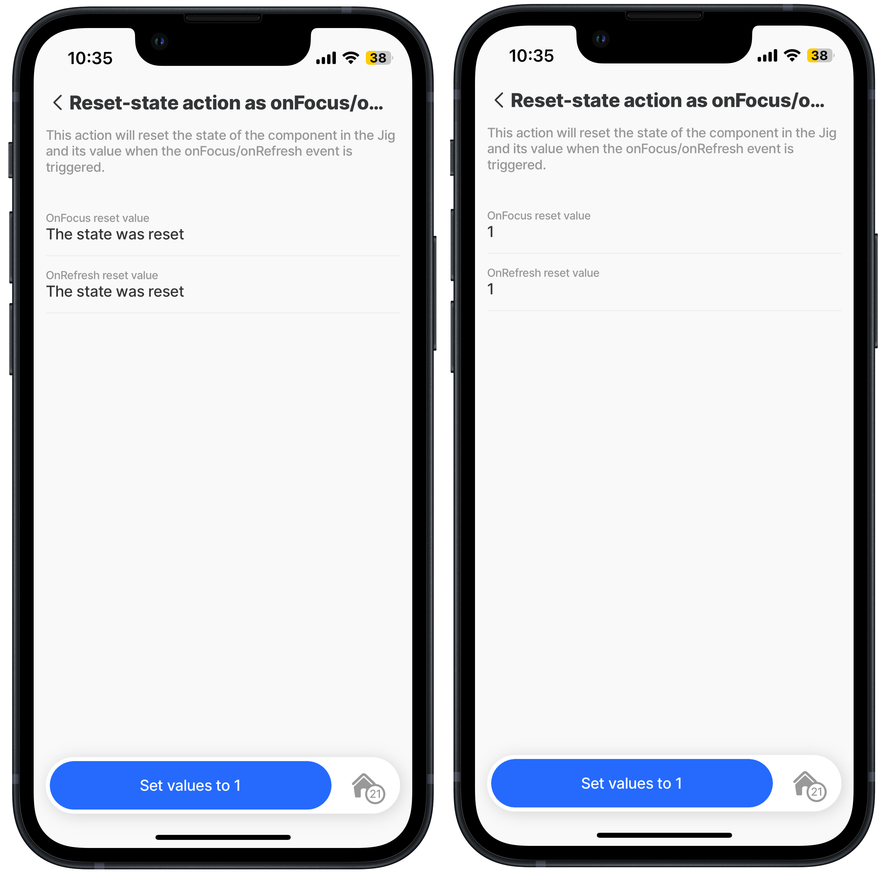
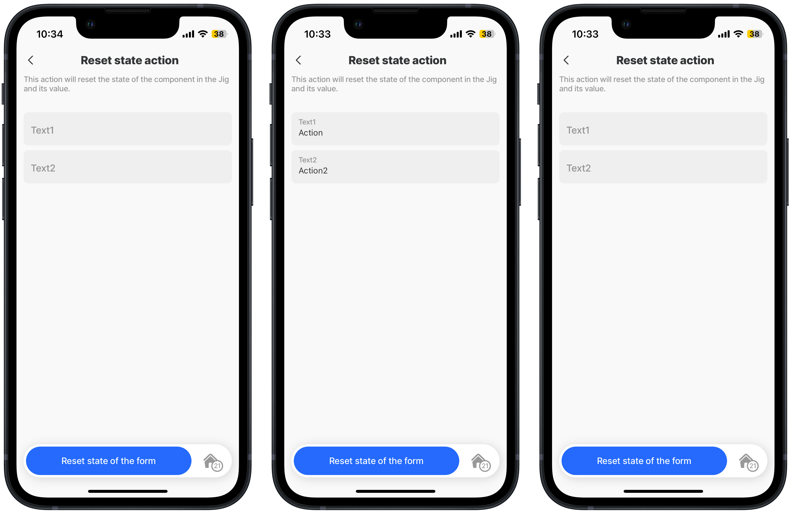
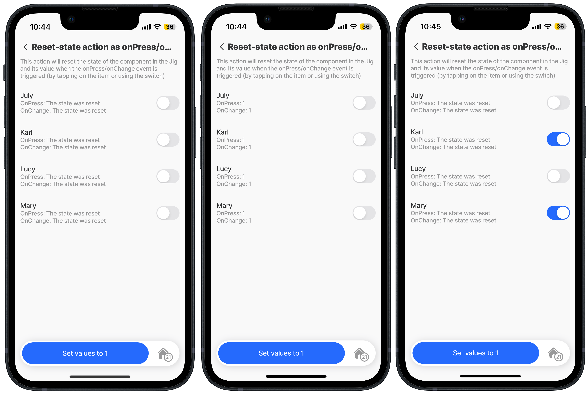

# reset-state

`Reset-state` action is typically used to reset the state of the key inside the jig file and can be used further to reset the state of UI components and forms. To understand how to use states, see [State](https://docs.jigx.com/state).

## Configuration options

There are multiple ways to set up a reset-state action within a jig:

1. As `onFocus` action that will be executed.
2. As `onRefresh` action that will be executed.
3. As the main action on the jig, and when you press the action, the `reset-state` action will be executed.
4. The `onPress` and `onChange` actions will be executed when you trigger the `onPress` or `onChange` event.

## Examples and code snippets

### reset-state onFocus/onRefresh

<figure><figcaption><p>Reset-state onFocus/onRefresh</p></figcaption></figure>

1. Reset-state action is used when the onFocus/onRefresh event is triggered to reset the component's state or key.
2. You can specify instanceId, this will be the name of the UI component.
3. And you need to specify the key, which will be the value of the UI component or the name of the key that you want to reset.

**Example:** See the full example in [GitHub](https://github.com/jigx-com/jigx-samples/blob/main/quickstart/jigx-samples/jigs/jigx-actions/reset-state/static-data/reset-state-focus-load-refresh.jigx).



```yaml
onFocus:
  type: action.reset-state
  options:
    state: =@ctx.solution.state.onFocus-key
```



```yaml
onRefresh:
  type: action.reset-state
  options:
    state: =@ctx.solution.state.onRefresh-key
```



### reset-state as action

<figure><figcaption><p>Reset-state action</p></figcaption></figure>

1. Reset-state action is used as the primary action on the jig, to reset-state of the component in the jig and its value.
2. You can specify **instanceId**, this will be the name of the UI component
3. And you need to specify the **key**, which will be the value of the UI component that you want to reset

**Example:**

See the full example in [GitHub](https://github.com/jigx-com/jigx-samples/blob/main/quickstart/jigx-samples/jigs/jigx-actions/reset-state/static-data/reset-state-action-form.jigx).


```yaml
actions:
  - children:
      - type: action.reset-state
        options:
          title: Reset state of the form
          state: =@ctx.components.form.state.data
```


### reset-state onPress/onChange

<figure><figcaption><p>Reset-state onPress/onChange</p></figcaption></figure>

1. Reset-state action used on the list as **onPress** or **onChange** action, to reset-state of the component.
2. You can specify instanceId, this will be the name of the UI component.
3. And you need to specify the **state**, which will be the value of the UI component that you want to reset

**Example:**

See the full example in [GitHub](https://github.com/jigx-com/jigx-samples/blob/main/quickstart/jigx-samples/jigs/jigx-actions/reset-state/static-data/reset-state-onpress-onchange.jigx).



```yaml
onPress:
  type: action.reset-state
  options:
    state: =@ctx.solution.state.onPress-key
```



```yaml
onChange:
  type: action.reset-state
  options:
    state: =@ctx.solution.state.onChange-key
```


