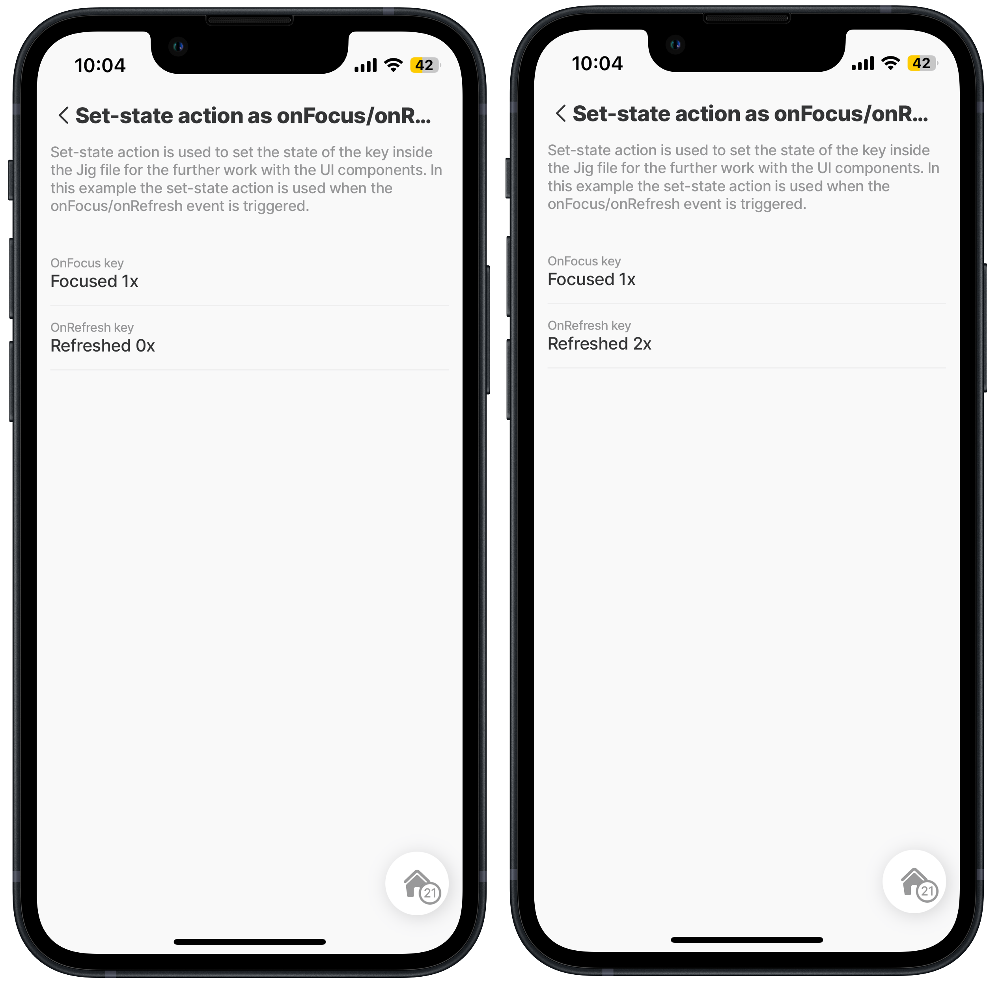
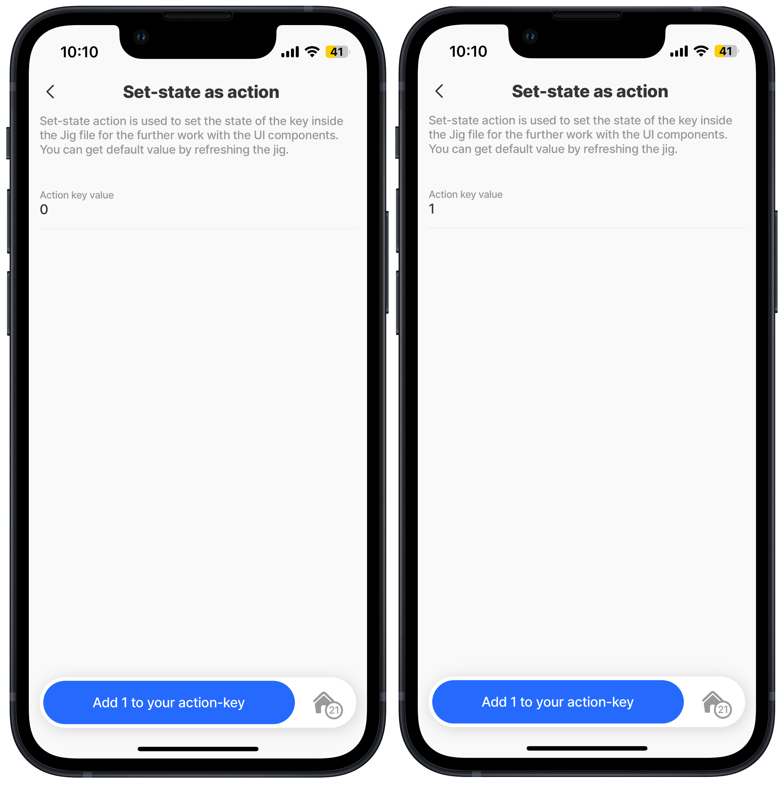
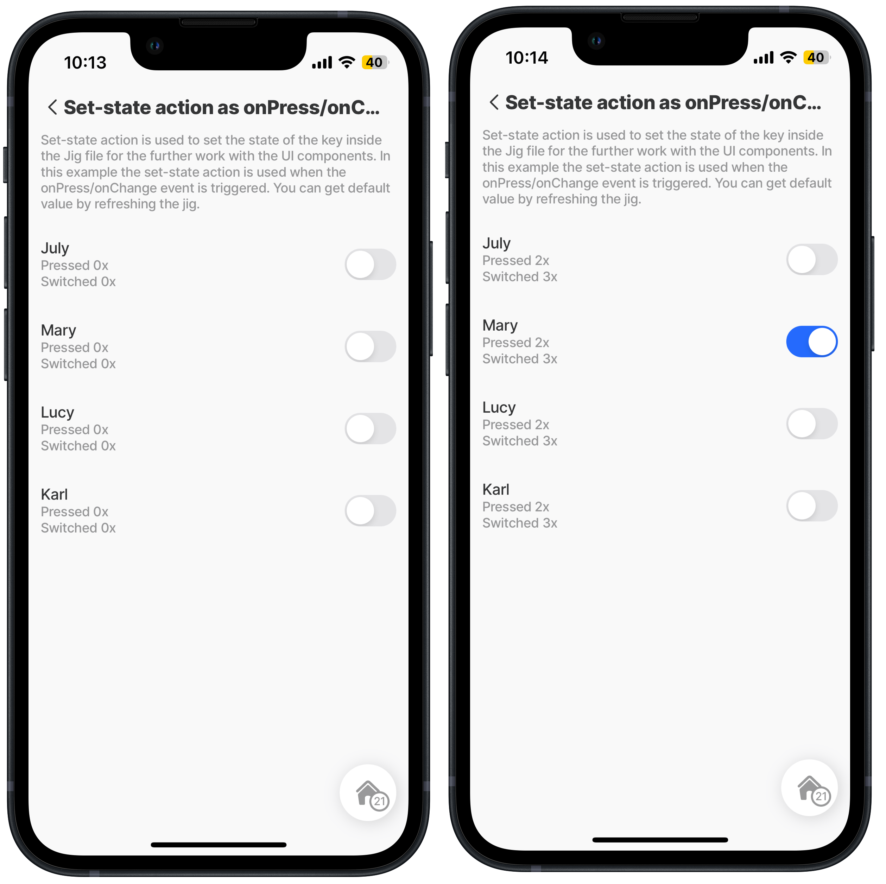

---
layout:
  width: wide
  title:
    visible: true
  description:
    visible: true
  tableOfContents:
    visible: true
  outline:
    visible: true
  pagination:
    visible: true
  metadata:
    visible: true
---

# set-state

The `set-state` action sets the global state (also called the solution state). Multiple components and jigs can access the state's value across the solution. Effectively managing the global state ensures that all parts of the app that depend on this data are updated consistently. To understand how to use states, see [State](https://docs.jigx.com/building-apps-with-jigx/logic/state).

## Configuration options

A `set-state` action can be set up in various ways:

1. As `onFocus` action that will be executed.
2. As `onRefresh` action that will be executed.
3. As the main action on the jig, and when you press the action, the `set-state` action will be executed.
4. The `onPress` and `onChange` actions will be executed when you trigger these events.

## Examples and code snippets

### set-state as onFocus/onRefresh

<figure><figcaption><p>Count triggers with set-sate</p></figcaption></figure>

Set state action is used when the onFocus/onRefresh event is triggered and a count is shown of the number of triggers.

See the example in [GitHub](https://github.com/jigx-com/jigx-samples/blob/main/quickstart/jigx-samples/jigs/jigx-actions/set-state/static-data/set-state-focus-refresh.jigx).



```yaml
onFocus: 
  type: action.set-state
  options:
    state: =@ctx.solution.state.onFocus-key
    value: =@ctx.solution.state.on-focus-key +1 
```



```yaml
onRefresh: 
  type: action.set-state
  options:
    state: =@ctx.solution.state.onRefresh-key
    value: =@ctx.solution.state.on-refresh-key +1
```



### set-state as action

<figure><figcaption><p>Set-state action</p></figcaption></figure>

Set-state action is used as the primary action on the jig, to set the value of the action-key to +1.

See the example in [GitHub](https://github.com/jigx-com/jigx-samples/blob/main/quickstart/jigx-samples/jigs/jigx-actions/set-state/static-data/set-state-action.jigx).


```yaml
actions:
  - children:
      - type: action.set-state
        options:
          title: Add 1 to your action-key
          state: =@ctx.solution.state.action-key
          value: =@ctx.solution.state.action-key +1
```


### set-state as onPress/onChange

<figure><figcaption><p>Set-state onPress/onChange</p></figcaption></figure>

Set-state action used on the list as onPress/onChange action, to set the value of the key to +1.

See the example in [GitHub](https://github.com/jigx-com/jigx-samples/blob/main/quickstart/jigx-samples/jigs/jigx-actions/set-state/static-data/set-state-onpress-onchange.jigx).



```yaml
onPress: 
  type: action.set-state
  options:
    state: =@ctx.solution.state.onPress-key
    value: =@ctx.solution.state.on-press-key +1
```



```yaml
onChange: 
  type: action.set-state
  options:
    state: =@ctx.solution.state.onChange-key
    value: =@ctx.solution.state.on-change-key +1


::
::::
```


