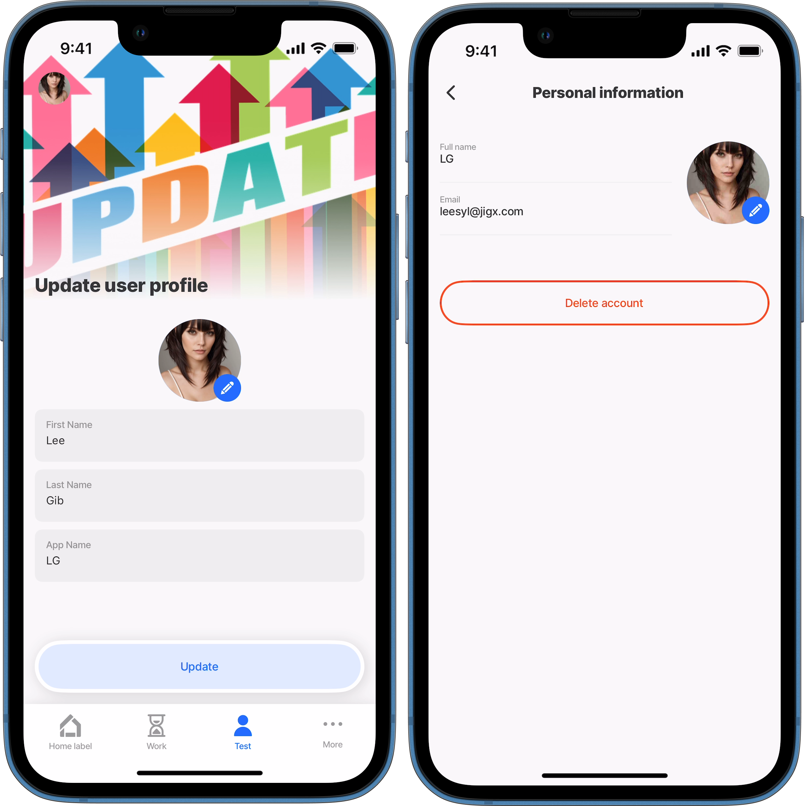
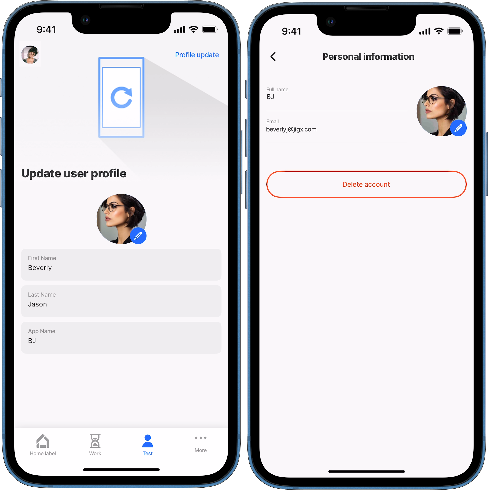
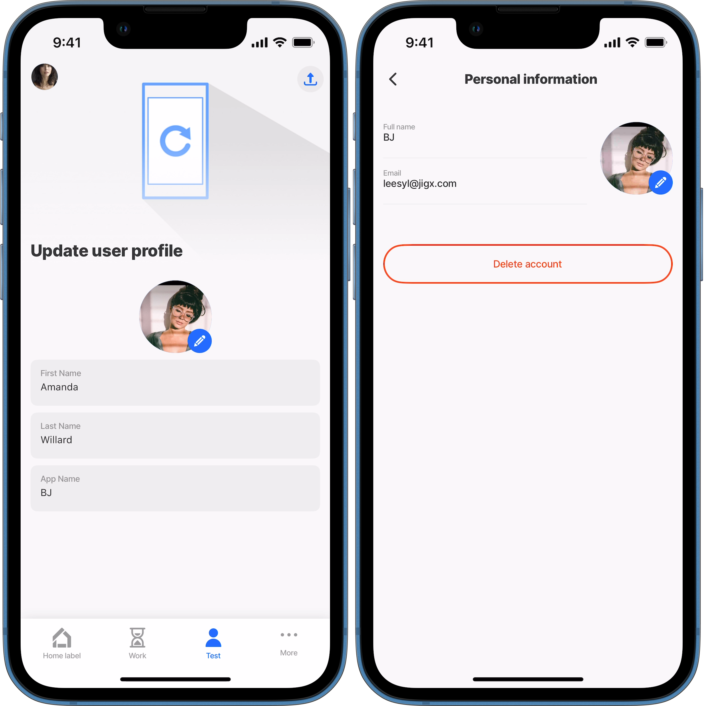

---
layout:
  width: wide
  title:
    visible: true
  description:
    visible: true
  tableOfContents:
    visible: true
  outline:
    visible: true
  pagination:
    visible: true
  metadata:
    visible: true
---

# update-profile

This action allows users to update specific information about themselves, which is displayed on the app's profile screen.

This action can be configured within a jig in various ways, such as: An action button A header action link or icon An event, e.g., `onPress`

## Configuration options

Some properties are common to all components, see [Common component properties](update-profile.md) for a list and their configuration options.

<table><thead><tr><th width="142.3046875">Core structure</th><th></th></tr></thead><tbody><tr><td><code>instanceId</code></td><td>Provide the action with an <code>instanceId</code>.</td></tr><tr><td><code>avatarUrl</code></td><td>Configure the property with an expression, datasource, or input to update the user's avatar.</td></tr><tr><td><code>displayName</code></td><td>Configure the property with an expression, datasource, or input to update the user's preferred name, for example, Rob instead of Robert.</td></tr><tr><td><code>firstName</code></td><td>Configure the property with an expression, datasource, or input to update the user's last name (surname).</td></tr><tr><td><code>lastName</code></td><td>Configure the property with an expression, datasource or input to update the user's name.</td></tr><tr><td><code>title</code></td><td>Defines the title for the action button, such as Update your details.</td></tr></tbody></table>

## Examples and code snippets

### Update-profile button in a jig



<figure><figcaption><p>Update Profile details</p></figcaption></figure>



This example demonstrates how a form captures basic personal information and updates the profile screen when the user taps the 'Update' button, which triggers the `action.update-profile`.




```yaml
title: Update user profile
type: jig.default

header:
  type: component.jig-header
  options:
    height: medium
    children:
      type: component.image
      options:
        source:
          uri: https://cdn.pixabay.com/photo/2016/09/15/18/28/update-1672346_640.png
# Use a form to capture the user's profile details.
children:
  - type: component.form
    instanceId: user
    options:
      isDiscardChangesAlertEnabled: false
      children:
        - type: component.avatar-field
          instanceId: user-avatar
          options:
            label: Photo
        - type: component.text-field
          instanceId: firstName
          options:
            label: First Name
        - type: component.text-field
          instanceId: LastName
          options:
            label: Last Name    
        - type: component.text-field
          instanceId: displayName
          options:
            label: App Name    
actions:
  - children:
       # Configure the action to save the details captured in the form.
      - type: action.update-profile
        options: 
          lastName: =@ctx.components.LastName.state.value
          firstName: =@ctx.components.firstName.state.value
          displayName: =@ctx.components.displayName.state.value
          avatarUrl: =@ctx.components.user-avatar.state.value
          style:
            # Style the button to use the secondary button color.
           isSecondary: true
          # Provide text that displays on the action button.
          title: Update
```


### Update-profile in a jig-header link



This example demonstrates how a form captures basic personal information and updates the profile screen when the user taps the _Profile Update_ link in the `jig-header`, which triggers the `action.update-profile`.



<figure><figcaption><p>Update profile -header link</p></figcaption></figure>




```yaml
title: Update user profile
type: jig.default
# In the header add the action to to update the profile screen.
header:
  type: component.jig-header
  options:
    height: medium
    children:
      type: component.image
      options:
        source:
          uri: https://cdn.pixabay.com/photo/2018/04/12/18/13/application-3314290_640.png
    actions:
      # Configure the action to save the details captured in the form.
      - type: action.update-profile
        options: 
          title: Profile update
          lastName: =@ctx.components.LastName.state.value
          firstName: =@ctx.components.firstName.state.value
          displayName: =@ctx.components.displayName.state.value
          avatarUrl: =@ctx.components.user-avatar.state.value

children:
  # Use a form to capture the user's profile details.
  - type: component.form
    instanceId: user
    options:
      isDiscardChangesAlertEnabled: false
      children:
        - type: component.avatar-field
          instanceId: user-avatar
          options:
            label: Photo
        - type: component.text-field
          instanceId: firstName
          options:
            label: First Name
        - type: component.text-field
          instanceId: LastName
          options:
            label: Last Name    
        - type: component.text-field
          instanceId: displayName
          options:
            label: App Name    
```


### Update-profile in a jig-header icon



<figure><figcaption><p>Update profile - header icon</p></figcaption></figure>



This example demonstrates how a form captures basic personal information and updates the profile screen when the user taps the _icon_ in the `jig-header`, which triggers the `action.update-profile`.




```yaml
title: Update user profile
type: jig.default
# In the header add the action to to update the profile screen.
header:
  type: component.jig-header
  options:
    height: medium
    children:
      type: component.image
      options:
        source:
          uri: https://cdn.pixabay.com/photo/2018/04/12/18/13/application-3314290_640.png
   # Configure the action to save the details captured in the form.
    actions:
      - type: action.update-profile
        options: 
          # Add an icon to display in the header that the user can tap to 
          # execute the action.
          icon: upload-bottom
          title: Profile update
          lastName: =@ctx.components.LastName.state.value
          firstName: =@ctx.components.firstName.state.value
          displayName: =@ctx.components.displayName.state.value
          avatarUrl: =@ctx.components.user-avatar.state.value

children:
  # Use a form to capture the user's profile details.
  - type: component.form
    instanceId: user
    options:
      isDiscardChangesAlertEnabled: false
      children:
        - type: component.avatar-field
          instanceId: user-avatar
          options:
            label: Photo
        - type: component.text-field
          instanceId: firstName
          options:
            label: First Name
        - type: component.text-field
          instanceId: LastName
          options:
            label: Last Name    
        - type: component.text-field
          instanceId: displayName
          options:
            label: App Name    
```


### Update-profile with onPress event



This example demonstrates how to use the `onPress` event with `action.update-profile` in a `list-item` to update the first and last names. The names come from a datasource and the avatar from a `form` containing an `avatar` component.



<figure><figcaption><p>Update profile - onPress</p></figcaption></figure>





```yaml
title: Update user profile
type: jig.default

header:
  type: component.jig-header
  options:
    height: medium
    children:
      type: component.image
      options:
        source:
          uri: https://cdn.pixabay.com/photo/2018/04/12/18/13/application-3314289_640.png

children:
  - type: component.list-item
    options:
      title: Today's contractor on site
      subtitle: =(@ctx.datasources.contractors.firstName & ' ' & @ctx.datasources.contractors.lastName)
      rightElement: 
        element: button
        title: Update
        # Use the onPress event to update the profile details.
        # Configure the action to save the photo captured in the form.
        # The first and last names are updated from a datasource.
        onPress: 
          type: action.update-profile
          options:
            firstName: =@ctx.datasources.contractors.firstName
            lastName: =@ctx.datasources.contractors.lastName
            displayName: =@ctx.datasources.contractors.displayName
            avatarUrl: =@ctx.components.user-avatar.state.value
  # Use a form to capture the user's avatar.
  - type: component.form
    instanceId: user
    options:
      isDiscardChangesAlertEnabled: false
      children:
        - type: component.avatar-field
          instanceId: user-avatar
          options:
            label: Photo
```



```yaml
datasources:
  contractors:
    type: datasource.static
    options:
      data:
        - id: 1
          lastName: Russel
          firstName: Robert
          displayName: Rob
```


