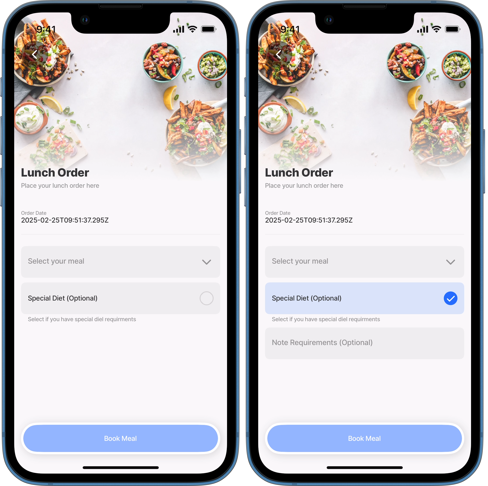
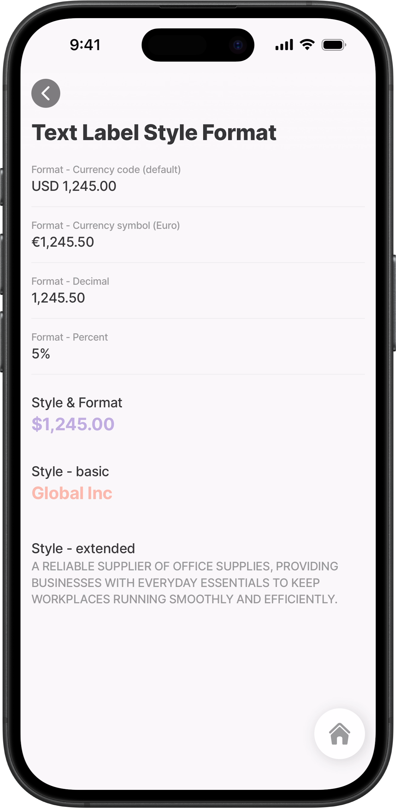

# Common component properties

Some properties are shared across most Jigx components.

* [`when`](<Common component properties.md#when>)
* [`color`](<Common component properties.md#colors>)
* [#text-or-label](<Common component properties.md#text-or-label> "mention")

### When

Use `when` to show or hide a component conditionally. It’s also used on actions to conditionally allow execution.

#### Accepted values

* `when: true` (always visible / always enabled)
* `when: false` (always hidden / never enabled)
* `when: <expression>` where the expression returns a boolean


Hiding a component does not automatically change validation rules. If a field can be hidden, keep `isRequired: false` or make requirement conditional too.


#### Example and code snippet

This example displays how the `when` property is used at a component level to display a `component.text-field` (Note requirements) only when the `component.checkbox` (Special Diet) is selected.

<figure><figcaption><p>When-Display a field</p></figcaption></figure>



```yaml
title: Lunch Order
description: Place your lunch order here
type: jig.default

header:
  type: component.jig-header
  options:
    height: medium
    children:
      type: component.image
      options:
        source:
          uri: >
            https://images.unsplash.com/photo-1543352634-99a5d50ae78e
            ?ixlib=rb-4.0.3&ixid=M3wxMjA3fDB8MHxwaG90by1wYWdlfHx8fGVufDB8fHx8fA%3D%3D
            &auto=format&fit=crop&w=1171&q=80
children:
  - type: component.entity
    options:
      children:
        - type: component.entity-field
          options:
            label: Order Date
            value: =$now()
  - type: component.form
    instanceId: MealSelection
    options:
      children:
        - type: component.dropdown
          instanceId: Meal
          options:
            label: Select your meal
            data: =@ctx.datasources.meals
            item:
              type: component.dropdown-item
              options:
                title: =@ctx.current.item.meal
                value: =@ctx.current.item.meal
        - type: component.checkbox
          instanceId: SpecialDiet
          options:
            label: Special Diet
            helperText: Select if you have special diet requirements
            isRequired: false
        - type: component.text-field
          instanceId: SpecialDietDescp
          # When the checkbox is selected the text-field is shown.
          when: =@ctx.components.SpecialDiet.state.value = true ? true:false
          options:
            label: Note Requirements
            isMultiline: true
            isRequired: false
actions:
  - children:
      - type: action.submit-form
        options:
          formId: MealSelection
          provider: DATA_PROVIDER_DYNAMIC
          title: Book Meal
          entity: default/meal-selection
          method: create
          onSuccess:
            type: action.go-back
```



```yaml
datasources:
  meals:
    type: datasource.static
    options:
      data:
        - id: 1
          meal: Beef Lasagne
        - id: 2
          meal: Chicken Wrap
        - id: 3
          meal: Tuna Pasta
        - id: 4
          meal: Toasted Ham Cheese and Tomato
        - id: 5
          meal: Flapjacks with Fresh Berries
```



***

### Colors

**Applying colors based on specific conditions**: Colors can be configured based on specific conditions. For example, a payment amount exceeding a certain threshold can be displayed in red. However, conditional color configurations are only available in areas that support conditions, such as list items. In contrast, direct color options are more widely supported, for example, `lists` allow both conditional and direct setups, whereas `interactive-images` only support direct options. Additionally, certain areas restrict the available color choices, while UI elements support the predefined set of fourteen colors.

* When configuring the `color` property, select the `color condition` option.
* Under the `when` property, add an expression that defines the condition under which the specified color should be applied.

#### Conditional color



```yaml
color:
  - when: =@ctx.current.item.registered = true
    color: color2
  - when: =@ctx.current.item.registered = false
    color: color4
```



```yaml
options:
  color: color2
```




Use the `color1`- `color14` values available in the UI theme. Availability can vary by component.


***

#### Text or Label



Many Jigx components support configurable `text` and `label` properties to control how text is localized, formatted, and styled. Depending on the component, one or more of the options below may be available.&#x20;





<figure><figcaption><p>Style and formatting</p></figcaption></figure>




Use IntelliSense in your editor to discover which text options are supported for a specific component.


<details>

<summary>Text with Locale - Text that can be translated</summary>

`Text with Locale` defines text that can be translated using localization `keys` or localized `values`. See [localization](https://docs.jigx.com/building-apps-with-jigx/additional-functionality/localization) to learn how to configure different languages.

**Usage:**

* This option is typically used for static `labels` or `titles` that must adapt to the user’s language.
* The `value` may be static or dynamically resolved.
* The localized `value` can be formatted according to the language, for example, currency or date and time format.

**Example:**


```yaml
- type: component.entity-field
              options:
                label: Localized Text (Expression)
                value:
                # Text with locale configured
                  id: example-dynamic
                  values:
                    name: =@ctx.user.displayName
                    time: =$fromMillis($millis(),'[P]')
                    date:  =$fromMillis($millis(),'[D]') 
```


For format properties see [#text-with-format-text-that-can-be-evaluated-translated-and-formatted](<Common component properties.md#text-with-format-text-that-can-be-evaluated-translated-and-formatted> "mention")


```yaml
- type: component.entity
          options:
            children:
            - type: component.entity-field
              options:
                label: Localized Text (Expression)
                value:
                  # Text with locale configured.
                  id: example-dynamic
                  values:
                    name: =@ctx.user.displayName
                    time: =$fromMillis($millis(),'[P]')
                    date:  
                      # Text with formatting add to the locale config. 
                      text: =$fromMillis($millis(),'[D]') 
                      format:
                        dateFormat: 
                          ll 
```


</details>

<details>

<summary>Text with Format -Text that can be evaluated, translated, and formatted</summary>

Formatting rules such as `currency`, `date`, `decimal`, `percent`, or `units` can be applied,  the default is `decimal`.Text formatting is supported inside localization `values`. Various format properties can be configured to get the required format

**Usage:**

* The `text` value is dynamic
* A specific formatting type required
* Formatting should be applied based on locale

**Properties:**

<table><thead><tr><th width="108.7890625">Category</th><th width="150.53125">Properties</th><th>Example</th></tr></thead><tbody><tr><td>Currency</td><td><code>currency</code><br></td><td>Used for general monetary values, it includes a currency code and two decimal places. Default is USD. Result is $1,245.00</td></tr><tr><td></td><td><code>currencyDisplay</code></td><td><p>It is used only when <code>numberStyle</code> is set to <code>currency</code> and is one of the following values:</p><ul><li><code>code</code>: ISO 4217 alphabetic currency code</li><li><code>symbol</code>: localized currency symbol, such as $.</li><li><code>narrowSymbol</code>: narrow format symbol ($100 rather than US$100).</li><li><code>name</code>: localized currency name, such as dollar.</li></ul></td></tr><tr><td></td><td><code>currencySign</code></td><td>Is set to either <code>standard</code> (default) or <code>accounting</code>, specifying whether to render negative numbers in accounting format, often signified by parentheses. It is used only when <code>numberStyle</code> is <code>currency</code>.</td></tr><tr><td>Date</td><td><code>dateFormat</code></td><td><p>What format will be used to display the value (example: MM/DD/YYYY).</p><ul><li><code>default</code>: LL</li><li><code>LT</code>: 3:28 PM</li><li><code>LTS</code>: 3:28:57 PM</li><li><code>L</code>: 03/03/2022</li><li><code>l</code>: 3/3/2022</li><li><code>LL</code>: March 3, 2022 (default)</li><li><code>ll</code>: Mar 3, 2022</li><li><code>LLL</code>: March 3, 2022 3:28 PM</li><li><code>lll</code>: Mar 3, 2022 3:28 PM</li><li><code>LLLL</code>: Thursday, March 3, 2022 3:28 PM</li><li><code>llll</code>: Thu, Mar 3, 2022 3:28 PM</li><li><code>HH:mm</code>: 15:28 (24 hour format)</li><li><code>fromNow</code>: time passed since a given date</li><li><code>toNow</code>: time remains until a future date</li></ul></td></tr><tr><td>Decimal</td><td><code>decimal</code></td><td><p>The decimal type can be used on its own or combined with <code>currency</code>, <code>percent</code>, or <code>unit</code> formats to define how numeric values are displayed.</p><p>You can control how many digits appear before and after the decimal point by configuring the following options:<br><code>minimumFractionDigits</code><br><code>maximumFractionDigits</code><br><code>minimumSignificantDigits</code><br><code>maximumSignificantDigits</code><br><code>minimumIntegerDigits</code><br>For more information on these options, see <a href="https://developer.mozilla.org/en-US/docs/Web/JavaScript/Reference/Global_Objects/Intl/NumberFormat/NumberFormat">Mmdn_Intl.NumberFormat() constructor</a> documentation.</p><p><br><br><br></p></td></tr><tr><td>Percent</td><td><code>percent</code></td><td><p>5% configured as a string.</p><pre class="language-jigx"><code class="lang-jigx">=$string(0.05)
</code></pre></td></tr><tr><td>Unit </td><td><code>long</code> or <code>short</code>  </td><td><p>This identifies measurement units. Can be the following:</p><ul><li><code>acre</code>: 5 ac (short) or 5 acres (long)</li><li><code>bit</code>: 5 bit (short) or 5 bits (long)</li><li><code>byte</code>: 5 byte (short) or 5 bytes (long)</li><li><code>celsius</code>: 5ºC bit (short) or 5 degrees Celsius (long)</li><li><code>centimeter</code>: 5 cm (short) or 5 centimeters (long)</li><li><code>day</code>: 5 days (short) or 5 days (long)</li><li><code>degree</code>: 5 deg (short) or 5 degrees (long)</li><li><code>fahrenheit</code>: 5ºF (short) or 5 degrees Fahrenheit (long)</li><li><code>fluid-ounce</code>: 5 fl oz (short) or 5 fluid ounces (long)</li><li><code>foot</code>: 5 ft (short) or 5 feet (long)</li><li><code>gallon</code>: 5 gal (short) or 5 gallons (long)</li><li><code>gigabit</code>: 5 Gb (short) or 5 gigabits (long)</li><li><code>gigabyte</code>: 5 GB (short) or 5 gigabytes (long)</li><li><code>gram</code>: 5 g (short) or 5 grams (long)</li><li><code>hectare</code>: 5 ha (short) or 5 hectares (long)</li><li><code>hour</code>: 5 hr (short) or 5 hours (long)</li><li><code>inch</code>: 5 in (short) or 5 inches (long)</li><li><code>kilobit</code>: 5 kb (short) or 5 kilobits (long)</li><li><code>kilobyte</code>: 5 kB (short) or 5 kilobytes (long)</li><li><code>kilogram</code>: 5 kg (short) or 5 kilograms (long)</li><li><code>kilometer</code>: 5 km (short) or 5 kilometers (long)</li><li><code>liter</code>: 500 L (short) or 500 litres (long)</li><li><code>megabit</code>: 5 Mb (short) or 5 megabits (long)</li><li><code>megabyte</code>: 5 MB (short) or 5 megabytes (long)</li><li><code>meter</code>: 5 m (short) or 5 meters (long)</li><li><code>mile</code>: 5 mi (short) or 5 miles (long)</li><li><code>mile-scandinavian</code>: 5 smi (short) or 5 mile-scandinavian (long)</li><li><code>milliliter</code>: 5 mL (short) or 5 milliliters (long)</li><li><code>millimeter</code>: 5 mm (short) or 5 millimeters (long)</li><li><code>millisecond</code>: 5 ms (short) or 5 milliseconds (long)</li><li><code>minute</code>: 5 min (short) or 5 minutes (long)</li><li><code>month</code>: 5 mths (short) or 5 months (long)</li><li><code>ounce</code>: 5 oz (short) or 5 ounces (long)</li><li><code>percent</code>: 5% (short) or 5 percent (long)</li><li><code>petabyte</code>: 5 PB (short) or 5 petabytes (long)</li><li><code>pound</code>: 5 lb (short) or 5 pounds (long)</li><li><code>second</code>: 5 sec (short) or 5 seconds (long)</li><li><code>stone</code>: 5 st (short) or 5 stones (long)</li><li><code>terabit</code>: 5 Tb (short) or 5 terabits (long)</li><li><code>terabyte</code>: 5 TB (short) or 5 terabytes (long)</li><li><code>week</code>: 5 wks (short) or 5 weeks (long)</li><li><code>yard</code>: 5 yd (short) or 5 yards (long)</li><li><code>year</code>: 5 yrs (short) or 5 years (long)<br><br><code>unitDisplay</code>: long</li></ul></td></tr></tbody></table>

**Example:**


```yaml
# Currency - basic defaults to use USD currency
- type: component.entity-field
  options:
    label: Purchase Amount
    # Select Text with Format for value key
    value:
      text: 1245,50
      # Select currency with symbol = $100
      # Select currency with code = USD100 
      format:
        numberStyle: currency
        currencySign: accounting
        currencyDisplay: symbol
 # Currency - Configure specific currency
- type: component.entity-field
  options:
    label: Purchase Amount
    # Select Text with Format for value key
    value:
      text: 1245,50
      # Select currency with symbol = €100
      # Select currency with code = EUR 100 
      format:
        currency: EUR
        currencyDisplay: code        
```


</details>

<details>

<summary>Text with Styles - Text value with optional formatting options and styles for enhanced text display</summary>

**Purpose:**

Text with Styles provides a text value with visual styling options to control how the text is displayed.

**Usage:**

* This option focuses on presentation rather than formatting or localization.
* Visual styling is required
* The text does not need locale-based formatting
* You want control over font size, color, weight, or layout

**Properties:**

<table><thead><tr><th width="140.30078125">Property</th><th>Example</th></tr></thead><tbody><tr><td><code>text</code></td><td>Configure the text that will be displayed. You can use a datasource, expression, or string.</td></tr><tr><td><code>fontSize</code></td><td>Set the text's font size to <code>medium</code>, <code>regular</code>, or <code>small</code>. The default is <code>regular</code>.</td></tr><tr><td><code>color</code></td><td>Sets the text's color; you can also base the color on conditions by using the color conditions <code>when</code> property. First evaluated to <code>true</code> will be used. Choose a color from the provided color palette. The default color is grey if the property is not specified in the YAML. See the list of available colors in <a href="https://docs.jigx.com/understanding-the-basics/jigx-color-palette">Jigx color palette</a>.</td></tr><tr><td><code>isSubtle</code></td><td>Displays text with low-emphasis for secondary or supporting content.</td></tr><tr><td><code>isBold</code></td><td>Strong emphasis to highlight key information.</td></tr><tr><td><code>numberOfLines</code></td><td>Number of lines to show before truncating with ellipsis.</td></tr><tr><td><code>transform</code></td><td>Transform the text to <code>uppercase</code>, <code>lowercase</code>, <code>capitalize</code> or <code>none</code></td></tr></tbody></table>

**Example:**


```yaml
type: component.list-item
  options:
    # Configure each list-item to display in a container/card.   
    isContained: true
    # Define a title and apply custom styling.
    title:
      text: =@ctx.current.item.title
      # Add text color
      color: color1
      # Set the font size
      fontSize: regular
      # Make the text bold
      isBold: true
      # Configure the number of lines the text can use
      numberOfLines: 1
    # Define the color of the subtitle's text.
    subtitle:
      text: = 'Group id:'& ' ' & @ctx.current.item.groupId
      color: color4
    # Define a description, apply custom styling and wrap the text. 
    description:
      text: =@ctx.current.item.project
      isSubtle: true
      fontSize: small
      numberOfLines: 3
```


</details>

<details>

<summary>Text with Styles and Formats - Text value with optional formatting options and styles for enhanced text display</summary>

**Purpose:**

Text with Styles and Formats combines localization, formatting, and styling in a single configuration.

**Usage:**

* This option provides the most flexibility for displaying dynamic, localized, and visually styled text.
* The text is dynamic and translated
* Formatting (currency, date, units, etc.) is required
* Visual styling must be applied to the formatted output

**Properties:**&#x20;

* For format properties see [#text-with-format-text-that-can-be-evaluated-translated-and-formatted](<Common component properties.md#text-with-format-text-that-can-be-evaluated-translated-and-formatted> "mention")
* For Styles properties see [#text-with-styles-text-value-with-optional-formatting-options-and-styles-for-enhanced-text-display](<Common component properties.md#text-with-styles-text-value-with-optional-formatting-options-and-styles-for-enhanced-text-display> "mention")

**Example:**

```yaml
- type: component.list-item
    options:
      # Configure each list-item to display in a container/card.   
      isContained: true
      # Define a title and apply custom styling.
      title:
        text: =@ctx.datasources.retail.amount
        # Add Styling to text
        color: color5
        fontSize: medium
        isBold: true
        numberOfLines: 1
        # Add formating to text to define the currency
        format:
          numberStyle: currency
          currency: USD
          currencyDisplay: symbol
          maximumFractionDigits: 2
```

</details>
