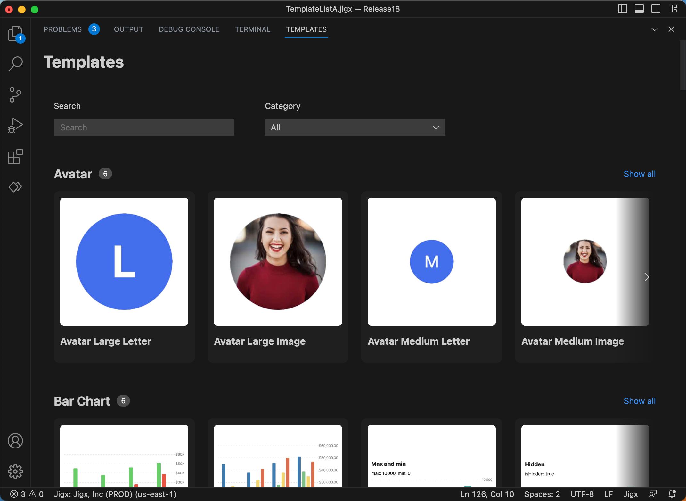
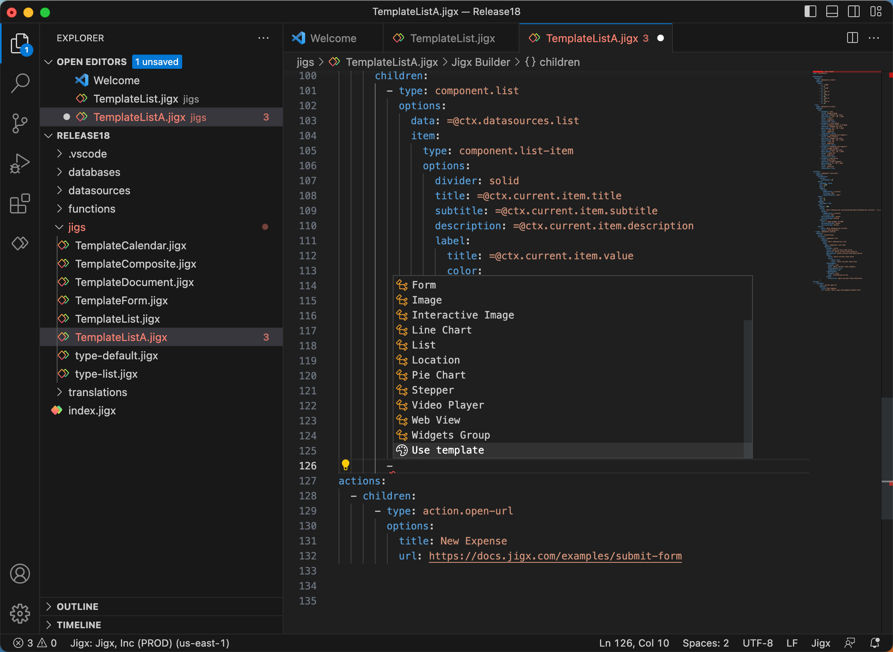

# Use template

**Component templates** are preconfigured YAML code blocks containing the required code set for each component. Hover over the chosen template in the gallery and click **insert**. Customize the code block with any changes you require. You can use these templates as a base to quicklycreate the components in a jig.

For steps on how to use component templates, see [Component Templates](https://docs.jigx.com/component-templates)

<figure><figcaption></figcaption></figure>

<figure><figcaption></figcaption></figure>
