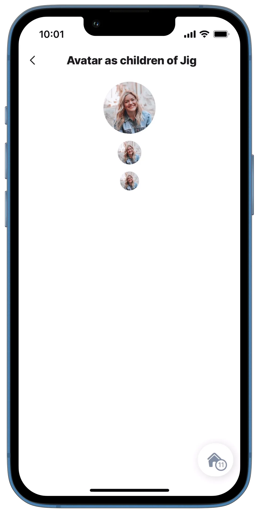
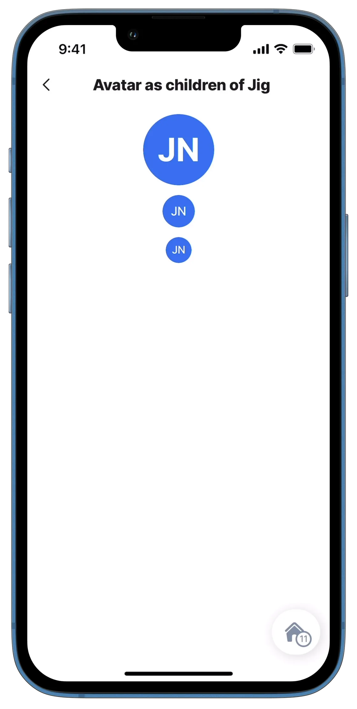

---
layout:
  width: wide
  title:
    visible: true
  description:
    visible: true
  tableOfContents:
    visible: true
  outline:
    visible: true
  pagination:
    visible: true
  metadata:
    visible: true
  tags:
    visible: true
  actions:
    visible: true
---

# avatar



Using the avatar component, display a profile photo, company logo, initials, or flags as unique visual identifiers.



<figure><figcaption><p>Avatars</p></figcaption></figure>



## Configuration options



## Examples and code snippets

### Avatar as children of jig (profile picture)



<figure><figcaption><p>Avatar - Profile picture</p></figcaption></figure>



This example shows the avatar component in a jig. It can be used for employee headshots, company logos, or flags.

**Examples:**\
See the full code sample using static data in [GitHub](https://github.com/jigx-com/jigx-samples/blob/main/quickstart/jigx-samples/jigs/jigx-components/avatar/static-data/avatar-as-children-of-jig/avatar-picture.jigx).\
See the full code sample using dynamic data in [GitHub](https://github.com/jigx-com/jigx-samples/blob/main/quickstart/jigx-samples/jigs/jigx-components/avatar/dynamic-data/avatar-as-children-of-jig/avatar-picture-dynamic.jigx).

**Datasources:**\
See the full datasource code sample for static data in [GitHub](https://github.com/jigx-com/jigx-samples/blob/main/quickstart/jigx-samples/datasources/examples/static-global.jigx).\
See the full datasource code sample for dynamic data in [GitHub](https://github.com/jigx-com/jigx-samples/blob/main/quickstart/jigx-samples/datasources/examples/dynamic-global.jigx).





```yaml
children:
  - type: component.avatar
    options:
      title:  ""
      uri: =@ctx.datasources.static-global.picture
      size: large
      align: center
  - type: component.avatar
    options:
      title:  ""
      uri: =@ctx.datasources.static-global.picture
      size: regular
      align: center
  - type: component.avatar
    options:
      title:  ""
      uri: =@ctx.datasources.static-global.picture
      size: small
      align: center
```



```yaml
children:
  - type: component.avatar
    options:
      title:  ""
      uri: =@ctx.datasources.dynamic-global.picture
      size: large
      align: center
  - type: component.avatar
    options:
      title:  ""
      uri: =@ctx.datasources.dynamic-global.picture
      size: regular
      align: center
  - type: component.avatar
    options:
      title:  ""
      uri: =@ctx.datasources.dynamic-global.picture
      size: small
      align: center
```



```yaml
datasources:
  static-global:
    type: datasource.static
    options:
      data:
        - name: July Nelson
          picture: https://images.unsplash.com/photo-1546961329-78bef0414d7c?ixlib=rb-1.2.1&ixid=MnwxMjA3fDB8MHxwaG90by1wYWdlfHx8fGVufDB8fHx8&auto=format&fit=crop&w=774&q=80
          date_from: "2022-06-10T10:00:00Z"
          date_to: "2022-0610T10:30:00Z"
          email: grant@firs.com
          phone: 564332345
```



```yaml
datasources:
  dynamic-global:
    type: datasource.sqlite
    options:
      provider: DATA_PROVIDER_DYNAMIC
      entities:
        - entity: default/global
      query: |
        SELECT
          '$.name',
          '$.picture',
          '$.date-from',
          '$.date-to',
          '$.email',
          '$.phone'
        FROM [default/global]
```



### Avatar as children of jig (initials)



<figure><figcaption><p>Avatar with initials</p></figcaption></figure>



As in the previous example, we use the avatar component for detail. In this case, we use the initials of the user or employee. It's useful if you don't have a picture of them.

**Examples:**\
See the full code sample using static data in [GitHub](https://github.com/jigx-com/jigx-samples/blob/main/quickstart/jigx-samples/jigs/jigx-components/avatar/static-data/avatar-as-children-of-jig/avatar-initials.jigx).\
See the full code sample using dynamic data in [GitHub](https://github.com/jigx-com/jigx-samples/blob/main/quickstart/jigx-samples/jigs/jigx-components/avatar/dynamic-data/avatar-as-children-of-jig/avatar-initials-dynamic.jigx).

**Datasources:**\
See the full datasource code sample for static data in [GitHub](https://github.com/jigx-com/jigx-samples/blob/main/quickstart/jigx-samples/datasources/examples/static-global.jigx).\
See the full datasource code sample for dynamic data in [GitHub](https://github.com/jigx-com/jigx-samples/blob/main/quickstart/jigx-samples/datasources/examples/dynamic-global.jigx)





```yaml
children:
  - type: component.avatar
    options:
      title:  =$substring($substringBefore(@ctx.datasources.static-global.name, " "), 0, 1) & $substring($substringAfter(@ctx.datasources.static-global.name, " "), 0, 1)
      size: large
      align: center
  - type: component.avatar
    options:
      title:  =$substring($substringBefore(@ctx.datasources.static-global.name, " "), 0, 1) & $substring($substringAfter(@ctx.datasources.static-global.name, " "), 0, 1)
      size: regular
      align: center
  - type: component.avatar
    options:
      title:  =$substring($substringBefore(@ctx.datasources.static-global.name, " "), 0, 1) & $substring($substringAfter(@ctx.datasources.static-global.name, " "), 0, 1)
      size: small
      align: center
```



```yaml
children:
  - type: component.avatar
    options:
      title:  =$substring($substringBefore(@ctx.datasources.dynamic-global.name, " "), 0, 1) & $substring($substringAfter(@ctx.datasources.dynamic-global.name, " "), 0, 1)
      size: large
      align: center
  - type: component.avatar
    options:
      title:  =$substring($substringBefore(@ctx.datasources.dynamic-global.name, " "), 0, 1) & $substring($substringAfter(@ctx.datasources.dynamic-global.name, " "), 0, 1)
      size: regular
      align: center
  - type: component.avatar
    options:
      title:  =$substring($substringBefore(@ctx.datasources.dynamic-global.name, " "), 0, 1) & $substring($substringAfter(@ctx.datasources.dynamic-global.name, " "), 0, 1)
      size: small
      align: center
```



```yaml
datasources:
  static-global:
    type: datasource.static
    options:
      data:
        - name: July Nelson
          picture: https://images.unsplash.com/photo-1546961329-78bef0414d7c?ixlib=rb-1.2.1&ixid=MnwxMjA3fDB8MHxwaG90by1wYWdlfHx8fGVufDB8fHx8&auto=format&fit=crop&w=774&q=80
          date_from: "2022-06-10T10:00:00Z"
          date_to: "2022-06-10T10:30:00Z"
          email: grant@first.com
          phone: 564332345
```



```yaml
datasources:
  dynamic-global:
    type: datasource.sqlite
    options:
      provider: DATA_PROVIDER_DYNAMIC
      entities:
        - entity: default/global
      query: |
        SELECT
          '$.name',
          '$.picture',
          '$.date-from',
          '$.date-to',
          '$.email',
          '$.phone'
        FROM [default/global]
```


