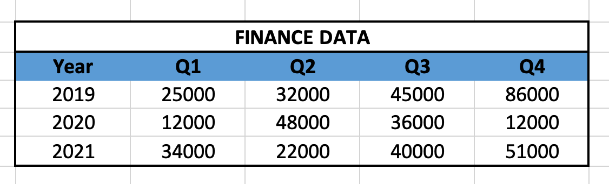
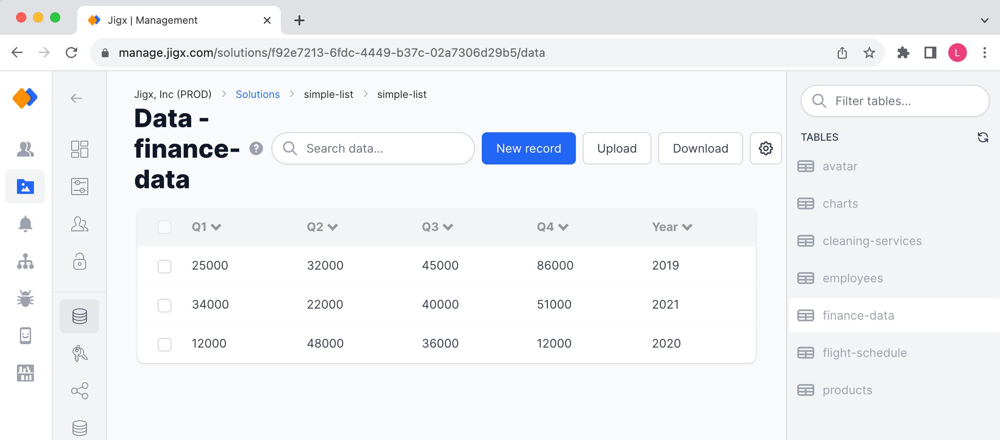
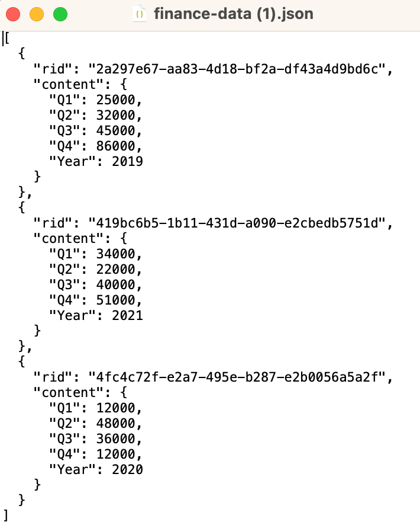
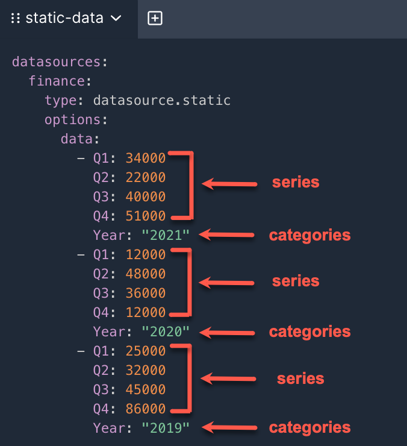
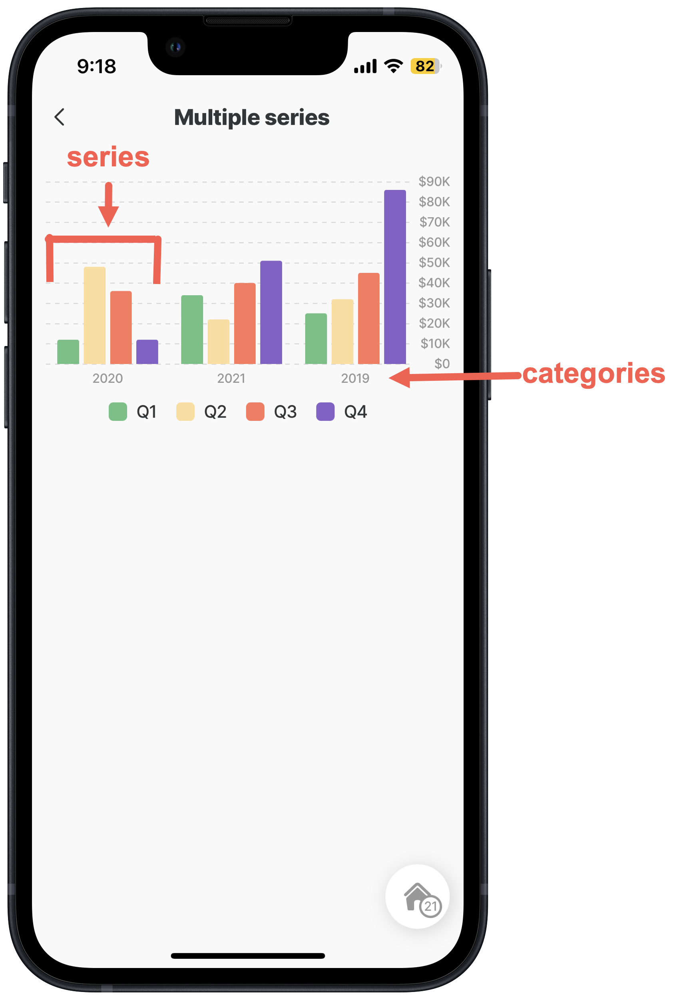
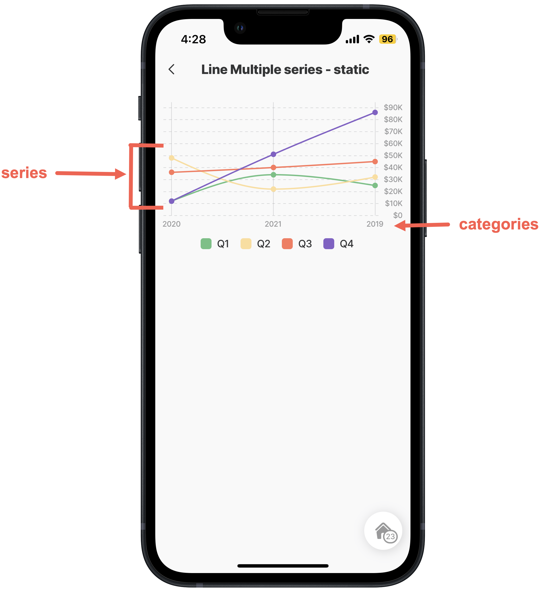

# charts

The component can display statistics related to data records (categorical variables). This can be used to show a single series or multiple series of data for comparative purposes and highlight specific regions or ranges on the chart to make it easier for users to interpret and analyze the data.This component is mostly used in [jig.default](<../../Jig Types/jig_default.md>) or [jig.list](<../../Jig Types/jig_list.md>).

<table data-view="cards"><thead><tr><th></th><th></th><th data-hidden data-card-cover data-type="image">Cover image</th></tr></thead><tbody><tr><td>Bar chart</td><td><a href="bar-chart.md">Show more</a></td><td><a href="../../../.gitbook/assets/bar-chart.png">bar-chart.png</a></td></tr><tr><td>Pie chart</td><td><a href="pie-chart.md">Show more</a></td><td><a href="../../../.gitbook/assets/pie-chart.png">pie-chart.png</a></td></tr><tr><td>Line chart</td><td><a href="line-chart.md">Show more</a></td><td><a href="../../../.gitbook/assets/line-chart.png">line-chart.png</a></td></tr><tr><td>Bar charts -plotbands</td><td><a href="bar-chart.md">Show more</a></td><td><a href="../../../.gitbook/assets/charts-bar-plotbands-s.png">charts-bar-plotbands-s.png</a></td></tr><tr><td>Line charts -plotbands</td><td><a href="line-chart.md">Show more</a></td><td><a href="../../../.gitbook/assets/Charts-Line-plotbands-s.png">Charts-Line-plotbands-s.png</a></td></tr></tbody></table>

## Understanding chart data

Chart data is structured in a way that makes it easy to display. To understand how to create the YAML for a chart in Jigx Builder let's look at the data in various formats and how you can use the data in Jigx.

* Let's start with the financial data per quarter for three years from a **Microsoft Excel** table, as shown below:

<figure><figcaption><p>Excel data table</p></figcaption></figure>

* Next we map out the same data in Jigx [Dynamic Data](https://docs.jigx.com/building-apps-with-jigx/data/data-providers/dynamic-data) in[Jigx Management](https://docs.jigx.com/administration/solutions/data). Notice that the data is exactly the same as the Excel data.

<figure><figcaption></figcaption></figure>

* The same data can also exist in a **JSON** file. Using the _Download_ button at the top-right of the Data-finance-data table shown above will download the data into a JSON file. The JSON is shown below.

<figure><figcaption><p>JSON data</p></figcaption></figure>

## Using the data in YAML

Now that you have your data you can convert it into the YAML needed for the charts. The data can be used as a static datasource or a dynamic datasource.

### YAML - Static data

Using the _finance-data.json_ it was easy to convert the data into YAML as shown below.


```yaml
datasources:
  finance:
    type: datasource.static
    options:
      data:
        - Q1: 34000
          Q2: 22000
          Q3: 40000
          Q4: 51000
          Year: "2021"
        - Q1: 12000
          Q2: 48000
          Q3: 36000
          Q4: 12000
          Year: "2020"
        - Q1: 25000
          Q2: 32000
          Q3: 45000
          Q4: 86000
          Year: "2019"
```


### YAML - Dynamic Data

In Jigx you can use the data from the dynamic data table, in this instance _data-Finance-data_, then create a file under datasource folder. Use the Dynamic data provider that references the finance-data table with a query selecting the data you want to use, quarters and year in this example.


```yaml
type: datasource.sqlite
options:
  provider: DATA_PROVIDER_DYNAMIC

  entities:
    - default/finance-data

  query: |
    SELECT
      id,
      '$.Q1', 
      '$.Q2', 
      '$.Q3', 
      '$.Q4', 
      '$.Year' 
    FROM [default/finance-data]
```


### YAML - Chart

In the YAML for charts the following keys are used: - `yAxis` - `xAxis` - `categories` - `series`

In this example the _finance-data_ would show as follows for each key.

<figure><figcaption><p>Chart YAML data described</p></figcaption></figure>

Now it is possible to create charts in YAML with the exact same data, for example a bar and line chart with the finance-data in the above YAML keys is shown below. Notice in the YAML below that the same YAML is used for both the bar and line chart.


```yaml
children:
  # select the BAR-CHART component and configure the x-axis and y-axis
  - type: component.bar-chart
    options:
      chart:
        height: 250
      legend:
        isHidden: false

      yAxis:
        max: 90000
        min: 0
        labels:
          format:
            currency: USD
            numberStyle: currency
            compactDisplay: short
            notation: compact
        tickAmount: 8

      xAxis:
        categories: =@ctx.datasources.finance-data-dd.Year

      series:
        - data: =@ctx.datasources.finance-data-dd.Q1
          name: Q1
          color: color2

        - data: =@ctx.datasources.finance-data-dd.Q2
          name: Q2
          color: color3

        - data: =@ctx.datasources.finance-data-dd.Q3
          name: Q3
          color: color4

        - data: =@ctx.datasources.finance-data-dd.Q4
          name: Q4
          color: color5
```



```yaml
children:
  # select the LINE-CHART component and configure the x-axis and y-axis
  - type: component.line-chart
    options:
      chart:
        height: 250
      legend:
        isHidden: false

      yAxis:
        max: 90000
        min: 0
        labels:
          format:
            currency: USD
            numberStyle: currency
            compactDisplay: short
            notation: compact
        tickAmount: 8

      xAxis:
        categories: =@ctx.datasources.multi.Year

      series:
        - data: =@ctx.datasources.multi.Q1
          name: Q1
          color: color2

        - data: =@ctx.datasources.multi.Q2
          name: Q2
          color: color3

        - data: =@ctx.datasources.multi.Q3
          name: Q3
          color: color4

        - data: =@ctx.datasources.multi.Q4
          name: Q4
          color: color5
```




The `component.bar-chart` in the Jigx App using the finance- data.



<figure><figcaption></figcaption></figure>





The `component.line-chart` in the Jigx App using the finance- data.



<figure><figcaption><p>Line chart in Jigx</p></figcaption></figure>


