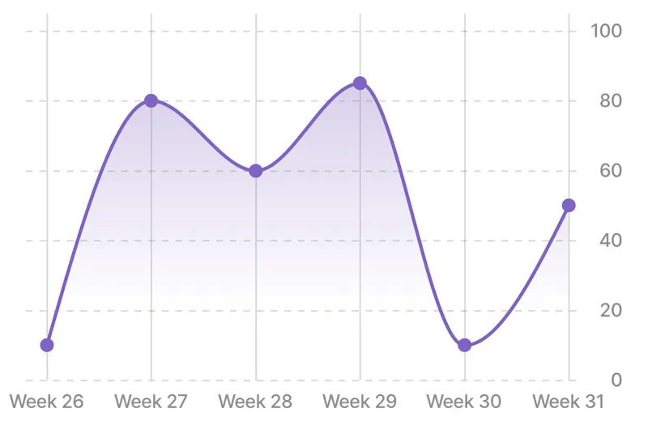
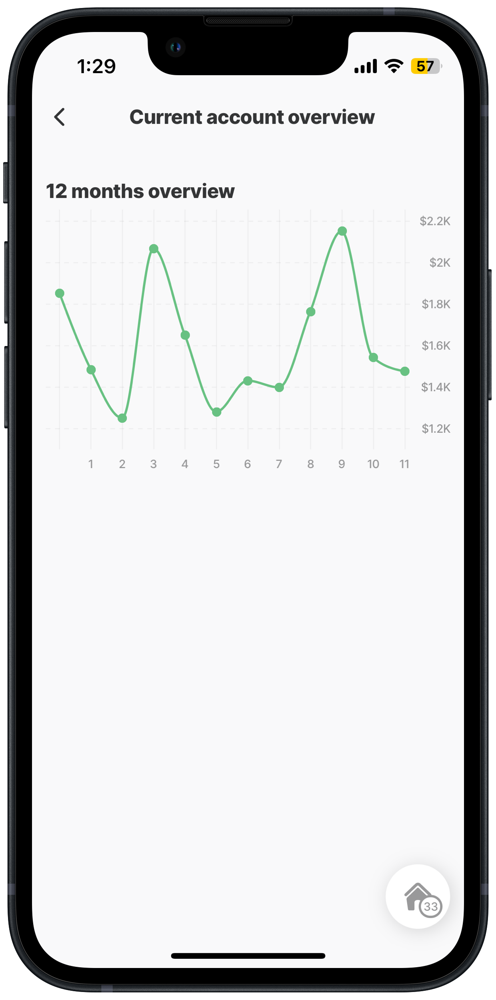
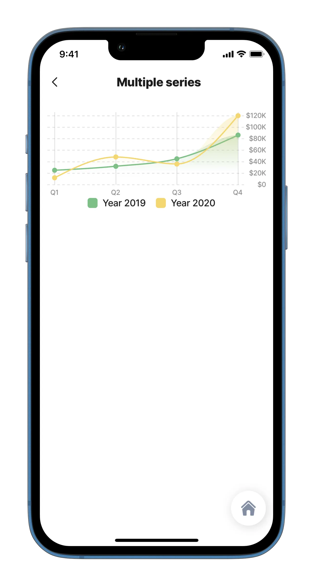
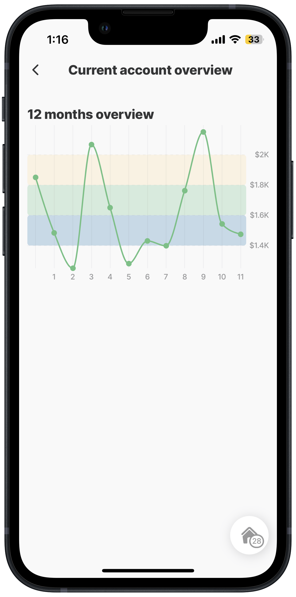
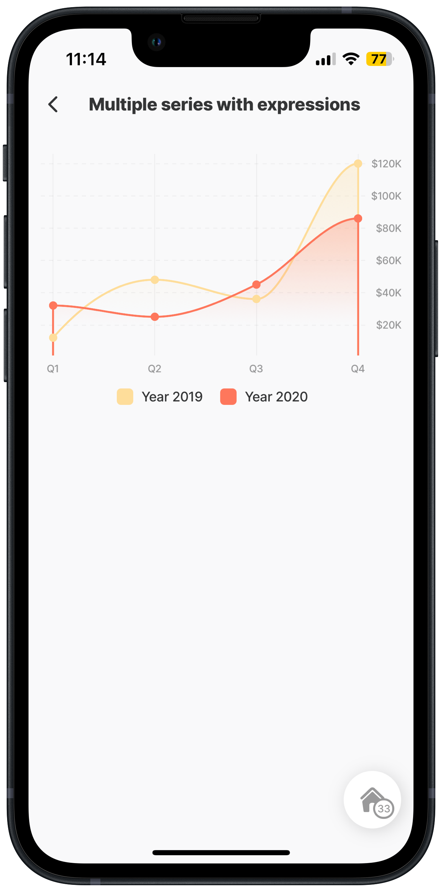

# line-chart



The component can display statistics related to data records represented in a line chart. This can show a single or multiple data series for comparative purposes and highlight specific regions or ranges on the chart to make it easier for users to interpret and analyze the data. Mostly used in [jig.default](<../../Jig Types/jig_default.md>) or [jig.list](<../../Jig Types/jig_list.md>).



<figure><figcaption></figcaption></figure>



## Configuration options

Some properties are common to all components, see [Common component properties](line-chart.md) for a list and their configuration options.

<table><thead><tr><th width="147.625">Core structure</th><th></th></tr></thead><tbody><tr><td><code>series</code></td><td><code>data</code> - values to be used in the chart. <code>color</code> - defines the color of the bar used in the chart.</td></tr><tr><td><code>xAxis</code></td><td><code>categories</code> to display on the x-axis.</td></tr><tr><td><code>yAxis</code></td><td><code>min</code> and <code>max</code> values that display on the y-axis. The <code>max</code> property doesn't have to be defined, in this case, it will automatically be calculated depending on your data.</td></tr></tbody></table>

<table><thead><tr><th width="152.0078125">Other options</th><th></th></tr></thead><tbody><tr><td><code>chart</code></td><td><ul><li><code>title</code> and <code>subtitle</code> - Name and a short description of your chart.</li><li><code>height</code> and <code>width</code> - The parameters of the chart displayed (in pixels).</li></ul></td></tr><tr><td><code>legend</code></td><td><code>isHidden</code> - The setting of a boolean value if the legend (naming of the series) should be displayed under the chart.</td></tr><tr><td><code>plotBands</code></td><td><p>Use <code>plotbands</code> to highlight specific regions or ranges on the chart, making it easier for users to interpret and analyze the data. The <code>from</code> and <code>to</code> properties define the area to be filled with color. Specify the range using the from and to properties with numeric values.</p><ul><li><code>area</code></li><li><code>area-gradient</code></li><li><code>line</code></li><li><code>name</code> - The naming of the actual series.</li></ul></td></tr><tr><td><code>xAxis</code></td><td><ul><li><code>isFirstLabelHidden</code> value is either <code>true</code> to hide the first label or <code>false</code> to display the first label. The property doesn't have to be defined, by default the first label is shown.</li><li><code>isFirstTickHidden</code> value is either true/false. Set to <code>true</code> hides the whole axis.</li><li><code>isHidden</code> value is either true/false.</li><li><code>isLastLabelHidden</code> value is either <code>true</code> to hide the last label or <code>false</code> to display the last label. The property doesn't have to be defined, by default the last label are shown.</li><li><code>isLastTickHidden</code> value is either <code>true</code> to hide the last line and label or <code>false</code> to display the last line and label. The property doesn't have to be defined, by default the last label and line are shown.</li><li><code>labels</code> - Label of axis, a selection of different formats such as <code>dateFormat</code>, <code>currency</code>, <code>unit</code>, and <code>signDisplay</code> are available. <code>min</code> and <code>max</code> - Minimum and maximum values that should be displayed on the x-axis.</li><li><code>minPadding</code> - When no categories set, a 1% space is made on the left and right of the chart so the id doesn't start on the left or ends on the right edge exactly. The default is set to 0.02 (x-axis) and 0.05 (y-axis).</li><li><code>tickAmount</code> - The number of ticks to display on the x-axis. The final amount doesn't have to be exactly the same number as you pass into it. Round up to 6 to give the chart a good set of numbers 0, 20, 40, 60, 80, 100. Set ticks to 3 will be honored and shows 0, 50, and 100.</li></ul></td></tr><tr><td><code>yAxis</code></td><td><ul><li><code>isFirstLabelHidden</code> value is either true/false. Set to <code>true</code> hides the first label. The property doesn't have to be defined, by default the first label is shown.</li><li><code>isFirstTickHidden</code> value is either true/false. Set to <code>true</code> hides the whole axis.</li><li><code>isHidden</code> value is either true/false. Set to <code>true</code> the last label is hidden.</li><li><code>isLastLabelHidden</code> value is either <code>true</code> to hide the last label and line or <code>false</code> to display the last label and line. The property doesn't have to be defined, by default the last label and line are shown.</li><li><code>isLastTickHidden</code> value is either <code>true</code> to hide the last line and label or <code>false</code> to display the last line and label. The property doesn't have to be defined, by default the last label and line are shown.</li><li><code>labels</code> - Label of axis, a selection of different formats such as <code>currency</code>, <code>numberStyle</code>, <code>compactDisplay</code> and <code>notation</code> is available.</li><li><code>minPadding</code> - When no categories set, a 1% space is made on the left and right of the chart so the id doesn't start on the left or ends on the right edge exactly. The default is set to 0.02 (x-axis) and 0.05 (y-axis).</li><li><code>min</code> and <code>max</code> - Minimum and maximum values that should be displayed on the y-axis.</li><li><code>tickAmount</code> - The number of ticks to display on the x-axis. The final amount doesn't have to be exactly the same number as you pass into it. Round up to 6 to give the chart a good set of numbers 0, 20, 40, 60, 80, 100. Set ticks to 3 will be honored and shows 0, 50, and 100.</li></ul></td></tr></tbody></table>

## Considerations

The line-chart control expects a JSON object. Using a REST call can return data as text. To get the JSON object for the REST call there are two options:

* Add the `$eval` function to the expressions as shown below:

```yaml
 type: component.line-chart
        options:
          chart:
            height: 150
          series:
            - data: =$eval(@ctx.datasources.weatherData.temperatures_max)
```

* In the datasource specify the fields to be returned as a JSON object by using the `jsonProperties` in the datasource query as shown below:

```yaml
datasources:
  weatherData: 
    type: datasource.sqlite
    options:
      provider: DATA_PROVIDER_LOCAL
      entities:
        - entity: weather
  
      query: |
       SELECT id, 
       '$.timezone', 
       '$.units',
       '$.today_max',
       '$.today_min',
       '$.date',
       '$.temperatures_max',
       '$.temperatures_min'
       FROM [weather] 
      jsonProperties: 
         - temperatures_max
         - temperatures_min
```

## Examples and code snippets

### Line-chart financial



<figure><figcaption><p>Line-chart financial</p></figcaption></figure>



The widget displays an annual overview of finances. The x-axis shows the months and the y-axis is the monetary amount. Thanks to number formatting, we can set any currency.

**Examples:** See the full example using static data in [GitHub](https://github.com/jigx-com/jigx-samples/blob/main/quickstart/jigx-samples/jigs/jigx-components/line-chart/static-data/line-chart-financial/line-chart-financial.jigx). See the full example using dynamic data in [GitHub](https://github.com/jigx-com/jigx-samples/blob/main/quickstart/jigx-samples/jigs/jigx-components/line-chart/dynamic-data/line-chart-financial/line-chart-financial-dynamic.jigx)

**Datasources:** See the full datasource for dynamic data in [GitHub](https://github.com/jigx-com/jigx-samples/blob/main/quickstart/jigx-samples/datasources/charts/dynamic/finance-dynamic.jigx).





```yaml
children:
  - type: component.line-chart
    options:
      legend:
        isHidden: true
      chart:
        title:
          text: "12 months overview"
        height: 260
        isAnimated: false
      yAxis:
        min: 1100
        max: 2200
        labels:
          format:
            numberStyle: currency
            currency: USD
            compactDisplay: short
            notation: compact
        tickAmount: 5
        isFirstTickHidden: false
        isFirstLabelHidden: false
      series:
        - data: =[{"x":"Jun", "y":1851}, {"x":"Jul", "y":1483}, {"x":"Aug", "y":1250}, {"x":"Sep", "y":2067}, {"x":"Oct", "y":1650}, {"x":"Nov", "y":1280}, {"x":"Dec", "y":1430}, {"x":"Jan", "y":1398}, {"x":"Feb", "y":1763}, {"x":"Mar", "y":2151}, {"x":"Apr", "y":1543}, {"x":"May", "y":1475}]
          name: "2021/2022"
          color: color2
```



```yaml
children:
  - type: component.line-chart
    options:
      legend:
        isHidden: true
      chart:
        title:
          text: "12 months overview"
        height: 260
        isAnimated: false
      yAxis:
        min: 0
        labels:
          format:
            numberStyle: currency
            currency: USD
            compactDisplay: short
            notation: compact
        tickAmount: 5
        isFirstTickHidden: false
        isFirstLabelHidden: false
      series:
        - data: =@ctx.datasources.finance-dynamic.{'x':x,'y':y}
          name: "2021/2022"
          color: color2
```



```yaml
datasources:
  finance-dynamic:
    type: datasource.sqlite
    options:
      provider: DATA_PROVIDER_DYNAMIC
      entities:
        - entity: default/finances
      query: |
        SELECT 
          id, 
          json_extract(data, '$.date') as x, 
          json_extract(data, '$.amount') as y, 
          '$.financeid', 
          '$.category' 
        FROM [default/finances] WHERE '$.category' = "finance-month" ORDER BY '$.financeid' ASC
```



### Line-chart multiple series



<figure><figcaption><p>Multiple series</p></figcaption></figure>



The widget displays an annual overview of finances. The x-axis shows the months and the y-axis the monetary amount. Thanks to number formatting, we can set any currency.

**Examples:** See the full example using static data in [GitHub](https://github.com/jigx-com/jigx-samples/blob/main/quickstart/jigx-samples/jigs/jigx-components/line-chart/static-data/line-chart-multiple-series/line-chart-multiple-series.jigx). See the full example using dynamic data in [GitHub](https://github.com/jigx-com/jigx-samples/blob/main/quickstart/jigx-samples/jigs/jigx-components/line-chart/dynamic-data/line-chart-multiple-series/line-chart-multiple-dynamic.jigx).

**Datasources in order series1 and series2:** See the full datasource for dynamic data [series 1](https://github.com/jigx-com/jigx-samples/blob/main/quickstart/jigx-samples/datasources/charts/dynamic/series1-dynamic.jigx) and [series 2](https://github.com/jigx-com/jigx-samples/blob/main/quickstart/jigx-samples/datasources/charts/dynamic/series2-dynamic.jigx) in GitHub.





```yaml
children:
  - type: component.line-chart
    options:
      chart:
        height: 200
        isAnimated: true
      yAxis:
        min: 0
        labels:
          format:
            numberStyle: currency
            compactDisplay: short
            notation: compact
        tickAmount: 8
        isFirstTickHidden: true
        isFirstLabelHidden: true
      xAxis:
        categories:
          - Q1
          - Q2
          - Q3
          - Q4
      series:
        - data: =[{"x":"Q1/19", "y":25000, "color":"color2"}, {"x":"Q2/19", "y":32000, "color":"color2"}, {"x":"Q3/19", "y":45000, "color":"color2"}, {"x":"Q4/19", "y":86000, "color":"color2"}]
          name: Year 2019
          animation:
              direction: left-to-right
          layout: area-gradient
          dataLabels:
            - isEnabled: true
        - data: =[{"x":"Q1/20", "y":12000, "color":"color3"}, {"x":"Q2/20", "y":48000, "color":"color3"}, {"x":"Q3/20", "y":36000, "color":"color3"}, {"x":"Q4/20", "y":120000, "color":"color3"}]
          name: Year 2020
          animation:
              direction: left-to-right
          layout: area-gradient
          dataLabels:
            - isEnabled: true      
      legend:
        isHidden: false
```



```yaml
children:
  - type: component.line-chart
    options:
      chart:
        height: 200
        isAnimated: true
      yAxis:
        min: 0
        labels:
          format:
            numberStyle: currency
            compactDisplay: short
            notation: compact
        tickAmount: 8
        isFirstTickHidden: true
        isFirstLabelHidden: true
      xAxis:
        categories:
          - Q1
          - Q2
          - Q3
          - Q4
      series:
        - data: =@ctx.datasources.series1-dynamic
          name: Year 2019
          animation:
              direction: left-to-right
          layout: area-gradient
          dataLabels:
            - isEnabled: true
        - data: =@ctx.datasources.series2-dynamic
          name: Year 2020
          animation:
              direction: left-to-right
          layout: area-gradient
          dataLabels:
            - isEnabled: true      
      legend:
        isHidden: false
```



```yaml
datasources:
  series1-dynamic:
    type: datasource.sqlite
    options:
      provider: DATA_PROVIDER_DYNAMIC
      entities:
        - entity: default/charts
      query: | 
        SELECT 
          id, 
          json_extract(data, '$.seriesy') as y, 
          '$.color', 
          '$.category', 
          json_extract(data, '$.seriesx') as x, 
          '$.subtitle', 
          '$.title' 
        FROM [default/charts] WHERE '$.category' = "chart1" ORDER BY x
  
  series2-dynamic:
    type: datasource.sqlite
    options:
      provider: DATA_PROVIDER_DYNAMIC
      entities:
        - entity: default/charts
      query: |
        SELECT 
          id, 
          json_extract(data, '$.seriesy') as y, 
          '$.color', 
          '$.category', 
          json_extract(data, '$.seriesx') as x, 
          '$.subtitle', 
          '$.title' 
        FROM [default/charts] WHERE '$.category' = "chart2" ORDER BY x
```



### Line-chart with plot bands



The chart shows an annual overview of finances. The x-axis shows the months and the y-axis is the monetary amount. The data points are easy to see as we used the `plotBands` property to add color. Single or multiple bands can be defined by adding the `form`, `to` and `color` properties.

**Examples:** See the full example using static data in [GitHub](https://github.com/jigx-com/jigx-samples/blob/main/quickstart/jigx-samples/jigs/jigx-components/line-chart/static-data/line-chart-financial/line-charts-plotBands.jigx).



<figure><figcaption><p>Chart with plot bands</p></figcaption></figure>




```yaml
title: Current account overview
type: jig.default
children:
  - options:
      chart:
        height: 260
        isAnimated: false
        title:
          text: 12 months overview
      legend:
        isHidden: true
      series:
        - color: color2
          data: =[{"x":"Jun", "y":1851}, {"x":"Jul", "y":1483}, {"x":"Aug", "y":1250},
            {"x":"Sep", "y":2067}, {"x":"Oct", "y":1650}, {"x":"Nov", "y":1280},
            {"x":"Dec", "y":1430}, {"x":"Jan", "y":1398}, {"x":"Feb", "y":1763},
            {"x":"Mar", "y":2151}, {"x":"Apr", "y":1543}, {"x":"May", "y":1475}]
          name: 2021/2022
      yAxis:
        isFirstLabelHidden: false
        isFirstTickHidden: false
        labels:
          format:
            compactDisplay: short
            currency: USD
            notation: compact
            numberStyle: currency
     # add three bands of different color to the line chart       
        plotBands:
          - from: 1400
            to: 1600
            color: color1
          - from: 1600
            to: 1800
            color: color2  
          - from: 1800
            to: 2000
            color: color3  
        min: 1100
        max: 2200
        tickAmount: 5
    type: component.line-chart

```


### line-chart using expressions



<figure><figcaption><p>Chart using expressions</p></figcaption></figure>



In this example expressions are used to dertermine the `min`, `max`, and `tickAmount` of a line-chart . The x-axis shows the quarters and the y-axis the monetary amount using the `format` property to display the currency.

**Examples:** See the full code sample in [GitHub](https://github.com/jigx-com/jigx-samples/blob/main/quickstart/jigx-samples/jigs/jigx-components/line-chart/dynamic-data/line-chart-multiple-series/line-chart-multiple-dynamic.jigx)

**Datasources** See the datasource code sample in [GitHub](https://github.com/jigx-com/jigx-samples/blob/main/quickstart/jigx-samples/datasources/charts/dynamic/series2-dynamic.jigx).





```yaml
#Add to jigs folder
title: Multiple series with expressions
type: jig.default

datasources:
  staticinputs: 
    type: datasource.static
    options:
      data:  
        - id: 1
          isFirstLabelHidden: true
          isFirstTickHidden: true
          min: 1000
          tickAmount: 8

children:
  - type: component.line-chart
    options:
      chart:
        height: 280
        isAnimated: true
      legend:
        isHidden: false
      series:
        - animation:
            direction: left-to-right
          data: =@ctx.datasources.series1-dynamic
          dataLabels:
            - isEnabled: true
          layout: area-gradient
          name: Year 2019
        - animation:
            direction: left-to-right
          data: =@ctx.datasources.series2-dynamic
          dataLabels:
            - isEnabled: true
          layout: area-gradient
          name: Year 2020
      xAxis:
        categories:
          - Q1
          - Q2
          - Q3
          - Q4
      yAxis:
        isFirstLabelHidden: =@ctx.datasources.staticinputs.isFirstLabelHidden
        isFirstTickHidden: =@ctx.datasources.staticinputs.isFirstTickHidden
        labels:
          format:
            compactDisplay: short
            notation: compact
            numberStyle: currency
        min: =@ctx.datasources.staticinputs.min
        tickAmount: =@ctx.datasources.staticinputs.tickAmount
```



```yaml
#Add to datasource folder
type: datasource.sqlite
options:
  provider: DATA_PROVIDER_DYNAMIC
  entities:
    - entity: default/charts
  query: |
    SELECT 
      id, 
      json_extract(data, '$.seriesy') as y, 
      '$.color', 
      '$.category', 
      json_extract(data, '$.seriesx') as x, 
      '$.subtitle', 
      '$.title' 
    FROM [default/charts] WHERE '$.category' = "chart2" ORDER BY x
```


