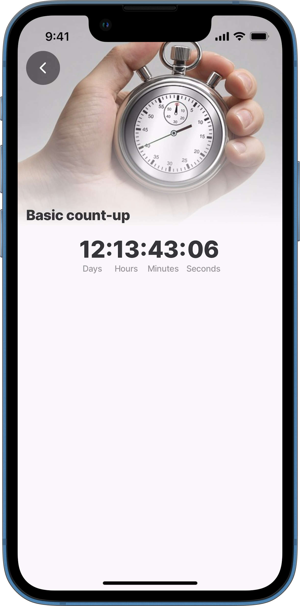
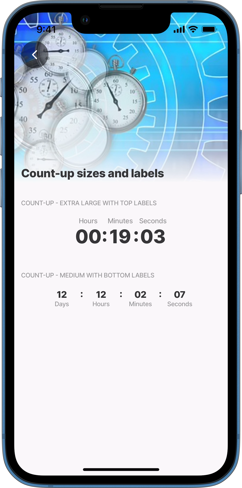
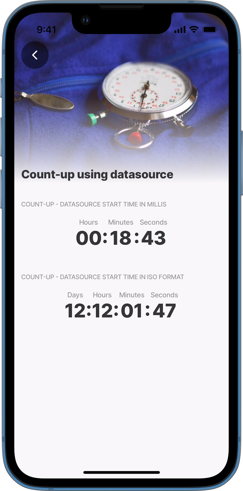
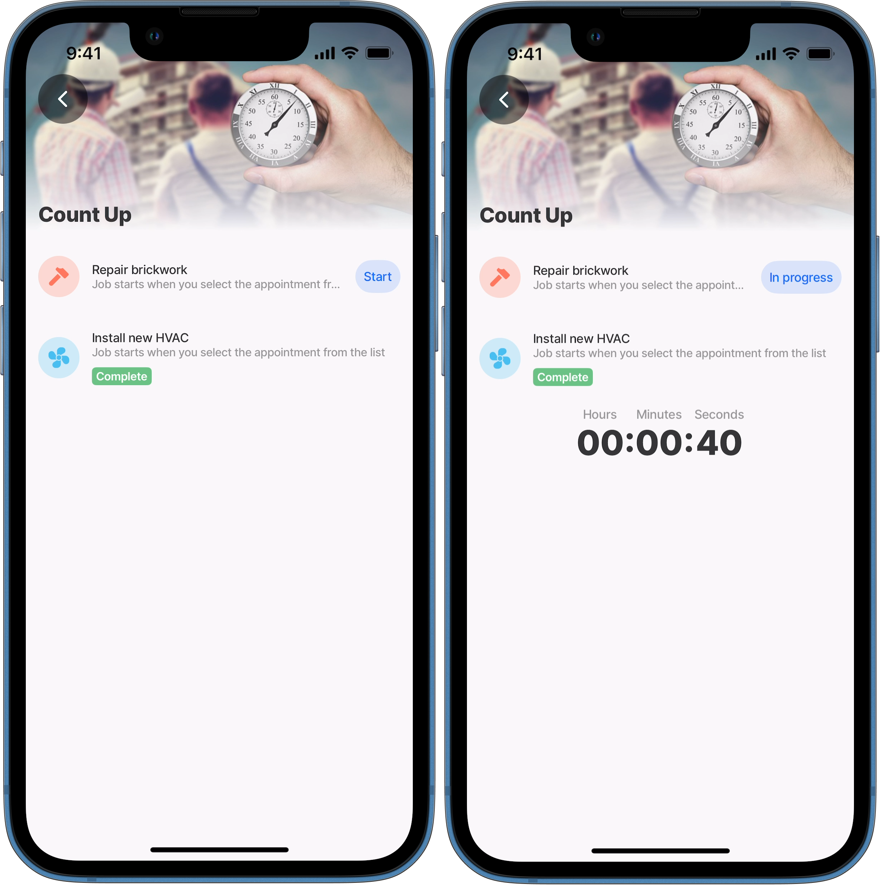

# count-up



The count-up component is a display-only component that continuously updates in real-time to show the elapsed time since a given start timestamp.



<figure><figcaption><p>Count-up</p></figcaption></figure>



## Configuration options

Some properties are common to all components, see [Common component properties](count-up.md) for a list and their configuration options.

<table><thead><tr><th width="154.5">Core structure</th><th></th></tr></thead><tbody><tr><td><code>startTimestamp</code></td><td><p>Add a start date, date/time or time, in milliseconds either using:</p><ul><li>datasource, e.g. <code>=@ctx.datasources.events[1].date</code></li><li>expression, e.g. <code>=$toMillis('2025-05-19T10:43:04.377Z')</code> If <code>startTimestamp</code> is omitted or set to null, the component remains static and does not count up.</li></ul></td></tr></tbody></table>

<table><thead><tr><th width="153.80078125">Other options</th><th></th></tr></thead><tbody><tr><td><code>labels</code></td><td><p>The count-up label displays time in the format Days: Hours: Minutes: Seconds. The Days section appears only when the timer exceeds 24 hours. Configuration options are:</p><ul><li><code>isVisible</code> (default: <code>true</code>)- Controls visibility of the count-up labels. Setting it to <code>false</code> hides the labels.</li><li><code>position</code> - Determines whether the count-up labels (Days: Hours: Minutes: Seconds) appear at the top or bottom of the count-up display.</li></ul></td></tr><tr><td><code>size</code></td><td>Choose between <code>extra-large</code> and <code>medium</code> sizes, with <code>extra-large</code> as the default if the property is not specified in the YAML.</td></tr></tbody></table>

## Examples and code snippets

### Count-up basic



This example shows how to set up a basic `count-up` component that starts counting from the current moment.

**Examples:** See the full code example in GitHub.&#x20;



<figure><figcaption><p>Basic count-up</p></figcaption></figure>




```yaml
title: Basic count-up
type: jig.default

header:
  type: component.jig-header
  options:
    height: medium
    children:
      type: component.image
      options:
        source:
          uri: https://cdn.pixabay.com/photo/2024/10/02/18/24/ai-generated-9091889_640.jpg

children:
- type: component.count-up
  options:
    # Set labels showing hours, minutes and seconds to visible.
    labels:
      isVisible: true
      # Position the labels under the count-up component.
      position: bottom
    # Set the required size of the component.  
    size: extra-large
    # Provide the start time.
    startTimestamp: =$now()
```


### Count-up sizes and labels



<figure><figcaption><p>Different sized count-ups</p></figcaption></figure>



This example displays two `count-up` components of different sizes. The first is `extra-large`, with `labels` `positioned` above it, while the second is `medium`-sized with `labels` below.

**Examples:** See the full code example in GitHub.&#x20;




```yaml
title: Count-up sizes and labels
type: jig.default

header:
  type: component.jig-header
  options:
    height: medium
    children:
      type: component.image
      options:
        source:
          uri: https://cdn.pixabay.com/photo/2018/09/24/08/16/stopwatch-3699317_640.jpg

children:
  - type: component.section
    options:
      title: Count-up - EXTRA LARGE WITH TOP LABELS 
      children:
      - type: component.count-up
        options:
          labels:
            isVisible: true
            # Position the labels (Hours : Minutes: Seconds) above the component. 
            position: top
          # Set the component's size as extra-large.  
          size: extra-large
          # Start time defined in ISO format converted to milliseconds.
          startTimestamp: =$toMillis('2025-03-19T10:43:04.377Z')
            
  - type: component.section
    options:
      title: Count-up - MEDIUM WITH BOTTOM LABELS 
      children:
      - type: component.count-up
        options:
          labels:
            isVisible: true
            # Position labels (Days: Hours : Minutes: Seconds) below the component. 
            position: bottom
           # Set the component's size as medium.   
          size: medium
          # Start time defined in ISO format converted to milliseconds.
          startTimestamp: =$toMillis('2025-03-06T23:00:00Z')          
```


### Count-up using a datasource



This example showcases two `count-up` components using a datasource with timestamp records in ISO format and milliseconds. The first component uses the millisecond timestamp, while the second uses the ISO format timestamp.

**Examples:** See the full code example in GitHub.



<figure><figcaption><p>Count-up from a datasource</p></figcaption></figure>




```yaml
title: Count-up using datasource
type: jig.default

header:
  type: component.jig-header
  options:
    height: medium
    children:
      type: component.image
      options:
        source:
          uri: https://cdn.pixabay.com/photo/2018/03/07/13/28/stopwatch-3205980_640.jpg

datasources:
  time:
    type: datasource.static
    options:
      data:
        - id: 1
          timeStamp: 1742380984000
          type: millis
        - id: 2
          timeStamp: 2025-03-06T23:00:00Z
          type: ISO

children:
  - type: component.section
    options:
      title: Count-up - datasource start time in millis 
      children:
      - type: component.count-up
        options:
          # Start time defined in milliseconds in a datasource.
          startTimestamp: =@ctx.datasources.time[0].timeStamp
  - type: component.section
    options:
      title: Count-up - datasource start time in ISO format 
      children:
      - type: component.count-up
        options:
          # Start time defined in ISO format in a datasource converted to milliseconds.
          startTimestamp: =$toMillis(@ctx.datasources.time[1].timeStamp)
```


### Count-up using state in a when condition



<figure><figcaption><p>Count-up condition</p></figcaption></figure>



This example demonstrates how to use the jig `state` in a `when` property to initially hide the `count-up` component and reveal it when a start `button` is pressed within a `list-item`.

**Examples:** See the full code example in GitHub




```yaml
title: Count Up 
type: jig.default

# Reset the jig state to the initial values when the jig is refreshed.
onRefresh: 
  type: action.reset-jig-state
  options:
    changes: 
      - startTime
# Reset the jig state to the initial values when the jig comes into focus.
onFocus: 
  type: action.reset-jig-state
  options:
    changes: 
      - startTime
# Set initial states in the jig.      
state:
  startTime: 
    initialValue: Start
    
header:
  type: component.jig-header
  options:
    height: small
    children:
      type: component.image
      options:
        source:
          uri: https://cdn.pixabay.com/photo/2019/01/15/09/36/stopwatch-3933687_640.jpg

children:
  - type: component.list-item
    instanceId: repair1
    options:
      title: Repair brickwork
      subtitle: Job starts when you select the appointment from the list
      leftElement: 
        element: icon
        color: color4
        type: contained
        icon: hammer
      # Configure a button with the onPress event to,
      # start the job by setting the state to 'In Progress'.  
      rightElement: 
        element: button
        title: =@ctx.jig.state.startTime
        onPress: 
         type: action.set-jig-state
         options:
            changes:
              startTime: In progress
  - type: component.list-item
    instanceId: install
    options:
      title: Install new HVAC
      subtitle: Job starts when you select the appointment from the list
      leftElement: 
        element: icon
        color: color9
        type: contained
        icon: fan
      tags:
        - text: Complete
          color: color2
                        
  - type: component.count-up
    instanceId: workTime
    # Set the when condition to determine when the count-up is visible.
    # The count-up starts using the timestamp provided once it is visible.
    when:  =@ctx.jig.state.startTime = "In progress"
    options:
      startTimestamp: =$millis() - 10000
```

