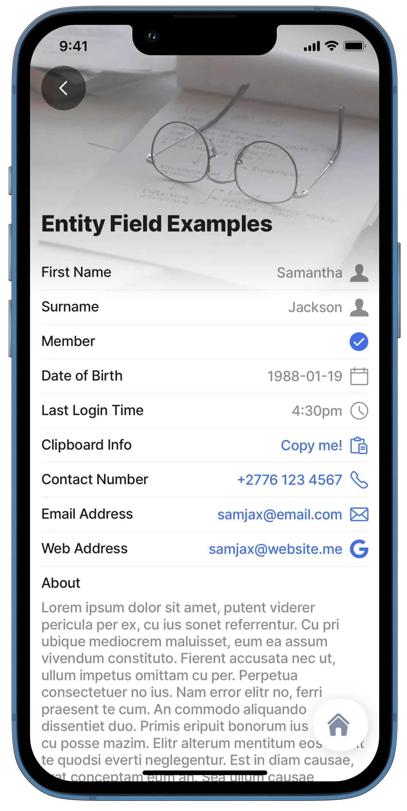
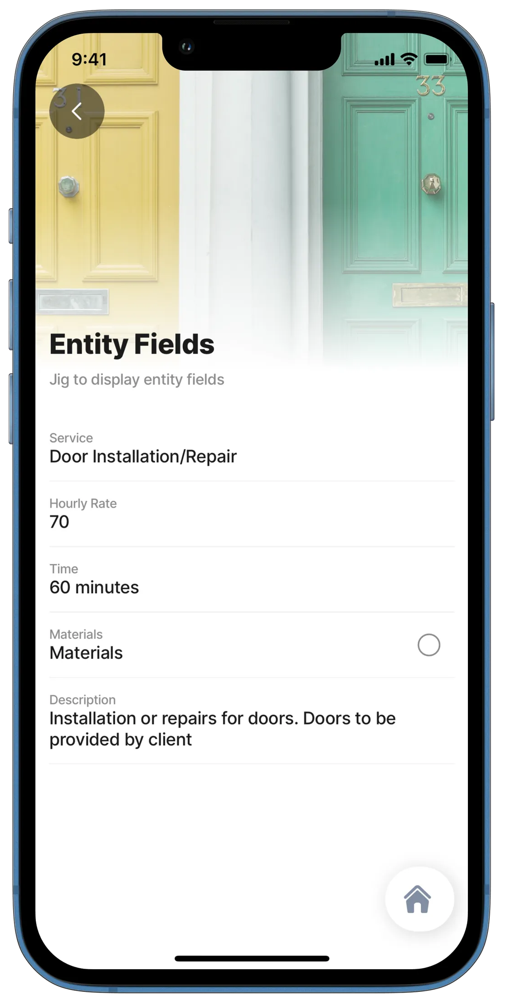
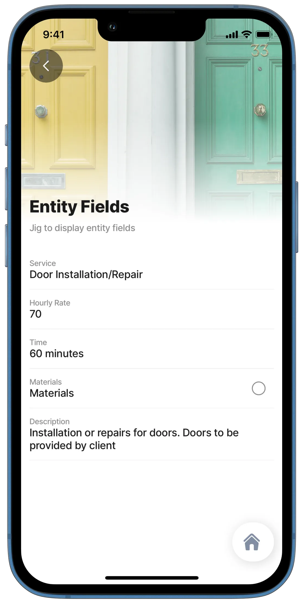
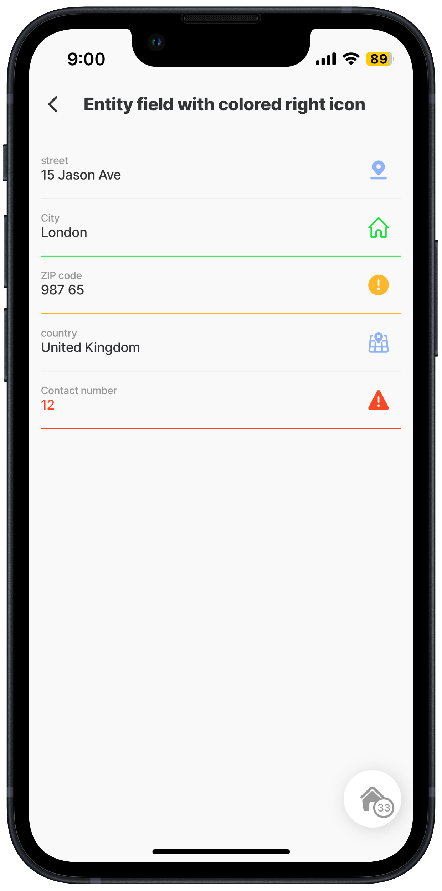

# entity-field

Entity fields display data such as text, numbers, dates, and currency from a datasource to the user. These entity fields are found on a `jig.default` and can be nested under [field-row](field-row.md) and/or [section](section.md) components but not under `component.form` as it is used for display purposes only.

## Configuration options

Some properties are common to all components, see [Common component properties](entity-field.md) for a list and their configuration options.

<table><thead><tr><th width="138.65625">Core structure</th><th></th></tr></thead><tbody><tr><td><code>label</code></td><td>Add a label for the entity-field, you can add text or an expression.</td></tr><tr><td><code>value</code></td><td>Add a value to display in the entity-field, you can add text or an expression.</td></tr></tbody></table>

<table><thead><tr><th width="140.0390625">Other options</th><th></th></tr></thead><tbody><tr><td><code>contentType</code></td><td><p>Various types of entity fields determine the visual display and behavior of the entity-field, including:</p><ul><li><code>default</code></li><li><code>checkbox</code></li><li><code>copy</code></li><li><code>date</code></li><li><code>email</code> - format: <a href="mailto:name@example.com">name@example.com</a></li><li><code>link</code></li><li><code>phone</code>- format: <em>1234567890</em> or <em>+001234567890</em> (no spaces)</li><li><code>signature</code></li><li><code>time</code></li></ul></td></tr><tr><td><code>instanceId</code></td><td>The unique identifier for the entity field.</td></tr><tr><td><code>rightIcon</code></td><td>A list of icons is available. See for more information.</td></tr><tr><td><code>style</code></td><td><p>The following styling set is available and works in conjunction with <code>rightIcon</code> to determine the color of the icon and the enitity-field line separator:</p><ul><li><code>isNegative</code></li><li><code>isPositive</code></li><li><code>isPrimary</code></li><li><code>isWarning</code></li></ul></td></tr></tbody></table>

## Consideration

* There are two variants of entity fields available - **Basic** and **Compact**.
  * The Compact variant requires the property `isCompact` to be set to true.
  * This is the entity component's property, not the entity-field.
* When using the `contentType: phone`, ensure the phone number entered contains no spaces; this allows you to click on the field to initiate a call from your device.

## Examples and code snippets

### Different types of entity fields



**Basic**

<figure><figcaption><p>Entity fields</p></figcaption></figure>



**Compact**

<figure><figcaption><p>Entity fields compact</p></figcaption></figure>



This example demonstrates the visual display and behavior of the entity-fields on this default jig.

**Examples:**

**Basic** - See the full example using static data in [GitHub](https://github.com/jigx-com/jigx-samples/blob/main/quickstart/jigx-samples/jigs/jigx-components/entity-field/static-data/entity-field-examples-static.jigx).

**Compact** - See the full example using static data in [GitHub](https://github.com/jigx-com/jigx-samples/blob/main/quickstart/jigx-samples/jigs/jigx-components/entity-field/static-data/entity-field-sd-compact.jigx).



```yaml
children:
  - type: component.entity
    options:
      children:
        - type: component.entity-field
          options:
            label: First Name
            value: Samantha
            contentType: default
            rightIcon: person
        - type: component.entity-field
          options:
            label: Surname
            value: Jackson
            contentType: default
            rightIcon: person
        - type: component.entity-field
          options:
            label: Member
            value: true
            contentType: checkbox
        - type: component.entity-field
          options:
            label: Date of Birth
            value: 1988-01-19
            contentType: date
            rightIcon: calendar
        - type: component.entity-field
          options:
            label: Last Login Time
            value: =$fromMillis($toMillis($now()), '[h#1]:[m01][P]')
            contentType: time
            rightIcon: time-clock-circle
        - type: component.entity-field
          options:
            label: Clipboard Info
            value: Copy me!
            contentType: copy
        - type: component.entity-field
          options:
            label: Contact Number
            value: +2776 123 4567
            contentType: phone
            rightIcon: phone
        - type: component.entity-field
          options:
            label: Email Address
            value: samjax@email.com
            contentType: email
            rightIcon: email
        - type: component.entity-field
          options:
            label: Web Address
            value: samjax@website.me
            contentType: link
            rightIcon: google
        - type: component.entity-field
          options:
            label: About
            value: Lorem ipsum dolor sit amet, putent viderer pericula per ex, cu ius sonet referrentur. Cu pri ubique mediocrem maluisset, eum ea assum vivendum constituto. Fierent accusata nec ut, ullum impetus omittam cu per. Perpetua consectetuer no ius. Nam error elitr no, ferri praesent te cum. An commodo aliquando dissentiet duo. Primis eripuit bonorum ius ei, usu cu posse mazim. Elitr alterum mentitum eos cu, sit te quodsi everti neglegentur. Est in diam causae, erat conceptam eum an. Sea ullum causae temporibus ex, libris delectus pro et.
            isMultiline: true
            contentType: default
```



```yaml
children:
  - type: component.entity
    options:
      isCompact: true
      children:
        - type: component.entity-field
          options:
            label: First Name
            value: Samantha
            contentType: default
            rightIcon: person
        - type: component.entity-field
          options:
            label: Surname
            value: Jackson
            contentType: default
            rightIcon: person
        - type: component.entity-field
          options:
            label: Member
            value: true
            contentType: checkbox
        - type: component.entity-field
          options:
            label: Date of Birth
            value: 1988-01-19
            contentType: date
            rightIcon: calendar
        - type: component.entity-field
          options:
            label: Last Login Time
            value: =$fromMillis($toMillis($now()), '[h#1]:[m01][P]')
            contentType: time
            rightIcon: time-clock-circle
        - type: component.entity-field
          options:
            label: Clipboard Info
            value: Copy me!
            contentType: copy
        - type: component.entity-field
          options:
            label: Contact Number
            value: +2776 123 4567
            contentType: phone
            rightIcon: phone
        - type: component.entity-field
          options:
            label: Email Address
            value: samjax@email.com
            contentType: email
            rightIcon: email
        - type: component.entity-field
          options:
            label: Web Address
            value: samjax@website.me
            contentType: link
            rightIcon: google
        - type: component.entity-field
          options:
            label: About
            value: Lorem ipsum dolor sit amet, putent viderer pericula per ex, cu ius sonet referrentur. Cu pri ubique mediocrem maluisset, eum ea assum vivendum constituto. Fierent accusata nec ut, ullum impetus omittam cu per. Perpetua consectetuer no ius. Nam error elitr no, ferri praesent te cum. An commodo aliquando dissentiet duo. Primis eripuit bonorum ius ei, usu cu posse mazim. Elitr alterum mentitum eos cu, sit te quodsi everti neglegentur. Est in diam causae, erat conceptam eum an. Sea ullum causae temporibus ex, libris delectus pro et.
            isMultiline: true
            contentType: default
```



### Entity fields with a connected datasource



**Basic**

<figure><figcaption><p>Entity fields with datasource</p></figcaption></figure>



**Compact**

<figure><figcaption><p>Entity fields with datasource</p></figcaption></figure>



An example to show how entity fields display when linked to a datasource.

**Examples:**\
**Basic** - See the full example using static data in [GitHub](https://github.com/jigx-com/jigx-samples/blob/main/quickstart/jigx-samples/jigs/jigx-components/entity-field/static-data/entity-field-sd.jigx).\
**Compact** - See the full example using static data in [GitHub](https://github.com/jigx-com/jigx-samples/blob/main/quickstart/jigx-samples/jigs/jigx-components/entity-field/static-data/entity-field-sd-compact.jigx).

**Basic** - See the full example using dynamic data in [GitHub](https://github.com/jigx-com/jigx-samples/blob/main/quickstart/jigx-samples/jigs/jigx-components/entity-field/dynamic-data/entity-field-dd.jigx).\
**Compact** - See the full example using dynamic data in [GitHub](https://github.com/jigx-com/jigx-samples/blob/main/quickstart/jigx-samples/jigs/jigx-components/entity-field/dynamic-data/entity-field-dd-compact.jigx)

**Datasources:**\
See the full datasource for static data in [GitHub](https://github.com/jigx-com/jigx-samples/blob/main/quickstart/jigx-samples/datasources/services/repair-services-static.jigx).\
See the full datasource for dynamic data in [GitHub](https://github.com/jigx-com/jigx-samples/blob/main/quickstart/jigx-samples/datasources/services/cleaning-services-dd.jigx).



```yaml
children:
  - type: component.entity
    options:
      children:
        - type: component.entity-field
          options:
            label: Service
            value: =@ctx.datasources.repair-services-static[id=1].service
        - type: component.entity-field
          options:
            label: Hourly Rate
            value: =@ctx.datasources.repair-services-static[id=1].hourlyRate
        - type: component.entity-field
          options:
            label: Time
            value: =@ctx.datasources.repair-services-static[id=1].time & ' minutes'
        - type: component.entity-field
          options:
            label: Materials
            value: =(@ctx.datasources.repair-services-static[id=1].materials = 'True' ? true :false)
            contentType: checkbox
        - type: component.entity-field
          options:
            label: Description
            value: =@ctx.datasources.repair-services-static[id=1].description
```



```yaml
children:
  - type: component.entity
    options:
      isCompact: true
      children:
        - type: component.entity-field
          options:
            label: Service
            value: =@ctx.datasources.repair-services-static[id=1].service
        - type: component.entity-field
          options:
            label: Hourly Rate
            value: =@ctx.datasources.repair-services-static[id=1].hourlyRate
        - type: component.entity-field
          options:
            label: Time
            value: =@ctx.datasources.repair-services-static[id=1].time & ' minutes'
        - type: component.entity-field
          options:
            label: Materials
            value: =(@ctx.datasources.repair-services-static[id=1].materials = 'True' ? true :false)
            contentType: checkbox
        - type: component.entity-field
          options:
            label: Description
            value: =@ctx.datasources.repair-services-static[id=1].description
            isMultiline: true
```



```ruby
children:
  - type: component.entity
    options:
      children:
        - type: component.entity-field
          options:
            label: Service
            value: =@ctx.datasources.cleaning-services-dd.service
        - type: component.entity-field
          options:
            label: Area
            value: =@ctx.datasources.cleaning-services-dd.area
        - type: component.entity-field
          options:
            label: Time
            value: =@ctx.datasources.cleaning-services-dd.time & ' minutes'
        - type: component.entity-field
          options:
            label: Indoor
            value: =@ctx.datasources.cleaning-services-dd.indoor
            contentType: checkbox
        - type: component.entity-field
          options:
            label: Description
            value: =@ctx.datasources.cleaning-services-dd.description
        - type: component.entity-field
          options:
            label: Hourly Rate
            value: =@ctx.datasources.cleaning-services-dd.hourlyrate
```





```javascript
children:
  - type: component.entity
    options:
      isCompact: true
      children:
        - type: component.entity-field
          options:
            label: Service
            value: =@ctx.datasources.cleaning-services-dd.service
        - type: component.entity-field
          options:
            label: Area
            value: =@ctx.datasources.cleaning-services-dd.area
        - type: component.entity-field
          options:
            label: Time
            value: =@ctx.datasources.cleaning-services-dd.time & ' minutes'
        - type: component.entity-field
          options:
            label: Indoor
            value: =@ctx.datasources.cleaning-services-dd.indoor
            contentType: checkbox
        - type: component.entity-field
          options:
            label: Description
            value: =@ctx.datasources.cleaning-services-dd.description
        - type: component.entity-field
          options:
            label: Hourly Rate
            value: =@ctx.datasources.cleaning-services-dd.hourlyrate
```



```yaml
datasources:
  repair-services-static:
    type: datasource.static
    options:
      data:
        - id: 1
          description: Installation or repairs for doors. Doors to be provided by client
          hourlyRate: 70
          illustration: http://clipart-library.com/data_images/436224.png
          image: https://images.unsplash.com/photo-1500281781950-6cd80847ebcd?ixlib=rb-1.2.1&ixid=MnwxMjA3fDB8MHxwaG90by1wYWdlfHx8fGVufDB8fHx8&auto=format&fit=crop&w=1469&q=80
          materials: false
          service: Door Installation/Repair
          time: 60
        - id: 2
          description: Repairs to door handles
          hourlyRate: 40
          illustration: http://clipart-library.com/img1/1332215.jpg
          image: https://images.unsplash.com/photo-1538766017398-415434a31a5b?ixlib=rb-1.2.1&ixid=MnwxMjA3fDB8MHxwaG90by1wYWdlfHx8fGVufDB8fHx8&auto=format&fit=crop&w=1470&q=80
          materials: true
          service: Door Handle/Lock Repairs
          time: 60
        - id: 3
          description: Installation or repairs of tiled surfaces. Tiles have to be provided by client
          hourlyRate: 110
          illustration: http://clipart-library.com/images/kcKnbzbXi.jpg
          image: https://images.unsplash.com/photo-1523413184730-e85dbbd04aba?ixlib=rb-1.2.1&ixid=MnwxMjA3fDB8MHxwaG90by1wYWdlfHx8fGVufDB8fHx8&auto=format&fit=crop&w=687&q=80
          materials: false
          service: Tile Installation/Repair
          time: 120
        - id: 4
          description: Installation or repairs of dry-wall surfaces
          hourlyRate: 80
          illustration: http://clipart-library.com/img1/505759.jpg
          image: https://images.unsplash.com/photo-1628901551715-7234d14fb7a0?ixlib=rb-1.2.1&ixid=MnwxMjA3fDB8MHxwaG90by1wYWdlfHx8fGVufDB8fHx8&auto=format&fit=crop&w=1470&q=80
          materials: true
          service: Drywall Installation/Repair
          time: 120
        - id: 5
          description: Repairs to bathroom rails, toilets, etc
          hourlyRate: 90
          illustration: http://clipart-library.com/new_gallery/53-530190_black-and-white-toilet-png.png
          image: https://images.unsplash.com/photo-1585313647787-7a061b5a85a6?ixlib=rb-1.2.1&ixid=MnwxMjA3fDB8MHxwaG90by1wYWdlfHx8fGVufDB8fHx8&auto=format&fit=crop&w=1423&q=80
          materials: true
          service: Bathroom Repairs
          time: 60
        - id: 6
          description: Painting as required. Paint and tools not provided
          hourlyRate: 70
          illustration: http://clipart-library.com/img/853166.jpg
          image: https://images.unsplash.com/photo-1562259949-e8e7689d7828?ixlib=rb-1.2.1&ixid=MnwxMjA3fDB8MHxwaG90by1wYWdlfHx8fGVufDB8fHx8&auto=format&fit=crop&w=1431&q=80
          materials: false
          service: Painting Services
          time: 120
        - id: 7
          description: Repairs to fences. Tools and items not included
          hourlyRate: 90
          illustration: http://clipart-library.com/img/18345.gif
          image: https://images.unsplash.com/photo-1583805978118-ba9a81ac1399?ixlib=rb-1.2.1&ixid=MnwxMjA3fDB8MHxwaG90by1wYWdlfHx8fGVufDB8fHx8&auto=format&fit=crop&w=1470&q=80
          materials: false
          service: Fence Installation/Repair
          time: 60
        - id: 8
          description: Removal of graffiti and painting. Paint and brushes not included in cost
          hourlyRate: 110
          illustration: http://clipart-library.com/images/6cy5aL5gi.jpg
          image: https://images.unsplash.com/photo-1581850518616-bcb8077a2336?ixlib=rb-1.2.1&ixid=MnwxMjA3fDB8MHxwaG90by1wYWdlfHx8fGVufDB8fHx8&auto=format&fit=crop&w=1470&q=80
          materials: false
          service: Removal of Graffiti
          time: 120
        - id: 9
          description: Repairs to cupboard doors
          hourlyRate: 60
          illustration: http://clipart-library.com/img1/1605140.jpg
          image: https://images.unsplash.com/photo-1522791465802-47616431a4cf?ixlib=rb-1.2.1&ixid=MnwxMjA3fDB8MHxwaG90by1wYWdlfHx8fGVufDB8fHx8&auto=format&fit=crop&w=1451&q=80
          materials: true
          service: Cupboard Door Repairs
          time: 60
        - id: 10
          description: Plumbing issues and repairs
          hourlyRate: 50
          time:30
```



```yaml
datasources:
  cleaning-services-dd:
    type: datasource.sqlite
    options:
      provider: DATA_PROVIDER_DYNAMIC
      entities:
        - entity: default/cleaning-services
      query: |
        SELECT 
          id, 
          '$.area', 
          '$.description', 
          '$.hourlyrate', 
          '$.illustration', 
          '$.image', 
          '$.indoor', 
          '$.onceoffrate', 
          '$.service', 
          '$.time' 
        FROM [default/cleaning-services] WHERE '$.service' = "Mattress Cleaning"
```



### Entity-fields with right icons in color



In this example, the `rightIcons` color is determined by adding a `style` property to each entity-field.

**Examples:** See the full example using static values in [GitHub](https://github.com/jigx-com/jigx-samples/blob/main/quickstart/jigx-samples/jigs/jigx-components/entity-field/static-data/entity-field-icons-color.jigx).



<figure><figcaption><p>Entity-field with color</p></figcaption></figure>




```yaml
title: Entity field with right icons in color
type: jig.default
children:
  - type: component.entity
    options:
      children:
        - type: component.entity-field
          options:
            rightIcon: pin-location
            # Change the color of the icon by adding a style property
            style:
              isPrimary: true
            label: street
            value: 15 Jason Ave
        - type: component.entity-field
          options:
            label: City
            rightIcon: house-2-alternate
            style:
              isPositive: true
            value: London
        - type: component.entity-field
          options:
            label: ZIP code
            rightIcon: alert-circle
            style:
              isWarning: true
            value: 987 65
        - type: component.entity-field
          options:
            label: country
            rightIcon: maps-pin
            style:
              isPrimary: true
            value: United Kingdom
        - type: component.entity-field
          options:
            label: Contact number
            rightIcon: alert-triangle
            style:
              isNegative: true
            value: "12"
```

