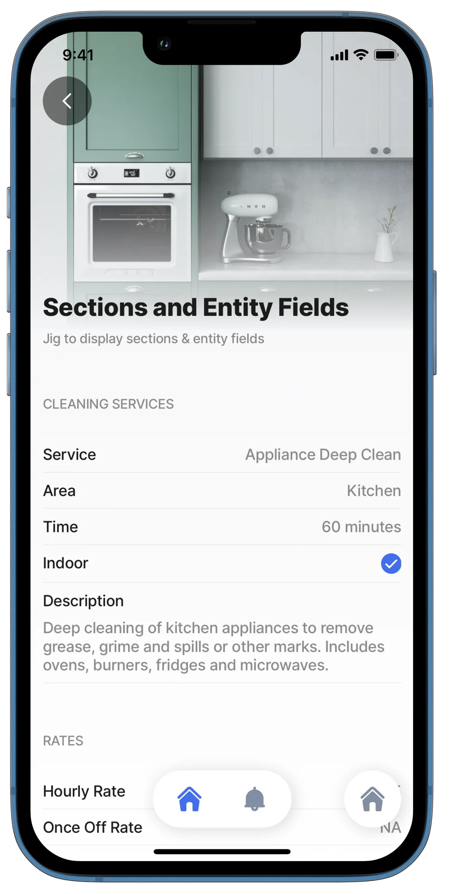

---
layout:
  width: wide
  title:
    visible: true
  description:
    visible: true
  tableOfContents:
    visible: true
  outline:
    visible: true
  pagination:
    visible: true
  metadata:
    visible: true
---

# entity

The entity component is a container for the following components:

* [entity-field](entity-field.md)
* [entity-field](entity-field.md)
* [section](../../../readme/components/section.md)

## Considerations

* The `component.entity` used with the above-mentioned components is configurable on a `jig.default`.
* [Section](../../../readme/components/section.md) and [field-row](field-row.md) are also available under the `component.form` as its container. Here the [entity-field](entity-field.md) is replaced by the [form's](../form/form.md) children field.
* When setting up a `component.entity`, either a [default jig](<../../Jig Types/jig_default.md>) or `component.form` can be used in the following combinations:
  * An entity containing [section(s)](../../../readme/components/section.md) with [rows](field-row.md) and [entity-field](entity-field.md)
  * An entity containing [section(s)](../../../readme/components/section.md) and [entity-field](entity-field.md)An entity containing [rows](field-row.md) and [entity-field](entity-field.md)
  * An entity containing [entity fields](entity-field.md)

## Configuration options

Some properties are common to all components, see [Common component properties](entity.md) for a list and their configuration options.

<table><thead><tr><th width="138.28515625">Other options</th><th></th></tr></thead><tbody><tr><td><code>isCompact</code></td><td>When this property is set to <code>true</code> the entity-field will cover the entire row. This compact variant does not allow usage of field-row components. By default, a label is at the top and the value below. <code>isCompact</code> will place the label on the left and the value on the right. Columns are not supported.</td></tr></tbody></table>

## Examples and code snippets



<figure><figcaption><p>Entity with sections, row &#x26; field</p></figcaption></figure>



<figure><figcaption><p>Entity with sections &#x26; field</p></figcaption></figure>



### Entity example

**Compact**

**Examples**: **Basic** - See the full example using static data in [GitHub](entity.md). **Compact** - See the full example using dynamic data in [GitHub](https://github.com/jigx-com/jigx-samples/blob/main/quickstart/jigx-samples/jigs/jigx-components/section/dynamic-data/section-entity-field-dd-compact.jigx).



```yaml
children:
  - type: component.entity
    options:
      children:
        - type: component.section
          options:
            title: Biographical & Membership Details
            children:
              - type: component.field-row
                options:
                  children: 
                    - type: component.entity-field
                      options:
                        label: First Name
                        value: Samantha
                        contentType: default
                        rightIcon: person
                    - type: component.entity-field
                      options:
                        label: Surname
                        value: Jackson
                        contentType: default
                        rightIcon: person
                    - type: component.entity-field
                      options:
                        label: Member
                        value: true
                        contentType: checkbox
              - type: component.field-row
                options:
                  children:
                    - type: component.entity-field
                      options:
                        label: Date of Birth
                        value: 1988-01-19
                        contentType: date
                        rightIcon: calendar
                    - type: component.entity-field
                      options:
                        label: Last Login Time
                        value: =$now()
                        contentType: time
                        rightIcon: time-clock-circle
        - type: component.section
          options:
            title: Contact & Other Details
            children:
            - type: component.entity-field
              options:
                label: Clipboard Info
                value: Copy me!
                contentType: copy
            - type: component.entity-field
              options:
                label: Contact Number
                value: +2776 123 4567
                contentType: phone
                rightIcon: phone
            - type: component.entity-field
              options:
                label: Email Address
                value: samjax@emailaddress.com
                contentType: email
                rightIcon: email
            - type: component.entity-field
              options:
                label: Web Address
                value: samjax@website.me
                contentType: link
                rightIcon: google
            - type: component.entity-field
              options:
                label: About
                value: Lorem ipsum dolor sit amet, putent viderer pericula per ex, cu ius sonet referrentur. Cu pri ubique mediocrem maluisset, eum ea assum vivendum constituto. Fierent accusata nec ut, ullum impetus omittam cu per. Perpetua consectetuer no ius. Nam error elitr no, ferri praesent te cum. An commodo aliquando dissentiet duo. Primis eripuit bonorum ius ei, usu cu posse mazim. Elitr alterum mentitum eos cu, sit te quodsi everti neglegentur. Est in diam causae, erat conceptam eum an. Sea ullum causae temporibus ex, libris delectus pro et.
                isMultiline: true
                contentType: default
```



```yaml
children:
  - type: component.entity
    options:
      isCompact: true
      children:
        - type: component.section
          options:
            title: Cleaning Services
            children:
              - type: component.entity-field
                options:
                  label: Service
                  value: =@ctx.datasources.cleaning-services[0].service
              - type: component.entity-field
                options:
                  label: Area
                  value: =@ctx.datasources.cleaning-services[0].area
              - type: component.entity-field
                options:
                  label: Time
                  value: =@ctx.datasources.cleaning-services[0].time & ' minutes'
              - type: component.entity-field
                options:
                  label: Indoor
                  value: =@ctx.datasources.cleaning-services[0].indoor
                  contentType: checkbox
              - type: component.entity-field
                options:
                  label: Description
                  value: =@ctx.datasources.cleaning-services[0].description
                  isMultiline: true
        - type: component.section
          options:
            title: Rates
            children:
              - type: component.entity-field
                options:
                  label: Hourly Rate
                  value: =@ctx.datasources.cleaning-services[0].hourlyrate != null ? @ctx.datasources.cleaning-services[0].hourlyrate :'N/A'
              - type: component.entity-field
                options:
                  label: Once Off Rate
                  value: =@ctx.datasources.cleaning-services[0].onceoffrate != null ? @ctx.datasources.cleaning-services[0].onceoffrate :'N/A'
```



```yaml
datasources:
  cleaning-services:
    type: datasource.sqlite
    options:
      provider: DATA_PROVIDER_DYNAMIC
  
      entities:
        - entity: default/cleaning-services
  
      query: |
        SELECT 
          id, 
          '$.area', 
          '$.description', 
          '$.hourlyrate', 
          '$.illustration', 
          '$.image', 
          '$.indoor', 
          '$.onceoffrate', 
          '$.service', 
          '$.time' 
        FROM [default/cleaning-services] ORDER BY '$.service' ASC
```



### See also

* [entity-field](entity-field.md)
* [field-row](field-row.md)
* [section](../../../readme/components/section.md)
