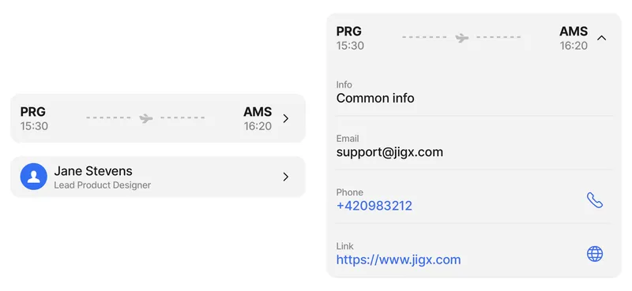
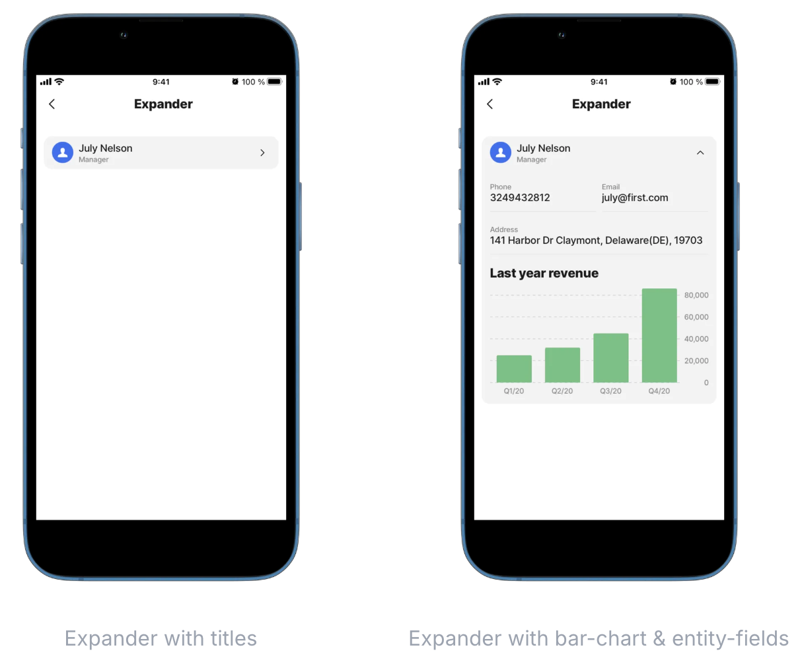
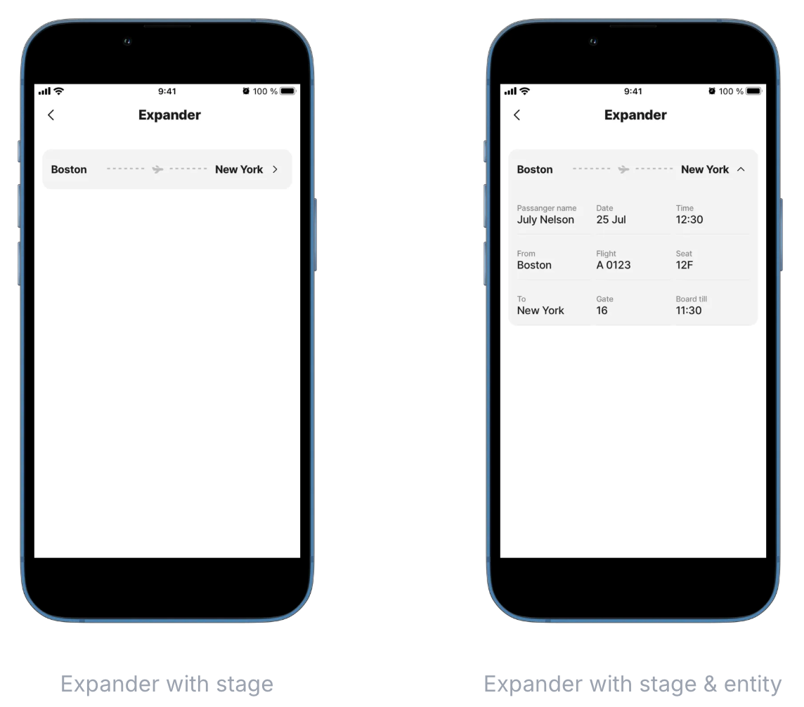

# expander

The expander component is a collapsible element that initially displays a small portion of content, such as a name. Users can tap the arrow, aligned either to the left or right, to expand the component and reveal additional details. The expander is customizable, and the content inside can be configured using components such as forms, lists, or cards. This helps keep screens clean and organized while making additional information easily accessible.

<figure><figcaption><p>Expander Preview</p></figcaption></figure>

## Configuration options

Some properties are common to all components, see [Common component properties](expander.md) for a list and their configuration options.

<table><thead><tr><th width="196.203125">Core structure</th><th></th></tr></thead><tbody><tr><td><code>children</code></td><td><p>Define the content of the expander. The following components can be used in the expander:</p><ul><li><a href="../charts/bar-chart.md">bar-chart</a></li><li><a href="../entity/entity.md">entity</a></li><li><a href="../form/form.md">form</a></li><li><a href="../interactive-image/interactive-image.md">interactive-image</a></li><li><a href="../charts/line-chart.md">line-chart</a></li><li><a href="../list/list.md">list</a></li><li><a href="../location.md">location</a></li><li><a href="../charts/pie-chart.md">pie-chart</a></li><li><a href="../stepper/stepper.md">stepper</a></li><li><a href="../video-player.md">video-player</a></li><li><a href="../web-view.md">web-view</a></li></ul></td></tr><tr><td><code>header</code></td><td><p><code>centerElement</code> - what is initially visible in your jig. The following options are available in <code>header</code>:</p><ul><li><a href="../../Custom components _Alpha_/Custom components _Alpha_.md">Custom components (Alpha)</a></li><li><a href="https://docs.jigx.com/examples/h1bm-titles">titles</a></li><li><a href="stage.md">stage</a></li></ul></td></tr></tbody></table>

<table><thead><tr><th width="198.453125">Other options</th><th></th></tr></thead><tbody><tr><td><code>divider</code></td><td>Added the ability to add a solid or transparent <code>divider</code>. Default setting is <code>none</code>.</td></tr><tr><td><code>expandIcon</code></td><td>Allows the ability to customize the alignment of the expander button. Default setting is <code>right</code>.</td></tr><tr><td><code>isInitiallyCollapsed</code></td><td>If the expander is initially collapsed. <code>true</code> is the default setting. <code>false</code> - expanded <code>true</code> - collapsed</td></tr><tr><td><code>leftElement</code></td><td>Add a left element, for example, an ordering number or avatar.</td></tr><tr><td><code>variant</code></td><td>Determine the background color for header versus body using the <code>variant</code> property with <code>plain</code> or <code>emphasized</code> values. Default setting is <code>emphasized</code>.</td></tr></tbody></table>

<table><thead><tr><th width="204.4375"></th><th></th></tr></thead><tbody><tr><td><code>onContentPress</code></td><td>Action triggered while pressing on the content in the expander. Use IntelliSense (ctrl+space) to see the available list of actions.</td></tr></tbody></table>

## Examples and code snippets

### Expander with titles in a header, entity-fields and bar-chart

<figure><figcaption></figcaption></figure>

**Examples**:\
See the full example using static data in [GitHub](https://github.com/jigx-com/jigx-samples/blob/main/quickstart/jigx-samples/jigs/jigx-components/expander/static-data/expander.jigx).\
See the full example using dynamic data in [GitHub](https://github.com/jigx-com/jigx-samples/blob/main/quickstart/jigx-samples/jigs/jigx-components/expander/dynamic-data/expander-dynamic-data.jigx).

**Datasource**:\
See the full datasource for dynamic data in [GitHub](https://github.com/jigx-com/jigx-samples/blob/main/quickstart/jigx-samples/datasources/expanders%20and%20stages/expander-dynamic.jigx).



```yaml
children:
  - type: component.expander
    options:
      header:
        centerElement: 
          type: component.titles
          options:
            title: July Nelson
            subtitle: Manager
            icon: person
            align: left
      children:
        - type: component.entity
          options:
            children:
              - type: component.field-row
                options:
                  children:
                    - type: component.entity-field
                      options:
                        label: Phone
                        value: "3249432812"
                    - type: component.entity-field
                      options:
                        label: Email
                        value: july@first.com
              - type: component.entity-field
                options:
                  label: Address
                  value: 141 Harbor Dr Claymont, Delaware(DE), 19703
        - type: component.bar-chart
          options:
            chart:
              title: 
                text: Last year revenue
            legend:
              isHidden: true
            series:
              - data: =@ctx.datasources.series1
```



```yaml
children:
  - type: component.expander
    options:
      header:
        centerElement: 
          type: component.titles
          options:
            title: =@ctx.datasources.expander-dynamic.firstname & ' ' & @ctx.datasources.expander-dynamic.lastname
            subtitle: =@ctx.datasources.expander-dynamic.position
            icon: person
            align: left
      children:
        - type: component.entity
          options:
            children:
              - type: component.field-row
                options:
                  children:
                    - type: component.entity-field
                      options:
                        label: Phone
                        value: =@ctx.datasources.expander-dynamic.phone
                    - type: component.entity-field
                      options:
                        label: Email
                        value: =@ctx.datasources.expander-dynamic.email
              - type: component.entity-field
                options:
                  label: Address
                  value: =@ctx.datasources.expander-dynamic.address
        - type: component.bar-chart
          options:
            chart:
              title: 
                text: Last year revenue
            legend:
              isHidden: true
            series:
              - data: =@ctx.datasources.series1-dynamic
```



```yaml
datasources:
  expander-dynamic:
    type: datasource.sqlite
    options:
      provider: DATA_PROVIDER_DYNAMIC
      entities:
        - entity: default/employees
      query: | 
        SELECT 
          id,
          '$.firstname',
          '$.lastname',
          '$.picture', 
          '$.date_from', 
          '$.date_to', 
          '$.email',
          '$.phone', 
          '$.position', 
          '$.address', 
          '$.category' 
        FROM [default/employees] WHERE '$.firstname' = "July" AND '$.category' = 'employees'
```



### Expander with stage in header and entity-field



**Examples**:\
See the full example using static data in [GitHub](https://github.com/jigx-com/jigx-samples/blob/main/quickstart/jigx-samples/jigs/jigx-components/expander/static-data/expander-trip.jigx).\
See the full example using dynamic data in [GitHub](https://github.com/jigx-com/jigx-samples/blob/main/quickstart/jigx-samples/jigs/jigx-components/expander/dynamic-data/expander-trip-dynamic-data.jigx).

**Datasource**:\
See the full datasource for dynamic data in [GitHub](https://github.com/jigx-com/jigx-samples/blob/main/quickstart/jigx-samples/datasources/adhoc-components/trip-dynamic.jigx).



<figure><figcaption></figcaption></figure>





```yaml
children:
  - type: component.expander
    options:
      header:
        centerElement: 
          type: component.stage
          options:
            right:
              title: Boston
            left:
              title: New York
      children:
        - type: component.entity
          options:
            children:
              - type: component.field-row
                options:
                  children:
                    - type: component.entity-field
                      options:
                        label: Passanger name
                        value: July Nelson
                    - type: component.entity-field
                      options:
                        label: Date
                        value: 25 Jul
                    - type: component.entity-field
                      options:
                        label: Time
                        value: 12:30
              - type: component.field-row
                options:
                  children:
                    - type: component.entity-field
                      options:
                        label: From
                        value: Boston
                    - type: component.entity-field
                      options:
                        label: Flight
                        value: A 0123
                    - type: component.entity-field
                      options:
                        label: Seat
                        value: 12F
              - type: component.field-row
                options:
                  children:
                    - type: component.entity-field
                      options:
                        label: To
                        value: New York
                    - type: component.entity-field
                      options:
                        label: Gate
                        value: '16'
                    - type: component.entity-field
                      options:
                        label: Board till
                        value: 11:30
          
```



```yaml
children:
  - type: component.expander
    options:
      header:
        centerElement: 
          type: component.stage
          options:
            right:
              title: =@ctx.datasources.trip-dynamic.to
            left:
              title: =@ctx.datasources.trip-dynamic.from
      children:
        - type: component.entity
          options:
            children:
              - type: component.field-row
                options:
                  children:
                    - type: component.entity-field
                      options:
                        label: Passanger name
                        value: =@ctx.datasources.trip-dynamic.name
                    - type: component.entity-field
                      options:
                        label: Date
                        value: =@ctx.datasources.trip-dynamic.date
                    - type: component.entity-field
                      options:
                        label: Time
                        value: =@ctx.datasources.trip-dynamic.time
              - type: component.field-row
                options:
                  children:
                    - type: component.entity-field
                      options:
                        label: From
                        value: =@ctx.datasources.trip-dynamic.from
                    - type: component.entity-field
                      options:
                        label: Flight
                        value: =@ctx.datasources.trip-dynamic.flight
                    - type: component.entity-field
                      options:
                        label: Seat
                        value: =@ctx.datasources.trip-dynamic.seat
              - type: component.field-row
                options:
                  children:
                    - type: component.entity-field
                      options:
                        label: To
                        value: =@ctx.datasources.trip-dynamic.to
                    - type: component.entity-field
                      options:
                        label: Gate
                        value: '16'
                    - type: component.entity-field
                      options:
                        label: Board till
                        value: =@ctx.datasources.trip-dynamic.board
```



```yaml
datasources:
  trip-dynamic:
    type: datasource.sqlite
    options:
      provider: DATA_PROVIDER_DYNAMIC
      entities:
        - entity: default/flight-schedule
      query: |
        SELECT 
          id, 
          '$.airline', 
          '$.board', 
          '$.disembark', 
          '$.date', 
          '$.flight', 
          '$.from', 
          '$.fromabrv', 
          '$.gate', 
          '$.name', 
          '$.seat', 
          '$.to', 
          '$.toabrv' 
        FROM [default/flight-schedule]
```



### Expander with variant, divider & expandIcon



This example includes four expander components, each configured with different options for the `variant`, `divider`, and `expandIcon` properties.

1. Expander configured with a `plain` variant & `transparent` divider.
2. Expander configured with `emphasized` variant & no divider.
3. Expander configured with no variant and a `solid` divider.
4. Expander configured with expandIcon aligned to the `left`, `plain` variant & no divider.



<figure><figcaption><p>Expander options</p></figcaption></figure>





```yaml
title: Deliveries
type: jig.default

header:
  type: component.jig-header
  options:
    height: small
    children:
      type: component.image
      options:
        source:
          uri: https://images.unsplash.com/photo-1536607278842-2e762f290252?w=500&auto=format&fit=crop&q=60&ixlib=rb-4.0.3&ixid=M3wxMjA3fDB8MHxzZWFyY2h8MTF8fGRlbGl2ZXJ5JTIwdHJ1Y2t8ZW58MHx8MHx8fDA%3D
 
children:
  - type: component.section
    options:
      title: EXPANDER WITH VARIANT (plain), DIVIDER (transparent)
      children: 
        # First expander.                
      - type: component.expander
        options:
          # Configure a plain variant.  
          variant: plain
          # Add a transparent divider.
          divider: transparent
          header:
            centerElement: 
              type: component.titles
              options:
                title: =@ctx.datasources.product-delivery[0].destination
                subtitle: =@ctx.datasources.product-delivery[0].deliveryId
                icon: truck-1
                iconColor: color2
                align: right
          children:
            - type: component.list-item
              options:
                title: =@ctx.datasources.product-delivery.Item
                subtitle: =@ctx.datasources.product-delivery[0].expectedDelivery
                isContained: true
                rightElement: 
                  element: value
                  text: =@ctx.datasources.product-delivery[0].status
  - type: component.divider
  - type: component.section
    options:
      title: EXPANDER WITH VARIANT - EMPHASIZED
      children:
        # Second expander. 
      - type: component.expander
        options:
          # Configure an emphasized variant.
          variant: emphasized
          header:
            centerElement: 
              type: component.stage
              options:
                right:
                  title: =@ctx.datasources.product-delivery[1].deliveryId
                left:
                  title: =@ctx.datasources.product-delivery[1].status
                icon: truck-cargo  
          children:
            - type: component.entity
              options:
                children:
                  - type: component.entity-field
                    options:
                      label: Product
                      value: =@ctx.datasources.product-delivery[1].Item
                  - type: component.entity-field
                    options:
                      label: Destination
                      value: =@ctx.datasources.product-delivery[1].destination  
                  - type: component.entity-field
                    options:
                      label: Destination
                      value: =@ctx.datasources.product-delivery[1].expectedDelivery  
  - type: component.divider                       
  - type: component.section
    options:
      title: EXPANDER WITH SOLID DIVIDER
      children:
        # Third expander.
      - type: component.expander
        options:
          # Add a solid divider,
          # that displays when the component is expanded.
          divider: solid
          header:
            centerElement: 
              type: component.titles
              options:
                title: =@ctx.datasources.product-delivery[2].deliveryId
                subtitle: =@ctx.datasources.product-delivery[2].expectedDelivery       
                align: left 
          children:
            - type: component.list-item
              options:
                title: =@ctx.datasources.product-delivery[2].destination
                subtitle: =@ctx.datasources.product-delivery[2].Item
                color: color4
                leftElement: 
                  element: icon
                  icon: delivery-truck
                rightElement: 
                  element: value
                  text: =@ctx.datasources.product-delivery[2].status
            - type: component.location
              options:
                viewPoint:
                  address: New York, NY 10001, United States
  - type: component.divider
  - type: component.section
    options:
      title: EXPANDER WITH ICON ALIGNMENT & VARIANT (plain)
      children:
        # Fourth expander. 
      - type: component.expander
        options:
          # Configured a plain variant. 
          variant: plain
          header:
            # Configure the expander icon to display on the left.
            expandIcon:
              align: left
            centerElement: 
              type: component.stage
              options:
                right:
                  title: =@ctx.datasources.product-delivery[3].status
                left:
                  title: =@ctx.datasources.product-delivery[3].deliveryId 
                icon: truck-cargo-1                            
          children:
            - type: component.entity
              options:
                children:
                  - type: component.entity-field
                    options:
                      label: Delivery date
                      value: =@ctx.datasources.product-delivery[3].expectedDelivery
                      rightIcon: calendar-3
                      style:
                        isWarning: true  
```



```yaml
type: datasource.sqlite
options:
  provider: DATA_PROVIDER_DYNAMIC

  entities:
    - default/product-delivery

  query: 
    SELECT id,
     '$.deliveryId',
     '$.Item',
     '$.destination',
     '$.status',
     '$.expectedDelivery'
    FROM [default/product-delivery] 
```


