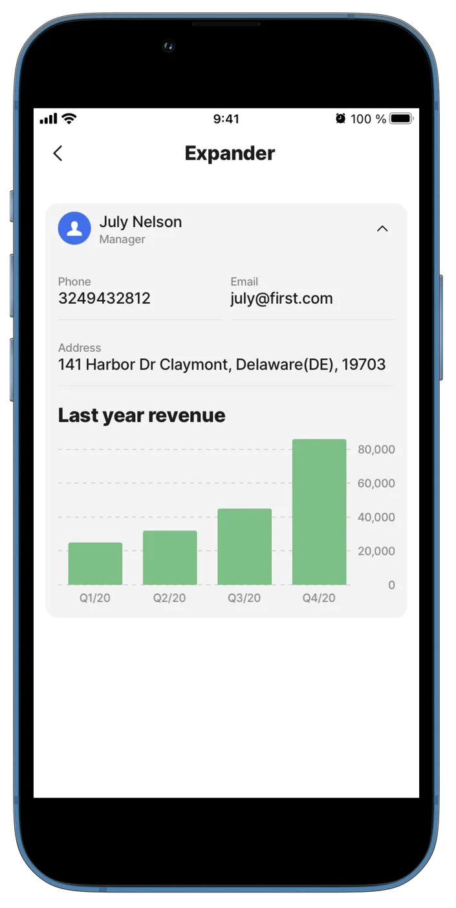

# titles



The titles component displays a title, subtitle, /comment, or any type of text content with an icon which is optional.



<figure><figcaption><p>Titles Preview</p></figcaption></figure>



## Configuration options

Some properties are common to all components, see [Common component properties](titles.md) for a list and their configuration options.

<table><thead><tr><th width="161.3125">Core structure</th><th></th></tr></thead><tbody><tr><td><code>title</code></td><td>Add text on the <code>centerElements</code> of the <code>component.expander</code>. You can add text, expressions or Text with Format in the field. Text with format includes, currency, decimal, dateTime and more.</td></tr></tbody></table>

<table><thead><tr><th width="169.18359375">Other options</th><th></th></tr></thead><tbody><tr><td><code>align</code></td><td><p>The alignment of the content inside of your component. Where the container and text should be aligned, the options are:</p><ul><li><code>left</code></li><li><code>right</code></li><li><code>center</code></li></ul></td></tr><tr><td><code>icon</code></td><td>Add an icon to the title. A list of icons is available. See for more information.</td></tr><tr><td><code>iconColor</code></td><td>Sets the color of the icon, choose a color from the provided color palette. Default color is black if the property is not specified in the YAML. See the list of available colors in .</td></tr><tr><td><code>style</code></td><td><p>The following styling sets are available:</p><ul><li><code>isNegative</code></li><li><code>isPositive</code></li><li><code>isWarning</code></li></ul></td></tr><tr><td><code>subtitle</code></td><td>Add a <code>subtitle</code>/ short description of the component.</td></tr></tbody></table>

## Consideration

* `component.titles` can only be used in the `centerElement` of the `component.expander`

## Examples and code snippets

### Expander with titles in a header



<figure><figcaption><p>Expander with titles</p></figcaption></figure>



<figure><figcaption><p>Expander with titles</p></figcaption></figure>



**Examples:**

See the full example using static data in [GitHub](https://github.com/jigx-com/jigx-samples/blob/main/quickstart/jigx-samples/jigs/jigx-components/expander/static-data/expander.jigx).\
See the full example using dynamic data in [GitHub](https://github.com/jigx-com/jigx-samples/blob/main/quickstart/jigx-samples/jigs/jigx-components/expander/dynamic-data/expander-dynamic-data.jigx).

**Datasource:**

See the full datasource for dynamic data in [GitHub](https://github.com/jigx-com/jigx-samples/blob/main/quickstart/jigx-samples/datasources/expanders%20and%20stages/expander-dynamic.jigx)



```yaml
children:
  - type: component.expander
    options:
      header:
        centerElement:
          type: component.titles
          options:
            title: July Nelson
            subtitle: Manager
            icon: person
            align: left
      children:
        - type: component.entity
          options:
            children:
              - type: component.field-row
                options:
                  children:
                    - type: component.entity-field
                      options:
                        label: Phone
                        value: "3249432812"
                    - type: component.entity-field
                      options:
                        label: Email
                        value: july@first.com
              - type: component.entity-field
                options:
                  label: Address
                  value: 141 Harbor Dr Claymont, Delaware(DE), 19703
        - type: component.bar-chart
          options:
            chart:
              title:
                text: Last year revenue
            legend:
              isHidden: true
            series:
              - data: =@ctx.datasources.series1
```



```yaml
children:
  - type: component.expander
    options:
      header:
        centerElement:
          type: component.titles
          options:
            title: =@ctx.datasources.expander-dynamic.firstname & ' ' & @ctx.datasources.expander-dynamic.lastname
            subtitle: =@ctx.datasources.expander-dynamic.position
            icon: person
            align: left
      children:
        - type: component.entity
          options:
            children:
              - type: component.field-row
                options:
                  children:
                    - type: component.entity-field
                      options:
                        label: Phone
                        value: =@ctx.datasources.expander-dynamic.phone
                    - type: component.entity-field
                      options:
                        label: Email
                        value: =@ctx.datasources.expander-dynamic.email
              - type: component.entity-field
                options:
                  label: Address
                  value: =@ctx.datasources.expander-dynamic.address
        - type: component.bar-chart
          options:
            chart:
              title:
                text: Last year revenue
            legend:
              isHidden: true
            series:
              - data: =@ctx.datasources.series1-dynamic
```



```yaml
datasources:
  expander-dynamic:
    type: datasource.sqlite
    options:
      provider: DATA_PROVIDER_DYNAMIC
      entities:
        - entity: default/employees
      query: |
        SELECT 
          id,
          '$.firstname',
          '$.lastname',
          '$.picture', 
          '$.date_from', 
          '$.date_to', 
          '$.email',
          '$.phone', 
          '$.position', 
          '$.address', 
          '$.category' 
        FROM [default/employees] WHERE '$.firstname' = "July" AND '$.category' = 'employees'
```


