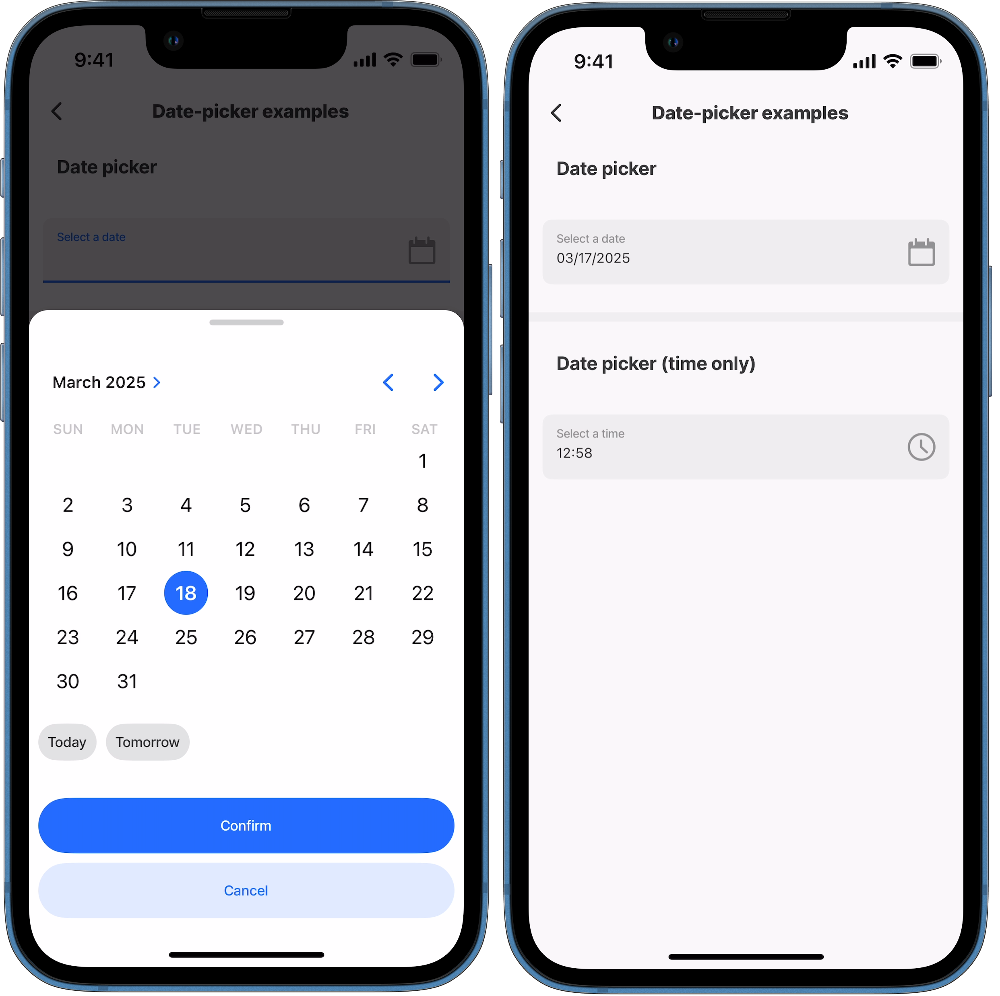
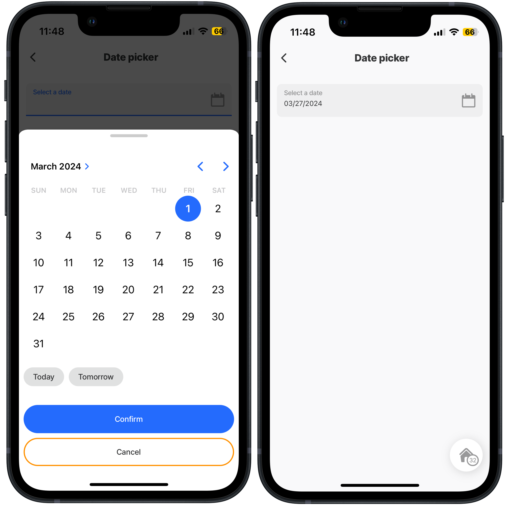
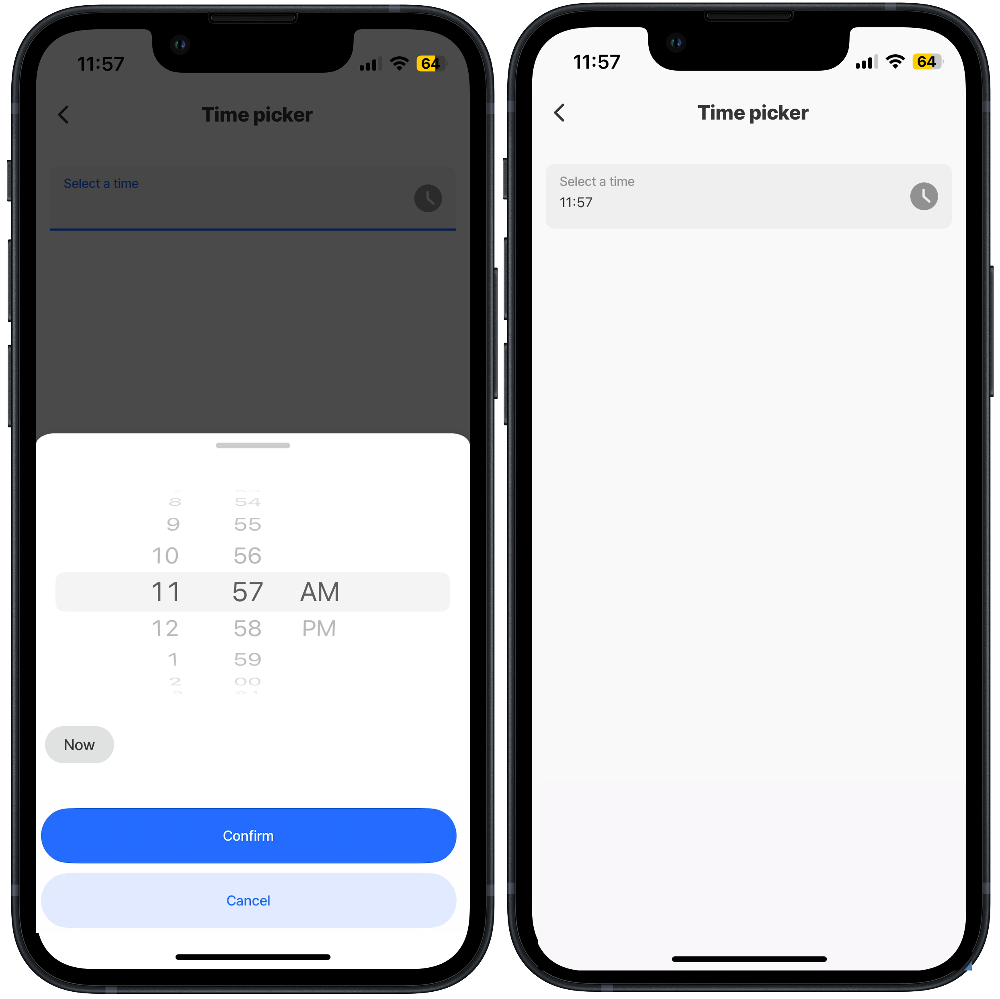
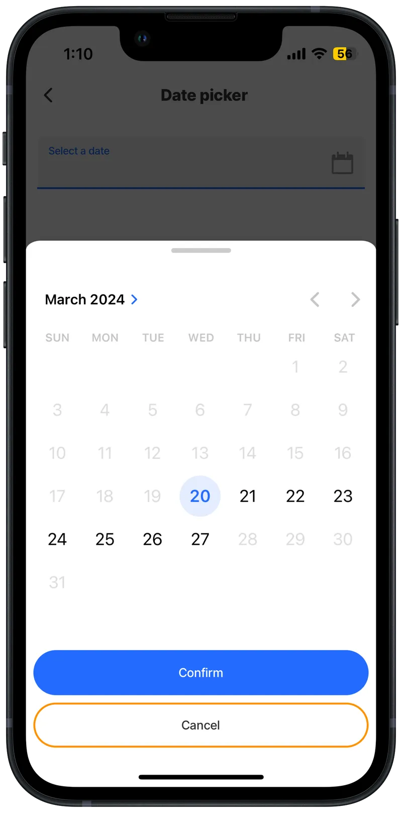

# date-picker



The date-picker component provides the functionality to select specific dates, times, or a combination of both. Date/time must be _**input**_ in [ISO Format](https://www.iso.org/iso-8601-date-and-time-format.html). You can configure how the date/time is displayed in the form by formatting the _**output**_.


The `date-picker` component can be used independently or within a `form` component, each offering distinct benefits. As a standalone, it provides flexibility for isolated usage without requiring a form structure. When wrapped in a form, it leverages the form’s instanceId, enabling better coordination and usability when managing multiple fields in a jig.




<figure><figcaption><p>Date Picker</p></figcaption></figure>



## Configuration options

Some properties are common to all components, see [Common component properties](date-picker.md) for a list and their configuration options.

<table><thead><tr><th width="197.0390625">Core structure</th><th></th></tr></thead><tbody><tr><td><code>instanceId</code></td><td>The unique identifier for the date-picker field that can be referenced elsewhere. This is useful when saving the date to a datasource.</td></tr><tr><td><code>label</code></td><td>Provide a label to guide people on the what they selecting, for example, date of birth or start date.</td></tr></tbody></table>

<table><thead><tr><th width="200.94140625">Other options</th><th></th></tr></thead><tbody><tr><td><code>color</code></td><td>Select a color from the to change the color of the field and label based on a <code>when</code> condition. First evaluated to <code>true</code> will be used.</td></tr><tr><td><code>errorText</code></td><td>Provide text message to display when field's value is not valid. The message is displayed in <code>isNegative</code> style (red). Use an expression to determine when to show the field.</td></tr><tr><td><code>format</code></td><td>Select the format of the date/time: LT - 3:28 PM LTS - 3:28:57 PM LLLL - Thursday, March 3, 2024 3:28 PM LLL - March 3, 2024 3:28 PM LL - March 3, 2024 (default) L - 03/03/2024 l - 3/3/2024 ll - Mar 3, 2024 lll - Mar 3, 2024 3:28 PM llll - Thu, Mar 3, 2024 3:28 PM HH:mm - 15:28</td></tr><tr><td><code>helperText</code></td><td><code>helperText</code> is displayed only when there is no <code>errorText</code> property configured as <code>errorText</code> takes priorty.</td></tr><tr><td><code>icon</code></td><td>Add an icon to the field. See for more information on adding icons.</td></tr><tr><td><code>isRequired</code></td><td>The default setting is <code>true</code> making the field required, useful when used in form submission. Set to <code>false</code> the field is not required and the field is marked (optional).</td></tr><tr><td><code>isIgnored</code></td><td>Set to <code>true</code>, the field is ignored when submitting the form.</td></tr><tr><td><code>isHidden</code></td><td>Set to <code>true</code>, hides the field on the form. Use an expression to determine when to hide the field.</td></tr><tr><td><code>initialValue</code></td><td>Initial value for the field. You can use this to preset the value, so user do not need to change the value and can use this as the default. Using the <code>reset-state</code> action with <code>initialValues</code> does not clear the field, it resets the date back to it's <code>initialValue</code>.</td></tr><tr><td><code>isOptionalLabelHidden</code></td><td>If the field is optional (by setting <code>isRequired</code> to <code>false</code>) , setting the <code>isOptionalLabelHidden</code> property to <code>true</code> turns off/removes the (optional) text in the label.This property works in combination with <code>isRequired: false</code>.</td></tr><tr><td><code>isAutoFocused</code></td><td>By default this field is set to <code>false</code>, use <code>true</code> to get focus immediately after it is displayed.</td></tr><tr><td><code>maximum</code></td><td>Set a maximum time range f date/ time (UTC time). For example, "2022-04-22 14:00" or "2022-04-22" or "20:00" in case of type "time". <code>Maximum</code> on Android only works with <code>date</code> mode because TimePicker does not support this option.</td></tr><tr><td><code>minimum</code></td><td>Set a minimum time range for date/ time (UTC time). For example. "2022-04-22 05:00" or "2022-04-22" or "08:00" in case of type "time". <code>Minimum</code> on Android only works with <code>date</code> mode because the TimePicker does not support this option.</td></tr><tr><td><code>mode</code></td><td>By default the mode is set to <code>date</code>. Use <code>dateTime</code> to show a date and time picker. Use <code>time</code> to only show a time picker.</td></tr><tr><td><code>nextProperty</code></td><td>Name of the next property to receive focus in the form when using submit on a virtual keyboard.</td></tr><tr><td><code>style</code></td><td><code>isPositive</code> - field shows a positive icon (green tick) <code>isBusy</code> - Displays a spinner in the right hand side of the field to show that the field is busy. <code>isDisabled</code> - Set to <code>true</code> disables the date-picker field, preventing the picker screen from popping up. <code>flex</code> - adjust the size of the field.</td></tr><tr><td><code>value</code></td><td>The value to display in the field. <code>Text</code> field is a controlled component, which means the internal value will be forced to match a UTC time, if it cannot an Invalid date error displays.</td></tr></tbody></table>

<table><thead><tr><th width="213.6875">Action</th><th></th></tr></thead><tbody><tr><td><code>onChange</code></td><td>Select an action to execute when the date-picker component's value is changed.</td></tr></tbody></table>

<table><thead><tr><th width="220.2734375">State Configuration</th><th width="162.203125">Key</th><th>Notes</th></tr></thead><tbody><tr><td><code>=@ctx.component.state.</code></td><td>value</td><td>State is the variable of the component.</td></tr><tr><td><code>=@ctx.solution.state.</code></td><td>activeItemId now</td><td>Global state variable that can be used throughout the solution.</td></tr></tbody></table>

## Considerations

* The `date-picker` component requires dates to be input in an ISO format when statically specified or from a datasource.
* The `format` property is set to show for the outputs of the field and are ready only.
* For setting the date format taking into account time zones see [Expressions - cheatsheet](https://docs.jigx.com/building-apps-with-jigx/logic/expressions/expressions-cheatsheet) for example expressions.

## Examples and code snippets

### Date picker for selecting a specific date



<figure><figcaption><p>Date picker- input + output</p></figcaption></figure>



In this an example the date-picker allows you to select a specific date in ISO format (input). Using the `mode` property set to `L` ensures the date is displayed in the field (output) as MM/DD/YYYY.

**Example:**

See the full example using static data in [GitHub](https://github.com/jigx-com/jigx-samples/blob/main/quickstart/jigx-samples/jigs/jigx-components/date-picker/date-picker-date.jigx).




```yaml
children:
  - type: component.form
    options:
      children:
        - type: component.date-picker
          instanceId: date
          options:
            label: Select a date
            format: L
```


### Date picker for selecting time



<figure><figcaption><p>Time selector - input + output</p></figcaption></figure>



In is example, only time can be selected. This is accomplished by setting the `mode` property to `time` (input). The time is formatted to display (output) as HH:mm in the field by using the `format: HH:mm` property.

**Example:**

See the full example using static data in [GitHub](https://github.com/jigx-com/jigx-samples/blob/main/quickstart/jigx-samples/jigs/jigx-components/date-picker/date-picker-time.jigx).




```yaml
children:
  - type: component.form
    options:
      children:
        - type: component.date-picker
          instanceId: time
          options:
            label: Select a time
            mode: time
            format: HH:mm
```


### Date picker with a minimum and maximum date



This example shows how to set a specific date range using the `minimum` and `maximum` properties.



<figure><figcaption><p>Date range with minimum &#x26; maximum</p></figcaption></figure>




```yaml
title: Date picker
type: jig.default
children:
  - type: component.form
    options:
      children:
        - type: component.date-picker
          instanceId: date
          options:
            minimum: 03/20/2024
            maximum: 03/27/2024
            format: L
            label: Select a date
```


## See also

* [State](https://docs.jigx.com/building-apps-with-jigx/logic/state)
