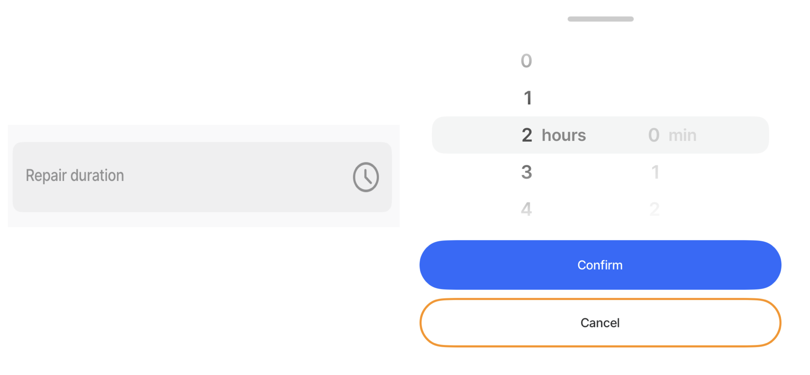

---
layout:
  width: wide
  title:
    visible: true
  description:
    visible: true
  tableOfContents:
    visible: true
  outline:
    visible: true
  pagination:
    visible: true
  metadata:
    visible: true
---

# duration-picker


{% column width="50%" %}
The duration-picker in a form allows you to specify a time duration easily. It's particularly useful for tasks that require tracking time intervals, like logging work shifts, break times, time spent on a particular task, or time-based billing. For example, if an app user needs to record the time spent performing a certain activity, a duration-picker lets them choose the time. This can simplify input by providing a user-friendly interface where they can scroll or tap to select hours or minutes rather than manually typing in numbers.

It helps to ensure data consistency and ease of use, especially for workers in fields like logistics, maintenance, or service roles who may need to record durations quickly and accurately while on the go.


{% column width="50%" %}
<figure><figcaption><p>Duration-picker</p></figcaption></figure>




The `duration-picker` component can be used independently or within a `form` component, each offering distinct benefits. As a standalone, it provides flexibility for isolated usage without requiring a form structure. When wrapped in a form, it leverages the form’s instanceId, enabling better coordination and usability when managing multiple fields in a jig.


## Configuration options

Some properties are common to all components, see [Common component properties](duration-picker.md) for a list and their configuration options.

<table><thead><tr><th width="202.42578125">Core structure</th><th></th></tr></thead><tbody><tr><td><code>instanceId</code></td><td>The unique identifier for the duration-picker, and can be used in inputs in other properties or jigs, or to set a component's state.</td></tr><tr><td><code>label</code></td><td>Provide a label/name for the duration-picker. 'Label' is displayed as a placeholder when no value is specified. is supported.</td></tr></tbody></table>

<table><thead><tr><th width="204.421875">Other options</th><th></th></tr></thead><tbody><tr><td><code>color</code></td><td>Sets the color of the duration-picker based on conditions by using the <code>when</code> property. First evaluated to <code>true</code> will be used. Choose a color from the provided color palette. Default color is grey if the property is not specified in the YAML. See the list of available colors in .</td></tr><tr><td><code>errorText</code></td><td>Add text, string, or expressions to show text under the duration-picker indicating an error/invalid value in the field. Text is shown in <code>isNegative</code> (red) styling. is supported.</td></tr><tr><td><code>helperText</code></td><td>Add text, string, or expressions to guide users by showing text under the duration-picker. Helper text is displayed only when there is no <code>errorText</code>. is supported.</td></tr><tr><td><code>hours</code></td><td><p>Specify whether the duration-picker will use hours or not.</p><ul><li><code>isEnabled</code> - <code>true</code> is the default, <code>false</code> disables the hour selector which is greyed out.</li><li><code>step</code> - Determine the increments in which the hours will be displayed. For example, an increment of 2 will display the hours for selection as 2, 4, 6, 8, ... 22.</li></ul></td></tr><tr><td><code>initialValue</code></td><td>The <code>initialValue</code> is the duration that will be displayed in the duration-picker when the form is initially loaded. Specified in seconds, for example, 1800 for 30 mins. You can use this property to preset the duration-picker with a default value so that you do not have to manually select it. For example, if most field-service appointments are 30 mins then preset the duration-picker <code>initialValue</code> property with 1800.</td></tr><tr><td><code>isHidden</code></td><td>If <code>true</code> the duration-picker will be hidden on the form. If set to <code>false</code> the field will be shown.</td></tr><tr><td><code>isIgnored</code></td><td>When <code>true</code>, the field will be ignored when submitting the form and the content will not be stored.</td></tr><tr><td><code>isOptionalLabelHidden</code></td><td>If the field is optional you can turn off the "(optional)" label by setting this field to <code>true</code>. This property works in combination with <code>isRequired: false</code>.</td></tr><tr><td><code>isRequired</code></td><td>Set to <code>true</code> when the duration-picker is required. Useful when you use it in form submission. Set to <code>false</code> the duration-picker is optional and will have (optional) in the label.</td></tr><tr><td><code>minutes</code></td><td>Specify whether the duration-picker will use minutes or not. <code>isEnabled</code> - <code>true</code> is the default, <code>false</code> disables the minute selector which is greyed out. <code>step</code> - Determine the increments in which the minutes will be displayed. For example, an increment of 15 will display the minutes for selection as 15 and 30.</td></tr><tr><td><code>nextProperty</code></td><td>Name of the property you want to focus next in the form when you use return/next on a keyboard.</td></tr><tr><td><code>style</code></td><td><p>The following property settings are available:</p><ul><li><code>flex</code> - Flex property if rendered inside row.</li><li><code>isBusy</code> - Displays spinner on right side of field. It removes any icon.</li><li><code>isDisabled</code> - disables the duration-picker preventing any time selection.</li><li><code>isPositive</code> - a green icon displays on the right of the duration-picker. More than one can be <code>true</code>. It will be evaluated based on priority.</li></ul></td></tr><tr><td><code>value</code></td><td>The value that the duration-picker will output as its state. Specified in seconds, for example, 1800 for 30 mins.</td></tr></tbody></table>

<table><thead><tr><th width="208.39453125">Actions</th><th></th></tr></thead><tbody><tr><td><code>onChange</code></td><td>The action is triggered when the time in the duration-picker is changed. Use IntelliSense (ctrl+space) to see the list of available actions.</td></tr></tbody></table>

<table><thead><tr><th width="213.7421875">State Configuration</th><th width="145.26953125">Key</th><th>Notes</th></tr></thead><tbody><tr><td><code>=@ctx.component.state.</code></td><td>value</td><td>State is the variable of the component. When used in the <code>initialValue</code>, its set as a string. When the value of the component changes, its set as a number.</td></tr><tr><td><code>=@ctx.solution.state.</code></td><td>activeItemId now</td><td>Global state variable that can be used throughout the solution.</td></tr></tbody></table>

## Considerations

* The duration-picker component can only be used in a **form** component on a **default** jig.
* The duration-picker is an input control.
* Maximum duration allowed is 23h 59 mins.
* In properties that allow you to specify the duration, for example, `initialValue` and `value`, the duration is specified in seconds, for example, 1800 for 30 mins.

## Examples and code snippets

### Basic duration-picker



<figure><figcaption><p>Duration-picker</p></figcaption></figure>



In this example, a customer manager records their interaction with a customer in the form. The `duration-picker` component is used to record the time spent with the customer. The component is configured in its simplest form, with only the `label` property defined.

**Examples:** See the full example in [GitHub](https://github.com/jigx-com/jigx-samples/blob/main/quickstart/jigx-samples/jigs/jigx-components/duration-picker/duration-picker.jigx).




```yaml
title: Customer engagement
description: Duration picker
type: jig.default

header:
  type: component.jig-header
  options:
    height: medium
    children:
      type: component.image
      options:
        source:
          uri: https://images.unsplash.com/photo-1556740758-90de374c12ad?w=500&auto=format&fit=crop&q=60&ixlib=rb-4.0.3&ixid=M3wxMjA3fDB8MHxzZWFyY2h8Mnx8Y3VzdG9tZXIlMjBzZXJ2aWNlfGVufDB8fDB8fHww

datasources:
  customer-satisfaction: 
    type: datasource.static
    options:
      data:
        - id: 1
          option: 😀 Happy
        - id: 2
          option: 😕 Neutral  
        - id: 3
          option: 😡 Sad 

children:
  - type: component.form
    instanceId: my-form
    options:
      isDiscardChangesAlertEnabled: false
      children:
        - type: component.field-row
          options:
            children:
              - type: component.text-field
                instanceId: firstName
                options:
                  label: First Name
              - type: component.text-field
                instanceId: lastName
                options:
                  label: Last Name
        - type: component.email-field  
          instanceId: email
          options:
            icon: email
            label: Email  
        - type: component.text-field
          instanceId: contact
          options:
            icon: phone
            textContentType: telephoneNumber
            label: Contact number
        - type: component.date-picker
          instanceId: call-date
          options:
            label: Select date of engagement
        # Add the duration-picker in the form component, basic configuration
        # automatically defaults with hours and minutes and does not require 
        #configuration.            
        - type: component.duration-picker
          instanceId: duration
          options:
            label: Engagement time
        - type: component.choice-field
          instanceId: satisfaction
          options:
            itemsPerRow: 3
            label: How satisfied was the customer with our service?
            data: =@ctx.datasources.customer-satisfaction
            item:
              type: component.choice-field-item
              options:
                title: =@ctx.current.item.option
                value: =@ctx.current.item.option    
            
actions:
  - children:
      - type: action.execute-entity
        options:
          title: Submit Engagement 
          provider: DATA_PROVIDER_DYNAMIC
          entity: default/customer
          method: create
          data:
            firstName: =@ctx.components.firstName.state.value
            lastName: =@ctx.components.lastName.state.value
            email: =@ctx.components.email.state.value
            contact:  =@ctx.components.contact.state.value    
            call-date: =@ctx.components.call-date.state.value
             # Save the duration selected to Dynamic Data.            
            duration: =@ctx.components.duration.state.value
            satisfaction: =@ctx.components.satisfaction.state.value 
```


### Duration-picker with hours and steps



In this example, you can complete a form to make an appointment. In the form you can select the appointment duration. The `duration-picker` is configured to only allow you to select `hours` in intervals (`steps`) of 2 hours. Minutes have been disabled.

**Examples:** See the full example in [GitHub](https://github.com/jigx-com/jigx-samples/blob/main/quickstart/jigx-samples/jigs/jigx-components/duration-picker/duration-picker-hour-steps.jigx)



<figure><figcaption><p>Duration-picker (hours only)</p></figcaption></figure>




```yaml
title: Appointment form
description: Duration picker (hours only)
type: jig.default

header:
  type: component.jig-header
  options:
    height: medium
    children:
      type: component.image
      options:
        source:
          uri: https://images.unsplash.com/photo-1703300450387-047da16a89c4?w=500&auto=format&fit=crop&q=60&ixlib=rb-4.0.3&ixid=M3wxMjA3fDB8MHxzZWFyY2h8Nnx8YXBwb2ludG1lbnQlMjBzY2hlZHVsZWluZ3xlbnwwfHwwfHx8MA%3D%3D

onRefresh: 
  type: action.reset-state
  options:
    state: =@ctx.components.appointment-form.state.data

children:
  - type: component.form
    instanceId: appointment-form
    options:
      isDiscardChangesAlertEnabled: false
      children:
        - type: component.field-row
          options:
            children:
              - type: component.text-field
                instanceId: firstName
                options:
                  label: First Name
              - type: component.text-field
                instanceId: lastName
                options:
                  label: Last Name
        - type: component.email-field  
          instanceId: email
          options:
            icon: email
            label: Email  
        - type: component.text-field
          instanceId: contact
          options:
            icon: phone
            textContentType: telephoneNumber
            label: Contact number
        - type: component.date-picker
          instanceId: appointment-date
          options:
            label: Book an appointment date
        # Add the duration-picker in the form component, configure hours to 
        # allow selections in 2 hour intervals. Disable minutes.            
        - type: component.duration-picker
          instanceId: appointment-time
          options:
            label: Select the appointment hours
            hours:
              step: 2
            minutes:
              isEnabled: false
           
actions:
  - children:
      - type: action.execute-entity
        options:
          title: Schedule appointment
          provider: DATA_PROVIDER_DYNAMIC
          entity: default/customer
          method: create
          data: 
            firstName: =@ctx.components.firstName.state.value
            lastName: =@ctx.components.lastName.state.value
            email: =@ctx.components.email.state.value
            contact:  =@ctx.components.contact.state.value    
            appointment-date: =@ctx.components.appointment-date.state.value
             # Save the duration selected to Dynamic Data.           
            appointment-time: =@ctx.components.appointment-time.state.value
```


### Duration-picker with minutes and steps



<figure><figcaption><p>Duration-picker (minute only)</p></figcaption></figure>



In this example, a security patrol officer records the security check-ins for different patrol areas. In the form the duration of the patrol is recorded. The `duration-picker` is configured to only allow the selection of `minutes` in intervals (`steps`) of 10 minutes. Hours have been disabled.

**Examples:** See the full example in [GitHub](duration-picker.md).




```yaml
title: Security check
description: Duration picker (Minutes only)
type: jig.default

header:
  type: component.jig-header
  options:
    height: medium
    children:
      type: component.image
      options:
        source:
          uri: https://images.unsplash.com/photo-1581568736305-49a04e012c13?w=500&auto=format&fit=crop&q=60&ixlib=rb-4.0.3&ixid=M3wxMjA3fDB8MHxzZWFyY2h8Mnx8c2VjdXJpdHklMjBwYXRyb2xzfGVufDB8fDB8fHww

onRefresh: 
  type: action.reset-state
  options:
    state: =@ctx.components.patrol-form.state.data

datasources:
  patrol-area: 
    type: datasource.static
    options:
      data:
        - id: 1
          zone: 1
          Description: Factory floor
        - id: 2
          zone: 2A
          Description: Outer perimeter
        - id: 3
          zone: 2B
          Description: Outer car park
        - id: 4
          zone: 3
          Description: Factory office 
        - id: 5
          zone: 4
          Description: Basement      

children:
  - type: component.form
    instanceId: patrol-form
    options:
      isDiscardChangesAlertEnabled: false
      children:
        - type: component.dropdown
          instanceId: patrol-area
          options:
            label: Area checked
            data: =@ctx.datasources.patrol-area
            item:
              type: component.dropdown-item
              options:
                title: =@ctx.current.item.Description
                value: =@ctx.current.item.Description
        # Add the duration-picker in the form component, configure minutes to 
        # allow selections in 10 minute intervals. Disable hours.                
        - type: component.duration-picker
          instanceId: patrol-duration
          options: 
            label: Patrol time
            hours:
              isEnabled: false
            minutes: 
              step: 10
        - type: component.text-field
          instanceId: issues 
          options:
            isMultiline: true
            label: Patrol incident
       
actions:
  - children:
      - type: action.execute-entity
        options:
          title: Log security checkin
          provider: DATA_PROVIDER_DYNAMIC
          entity: default/security
          method: create
          data:
            patrol-area: =@ctx.components.patrol-area.state.value
            # Save the duration selected to Dynamic Data.              
            patrol-duration: =@ctx.components.patrol-duration.state.value
            issues: =@ctx.components.issues.state.value
```


### Duration-picker with an onChange event



In this example, when the repair time is selected in the `duration-picker` the screen opens the list of repairs configured in the `onChange` property.

**Examples:** See the full example in [GitHub](https://github.com/jigx-com/jigx-samples/blob/main/quickstart/jigx-samples/jigs/jigx-components/duration-picker/duration-picker-onchange.jigx).



<figure><figcaption><p>Duration-picker with onChange event</p></figcaption></figure>




```yaml
title:  Home repair Service 
description: Duration picker with onChange
type: jig.default

header:
  type: component.jig-header
  options:
    height: medium
    children:
      type: component.image
      options:
        source:
          uri: https://images.unsplash.com/photo-1676311396794-f14881e9daaa?w=500&auto=format&fit=crop&q=60&ixlib=rb-4.0.3&ixid=M3wxMjA3fDB8MHxzZWFyY2h8MTh8fHJlcGFpciUyMHNlcnZpY2V8ZW58MHx8MHx8fDA%3D

onRefresh: 
  type: action.reset-state
  options:
    state: =@ctx.components.repair-form.state.data
    
datasources:
  repair-services-static:
    type: datasource.static
    options:
      data:
        - id: 1
          description: Installation or repairs for doors. Doors to be provided by client
          hourlyRate: 70
          materials: Door
          service: Door Installation/Repair    
        - id: 2
          description: Repairs to door handles 
          hourlyRate: 40
          materials: double lock system
          service: Door Handle/Lock Repairs              
        - id: 3
          description: Installation or repairs of tiled surfaces. Tiles have to be provided by client
          hourlyRate: 110
          materials: Tiles
          service: Tile Installation/Repair        
        - id: 4
          description: Installation or repairs of dry-wall surfaces
          hourlyRate: 80
          materials: Drywall & screws
          service: Drywall Installation/Repair          
        - id: 5
          description: Repairs to bathroom rails, toilets, etc
          hourlyRate: 90
          materials: Basin
          service: Bathroom Repairs
          
children:
  - type: component.entity
    options:
      children:
        - type: component.field-row
          options:
            children:
              - type: component.entity-field
                options:
                  label: Service Repair
                  value: =@ctx.datasources.repair-services-static[id=2].service
        - type: component.field-row
          options:
            children:
              - type: component.entity-field
                options:
                  label: Description
                  value: =@ctx.datasources.repair-services-static[id=2].description
        - type: component.field-row
          options:
            children:
              - type: component.entity-field
                options:
                  label: Hourly Rate
                  value: =@ctx.datasources.repair-services-static[id=2].hourlyRate
              - type: component.entity-field
                options:
                  label: Materials
                  value: =(@ctx.datasources.repair-services-static[id=2].materials) 
        
  - type: component.form
    instanceId: repair-form
    options:
      children:
        # Add the duration-picker in the form component, configure hours and 
        # disable minutes.    
        - type: component.duration-picker
          instanceId: repair-time
          options:
            label: Repair duration
            hours:
              isEnabled: true
              step: 1
            minutes:
              isEnabled: false
            # Configure an event to go to another jig when the duration-picker 
            #field changes.                       
            onChange: 
              type: action.go-to
              options:
                linkTo: simple-list-dd
```


### Duration-picker with initialValue

<figure><figcaption><p>Duration-picker with initialValue</p></figcaption></figure>

In this example, employees select the shifts they want to work. A normal shift is 4 hours. The `initialValue` is used in the `duration-picker` to pre-populate the field with 4h. If more than 4 hours is selected the field displays in red with a message that approval for the extra time is needed. The `duration-picker` is configured with `hours` in intervals (`steps`) of 4, and `minutes` in intervals (`steps`) of 30 minutes. Both `helperText` and `errorText` are used to guide the employee with extra information depending on the selections made.

**Examples:** See the full example in [GitHub](https://github.com/jigx-com/jigx-samples/blob/main/quickstart/jigx-samples/jigs/jigx-components/duration-picker/duration-picker-initialvalue.jigx).


```yaml
title: Shift logging
description: Duration picker with an initial value
type: jig.default

header:
  type: component.jig-header
  options:
    height: medium
    children:
      type: component.image
      options:
        source:
          uri: https://images.unsplash.com/photo-1668678437217-ad4bcac34f32?q=80&w=1740&auto=format&fit=crop&ixlib=rb-4.0.3&ixid=M3wxMjA3fDB8MHxwaG90by1wYWdlfHx8fGVufDB8fHx8fA%3D%3D

onRefresh: 
  type: action.reset-state
  options:
    state: =@ctx.components.shift-form.state.data
    
children:
  - type: component.form
    instanceId: shift-form
    options:
      children:
        - type: component.number-field
          instanceId: employee-number
          options:
            label: Employee number
        - type: component.field-row
          options:
            children:
              - type: component.text-field
                instanceId: firstName
                options:
                  label: Name
              - type: component.text-field
                instanceId: lastName
                options:
                  label: Last Name   
        - type: component.email-field  
          instanceId: email
          options:
            label: Email  
        - type: component.text-field
          instanceId: contact
          options:
            textContentType: telephoneNumber
            label: Contact number
        - type: component.field-row
          options:
            children:  
              - type: component.date-picker
                instanceId: shift-date
                options:
                  label: Select shift date 
             # Add the duration-picker in the form component, configure hours
             # and minutes with steps. Add the initialValue to prepopulate the
             # form when opened. Add helperText to inform the app user that
             # 4 hrs is the expected input. Add errortext when input is more 
             # that 4 hrs.                       
              - type: component.duration-picker
                instanceId: shift-duration
                options:
                  label: Log your shift duration
                  initialValue: 14400
                  helperText: Standard shift is 4 hours 
                  errorText: =@ctx.component.state.value > 14400 ? 'Shift time needs approval':'' 
                  hours:
                    step: 4
                  minutes:
                    step: 2  
                    
actions:
  - children:
      - type: action.execute-entity
        when: =@ctx.components.shift-duration.state.value = 14400 
        options:
          title: Allocate shift
          provider: DATA_PROVIDER_DYNAMIC
          entity: default/work
          method: create
          data:
            employee-number: =@ctx.components.employee-number.state.value
            firstName: =@ctx.components.firstName.state.value
            lastName: =@ctx.components.lastName.state.value
            email: =@ctx.components.email.state.value
            contact:  =@ctx.components.contact.state.value
            shift-date: =@ctx.components.shift-date.state.value
            # Save the duration to Dynamic data if the input is 4 hrs.            
            shift-duration: =@ctx.components.shift-duration.state.value  
      - type: action.confirm
        # If the duration input is more than 4hrs send form for approval.      
        when: =@ctx.components.shift-duration.state.value > 14400
        options:
          title: Send for approval
          isConfirmedAutomatically: false
          onConfirmed: 
            type: action.set-state
            options:
              state: =@ctx.solution.state.shift-status
              value: Waiting Approval
          modal:
            title: Shift hours sent for approval  
```


### Duration-picker with color



In this example, the `duration-picker` is added to a site inspection form, and configure with `minutes` allowing a selection in 30 minute intervals, and `hours` in 2 hour intervals. The `color` yellow (warning) is defined to let the inspector know that average inspection time is 2 hours, which is also pre-populate in the field with 2h using the `initialValue` property. `HelperText` provides additional information to the inspector indicating what is expected in the duration-picker.

**Examples:** See the full example in [GitHub](https://github.com/jigx-com/jigx-samples/blob/main/quickstart/jigx-samples/jigs/jigx-components/duration-picker/duration-picker-color.jigx).



<figure><figcaption><p>Duration-picker with color</p></figcaption></figure>




```yaml
title: Site inspection 
description: Duration picker with color
type: jig.default

header:
  type: component.jig-header
  options:
    height: medium
    children:
      type: component.image
      options:
        source:
          uri: https://images.unsplash.com/photo-1541888894402-f3b1af908be4?w=500&auto=format&fit=crop&q=60&ixlib=rb-4.0.3&ixid=M3wxMjA3fDB8MHxzZWFyY2h8Nnx8Y29uc3RydWN0aW9uJTIwd29ya2VyfGVufDB8fDB8fHww

onRefresh: 
  type: action.reset-state
  options:
    state: =@ctx.components.construction-form.state.data

datasources:
  inspection: 
    type: datasource.static
    options:
      data:
        - id: 1
          type: Plumbing
        - id: 2
          type: Electrical
        - id: 3
          type: Structural  
          
children:
  - type: component.form
    instanceId: construction-form
    options:
      isDiscardChangesAlertEnabled: false
      children:
        - type: component.text-field
          instanceId: SiteName
          options:
            label: Site name
        - type: component.text-field
          instanceId: manager
          options:
            label: Site Manager   
        - type: component.choice-field
          instanceId: type
          options:
            itemsPerRow: 3
            label: Inspection type
            data: =@ctx.datasources.inspection
            item:
              type: component.choice-field-item
              options: 
                title: =@ctx.current.item.type
                value: =@ctx.current.item.type
        - type: component.date-picker
          instanceId: inspection-date
          options:
            label: Inspection date 
        # Add the duration-picker in the form component, configure minutes to 
        # allow selection in 30 minute intervals, and hours in 2 hour intervals.
        # Color the field yellow to let the inspector know that theaverage time
        # is 2 hours.Prepopulate the field with 2h using the initialValue 
        # property. HelperText provides additional information to the component.            
        - type: component.duration-picker
          instanceId: inspection-time
          options:
           label: Inspection duration
           initialValue: 7200
           color:
             - when: true
               color: warning
           helperText: Site inspection average is 2 hours.
           hours:
             step: 2
           minutes:
             step: 30
          
actions:
  - children:
      - type: action.execute-entity
        options:
          title: Record site visit
          provider: DATA_PROVIDER_DYNAMIC
          entity: default/work
          method: create
          data:
            SiteName: =@ctx.components.SiteName.state.value
            manager: =@ctx.components.manager.state.value
            type: =@ctx.components.type.state.value
            inspection-date: =@ctx.components.inspection-date.state.value
            # Save the duration selected to Dynamic Data.            
            inspection-time: =@ctx.components.inspection-time.state.value
```

