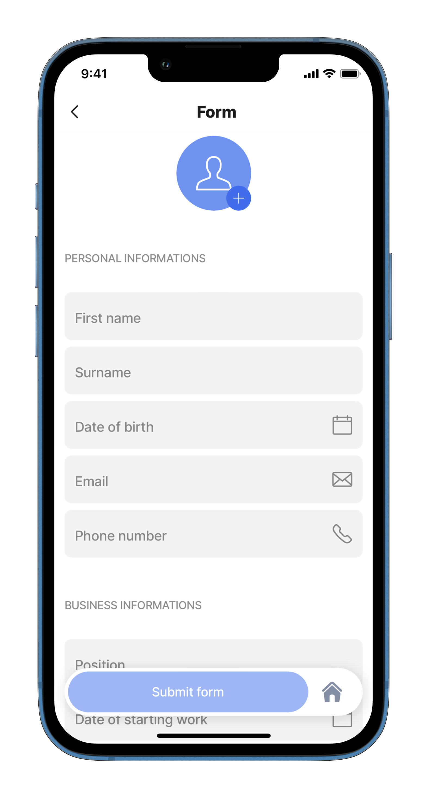
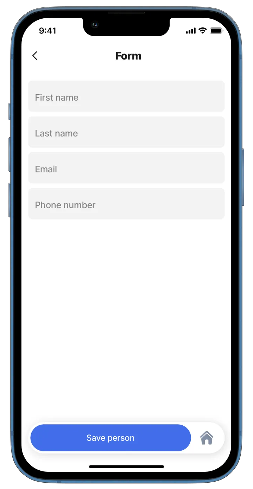
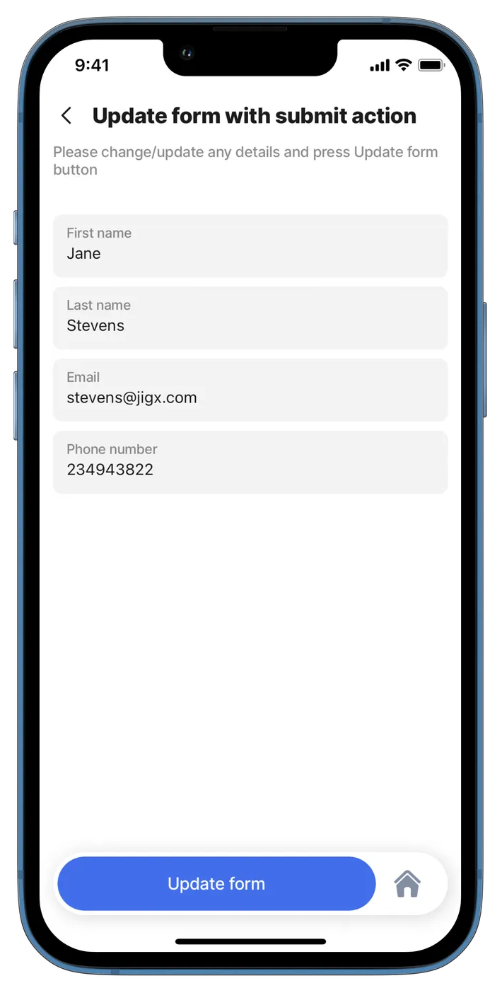
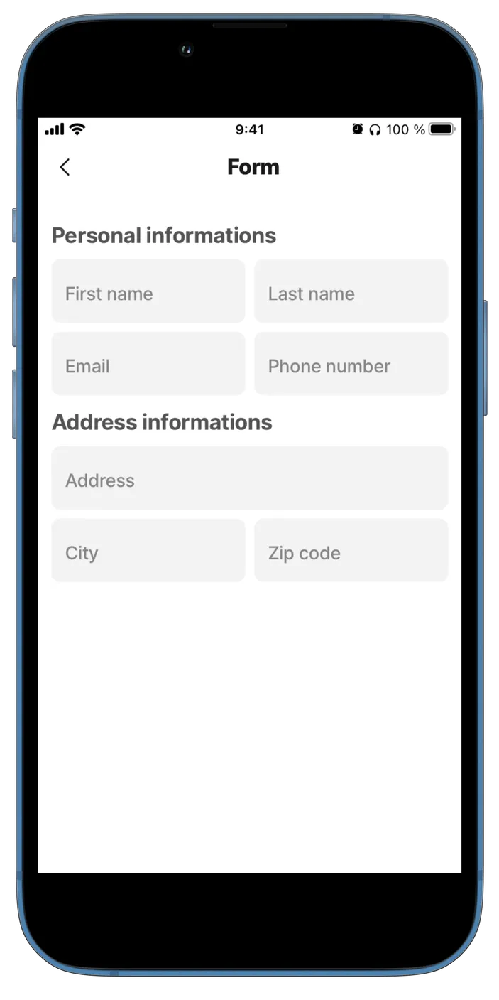

---
layout:
  width: wide
  title:
    visible: true
  description:
    visible: true
  tableOfContents:
    visible: true
  outline:
    visible: true
  pagination:
    visible: true
  metadata:
    visible: true
---

# form

Using forms in mobile apps enables users to effortlessly input and submit information, enhancing interaction and user engagement.&#x20;

A `component.form` acts as a **wrapper/container** for your app’s fields and UI components. Any component can be added inside the form, including:

* Nested input field components (text fields, checkboxes, date pickers, etc.)
* [Custom components](<../../Custom components _Alpha_/Custom components _Alpha_.md>) created in your solution
* Other [Jigx components](../../components/) (like charts, lists, or layouts)



**Benefits**

* _Form-wide referencing:_ Each form has a unique `instanceId`, allowing you to reference the entire form in expressions, actions, or functions. This makes it easier to manage validations, submissions, and state.
* _Unified wrapper_**:** A single `component.form` can wrap any `jig.default` children, such as a chart or segmented control, as well as all form input fields like text and email fields. This allows you to mix layouts, charts, and non-field components within the same form without breaking form handling.
* No need to place multiple forms on a single screen to handle different UI structures or separated field groups. You only need _one form_ wrapper per logical form.
* The form automatically collects and manages all its nested field components.



<figure><figcaption></figcaption></figure>



## Configuration options

Some properties are common to all components, see [Common component properties](form.md) for a list and their configuration options.

<table><thead><tr><th width="266.83984375">Core structure</th><th></th></tr></thead><tbody><tr><td><code>children</code></td><td>Define the content of the form by adding any components applicable to <code>jig.default</code>. See the <a href="../../components/">list of available components</a>. </td></tr><tr><td><code>instanceId</code></td><td>The unique identifier for the form.</td></tr></tbody></table>

<table><thead><tr><th width="270.57421875">Other options</th><th></th></tr></thead><tbody><tr><td><code>isDiscardChangesAlertEnabled</code></td><td>When set to <code>true</code> the modal window preventing accidental deletion of your data without saving will pop up.</td></tr><tr><td><code>initialValues</code></td><td>Specify the data to be used as <code>initialValues</code> for fields in the form. Using the <code>reset-state</code> action with <code>initialValues</code> does not clear the form, it resets the form back to it's <code>initialValue</code>. <em><strong>Tip</strong></em>: For <code>initialValues</code> on a to function <code>isDocument: true</code> in the datasource, this way you don't have to set it up in the individual components. It is set up in one place and the form will match the components to the column names of the datasource. See the example below for Form with initialValue.</td></tr></tbody></table>

<table><thead><tr><th width="264.63671875">State Configuration</th><th width="185.23046875">Key</th><th>Notes</th></tr></thead><tbody><tr><td><code>=@ctx.component.myform.state.</code></td><td>data<br>isValid<br>isDirty<br>response</td><td>State is the variable of the component.</td></tr><tr><td><code>=@ctx.solution.state.</code></td><td>activeItemId <br>now</td><td>Global state variable that can be used throughout the solution.</td></tr></tbody></table>

## Examples and code snippets

### Form for creating a record



<figure><figcaption><p>Simple form</p></figcaption></figure>



Here is an example of a form for creating records in the database. See [submit-form](../../Actions/submit-form.md) for information on how to create a record.

**Examples:**

See the full example using dynamic data in [GitHub](https://github.com/jigx-com/jigx-samples/blob/main/quickstart/jigx-samples/jigs/jigx-components/form/simple-form-submit.jigx).




```yaml
children:
  - type: component.form
    instanceId: simple-form
    options:
      children:
          - type: component.text-field
            instanceId: firstname
            options:
              label: First name
          - type: component.text-field
            instanceId: lastname
            options:
              label: Last name
          - type: component.email-field
            instanceId: email
            options:
              label: Email
          - type: component.number-field
            instanceId: phone
            options:
              label: Phone number
```


### Form for updating records



<figure><figcaption><p>Update data form</p></figcaption></figure>



This example shows how a form is used to update an existing records in the database. Notice that a new variable called **initialValue:** has been added, we load the data that we have stored in the database and then change it. See the [execute-entity](../../Actions/execute-entity.md) action for information on how to update a record.

**Examples**: See the full example using dynamic data in [GitHub](https://github.com/jigx-com/jigx-samples/blob/main/quickstart/jigx-samples/jigs/jigx-components/form/update-form-submit.jigx).

**Datasource**: See the full datasource for dynamic data in [GitHub](https://github.com/jigx-com/jigx-samples/blob/main/quickstart/jigx-samples/jigs/jigx-components/form/update-form-submit.jigx).





```yaml
actions:
  - children:
       - type: action.execute-entity
         options:
          title: Update Record
          provider: DATA_PROVIDER_DYNAMIC
          entity: default/form
          method: update
          data:
            id: =@ctx.datasources.form-update.id 
            firstname: =@ctx.components.firstname.state.value
            lastname: =@ctx.components.lastname.state.value
            email: =@ctx.components.email.state.value
            phone: =@ctx.components.phone.state.value
          onSuccess: 
            type: action.go-back
                
children:
  - type: component.form
    instanceId: form-update
    options:
      children:
          - type: component.text-field
            instanceId: firstname
            options:
              label: First name
              initialValue: =@ctx.datasources.form-update.firstname
          - type: component.text-field
            instanceId: lastname
            options:
              label: Last name
              initialValue: =@ctx.datasources.form-update.lastname
          - type: component.email-field
            instanceId: email
            options:
              label: Email
              keyboardType: email-address
              initialValue: =@ctx.datasources.form-update.email
          - type: component.number-field
            instanceId: phone
            options:
              label: Phone number
              keyboardType: number-pad
              initialValue: =@ctx.datasources.form-update.phone
```



```yaml
datasources:
  form-update:
    type: datasource.sqlite
    options:
      provider: DATA_PROVIDER_DYNAMIC
      entities:
        - default/form
      query: |
        SELECT
          id,
          '$.firstname',
          '$.lastname',
          '$.phone',
          '$.email',
          '$.category'
        FROM [default/form] WHERE '$.category' = "update-form"
```



### Form with section and field-row



<figure><figcaption><p>Form with formatting</p></figcaption></figure>



This example shows how you can format your form with sections and field-rows to create a visually appealing form.

**Examples:**

See the full example using dynamic data in [GitHub](https://github.com/jigx-com/jigx-samples/blob/main/quickstart/jigx-samples/jigs/jigx-components/form/form-with-section.jigx).




```yaml
children:
  - type: component.form
    instanceId: personal-information-form
    options:
      children:
          - type: component.section
            options:
              title: Personal information
              children:
                  - type: component.field-row
                    options:
                      children:
                          - type: component.text-field
                            instanceId: firstname
                            options:
                              label: First name
                          - type: component.text-field
                            instanceId: lastname
                            options:
                              label: Last name
                  - type: component.field-row
                    options:
                      children:
                        - type: component.email-field
                          instanceId: email
                          options:
                            label: Email
                        - type: component.number-field
                          instanceId: phone
                          options:
                            label: Phone number
          - type: component.section
            options:
              title: Address information
              children:
                - type: component.text-field
                  instanceId: address
                  options:
                    label: Address
                - type: component.field-row
                  options:
                    children:
                      - type: component.text-field
                        instanceId: city
                        options:
                          label: City
                      - type: component.number-field
                        instanceId: zip
                        options:
                          label: Zip code
```


### Form with initialValue



In this example, you tap on a contact in the contact-list and the new-contact form opens with the contact's details loaded. For `initialValues` on a [form](https://docs.jigx.com/examples/readme/components/form) to function the `isDocument: true` in the datasource is set, this way you don't have to set it up in the individual components. It is set up in one place under `InitialValue` and the form will match the components to the column names of the datasource.



<figure><figcaption><p>Form preloaded with data</p></figcaption></figure>





```yaml
title: Add new contact
type: jig.default
icon: book-address

inputs:
  id: 
    type: string
    required: true
    
header:
  type: component.jig-header
  options:
    height: medium
    children:
      type: component.image
      options:
        source:
          uri: https://images.unsplash.com/photo-1517245386807-bb43f82c33c4?ixlib=rb-4.0.3&ixid=MnwxMjA3fDB8MHxwaG90by1wYWdlfHx8fGVufDB8fHx8&auto=format&fit=crop&w=1740&q=80
        
children:
  - type: component.form
    instanceId: new-contact
    options:
# With isDocument: true in the datasource set, 
# you don't have to set initialValue up in the individual components.
# It is set up in one place and the form will match the components to the column
# names of the datasource.   
      initialValues: =@ctx.datasources.contactData
      isDiscardChangesAlertEnabled: false
      children:
        - type: component.section
          options:
            title: Personal information
            children:
              - type: component.text-field
                instanceId: firstName
                options:
                  label: First name
              - type: component.text-field
                instanceId: lastName
                options:
                  label: Last name
              - type: component.email-field
                instanceId: email
                options:
                  label: Email
                  icon: email
              - type: component.number-field
                instanceId: phone
                options:
                  label: Phone number
                  icon: phone
        - type: component.section
          options:
            title: Business information
            children:
              - type: component.text-field
                instanceId: jobTitle
                options:
                  label: Position
              - type: component.text-field
                instanceId: companyName
                options:
                  label: Company Name
            
actions:
  - children:
      - type: action.execute-entity
        options:
          title: Create Record
          provider: DATA_PROVIDER_DYNAMIC
          entity: default/contacts
          method: create
          data:
            firstName: =@ctx.components.firstName.state.value
            lastName: =@ctx.components.lastName.state.value
            email: =@ctx.components.email.state.value
            phone: =@ctx.components.phone.state.value
            jobTitle: =@ctx.components.jobTitle.state.value
            companyName: =@ctx.components.companyName.state.value
```



```yaml
datasources:
  contactData: 
    type: datasource.sqlite
    options:
# The isDocument property for the datasource is set to true.
# As a result, the datasource will return as a single record to be displayed,
# instead of an array of records.  
      isDocument: true
      provider: DATA_PROVIDER_DYNAMIC
      entities:
        - default/contacts
      query: |
        SELECT 
          id,
          '$.firstName',
          '$.lastName',
          '$.jobTitle',
          '$.companyName',
          '$.phone',
          '$.email' 
        FROM 
          [default/contacts]
         WHERE
          id = @contactId
      queryParameters:
        contactId: =@ctx.jig.inputs.id
```



```yaml
title: Contacts
type: jig.list
icon: contact

header:
  type: component.jig-header
  options:
    height: small
    children:
      type: component.image
      options:
        source:
          uri: https://images.unsplash.com/photo-1528747045269-390fe33c19f2?w=500&auto=format&fit=crop&q=60&ixlib=rb-4.0.3&ixid=M3wxMjA3fDB8MHxzZWFyY2h8Mnx8Y29udGFjdCUyMGxpc3R8ZW58MHx8MHx8fDA%3D

data: =@ctx.datasources.contacts
item:
  type: component.list-item
  options:
    title: =@ctx.current.item.firstName & ' ' & @ctx.current.item.lastName
    subtitle: =@ctx.current.item.companyName
    description: =@ctx.current.item.email
    leftElement: 
      element: avatar
      text: A
    onPress: 
      type: action.go-to
      options:
        linkTo: form-initialvalue
        parameters: 
          id: =@ctx.current.item.id
```


