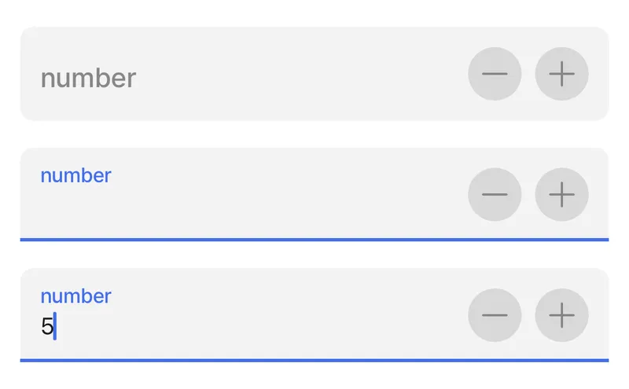

# number-field



Number fields in forms simplify the process of entering numerical information. They feature built-in validation to ensure only valid numbers are input. This optimizes user experience by automatically presenting a numeric keypad, facilitating quicker and more accurate data entry.

The component can only be used in a [jig.default](<../../Jig Types/jig_default.md>) inside of a [form](form.md) component for an input of a numeric value.



<figure><figcaption><p>Number Field Preview</p></figcaption></figure>




The `number-field` component can be used independently or within a `form` component, each offering distinct benefits. As a standalone, it provides flexibility for isolated usage without requiring a form structure. When wrapped in a form, it leverages the form’s instanceId, enabling better coordination and usability when managing multiple fields in a jig.


## Configuration options

Some properties are common to all components, see [Common component properties](number-field.md) for a list and their configuration options.

<table><thead><tr><th width="142.83984375">Core structure</th><th></th></tr></thead><tbody><tr><td><code>instanceId</code></td><td>The unique identifier for the number-field.</td></tr><tr><td><code>label</code></td><td>Provide a label/name for the number-field. 'Label' is displayed as a placeholder when no value is specified.</td></tr></tbody></table>

<table><thead><tr><th width="280.83984375">Other options</th><th></th></tr></thead><tbody><tr><td><code>color</code></td><td>Sets the color of the number-field property based on conditions by using the <code>when</code> property. First evaluated to <code>true</code> will be used. Choose a color from the provided color palette. Default color is grey if the property is not specified in the YAML. See the list of available colors in .</td></tr><tr><td><code>errorText</code></td><td>Add text, string, or expressions to show text under the number-field indicating an error/invalid value in the field. Text is shown in <code>isNegative</code> (red) styling with a red exclamation icon on the right.</td></tr><tr><td><code>format</code></td><td>Text Format of the value entered. Format is enabled only if field is configured to disabled. <code>style: isDisabled: true</code></td></tr><tr><td><code>helperText</code></td><td>Add text, string, or expressions to guide users by showing text under the number-field. Helper text is displayed only when there is no errorText.</td></tr><tr><td><code>icon</code></td><td>Add an icon to the number-field, for example a dollar icon. The icon apprears on the far right of the field. A list of icons is available. See for more information.</td></tr><tr><td><code>initialValue</code></td><td>The <code>initialValue</code> is the value that will be displayed in the number-field when the form is initially loaded. You can use this property to preset the field with a default number so that you do not have to manually select it. Using the <code>reset-state</code> action with <code>initialValues</code> does not clear the field, it resets the field back to it's <code>initialValue</code>.</td></tr><tr><td><code>isAutoFocused</code></td><td>If <code>true</code> the number-field will get focus immediately after the form is displayed and the number keyboard will be opened automatically.</td></tr><tr><td><code>isHidden</code></td><td>If <code>true</code> the number-field will be hidden on the form. If set to <code>false</code> the field will be shown.</td></tr><tr><td><code>isIgnored</code></td><td>When <code>true</code>, the field will be ignored when submitting the form and the content will not be stored.</td></tr><tr><td><code>isOptionalLabelHidden</code></td><td>If the field is optional you can turn off the "(optional)" label by setting this field to <code>true</code>. This property works in combination with <code>isRequired: false</code>.</td></tr><tr><td><code>isRequired</code></td><td>Set to <code>true</code> when the field is required. Useful when you use it in form submission as the submit button remains disabled until the number-field has a numeric input. Set to <code>false</code> the number-field is optional and will have (optional) in the label.</td></tr><tr><td><code>isReturnKeyEnabledAutomatically</code></td><td>When set to <code>true</code>, the keyboard disables the return/done key when there is no number and automatically enables it when there is a number. The default value is <code>false</code>.</td></tr><tr><td><code>isSensitive</code></td><td>If set to <code>true</code>, the number input obscures the number entered so that sensitive numbers stay secure. For example, bank card account details or salary details.</td></tr><tr><td><code>isTextClearedOnFocus</code></td><td>When set to <code>true</code>, the number-field is automatically cleared when editing begins.</td></tr><tr><td><code>KeyboardType</code></td><td><p>Determines which keyboard to open. Default is number-pad. You can select one of the following:</p><ul><li><code>decimal-pad</code></li><li><code>number-pad</code></li><li><code>numeric</code></li></ul></td></tr><tr><td><code>minimum</code></td><td>Set the minimum number limit. Used with the <code>maximum</code> property allows you to set an available number range.</td></tr><tr><td><code>maximum</code></td><td>Set the maximum number limit. Used with the <code>minimum</code> property allows you to set an available number range.</td></tr><tr><td><code>nextProperty</code></td><td>Name of the property you want to focus next in the form when you use return/next on a keyboard.</td></tr><tr><td><code>stepper</code></td><td>When the stepper <code>isEnabled</code> property is set to <code>true</code> a - and + icon is added to the right of the number field allowing you to add or subtract numbers. Use the <code>value</code> property to determine the numerical increments when the icon is pressed. For example, <code>value: 5</code> will increase the number-field by 5 each time the + icon is pressed. The stepper property is great for an invoicing or order form.</td></tr><tr><td><code>style</code></td><td><p>The following property settings are available:</p><ul><li><code>flex</code> - Flex property if rendered inside row.</li><li><code>isBusy</code> - Displays spinner on right side of field. It removes any configured icon.</li><li><code>isDisabled</code> - disables the number-field preventing any input text.</li><li><code>isPositive</code> - a green icon displays on the right of the number-field.</li></ul><p>More than one can be true. It will be evaluated based on priority.</p></td></tr><tr><td><code>value</code></td><td>The value to show in the number-field when the form initially loads. This can be combined with the <code>isDisable</code> style to preset the value that cannot be edited on the form.</td></tr></tbody></table>

<table><thead><tr><th width="159.29296875">Actions</th><th></th></tr></thead><tbody><tr><td><code>onChange</code></td><td>The action is triggered when the content in the number-field is changed. Use IntelliSense (ctrl+space) to see the list of available actions.</td></tr></tbody></table>

<table><thead><tr><th>State Configuration</th><th width="147.60546875">Key</th><th>Notes</th></tr></thead><tbody><tr><td><code>=@ctx.component.state.</code></td><td>value</td><td>State is the variable of the component.</td></tr><tr><td><code>=@ctx.solution.state.</code></td><td>activeItemId now</td><td>Global state variable that can be used throughout the solution.</td></tr></tbody></table>

## Examples and code snippets

### Number Field on Form

<figure><figcaption><p>Form with number fields</p></figcaption></figure>

The form use multiple `number-fields` property for numeric values with the following optional properties set:

1. `stepper` property to increase or decrease the number.
2. `color` property to color the label and number field purple.
3. `icon` property to show the number represents a currency in dollars.
4. `IntialValue` property preloads with a number when the form loads. The number is set using an expression.
5. `isSensitive` property obsecures the numbers when entered in the field.
6. A combination of `minimum`, `maximum` and `errorText` are used to set limits with validation on the field.

**Examples:**

See the full example using static data in [GitHub](https://github.com/jigx-com/jigx-samples/blob/main/quickstart/jigx-samples/jigs/jigx-components/number-field/static-data/number-field.jigx). See the full example using dynamic data in [GitHub](https://github.com/jigx-com/jigx-samples/blob/main/quickstart/jigx-samples/jigs/components/number-field/dynamic-data/number-field-dynamic.jigx).



```yaml
title: Number-field
type: jig.default

header:
  type: component.jig-header
  options:
    height: small
    children:
      type: component.image
      options:
        source:
          uri: https://images.unsplash.com/photo-1529078155058-5d716f45d604?q=80&w=1469&auto=format&fit=crop&ixlib=rb-4.0.3&ixid=M3wxMjA3fDB8MHxwaG90by1wYWdlfHx8fGVufDB8fHx8fA%3D%3D

children:
  - type: component.form
    instanceId: NumberForm
    options:
      children:
        - type: component.number-field
          instanceId: numberStepper
          options:
            label: Number with stepper
            stepper:
              isEnabled: true
              value: 1
        - type: component.number-field
          instanceId: numberColor
          options:
            color:
              - when: true
                color: color5
            label: Number with color
        - type: component.number-field
          instanceId: numberIcon
          options:
            icon: currency-dollar
            label: Number with icon
        - type: component.number-field
          instanceId: numberIntValue
          options:
            initialValue: =$number(5 * 2)
            label: Number with inital value from expression
        - type: component.number-field
          instanceId: numberSensitive
          options:
            isSensitive: true
            label: sensitive Number
        - type: component.number-field
          instanceId: numberLimits
          options:
            helperText: Minimum of 5 and maximum of 10 allowed
            minimum: 5
            maximum: 10
            label: Number with min, max and help text                        
```



```yaml
children:
  - type: component.form
    instanceId: number-form
    options:
      children: 
        - type: component.number-field
          instanceId: number
          options:
            label: Number 
            helperText: =@ctx.datasources.field-values.number
```



## See also

* [State](https://docs.jigx.com/state)
