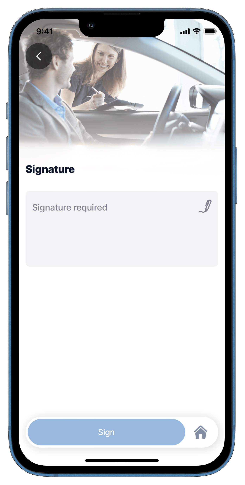

# signature-field



Simply draw your signature on your mobile screen to approve and proceed. This component can only be used in a [jig.default](<../../Jig Types/jig_default.md>) inside of a [form](../form.md) component for the input of a signature. It provides the experience of creating, uploading, and saving your eSignature in a few easy steps.



<figure><figcaption><p>Signature Field Preview</p></figcaption></figure>




The `signature-field` component can be used independently or within a `form` component, each offering distinct benefits. As a standalone, it provides flexibility for isolated usage without requiring a form structure. When wrapped in a form, it leverages the form’s instanceId, enabling better coordination and usability when managing multiple fields in a jig.


## Configuration options

Some properties are common to all components, see [Common component properties](signature-field.md) for a list and their configuration options.

<table><thead><tr><th width="163.26171875">Core structure</th><th></th></tr></thead><tbody><tr><td><code>instanceId</code></td><td>The unique identifier for the signature-field component.</td></tr><tr><td><code>label</code></td><td>Provide a label/name for the signature field. 'Label' is displayed as a placeholder when no value is specified.</td></tr></tbody></table>

<table><thead><tr><th width="207.63671875">Other options</th><th></th></tr></thead><tbody><tr><td><code>color</code></td><td>Sets the color of the signature field-based on conditions by using the <code>when</code> property. First evaluated to <code>true</code> will be used. Choose a color from the provided color palette. Default color is grey if the property is not specified in the YAML. See the list of available colors in .</td></tr><tr><td><code>errorText</code></td><td>Add text, string, or expressions to show text under the signature-field indicating an error/invalid value in the field. Text is shown in <code>isNegative</code> (red) styling with a red exclamation icon on the right.</td></tr><tr><td><code>helperText</code></td><td>Add text, string, or expressions to guide users by showing text under the signature-field. Helper text is displayed only when there is no errorText.</td></tr><tr><td><code>icon</code></td><td>Add an icon to the signature-field, for example a pen icon. The icon apprears on the far right of the field. A list of icons is available. See for more information.</td></tr><tr><td><code>initialValue</code></td><td>The <code>initialValue</code> is the value that will be displayed in the signature-field when the form is initially loaded. You can use this property to preset the field with a default signature so that you do not have to manually select it or if you already have the person signature in a datasource you can use anexpresssion to return the intial signature. Tapping on the field allows the person to re-sign the form if required. Using the <code>reset-state</code> action with <code>initialValues</code> does not clear the field, it resets the field back to it's <code>initialValue</code>.</td></tr><tr><td><code>isAutoFocused</code></td><td>If <code>true</code> the signature-field will get focus immediately after the form is displayed and the number keyboard will be opened automatically.</td></tr><tr><td><code>isHidden</code></td><td>If <code>true</code> the signature-field will be hidden on the form. If set to <code>false</code> the field will be shown.</td></tr><tr><td><code>isIgnored</code></td><td>When <code>true</code>, the field will be ignored when submitting the form and the content will not be stored.</td></tr><tr><td><code>isOptionalLabelHidden</code></td><td>If the field is optional you can turn off the "(optional)" label by setting this field to <code>true</code>. This property works in combination with <code>isRequired: false</code>.</td></tr><tr><td><code>isRequired</code></td><td>Set to <code>true</code> when the field is required. Useful when you use it in form submission as the submit button remains disabled until the signature has been applied. Set to <code>false</code> the signature-field is optional and will have (optional) in the label.</td></tr><tr><td><code>nextProperty</code></td><td>Name of the property you want to focus next in the form when you use return/next on a keyboard.</td></tr><tr><td><code>style</code></td><td><p>The following property settings are available:</p><ul><li><code>flex</code> - Flex property if rendered inside row.</li><li><code>isBusy</code> - Displays spinner on right side of field. It removes any configured icon.</li><li><code>isDisabled</code> - disables the signature property preventing any input.</li><li><code>isPositive</code> - a green icon displays on the right of the signature.</li></ul><p>More than one can be true. It will be evaluated based on priority.</p></td></tr><tr><td><code>value</code></td><td>The value to show in the signature-field when the form initially loads. This can be combined with the <code>isDisable</code> style to preset the value that cannot be edited on the form.</td></tr></tbody></table>

<table><thead><tr><th width="213.6875">Actions</th><th></th></tr></thead><tbody><tr><td><code>onChange</code></td><td>The action is triggered when the content in the signature-field is changed. Use IntelliSense (ctrl+space) to see the list of available actions.</td></tr></tbody></table>

<table><thead><tr><th width="219.45703125">State Configuration</th><th width="138.8125">Key</th><th>Notes</th></tr></thead><tbody><tr><td><code>=@ctx.component.state.</code></td><td>value</td><td>State is the variable of the component.</td></tr><tr><td><code>=@ctx.solution.state.</code></td><td>activeItemId now</td><td>Global state variable that can be used throughout the solution.</td></tr></tbody></table>

## Examples and code snippets

### Signature Field on Form



<figure><figcaption><p>Form signature</p></figcaption></figure>



The widget displays the signature input. After clicking on it, the user can create his/her eSignature.

**Example:**

See the full example in [GitHub](signature-field.md).




```yaml
children:
  - type: component.form
    instanceId: new-customer-form
    options:
      children:
        - type: component.signature-field
          instanceId: signature
          options:
            label: Signature required
```


## See also

* [State](https://docs.jigx.com/state)
