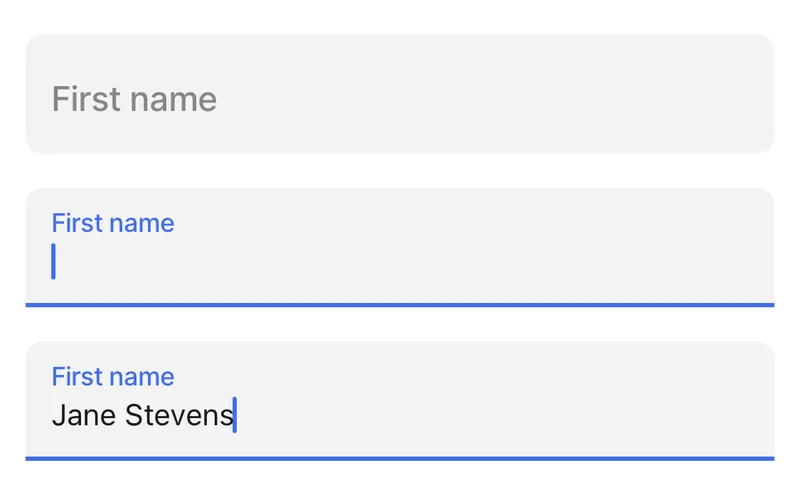
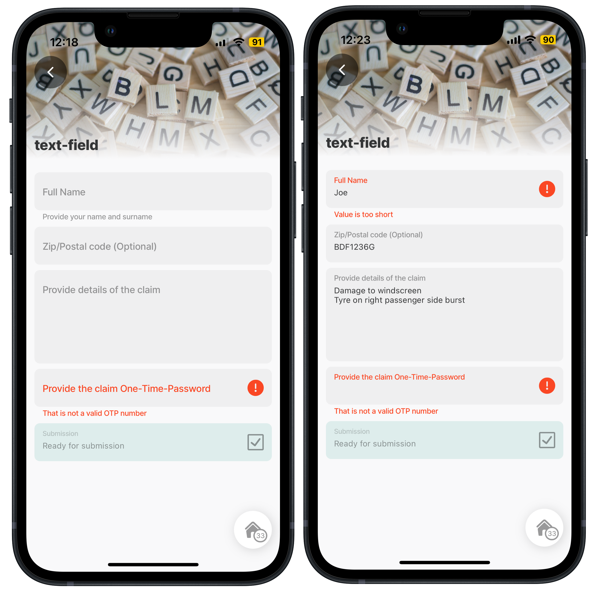
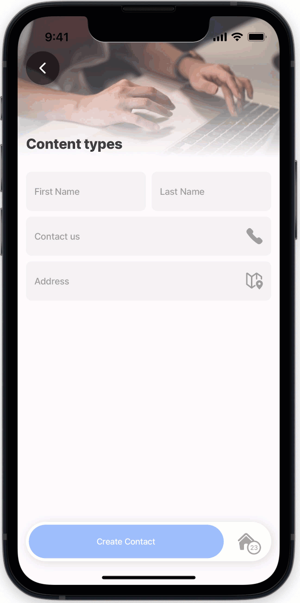

# text-field



The text field is a versatile component, allowing many variations and configurations. It allows users to enter letters, numbers, and special signs on a single or multiple lines.



<figure><figcaption><p>Text Field Preview</p></figcaption></figure>




The `text-field` component can be used independently or within a `form` component, each offering distinct benefits. As a standalone, it provides flexibility for isolated usage without requiring a form structure. When wrapped in a form, it leverages the form’s instanceId, enabling better coordination and usability when managing multiple fields in a jig.


## Configuration options

Some properties are common to all components, see [Common component properties](text-field.md) for a list and their configuration options.

<table><thead><tr><th width="156.3203125">Core structure</th><th></th></tr></thead><tbody><tr><td><code>instanceId</code></td><td>Provide a unique Id for the component that can be referenced elsewhere.</td></tr><tr><td><code>label</code></td><td>Give the field a label. Label is displayed as placeholder when no value is provided.</td></tr></tbody></table>

<table><thead><tr><th width="279.76953125">Other options</th><th></th></tr></thead><tbody><tr><td><code>autoCapatilize</code></td><td><p>This property automatically capatilzes certain parts of the text input depending on the selection made. The keyboard caps lock is automatically set depending on the selection made. This property is not supported by certian keyboard types such as name-phone-pad. The following options are available:</p><ul><li><code>characters</code> - capatilizes the all characters.</li><li><code>sentences</code> - capatilizes all words in a sentence.</li><li><code>none</code> - nothing is automatically capatalized.</li><li><code>words</code> - capatilizes all words.</li></ul></td></tr><tr><td><code>color</code></td><td>There is a list of colors available. The color is used in combination with the condition <code>when</code>. See for the available color options.</td></tr><tr><td><code>errortext</code></td><td>Add text, string, or expressions to show text under the text-field indicating an error/invalid value in the field. Text is shown in <code>isNegative</code> (red) styling with a red exclamation icon on the right.</td></tr><tr><td><code>format</code></td><td>Text format of the value entered. For example, percentage or currency. Formatting only displays in the app when the input field is set to disabled (read-only).</td></tr><tr><td><code>helperText</code></td><td>Add text, string, or expressions to guide users by showing text under the number-field. Helper text is displayed only when there is no errorText.</td></tr><tr><td><code>KeyboardType</code></td><td>Determines which keyboard to open. There is a list to select from, certain keyboard selections require a specific device or virtual keyboard.</td></tr><tr><td><code>icon</code></td><td>There is a list of icons available, see for more information.</td></tr><tr><td><code>initialValue</code></td><td>The <code>initialValue</code> is the value that will be displayed in the text-field when the form is initially loaded. You can use this property to preset the field with default text so that you do not have to manually select it. Useful when creating an edit or update form. Using the <code>reset-state</code> action with <code>initialValues</code> does not clear the field, it resets the field back to it's <code>initialValue</code>.</td></tr><tr><td><code>isAutocorrected</code></td><td>Set to <code>false</code>, disables auto-correct. The default value is <code>true</code>.</td></tr><tr><td><code>isAutoFocused</code></td><td>If <code>true</code> the text-field will get focus immediately after the form is displayed and the keyboard will be opened automatically.</td></tr><tr><td><code>isHidden</code></td><td>If <code>true</code> the text-field will be hidden on the form. If set to <code>false</code> the field will be shown.</td></tr><tr><td><code>isIgnored</code></td><td>When <code>true</code>, the field will be ignored when submitting the form and the content will not be stored.</td></tr><tr><td><code>isMultiline</code></td><td>Set to <code>true</code> allows for multiple line text input. The default value is <code>false</code> setting the field to single line.</td></tr><tr><td><code>isOptionalLabelHidden</code></td><td>If the field is optional you can turn off the "(optional)" label by setting this field to <code>true</code>. This property works in combination with <code>isRequired: false</code>.</td></tr><tr><td><code>isRequired</code></td><td>Set to <code>true</code> when the field is required. Useful when you use it in form submission as the submit button remains disabled until the text-field has an input. Set to <code>false</code> the field is optional and will have (optional) in the label.</td></tr><tr><td><code>isReturnKeyEnabledAutomatically</code></td><td>When set to <code>true</code>, the keyboard disables the return/done key when there is no text and automatically enables it when there is a text. The default value is <code>false</code>.</td></tr><tr><td><code>isSensitive</code></td><td>If set to <code>true</code>, the input obscures the text entered so that sensitive text stays secure. For example, bank card account details, passwords or salary details.</td></tr><tr><td><code>istextClearedOnFocus</code></td><td>When set to <code>true</code>, the text-field is automatically cleared when editing begins.</td></tr><tr><td><code>minLength</code></td><td>Specifies the minimum number of characters allowed in the field.</td></tr><tr><td><code>maxLength</code></td><td>Specifies the maximum number of characters allowed in the field.</td></tr><tr><td><code>nextProperty</code></td><td>Name of the property you want to focus next in the form when you use return/next on a keyboard.</td></tr><tr><td><code>returnKeyType</code></td><td>Determines the label of the return key on the keyboard, for example, <code>done</code>, <code>search</code>, <code>join</code> or <code>next</code>. On Android you can use <code>returnKeyLabel</code>.</td></tr><tr><td><code>style</code></td><td><p>The following property settings are available:</p><ul><li><code>flex</code> - Flex property if rendered inside row.</li><li><code>isBusy</code> - Displays spinner on right side of field. It removes any configured icon.</li><li><code>isDisabled</code> - disables the number-field preventing any input text.</li><li><code>isPositive</code> - a green icon displays on the right of the number-field.</li></ul><p>More than one can be true. It will be evaluated based on priority.</p></td></tr><tr><td><code>textArea</code></td><td><p>Sets the height of the text area. This property should be used in conjunction with <code>isMultiline</code>. The following property settings are available:</p><ul><li><code>dynamic</code> allows the height to change based on the text content.</li><li><code>small</code></li><li><code>medium</code></li><li><code>large</code> set the height to a relative size with a dynamic edit size.</li></ul><p>The default is undefined, which uses a static height.</p></td></tr><tr><td><code>textContentType</code></td><td>If you have setup your phone with your details these can be used as autofill hints to select for populating the text-field. For iOS 11+ you can set <code>textContentType</code> to <code>username</code> or <code>password</code> to enable autofill of login details from the device keychain. For iOS 12+ <code>newPassword</code> can be used to indicate a new password input the user may want to save in the keychain, and <code>oneTimeCode</code> can be used to indicate that a field can be autofilled by a code arriving in an SMS. To disable autofill, set <code>textContentType</code> to none.</td></tr><tr><td><code>Value</code></td><td>The value to show in the text-field when the form initially loads. This can be combined with the <code>isDisable</code> style to preset the value that cannot be edited on the form.</td></tr></tbody></table>

<table><thead><tr><th width="224.4375">Actions</th><th></th></tr></thead><tbody><tr><td><code>onChange</code></td><td>The action is triggered when the content in the text-field is changed. Use IntelliSense (ctrl+space) to see the list of available actions.</td></tr></tbody></table>

<table><thead><tr><th width="229.3046875">State Configuration</th><th width="146.16015625">Key</th><th>Notes</th></tr></thead><tbody><tr><td><code>=@ctx.component.state.</code></td><td>value</td><td>State is the variable of the component.</td></tr><tr><td><code>=@ctx.solution.state.</code></td><td>activeItemId now</td><td>Global state variable that can be used throughout the solution.</td></tr></tbody></table>

## Considerations

* When using the `contentType: phone`, ensure the phone number entered contains no spaces; this allows you to click on the field to initiate a call from your device.

## Examples and code snippets

### Text fields on a Form

<figure><figcaption><p>cc-text-field.png</p></figcaption></figure>

In this example five text-fields are used, namely:

1. The _name_ text-field uses `minLength` and `maxLength` and `helpText` properties.
2. The _Zip/Postal code_ text-field uses the `isRequired` property set to `false` making the field optional. The `autoCapitalize` property is set to `character` to ensure the keyboard caps lock is on for all characters typed in the field.
3. The _claim details_ text field uses the `isMultiline` set to `true` and `textArea` set to `medium` allowing for a full description to be input.
4. The OTP text-field property use the `errorText` and `isSensitive` properties ensuring the OTP number is obscured.
5. The submission text-field is set as `style: IsDisabled: true` with a `color` and `icon` to be displayed.

**Examples:**

See the full example using static data in [GitHub](https://github.com/jigx-com/jigx-samples/blob/main/quickstart/jigx-samples/jigs/jigx-components/text-field/static-data/text-field.jigx).\
See the full example using dynamic data in [GitHub](https://github.com/jigx-com/jigx-samples/blob/main/quickstart/jigx-samples/jigs/jigx-components/text-field/dynamic-data/text-field-dynamic.jigx).



```yaml
title: text-field
type: jig.default

header:
  type: component.jig-header
  options:
    height: small
    children:
      type: component.image
      options:
        source:
          uri: https://images.unsplash.com/photo-1592431913823-7af6b323da9b?q=80&w=2340&auto=format&fit=crop&ixlib=rb-4.0.3&ixid=M3wxMjA3fDB8MHxwaG90by1wYWdlfHx8fGVufDB8fHx8fA%3D%3D

children:
  - type: component.form
    instanceId: newApplicant
    options:
      children:
        - type: component.text-field
          instanceId: name
          options:
            minLength: 5
            maxLength: 30
            helperText: Provide your name and surname
            label: Full Name
        - type: component.text-field
          instanceId: address
          options:
            isRequired: false
            autoCapitalize: characters
            label: Zip/Postal code   
        - type: component.text-field
          instanceId: claimDetails
          options:
            isMultiline: true
            textArea: medium
            label: Provide details of the claim
        - type: component.text-field
          instanceId: claimOTP
          options:
            errorText: That is not a valid OTP number
            isSensitive: true
            label: Provide the claim One-Time-Password
        - type: component.text-field
          instanceId: claimStatus
          options:
            color:
              - when: true
                color: color6
            style:
              isDisabled: true
            icon: check-2-alternate
            label: Submission
            value: Ready for submission
```



```yaml
children:
  - type: component.form
    instanceId: text-form
    options:
      children: 
        - type: component.text-field
          instanceId: firstname
          options:
            label: Name
            helperText: =@ctx.datasources.field-values.text
```



```yaml
datasources:
  field-values:
    type: datasource.sqlite
    options:
      provider: DATA_PROVIDER_DYNAMIC
      entities:
        - entity: default/value
      query: |
        SELECT
          '$.id',
          '$.number',
          '$.text',
          '$.email',
          '$.category'
        FROM [default/value] 
        WHERE '$.category' = "field-category"
```



### Use textContentTypes to autofill text-fields



Setting certain information in your device, for example in _Settings_ on iPhone, will allow you to be able to autofill forms quickly and accurately. Then use the `contentType` property in the `text-field` on a Jigx form to specific the type, such as name, address, credit-card and more. If the information is available on the device, tapping on the field will provide an autofill hint that can be selected and the field will autofill with the details.



<figure><figcaption><p>Autofill text fields</p></figcaption></figure>




```yaml
title: Content types
type: jig.default
icon: content-browser-edit

header:
  type: component.jig-header
  options:
    height: small
    children:
      type: component.image
      options:
        source:
          uri: https://builder.jigx.com/assets/images/captureinfo.jpg

actions:
  - children:
      - type: action.action-list
        options:
          title: Create Contact
          isSequential: true
          actions:
            - type: action.execute-entity
              options:
                provider: DATA_PROVIDER_DYNAMIC
                entity: default/contacts
                method: create
                data:
                  name: =@ctx.components.name.state.value
                  surname: =@ctx.components.surname.state.value
                  phone: =@ctx.components.phone.state.value
                  address:  =@ctx.components.phone.state.value
                  onSuccess:
                  title: Your contact details were successfully created.    
            - type: action.go-back

children: 
  - type: component.form
    instanceId: Info
    options:
    isDiscardChangesAlertEnabled: false
      children:
        - type: component.field-row
          options:
            children:
              - type: component.text-field
                instanceId: name
                options:
# Provide the autofill hint for first name using textContentType                 
                  textContentType: givenName
                  label: First Name
              - type: component.text-field
                instanceId: surname
                options:
# Provide the autofill hint for surname using textContentType                
                  textContentType: familyName
                  label: Last Name 
        - type: component.text-field
          instanceId: phone
          options:
# Provide the autofill hint for phone numbers using textContentType          
            textContentType: telephoneNumber
            label: Contact us
            icon: phone
        - type: component.text-field
          instanceId: address
          options:
# Provide the autofill hint for street address using textContentType          
            textContentType: fullStreetAddress
            label: Address
            icon: maps-pin-1         
```


## See also

* [State](https://docs.jigx.com/building-apps-with-jigx/logic/state)
