# list-item

The list-item component serves as the child component whenever any list-related item has been called, as discussed in the [jig.list](<../../Jig Types/jig_list.md>) and [list](list.md) sections. The component determines how the list items are returned, allowing you to customize the data returned and add UI elements to the lists.

## Configuration options

Some properties are common to all components, see [Common component properties](list-item.md) for a list and their configuration options.

<table><thead><tr><th width="163.10546875">Core structure</th><th></th></tr></thead><tbody><tr><td><code>title</code></td><td>Add a <code>title</code> for the list-item. You can use an expression and datasource to set the title. Select <em>Line Options</em> (<code>text</code>), allowing configuration of individual parts of the central element in a list-item. You can set properties such as <code>color</code>, <code>fontSize</code>, <code>bold</code>, <code>format</code>, <code>isSubtle</code> (low opacity), and <code>numberOfLines</code>, rather than applying them globally via the root.</td></tr></tbody></table>

<table><thead><tr><th width="148.41015625">Other options</th><th></th></tr></thead><tbody><tr><td><code>color</code></td><td>The color of the list item changes based on conditions. The first evaluating to true will be used.</td></tr><tr><td><code>description</code></td><td>The subtitle or description should be displayed with the list-item title. You can format the text of these properties if you select the "Text With Format" option in the builder help (ctrl + space) or select <em>Line Options</em> (<code>text</code>), allowing configuration of individual parts of the central element in a list-item. You can set properties such as <code>color</code>, <code>fontSize</code>, <code>bold</code>, <code>format</code>, <code>isSubtle</code> (low opacity), and <code>numberOfLines</code>, rather than applying them globally via the root. select .</td></tr><tr><td><code>divider</code></td><td><p>Set the space between two items in the list.</p><ul><li><code>none</code> - No divider is shown between items. Set by default.</li><li><code>transparent</code> - Sets a 1pt margin between two items.</li><li><code>solid</code> - Displays a colored line between two items. When the list-item is contained in a card, this property will be ignored.</li></ul></td></tr><tr><td><code>isContained</code></td><td>Used to style the list item, <code>true</code> wraps the list item in a card, while <code>false</code> displays the item with no styling. This property can be used with vertical and horizontal lists.</td></tr><tr><td><code>leftElement</code></td><td><p>Set an element to the left of the list. The following elements are available:</p><ul><li><code>avatar</code> - configure the <code>color</code>, <code>size</code>, <code>text</code>, <code>uri</code>, and <code>onPress</code> event.</li><li><code>checkbox</code></li><li><code>icon</code> - the icon <code>size</code>, <code>color</code>,<code>shape</code>, <code>type</code>, <code>isSubtle</code> (low opacity), and <code>onPress</code> event is configurable.</li><li><code>image</code> - the image <code>size</code>, <code>shape</code>, <code>resizeMode</code>, and <code>onPress</code> event is configurable.</li><li><code>progress</code></li></ul></td></tr><tr><td><code>numberOfLines</code></td><td><p>Specify the maximum number of lines for the <code>description</code> and <code>subtitle</code> properties at a global root level. Property values are:</p><ul><li><code>dynamic</code>- displays all lines of text.</li><li>Numerical value (e.g., <code>2</code>) - Limits the <code>description</code> and <code>subtitle</code> to the specified number of lines.</li></ul></td></tr><tr><td><code>progress</code></td><td>Add a colorful visualization (background color of your choice) of the list item's progress. The color displays from left to right, and the range of the allowed values is from 0 to 1.</td></tr><tr><td><code>rating</code></td><td>Displays a rating as either a numerical value or a percentage. This property is highly flexible, with options to configure the <code>ratingIcon</code>, <code>color</code>, and accompanying descriptive <code>text</code>. By default, the rating property has only one icon showing a rating-star in the primary color. <code>value</code>- Rating with numerical value. The value of the rating, which can be a simple number. The number of icons is calculated based on this value unless overridden in the icon configuration. Configuring the <code>current</code> and <code>maximum</code> values, shows the value as a fraction, for example 7/10. <code>percentage</code> - Rating with a percentage. The percentage value for the rating, where the value ranges between 0 and 1, for example 0.75 is 75%. <code>ratingIcon</code> - By default the <em>rating-star</em> icon in the <em>primary</em> color is displayed. <code>icon</code> - Add an icon to represent the rating. A list of icons is available. See for more information. <code>color</code>- Sets the color of the icon, choose a color from the provided color palette. Default color is primary if the property is not specified in the YAML. See the list of available colors in . <code>current</code> and <code>maximum</code> values - Where maximum is the number of icons to display and current the number of icons to color. <code>text</code> - Add a descriptive text that displays next to the rating. Ratings can set up in the following ways: 1) Example of <code>value</code> for a product rating. 2) Example of a user rating shown in a <code>percentage</code>. 3)Example of <code>value</code> rating showing 2.5/5 as a rating with single star icon.</td></tr><tr><td><code>rightElement</code></td><td><p>Set an element to the right of the list. The following elements are available:</p><ul><li><code>amountControl</code></li><li><code>badge</code> - can be a solid colored badge or a badge with a number in it. Badges always use the primary color.</li><li><code>button</code></li><li><code>checkbox</code></li><li><code>icon</code> - the icon <code>size</code>, <code>color</code>,<code>shape</code>, <code>type</code>, <code>isSubtle</code> (low opacity), and <code>onPress</code> event is configurable.</li><li><code>switch</code></li><li><code>value</code> - When using <code>text</code>, the option to change its <code>color</code> is available.</li><li><code>text</code> - define up to three lines of text with styling (color, bold, font size) applied to each line of text.</li></ul></td></tr><tr><td><code>subtitle</code></td><td>The subtitle or description should be displayed together with the title on the list-item. You can format the text of these properties if you select the <code>Text With Format</code> option in the IntelliSense (ctrl + space) or select <em>Line Options</em> (<code>text</code>), allowing configuration of individual parts of the central element in a list-item. You can set properties such as <code>color</code>, <code>fontSize</code>, <code>bold</code>, <code>format</code>, <code>isSubtle</code> (low opacity), and <code>numberOfLines</code>, rather than applying them globally via the root.</td></tr><tr><td><code>tags</code></td><td><p>A set of descriptive keywords appear at the bottom of each list item, helping to categorize and provide context. Unlike labels, multiple tags can be shown. Tags support up to two lines; if the tags exceed this space, a +1 indicator is added to represent the number of hidden tags. For example, if two tags are hidden, +2 will display at the end of the list.</p><ul><li><code>text</code> - The text content displayed within the tag.</li><li><code>color</code> - Sets the color of the tags, choose a color from the provided color palette. The default is primary. See the list of available colors in.</li></ul><p>Tags can be set up in three ways:</p><ol><li>Using a dynamic expression from a datasource: <code>tags: =@ctx.datasources.product-tags[product = @ctx.current.item.id].{"text":tags, "color":color}</code></li><li>Using a dynamic expression from a list item: <code>tags: =@ctx.current.item.tags.{"text":$, "color":"primary"}</code></li><li>Using static, predefined tags <code>tags: - text: =@ctx.current.item.rating > 0.75 ? 'Great'</code></li></ol></td></tr></tbody></table>



```yaml
rating:
   value: 4.5
   text: based on 1,200 reviews
```



```yaml
percentage:
rating:
   percentage: 0.75
   text: expectations exceeded
```



```yaml
rating:
   value:
      current: 2.5 
      maximum: 5 
   ratingIcon:
      icon: rating-star
```



| **Actions** |                                                                                                                                                                             |
| ----------- | --------------------------------------------------------------------------------------------------------------------------------------------------------------------------- |
| `onPress`   | The action is available with the `swipeable` action and is triggered when pressing an item in the list. Use IntelliSense (ctrl+space) to see the list of available actions. |
| `swipeable` | Use the `swipeable` property to add the `onPress` action. The action will appear and become pressable by swiping the list-item to the left or right.                        |

| **State Configuration**  | **Key**          | **Notes**                                                                                                                                                                        |
| ------------------------ | ---------------- | -------------------------------------------------------------------------------------------------------------------------------------------------------------------------------- |
| `=@ctx.current.state.`   | amount checked   | Applies to a list, list.item, product-item, and stage components. List's data is an array of records. The `=@ctx.current.state` is the state of the current object in the array. |
| `=@ctx.component.state.` | amount checked   | State is the variable of the component.                                                                                                                                          |
| `=@ctx.solution.state.`  | activeItemId now | Global state variable that can be used throughout the solution.                                                                                                                  |

## Considerations

* You can use a list-item outside of the list component. This allows configuring a single list item with all list-item features, such as left and right elements and swipe actions, without requiring a full list. These items typically use static values rather than a datasource. See the _List-item outside a list_ code example below. The functionality is available in the following components:
  * [jig.default](<../../Jig Types/jig_default.md>) children
  * [Custom components (Alpha)](<../../Custom components _Alpha_/Custom components _Alpha_.md>) children
  * [expander](../expander/expander.md)
  * [card](../card.md)
  * [section](../entity/section.md)

## Examples and code snippets

## Simple list



<figure>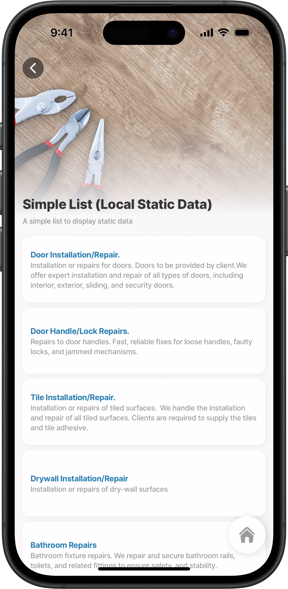<figcaption><p>Simple list</p></figcaption></figure>



This example displays the list in its most basic form, with a few additional properties or elements to support layout and data visibility.

**Examples:** See the full example using static data [local](https://github.com/jigx-com/jigx-samples/blob/main/quickstart/jigx-samples/jigs/jig-types/jig-list/simple-lists/static-data/simple-list-sd-local.jigx) and [global](https://github.com/jigx-com/jigx-samples/blob/main/quickstart/jigx-samples/jigs/jig-types/jig-list/simple-lists/static-data/simple-list-sd-global.jigx) in GitHub. See the full example using dynamic data in [GitHub](https://github.com/jigx-com/jigx-samples/blob/main/quickstart/jigx-samples/jigs/jig-types/jig-list/simple-lists/dynamic-data/simple-list-dd.jigx_).

**Datasources:** See the full datasource for static data in [GitHub](https://github.com/jigx-com/jigx-samples/blob/main/quickstart/jigx-samples/datasources/services/repair-services-static.jigx). See the full datasource for dynamic data in [GitHub](https://github.com/jigx-com/jigx-samples/blob/main/quickstart/jigx-samples/datasources/services/cleaning-services-dynamic.jigx).&#x20;





```yaml
# Data configured to use datasource (static) 
data: =@ctx.datasources.repair-services-static
item:
  type: component.list-item
  options:
    # Display each list-item in a container. 
    isContained: true
    # Define the title and the title styling.
    title:
      text: =@ctx.current.item.service
      fontSize: regular
      color: color1
      isBold: true
   # Define and style the subtitle. Ensure text wraps to the next line.
    subtitle:
      text: =@ctx.current.item.description
      fontSize: small
      isSubtle: true
      numberOfLines: 3
```



```yaml
# Data configured to use datasource (dynamic) 
data: =@ctx.datasources.cleaning-services-dynamic
item:
  type: component.list-item
  options:
    # Define the title and the title styling.
    title:
      text: =@ctx.current.item.service
      fontSize: regular
      color: color1
      isBold: true
    # Define and style the subtitle. Ensure text wraps to the next line.
    subtitle:
      text: =@ctx.current.item.area
      fontSize: small
      isSubtle: true
      numberOfLines: 3
```



```yaml
datasources:
  repair-services-static:
    type: datasource.static
    options:
      data:
        - id: 1
          description: Installation or repairs for doors. Doors to be provided by client.We offer expert installation and repair of all types of doors, including interior, exterior, sliding, and security doors.
          hourlyRate: 70
          illustration: https://clipart-library.com/data_images/436224.png
          image: https://images.unsplash.com/photo-1500281781950-6cd80847ebcd?ixlib=rb-1.2.1&ixid=MnwxMjA3fDB8MHxwaG90by1wYWdlfHx8fGVufDB8fHx8&auto=format&fit=crop&w=1469&q=80
          materials: false
          service: Door Installation/Repair.
          time: 60
        - id: 2
          description: Repairs to door handles. Fast, reliable fixes for loose handles, faulty locks, and jammed mechanisms.
          hourlyRate: 40
          illustration: https://clipart-library.com/img1/1332215.jpg
          image: https://images.unsplash.com/photo-1538766017398-415434a31a5b?ixlib=rb-1.2.1&ixid=MnwxMjA3fDB8MHxwaG90by1wYWdlfHx8fGVufDB8fHx8&auto=format&fit=crop&w=1470&q=80
          materials: true
          service: Door Handle/Lock Repairs.
          time: 60
        - id: 3
          description: Installation or repairs of tiled surfaces.  We handle the installation and repair of all tiled surfaces. Clients are required to supply the tiles and tile adhesive.
          hourlyRate: 110
          illustration: https://clipart-library.com/images/kcKnbzbXi.jpg
          image: https://images.unsplash.com/photo-1523413184730-e85dbbd04aba?ixlib=rb-1.2.1&ixid=MnwxMjA3fDB8MHxwaG90by1wYWdlfHx8fGVufDB8fHx8&auto=format&fit=crop&w=687&q=80
          materials: false
          service: Tile Installation/Repair.
          time: 120
        - id: 4
          description: Installation or repairs of dry-wall surfaces
          hourlyRate: 80
          illustration: https://clipart-library.com/img1/505759.jpg
          image: https://images.unsplash.com/photo-1628901551715-7234d14fb7a0?ixlib=rb-1.2.1&ixid=MnwxMjA3fDB8MHxwaG90by1wYWdlfHx8fGVufDB8fHx8&auto=format&fit=crop&w=1470&q=80
          materials: true
          service: Drywall Installation/Repair
          time: 120
        - id: 5
          description: Bathroom fixture repairs. We repair and secure bathroom rails, toilets, and related fittings to ensure safety, and stability.
          hourlyRate: 90
          illustration: https://clipart-library.com/new_gallery/53-530190_black-and-white-toilet-png.png
          image: https://images.unsplash.com/photo-1585313647787-7a061b5a85a6?ixlib=rb-1.2.1&ixid=MnwxMjA3fDB8MHxwaG90by1wYWdlfHx8fGVufDB8fHx8&auto=format&fit=crop&w=1423&q=80
          materials: true
          service: Bathroom Repairs
          time: 60
        - id: 6
          description: Painting as required. Paint and tools not provided.
          hourlyRate: 70
          illustration: https://clipart-library.com/img/853166.jpg
          image: https://images.unsplash.com/photo-1562259949-e8e7689d7828?ixlib=rb-1.2.1&ixid=MnwxMjA3fDB8MHxwaG90by1wYWdlfHx8fGVufDB8fHx8&auto=format&fit=crop&w=1431&q=80
          materials: false
          service: Painting Services
          time: 120
        - id: 7
          description: Repairs to fences. Tools and items not included.
          hourlyRate: 90
          illustration: https://clipart-library.com/img/18345.gif
          image: https://images.unsplash.com/photo-1583805978118-ba9a81ac1399?ixlib=rb-1.2.1&ixid=MnwxMjA3fDB8MHxwaG90by1wYWdlfHx8fGVufDB8fHx8&auto=format&fit=crop&w=1470&q=80
          materials: false
          service: Fence Installation/Repair
          time: 60
        - id: 8
          description: Removal of graffiti and painting. Paint and brushes not included in cost.
          hourlyRate: 110
          illustration: https://clipart-library.com/images/6cy5aL5gi.jpg
          image: https://images.unsplash.com/photo-1581850518616-bcb8077a2336?ixlib=rb-1.2.1&ixid=MnwxMjA3fDB8MHxwaG90by1wYWdlfHx8fGVufDB8fHx8&auto=format&fit=crop&w=1470&q=80
          materials: false
          service: Removal of Graffiti
          time: 120
        - id: 9
          description: Repairs to cupboard doors.
          hourlyRate: 60
          illustration: https://clipart-library.com/img1/1605140.jpg
          image: https://images.unsplash.com/photo-1522791465802-47616431a4cf?ixlib=rb-1.2.1&ixid=MnwxMjA3fDB8MHxwaG90by1wYWdlfHx8fGVufDB8fHx8&auto=format&fit=crop&w=1451&q=80
          materials: true
          service: Cupboard Door Repairs
          time: 60
        - id: 10
          description: Plumbing issues and repairs. Ideal for addressing loose fixtures, leaks, or general wear and tear.
          hourlyRate: 90
          illustration: https://clipart-library.com/images_k/plumbing-silhouette/plumbing-silhouette-6.png
          image: https://images.unsplash.com/photo-1591804774220-c1db3673d05b?ixlib=rb-1.2.1&ixid=MnwxMjA3fDB8MHxwaG90by1wYWdlfHx8fGVufDB8fHx8&auto=format&fit=crop&w=1074&q=80
          materials: true
          service: Plumbing
          time: 60
```



```yaml
datasources:
  cleaning-services-dynamic:
    type: datasource.sqlite
    options:
      provider: DATA_PROVIDER_DYNAMIC
      entities:
        - entity: default/cleaning-services
      query: |
        SELECT 
          id, 
          '$.id' as sqlid, 
          '$.area', 
          '$.description', 
          '$.hourlyrate', 
          '$.illustration', 
          '$.image', 
          '$.indoor', 
          '$.onceoffrate', 
          '$.service', 
          '$.pressed', 
          '$.time',
          '$.quantity'
        FROM [default/cleaning-services]
        WHERE '$.hourlyrate' IS NOT NULL ORDER BY id DESC
```



## Simple list with dividers



<figure><figcaption><p>Simple list Simple list with dividers</p></figcaption></figure>



This example shows only a slight variation from the previous example, by having a `divider : solid` properly configured.

**Examples:** See the full example using static data in [GitHub](https://github.com/jigx-com/jigx-samples/blob/main/quickstart/jigx-samples/jigs/jig-types/jig-list/simple-lists/static-data/simple-list-divider-sd.jigx). See the full example using dynamic data in [GitHub](https://github.com/jigx-com/jigx-samples/blob/main/quickstart/jigx-samples/jigs/jig-types/jig-list/simple-lists/dynamic-data/simple-list-divider-dd.jigx).

**Datasources:** See the full datasource for static data in [GitHub](https://github.com/jigx-com/jigx-samples/blob/main/quickstart/jigx-samples/datasources/services/repair-services-static.jigx). See the full datasource for dynamic data in [GitHub](https://github.com/jigx-com/jigx-samples/blob/main/quickstart/jigx-samples/datasources/services/cleaning-services-dynamic.jigx).&#x20;





```yaml
# Data configured to use datasource (static) 
data: =@ctx.datasources.repair-services-static
item:
  type: component.list-item
  options:
    # Add a solid line divider between each list-item.
    divider: solid
    # Define the title and the title styling.
    title:
      text: =@ctx.current.item.service
      fontSize: regular
      color: color4
      isBold: true
    # Define and style the subtitle. Ensure text wraps to the next line. 
    subtitle:
      text: =@ctx.current.item.description
      fontSize: small
      isSubtle: true
      numberOfLines: 3
```



```yaml
# Data configured to use datasource (dynamic) 
data: =@ctx.datasources.cleaning-services-dynamic
item:
  type: component.list-item
  options:
    # Add a solid line divider between each list-item.
    divider: solid
    # Define the title and the title styling.
    title:
      text: =@ctx.current.item.service
      fontSize: regular
      color: color4
      isBold: true
    # Define and style the subtitle. Ensure text wraps to the next line. 
    subtitle:
      text: =@ctx.current.item.area
      fontSize: small
      isSubtle: true
      numberOfLines: 3
```



```yaml
datasources:
  repair-services-static:
    type: datasource.static
    options:
      data:
        - id: 1
          description: Installation or repairs for doors. Doors to be provided by client
          hourlyRate: 70
          illustration: http://clipart-library.com/data_images/436224.png
          image: https://images.unsplash.com/photo-1500281781950-6cd80847ebcd?ixlib=rb-1.2.1&ixid=MnwxMjA3fDB8MHxwaG90by1wYWdlfHx8fGVufDB8fHx8&auto=format&fit=crop&w=1469&q=80
          materials: false
          service: Door Installation/Repair
          time: 60
        - id: 2
          description: Repairs to door handles 
          hourlyRate: 40
          illustration: http://clipart-library.com/img1/1332215.jpg
          image: https://images.unsplash.com/photo-1538766017398-415434a31a5b?ixlib=rb-1.2.1&ixid=MnwxMjA3fDB8MHxwaG90by1wYWdlfHx8fGVufDB8fHx8&auto=format&fit=crop&w=1470&q=80
          materials: true
          service: Door Handle/Lock Repairs
          time: 60        
        - id: 3
          description: Installation or repairs of tiled surfaces. Tiles have to be provided by client
          hourlyRate: 110
          illustration: http://clipart-library.com/images/kcKnbzbXi.jpg
          image: https://images.unsplash.com/photo-1523413184730-e85dbbd04aba?ixlib=rb-1.2.1&ixid=MnwxMjA3fDB8MHxwaG90by1wYWdlfHx8fGVufDB8fHx8&auto=format&fit=crop&w=687&q=80
          materials: false
          service: Tile Installation/Repair
          time: 120
        - id: 4
          description: Installation or repairs of dry-wall surfaces
          hourlyRate: 80
          illustration: http://clipart-library.com/img1/505759.jpg
          image: https://images.unsplash.com/photo-1628901551715-7234d14fb7a0?ixlib=rb-1.2.1&ixid=MnwxMjA3fDB8MHxwaG90by1wYWdlfHx8fGVufDB8fHx8&auto=format&fit=crop&w=1470&q=80
          materials: true
          service: Drywall Installation/Repair
          time: 120
        - id: 5
          description: Repairs to bathroom rails, toilets, etc
          hourlyRate: 90
          illustration: http://clipart-library.com/new_gallery/53-530190_black-and-white-toilet-png.png
          image: https://images.unsplash.com/photo-1585313647787-7a061b5a85a6?ixlib=rb-1.2.1&ixid=MnwxMjA3fDB8MHxwaG90by1wYWdlfHx8fGVufDB8fHx8&auto=format&fit=crop&w=1423&q=80
          materials: true
          service: Bathroom Repairs
          time: 60
        - id: 6
          description: Painting as required. Paint and tools not provided 
          hourlyRate: 70
          illustration: http://clipart-library.com/img/853166.jpg
          image: https://images.unsplash.com/photo-1562259949-e8e7689d7828?ixlib=rb-1.2.1&ixid=MnwxMjA3fDB8MHxwaG90by1wYWdlfHx8fGVufDB8fHx8&auto=format&fit=crop&w=1431&q=80
          materials: false
          service: Painting Services
          time: 120
        - id: 7
          description: Repairs to fences. Tools and items not included
          hourlyRate: 90
          illustration: http://clipart-library.com/img/18345.gif
          image: https://images.unsplash.com/photo-1583805978118-ba9a81ac1399?ixlib=rb-1.2.1&ixid=MnwxMjA3fDB8MHxwaG90by1wYWdlfHx8fGVufDB8fHx8&auto=format&fit=crop&w=1470&q=80
          materials: false
          service: Fence Installation/Repair
          time: 60
        - id: 8
          description: Removal of graffiti and painting. Paint and brushes not included in cost
          hourlyRate: 110
          illustration: http://clipart-library.com/images/6cy5aL5gi.jpg
          image: https://images.unsplash.com/photo-1581850518616-bcb8077a2336?ixlib=rb-1.2.1&ixid=MnwxMjA3fDB8MHxwaG90by1wYWdlfHx8fGVufDB8fHx8&auto=format&fit=crop&w=1470&q=80
          materials: false
          service: Removal of Graffiti
          time: 120
        - id: 9
          description: Repairs to cupboard doors
          hourlyRate: 60
          illustration: http://clipart-library.com/img1/1605140.jpg
          image: https://images.unsplash.com/photo-1522791465802-47616431a4cf?ixlib=rb-1.2.1&ixid=MnwxMjA3fDB8MHxwaG90by1wYWdlfHx8fGVufDB8fHx8&auto=format&fit=crop&w=1451&q=80
          materials: true
          service: Cupboard Door Repairs
          time: 60
        - id: 10
          description: Plumbing issues and repairs
          hourlyRate: 90
          illustration: http://clipart-library.com/images_k/plumbing-silhouette/plumbing-silhouette-6.png
          image: https://images.unsplash.com/photo-1591804774220-c1db3673d05b?ixlib=rb-1.2.1&ixid=MnwxMjA3fDB8MHxwaG90by1wYWdlfHx8fGVufDB8fHx8&auto=format&fit=crop&w=1074&q=80
          materials: true
          service: Plumbing
          time: 60
```



```yaml
datasources:
  cleaning-services-dynamic:
    type: datasource.sqlite
    options:
      provider: DATA_PROVIDER_DYNAMIC
      entities:
        - entity: default/cleaning-services
      query: |
        SELECT 
          id, 
          '$.id' as sqlid, 
          '$.area', 
          '$.description', 
          '$.hourlyrate', 
          '$.illustration', 
          '$.image', 
          '$.indoor', 
          '$.onceoffrate', 
          '$.service', 
          '$.pressed', 
          '$.time',
          '$.quantity'
        FROM [default/cleaning-services] 
        WHERE '$.hourlyrate' IS NOT NULL ORDER BY id DESC
```



## List with colored progress bars



<figure>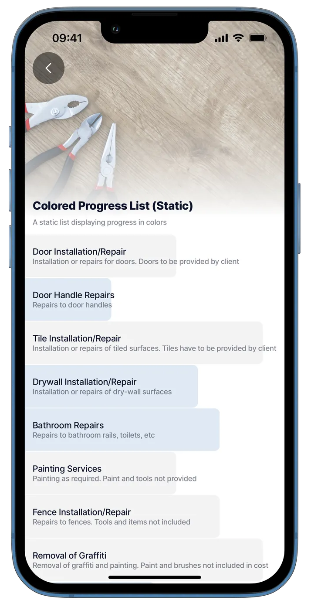<figcaption><p>List with colored progress</p></figcaption></figure>



This example showcases two additional properties that have been configured, the `progress` and `colors`. You can use the data along with some expressions to manipulate data to create meaningful list displays.

**Examples:** See the full example using static data in [GitHub](list-item.md). See the full example using dynamic data in [GitHub](https://github.com/jigx-com/jigx-samples/blob/main/quickstart/jigx-samples/jigs/jig-types/jig-list/advanced-lists/dynamic-data/list-with-progress-colors-dd.jigx).

**Datasources:** See the full datasource for static data in [GitHub](https://github.com/jigx-com/jigx-samples/blob/main/quickstart/jigx-samples/datasources/services/repair-services-static.jigx). See the full datasource for dynamic data in [GitHub](https://github.com/jigx-com/jigx-samples/blob/main/quickstart/jigx-samples/datasources/services/cleaning-services-dynamic.jigx).&#x20;





```yaml
# Data configured to use datasource (static) 
data: =@ctx.datasources.repair-services-static
item:
  type: component.list-item
  options:
    title: =@ctx.current.item.service
    subtitle: =@ctx.current.item.description
    progress: =@ctx.current.item.hourlyRate/120
    
    color:
      - when: =@ctx.current.item.materials
        color: primary
      - when: =@ctx.current.item.materials = 'true'
        color: color14
      - when:  =@ctx.current.item.materials = 'false'
        color: color7
```



```yaml
# Data configured to use datasource (dynamic) 
data: =@ctx.datasources.cleaning-services-dynamic
item:
  type: component.list-item
  options:
    title: =@ctx.current.item.service
    subtitle: =@ctx.current.item.description
    progress: =($number(@ctx.current.item.hourlyrate) / 100)
    
    color:
      - when: =@ctx.current.item.indoor
        color: primary
      - when: =@ctx.current.item.indoor = 'true'
        color: color14
      - when:  =@ctx.current.item.indoor = 'false'
        color: color7
```



```yaml
datasources:
  repair-services-static:
    type: datasource.static
    options:
      data:
        - id: 1
          description: Installation or repairs for doors. Doors to be provided by client
          hourlyRate: 70
          illustration: http://clipart-library.com/data_images/436224.png
          image: https://images.unsplash.com/photo-1500281781950-6cd80847ebcd?ixlib=rb-1.2.1&ixid=MnwxMjA3fDB8MHxwaG90by1wYWdlfHx8fGVufDB8fHx8&auto=format&fit=crop&w=1469&q=80
          materials: false
          service: Door Installation/Repair
          time: 60
        - id: 2
          description: Repairs to door handles 
          hourlyRate: 40
          illustration: http://clipart-library.com/img1/1332215.jpg
          image: https://images.unsplash.com/photo-1538766017398-415434a31a5b?ixlib=rb-1.2.1&ixid=MnwxMjA3fDB8MHxwaG90by1wYWdlfHx8fGVufDB8fHx8&auto=format&fit=crop&w=1470&q=80
          materials: true
          service: Door Handle/Lock Repairs
          time: 60        
        - id: 3
          description: Installation or repairs of tiled surfaces. Tiles have to be provided by client
          hourlyRate: 110
          illustration: http://clipart-library.com/images/kcKnbzbXi.jpg
          image: https://images.unsplash.com/photo-1523413184730-e85dbbd04aba?ixlib=rb-1.2.1&ixid=MnwxMjA3fDB8MHxwaG90by1wYWdlfHx8fGVufDB8fHx8&auto=format&fit=crop&w=687&q=80
          materials: false
          service: Tile Installation/Repair
          time: 120
        - id: 4
          description: Installation or repairs of dry-wall surfaces
          hourlyRate: 80
          illustration: http://clipart-library.com/img1/505759.jpg
          image: https://images.unsplash.com/photo-1628901551715-7234d14fb7a0?ixlib=rb-1.2.1&ixid=MnwxMjA3fDB8MHxwaG90by1wYWdlfHx8fGVufDB8fHx8&auto=format&fit=crop&w=1470&q=80
          materials: true
          service: Drywall Installation/Repair
          time: 120
        - id: 5
          description: Repairs to bathroom rails, toilets, etc
          hourlyRate: 90
          illustration: http://clipart-library.com/new_gallery/53-530190_black-and-white-toilet-png.png
          image: https://images.unsplash.com/photo-1585313647787-7a061b5a85a6?ixlib=rb-1.2.1&ixid=MnwxMjA3fDB8MHxwaG90by1wYWdlfHx8fGVufDB8fHx8&auto=format&fit=crop&w=1423&q=80
          materials: true
          service: Bathroom Repairs
          time: 60
        - id: 6
          description: Painting as required. Paint and tools not provided 
          hourlyRate: 70
          illustration: http://clipart-library.com/img/853166.jpg
          image: https://images.unsplash.com/photo-1562259949-e8e7689d7828?ixlib=rb-1.2.1&ixid=MnwxMjA3fDB8MHxwaG90by1wYWdlfHx8fGVufDB8fHx8&auto=format&fit=crop&w=1431&q=80
          materials: false
          service: Painting Services
          time: 120
        - id: 7
          description: Repairs to fences. Tools and items not included
          hourlyRate: 90
          illustration: http://clipart-library.com/img/18345.gif
          image: https://images.unsplash.com/photo-1583805978118-ba9a81ac1399?ixlib=rb-1.2.1&ixid=MnwxMjA3fDB8MHxwaG90by1wYWdlfHx8fGVufDB8fHx8&auto=format&fit=crop&w=1470&q=80
          materials: false
          service: Fence Installation/Repair
          time: 60
        - id: 8
          description: Removal of graffiti and painting. Paint and brushes not included in cost
          hourlyRate: 110
          illustration: http://clipart-library.com/images/6cy5aL5gi.jpg
          image: https://images.unsplash.com/photo-1581850518616-bcb8077a2336?ixlib=rb-1.2.1&ixid=MnwxMjA3fDB8MHxwaG90by1wYWdlfHx8fGVufDB8fHx8&auto=format&fit=crop&w=1470&q=80
          materials: false
          service: Removal of Graffiti
          time: 120
        - id: 9
          description: Repairs to cupboard doors
          hourlyRate: 60
          illustration: http://clipart-library.com/img1/1605140.jpg
          image: https://images.unsplash.com/photo-1522791465802-47616431a4cf?ixlib=rb-1.2.1&ixid=MnwxMjA3fDB8MHxwaG90by1wYWdlfHx8fGVufDB8fHx8&auto=format&fit=crop&w=1451&q=80
          materials: true
          service: Cupboard Door Repairs
          time: 60
        - id: 10
          description: Plumbing issues and repairs
          hourlyRate: 90
          illustration: http://clipart-library.com/images_k/plumbing-silhouette/plumbing-silhouette-6.png
          image: https://images.unsplash.com/photo-1591804774220-c1db3673d05b?ixlib=rb-1.2.1&ixid=MnwxMjA3fDB8MHxwaG90by1wYWdlfHx8fGVufDB8fHx8&auto=format&fit=crop&w=1074&q=80
          materials: true
          service: Plumbing
          time: 60
```



```yaml
datasources:
  cleaning-services-dynamic:
    type: datasource.sqlite
    options:
      provider: DATA_PROVIDER_DYNAMIC
      entities:
        - entity: default/cleaning-services
      query: |
        SELECT 
          id, 
          '$.id' as sqlid, 
          '$.area', 
          '$.description', 
          '$.hourlyrate', 
          '$.illustration', 
          '$.image', 
          '$.indoor', 
          '$.onceoffrate', 
          '$.service', 
          '$.pressed', 
          '$.time',
          '$.quantity'
        FROM [default/cleaning-services] 
        WHERE '$.hourlyrate' IS NOT NULL ORDER BY id DESC
```



## List with charts



<figure><figcaption><p>List with pie charts</p></figcaption></figure>



This example shows pie charts displayed on a list - this is great for a visual representation of information.

**Pie chart examples:** See the full example using static data in [GitHub](https://github.com/jigx-com/jigx-samples/blob/main/quickstart/jigx-samples/jigs/jigx-components/list/static-data/default-w-pie-charts-list-sd.jigx). See the full example using dynamic data in [GitHub](https://github.com/jigx-com/jigx-samples/blob/main/quickstart/jigx-samples/jigs/jig-types/jig-list/advanced-lists/dynamic-data/list-with-pie-charts-dd.jigx).

**Datasources:** See the full datasource for static data in [GitHub](https://github.com/jigx-com/jigx-samples/blob/main/quickstart/jigx-samples/datasources/interactive-image/floorplan-office-static.jigx). See the full datasource for dynamic data in [GitHub](https://github.com/jigx-com/jigx-samples/blob/main/quickstart/jigx-samples/datasources/charts/dynamic/pie-chart-list-dynamic.jigx).





```yaml
children:
  - type: component.list
    options:
      # Data configured to use datasource (static)     
      data: =@ctx.datasources.components
      item:
        type: component.pie-chart
        options:
          chart:
            title:
              text: =@ctx.current.item.title
              verticalAlign: center
            subtitle:
              text: =@ctx.current.item.subtitle
              verticalAlign: center
            width: 100
            height: 100
          legend:
            isHidden: true
          series:
            - data: =@ctx.current.item.data
              layout: pie
```



```yaml
# Data configured to use datasource (dynamic) 
data: =@ctx.datasources.pie-chart-list-dynamic
item:
        type: component.pie-chart
        options:
          chart:
            title:
              text: =@ctx.current.item.title
              verticalAlign: center
            subtitle:
              text: =@ctx.current.item.subtitle
              verticalAlign: center
            width: 100
            height: 100
          legend:
            isHidden: true
          series:
            - data: =@ctx.current.item.data
              layout: pie
              color: =@ctx.current.item.color
```



```yaml
datasources:
  components:
    type: datasource.static
    options:
      data:
        - title: 25%
          subtitle: As
          data:
            - 25
            - y: 75
              color: transparent
        - title: 45%
          subtitle: Brno
          data:
            - 45
            - y: 55
              color: transparent
        - title: 33%
          subtitle: Prague
          data:
            - 33
            - y: 67
              color: transparent
```



```yaml
datasources:
  pie-chart-list-dynamic:
    type: datasource.sqlite
    options:
      provider: DATA_PROVIDER_DYNAMIC
      entities:
        - entity: default/charts
      query: |
        SELECT 
          id, 
          json_extract(data, '$.seriesy') as y, 
          '$.color', 
          '$.category', 
          json_extract(data, '$.seriesx') as x, 
          '$.subtitle', 
          '$.title' 
        FROM [default/charts] 
        WHERE '$.category' = "pie-chart-list"
```





<figure>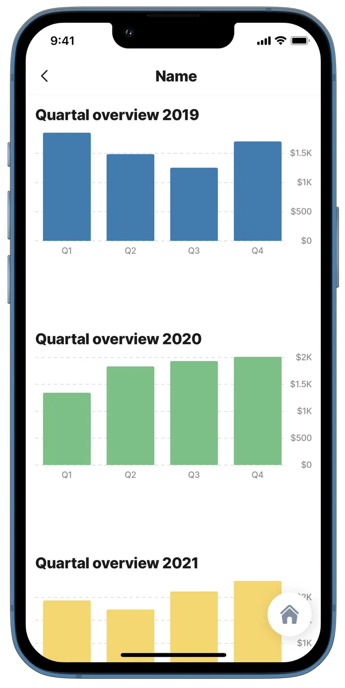<figcaption><p>List with bar charts</p></figcaption></figure>



This example shows bar charts displayed on a list as a visual representation of information.

**Bar chart example:** See the full example using static data in [GitHub](https://github.com/jigx-com/jigx-samples/blob/main/quickstart/jigx-samples/jigs/jigx-components/list/static-data/list-with-bar-charts-sd.jigx). See the full example using dynamic data in [GitHub](https://github.com/jigx-com/jigx-samples/blob/main/quickstart/jigx-samples/jigs/jig-types/jig-list/advanced-lists/dynamic-data/list-with-bar-charts-dd.jigx).

**Datasources:** See the full datasource for static data in [GitHub](https://github.com/jigx-com/jigx-samples/blob/main/quickstart/jigx-samples/datasources/interactive-image/floorplan-restaurant-static.jigx). See the full datasource for dynamic data in [GitHub](https://github.com/jigx-com/jigx-samples/blob/main/quickstart/jigx-samples/jigs/jig-types/jig-list/advanced-lists/dynamic-data/list-with-bar-charts-dd.jigx).&#x20;





```yaml

children:
  - type: component.list
    options:
      # Data configured to use datasource (static)    
      data: =@ctx.datasources.list-bar
      item: 
        type: component.bar-chart
        options:
          legend:
            isHidden: true
          chart:
            title:
              text: =@ctx.current.item.title
            height: 260
            isAnimated: false
          yAxis:
            min: 0
            labels:
              format:
                numberStyle: currency
                currency: USD
                compactDisplay: short
                notation: compact
            tickAmount: 5
            isFirstTickHidden: false
            isFirstLabelHidden: false
          series:
            - data: =@ctx.current.item.data
              color: =@ctx.current.item.color
```



```yaml
# Data configured to use datasource (dynamic) 
data: =@ctx.datasources.finance-charts
# isHorizontal: true
item:
  type: component.bar-chart
  options:
    yAxis:
      max: 2000
      min: 200
    xAxis:
      categories: =@ctx.datasources.finance-charts.x
    series:
      - data: =@ctx.datasources.finance-charts.y
        color: =@ctx.datasources.finance-charts.color
```



```yaml
datasources:
  list-bar:
    type: datasource.static
    options:
      data:
      - title: Quarterly Overview 2019
        color: color1
        data: 
          - x: Q1
            y: 1851
          - x: Q2
            y: 1483
          - x: Q3
            y: 1250
          - x: Q4
            y: 1700
      - title: Quarterly Overview 2020
        color: color2
        data:      
          - x: Q1
            y: 1343
          - x: Q2
            y: 1832
          - x: Q3
            y: 1932
          - x: Q4
            y: 2012
      - title: Quarterly Overview 2021
        color: color3
        data:      
          - x: Q1
            y: 1932
          - x: Q2
            y: 1734
          - x: Q3
            y: 2129
          - x: Q4
            y: 2358
```



```yaml
datasources:
  finance-charts:
    type: datasource.sqlite
    options:
      provider: DATA_PROVIDER_DYNAMIC
      entities:
        - entity: default/finances
        - entity: default/finance-review-dynamic 
      query: |
        SELECT
          json_extract(B.Data, '$.title') as title,
          json_extract(B.Data, '$.subtitle') as subtitle,
          json_extract(B.Data, '$.year') as year,
          json_extract(A.Data, '$.amount') as y,
          json_extract(A.Data, '$.date') as x,
          json_extract(A.Data, '$.financeid') as financeid,
          json_extract(A.Data, '$.quarterid') as quarterid,
          json_extract(A.Data, '$.share') as share
        FROM [default/finances] A
        LEFT JOIN [default/finance-review-dynamic] B ON
        json_extract(A.Data, '$.year') = json_extract(B.Data, '$.year')
```



## List with avatars



<figure>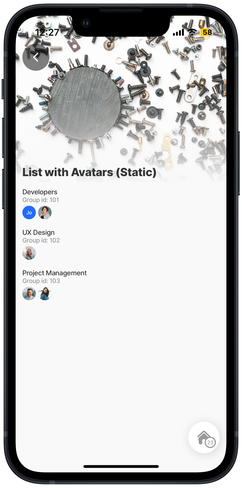<figcaption><p>List with avatars</p></figcaption></figure>



This example shows a list of avatars grouped by titles and returns all avatars in the array. In this example, the static datasource has been configured to use the `uri` and `text` properties that are required for avatars in a list. This makes it easy to configure in the jig by simply using the expression: `avatars: =@ctx.current.item.people`

The following expression can be used if your datasource uses different names for `uri` and `text`, for example: `avatars: =@ctx.current.item.people.{"text":name,"uri":image}[]`

**Examples:** See the full example using static data in [GitHub](https://github.com/jigx-com/jigx-samples/blob/main/quickstart/jigx-samples/jigs/jig-types/jig-list/advanced-lists/static-data/list-avatars-sd.jigx).





```yaml
# Data configured to use datasource (static) 
data: =@ctx.datasources.employee-groups
item:
  type: component.list-item
  options:
    title: =@ctx.current.item.title
    subtitle: = 'Group id:'& ' ' & @ctx.current.item.groupId
    avatars: =@ctx.current.item.people
```



```yaml
datasources:
  employee-groups:
    type: datasource.static
    options:
      data:
        - id: 1
          title: Developers
          groupId: 101
          people:
            - uri: https://images.unsplash.com/photo-1548449112-96a38a643324?ixlib=rb-1.2.1&ixid=MnwxMjA3fDB8MHxwaG90by1wYWdlfHx8fGVufDB8fHx8&auto=format&fit=crop&w=774&q=80
              text: John Smith
            - uri: https://images.unsplash.com/photo-1573497019940-1c28c88b4f3e?ixlib=rb-1.2.1&ixid=MnwxMjA3fDB8MHxwaG90by1wYWdlfHx8fGVufDB8fHx8&auto=format&fit=crop&w=774&q=80
              text: Mary Gomez
        - id: 2
          title: UX Design
          groupId: 102
          people:
            - uri: https://images.unsplash.com/photo-1546961329-78bef0414d7c?ixlib=rb-1.2.1&ixid=MnwxMjA3fDB8MHxwaG90by1wYWdlfHx8fGVufDB8fHx8&auto=format&fit=crop&w=774&q=80
              text: July Nelson
        - id: 3
          title: Project Management
          groupId: 103
          people:
            - uri: https://images.unsplash.com/photo-1591084728795-1149f32d9866?ixlib=rb-1.2.1&ixid=MnwxMjA3fDB8MHxwaG90by1wYWdlfHx8fGVufDB8fHx8&auto=format&fit=crop&w=928&q=80
              text: Karl Fisher
            - uri: https://images.unsplash.com/photo-1542740348-39501cd6e2b4?ixlib=rb-1.2.1&ixid=MnwxMjA3fDB8MHxwaG90by1wYWdlfHx8fGVufDB8fHx8&auto=format&fit=crop&w=774&q=80
              text: Lucy Williams
```



## List with left avatar



<figure>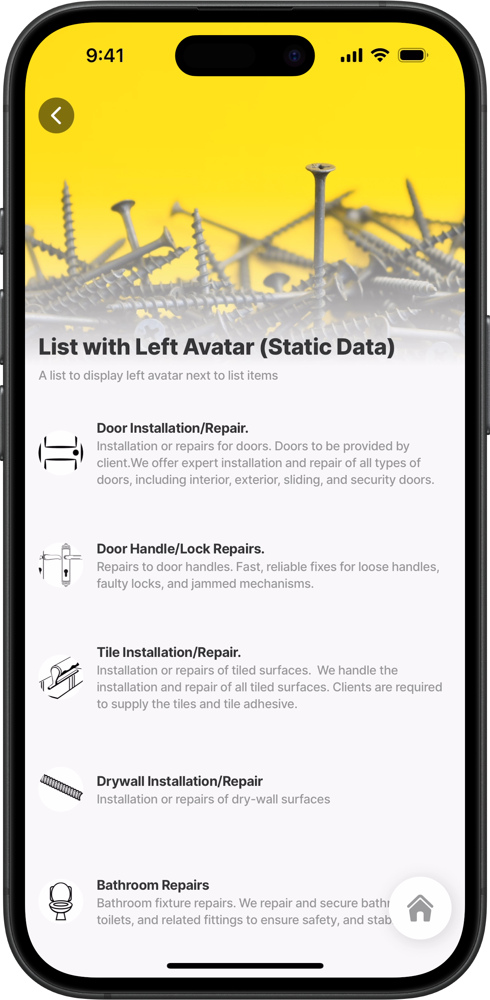<figcaption><p>List with avatars (left)</p></figcaption></figure>



This example showcases the list of items with a regular sized `avatar` to the left. The `title` text is styled (bold). The `subtitle` allows the text to wrap over three lines.

**Examples:** See the full example using static data in [GitHub](https://github.com/jigx-com/jigx-samples/blob/main/quickstart/jigx-samples/jigs/jigx-components/list-item/static-data/list-with-left-elements/list-with-left-avatar-sd.jigx). See the full example using dynamic data in [GitHub](https://github.com/jigx-com/jigx-samples/blob/main/quickstart/jigx-samples/jigs/jigx-components/list-item/dynamic-data/list-with-left-elements/list-with-left-avatar-dd.jigx).

**Datasources:** See the full datasource for static data in [GitHub](https://github.com/jigx-com/jigx-samples/blob/main/quickstart/jigx-samples/datasources/services/repair-services-static.jigx). See the full datasource for dynamic data in [GitHub](https://github.com/jigx-com/jigx-samples/blob/main/quickstart/jigx-samples/datasources/services/cleaning-services-dynamic.jigx).&#x20;





```yaml
# Data configured to use datasource (static) 
data: =@ctx.datasources.repair-services-static
item:
  type: component.list-item
  options:
    # Add a bold title.
    title:
      text: =@ctx.current.item.service
      isBold: true
    # Add a subtitle that will wrap text over 3 lines.  
    subtitle:
      text: =@ctx.current.item.description
      numberOfLines: 3
    leftElement:
      element: avatar
      text: $substring($substringBefore(@ctx.current.item.service, " "), 1, 1) & $substring($substringAfter(@ctx.current.item.service, " ") , 1, 1)
      uri: =@ctx.current.item.illustration
      # define the size of the avatar.
      size: regular
```



```yaml
# Data configured to use datasource (dynamic) 
data: =@ctx.datasources.cleaning-services-dynamic
item:
  type: component.list-item
  options:
    title: =@ctx.current.item.service
    subtitle: =@ctx.current.item.time & ' minutes for task completion'
    leftElement: 
      element: avatar
      text: $substring($substringBefore(@ctx.current.item.service, " "), 1, 1) & $substring($substringAfter(@ctx.current.item.service, " ") , 1, 1)
      uri: =@ctx.current.item.illustration
```



```yaml
type: datasource.static
options:
  data:
    - id: 1
      description: Installation or repairs for doors. Doors to be provided by client.We offer expert installation and repair of all types of doors, including interior, exterior, sliding, and security doors.
      hourlyRate: 70
      illustration: https://clipart-library.com/data_images/436224.png
      image: https://images.unsplash.com/photo-1500281781950-6cd80847ebcd?ixlib=rb-1.2.1&ixid=MnwxMjA3fDB8MHxwaG90by1wYWdlfHx8fGVufDB8fHx8&auto=format&fit=crop&w=1469&q=80
      materials: false
      service: Door Installation/Repair.
      time: 60
    - id: 2
      description: Repairs to door handles. Fast, reliable fixes for loose handles, faulty locks, and jammed mechanisms.
      hourlyRate: 40
      illustration: https://clipart-library.com/img1/1332215.jpg
      image: https://images.unsplash.com/photo-1538766017398-415434a31a5b?ixlib=rb-1.2.1&ixid=MnwxMjA3fDB8MHxwaG90by1wYWdlfHx8fGVufDB8fHx8&auto=format&fit=crop&w=1470&q=80
      materials: true
      service: Door Handle/Lock Repairs.
      time: 60
    - id: 3
      description: Installation or repairs of tiled surfaces.  We handle the installation and repair of all tiled surfaces. Clients are required to supply the tiles and tile adhesive.
      hourlyRate: 110
      illustration: https://clipart-library.com/images/kcKnbzbXi.jpg
      image: https://images.unsplash.com/photo-1523413184730-e85dbbd04aba?ixlib=rb-1.2.1&ixid=MnwxMjA3fDB8MHxwaG90by1wYWdlfHx8fGVufDB8fHx8&auto=format&fit=crop&w=687&q=80
      materials: false
      service: Tile Installation/Repair.
      time: 120
    - id: 4
      description: Installation or repairs of dry-wall surfaces
      hourlyRate: 80
      illustration: https://clipart-library.com/img1/505759.jpg
      image: https://images.unsplash.com/photo-1628901551715-7234d14fb7a0?ixlib=rb-1.2.1&ixid=MnwxMjA3fDB8MHxwaG90by1wYWdlfHx8fGVufDB8fHx8&auto=format&fit=crop&w=1470&q=80
      materials: true
      service: Drywall Installation/Repair
      time: 120
    - id: 5
      description: Bathroom fixture repairs. We repair and secure bathroom rails, toilets, and related fittings to ensure safety, and stability.
      hourlyRate: 90
      illustration: https://clipart-library.com/new_gallery/53-530190_black-and-white-toilet-png.png
      image: https://images.unsplash.com/photo-1585313647787-7a061b5a85a6?ixlib=rb-1.2.1&ixid=MnwxMjA3fDB8MHxwaG90by1wYWdlfHx8fGVufDB8fHx8&auto=format&fit=crop&w=1423&q=80
      materials: true
      service: Bathroom Repairs
      time: 60
    - id: 6
      description: Painting as required. Paint and tools not provided.
      hourlyRate: 70
      illustration: https://clipart-library.com/img/853166.jpg
      image: https://images.unsplash.com/photo-1562259949-e8e7689d7828?ixlib=rb-1.2.1&ixid=MnwxMjA3fDB8MHxwaG90by1wYWdlfHx8fGVufDB8fHx8&auto=format&fit=crop&w=1431&q=80
      materials: false
      service: Painting Services
      time: 120
    - id: 7
      description: Repairs to fences. Tools and items not included.
      hourlyRate: 90
      illustration: https://clipart-library.com/img/18345.gif
      image: https://images.unsplash.com/photo-1583805978118-ba9a81ac1399?ixlib=rb-1.2.1&ixid=MnwxMjA3fDB8MHxwaG90by1wYWdlfHx8fGVufDB8fHx8&auto=format&fit=crop&w=1470&q=80
      materials: false
      service: Fence Installation/Repair
      time: 60
    - id: 8
      description: Removal of graffiti and painting. Paint and brushes not included in cost.
      hourlyRate: 110
      illustration: https://clipart-library.com/images/6cy5aL5gi.jpg
      image: https://images.unsplash.com/photo-1581850518616-bcb8077a2336?ixlib=rb-1.2.1&ixid=MnwxMjA3fDB8MHxwaG90by1wYWdlfHx8fGVufDB8fHx8&auto=format&fit=crop&w=1470&q=80
      materials: false
      service: Removal of Graffiti
      time: 120
    - id: 9
      description: Repairs to cupboard doors.
      hourlyRate: 60
      illustration: https://clipart-library.com/img1/1605140.jpg
      image: https://images.unsplash.com/photo-1522791465802-47616431a4cf?ixlib=rb-1.2.1&ixid=MnwxMjA3fDB8MHxwaG90by1wYWdlfHx8fGVufDB8fHx8&auto=format&fit=crop&w=1451&q=80
      materials: true
      service: Cupboard Door Repairs
      time: 60
    - id: 10
      description: Plumbing issues and repairs. Ideal for addressing loose fixtures, leaks, or general wear and tear.
      hourlyRate: 90
      illustration: https://clipart-library.com/images_k/plumbing-silhouette/plumbing-silhouette-6.png
      image: https://images.unsplash.com/photo-1591804774220-c1db3673d05b?ixlib=rb-1.2.1&ixid=MnwxMjA3fDB8MHxwaG90by1wYWdlfHx8fGVufDB8fHx8&auto=format&fit=crop&w=1074&q=80
      materials: true
      service: Plumbing
      time: 60
```



```yaml
datasources:
  cleaning-services-dynamic:
    type: datasource.sqlite
    options:
      provider: DATA_PROVIDER_DYNAMIC
      entities:
        - entity: default/cleaning-services
      query: |
        SELECT 
          id, 
          '$.id' as sqlid, 
          '$.area', 
          '$.description', 
          '$.hourlyrate', 
          '$.illustration', 
          '$.image', 
          '$.indoor', 
          '$.onceoffrate', 
          '$.service', 
          '$.pressed', 
          '$.time',
          '$.quantity'
        FROM [default/cleaning-services] 
        WHERE '$.hourlyrate' IS NOT NULL ORDER BY id DESC
```



## List with left checkboxes


{% column width="58.333333333333336%" %}
This example showcases a list with checkboxes to the left. This can be configured with preset checked values or can just be empty for the user to select themselves. A color is added to the `title` text and the `subtitle` allows the text to wrap over two lines.

**Examples:** \
See the full example using static data in [GitHub](https://github.com/jigx-com/jigx-samples/blob/main/quickstart/jigx-samples/jigs/jigx-components/list-item/static-data/list-with-left-elements/list-with-left-checkbox-sd.jigx). \
See the full example using dynamic data in [GitHub](https://github.com/jigx-com/jigx-samples/blob/main/quickstart/jigx-samples/jigs/jigx-components/list-item/dynamic-data/list-with-left-elements/list-with-left-checkbox-dd.jigx).

**Datasources:** \
See the full datasource for static data in [GitHub](list-item.md) \
See the full datasource for dynamic data in [GitHub](https://github.com/jigx-com/jigx-samples/blob/main/quickstart/jigx-samples/datasources/services/cleaning-services-dynamic.jigx).&#x20;


Specifying `initialValue` will determine the value when the list is loaded, however, specifying the value presets the value itself. The latter is handy when you want to display details that don't require much intervention from the user or if you wish to make it easier and faster so they only have to review the current selections for instance.



{% column width="41.666666666666664%" %}
<figure>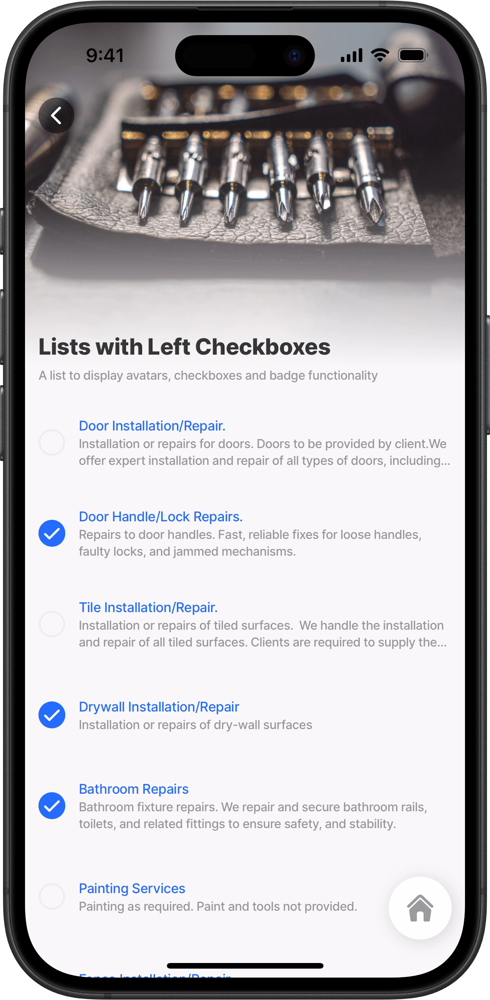<figcaption><p>List with checkboxes</p></figcaption></figure>





```yaml
# Data configured to use datasource (static) 
data: =@ctx.datasources.repair-services-static
item:
  type: component.list-item
  options:
     # Add the title and title color.
    title:
      text: =@ctx.current.item.service
      color: primary
    # Add a small subtitle that wraps over two lines.  
    subtitle:
      text: =@ctx.current.item.description
      fontSize: small
      numberOfLines: 2
    leftElement:
      element: checkbox
      initialValue: =(@ctx.current.item.materials) = true ? true :false
```



```yaml
# Data configured to use datasource (dynamic) 
data: =@ctx.datasources.cleaning-services-dynamic
item:
  type: component.list-item
  options:
    title: =@ctx.current.item.service
    subtitle: =@ctx.current.item.description
    leftElement:
      element: checkbox
      initialValue: =(@ctx.current.item.indoor) = 'TRUE' ? true :false
```



```yaml
type: datasource.static
options:
  data:
    - id: 1
      description: Installation or repairs for doors. Doors to be provided by client.We offer expert installation and repair of all types of doors, including interior, exterior, sliding, and security doors.
      hourlyRate: 70
      illustration: https://clipart-library.com/data_images/436224.png
      image: https://images.unsplash.com/photo-1500281781950-6cd80847ebcd?ixlib=rb-1.2.1&ixid=MnwxMjA3fDB8MHxwaG90by1wYWdlfHx8fGVufDB8fHx8&auto=format&fit=crop&w=1469&q=80
      materials: false
      service: Door Installation/Repair.
      time: 60
    - id: 2
      description: Repairs to door handles. Fast, reliable fixes for loose handles, faulty locks, and jammed mechanisms.
      hourlyRate: 40
      illustration: https://clipart-library.com/img1/1332215.jpg
      image: https://images.unsplash.com/photo-1538766017398-415434a31a5b?ixlib=rb-1.2.1&ixid=MnwxMjA3fDB8MHxwaG90by1wYWdlfHx8fGVufDB8fHx8&auto=format&fit=crop&w=1470&q=80
      materials: true
      service: Door Handle/Lock Repairs.
      time: 60
    - id: 3
      description: Installation or repairs of tiled surfaces.  We handle the installation and repair of all tiled surfaces. Clients are required to supply the tiles and tile adhesive.
      hourlyRate: 110
      illustration: https://clipart-library.com/images/kcKnbzbXi.jpg
      image: https://images.unsplash.com/photo-1523413184730-e85dbbd04aba?ixlib=rb-1.2.1&ixid=MnwxMjA3fDB8MHxwaG90by1wYWdlfHx8fGVufDB8fHx8&auto=format&fit=crop&w=687&q=80
      materials: false
      service: Tile Installation/Repair.
      time: 120
    - id: 4
      description: Installation or repairs of dry-wall surfaces
      hourlyRate: 80
      illustration: https://clipart-library.com/img1/505759.jpg
      image: https://images.unsplash.com/photo-1628901551715-7234d14fb7a0?ixlib=rb-1.2.1&ixid=MnwxMjA3fDB8MHxwaG90by1wYWdlfHx8fGVufDB8fHx8&auto=format&fit=crop&w=1470&q=80
      materials: true
      service: Drywall Installation/Repair
      time: 120
    - id: 5
      description: Bathroom fixture repairs. We repair and secure bathroom rails, toilets, and related fittings to ensure safety, and stability.
      hourlyRate: 90
      illustration: https://clipart-library.com/new_gallery/53-530190_black-and-white-toilet-png.png
      image: https://images.unsplash.com/photo-1585313647787-7a061b5a85a6?ixlib=rb-1.2.1&ixid=MnwxMjA3fDB8MHxwaG90by1wYWdlfHx8fGVufDB8fHx8&auto=format&fit=crop&w=1423&q=80
      materials: true
      service: Bathroom Repairs
      time: 60
    - id: 6
      description: Painting as required. Paint and tools not provided.
      hourlyRate: 70
      illustration: https://clipart-library.com/img/853166.jpg
      image: https://images.unsplash.com/photo-1562259949-e8e7689d7828?ixlib=rb-1.2.1&ixid=MnwxMjA3fDB8MHxwaG90by1wYWdlfHx8fGVufDB8fHx8&auto=format&fit=crop&w=1431&q=80
      materials: false
      service: Painting Services
      time: 120
    - id: 7
      description: Repairs to fences. Tools and items not included.
      hourlyRate: 90
      illustration: https://clipart-library.com/img/18345.gif
      image: https://images.unsplash.com/photo-1583805978118-ba9a81ac1399?ixlib=rb-1.2.1&ixid=MnwxMjA3fDB8MHxwaG90by1wYWdlfHx8fGVufDB8fHx8&auto=format&fit=crop&w=1470&q=80
      materials: false
      service: Fence Installation/Repair
      time: 60
    - id: 8
      description: Removal of graffiti and painting. Paint and brushes not included in cost.
      hourlyRate: 110
      illustration: https://clipart-library.com/images/6cy5aL5gi.jpg
      image: https://images.unsplash.com/photo-1581850518616-bcb8077a2336?ixlib=rb-1.2.1&ixid=MnwxMjA3fDB8MHxwaG90by1wYWdlfHx8fGVufDB8fHx8&auto=format&fit=crop&w=1470&q=80
      materials: false
      service: Removal of Graffiti
      time: 120
    - id: 9
      description: Repairs to cupboard doors.
      hourlyRate: 60
      illustration: https://clipart-library.com/img1/1605140.jpg
      image: https://images.unsplash.com/photo-1522791465802-47616431a4cf?ixlib=rb-1.2.1&ixid=MnwxMjA3fDB8MHxwaG90by1wYWdlfHx8fGVufDB8fHx8&auto=format&fit=crop&w=1451&q=80
      materials: true
      service: Cupboard Door Repairs
      time: 60
    - id: 10
      description: Plumbing issues and repairs. Ideal for addressing loose fixtures, leaks, or general wear and tear.
      hourlyRate: 90
      illustration: https://clipart-library.com/images_k/plumbing-silhouette/plumbing-silhouette-6.png
      image: https://images.unsplash.com/photo-1591804774220-c1db3673d05b?ixlib=rb-1.2.1&ixid=MnwxMjA3fDB8MHxwaG90by1wYWdlfHx8fGVufDB8fHx8&auto=format&fit=crop&w=1074&q=80
      materials: true
      service: Plumbing
      time: 60

```





```yaml
datasources:
  cleaning-services-dynamic:
    type: datasource.sqlite
    options:
      provider: DATA_PROVIDER_DYNAMIC
      entities:
        - entity: default/cleaning-services
      query: |
        SELECT 
          id, 
          '$.id' as sqlid, 
          '$.area', 
          '$.description', 
          '$.hourlyrate', 
          '$.illustration', 
          '$.image', 
          '$.indoor', 
          '$.onceoffrate', 
          '$.service', 
          '$.pressed', 
          '$.time',
          '$.quantity'
        FROM [default/cleaning-services] 
        WHERE '$.hourlyrate' IS NOT NULL ORDER BY id DESC
```



## List with the left icons



<figure>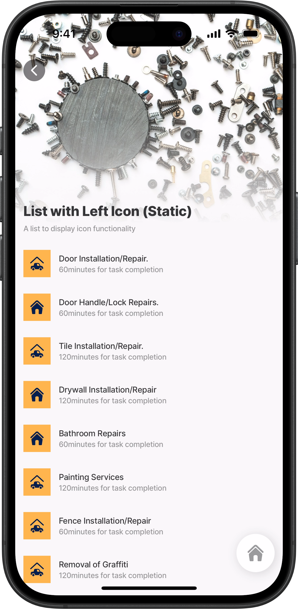<figcaption><p>List with icons</p></figcaption></figure>



This example displays icons to the left of the list.

**Examples:** See the full example using static data in [GitHub](https://github.com/jigx-com/jigx-samples/blob/main/quickstart/jigx-samples/jigs/jigx-components/list-item/static-data/list-with-left-elements/list-with-left-icon-sd.jigx). See the full example using dynamic data in [GitHub](https://github.com/jigx-com/jigx-samples/blob/main/quickstart/jigx-samples/jigs/jigx-components/list-item/dynamic-data/list-with-left-elements/list-with-left-icon-dd.jigx).

**Datasources:** See the full datasource for static data in [GitHub](https://github.com/jigx-com/jigx-samples/blob/main/quickstart/jigx-samples/datasources/services/repair-services-static.jigx). See the full datasource for dynamic data in [GitHub](https://github.com/jigx-com/jigx-samples/blob/main/quickstart/jigx-samples/datasources/services/cleaning-services-dynamic.jigx).





```yaml
# Data configured to use datasource (static) 
data: =@ctx.datasources.repair-services-static
item:
  type: component.list-item
  options:
    title: =@ctx.current.item.service
    subtitle: =@ctx.current.item.time & 'minutes for task completion'
    # Add icons to the left of the list-item, define the color,
    # type and shape of the icon
    leftElement:
      element: icon
      icon: =(@ctx.current.item.materials) = true ? 'home' :'car-garage'
      color: color7
      type: contained
      shape: basic
```



```yaml
# Data configured to use datasource (dynamic) 
data: =@ctx.datasources.repair-services-static
item:
  type: component.list-item
  options:
    title: =@ctx.current.item.service
    subtitle: =@ctx.current.item.time & 'minutes for task completion'
    leftElement:
      # Add icons to the left of the list-item, define the color,
      # type and shape of the icon
      element: icon
      icon: =(@ctx.current.item.materials) = true ? 'home' :'car-garage'
      color: color7
      type: contained
      shape: basic
```



```yaml
datasources:
  repair-services-static:
    type: datasource.static
    options:
      data:
        - id: 1
          description: Installation or repairs for doors. Doors to be provided by client
          hourlyRate: 70
          illustration: http://clipart-library.com/data_images/436224.png
          image: https://images.unsplash.com/photo-1500281781950-6cd80847ebcd?ixlib=rb-1.2.1&ixid=MnwxMjA3fDB8MHxwaG90by1wYWdlfHx8fGVufDB8fHx8&auto=format&fit=crop&w=1469&q=80
          materials: false
          service: Door Installation/Repair
          time: 60
        - id: 2
          description: Repairs to door handles 
          hourlyRate: 40
          illustration: http://clipart-library.com/img1/1332215.jpg
          image: https://images.unsplash.com/photo-1538766017398-415434a31a5b?ixlib=rb-1.2.1&ixid=MnwxMjA3fDB8MHxwaG90by1wYWdlfHx8fGVufDB8fHx8&auto=format&fit=crop&w=1470&q=80
          materials: true
          service: Door Handle/Lock Repairs
          time: 60        
        - id: 3
          description: Installation or repairs of tiled surfaces. Tiles have to be provided by client
          hourlyRate: 110
          illustration: http://clipart-library.com/images/kcKnbzbXi.jpg
          image: https://images.unsplash.com/photo-1523413184730-e85dbbd04aba?ixlib=rb-1.2.1&ixid=MnwxMjA3fDB8MHxwaG90by1wYWdlfHx8fGVufDB8fHx8&auto=format&fit=crop&w=687&q=80
          materials: false
          service: Tile Installation/Repair
          time: 120
        - id: 4
          description: Installation or repairs of dry-wall surfaces
          hourlyRate: 80
          illustration: http://clipart-library.com/img1/505759.jpg
          image: https://images.unsplash.com/photo-1628901551715-7234d14fb7a0?ixlib=rb-1.2.1&ixid=MnwxMjA3fDB8MHxwaG90by1wYWdlfHx8fGVufDB8fHx8&auto=format&fit=crop&w=1470&q=80
          materials: true
          service: Drywall Installation/Repair
          time: 120
        - id: 5
          description: Repairs to bathroom rails, toilets, etc
          hourlyRate: 90
          illustration: http://clipart-library.com/new_gallery/53-530190_black-and-white-toilet-png.png
          image: https://images.unsplash.com/photo-1585313647787-7a061b5a85a6?ixlib=rb-1.2.1&ixid=MnwxMjA3fDB8MHxwaG90by1wYWdlfHx8fGVufDB8fHx8&auto=format&fit=crop&w=1423&q=80
          materials: true
          service: Bathroom Repairs
          time: 60
        - id: 6
          description: Painting as required. Paint and tools not provided 
          hourlyRate: 70
          illustration: http://clipart-library.com/img/853166.jpg
          image: https://images.unsplash.com/photo-1562259949-e8e7689d7828?ixlib=rb-1.2.1&ixid=MnwxMjA3fDB8MHxwaG90by1wYWdlfHx8fGVufDB8fHx8&auto=format&fit=crop&w=1431&q=80
          materials: false
          service: Painting Services
          time: 120
        - id: 7
          description: Repairs to fences. Tools and items not included
          hourlyRate: 90
          illustration: http://clipart-library.com/img/18345.gif
          image: https://images.unsplash.com/photo-1583805978118-ba9a81ac1399?ixlib=rb-1.2.1&ixid=MnwxMjA3fDB8MHxwaG90by1wYWdlfHx8fGVufDB8fHx8&auto=format&fit=crop&w=1470&q=80
          materials: false
          service: Fence Installation/Repair
          time: 60
        - id: 8
          description: Removal of graffiti and painting. Paint and brushes not included in cost
          hourlyRate: 110
          illustration: http://clipart-library.com/images/6cy5aL5gi.jpg
          image: https://images.unsplash.com/photo-1581850518616-bcb8077a2336?ixlib=rb-1.2.1&ixid=MnwxMjA3fDB8MHxwaG90by1wYWdlfHx8fGVufDB8fHx8&auto=format&fit=crop&w=1470&q=80
          materials: false
          service: Removal of Graffiti
          time: 120
        - id: 9
          description: Repairs to cupboard doors
          hourlyRate: 60
          illustration: http://clipart-library.com/img1/1605140.jpg
          image: https://images.unsplash.com/photo-1522791465802-47616431a4cf?ixlib=rb-1.2.1&ixid=MnwxMjA3fDB8MHxwaG90by1wYWdlfHx8fGVufDB8fHx8&auto=format&fit=crop&w=1451&q=80
          materials: true
          service: Cupboard Door Repairs
          time: 60
        - id: 10
          description: Plumbing issues and repairs
          hourlyRate: 90
          illustration: http://clipart-library.com/images_k/plumbing-silhouette/plumbing-silhouette-6.png
          image: https://images.unsplash.com/photo-1591804774220-c1db3673d05b?ixlib=rb-1.2.1&ixid=MnwxMjA3fDB8MHxwaG90by1wYWdlfHx8fGVufDB8fHx8&auto=format&fit=crop&w=1074&q=80
          materials: true
          service: Plumbing
          time: 60
```



```yaml
datasources:
  cleaning-services-dynamic:
    type: datasource.sqlite
    options:
      provider: DATA_PROVIDER_DYNAMIC
      entities:
        - entity: default/cleaning-services
      query: |
        SELECT 
          id, 
          '$.id' as sqlid, 
          '$.area', 
          '$.description', 
          '$.hourlyrate', 
          '$.illustration', 
          '$.image', 
          '$.indoor', 
          '$.onceoffrate', 
          '$.service', 
          '$.pressed', 
          '$.time',
          '$.quantity'
        FROM [default/cleaning-services] 
        WHERE '$.hourlyrate' IS NOT NULL ORDER BY id DESC
```



## List with the left image



<figure>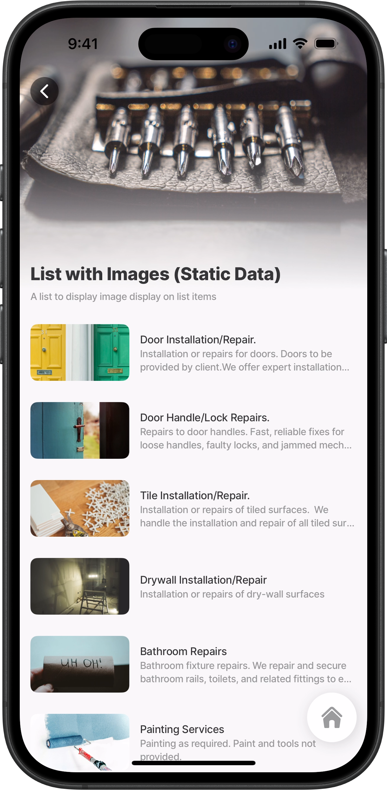<figcaption><p>List with image</p></figcaption></figure>



This example displays a list with an `image` to left of the list-item for visual representation. The image `shape` and `size` is defined.

**Examples:** See the full example using static data in [GitHub](https://github.com/jigx-com/jigx-samples/blob/main/quickstart/jigx-samples/jigs/jigx-components/list-item/static-data/list-with-left-elements/list-with-left-image-sd.jigx). See the full example using dynamic data in [GitHub](https://github.com/jigx-com/jigx-samples/blob/main/quickstart/jigx-samples/jigs/jigx-components/list-item/dynamic-data/list-with-left-elements/list-with-left-image-dd.jigx).

**Datasources:** See the full datasource for static data in [GitHub](https://github.com/jigx-com/jigx-samples/blob/main/quickstart/jigx-samples/datasources/services/repair-services-static.jigx). See the full datasource for dynamic data in [GitHub](https://github.com/jigx-com/jigx-samples/blob/main/quickstart/jigx-samples/datasources/services/cleaning-services-dynamic.jigx).





```yaml
# Data configured to use datasource (static) 
data: =@ctx.datasources.repair-services-static
item:
  type: component.list-item
  options:
    title: =@ctx.current.item.service
    # Add a subtitle that wraps over two lines. 
    subtitle:
      text: =@ctx.current.item.description
      numberOfLines: 2
    leftElement:
     # Add images to the left of the list-item, define the shape & size
      element: image
      text: =@ctx.current.item.service
      uri: =@ctx.current.item.image
      shape: landscape
      size: regular
```



```yaml
# Data configured to use datasource (dynamic) 
data: =@ctx.datasources.cleaning-services-dynamic
item:
  type: component.list-item
  options:
    title: =@ctx.current.item.service
    # Add a subtitle that wraps over two lines. 
    subtitle:
      text: =@ctx.current.item.description
      numberOfLines: 2
    # Add images to the left of the list-item, define the shape & size.  
    leftElement:
      element: image
      text: =@ctx.current.item.service
      uri: =@ctx.current.item.image
      shape: landscape
      size: regular
```



```yaml
datasources:
  repair-services-static:
    type: datasource.static
    options:
      data:
        - id: 1
          description: Installation or repairs for doors. Doors to be provided by client
          hourlyRate: 70
          illustration: http://clipart-library.com/data_images/436224.png
          image: https://images.unsplash.com/photo-1500281781950-6cd80847ebcd?ixlib=rb-1.2.1&ixid=MnwxMjA3fDB8MHxwaG90by1wYWdlfHx8fGVufDB8fHx8&auto=format&fit=crop&w=1469&q=80
          materials: false
          service: Door Installation/Repair
          time: 60
        - id: 2
          description: Repairs to door handles 
          hourlyRate: 40
          illustration: http://clipart-library.com/img1/1332215.jpg
          image: https://images.unsplash.com/photo-1538766017398-415434a31a5b?ixlib=rb-1.2.1&ixid=MnwxMjA3fDB8MHxwaG90by1wYWdlfHx8fGVufDB8fHx8&auto=format&fit=crop&w=1470&q=80
          materials: true
          service: Door Handle/Lock Repairs
          time: 60        
        - id: 3
          description: Installation or repairs of tiled surfaces. Tiles have to be provided by client
          hourlyRate: 110
          illustration: http://clipart-library.com/images/kcKnbzbXi.jpg
          image: https://images.unsplash.com/photo-1523413184730-e85dbbd04aba?ixlib=rb-1.2.1&ixid=MnwxMjA3fDB8MHxwaG90by1wYWdlfHx8fGVufDB8fHx8&auto=format&fit=crop&w=687&q=80
          materials: false
          service: Tile Installation/Repair
          time: 120
        - id: 4
          description: Installation or repairs of dry-wall surfaces
          hourlyRate: 80
          illustration: http://clipart-library.com/img1/505759.jpg
          image: https://images.unsplash.com/photo-1628901551715-7234d14fb7a0?ixlib=rb-1.2.1&ixid=MnwxMjA3fDB8MHxwaG90by1wYWdlfHx8fGVufDB8fHx8&auto=format&fit=crop&w=1470&q=80
          materials: true
          service: Drywall Installation/Repair
          time: 120
        - id: 5
          description: Repairs to bathroom rails, toilets, etc
          hourlyRate: 90
          illustration: http://clipart-library.com/new_gallery/53-530190_black-and-white-toilet-png.png
          image: https://images.unsplash.com/photo-1585313647787-7a061b5a85a6?ixlib=rb-1.2.1&ixid=MnwxMjA3fDB8MHxwaG90by1wYWdlfHx8fGVufDB8fHx8&auto=format&fit=crop&w=1423&q=80
          materials: true
          service: Bathroom Repairs
          time: 60
        - id: 6
          description: Painting as required. Paint and tools not provided 
          hourlyRate: 70
          illustration: http://clipart-library.com/img/853166.jpg
          image: https://images.unsplash.com/photo-1562259949-e8e7689d7828?ixlib=rb-1.2.1&ixid=MnwxMjA3fDB8MHxwaG90by1wYWdlfHx8fGVufDB8fHx8&auto=format&fit=crop&w=1431&q=80
          materials: false
          service: Painting Services
          time: 120
        - id: 7
          description: Repairs to fences. Tools and items not included
          hourlyRate: 90
          illustration: http://clipart-library.com/img/18345.gif
          image: https://images.unsplash.com/photo-1583805978118-ba9a81ac1399?ixlib=rb-1.2.1&ixid=MnwxMjA3fDB8MHxwaG90by1wYWdlfHx8fGVufDB8fHx8&auto=format&fit=crop&w=1470&q=80
          materials: false
          service: Fence Installation/Repair
          time: 60
        - id: 8
          description: Removal of graffiti and painting. Paint and brushes not included in cost
          hourlyRate: 110
          illustration: http://clipart-library.com/images/6cy5aL5gi.jpg
          image: https://images.unsplash.com/photo-1581850518616-bcb8077a2336?ixlib=rb-1.2.1&ixid=MnwxMjA3fDB8MHxwaG90by1wYWdlfHx8fGVufDB8fHx8&auto=format&fit=crop&w=1470&q=80
          materials: false
          service: Removal of Graffiti
          time: 120
        - id: 9
          description: Repairs to cupboard doors
          hourlyRate: 60
          illustration: http://clipart-library.com/img1/1605140.jpg
          image: https://images.unsplash.com/photo-1522791465802-47616431a4cf?ixlib=rb-1.2.1&ixid=MnwxMjA3fDB8MHxwaG90by1wYWdlfHx8fGVufDB8fHx8&auto=format&fit=crop&w=1451&q=80
          materials: true
          service: Cupboard Door Repairs
          time: 60
        - id: 10
          description: Plumbing issues and repairs
          hourlyRate: 90
          illustration: http://clipart-library.com/images_k/plumbing-silhouette/plumbing-silhouette-6.png
          image: https://images.unsplash.com/photo-1591804774220-c1db3673d05b?ixlib=rb-1.2.1&ixid=MnwxMjA3fDB8MHxwaG90by1wYWdlfHx8fGVufDB8fHx8&auto=format&fit=crop&w=1074&q=80
          materials: true
          service: Plumbing
          time: 60
```



```yaml
datasources:
  cleaning-services-dynamic:
    type: datasource.sqlite
    options:
      provider: DATA_PROVIDER_DYNAMIC
      entities:
        - entity: default/cleaning-services
      query: |
        SELECT 
          id, 
          '$.id' as sqlid, 
          '$.area', 
          '$.description', 
          '$.hourlyrate', 
          '$.illustration', 
          '$.image', 
          '$.indoor', 
          '$.onceoffrate', 
          '$.service', 
          '$.pressed', 
          '$.time',
          '$.quantity'
        FROM [default/cleaning-services] 
        WHERE '$.hourlyrate' IS NOT NULL ORDER BY id DESC
```



## List with left progress



<figure>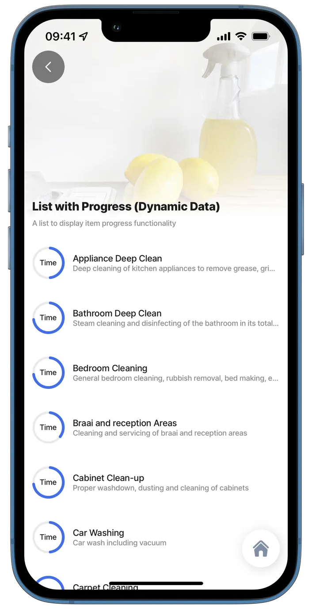<figcaption><p>List with progress</p></figcaption></figure>



This example displays a list with visual progress elements to the left of the list items.

**Examples:** See the full example using static data in [GitHub](https://github.com/jigx-com/jigx-samples/blob/main/quickstart/jigx-samples/jigs/jigx-components/list-item/static-data/list-with-left-elements/list-with-left-progress-sd.jigx). See the full example using dynamic data in [GitHub](https://github.com/jigx-com/jigx-samples/blob/main/quickstart/jigx-samples/jigs/jigx-components/list-item/dynamic-data/list-with-left-elements/list-with-left-progress-dd.jigx).

**Datasources:** See the full datasource for static data in [GitHub](https://github.com/jigx-com/jigx-samples/blob/main/quickstart/jigx-samples/datasources/services/repair-services-static.jigx). See the full datasource for dynamic data in [GitHub](https://github.com/jigx-com/jigx-samples/blob/main/quickstart/jigx-samples/datasources/services/cleaning-services-dynamic.jigx)





```yaml
# Data configured to use datasource (static) 
data: =@ctx.datasources.repair-services-static
item:
  type: component.list-item
  options:
    title: =@ctx.current.item.service
    subtitle: =@ctx.current.item.description
    leftElement: 
      element: progress
      title: Time
      value:  =@ctx.current.item.time/120
```



```yaml
# Data configured to use datasource (dynamic) 
data: =@ctx.datasources.cleaning-services-dynamic
item:
  type: component.list-item
  options:
    title: =@ctx.current.item.service
    subtitle: =@ctx.current.item.description
    leftElement: 
      element: progress
      title: Time
      value:  =$number(@ctx.current.item.time)/120
```



```yaml
datasources:
  repair-services-static:
    type: datasource.static
    options:
      data:
        - id: 1
          description: Installation or repairs for doors. Doors to be provided by client
          hourlyRate: 70
          illustration: http://clipart-library.com/data_images/436224.png
          image: https://images.unsplash.com/photo-1500281781950-6cd80847ebcd?ixlib=rb-1.2.1&ixid=MnwxMjA3fDB8MHxwaG90by1wYWdlfHx8fGVufDB8fHx8&auto=format&fit=crop&w=1469&q=80
          materials: false
          service: Door Installation/Repair
          time: 60
        - id: 2
          description: Repairs to door handles 
          hourlyRate: 40
          illustration: http://clipart-library.com/img1/1332215.jpg
          image: https://images.unsplash.com/photo-1538766017398-415434a31a5b?ixlib=rb-1.2.1&ixid=MnwxMjA3fDB8MHxwaG90by1wYWdlfHx8fGVufDB8fHx8&auto=format&fit=crop&w=1470&q=80
          materials: true
          service: Door Handle/Lock Repairs
          time: 60        
        - id: 3
          description: Installation or repairs of tiled surfaces. Tiles have to be provided by client
          hourlyRate: 110
          illustration: http://clipart-library.com/images/kcKnbzbXi.jpg
          image: https://images.unsplash.com/photo-1523413184730-e85dbbd04aba?ixlib=rb-1.2.1&ixid=MnwxMjA3fDB8MHxwaG90by1wYWdlfHx8fGVufDB8fHx8&auto=format&fit=crop&w=687&q=80
          materials: false
          service: Tile Installation/Repair
          time: 120
        - id: 4
          description: Installation or repairs of dry-wall surfaces
          hourlyRate: 80
          illustration: http://clipart-library.com/img1/505759.jpg
          image: https://images.unsplash.com/photo-1628901551715-7234d14fb7a0?ixlib=rb-1.2.1&ixid=MnwxMjA3fDB8MHxwaG90by1wYWdlfHx8fGVufDB8fHx8&auto=format&fit=crop&w=1470&q=80
          materials: true
          service: Drywall Installation/Repair
          time: 120
        - id: 5
          description: Repairs to bathroom rails, toilets, etc
          hourlyRate: 90
          illustration: http://clipart-library.com/new_gallery/53-530190_black-and-white-toilet-png.png
          image: https://images.unsplash.com/photo-1585313647787-7a061b5a85a6?ixlib=rb-1.2.1&ixid=MnwxMjA3fDB8MHxwaG90by1wYWdlfHx8fGVufDB8fHx8&auto=format&fit=crop&w=1423&q=80
          materials: true
          service: Bathroom Repairs
          time: 60
        - id: 6
          description: Painting as required. Paint and tools not provided 
          hourlyRate: 70
          illustration: http://clipart-library.com/img/853166.jpg
          image: https://images.unsplash.com/photo-1562259949-e8e7689d7828?ixlib=rb-1.2.1&ixid=MnwxMjA3fDB8MHxwaG90by1wYWdlfHx8fGVufDB8fHx8&auto=format&fit=crop&w=1431&q=80
          materials: false
          service: Painting Services
          time: 120
        - id: 7
          description: Repairs to fences. Tools and items not included
          hourlyRate: 90
          illustration: http://clipart-library.com/img/18345.gif
          image: https://images.unsplash.com/photo-1583805978118-ba9a81ac1399?ixlib=rb-1.2.1&ixid=MnwxMjA3fDB8MHxwaG90by1wYWdlfHx8fGVufDB8fHx8&auto=format&fit=crop&w=1470&q=80
          materials: false
          service: Fence Installation/Repair
          time: 60
        - id: 8
          description: Removal of graffiti and painting. Paint and brushes not included in cost
          hourlyRate: 110
          illustration: http://clipart-library.com/images/6cy5aL5gi.jpg
          image: https://images.unsplash.com/photo-1581850518616-bcb8077a2336?ixlib=rb-1.2.1&ixid=MnwxMjA3fDB8MHxwaG90by1wYWdlfHx8fGVufDB8fHx8&auto=format&fit=crop&w=1470&q=80
          materials: false
          service: Removal of Graffiti
          time: 120
        - id: 9
          description: Repairs to cupboard doors
          hourlyRate: 60
          illustration: http://clipart-library.com/img1/1605140.jpg
          image: https://images.unsplash.com/photo-1522791465802-47616431a4cf?ixlib=rb-1.2.1&ixid=MnwxMjA3fDB8MHxwaG90by1wYWdlfHx8fGVufDB8fHx8&auto=format&fit=crop&w=1451&q=80
          materials: true
          service: Cupboard Door Repairs
          time: 60
        - id: 10
          description: Plumbing issues and repairs
          hourlyRate: 90
          illustration: http://clipart-library.com/images_k/plumbing-silhouette/plumbing-silhouette-6.png
          image: https://images.unsplash.com/photo-1591804774220-c1db3673d05b?ixlib=rb-1.2.1&ixid=MnwxMjA3fDB8MHxwaG90by1wYWdlfHx8fGVufDB8fHx8&auto=format&fit=crop&w=1074&q=80
          materials: true
          service: Plumbing
          time: 60
```



```yaml
datasources:
  cleaning-services-dynamic:
    type: datasource.sqlite
    options:
      provider: DATA_PROVIDER_DYNAMIC
      entities:
        - entity: default/cleaning-services
      query: |
        SELECT 
          id, 
          '$.id' as sqlid, 
          '$.area', 
          '$.description', 
          '$.hourlyrate', 
          '$.illustration', 
          '$.image', 
          '$.indoor', 
          '$.onceoffrate', 
          '$.service', 
          '$.pressed', 
          '$.time',
          '$.quantity'
        FROM [default/cleaning-services] 
        WHERE '$.hourlyrate' IS NOT NULL ORDER BY id DESC
```



## Swipeable list (left)



<figure><figcaption></figcaption></figure>



This example shows using the swipeable action to access the onPress action as well as setting up a primary and secondary action.

**Examples:** \
See the full example using static data in [GitHub](https://github.com/jigx-com/jigx-samples/blob/main/quickstart/jigx-samples/jigs/jigx-components/list-item/static-data/list-with-actions/list-with-swipe-left-sd.jigx). \
See the full example using dynamic data in [GitHub](https://github.com/jigx-com/jigx-samples/blob/main/quickstart/jigx-samples/jigs/jigx-components/list-item/dynamic-data/list-with-actions/list-with-swipe-left-dd.jigx).

**Datasources:** \
See the full datasource for static data in [GitHub](https://github.com/jigx-com/jigx-samples/blob/main/quickstart/jigx-samples/datasources/services/repair-services-static.jigx). \
See the full datasource for dynamic data in <[GitHub](https://github.com/jigx-com/jigx-samples/blob/main/quickstart/jigx-samples/datasources/services/cleaning-services-dynamic.jigx).





```yaml
# Data configured to use datasource (static) 
data: =@ctx.datasources.repair-services-static
item:
  type: component.list-item
  options:
   # Add a bold title. 
    title:
      text: =@ctx.current.item.service
      isBold: true
    # Add a subtitle that wraps over two lines.   
    subtitle:
      text: =@ctx.current.item.description
      numberOfLines: 2
    # Add and style the icon to the left of the item.   
    leftElement:
      element: icon
      icon: =(@ctx.current.item.materials = true ? 'home' :'car-garage')
      shape: circle
      type: duotone
    rightElement:
      element: value
      text: ='$ ' & $number(@ctx.current.item.hourlyRate)
    swipeable:
      left:
        # Configure two actions (buttons) with color when swiping left.
        - onPress:
            type: action.go-to
            options:
              linkTo: action-list-onPress
          label: Primary Action
          icon: alarm-bell
          color: primary     
        - onPress:
            type: action.go-to
            options:
              linkTo: action-list-onPress
          label: Secondary Action
          icon: alert-triangle
          color: warning
```



```yaml
# Data configured to use datasource (dynamic) 
data: =@ctx.datasources.cleaning-services-dynamic
item:
  type: component.list-item
  options:
    # Add a bold title. 
    title:
      text: =@ctx.current.item.service
      isBold: true
    # Add a subtitle that wraps over two lines.   
    subtitle:
      text: =@ctx.current.item.description
      numberOfLines: 2
    # Add and style the icon to the left of the item.  
    leftElement: 
      element: icon
      icon: =(@ctx.current.item.indoor = "TRUE" ? 'home' :'car-garage')
      shape: circle
      type: duotone
    rightElement: 
      element: value
      text: =(@ctx.current.item.hourlyrate) != 'NA' ? '$ ' & $number(@ctx.current.item.hourlyrate) & ' p/hr':'$ ' & $number(@ctx.current.item.onceoffrate) & ' once off'
    swipeable:
      # Configure two actions (buttons) with color when swiping left.
      left:
        - onPress: 
            type: action.go-to
            options:
              linkTo: action-list-onPress
          label: Primary Action
          icon: alarm-bell
          color: primary
        # note that the secondary action is only for demo purposes,
        # you can stop at the primary action
        - onPress: 
            type: action.go-to
            options:
              linkTo: action-list-onPress
          label: Secondary Action
          icon: alert-triangle
          color: warning
```



```yaml
type: datasource.static
options:
  data:
    - id: 1
      description: Installation or repairs for doors. Doors to be provided by client.We offer expert installation and repair of all types of doors, including interior, exterior, sliding, and security doors.
      hourlyRate: 70
      illustration: https://clipart-library.com/data_images/436224.png
      image: https://images.unsplash.com/photo-1500281781950-6cd80847ebcd?ixlib=rb-1.2.1&ixid=MnwxMjA3fDB8MHxwaG90by1wYWdlfHx8fGVufDB8fHx8&auto=format&fit=crop&w=1469&q=80
      materials: false
      service: Door Installation/Repair.
      time: 60
    - id: 2
      description: Repairs to door handles. Fast, reliable fixes for loose handles, faulty locks, and jammed mechanisms.
      hourlyRate: 40
      illustration: https://clipart-library.com/img1/1332215.jpg
      image: https://images.unsplash.com/photo-1538766017398-415434a31a5b?ixlib=rb-1.2.1&ixid=MnwxMjA3fDB8MHxwaG90by1wYWdlfHx8fGVufDB8fHx8&auto=format&fit=crop&w=1470&q=80
      materials: true
      service: Door Handle/Lock Repairs.
      time: 60
    - id: 3
      description: Installation or repairs of tiled surfaces.  We handle the installation and repair of all tiled surfaces. Clients are required to supply the tiles and tile adhesive.
      hourlyRate: 110
      illustration: https://clipart-library.com/images/kcKnbzbXi.jpg
      image: https://images.unsplash.com/photo-1523413184730-e85dbbd04aba?ixlib=rb-1.2.1&ixid=MnwxMjA3fDB8MHxwaG90by1wYWdlfHx8fGVufDB8fHx8&auto=format&fit=crop&w=687&q=80
      materials: false
      service: Tile Installation/Repair.
      time: 120
    - id: 4
      description: Installation or repairs of dry-wall surfaces
      hourlyRate: 80
      illustration: https://clipart-library.com/img1/505759.jpg
      image: https://images.unsplash.com/photo-1628901551715-7234d14fb7a0?ixlib=rb-1.2.1&ixid=MnwxMjA3fDB8MHxwaG90by1wYWdlfHx8fGVufDB8fHx8&auto=format&fit=crop&w=1470&q=80
      materials: true
      service: Drywall Installation/Repair
      time: 120
    - id: 5
      description: Bathroom fixture repairs. We repair and secure bathroom rails, toilets, and related fittings to ensure safety, and stability.
      hourlyRate: 90
      illustration: https://clipart-library.com/new_gallery/53-530190_black-and-white-toilet-png.png
      image: https://images.unsplash.com/photo-1585313647787-7a061b5a85a6?ixlib=rb-1.2.1&ixid=MnwxMjA3fDB8MHxwaG90by1wYWdlfHx8fGVufDB8fHx8&auto=format&fit=crop&w=1423&q=80
      materials: true
      service: Bathroom Repairs
      time: 60
    - id: 6
      description: Painting as required. Paint and tools not provided.
      hourlyRate: 70
      illustration: https://clipart-library.com/img/853166.jpg
      image: https://images.unsplash.com/photo-1562259949-e8e7689d7828?ixlib=rb-1.2.1&ixid=MnwxMjA3fDB8MHxwaG90by1wYWdlfHx8fGVufDB8fHx8&auto=format&fit=crop&w=1431&q=80
      materials: false
      service: Painting Services
      time: 120
    - id: 7
      description: Repairs to fences. Tools and items not included.
      hourlyRate: 90
      illustration: https://clipart-library.com/img/18345.gif
      image: https://images.unsplash.com/photo-1583805978118-ba9a81ac1399?ixlib=rb-1.2.1&ixid=MnwxMjA3fDB8MHxwaG90by1wYWdlfHx8fGVufDB8fHx8&auto=format&fit=crop&w=1470&q=80
      materials: false
      service: Fence Installation/Repair
      time: 60
    - id: 8
      description: Removal of graffiti and painting. Paint and brushes not included in cost.
      hourlyRate: 110
      illustration: https://clipart-library.com/images/6cy5aL5gi.jpg
      image: https://images.unsplash.com/photo-1581850518616-bcb8077a2336?ixlib=rb-1.2.1&ixid=MnwxMjA3fDB8MHxwaG90by1wYWdlfHx8fGVufDB8fHx8&auto=format&fit=crop&w=1470&q=80
      materials: false
      service: Removal of Graffiti
      time: 120
    - id: 9
      description: Repairs to cupboard doors.
      hourlyRate: 60
      illustration: https://clipart-library.com/img1/1605140.jpg
      image: https://images.unsplash.com/photo-1522791465802-47616431a4cf?ixlib=rb-1.2.1&ixid=MnwxMjA3fDB8MHxwaG90by1wYWdlfHx8fGVufDB8fHx8&auto=format&fit=crop&w=1451&q=80
      materials: true
      service: Cupboard Door Repairs
      time: 60
    - id: 10
      description: Plumbing issues and repairs. Ideal for addressing loose fixtures, leaks, or general wear and tear.
      hourlyRate: 90
      illustration: https://clipart-library.com/images_k/plumbing-silhouette/plumbing-silhouette-6.png
      image: https://images.unsplash.com/photo-1591804774220-c1db3673d05b?ixlib=rb-1.2.1&ixid=MnwxMjA3fDB8MHxwaG90by1wYWdlfHx8fGVufDB8fHx8&auto=format&fit=crop&w=1074&q=80
      materials: true
      service: Plumbing
      time: 60
```



```yaml
datasources:
  cleaning-services-dynamic:
    type: datasource.sqlite
    options:
      provider: DATA_PROVIDER_DYNAMIC
      entities:
        - entity: default/cleaning-services
      query: |
        SELECT 
          id, 
          '$.id' as sqlid, 
          '$.area', 
          '$.description', 
          '$.hourlyrate', 
          '$.illustration', 
          '$.image', 
          '$.indoor', 
          '$.onceoffrate', 
          '$.service', 
          '$.pressed', 
          '$.time',
          '$.quantity'
        FROM [default/cleaning-services] 
        WHERE '$.hourlyrate' IS NOT NULL ORDER BY id DESC
```



## List with the right amount control



<figure>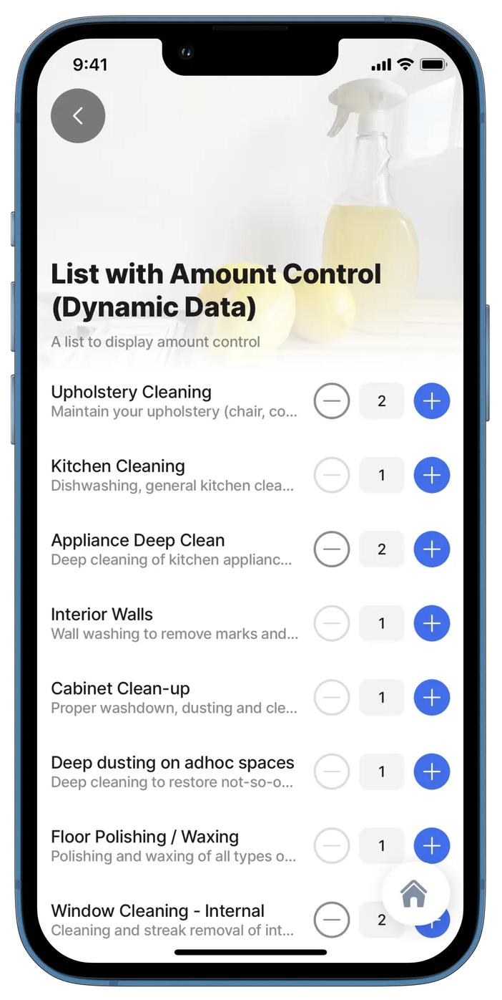<figcaption><p>List with amount control</p></figcaption></figure>



**Examples:**

See the full example of amount control options in [GitHub](https://github.com/jigx-com/jigx-samples/blob/main/quickstart/jigx-samples/jigs/components/list-item/static-data/list-with-right-elements/list-with-amount-control-sd.jigx). \
See the full example using static data in [GitHub](https://github.com/jigx-com/jigx-samples/blob/main/quickstart/jigx-samples/jigs/jigx-components/list-item/static-data/list-with-right-elements/list-with-right-amount-sd.jigx). \
See the full example using dynamic data in [GitHub](https://github.com/jigx-com/jigx-samples/blob/main/quickstart/jigx-samples/jigs/jigx-components/list-item/dynamic-data/list-with-right-elements/list-with-right-amount-dd.jigx).

**Datasources:** \
See the full datasource for static data in [GitHub](https://github.com/jigx-com/jigx-samples/blob/main/quickstart/jigx-samples/datasources/services/repair-services-static.jigx). \
See the full datasource for dynamic data in [GitHub](https://github.com/jigx-com/jigx-samples/blob/main/quickstart/jigx-samples/datasources/services/cleaning-services-dynamic.jigx).







```yaml
# Data configured to use datasource (static) 
data: =@ctx.datasources.repair-services-static
item:
  type: component.list-item
  options:
    title: =@ctx.current.item.service
    subtitle: =@ctx.current.item.description
    style:
      isDisabled: =@ctx.current.state.amount = 5
    rightElement:
      element: amount-control
      value: 1
      step: 1
      minimum: 2
      maximum: 5
```



```yaml
# Data configured to use datasource (dynamic) 
data: =@ctx.datasources.cleaning-services-dynamic
item:
  type: component.list-item
  options:
    title: =@ctx.current.item.service
    subtitle: =@ctx.current.item.description
    style:
      isDisabled: =@ctx.current.state.amount = 5
    rightElement:
      element: amount-control
      value: =$number(@ctx.current.item.quantity)
      step: 1
      minimum: 1
      maximum: 5
      onChange:
        type: action.execute-entity
        options:
          provider: DATA_PROVIDER_DYNAMIC
          entity: default/cleaning-services
          method: update
          data:
            id: =@ctx.current.item.id
            quantity: =@ctx.current.state.amount
```



```yaml
datasources:
  repair-services-static:
    type: datasource.static
    options:
      data:
        - id: 1
          description: Installation or repairs for doors. Doors to be provided by client
          hourlyRate: 70
          illustration: http://clipart-library.com/data_images/436224.png
          image: https://images.unsplash.com/photo-1500281781950-6cd80847ebcd?ixlib=rb-1.2.1&ixid=MnwxMjA3fDB8MHxwaG90by1wYWdlfHx8fGVufDB8fHx8&auto=format&fit=crop&w=1469&q=80
          materials: false
          service: Door Installation/Repair
          time: 60
        - id: 2
          description: Repairs to door handles 
          hourlyRate: 40
          illustration: http://clipart-library.com/img1/1332215.jpg
          image: https://images.unsplash.com/photo-1538766017398-415434a31a5b?ixlib=rb-1.2.1&ixid=MnwxMjA3fDB8MHxwaG90by1wYWdlfHx8fGVufDB8fHx8&auto=format&fit=crop&w=1470&q=80
          materials: true
          service: Door Handle/Lock Repairs
          time: 60        
        - id: 3
          description: Installation or repairs of tiled surfaces. Tiles have to be provided by client
          hourlyRate: 110
          illustration: http://clipart-library.com/images/kcKnbzbXi.jpg
          image: https://images.unsplash.com/photo-1523413184730-e85dbbd04aba?ixlib=rb-1.2.1&ixid=MnwxMjA3fDB8MHxwaG90by1wYWdlfHx8fGVufDB8fHx8&auto=format&fit=crop&w=687&q=80
          materials: false
          service: Tile Installation/Repair
          time: 120
        - id: 4
          description: Installation or repairs of dry-wall surfaces
          hourlyRate: 80
          illustration: http://clipart-library.com/img1/505759.jpg
          image: https://images.unsplash.com/photo-1628901551715-7234d14fb7a0?ixlib=rb-1.2.1&ixid=MnwxMjA3fDB8MHxwaG90by1wYWdlfHx8fGVufDB8fHx8&auto=format&fit=crop&w=1470&q=80
          materials: true
          service: Drywall Installation/Repair
          time: 120
        - id: 5
          description: Repairs to bathroom rails, toilets, etc
          hourlyRate: 90
          illustration: http://clipart-library.com/new_gallery/53-530190_black-and-white-toilet-png.png
          image: https://images.unsplash.com/photo-1585313647787-7a061b5a85a6?ixlib=rb-1.2.1&ixid=MnwxMjA3fDB8MHxwaG90by1wYWdlfHx8fGVufDB8fHx8&auto=format&fit=crop&w=1423&q=80
          materials: true
          service: Bathroom Repairs
          time: 60
        - id: 6
          description: Painting as required. Paint and tools not provided 
          hourlyRate: 70
          illustration: http://clipart-library.com/img/853166.jpg
          image: https://images.unsplash.com/photo-1562259949-e8e7689d7828?ixlib=rb-1.2.1&ixid=MnwxMjA3fDB8MHxwaG90by1wYWdlfHx8fGVufDB8fHx8&auto=format&fit=crop&w=1431&q=80
          materials: false
          service: Painting Services
          time: 120
        - id: 7
          description: Repairs to fences. Tools and items not included
          hourlyRate: 90
          illustration: http://clipart-library.com/img/18345.gif
          image: https://images.unsplash.com/photo-1583805978118-ba9a81ac1399?ixlib=rb-1.2.1&ixid=MnwxMjA3fDB8MHxwaG90by1wYWdlfHx8fGVufDB8fHx8&auto=format&fit=crop&w=1470&q=80
          materials: false
          service: Fence Installation/Repair
          time: 60
        - id: 8
          description: Removal of graffiti and painting. Paint and brushes not included in cost
          hourlyRate: 110
          illustration: http://clipart-library.com/images/6cy5aL5gi.jpg
          image: https://images.unsplash.com/photo-1581850518616-bcb8077a2336?ixlib=rb-1.2.1&ixid=MnwxMjA3fDB8MHxwaG90by1wYWdlfHx8fGVufDB8fHx8&auto=format&fit=crop&w=1470&q=80
          materials: false
          service: Removal of Graffiti
          time: 120
        - id: 9
          description: Repairs to cupboard doors
          hourlyRate: 60
          illustration: http://clipart-library.com/img1/1605140.jpg
          image: https://images.unsplash.com/photo-1522791465802-47616431a4cf?ixlib=rb-1.2.1&ixid=MnwxMjA3fDB8MHxwaG90by1wYWdlfHx8fGVufDB8fHx8&auto=format&fit=crop&w=1451&q=80
          materials: true
          service: Cupboard Door Repairs
          time: 60
        - id: 10
          description: Plumbing issues and repairs
          hourlyRate: 90
          illustration: http://clipart-library.com/images_k/plumbing-silhouette/plumbing-silhouette-6.png
          image: https://images.unsplash.com/photo-1591804774220-c1db3673d05b?ixlib=rb-1.2.1&ixid=MnwxMjA3fDB8MHxwaG90by1wYWdlfHx8fGVufDB8fHx8&auto=format&fit=crop&w=1074&q=80
          materials: true
          service: Plumbing
          time: 60
```



```yaml
datasources:
  cleaning-services-dynamic:
    type: datasource.sqlite
    options:
      provider: DATA_PROVIDER_DYNAMIC
      entities:
        - entity: default/cleaning-services
      query: |
        SELECT 
          id, 
          '$.id' as sqlid, 
          '$.area', 
          '$.description', 
          '$.hourlyrate', 
          '$.illustration', 
          '$.image', 
          '$.indoor', 
          '$.onceoffrate', 
          '$.service', 
          '$.pressed', 
          '$.time',
          '$.quantity'
        FROM [default/cleaning-services] 
        WHERE '$.hourlyrate' IS NOT NULL ORDER BY id DESC
```



## List with the right badges



<figure>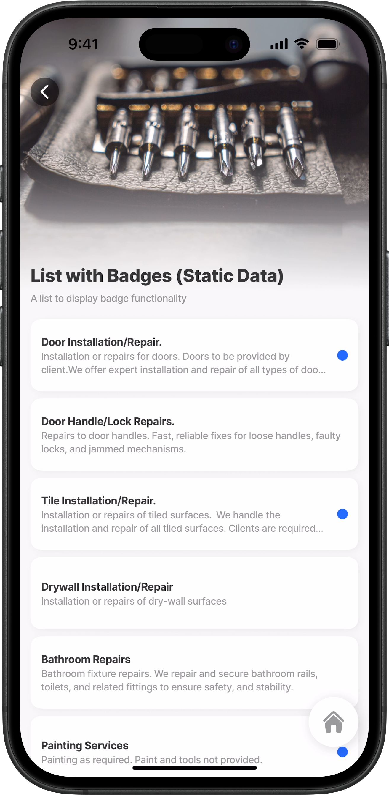<figcaption><p>List-item with right badge"</p></figcaption></figure>



This example shows `badges` that are displayed based on certain input. Badges always use the primary color. You cannot change the color of the badge. The styling has been applied to the `title` and `subtitle`, and each list-item displayed in a container.

**Examples:** \
See the full example using static data in [GitHub](https://github.com/jigx-com/jigx-samples/blob/main/quickstart/jigx-samples/jigs/jigx-components/list-item/static-data/list-with-right-elements/list-with-right-badge-sd.jigx). \
See the full example using dynamic data in [GitHub](https://github.com/jigx-com/jigx-samples/blob/main/quickstart/jigx-samples/jigs/jigx-components/list-item/dynamic-data/list-with-right-elements/list-with-right-badge-dd.jigx).

**Datasources:**

See the full datasource for static data in [GitHub](https://github.com/jigx-com/jigx-samples/blob/main/quickstart/jigx-samples/datasources/services/repair-services-static.jigx). \
See the full datasource for dynamic data in [GitHub](list-item.md).





```yaml
# Data configured to use datasource (static) 
data: =@ctx.datasources.repair-services-static
item:
  type: component.list-item
  options:
    # Configure each list-item to display in a container/card.  
    isContained: true
    # Add and style the title.
    title:
      text: =@ctx.current.item.service
      fontSize: regular
      isBold: true
    # Add a subtitle that wraps over two lines and define the font size.  
    subtitle:
      text: =@ctx.current.item.description
      numberOfLines: 2
      fontSize: small
    # Configure when the badge must display.  
    rightElement: 
      element: badge
      isHidden: =(@ctx.current.item.materials) = true ? true :false
```



```yaml
# Data configured to use datasource (dynamic) 
data: =@ctx.datasources.cleaning-services-dynamic
item:
  type: component.list-item
  options:
    # Configure each list-item to display in a container/card. 
    isContained: true
    # Add and style the title.
    title:
      text: =@ctx.current.item.service
      fontSize: regular
      isBold: true
    # Add a subtitle that wraps over two lines and define the font size.   
    subtitle:
      text: =@ctx.current.item.description
      numberOfLines: 2
      fontSize: small
    # Configure when the badge must display.  
    rightElement: 
      element: badge
      isHidden: =(@ctx.current.item.indoor) = 'TRUE' ? true :false
```



```yaml
type: datasource.static
options:
  data:
    - id: 1
      description: Installation or repairs for doors. Doors to be provided by client.We offer expert installation and repair of all types of doors, including interior, exterior, sliding, and security doors.
      hourlyRate: 70
      illustration: https://clipart-library.com/data_images/436224.png
      image: https://images.unsplash.com/photo-1500281781950-6cd80847ebcd?ixlib=rb-1.2.1&ixid=MnwxMjA3fDB8MHxwaG90by1wYWdlfHx8fGVufDB8fHx8&auto=format&fit=crop&w=1469&q=80
      materials: false
      service: Door Installation/Repair.
      time: 60
    - id: 2
      description: Repairs to door handles. Fast, reliable fixes for loose handles, faulty locks, and jammed mechanisms.
      hourlyRate: 40
      illustration: https://clipart-library.com/img1/1332215.jpg
      image: https://images.unsplash.com/photo-1538766017398-415434a31a5b?ixlib=rb-1.2.1&ixid=MnwxMjA3fDB8MHxwaG90by1wYWdlfHx8fGVufDB8fHx8&auto=format&fit=crop&w=1470&q=80
      materials: true
      service: Door Handle/Lock Repairs.
      time: 60
    - id: 3
      description: Installation or repairs of tiled surfaces.  We handle the installation and repair of all tiled surfaces. Clients are required to supply the tiles and tile adhesive.
      hourlyRate: 110
      illustration: https://clipart-library.com/images/kcKnbzbXi.jpg
      image: https://images.unsplash.com/photo-1523413184730-e85dbbd04aba?ixlib=rb-1.2.1&ixid=MnwxMjA3fDB8MHxwaG90by1wYWdlfHx8fGVufDB8fHx8&auto=format&fit=crop&w=687&q=80
      materials: false
      service: Tile Installation/Repair.
      time: 120
    - id: 4
      description: Installation or repairs of dry-wall surfaces
      hourlyRate: 80
      illustration: https://clipart-library.com/img1/505759.jpg
      image: https://images.unsplash.com/photo-1628901551715-7234d14fb7a0?ixlib=rb-1.2.1&ixid=MnwxMjA3fDB8MHxwaG90by1wYWdlfHx8fGVufDB8fHx8&auto=format&fit=crop&w=1470&q=80
      materials: true
      service: Drywall Installation/Repair
      time: 120
    - id: 5
      description: Bathroom fixture repairs. We repair and secure bathroom rails, toilets, and related fittings to ensure safety, and stability.
      hourlyRate: 90
      illustration: https://clipart-library.com/new_gallery/53-530190_black-and-white-toilet-png.png
      image: https://images.unsplash.com/photo-1585313647787-7a061b5a85a6?ixlib=rb-1.2.1&ixid=MnwxMjA3fDB8MHxwaG90by1wYWdlfHx8fGVufDB8fHx8&auto=format&fit=crop&w=1423&q=80
      materials: true
      service: Bathroom Repairs
      time: 60
    - id: 6
      description: Painting as required. Paint and tools not provided.
      hourlyRate: 70
      illustration: https://clipart-library.com/img/853166.jpg
      image: https://images.unsplash.com/photo-1562259949-e8e7689d7828?ixlib=rb-1.2.1&ixid=MnwxMjA3fDB8MHxwaG90by1wYWdlfHx8fGVufDB8fHx8&auto=format&fit=crop&w=1431&q=80
      materials: false
      service: Painting Services
      time: 120
    - id: 7
      description: Repairs to fences. Tools and items not included.
      hourlyRate: 90
      illustration: https://clipart-library.com/img/18345.gif
      image: https://images.unsplash.com/photo-1583805978118-ba9a81ac1399?ixlib=rb-1.2.1&ixid=MnwxMjA3fDB8MHxwaG90by1wYWdlfHx8fGVufDB8fHx8&auto=format&fit=crop&w=1470&q=80
      materials: false
      service: Fence Installation/Repair
      time: 60
    - id: 8
      description: Removal of graffiti and painting. Paint and brushes not included in cost.
      hourlyRate: 110
      illustration: https://clipart-library.com/images/6cy5aL5gi.jpg
      image: https://images.unsplash.com/photo-1581850518616-bcb8077a2336?ixlib=rb-1.2.1&ixid=MnwxMjA3fDB8MHxwaG90by1wYWdlfHx8fGVufDB8fHx8&auto=format&fit=crop&w=1470&q=80
      materials: false
      service: Removal of Graffiti
      time: 120
    - id: 9
      description: Repairs to cupboard doors.
      hourlyRate: 60
      illustration: https://clipart-library.com/img1/1605140.jpg
      image: https://images.unsplash.com/photo-1522791465802-47616431a4cf?ixlib=rb-1.2.1&ixid=MnwxMjA3fDB8MHxwaG90by1wYWdlfHx8fGVufDB8fHx8&auto=format&fit=crop&w=1451&q=80
      materials: true
      service: Cupboard Door Repairs
      time: 60
    - id: 10
      description: Plumbing issues and repairs. Ideal for addressing loose fixtures, leaks, or general wear and tear.
      hourlyRate: 90
      illustration: https://clipart-library.com/images_k/plumbing-silhouette/plumbing-silhouette-6.png
      image: https://images.unsplash.com/photo-1591804774220-c1db3673d05b?ixlib=rb-1.2.1&ixid=MnwxMjA3fDB8MHxwaG90by1wYWdlfHx8fGVufDB8fHx8&auto=format&fit=crop&w=1074&q=80
      materials: true
      service: Plumbing
      time: 60
```



```yaml
datasources:
  cleaning-services-dynamic:
    type: datasource.sqlite
    options:
      provider: DATA_PROVIDER_DYNAMIC
      entities:
        - entity: default/cleaning-services
      query: |
        SELECT 
          id, 
          '$.id' as sqlid, 
          '$.area', 
          '$.description', 
          '$.hourlyrate', 
          '$.illustration', 
          '$.image', 
          '$.indoor', 
          '$.onceoffrate', 
          '$.service', 
          '$.pressed', 
          '$.time',
          '$.quantity'
        FROM [default/cleaning-services] 
        WHERE '$.hourlyrate' IS NOT NULL ORDER BY id DESC
```



## List with right numbered badges



In this example a list shows the work priorities and how many tasks there are for each priority. The `rightElement` uses a `badge` with an expression. The count is performed in the datasource query rather than in the expression. The expression calls the taskCount from the datasource. Badges always use the primary color. You cannot change the color of the badge.

**Examples:** \
See the example in [GitHub](https://github.com/jigx-com/jigx-samples/blob/main/quickstart/jigx-samples/jigs/jigx-components/list-item/dynamic-data/list-with-right-elements/default-w-numbered-badge-list.jigx).



<figure>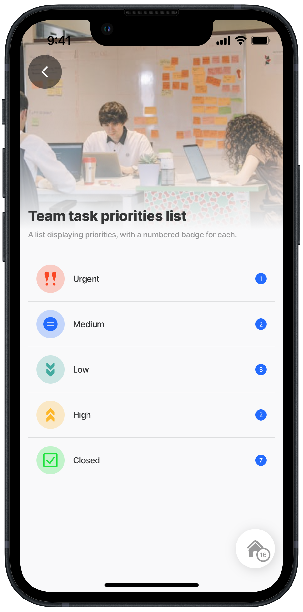<figcaption><p>List-item with numbered badge</p></figcaption></figure>





```yaml
title: Team task priorities list
description: A list displaying priorities, with a numbered badge for each. 
type: jig.default

header:
  type: component.jig-header
  options:
    height: medium
    children:
      type: component.image
      options:
        source:
          uri: https://images.unsplash.com/photo-1569098644584-210bcd375b59?w=500&auto=format&fit=crop&q=60&ixlib=rb-4.0.3&ixid=M3wxMjA3fDB8MHxzZWFyY2h8MjV8fHdvcmslMjB0YXNrc3xlbnwwfHwwfHx8MA%3D%3D

children:
  - type: component.list
    options:
      data: =@ctx.datasources.team-tasks
      maximumItemsToRender: 8
      item: 
        type: component.list-item
        options:
          color:
            - when: =@ctx.current.item.priority = 'Urgent'
              color: negative
            - when: =@ctx.current.item.priority = 'Medium'
              color: primary
            - when: =@ctx.current.item.priority = 'Low'
              color: color6
            - when: =@ctx.current.item.priority = 'Closed'
              color: positive
            - when: =@ctx.current.item.priority = 'High'
              color: warning
          title: =@ctx.current.item.priority
          divider: solid
          leftElement:
           # Add an icon with styling.
            element: icon
            icon: =@ctx.datasources.priority[name = @ctx.current.item.priority].icon
            type: duotone
          rightElement:
            # The badge will display with the number of priorities
            # per priority, the count is configured in the datasource query.     
            element: badge
            value: =@ctx.current.item.taskCount
```



```typescript
datasources:
  team-tasks:
    type: datasource.sqlite
    options:
      provider: DATA_PROVIDER_DYNAMIC
      entities:
        - entity: default/tasks
      query: |
        SELECT 
          id, 
          JSON_EXTRACT(task.data, '$.taskAssignee') AS taskAssignee,
          JSON_EXTRACT(task.data, '$.taskName') AS taskName,
          JSON_EXTRACT(task.data, '$.taskCost') AS taskCost,
          JSON_EXTRACT(task.data, '$.taskId') AS taskId,
          JSON_EXTRACT(task.data, '$.taskStatus') AS taskStatus,
          JSON_EXTRACT(task.data, '$.team') AS team,
          JSON_EXTRACT(task.data, '$.Profile') AS Profile,
          JSON_EXTRACT(task.data, '$.priority') AS priority,
          COUNT(JSON_EXTRACT(task.data, '$.taskId')) AS taskCount
        FROM [default/tasks] AS task
        GROUP BY priority
        ORDER BY priority DESC

  priority: 
    type: datasource.static
    options:
      data:
        - id: 1
          name: Closed
          icon: check-2-alternate
        - id: 2
          name: Urgent
          icon: double-exclamation-mark-2-formatting
        - id: 3
          name: High
          icon: arrow-double-up
        - id: 4
          name: Low
          icon: arrow-double-down
        - id: 4
          name: Medium
          icon: equal-math-symbol-circle
```



## List with right Buttons



<figure>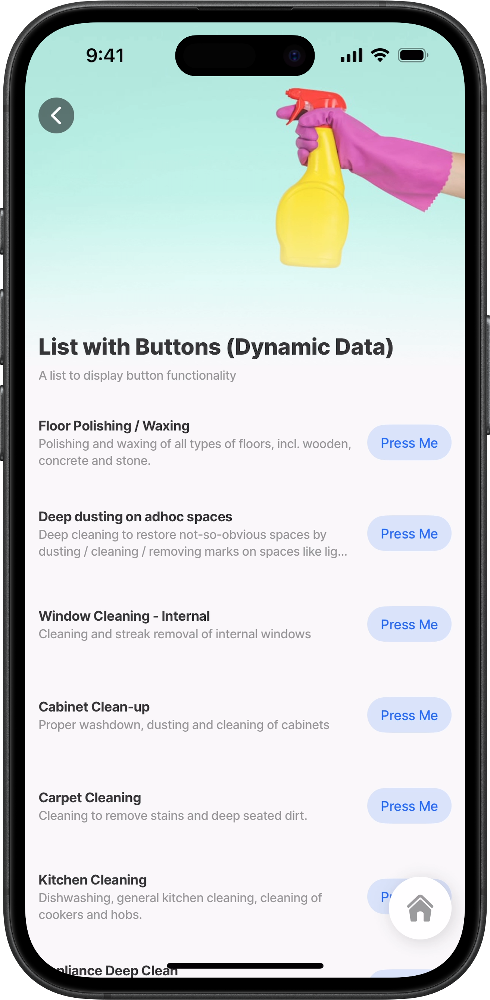<figcaption><p>List-item with button</p></figcaption></figure>



This example shows a list with actionable buttons, a bold `title`, and the `subtitle` wraps over two lines.

**Examples:**\
&#x20;See the full example using static data in [GitHub](https://github.com/jigx-com/jigx-samples/blob/main/quickstart/jigx-samples/jigs/jigx-components/list-item/static-data/list-with-right-elements/list-with-right-button-sd.jigx). \
See the full example using dynamic data in [GitHub](https://github.com/jigx-com/jigx-samples/blob/main/quickstart/jigx-samples/jigs/jigx-components/list-item/dynamic-data/list-with-right-elements/list-with-right-button-dd.jigx).

**Datasources:** \
See the full datasource for static data in [GitHub](https://github.com/jigx-com/jigx-samples/blob/main/quickstart/jigx-samples/datasources/services/repair-services-static.jigx). \
See the full datasource for dynamic data in [GitHub](https://github.com/jigx-com/jigx-samples/blob/main/quickstart/jigx-samples/datasources/services/cleaning-services-dynamic.jigx).





```yaml
# Data configured to use datasource (static) 
data: =@ctx.datasources.repair-services-static
item:
  type: component.list-item
  options:
    # Define a title and apply custom styling such as font size, 
    # weight, and color.
    title:
      text: =@ctx.current.item.service
      isBold: true
      fontSize: regular
    # Configure the subtitle to allow text wrapping across two lines.   
    subtitle:
      text: =@ctx.current.item.description
      numberOfLines: 2
    # Define a button to display on the right of the list-item, 
    # when pressed you will go to the previous screen. 
    rightElement:
      element: button
      title: Press Me
      onPress:
        type: action.go-back
```



```yaml
# Data configured to use datasource (dynamic) 
data: =@ctx.datasources.cleaning-services-dynamic
item:
  type: component.list-item
  options:
    # Define a title and apply custom styling such as font size, 
    # weight, and color.
    title:
      text: =@ctx.current.item.service
      isBold: true
      fontSize: regular
    # Configure the subtitle to allow text wrapping across two lines.  
    subtitle:
      text: =@ctx.current.item.description
      numberOfLines: 2
    # Define a button to display on the right of the list-item, 
    # when pressed you will go to the previous screen.   
    rightElement:
      element: button
      title: Press Me
      onPress:
        type: action.go-back
```



```yaml
type: datasource.static
options:
  data:
    - id: 1
      description: Installation or repairs for doors. Doors to be provided by client.We offer expert installation and repair of all types of doors, including interior, exterior, sliding, and security doors.
      hourlyRate: 70
      illustration: https://clipart-library.com/data_images/436224.png
      image: https://images.unsplash.com/photo-1500281781950-6cd80847ebcd?ixlib=rb-1.2.1&ixid=MnwxMjA3fDB8MHxwaG90by1wYWdlfHx8fGVufDB8fHx8&auto=format&fit=crop&w=1469&q=80
      materials: false
      service: Door Installation/Repair.
      time: 60
    - id: 2
      description: Repairs to door handles. Fast, reliable fixes for loose handles, faulty locks, and jammed mechanisms.
      hourlyRate: 40
      illustration: https://clipart-library.com/img1/1332215.jpg
      image: https://images.unsplash.com/photo-1538766017398-415434a31a5b?ixlib=rb-1.2.1&ixid=MnwxMjA3fDB8MHxwaG90by1wYWdlfHx8fGVufDB8fHx8&auto=format&fit=crop&w=1470&q=80
      materials: true
      service: Door Handle/Lock Repairs.
      time: 60
    - id: 3
      description: Installation or repairs of tiled surfaces.  We handle the installation and repair of all tiled surfaces. Clients are required to supply the tiles and tile adhesive.
      hourlyRate: 110
      illustration: https://clipart-library.com/images/kcKnbzbXi.jpg
      image: https://images.unsplash.com/photo-1523413184730-e85dbbd04aba?ixlib=rb-1.2.1&ixid=MnwxMjA3fDB8MHxwaG90by1wYWdlfHx8fGVufDB8fHx8&auto=format&fit=crop&w=687&q=80
      materials: false
      service: Tile Installation/Repair.
      time: 120
    - id: 4
      description: Installation or repairs of dry-wall surfaces
      hourlyRate: 80
      illustration: https://clipart-library.com/img1/505759.jpg
      image: https://images.unsplash.com/photo-1628901551715-7234d14fb7a0?ixlib=rb-1.2.1&ixid=MnwxMjA3fDB8MHxwaG90by1wYWdlfHx8fGVufDB8fHx8&auto=format&fit=crop&w=1470&q=80
      materials: true
      service: Drywall Installation/Repair
      time: 120
    - id: 5
      description: Bathroom fixture repairs. We repair and secure bathroom rails, toilets, and related fittings to ensure safety, and stability.
      hourlyRate: 90
      illustration: https://clipart-library.com/new_gallery/53-530190_black-and-white-toilet-png.png
      image: https://images.unsplash.com/photo-1585313647787-7a061b5a85a6?ixlib=rb-1.2.1&ixid=MnwxMjA3fDB8MHxwaG90by1wYWdlfHx8fGVufDB8fHx8&auto=format&fit=crop&w=1423&q=80
      materials: true
      service: Bathroom Repairs
      time: 60
    - id: 6
      description: Painting as required. Paint and tools not provided.
      hourlyRate: 70
      illustration: https://clipart-library.com/img/853166.jpg
      image: https://images.unsplash.com/photo-1562259949-e8e7689d7828?ixlib=rb-1.2.1&ixid=MnwxMjA3fDB8MHxwaG90by1wYWdlfHx8fGVufDB8fHx8&auto=format&fit=crop&w=1431&q=80
      materials: false
      service: Painting Services
      time: 120
    - id: 7
      description: Repairs to fences. Tools and items not included.
      hourlyRate: 90
      illustration: https://clipart-library.com/img/18345.gif
      image: https://images.unsplash.com/photo-1583805978118-ba9a81ac1399?ixlib=rb-1.2.1&ixid=MnwxMjA3fDB8MHxwaG90by1wYWdlfHx8fGVufDB8fHx8&auto=format&fit=crop&w=1470&q=80
      materials: false
      service: Fence Installation/Repair
      time: 60
    - id: 8
      description: Removal of graffiti and painting. Paint and brushes not included in cost.
      hourlyRate: 110
      illustration: https://clipart-library.com/images/6cy5aL5gi.jpg
      image: https://images.unsplash.com/photo-1581850518616-bcb8077a2336?ixlib=rb-1.2.1&ixid=MnwxMjA3fDB8MHxwaG90by1wYWdlfHx8fGVufDB8fHx8&auto=format&fit=crop&w=1470&q=80
      materials: false
      service: Removal of Graffiti
      time: 120
    - id: 9
      description: Repairs to cupboard doors.
      hourlyRate: 60
      illustration: https://clipart-library.com/img1/1605140.jpg
      image: https://images.unsplash.com/photo-1522791465802-47616431a4cf?ixlib=rb-1.2.1&ixid=MnwxMjA3fDB8MHxwaG90by1wYWdlfHx8fGVufDB8fHx8&auto=format&fit=crop&w=1451&q=80
      materials: true
      service: Cupboard Door Repairs
      time: 60
    - id: 10
      description: Plumbing issues and repairs. Ideal for addressing loose fixtures, leaks, or general wear and tear.
      hourlyRate: 90
      illustration: https://clipart-library.com/images_k/plumbing-silhouette/plumbing-silhouette-6.png
      image: https://images.unsplash.com/photo-1591804774220-c1db3673d05b?ixlib=rb-1.2.1&ixid=MnwxMjA3fDB8MHxwaG90by1wYWdlfHx8fGVufDB8fHx8&auto=format&fit=crop&w=1074&q=80
      materials: true
      service: Plumbing
      time: 60
```



```yaml
datasources:
  cleaning-services-dynamic:
    type: datasource.sqlite
    options:
      provider: DATA_PROVIDER_DYNAMIC
      entities:
        - entity: default/cleaning-services
      query: |
        SELECT 
          id, 
          '$.id' as sqlid, 
          '$.area', 
          '$.description', 
          '$.hourlyrate', 
          '$.illustration', 
          '$.image', 
          '$.indoor', 
          '$.onceoffrate', 
          '$.service', 
          '$.pressed', 
          '$.time',
          '$.quantity'
        FROM [default/cleaning-services] 
        WHERE '$.hourlyrate' IS NOT NULL ORDER BY id DESC
```



## List with the right icons



<figure><figcaption><p>List-item with right icons</p></figcaption></figure>



This example shows icons to the right of the list-items.

**Examples:** \
See the full example using static data in [GitHub](https://github.com/jigx-com/jigx-samples/blob/main/quickstart/jigx-samples/jigs/jigx-components/list-item/static-data/list-with-right-elements/list-with-right-icon-sd.jigx). \
See the full example using dynamic data in [GitHub](https://github.com/jigx-com/jigx-samples/blob/main/quickstart/jigx-samples/jigs/jigx-components/list-item/dynamic-data/list-with-right-elements/list-with-right-icon-dd.jigx).

**Datasources:** \
See the full datasource for static data in [GitHub](https://github.com/jigx-com/jigx-samples/blob/main/quickstart/jigx-samples/datasources/services/repair-services-static.jigx).\
&#x20;See the full datasource for dynamic data in [GitHub](https://github.com/jigx-com/jigx-samples/blob/main/quickstart/jigx-samples/datasources/services/cleaning-services-dynamic.jigx).





```yaml
# Data configured to use datasource (static) 
data: =@ctx.datasources.repair-services-static
item:
  type: component.list-item
  options:
    # Define a title and apply custom styling such as font size, 
    # weight, and color.
    title:
      text: =@ctx.current.item.service
      isBold: true
      fontSize: regular
   # Configure the subtitle to allow text wrapping across two lines.   
    subtitle:
      text: =@ctx.current.item.description
      isSubtle: true
      numberOfLines: 2
    rightElement:
      # Define an icon on the right and apply custom styling such as
      # shape, and color.
      element: icon
      icon: =(@ctx.current.item.materials = true ? 'attachment' :'alert-triangle')
      type: contained
      shape: circle
      color: color14
```



```yaml
# Data configured to use datasource (dynamic) 
data: =@ctx.datasources.cleaning-services-dynamic
item:
  type: component.list-item
  options:
    # Define a title and apply custom styling such as font size, 
    # weight, and color.
    title:
      text: =@ctx.current.item.service
      isBold: true
      fontSize: regular
    # Configure a subtle subtitle.  
    subtitle: 
      text: =@ctx.current.item.time & 'minutes for task completion'
      isSubtle: true
    # Define an icon on the right and apply custom styling such as
    # shape, and color.  
    rightElement: 
      element: icon
      icon: =(@ctx.current.item.indoor = "TRUE" ? 'home' :'car-garage')
      type: contained
      shape: circle
      color: color14
```



```yaml
type: datasource.static
options:
  data:
    - id: 1
      description: Installation or repairs for doors. Doors to be provided by client.We offer expert installation and repair of all types of doors, including interior, exterior, sliding, and security doors.
      hourlyRate: 70
      illustration: https://clipart-library.com/data_images/436224.png
      image: https://images.unsplash.com/photo-1500281781950-6cd80847ebcd?ixlib=rb-1.2.1&ixid=MnwxMjA3fDB8MHxwaG90by1wYWdlfHx8fGVufDB8fHx8&auto=format&fit=crop&w=1469&q=80
      materials: false
      service: Door Installation/Repair.
      time: 60
    - id: 2
      description: Repairs to door handles. Fast, reliable fixes for loose handles, faulty locks, and jammed mechanisms.
      hourlyRate: 40
      illustration: https://clipart-library.com/img1/1332215.jpg
      image: https://images.unsplash.com/photo-1538766017398-415434a31a5b?ixlib=rb-1.2.1&ixid=MnwxMjA3fDB8MHxwaG90by1wYWdlfHx8fGVufDB8fHx8&auto=format&fit=crop&w=1470&q=80
      materials: true
      service: Door Handle/Lock Repairs.
      time: 60
    - id: 3
      description: Installation or repairs of tiled surfaces.  We handle the installation and repair of all tiled surfaces. Clients are required to supply the tiles and tile adhesive.
      hourlyRate: 110
      illustration: https://clipart-library.com/images/kcKnbzbXi.jpg
      image: https://images.unsplash.com/photo-1523413184730-e85dbbd04aba?ixlib=rb-1.2.1&ixid=MnwxMjA3fDB8MHxwaG90by1wYWdlfHx8fGVufDB8fHx8&auto=format&fit=crop&w=687&q=80
      materials: false
      service: Tile Installation/Repair.
      time: 120
    - id: 4
      description: Installation or repairs of dry-wall surfaces
      hourlyRate: 80
      illustration: https://clipart-library.com/img1/505759.jpg
      image: https://images.unsplash.com/photo-1628901551715-7234d14fb7a0?ixlib=rb-1.2.1&ixid=MnwxMjA3fDB8MHxwaG90by1wYWdlfHx8fGVufDB8fHx8&auto=format&fit=crop&w=1470&q=80
      materials: true
      service: Drywall Installation/Repair
      time: 120
    - id: 5
      description: Bathroom fixture repairs. We repair and secure bathroom rails, toilets, and related fittings to ensure safety, and stability.
      hourlyRate: 90
      illustration: https://clipart-library.com/new_gallery/53-530190_black-and-white-toilet-png.png
      image: https://images.unsplash.com/photo-1585313647787-7a061b5a85a6?ixlib=rb-1.2.1&ixid=MnwxMjA3fDB8MHxwaG90by1wYWdlfHx8fGVufDB8fHx8&auto=format&fit=crop&w=1423&q=80
      materials: true
      service: Bathroom Repairs
      time: 60
    - id: 6
      description: Painting as required. Paint and tools not provided.
      hourlyRate: 70
      illustration: https://clipart-library.com/img/853166.jpg
      image: https://images.unsplash.com/photo-1562259949-e8e7689d7828?ixlib=rb-1.2.1&ixid=MnwxMjA3fDB8MHxwaG90by1wYWdlfHx8fGVufDB8fHx8&auto=format&fit=crop&w=1431&q=80
      materials: false
      service: Painting Services
      time: 120
    - id: 7
      description: Repairs to fences. Tools and items not included.
      hourlyRate: 90
      illustration: https://clipart-library.com/img/18345.gif
      image: https://images.unsplash.com/photo-1583805978118-ba9a81ac1399?ixlib=rb-1.2.1&ixid=MnwxMjA3fDB8MHxwaG90by1wYWdlfHx8fGVufDB8fHx8&auto=format&fit=crop&w=1470&q=80
      materials: false
      service: Fence Installation/Repair
      time: 60
    - id: 8
      description: Removal of graffiti and painting. Paint and brushes not included in cost.
      hourlyRate: 110
      illustration: https://clipart-library.com/images/6cy5aL5gi.jpg
      image: https://images.unsplash.com/photo-1581850518616-bcb8077a2336?ixlib=rb-1.2.1&ixid=MnwxMjA3fDB8MHxwaG90by1wYWdlfHx8fGVufDB8fHx8&auto=format&fit=crop&w=1470&q=80
      materials: false
      service: Removal of Graffiti
      time: 120
    - id: 9
      description: Repairs to cupboard doors.
      hourlyRate: 60
      illustration: https://clipart-library.com/img1/1605140.jpg
      image: https://images.unsplash.com/photo-1522791465802-47616431a4cf?ixlib=rb-1.2.1&ixid=MnwxMjA3fDB8MHxwaG90by1wYWdlfHx8fGVufDB8fHx8&auto=format&fit=crop&w=1451&q=80
      materials: true
      service: Cupboard Door Repairs
      time: 60
    - id: 10
      description: Plumbing issues and repairs. Ideal for addressing loose fixtures, leaks, or general wear and tear.
      hourlyRate: 90
      illustration: https://clipart-library.com/images_k/plumbing-silhouette/plumbing-silhouette-6.png
      image: https://images.unsplash.com/photo-1591804774220-c1db3673d05b?ixlib=rb-1.2.1&ixid=MnwxMjA3fDB8MHxwaG90by1wYWdlfHx8fGVufDB8fHx8&auto=format&fit=crop&w=1074&q=80
      materials: true
      service: Plumbing
      time: 60
```



```yaml
datasources:
  cleaning-services-dynamic:
    type: datasource.sqlite
    options:
      provider: DATA_PROVIDER_DYNAMIC
      entities:
        - entity: default/cleaning-services
      query: |
        SELECT 
          id, 
          '$.id' as sqlid, 
          '$.area', 
          '$.description', 
          '$.hourlyrate', 
          '$.illustration', 
          '$.image', 
          '$.indoor', 
          '$.onceoffrate', 
          '$.service', 
          '$.pressed', 
          '$.time',
          '$.quantity'
        FROM [default/cleaning-services] 
        WHERE '$.hourlyrate' IS NOT NULL ORDER BY id DESC
```



## List with the right switch



<figure>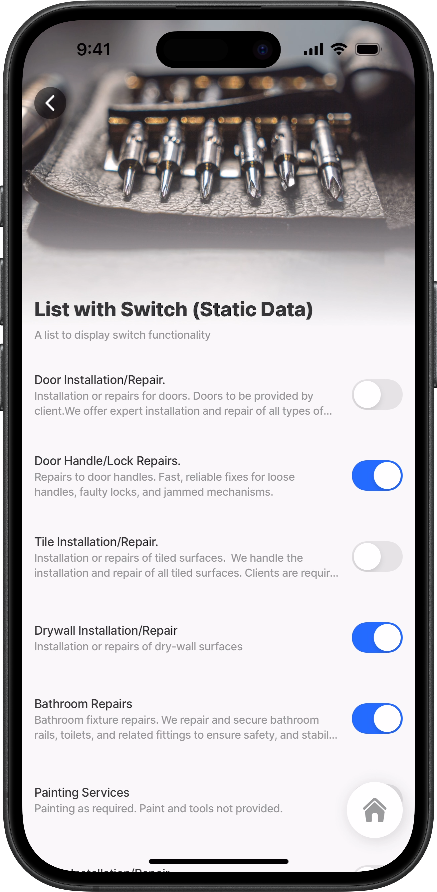<figcaption><p>List-item with switch</p></figcaption></figure>



This example displays a list with switches/toggle functionality - based on a certain input.

**Examples:** \
See the full example using static data in [GitHub](https://github.com/jigx-com/jigx-samples/blob/main/quickstart/jigx-samples/jigs/jigx-components/list-item/static-data/list-with-right-elements/list-with-right-switch-sd.jigx). \
See the full example using dynamic data in [GitHub](https://github.com/jigx-com/jigx-samples/blob/main/quickstart/jigx-samples/jigs/jigx-components/list-item/dynamic-data/list-with-right-elements/list-with-right-switch-dd.jigx).

**Datasources:** \
See the full datasource for static data in [GitHub](https://github.com/jigx-com/jigx-samples/blob/main/quickstart/jigx-samples/datasources/services/repair-services-static.jigx). \
See the full datasource for dynamic data in [GitHub](https://github.com/jigx-com/jigx-samples/blob/main/quickstart/jigx-samples/datasources/services/cleaning-services-dynamic.jigx).





```yaml
# Data configured to use datasource (static) 
data: =@ctx.datasources.repair-services-static
item:
  type: component.list-item
  options:
    # Add a line to devide each item in the list.
    divider: solid
    # Define a title and apply custom styling such as font size.
    title:
      text: =@ctx.current.item.service
      fontSize: regular
    # Configure the subtitle to allow text wrapping across two lines.  
    subtitle:
      text: =@ctx.current.item.description
      numberOfLines: 2
    # Add a switch to the right of each item. Use initialvalue to set
    # some of the switches when the screen opens. 
    rightElement:
      element: switch
      initialValue: =(@ctx.current.item.materials = true ? true:false)

```



```yaml
# Data configured to use datasource (dynamic) 
data: =@ctx.datasources.cleaning-services-dynamic
item:
  type: component.list-item
  options:
  # Add a line to divide each item in the list.
    divider: solid
    # Define a title and apply custom styling such as font size.
    title:
      text: =@ctx.current.item.service
      fontSize: regular
    # Configure the subtitle to allow text wrapping across two lines.  
    subtitle:
      text: =@ctx.current.item.description
      numberOfLines: 2
    # Add a switch to the right of each item. Use initialValue to set
    # some of the switches when the screen opens. 
    rightElement: 
      element: switch
      initialValue: =(@ctx.current.item.indoor = 'TRUE' ? true:false)
```



```yaml
type: datasource.static
options:
  data:
    - id: 1
      description: Installation or repairs for doors. Doors to be provided by client.We offer expert installation and repair of all types of doors, including interior, exterior, sliding, and security doors.
      hourlyRate: 70
      illustration: https://clipart-library.com/data_images/436224.png
      image: https://images.unsplash.com/photo-1500281781950-6cd80847ebcd?ixlib=rb-1.2.1&ixid=MnwxMjA3fDB8MHxwaG90by1wYWdlfHx8fGVufDB8fHx8&auto=format&fit=crop&w=1469&q=80
      materials: false
      service: Door Installation/Repair.
      time: 60
    - id: 2
      description: Repairs to door handles. Fast, reliable fixes for loose handles, faulty locks, and jammed mechanisms.
      hourlyRate: 40
      illustration: https://clipart-library.com/img1/1332215.jpg
      image: https://images.unsplash.com/photo-1538766017398-415434a31a5b?ixlib=rb-1.2.1&ixid=MnwxMjA3fDB8MHxwaG90by1wYWdlfHx8fGVufDB8fHx8&auto=format&fit=crop&w=1470&q=80
      materials: true
      service: Door Handle/Lock Repairs.
      time: 60
    - id: 3
      description: Installation or repairs of tiled surfaces.  We handle the installation and repair of all tiled surfaces. Clients are required to supply the tiles and tile adhesive.
      hourlyRate: 110
      illustration: https://clipart-library.com/images/kcKnbzbXi.jpg
      image: https://images.unsplash.com/photo-1523413184730-e85dbbd04aba?ixlib=rb-1.2.1&ixid=MnwxMjA3fDB8MHxwaG90by1wYWdlfHx8fGVufDB8fHx8&auto=format&fit=crop&w=687&q=80
      materials: false
      service: Tile Installation/Repair.
      time: 120
    - id: 4
      description: Installation or repairs of dry-wall surfaces
      hourlyRate: 80
      illustration: https://clipart-library.com/img1/505759.jpg
      image: https://images.unsplash.com/photo-1628901551715-7234d14fb7a0?ixlib=rb-1.2.1&ixid=MnwxMjA3fDB8MHxwaG90by1wYWdlfHx8fGVufDB8fHx8&auto=format&fit=crop&w=1470&q=80
      materials: true
      service: Drywall Installation/Repair
      time: 120
    - id: 5
      description: Bathroom fixture repairs. We repair and secure bathroom rails, toilets, and related fittings to ensure safety, and stability.
      hourlyRate: 90
      illustration: https://clipart-library.com/new_gallery/53-530190_black-and-white-toilet-png.png
      image: https://images.unsplash.com/photo-1585313647787-7a061b5a85a6?ixlib=rb-1.2.1&ixid=MnwxMjA3fDB8MHxwaG90by1wYWdlfHx8fGVufDB8fHx8&auto=format&fit=crop&w=1423&q=80
      materials: true
      service: Bathroom Repairs
      time: 60
    - id: 6
      description: Painting as required. Paint and tools not provided.
      hourlyRate: 70
      illustration: https://clipart-library.com/img/853166.jpg
      image: https://images.unsplash.com/photo-1562259949-e8e7689d7828?ixlib=rb-1.2.1&ixid=MnwxMjA3fDB8MHxwaG90by1wYWdlfHx8fGVufDB8fHx8&auto=format&fit=crop&w=1431&q=80
      materials: false
      service: Painting Services
      time: 120
    - id: 7
      description: Repairs to fences. Tools and items not included.
      hourlyRate: 90
      illustration: https://clipart-library.com/img/18345.gif
      image: https://images.unsplash.com/photo-1583805978118-ba9a81ac1399?ixlib=rb-1.2.1&ixid=MnwxMjA3fDB8MHxwaG90by1wYWdlfHx8fGVufDB8fHx8&auto=format&fit=crop&w=1470&q=80
      materials: false
      service: Fence Installation/Repair
      time: 60
    - id: 8
      description: Removal of graffiti and painting. Paint and brushes not included in cost.
      hourlyRate: 110
      illustration: https://clipart-library.com/images/6cy5aL5gi.jpg
      image: https://images.unsplash.com/photo-1581850518616-bcb8077a2336?ixlib=rb-1.2.1&ixid=MnwxMjA3fDB8MHxwaG90by1wYWdlfHx8fGVufDB8fHx8&auto=format&fit=crop&w=1470&q=80
      materials: false
      service: Removal of Graffiti
      time: 120
    - id: 9
      description: Repairs to cupboard doors.
      hourlyRate: 60
      illustration: https://clipart-library.com/img1/1605140.jpg
      image: https://images.unsplash.com/photo-1522791465802-47616431a4cf?ixlib=rb-1.2.1&ixid=MnwxMjA3fDB8MHxwaG90by1wYWdlfHx8fGVufDB8fHx8&auto=format&fit=crop&w=1451&q=80
      materials: true
      service: Cupboard Door Repairs
      time: 60
    - id: 10
      description: Plumbing issues and repairs. Ideal for addressing loose fixtures, leaks, or general wear and tear.
      hourlyRate: 90
      illustration: https://clipart-library.com/images_k/plumbing-silhouette/plumbing-silhouette-6.png
      image: https://images.unsplash.com/photo-1591804774220-c1db3673d05b?ixlib=rb-1.2.1&ixid=MnwxMjA3fDB8MHxwaG90by1wYWdlfHx8fGVufDB8fHx8&auto=format&fit=crop&w=1074&q=80
      materials: true
      service: Plumbing
      time: 60
```



```yaml
datasources:
  cleaning-services-dynamic:
    type: datasource.sqlite
    options:
      provider: DATA_PROVIDER_DYNAMIC
      entities:
        - entity: default/cleaning-services
      query: |
        SELECT 
          id, 
          '$.id' as sqlid, 
          '$.area', 
          '$.description', 
          '$.hourlyrate', 
          '$.illustration', 
          '$.image', 
          '$.indoor', 
          '$.onceoffrate', 
          '$.service', 
          '$.pressed', 
          '$.time',
          '$.quantity'
        FROM [default/cleaning-services] 
        WHERE '$.hourlyrate' IS NOT NULL ORDER BY id DESC
```



## List with the right value



<figure>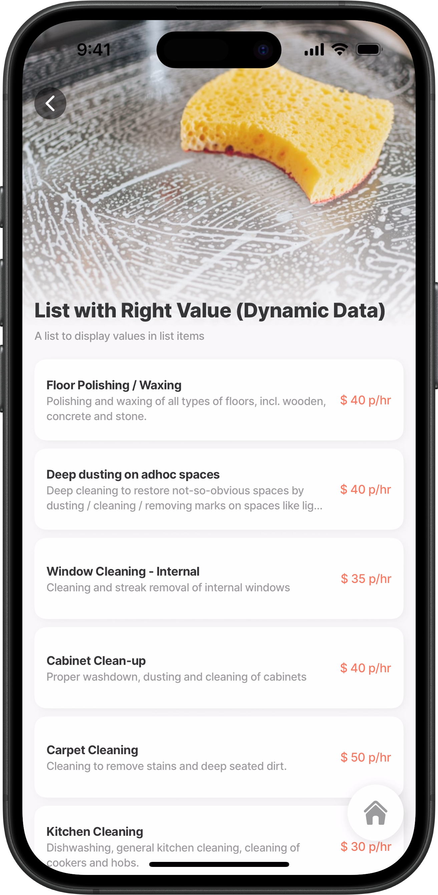<figcaption><p>List-item with right values</p></figcaption></figure>



&#x20;This example shows the right `values` on a list populated dynamically based on input, and additional configuration using expressions were used to concatenate values. Each list item `isContained` with bold `title`, `subtitle` wrapping over two lines.

**Examples:** \
See the full example using static data in [GitHub](https://github.com/jigx-com/jigx-samples/blob/main/quickstart/jigx-samples/jigs/jigx-components/list-item/static-data/list-with-right-elements/list-with-right-value-sd.jigx). \
See the full example using dynamic data in [GitHub](https://github.com/jigx-com/jigx-samples/blob/main/quickstart/jigx-samples/jigs/jigx-components/list-item/dynamic-data/list-with-right-elements/list-with-right-value-dd.jigx).

**Datasources:** \
See the full datasource for static data in [GitHub](https://github.com/jigx-com/jigx-samples/blob/main/quickstart/jigx-samples/datasources/services/repair-services-static.jigx). \
See the full datasource for dynamic data in [GitHub](https://github.com/jigx-com/jigx-samples/blob/main/quickstart/jigx-samples/datasources/services/cleaning-services-dynamic.jigx).





```yaml
title: List with Right Value (Static Data)
description: A list to display values in list items
type: jig.list
icon: task-list

header:
  type: component.jig-header
  options:
    height: medium
    children:
      type: component.image
      options:
        source:
          uri: https://images.unsplash.com/photo-1534398079543-7ae6d016b86a?ixlib=rb-1.2.1&ixid=MnwxMjA3fDB8MHxzZWFyY2h8N3x8cmVwYWlyc3xlbnwwfHwwfHw%3D&auto=format&fit=crop&w=900&q=60
# Data configured to use datasource (static) 
data: =@ctx.datasources.repair-services-static
item:
  type: component.list-item
  options:
    # Configure each list-item to display in a container/card. 
    isContained: true
    # Define a title and apply custom styling.
    title: 
      text: =@ctx.current.item.service
      isBold: true
    # Configure the subtitle to allow text wrapping across two lines.   
    subtitle: 
      text: =@ctx.current.item.description
      numberOfLines: 2
    # Add a value to the right of each item, and add a color. 
    rightElement: 
      element: value
      text: ='$ ' & @ctx.current.item.hourlyRate
      color: color4
```



```yaml
title: List with Right Value (Dynamic Data)
description: A list to display values in list items
type: jig.list
icon: task-list

header:
  type: component.jig-header
  options:
    height: medium
    children:
      type: component.image
      options:
        source:
          uri: https://images.unsplash.com/photo-1618038483079-bfe64dcb17f1?ixlib=rb-1.2.1&ixid=MnwxMjA3fDB8MHxwaG90by1wYWdlfHx8fGVufDB8fHx8&auto=format&fit=crop&w=870&q=80
# Data configured to use datasource (dynamic) 
data: =@ctx.datasources.cleaning-services-dynamic
item:
  type: component.list-item
  options:
    # Configure each list-item to display in a container/card. 
    isContained: true
    # Define a title and apply custom styling.
    title:
      text: =@ctx.current.item.service
      isBold: true
    # Configure the subtitle to allow text wrapping across two lines.  
    subtitle:
      text: =@ctx.current.item.description
      numberOfLines: 2
    # Add a value to the right of each item, and add a color.  
    rightElement:
      element: value
      text: |
        =(@ctx.current.item.hourlyrate) != 'NA'
        ? '$ ' & $number(@ctx.current.item.hourlyrate) & ' p/hr'
        : '$ ' & $number(@ctx.current.item.onceoffrate) & ' once off'
      color: color4
```



```yaml
type: datasource.static
options:
  data:
    - id: 1
      description: Installation or repairs for doors. Doors to be provided by client
      hourlyRate: 70
      illustration: http://clipart-library.com/data_images/436224.png
      image: https://images.unsplash.com/photo-1500281781950-6cd80847ebcd?ixlib=rb-1.2.1&ixid=MnwxMjA3fDB8MHxwaG90by1wYWdlfHx8fGVufDB8fHx8&auto=format&fit=crop&w=1469&q=80
      materials: false
      service: Door Installation/Repair
      time: 60
    - id: 2
      description: Repairs to door handles 
      hourlyRate: 40
      illustration: http://clipart-library.com/img1/1332215.jpg
      image: https://images.unsplash.com/photo-1538766017398-415434a31a5b?ixlib=rb-1.2.1&ixid=MnwxMjA3fDB8MHxwaG90by1wYWdlfHx8fGVufDB8fHx8&auto=format&fit=crop&w=1470&q=80
      materials: true
      service: Door Handle/Lock Repairs
      time: 60        
    - id: 3
      description: Installation or repairs of tiled surfaces. Tiles have to be provided by client
      hourlyRate: 110
      illustration: http://clipart-library.com/images/kcKnbzbXi.jpg
      image: https://images.unsplash.com/photo-1523413184730-e85dbbd04aba?ixlib=rb-1.2.1&ixid=MnwxMjA3fDB8MHxwaG90by1wYWdlfHx8fGVufDB8fHx8&auto=format&fit=crop&w=687&q=80
      materials: false
      service: Tile Installation/Repair
      time: 120
    - id: 4
      description: Installation or repairs of dry-wall surfaces
      hourlyRate: 80
      illustration: http://clipart-library.com/img1/505759.jpg
      image: https://images.unsplash.com/photo-1628901551715-7234d14fb7a0?ixlib=rb-1.2.1&ixid=MnwxMjA3fDB8MHxwaG90by1wYWdlfHx8fGVufDB8fHx8&auto=format&fit=crop&w=1470&q=80
      materials: true
      service: Drywall Installation/Repair
      time: 120
    - id: 5
      description: Repairs to bathroom rails, toilets, etc
      hourlyRate: 90
      illustration: http://clipart-library.com/new_gallery/53-530190_black-and-white-toilet-png.png
      image: https://images.unsplash.com/photo-1585313647787-7a061b5a85a6?ixlib=rb-1.2.1&ixid=MnwxMjA3fDB8MHxwaG90by1wYWdlfHx8fGVufDB8fHx8&auto=format&fit=crop&w=1423&q=80
      materials: true
      service: Bathroom Repairs
      time: 60
    - id: 6
      description: Painting as required. Paint and tools not provided 
      hourlyRate: 70
      illustration: http://clipart-library.com/img/853166.jpg
      image: https://images.unsplash.com/photo-1562259949-e8e7689d7828?ixlib=rb-1.2.1&ixid=MnwxMjA3fDB8MHxwaG90by1wYWdlfHx8fGVufDB8fHx8&auto=format&fit=crop&w=1431&q=80
      materials: false
      service: Painting Services
      time: 120
    - id: 7
      description: Repairs to fences. Tools and items not included
      hourlyRate: 90
      illustration: http://clipart-library.com/img/18345.gif
      image: https://images.unsplash.com/photo-1583805978118-ba9a81ac1399?ixlib=rb-1.2.1&ixid=MnwxMjA3fDB8MHxwaG90by1wYWdlfHx8fGVufDB8fHx8&auto=format&fit=crop&w=1470&q=80
      materials: false
      service: Fence Installation/Repair
      time: 60
    - id: 8
      description: Removal of graffiti and painting. Paint and brushes not included in cost
      hourlyRate: 110
      illustration: http://clipart-library.com/images/6cy5aL5gi.jpg
      image: https://images.unsplash.com/photo-1581850518616-bcb8077a2336?ixlib=rb-1.2.1&ixid=MnwxMjA3fDB8MHxwaG90by1wYWdlfHx8fGVufDB8fHx8&auto=format&fit=crop&w=1470&q=80
      materials: false
      service: Removal of Graffiti
      time: 120
    - id: 9
      description: Repairs to cupboard doors
      hourlyRate: 60
      illustration: http://clipart-library.com/img1/1605140.jpg
      image: https://images.unsplash.com/photo-1522791465802-47616431a4cf?ixlib=rb-1.2.1&ixid=MnwxMjA3fDB8MHxwaG90by1wYWdlfHx8fGVufDB8fHx8&auto=format&fit=crop&w=1451&q=80
      materials: true
      service: Cupboard Door Repairs
      time: 60
    - id: 10
      description: Plumbing issues and repairs
      hourlyRate: 90
      illustration: http://clipart-library.com/images_k/plumbing-silhouette/plumbing-silhouette-6.png
      image: https://images.unsplash.com/photo-1591804774220-c1db3673d05b?ixlib=rb-1.2.1&ixid=MnwxMjA3fDB8MHxwaG90by1wYWdlfHx8fGVufDB8fHx8&auto=format&fit=crop&w=1074&q=80
      materials: true
      service: Plumbing
      time: 60
```



```yaml
type: datasource.sqlite

options:
  provider: DATA_PROVIDER_DYNAMIC

  entities:
    - entity: default/cleaning-services

  query: |
    SELECT 
      id, 
      '$.id' as sqlid, 
      '$.area', 
      '$.description', 
      '$.hourlyrate', 
      '$.illustration', 
      '$.image', 
      '$.indoor', 
      '$.onceoffrate', 
      '$.service', 
      '$.pressed', 
      '$.time',
      '$.quantity'
    FROM [default/cleaning-services] 
    WHERE '$.hourlyrate' IS NOT NULL ORDER BY id DESC
```



## Swipeable list (right)



<figure><figcaption></figcaption></figure>



This example demonstrates a `swipeable` action configured to swipe right on each list item, using both primary and secondary actions. The `title`, `subtitle`, and left and right elements are styled with properties such as color, bold text, and number of lines.

**Examples:**\
See the full example using static data in [GitHub](https://github.com/jigx-com/jigx-samples/blob/main/quickstart/jigx-samples/jigs/jigx-components/list-item/static-data/list-with-actions/list-with-swipe-right-sd.jigx). \
See the full example using dynamic data in [GitHub](https://github.com/jigx-com/jigx-samples/blob/main/quickstart/jigx-samples/jigs/jigx-components/list-item/dynamic-data/list-with-actions/list-with-swipe-right-dd.jigx).

**Datasources:** \
See the full datasource for static data in [GitHub](https://github.com/jigx-com/jigx-samples/blob/main/quickstart/jigx-samples/datasources/services/repair-services-static.jigx). \
See the full datasource for dynamic data in [GitHub](https://github.com/jigx-com/jigx-samples/blob/main/quickstart/jigx-samples/datasources/services/cleaning-services-dynamic.jigx).





```yaml
# Data configured to use datasource (static) 
data: =@ctx.datasources.repair-services-static
item:
  type: component.list-item
  options:
    title:
      # Define a title and apply custom styling.
      text: =@ctx.current.item.service
      isBold: true
      fontSize: regular
    # Configure the subtitle to allow text wrapping across two lines.  
    subtitle:
      text: =@ctx.current.item.description
      isSubtle: true
      numberOfLines: 4
    # Add an icon to the left of each item, and add styling.   
    leftElement:
      element: icon
      icon: =(@ctx.current.item.materials = true ? 'home' :'car-garage')
      type: contained
    # Add a value to the right of each item, and add a color.   
    rightElement:
      element: value
      text: ='$ ' & @ctx.current.item.hourlyRate
      color: color4
    # Add two action/buttons when you swipe right to go to another screen.
    swipeable:
      right:
        - onPress:
            type: action.go-to
            options:
              linkTo: action-list-onPress
          label: Primary Action
          icon: alarm-bell
          color: primary
        - onPress:
            type: action.go-to
            options:
              linkTo: action-list-onPress
          label: Secondary Action
          icon: alert-triangle
          color: warning
```



```yaml
# Data configured to use datasource (dynamic) 
data: =@ctx.datasources.cleaning-services-dynamic
item:
  type: component.list-item
  options:
    title:
      # Define a title and apply custom styling.
      text: =@ctx.current.item.service
      isBold: true
      fontSize: regular
    # Configure the subtitle to allow text wrapping across two lines.  
    subtitle:
      text: =@ctx.current.item.description
      isSubtle: true
      numberOfLines: 4
    # Add an icon to the left of each item, and add styling.   
    leftElement:
      element: icon
      icon: =(@ctx.current.item.indoor = "TRUE" ? 'home' :'car-garage')
      type: contained
    # Add a value to the right of each item, and add a color.  
    rightElement:
      element: value
      text: |
        =(@ctx.current.item.hourlyrate) != 'NA' 
        ? '$ ' & $number(@ctx.current.item.hourlyrate) & ' p/hr'
        :'$ ' & $number(@ctx.current.item.onceoffrate) & ' once off'
      color: color4
    # Add two action/buttons when you swipe right to go to another screen. 
    swipeable:
      right:
        - onPress:
            type: action.go-to
            options:
              linkTo: action-list-onPress
          label: Primary Action
          icon: alarm-bell
          color: primary
        # note that the secondary action is only for demo purposes,
        # you can stop at the primary action
        - onPress:
            type: action.go-to
            options:
              linkTo: action-list-onPress
          label: Secondary Action
          icon: alert-triangle
          color: warning
```



```yaml
type: datasource.static
options:
  data:
    - id: 1
      description: Installation or repairs for doors. Doors to be provided by client.We offer expert installation and repair of all types of doors, including interior, exterior, sliding, and security doors.
      hourlyRate: 70
      illustration: https://clipart-library.com/data_images/436224.png
      image: https://images.unsplash.com/photo-1500281781950-6cd80847ebcd?ixlib=rb-1.2.1&ixid=MnwxMjA3fDB8MHxwaG90by1wYWdlfHx8fGVufDB8fHx8&auto=format&fit=crop&w=1469&q=80
      materials: false
      service: Door Installation/Repair.
      time: 60
    - id: 2
      description: Repairs to door handles. Fast, reliable fixes for loose handles, faulty locks, and jammed mechanisms.
      hourlyRate: 40
      illustration: https://clipart-library.com/img1/1332215.jpg
      image: https://images.unsplash.com/photo-1538766017398-415434a31a5b?ixlib=rb-1.2.1&ixid=MnwxMjA3fDB8MHxwaG90by1wYWdlfHx8fGVufDB8fHx8&auto=format&fit=crop&w=1470&q=80
      materials: true
      service: Door Handle/Lock Repairs.
      time: 60
    - id: 3
      description: Installation or repairs of tiled surfaces.  We handle the installation and repair of all tiled surfaces. Clients are required to supply the tiles and tile adhesive.
      hourlyRate: 110
      illustration: https://clipart-library.com/images/kcKnbzbXi.jpg
      image: https://images.unsplash.com/photo-1523413184730-e85dbbd04aba?ixlib=rb-1.2.1&ixid=MnwxMjA3fDB8MHxwaG90by1wYWdlfHx8fGVufDB8fHx8&auto=format&fit=crop&w=687&q=80
      materials: false
      service: Tile Installation/Repair.
      time: 120
    - id: 4
      description: Installation or repairs of dry-wall surfaces
      hourlyRate: 80
      illustration: https://clipart-library.com/img1/505759.jpg
      image: https://images.unsplash.com/photo-1628901551715-7234d14fb7a0?ixlib=rb-1.2.1&ixid=MnwxMjA3fDB8MHxwaG90by1wYWdlfHx8fGVufDB8fHx8&auto=format&fit=crop&w=1470&q=80
      materials: true
      service: Drywall Installation/Repair
      time: 120
    - id: 5
      description: Bathroom fixture repairs. We repair and secure bathroom rails, toilets, and related fittings to ensure safety, and stability.
      hourlyRate: 90
      illustration: https://clipart-library.com/new_gallery/53-530190_black-and-white-toilet-png.png
      image: https://images.unsplash.com/photo-1585313647787-7a061b5a85a6?ixlib=rb-1.2.1&ixid=MnwxMjA3fDB8MHxwaG90by1wYWdlfHx8fGVufDB8fHx8&auto=format&fit=crop&w=1423&q=80
      materials: true
      service: Bathroom Repairs
      time: 60
    - id: 6
      description: Painting as required. Paint and tools not provided.
      hourlyRate: 70
      illustration: https://clipart-library.com/img/853166.jpg
      image: https://images.unsplash.com/photo-1562259949-e8e7689d7828?ixlib=rb-1.2.1&ixid=MnwxMjA3fDB8MHxwaG90by1wYWdlfHx8fGVufDB8fHx8&auto=format&fit=crop&w=1431&q=80
      materials: false
      service: Painting Services
      time: 120
    - id: 7
      description: Repairs to fences. Tools and items not included.
      hourlyRate: 90
      illustration: https://clipart-library.com/img/18345.gif
      image: https://images.unsplash.com/photo-1583805978118-ba9a81ac1399?ixlib=rb-1.2.1&ixid=MnwxMjA3fDB8MHxwaG90by1wYWdlfHx8fGVufDB8fHx8&auto=format&fit=crop&w=1470&q=80
      materials: false
      service: Fence Installation/Repair
      time: 60
    - id: 8
      description: Removal of graffiti and painting. Paint and brushes not included in cost.
      hourlyRate: 110
      illustration: https://clipart-library.com/images/6cy5aL5gi.jpg
      image: https://images.unsplash.com/photo-1581850518616-bcb8077a2336?ixlib=rb-1.2.1&ixid=MnwxMjA3fDB8MHxwaG90by1wYWdlfHx8fGVufDB8fHx8&auto=format&fit=crop&w=1470&q=80
      materials: false
      service: Removal of Graffiti
      time: 120
    - id: 9
      description: Repairs to cupboard doors.
      hourlyRate: 60
      illustration: https://clipart-library.com/img1/1605140.jpg
      image: https://images.unsplash.com/photo-1522791465802-47616431a4cf?ixlib=rb-1.2.1&ixid=MnwxMjA3fDB8MHxwaG90by1wYWdlfHx8fGVufDB8fHx8&auto=format&fit=crop&w=1451&q=80
      materials: true
      service: Cupboard Door Repairs
      time: 60
    - id: 10
      description: Plumbing issues and repairs. Ideal for addressing loose fixtures, leaks, or general wear and tear.
      hourlyRate: 90
      illustration: https://clipart-library.com/images_k/plumbing-silhouette/plumbing-silhouette-6.png
      image: https://images.unsplash.com/photo-1591804774220-c1db3673d05b?ixlib=rb-1.2.1&ixid=MnwxMjA3fDB8MHxwaG90by1wYWdlfHx8fGVufDB8fHx8&auto=format&fit=crop&w=1074&q=80
      materials: true
      service: Plumbing
      time: 60
```



```yaml
datasources:
  cleaning-services-dynamic:
    type: datasource.sqlite
    options:
      provider: DATA_PROVIDER_DYNAMIC
      entities:
        - entity: default/cleaning-services
      query: |
        SELECT 
          id, 
          '$.id' as sqlid, 
          '$.area', 
          '$.description', 
          '$.hourlyrate', 
          '$.illustration', 
          '$.image', 
          '$.indoor', 
          '$.onceoffrate', 
          '$.service', 
          '$.pressed', 
          '$.time',
          '$.quantity'
        FROM [default/cleaning-services] 
        WHERE '$.hourlyrate' IS NOT NULL ORDER BY id DESC
```



## List with active item



This allows you to see when you are interacting with a specific list-item. Whilst interacting, the list item changes slightly making it clear which item you are interacting with.

**Examples:** \
See the full example using static data in [GitHub](https://github.com/jigx-com/jigx-samples/blob/main/quickstart/jigx-samples/jigs/jigx-components/list/static-data/default-w-active-item-list-sd.jigx). \
See the full example using dynamic data in [GitHub](https://github.com/jigx-com/jigx-samples/blob/main/quickstart/jigx-samples/jigs/jigx-components/list/dynamic-data/default-w-active-item-list-dd.jigx).

**Datasources:** \
See the full datasource for static data in [GitHub](https://github.com/jigx-com/jigx-samples/blob/main/quickstart/jigx-samples/datasources/services/repair-services-static.jigx). \
See the full datasource for dynamic data in [GitHub](https://github.com/jigx-com/jigx-samples/blob/main/quickstart/jigx-samples/datasources/services/cleaning-services-dynamic.jigx).



<figure>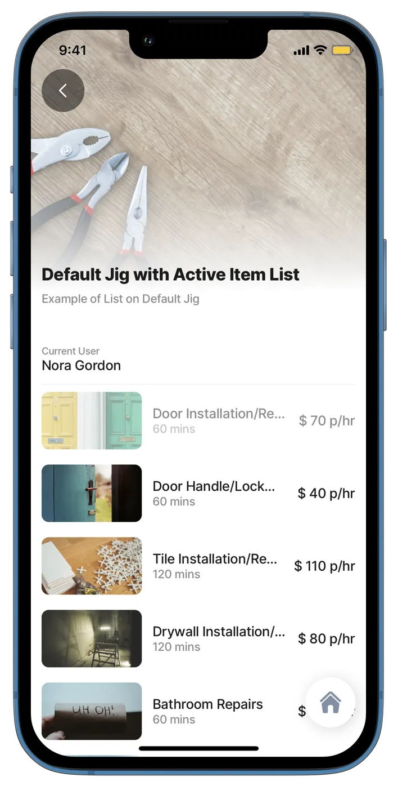<figcaption><p>List with active item</p></figcaption></figure>





```yaml
  children:
  - type: component.entity
    options:
      children:
        - type: component.entity-field
          options:
            label: Current User
            value: =@ctx.user.displayName
  - type: component.list
    options:
     # Data configured to use datasource (static)     
      data: =@ctx.datasources.repair-services-static
      hasActiveItem: true
      item: 
        type: component.list-item
        options:
          title: =@ctx.current.item.service
          subtitle: =@ctx.current.item.time & ' mins'
          leftElement: 
            element: image
            text: ''
            uri: =@ctx.current.item.image
          rightElement: 
            element: value
            text: ='$ ' & @ctx.current.item.hourlyRate & ' p/hr'
          onPress: 
            type: action.set-state
            options:
              state: =@ctx.solution.state.hasActiveItem
              value: true
```



```yaml
children:
  - type: component.entity
    options:
      children:
        - type: component.entity-field
          options:
            label: Current User
            value: =@ctx.user.displayName
  - type: component.list
    options:
      hasActiveItem: true
      # Data configured to use datasource (dynamic)       
      data: =@ctx.datasources.cleaning-services-dynamic
      item: 
        type: component.list-item
        options:
          title: =@ctx.current.item.service
          subtitle: =@ctx.current.item.time & ' mins'
          leftElement: 
            element: image
            text: ''
            uri: =@ctx.current.item.image
          rightElement: 
            element: value
            text: =(@ctx.current.item.hourlyrate) != 'NA' ? '$ ' & $string(@ctx.current.item.hourlyrate) & ' p/hr':'$ ' & $string(@ctx.current.item.onceoffrate) & ' once-off'
          onPress: 
            type: action.set-state
            options:
              state: =@ctx.solution.state.hasActiveItem
              value: true
```



```yaml
datasources:
  repair-services-static:
    type: datasource.static
    options:
      data:
        - id: 1
          description: Installation or repairs for doors. Doors to be provided by client
          hourlyRate: 70
          illustration: http://clipart-library.com/data_images/436224.png
          image: https://images.unsplash.com/photo-1500281781950-6cd80847ebcd?ixlib=rb-1.2.1&ixid=MnwxMjA3fDB8MHxwaG90by1wYWdlfHx8fGVufDB8fHx8&auto=format&fit=crop&w=1469&q=80
          materials: false
          service: Door Installation/Repair
          time: 60
        - id: 2
          description: Repairs to door handles 
          hourlyRate: 40
          illustration: http://clipart-library.com/img1/1332215.jpg
          image: https://images.unsplash.com/photo-1538766017398-415434a31a5b?ixlib=rb-1.2.1&ixid=MnwxMjA3fDB8MHxwaG90by1wYWdlfHx8fGVufDB8fHx8&auto=format&fit=crop&w=1470&q=80
          materials: true
          service: Door Handle/Lock Repairs
          time: 60        
        - id: 3
          description: Installation or repairs of tiled surfaces. Tiles have to be provided by client
          hourlyRate: 110
          illustration: http://clipart-library.com/images/kcKnbzbXi.jpg
          image: https://images.unsplash.com/photo-1523413184730-e85dbbd04aba?ixlib=rb-1.2.1&ixid=MnwxMjA3fDB8MHxwaG90by1wYWdlfHx8fGVufDB8fHx8&auto=format&fit=crop&w=687&q=80
          materials: false
          service: Tile Installation/Repair
          time: 120
        - id: 4
          description: Installation or repairs of dry-wall surfaces
          hourlyRate: 80
          illustration: http://clipart-library.com/img1/505759.jpg
          image: https://images.unsplash.com/photo-1628901551715-7234d14fb7a0?ixlib=rb-1.2.1&ixid=MnwxMjA3fDB8MHxwaG90by1wYWdlfHx8fGVufDB8fHx8&auto=format&fit=crop&w=1470&q=80
          materials: true
          service: Drywall Installation/Repair
          time: 120
        - id: 5
          description: Repairs to bathroom rails, toilets, etc
          hourlyRate: 90
          illustration: http://clipart-library.com/new_gallery/53-530190_black-and-white-toilet-png.png
          image: https://images.unsplash.com/photo-1585313647787-7a061b5a85a6?ixlib=rb-1.2.1&ixid=MnwxMjA3fDB8MHxwaG90by1wYWdlfHx8fGVufDB8fHx8&auto=format&fit=crop&w=1423&q=80
          materials: true
          service: Bathroom Repairs
          time: 60
        - id: 6
          description: Painting as required. Paint and tools not provided 
          hourlyRate: 70
          illustration: http://clipart-library.com/img/853166.jpg
          image: https://images.unsplash.com/photo-1562259949-e8e7689d7828?ixlib=rb-1.2.1&ixid=MnwxMjA3fDB8MHxwaG90by1wYWdlfHx8fGVufDB8fHx8&auto=format&fit=crop&w=1431&q=80
          materials: false
          service: Painting Services
          time: 120
        - id: 7
          description: Repairs to fences. Tools and items not included
          hourlyRate: 90
          illustration: http://clipart-library.com/img/18345.gif
          image: https://images.unsplash.com/photo-1583805978118-ba9a81ac1399?ixlib=rb-1.2.1&ixid=MnwxMjA3fDB8MHxwaG90by1wYWdlfHx8fGVufDB8fHx8&auto=format&fit=crop&w=1470&q=80
          materials: false
          service: Fence Installation/Repair
          time: 60
        - id: 8
          description: Removal of graffiti and painting. Paint and brushes not included in cost
          hourlyRate: 110
          illustration: http://clipart-library.com/images/6cy5aL5gi.jpg
          image: https://images.unsplash.com/photo-1581850518616-bcb8077a2336?ixlib=rb-1.2.1&ixid=MnwxMjA3fDB8MHxwaG90by1wYWdlfHx8fGVufDB8fHx8&auto=format&fit=crop&w=1470&q=80
          materials: false
          service: Removal of Graffiti
          time: 120
        - id: 9
          description: Repairs to cupboard doors
          hourlyRate: 60
          illustration: http://clipart-library.com/img1/1605140.jpg
          image: https://images.unsplash.com/photo-1522791465802-47616431a4cf?ixlib=rb-1.2.1&ixid=MnwxMjA3fDB8MHxwaG90by1wYWdlfHx8fGVufDB8fHx8&auto=format&fit=crop&w=1451&q=80
          materials: true
          service: Cupboard Door Repairs
          time: 60
        - id: 10
          description: Plumbing issues and repairs
          hourlyRate: 90
          illustration: http://clipart-library.com/images_k/plumbing-silhouette/plumbing-silhouette-6.png
          image: https://images.unsplash.com/photo-1591804774220-c1db3673d05b?ixlib=rb-1.2.1&ixid=MnwxMjA3fDB8MHxwaG90by1wYWdlfHx8fGVufDB8fHx8&auto=format&fit=crop&w=1074&q=80
          materials: true
          service: Plumbing
          time: 60
```



```yaml
datasources:
  cleaning-services-dynamic:
    type: datasource.sqlite
    options:
      provider: DATA_PROVIDER_DYNAMIC
      entities:
        - entity: default/cleaning-services
      query: |
        SELECT 
          id, 
          '$.id' as sqlid, 
          '$.area', 
          '$.description', 
          '$.hourlyrate', 
          '$.illustration', 
          '$.image', 
          '$.indoor', 
          '$.onceoffrate', 
          '$.service', 
          '$.pressed', 
          '$.time',
          '$.quantity'
        FROM [default/cleaning-services] 
        WHERE '$.hourlyrate' IS NOT NULL ORDER BY id DESC
```



## List with sections



<figure>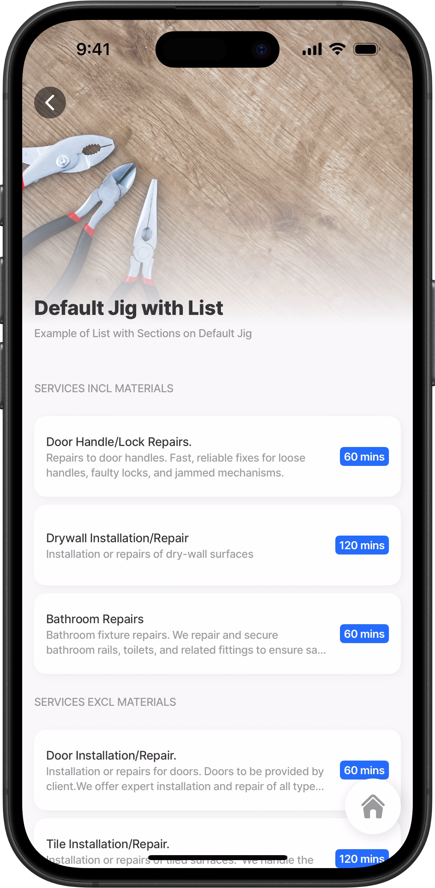<figcaption><p>List with sections</p></figcaption></figure>



This functionality allows you to divide your list into meaningful `sections`. In this example, there are two sectionsone including materials and the other excluding them. Each list-item is contained, with the `subtitle` wrapping over two lines. A `label` on the right displays the duration of the job in hours and minutes.

**Examples:**\
&#x20;See the full example using static data in [GitHub](https://github.com/jigx-com/jigx-samples/blob/main/quickstart/jigx-samples/jigs/jigx-components/list/static-data/default-w-section-list-sd.jigx). \
See the full example using dynamic data in [GitHub](https://github.com/jigx-com/jigx-samples/blob/main/quickstart/jigx-samples/jigs/jigx-components/list/dynamic-data/default-w-section-list-dd.jigx).

**Datasources:** \
See the full datasource for static data in [GitHub](https://github.com/jigx-com/jigx-samples/blob/main/quickstart/jigx-samples/datasources/services/repair-services-static.jigx).





```yaml
 children:
  - type: component.list
    options:
      sections:
      - title: Services incl Materials
        # Data configured to use datasource (static)   
        data: =@ctx.datasources.repair-services-static[materials=true]
      - title: Services excl Materials
        # Data configured to use datasource (static) 
        data: =@ctx.datasources.repair-services-static[materials=false]
      item:
        type: component.list-item
        options:
          # Configure each list-item to display in a container/card. 
          isContained: true
          title: =@ctx.current.item.service
          subtitle:
            # Define the number of lines the text can wrap over.
            text: =@ctx.current.item.description
            numberOfLines: 2
          label:
            title: =@ctx.current.item.time & ' mins'
```



```yaml
children:
  - type: component.entity
    options:
      children:
        - type: component.entity-field
          options:
            label: Current User
            value: =@ctx.user.displayName
  - type: component.list
    options:
      sections:
      - title: Indoor Services
        # Data configured to use datasource (dynamic)     
        data: =@ctx.datasources.cleaning-services-dynamic[indoor='TRUE']
      - title: Outdoor Services
        # Data configured to use datasource (dynamic)      
        data: =@ctx.datasources.cleaning-services-dynamic[indoor='FALSE']
      item: 
        type: component.list-item
        options:
          title: =@ctx.current.item.service
          subtitle: =@ctx.current.item.time & ' mins'
          leftElement: 
            element: image
            text: ''
            uri: =@ctx.current.item.image
          rightElement: 
            element: value
            text: =(@ctx.current.item.hourlyrate) != 'NA' ? '$ ' & @ctx.current.item.hourlyrate & ' p/hr':'$ ' & @ctx.current.item.onceoffrate & ' ' & 'once-off'
```



```yaml
type: datasource.static
options:
  data:
    - id: 1
      description: Installation or repairs for doors. Doors to be provided by client.We offer expert installation and repair of all types of doors, including interior, exterior, sliding, and security doors.
      hourlyRate: 70
      illustration: https://clipart-library.com/data_images/436224.png
      image: https://images.unsplash.com/photo-1500281781950-6cd80847ebcd?ixlib=rb-1.2.1&ixid=MnwxMjA3fDB8MHxwaG90by1wYWdlfHx8fGVufDB8fHx8&auto=format&fit=crop&w=1469&q=80
      materials: false
      service: Door Installation/Repair.
      time: 60
    - id: 2
      description: Repairs to door handles. Fast, reliable fixes for loose handles, faulty locks, and jammed mechanisms.
      hourlyRate: 40
      illustration: https://clipart-library.com/img1/1332215.jpg
      image: https://images.unsplash.com/photo-1538766017398-415434a31a5b?ixlib=rb-1.2.1&ixid=MnwxMjA3fDB8MHxwaG90by1wYWdlfHx8fGVufDB8fHx8&auto=format&fit=crop&w=1470&q=80
      materials: true
      service: Door Handle/Lock Repairs.
      time: 60
    - id: 3
      description: Installation or repairs of tiled surfaces.  We handle the installation and repair of all tiled surfaces. Clients are required to supply the tiles and tile adhesive.
      hourlyRate: 110
      illustration: https://clipart-library.com/images/kcKnbzbXi.jpg
      image: https://images.unsplash.com/photo-1523413184730-e85dbbd04aba?ixlib=rb-1.2.1&ixid=MnwxMjA3fDB8MHxwaG90by1wYWdlfHx8fGVufDB8fHx8&auto=format&fit=crop&w=687&q=80
      materials: false
      service: Tile Installation/Repair.
      time: 120
    - id: 4
      description: Installation or repairs of dry-wall surfaces
      hourlyRate: 80
      illustration: https://clipart-library.com/img1/505759.jpg
      image: https://images.unsplash.com/photo-1628901551715-7234d14fb7a0?ixlib=rb-1.2.1&ixid=MnwxMjA3fDB8MHxwaG90by1wYWdlfHx8fGVufDB8fHx8&auto=format&fit=crop&w=1470&q=80
      materials: true
      service: Drywall Installation/Repair
      time: 120
    - id: 5
      description: Bathroom fixture repairs. We repair and secure bathroom rails, toilets, and related fittings to ensure safety, and stability.
      hourlyRate: 90
      illustration: https://clipart-library.com/new_gallery/53-530190_black-and-white-toilet-png.png
      image: https://images.unsplash.com/photo-1585313647787-7a061b5a85a6?ixlib=rb-1.2.1&ixid=MnwxMjA3fDB8MHxwaG90by1wYWdlfHx8fGVufDB8fHx8&auto=format&fit=crop&w=1423&q=80
      materials: true
      service: Bathroom Repairs
      time: 60
    - id: 6
      description: Painting as required. Paint and tools not provided.
      hourlyRate: 70
      illustration: https://clipart-library.com/img/853166.jpg
      image: https://images.unsplash.com/photo-1562259949-e8e7689d7828?ixlib=rb-1.2.1&ixid=MnwxMjA3fDB8MHxwaG90by1wYWdlfHx8fGVufDB8fHx8&auto=format&fit=crop&w=1431&q=80
      materials: false
      service: Painting Services
      time: 120
    - id: 7
      description: Repairs to fences. Tools and items not included.
      hourlyRate: 90
      illustration: https://clipart-library.com/img/18345.gif
      image: https://images.unsplash.com/photo-1583805978118-ba9a81ac1399?ixlib=rb-1.2.1&ixid=MnwxMjA3fDB8MHxwaG90by1wYWdlfHx8fGVufDB8fHx8&auto=format&fit=crop&w=1470&q=80
      materials: false
      service: Fence Installation/Repair
      time: 60
    - id: 8
      description: Removal of graffiti and painting. Paint and brushes not included in cost.
      hourlyRate: 110
      illustration: https://clipart-library.com/images/6cy5aL5gi.jpg
      image: https://images.unsplash.com/photo-1581850518616-bcb8077a2336?ixlib=rb-1.2.1&ixid=MnwxMjA3fDB8MHxwaG90by1wYWdlfHx8fGVufDB8fHx8&auto=format&fit=crop&w=1470&q=80
      materials: false
      service: Removal of Graffiti
      time: 120
    - id: 9
      description: Repairs to cupboard doors.
      hourlyRate: 60
      illustration: https://clipart-library.com/img1/1605140.jpg
      image: https://images.unsplash.com/photo-1522791465802-47616431a4cf?ixlib=rb-1.2.1&ixid=MnwxMjA3fDB8MHxwaG90by1wYWdlfHx8fGVufDB8fHx8&auto=format&fit=crop&w=1451&q=80
      materials: true
      service: Cupboard Door Repairs
      time: 60
    - id: 10
      description: Plumbing issues and repairs. Ideal for addressing loose fixtures, leaks, or general wear and tear.
      hourlyRate: 90
      illustration: https://clipart-library.com/images_k/plumbing-silhouette/plumbing-silhouette-6.png
      image: https://images.unsplash.com/photo-1591804774220-c1db3673d05b?ixlib=rb-1.2.1&ixid=MnwxMjA3fDB8MHxwaG90by1wYWdlfHx8fGVufDB8fHx8&auto=format&fit=crop&w=1074&q=80
      materials: true
      service: Plumbing
      time: 60
```



```yaml
datasources:
  cleaning-services-dynamic:
    type: datasource.sqlite
    options:
      provider: DATA_PROVIDER_DYNAMIC
      entities:
        - entity: default/cleaning-services
      query: |
        SELECT 
          id, 
          '$.id' as sqlid, 
          '$.area', 
          '$.description', 
          '$.hourlyrate', 
          '$.illustration', 
          '$.image', 
          '$.indoor', 
          '$.onceoffrate', 
          '$.service', 
          '$.pressed', 
          '$.time',
          '$.quantity'
        FROM [default/cleaning-services] 
        WHERE '$.hourlyrate' IS NOT NULL ORDER BY id DESC
```



## List items contained in a card



This example use the `isContained` property set to `true` to style each item by wrapping it in a card. The code sample below is for a vertical list. You can also wrap list items in a card for a horizontal list.

**Examples:** \
See the full example in [GitHub](https://github.com/jigx-com/jigx-samples/blob/main/quickstart/jigx-samples/jigs/jig-types/jig-list/advanced-lists/static-data/list-item-contained.jigx).



<figure><figcaption><p>List-item contained in a card</p></figcaption></figure>





```yaml
title: List with items wrapped in a card
description: A list displaying images on list items styled in a card
type: jig.list
icon: task-list
# Change the list to a horizontal list by uncommenting the isHorizontal line
# below. isHorizontal: true.
header:
  type: component.jig-header
  options:
    height: medium
    children:
      type: component.image
      options:
        source:
          uri: https://images.unsplash.com/photo-1581244277943-fe4a9c777189?ixlib=rb-1.2.1&ixid=MnwxMjA3fDB8MHxwaG90by1wYWdlfHx8fGVufDB8fHx8&auto=format&fit=crop&w=1632&q=80

data: =@ctx.datasources.repair-services-static
item:
  type: component.list-item
  options:
    # Configure each list-item to display in a container/card.  
    isContained: true
    title: =@ctx.current.item.service
    subtitle: =@ctx.current.item.description
    leftElement:
      element: image
      text: =@ctx.current.item.service
      uri: =@ctx.current.item.image
```



## List-item with ratings as a value



This example uses the basic `rating` configuration to display a `value` with accompanying `text`. By default, the rating shows a single star in the primary color

**Examples:** \
See the full example in [GitHub](https://github.com/jigx-com/jigx-samples/blob/main/quickstart/jigx-samples/jigs/jigx-components/list-item/static-data/list-with-rating/list-item-rating-value.jigx).&#x20;



<figure>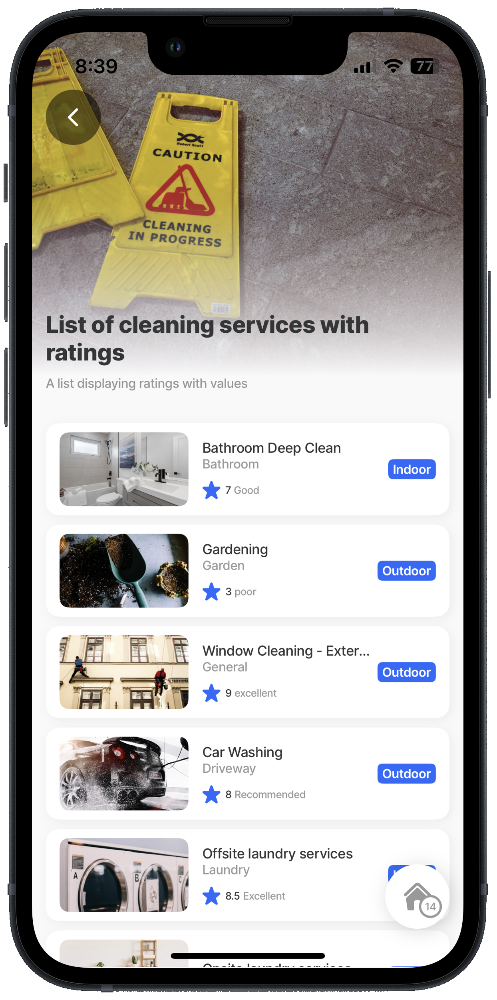<figcaption><p>List-item with rating - value</p></figcaption></figure>





```yaml
title: List of cleaning services with ratings
type: jig.default
description: A list displaying ratings with values
icon: notes-paper-approve

header:
  type: component.jig-header
  options:
    height: medium
    children:
      type: component.image
      options:
        source:
          uri: https://images.unsplash.com/photo-1529220502050-f15e570c634e?ixlib=rb-1.2.1&ixid=MnwxMjA3fDB8MHxwaG90by1wYWdlfHx8fGVufDB8fHx8&auto=format&fit=crop&w=1829&q=80
  
children:
  - type: component.list
    instanceId: rating-list
    options:
      data: =@ctx.datasources.cleaning-services-static
      item:
        type: component.list-item
        options:
          isContained: true
          title: =@ctx.current.item.service
          subtitle: =@ctx.current.item.area
          label:  
            title: =(@ctx.current.item.status = "indoor" ? 'Indoor' :'Outdoor')
          leftElement:
            element: image
            text: =$substring($substringBefore(@ctx.current.item.service, " "), 1, 1) &
              $substring($substringAfter(@ctx.current.item.service, " ") , 1, 1)
            uri: =@ctx.current.item.image
          # Rating uses a value from the datasource with accompanying text.
          # By default, a single rating-star icon in the primary color is shown.               
          rating: 
            value: =@ctx.current.item.rating
            text: =@ctx.current.item.ratingText
```



```yaml
datasources:
  cleaning-services-static:
    type: datasource.static
    options:
      data:
        - area: Bathroom
          category: withRate
          description: Steam cleaning and disinfecting of the bathroom in its totality.
            Provision of fresh towels.
          hourlyrate: 30
          illustration: https://clipart-library.com/newimages/bathroom-clip-art-15.jpg
          image: https://images.unsplash.com/photo-1646592472335-fa6be8e9bc7c?ixlib=rb-1.2.1&ixid=MnwxMjA3fDB8MHxwaG90by1wYWdlfHx8fGVufDB8fHx8&auto=format&fit=crop&w=1471&q=80
          onceoffrate: null
          service: Bathroom Deep Clean
          status: indoor
          time: 90
          ratingText: Good
          rating: 7
        - area: Garden
          category: null
          description: Taking care of general gardening to provide an immaculate first
            impression
          hourlyrate: null
          illustration: https://clipart-library.com/images/6Tr8BrjTK.jpg
          image: https://images.unsplash.com/photo-1416879595882-3373a0480b5b?ixlib=rb-1.2.1&ixid=MnwxMjA3fDB8MHxwaG90by1wYWdlfHx8fGVufDB8fHx8&auto=format&fit=crop&w=1470&q=80
          onceoffrate: 100
          service: Gardening
          status: outdoor
          time: 120
          ratingText: poor
          rating: 3
        - area: General
          category: null
          description: Cleaning and streak removal of external windows
          hourlyrate: 35
          illustration: https://clipart-library.com/img1/872145.png
          image: https://images.unsplash.com/photo-1650538250295-6ef68d7ae1f4?ixlib=rb-1.2.1&ixid=MnwxMjA3fDB8MHxwaG90by1wYWdlfHx8fGVufDB8fHx8&auto=format&fit=crop&w=1470&q=80
          onceoffrate: null
          service: Window Cleaning - External
          status: outdoor
          time: 60
          ratingText: excellent
          rating: 9
        - area: Driveway
          category: null
          description: Car wash including vacuum
          hourlyrate: null
          image: https://images.unsplash.com/photo-1520340356584-f9917d1eea6f?ixlib=rb-1.2.1&ixid=MnwxMjA3fDB8MHxwaG90by1wYWdlfHx8fGVufDB8fHx8&auto=format&fit=crop&w=1631&q=80
          onceoffrate: 50
          service: Car Washing
          status: outdoor
          time: 60
          ratingText: Recommended
          rating: 8
        - area: Laundry
          category: null
          description: Provision of laundry services by removal of laundry and return of
            laundry. Includes a surcharge for delivery.
          hourlyrate: null
          image: https://images.unsplash.com/photo-1637795065412-eed4c565db78?w=800&auto=format&fit=crop&q=60&ixlib=rb-4.0.3&ixid=M3wxMjA3fDB8MHxzZWFyY2h8MTl8fGxhdW5kcnklMjBzZXJ2aWNlfGVufDB8fDB8fHww
          onceoffrate: 110
          service: Offsite laundry services
          status: indoor
          time: 120
          ratingText: Excellent
          rating: 8.5
        - area: Laundry
          category: null
          description: Provision of laundry services making use of client's machines. Note
            that where this has been booked, but machines are not available,
            this will automatically be adjusted to offsite laundry services.
          hourlyrate: null
          image: https://images.unsplash.com/photo-1626806819282-2c1dc01a5e0c?w=800&auto=format&fit=crop&q=60&ixlib=rb-4.0.3&ixid=M3wxMjA3fDB8MHxzZWFyY2h8MTV8fGxhdW5kcnklMjByb29tfGVufDB8fDB8fHww
          onceoffrate: 110
          service: Onsite laundry services
          status: indoor
          time: 120
          ratingText: Not satisfied
        - area: Lounge
          category: null
          description: Maintain your upholstery (chair, couch and seat) in pristine
            condition. We use only the most delicate clearning methods.
          hourlyrate: 40
          image: https://images.unsplash.com/photo-1612696733290-a2a26ce8131c?ixlib=rb-1.2.1&ixid=MnwxMjA3fDB8MHxwaG90by1wYWdlfHx8fGVufDB8fHx8&auto=format&fit=crop&w=1470&q=80
          onceoffrate: null
          service: Upholstery Cleaning
          status: indoor
          time: 60
          ratingText: Poor
          rating: 5
        - area: Pool
          category: null
          description: Cleaning of pool, including chemical treatments, sweeping and
            proper flush.
          hourlyrate: null
          image: https://images.unsplash.com/photo-1562844275-857f6e7c429e?ixlib=rb-1.2.1&ixid=MnwxMjA3fDB8MHxwaG90by1wYWdlfHx8fGVufDB8fHx8&auto=format&fit=crop&w=1603&q=80
          onceoffrate: 40
          service: Pool Cleaning
          status: outdoor
          time: 45
          ratingText: Excellent service
          rating: 9
```



## List-item with ratings as a percentage



This example uses the simplest configuration of the rating property to display a `percentage`. By default the rating shows a star in the primary color.

**Examples:** \
See the full example in [GitHub](https://github.com/jigx-com/jigx-samples/blob/main/quickstart/jigx-samples/jigs/jigx-components/list-item/static-data/list-with-rating/list-item-rating-percentage.jigx).



<figure><figcaption><p>List-item with percentage rating</p></figcaption></figure>





```yaml
title: Manufacturing quality control
description: List with a percentage rating
type: jig.default

header:
  type: component.jig-header
  options:
    height: medium
    children:
      type: component.image
      options:
        source:
          uri: https://images.unsplash.com/photo-1700727448575-6f1680cd7d75?w=800&auto=format&fit=crop&q=60&ixlib=rb-4.0.3&ixid=M3wxMjA3fDB8MHxzZWFyY2h8Nnx8cXVhbGl0eSUyMGNvbnRyb2x8ZW58MHx8MHx8fDA%3D

children:
  - type: component.list
    options:
      data: =@ctx.datasources.control-stats
      maximumItemsToRender: 8
      item: 
        type: component.list-item
        options:
          isContained: true
          title: =@ctx.current.item.stat
          subtitle: =@ctx.current.item.description
          # Rating uses a percentage defined in the datasource.
          # By default, a single star icon in the primary color is shown.           
          rating: 
            percentage: =@ctx.current.item.percentage
          leftElement: 
            element: icon
            icon: =@ctx.current.item.icon
            isDuotone: true
```



```yaml
datasources:
  control-stats: 
    type: datasource.static
    options:
      data:
        - id: 1
          stat: Quality
          description: The performance and consistency of products in meeting established standards.
          percentage: 0.7
          percentage-text: y
          icon: air-quality-check-magnifying-glass
        - id: 2  
          stat: Inspection
          description: Measures the outcomes of product evaluations within the quality control process.
          percentage: 0.5
          icon: amazon-inspector
        - id: 3  
          stat: Rework
          description: Tracks the percentage of products that require additional processing or correction after initial inspection
          percentage: 0.2
          icon: hardware-hammer-nail-hit
        - id: 4  
          stat: Rejected
          description: Measures the percentage of products that fail to meet quality standards and cannot be reworked or sold.
          percentage: 0.1
          icon: cross-over
        - id: 5  
          stat: Approved
          description: The percentage of products that meet all quality standards and are cleared for distribution or sale.
          percentage: 0.9 
          icon: select   
```



## List-item with ratings with a percentage, minimum, maximum and icon



This example sets up a product review jig that displays:

* A `rating` as a percentage.
* An `icon` and `color` customized to represent the rating percentage visually.
* A styled list where each item is displayed within a card format, achieved by enabling the `isContained` property.
* A verified `label` placed on the right side of the item.
* A product image shown as an `avatar` on the left side.

**Examples:** \
See the full example in [GitHub](https://github.com/jigx-com/jigx-samples/blob/main/quickstart/jigx-samples/jigs/jigx-components/list-item/static-data/list-with-rating/list-item-rating-percentage-max.jigx).



<figure>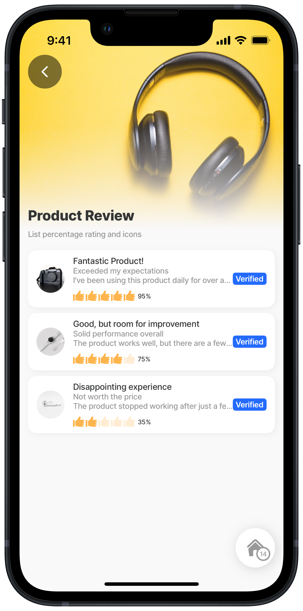<figcaption><p>List-item with customized percentage rating</p></figcaption></figure>





```yaml
title: Product Review
description: List with percentage rating and icons
type: jig.default

header:
  type: component.jig-header
  options:
    height: medium
    children:
      type: component.image
      options:
        source:
          uri: https://images.unsplash.com/photo-1505740420928-5e560c06d30e?w=800&auto=format&fit=crop&q=60&ixlib=rb-4.0.3&ixid=M3wxMjA3fDB8MHxzZWFyY2h8MTF8fHByb2R1Y3QlMjBleHBlcmllbmNlfGVufDB8fDB8fHww

children:
  - type: component.list
    options:
      data: =@ctx.datasources.product-review
      maximumItemsToRender: 8
      item: 
        type: component.list-item
        options:
          title: =@ctx.current.item.title
          subtitle: =@ctx.current.item.subtitle
          description: =@ctx.current.item.thirdLine
          isContained: true
          label:
            title: =@ctx.current.item.label
          leftElement:
            element: avatar
            text: ""
            uri: =@ctx.current.item.productImage
          # Rating uses a percentage from the datasource, the rating icon and 
          # color is customized. By configuring the maximum property sets the 
          # number of icons required. By configuring the current property colors
          # the number of icons specified in the maximum property with the value
          # to create the rating.              
          rating:
            percentage: =@ctx.current.item.rating
            ratingIcon:
              color: color7
              current: =@ctx.current.item.rating*5
              icon: thumb-up-like
              maximum: 5
```



```yaml
type: datasource.static
options:
  data:
    - avatars:
        - https://plus.unsplash.com/premium_photo-1658527049634-15142565537a?w=900&auto=format&fit=crop&q=60&ixlib=rb-4.0.3&ixid=M3wxMjA3fDB8MHxzZWFyY2h8MXx8YXZhdGFyfGVufDB8fDB8fHww
        - https://images.unsplash.com/photo-1500648767791-00dcc994a43e?w=900&auto=format&fit=crop&q=60&ixlib=rb-4.0.3&ixid=M3wxMjA3fDB8MHxzZWFyY2h8Mnx8YXZhdGFyfGVufDB8fDB8fHww
        - https://images.unsplash.com/photo-1535713875002-d1d0cf377fde?w=900&auto=format&fit=crop&q=60&ixlib=rb-4.0.3&ixid=M3wxMjA3fDB8MHxzZWFyY2h8M3x8YXZhdGFyfGVufDB8fDB8fHww
        - https://images.unsplash.com/photo-1494790108377-be9c29b29330?w=900&auto=format&fit=crop&q=60&ixlib=rb-4.0.3&ixid=M3wxMjA3fDB8MHxzZWFyY2h8NHx8YXZhdGFyfGVufDB8fDB8fHww
        - https://images.unsplash.com/photo-1438761681033-6461ffad8d80?w=900&auto=format&fit=crop&q=60&ixlib=rb-4.0.3&ixid=M3wxMjA3fDB8MHxzZWFyY2h8N3x8YXZhdGFyfGVufDB8fDB8fHww
      id: 1
      label: Verified
      productImage: https://images.unsplash.com/photo-1559912311-8421ee673ca5?w=700&auto=format&fit=crop&q=60&ixlib=rb-4.0.3&ixid=M3wxMjA3fDB8MHxzZWFyY2h8Nnx8cHJvZHVjdCUyMGltYWdlc3xlbnwwfHwwfHx8MA%3D%3D
      rating: 0.95
      ratingValue: 5
      ratingText: (529)
      subtitle: Exceeded my expectations
      tags:
        - high quality
        - durable
        - recommended
        - value for money
      thirdLine: I've been using this product daily for over a year, and it still
        works as well as the day I bought it. Highly recommend!
      title: Fantastic Product!
    - avatars:
        - https://plus.unsplash.com/premium_photo-1658527049634-15142565537a?w=900&auto=format&fit=crop&q=60&ixlib=rb-4.0.3&ixid=M3wxMjA3fDB8MHxzZWFyY2h8MXx8YXZhdGFyfGVufDB8fDB8fHww
        - https://images.unsplash.com/photo-1500648767791-00dcc994a43e?w=900&auto=format&fit=crop&q=60&ixlib=rb-4.0.3&ixid=M3wxMjA3fDB8MHxzZWFyY2h8Mnx8YXZhdGFyfGVufDB8fDB8fHww
        - https://images.unsplash.com/photo-1535713875002-d1d0cf377fde?w=900&auto=format&fit=crop&q=60&ixlib=rb-4.0.3&ixid=M3wxMjA3fDB8MHxzZWFyY2h8M3x8YXZhdGFyfGVufDB8fDB8fHww
      id: 2
      label: Verified
      productImage: https://images.unsplash.com/photo-1523275335684-37898b6baf30?w=900&auto=format&fit=crop&q=60&ixlib=rb-4.0.3&ixid=M3wxMjA3fDB8MHxzZWFyY2h8Mnx8cHJvZHVjdHxlbnwwfHwwfHx8MA%3D%3D
      rating: 0.75
      ratingValue: 4
      ratingText: (1999+)
      subtitle: Solid performance overall
      tags:
        - value for money
        - good support
        - recommended
      thirdLine: The product works well, but there are a few minor issues that could
        be improved. Customer support was helpful in resolving my concerns.
      title: Good, but room for improvement
    - avatars:
        - https://images.unsplash.com/photo-1438761681033-6461ffad8d80?w=900&auto=format&fit=crop&q=60&ixlib=rb-4.0.3&ixid=M3wxMjA3fDB8MHxzZWFyY2h8N3x8YXZhdGFyfGVufDB8fDB8fHww
      id: 3
      label: Verified
      productImage: https://images.unsplash.com/photo-1504274066651-8d31a536b11a?w=700&auto=format&fit=crop&q=60&ixlib=rb-4.0.3&ixid=M3wxMjA3fDB8MHxzZWFyY2h8NTR8fHByb2R1Y3QlMjBpbWFnZXN8ZW58MHx8MHx8fDA%3D
      rating: 0.35
      ratingValue: 2
      ratingText: (247)
      subtitle: Not worth the price
      tags:
        - not satisfied
        - poor quality
      thirdLine: The product stopped working after just a few weeks. The build quality
        feels cheap, and Im not happy with the overall experience.
      title: Disappointing experience
```



```yaml
type: datasource.static
options:
  data:
    - avatars: https://plus.unsplash.com/premium_photo-1658527049634-15142565537a?w=900&auto=format&fit=crop&q=60&ixlib=rb-4.0.3&ixid=M3wxMjA3fDB8MHxzZWFyY2h8MXx8YXZhdGFyfGVufDB8fDB8fHww
      id: 1
      product: 1
      text: AB
    - avatars: https://images.unsplash.com/photo-1500648767791-00dcc994a43e?w=900&auto=format&fit=crop&q=60&ixlib=rb-4.0.3&ixid=M3wxMjA3fDB8MHxzZWFyY2h8Mnx8YXZhdGFyfGVufDB8fDB8fHww
      id: 2
      product: 1
      text: CD
    - avatars: https://images.unsplash.com/photo-1535713875002-d1d0cf377fde?w=900&auto=format&fit=crop&q=60&ixlib=rb-4.0.3&ixid=M3wxMjA3fDB8MHxzZWFyY2h8M3x8YXZhdGFyfGVufDB8fDB8fHww
      id: 3
      product: 1
      text: EF
    - avatars: https://images.unsplash.com/photo-1494790108377-be9c29b29330?w=900&auto=format&fit=crop&q=60&ixlib=rb-4.0.3&ixid=M3wxMjA3fDB8MHxzZWFyY2h8NHx8YXZhdGFyfGVufDB8fDB8fHww
      id: 4
      product: 2
      text: GH
    - avatars: https://images.unsplash.com/photo-1438761681033-6461ffad8d80?w=900&auto=format&fit=crop&q=60&ixlib=rb-4.0.3&ixid=M3wxMjA3fDB8MHxzZWFyY2h8N3x8YXZhdGFyfGVufDB8fDB8fHww
      id: 5
      product: 2
      text: IJ
    - avatars: https://plus.unsplash.com/premium_photo-1658527049634-15142565537a?w=900&auto=format&fit=crop&q=60&ixlib=rb-4.0.3&ixid=M3wxMjA3fDB8MHxzZWFyY2h8MXx8YXZhdGFyfGVufDB8fDB8fHww
      id: 6
      product: 3
      text: KL
```



## List-item with multiple tags



This example creates a list with multiple `tags` shown on each list-item

* A styled list where each item is displayed within a card format, achieved by enabling the `isContained` property.
* The `tags` show the assigned team, priority, and status.
* A product image shown as an `avatar` on the left side.

**Examples:** \
See the full example in [GitHub](https://github.com/jigx-com/jigx-samples/blob/main/quickstart/jigx-samples/jigs/jigx-components/list-item/dynamic-data/list-with-tags/list-item-tags-multiple.jigx).&#x20;



<figure><figcaption><p>List-item with multiple tags</p></figcaption></figure>





```yaml
title: Team task list with multiple tags
description: List displaying multiple tags 
type: jig.default

header:
  type: component.jig-header
  options:
    children:
      options:
        source:
          uri: https://images.unsplash.com/photo-1590402494628-9b9acf0b90ae?q=80&w=2970&auto=format&fit=crop&ixlib=rb-4.0.3&ixid=M3wxMjA3fDB8MHxwaG90by1wYWdlfHx8fGVufDB8fHx8fA%3D%3D
      type: component.image
    height: medium
  
children:
  - type: component.list
    options:
      data: =@ctx.datasources.team-tasks
      maximumItemsToRender: 8
      item: 
        type: component.list-item
        options:
          isContained: true
          title: =@ctx.current.item.taskAssignee
          subtitle: =@ctx.current.item.taskName
          # Add multiple tags to the list-items.
          # Each tag can have its own color.
          # Tags are shown in the order they configured.           
          tags:
            - text: =@ctx.current.item.team
              color: primary
            - text: =@ctx.current.item.priority
              color: warning
            - text: =@ctx.current.item.taskStatus
              color: color2
          leftElement: 
            element: avatar
            text: =@ctx.current.item.taskAssignee
            uri: =@ctx.current.item.Profile
```



```yaml
datasources:
  team-tasks:
    type: datasource.sqlite
    options:
      provider: DATA_PROVIDER_DYNAMIC
      entities:
        - entity: default/tasks
      query: |
        SELECT 
          id, 
          '$.taskAssignee',
          '$.taskName',
          '$.taskCost',
          '$.taskId', 
          '$.taskStatus',
          '$.team', 
          '$.Profile',
          '$.priority'         
        FROM [default/tasks]
```



## List-item with ratings and tags



<figure><figcaption><p>List-item with rating, tags &#x26; badges</p></figcaption></figure>



This example show a list of cleaning services that displays:

* A `rating` as a `value`.
* An `icon` and `color` customized to represent the rating value visually.
* Multiple `tags` showing the hourly rate and cleaning area category.
* A styled list where each item is displayed within a card format, achieved by enabling the `isContained` property.
* A numbered `badge` in the `rightElement` of the item shows the number of services available.

**Examples:** \
See the full example in [GitHub](https://github.com/jigx-com/jigx-samples/blob/main/quickstart/jigx-samples/jigs/jigx-components/list-item/dynamic-data/list-with-tags/list-item-tags-rating.jigx).&#x20;





```yaml
title: Cleaning Services
description: List showing available Cleaning Services
type: jig.default

header:
  type: component.jig-header
  options:
    height: medium
    children:
      type: component.image
      options:
        source:
          uri: https://images.unsplash.com/photo-1628177142898-93e36e4e3a50?ixlib=rb-1.2.1&ixid=MnwxMjA3fDB8MHxwaG90by1wYWdlfHx8fGVufDB8fHx8&auto=format&fit=crop&w=2070&q=80

children:
  - type: component.list
    options:
      data: =@ctx.datasources.cleaning-services-dynamic
      maximumItemsToRender: 8
      item: 
        type: component.list-item
        options:  
          title: =@ctx.current.item.service
          subtitle: ='Duration of ' & @ctx.current.item.time & ' mins'
          horizontalItemSize: large
          # Wrap each list-item in a card.          
          isContained: true
          # Rating uses a value from the datasource, the rating icon and color
          # is customized. By configuring the maximum property sets the number 
          # of icons required. By configuring the current property colors the 
          # number of icons specified in the maximum property with the value to
          # create the rating.             
          rating: 
            ratingIcon:
              icon: thumb-up-like
              color: color7
            value: 
              current: =@ctx.current.item.rating
              maximum: 5 
          # Add multiple tags to the list-items.
          # Each tag can have its own color.
          # Tags are shown in the order they configured.                
          tags:
            - text: =('$' & @ctx.current.item.hourlyrate)
              color: color14
            - text: =@ctx.current.item.area
              color: color14
          leftElement: 
            element: image
            text: ''
            uri: =@ctx.current.item.image
          rightElement: 
           # The badge will display with the number of service, the count is
           # configured in the datasource.           
            element: badge
            value: =@ctx.current.item.quantity
```





```yaml
type: datasource.sqlite
options:
  provider: DATA_PROVIDER_DYNAMIC

  entities:
    - entity: default/cleaning-services

  query: |
    SELECT 
      id, 
      '$.id' as sqlid, 
      '$.area', 
      '$.description', 
      '$.hourlyrate', 
      '$.illustration', 
      '$.image', 
      '$.indoor', 
      '$.onceoffrate', 
      '$.service', 
      '$.pressed', 
      '$.time',
      '$.quantity',
      '$.rating'
    FROM [default/cleaning-services] 
    WHERE '$.hourlyrate' IS NOT NULL ORDER BY id DESC
```



## List-item outside a list



In this example, a single `list-item` is configured inside an `expander` component. The `list-item` uses a static `value` and is configured to use the `left` and `right` element as well as the `swipeable` event that opens an `info-modal`. **Note**, that the list-item is outside of a list component and uses a static value and does not rely on a datasource.



<figure>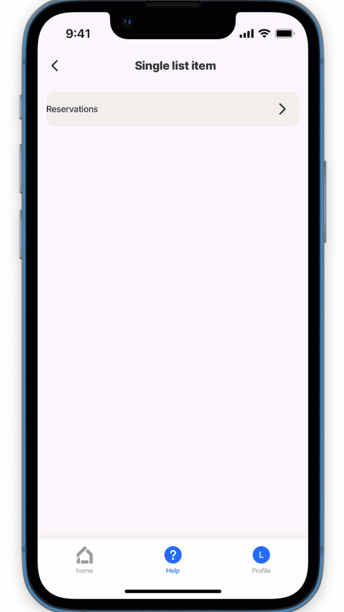<figcaption><p>List-item outside a list</p></figcaption></figure>




```yaml
title: Single list ite
type: jig.default

children:
 # Configure the expander component that will contain the single list-item
  - type: component.expander
    options:
      header:
        centerElement: 
          type: component.titles
          options:
            align: left
        leftElement:
          title: Reservations
          element: text
      divider: solid
      children:
        # Single list-item configured outside of the list.
        # The values are static and do not rely on a datasource.
        # Add a left and right element for the list-item.
        - type: component.list-item
          instanceId: list-item
          options:
            # Note: The list-item is outside of a list component
            # and uses a static value and does not rely on a datasource.
            # This means you do not need to use =@ctx.current.item.      
            title: Guests
            subtitle: Select the number of guests
            leftElement:
              element: checkbox
              value: "true"
            rightElement:
              element: amount-control
              initialValue: 5
            progress: 1
            swipeable:
              right:
                - label: Cost
                  icon: currency-dollar
                  color:  primary
                  onPress:
                    type: action.info-modal
                    options:
                      modal:
                        element: 
                          type: icon
                          icon: monetization-approve
                          color: warning
                        title: Cost per guest is $25
                        description: Bookings for groups of ten or more are charged at $20 per guest.
                        buttonText: rightBook
```


## List-item with multiple lines in right element



<figure><figcaption><p>List-item with multiple lines in right element</p></figcaption></figure>



This example demonstrates list-items configured to display data across multiple lines, with styling applied to the title, subtitle, and the left and right elements.

**Example:**

See the full example in GitHub





```yaml
data: =@ctx.datasources.employee-groups
item:
  type: component.list-item
  options:
    # Configure each list-item to display in a container/card.   
    isContained: true
    # Define a title and apply custom styling.
    title:
      text: =@ctx.current.item.title
      color: color1
      fontSize: regular
      isBold: true
      numberOfLines: 1
    # Define the color of the subtitle's text.
    subtitle:
      text: = 'Group id:'& ' ' & @ctx.current.item.groupId
      color: color4
    # Define a description, apply custom styling and wrap the text. 
    description:
      text: =@ctx.current.item.project
      isSubtle: true
      fontSize: small
      numberOfLines: 3
    # Configure and style the avatar to the left of the item.
    leftElement:
      element: avatar
      text: =@ctx.current.item.people.text
      uri: =@ctx.current.item.people.uri
      size: large
      color: color6
      onPress:
        type: action.go-to
        options:
          linkTo: custom-user-profile
    # Configure and style the text to the right of the item.
    # THe right element has text defined on three lines. 
    rightElement:
      element: text
      firstLine:
        text: 10 hours
        isBold: true
      secondLine:
        text: =@ctx.current.item.people.rate
        isSubtle: true
        color: color1
      thirdLine:
        text: 2 days left
        fontSize: medium
        color: negative
```



```yaml
datasources:
  employee-groups:
    type: datasource.static
    options:
      data:
        - id: 1
          title: Project Management
          groupId: 103
          people:
            - uri: https://images.unsplash.com/photo-1591084728795-1149f32d9866?ixlib=rb-1.2.1&ixid=MnwxMjA3fDB8MHxwaG90by1wYWdlfHx8fGVufDB8fHx8&auto=format&fit=crop&w=928&q=80
              text: Karl Fisher
            - rate: $46 per hour
          project: A cross-functional project to deliver an app for field task management.
        - id: 2
          title: Developers
          groupId: 101
          people:
            - uri: https://images.unsplash.com/photo-1548449112-96a38a643324?ixlib=rb-1.2.1&ixid=MnwxMjA3fDB8MHxwaG90by1wYWdlfHx8fGVufDB8fHx8&auto=format&fit=crop&w=774&q=80
              text: Harry Smith
            - rate: $50 per hour
          project: Build an application that uses a modular architecture to manage and display data.
        - id: 3
          title: UX Design
          groupId: 102
          people:
            - uri: https://images.unsplash.com/photo-1546961329-78bef0414d7c?ixlib=rb-1.2.1&ixid=MnwxMjA3fDB8MHxwaG90by1wYWdlfHx8fGVufDB8fHx8&auto=format&fit=crop&w=774&q=80
              text: July Nelson
            - rate: $40 per hour
          project: Design project focused on streamlining task management for field technicians.
```



```ruby
message = "hello world"
puts message
```



## See also

* [list](list.md)
* [jig.list](<../../Jig Types/jig_list.md>)
* [State](https://docs.jigx.com/building-apps-with-jigx/logic/state)
