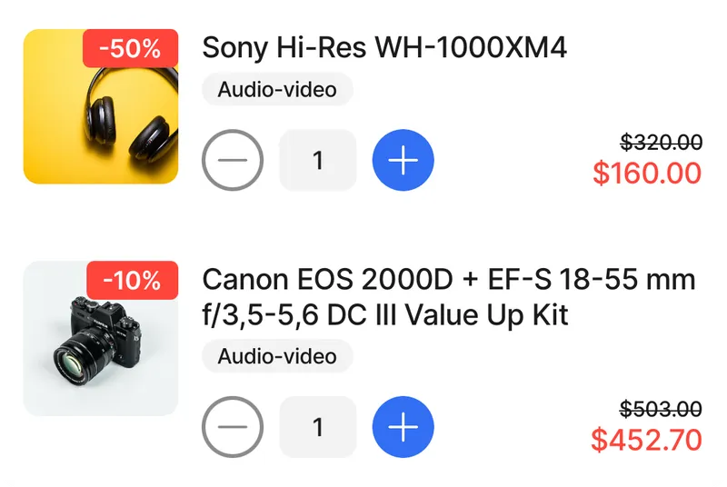
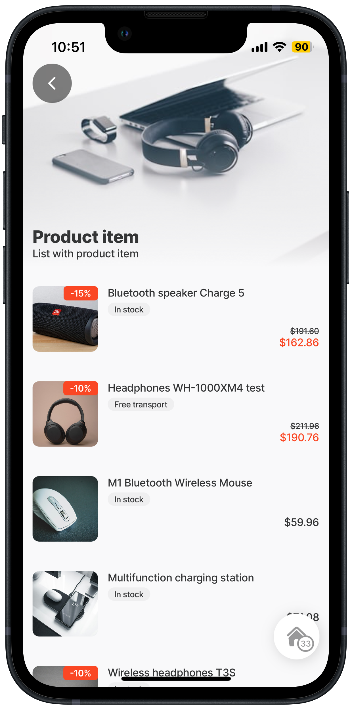
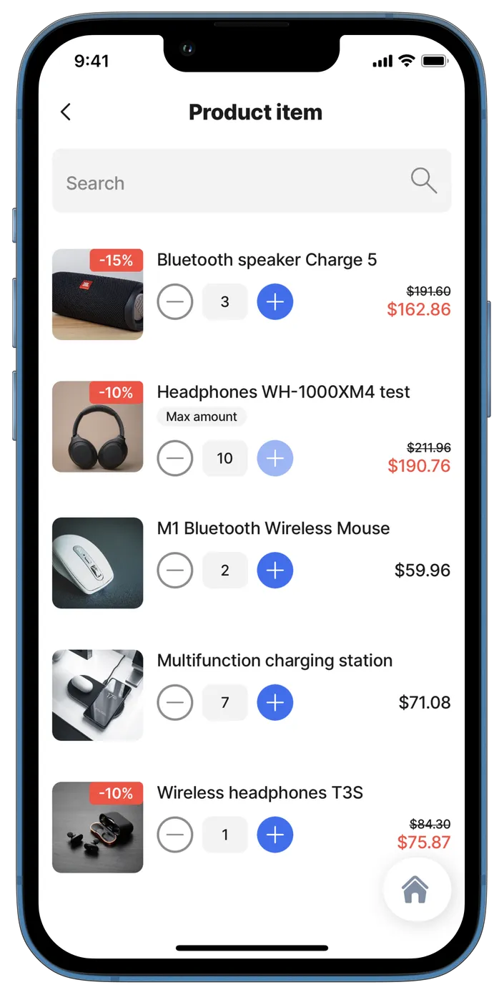
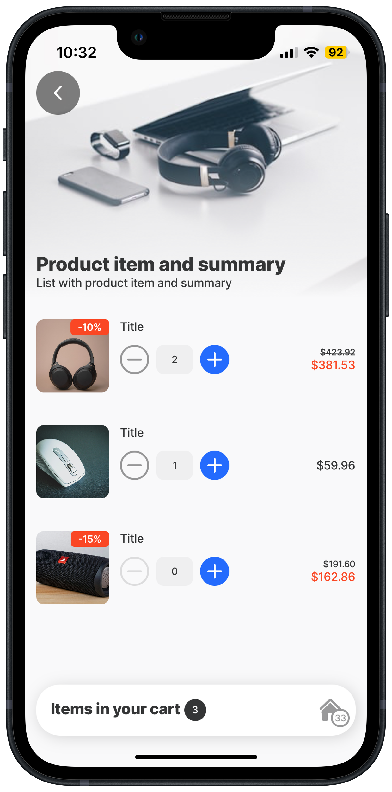
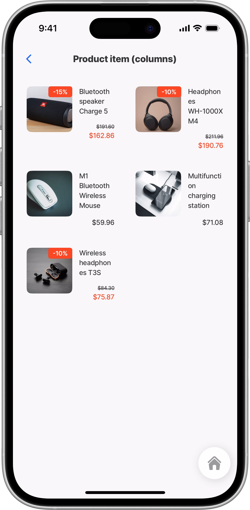
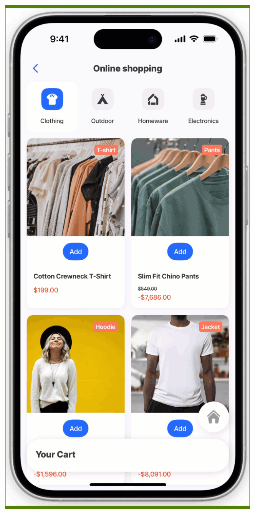
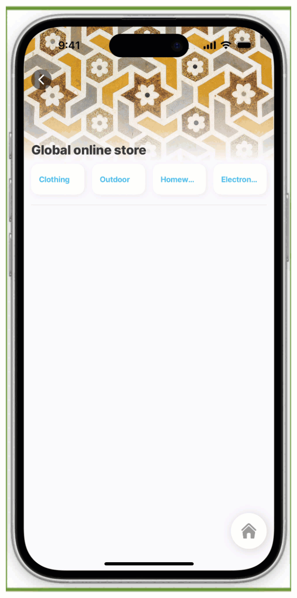

# product-item



The **product-item** component is a versatile display element designed to render rich product information within a [list component](list.md) or [list jig](<../../Jig Types/jig_list.md>). It offers enhanced visual flexibility, allowing you to choose between a standard `default` row view or a modern `card` mode to best suit your design needs. With added support for multi-column layouts, the product-item enables dynamic and responsive product grids, making it ideal for e-commerce catalogs, inventory lists, and digital menus.



<figure><figcaption><p>Product-item preview</p></figcaption></figure>



## Configuration options



<table><thead><tr><th width="205.8046875">Core structure</th><th></th></tr></thead><tbody><tr><td><code>title</code></td><td>Add a <code>title</code> for the product-item. You can use an expression and datasource to set the title.</td></tr><tr><td><code>type</code></td><td><p>The layout type of the product-item. Choose between the <code>default</code> list layout, or a <code>card</code>-based layout. The default type is set to the default layout.<br></p><ul><li><code>default</code> - The classic list row style. Best for dense lists where vertical space is at a premium.</li><li><code>card</code> - A boxed, card-style presentation with elevation. Best for emphasizing individual items, especially when used with column layouts.</li></ul></td></tr></tbody></table>

<table><thead><tr><th width="148.6796875">Other options</th><th></th></tr></thead><tbody><tr><td><code>amountControl</code></td><td><p>This property has several setup options:</p><ul><li><code>initialValue</code> - Initial value of amount control, for example, 1</li><li><code>minimum</code> - Limits the minimum number to be selected. Default is 0.</li><li><code>maximum</code> - Limits the maximum number to be selected.</li><li><code>onChange</code> - Configure the action that is triggered when value is changed.</li><li><code>OnDelete</code> - When this property is set, the trash symbol is displayed when the value is 1 or (min + 1).</li><li><code>step</code> - Step for increment/decrement, for example, increments in 2 or 5. Default is 1. </li><li><code>style</code> -  Enable or disable the amount control, useful if you have only one amount that can be ordered, disable the ability to increase or decrease the amount.</li></ul></td></tr><tr><td><code>description</code></td><td>A description for the product-item. You can wrap lines based on the <code>numberOfLines</code> property. Text that can be evaluated, translated, and formatted.</td></tr><tr><td><code>discount</code></td><td>This allows you to display the discount price including the currency. Set the discount in the range 0 - 1 (1 = 100%). Discount is set in float format e.g. 0.12.</td></tr><tr><td><code>image</code></td><td>The option to add an image of your product by providing the <code>uri</code></td></tr><tr><td><code>numberOfColumns</code></td><td>Sets the number of columns used to display items in a multi-column layout. This applies only to vertical lists; it is ignored when <code>isHorizontal</code> is <code>true</code>. This property is set under the <code>data</code> property.</td></tr><tr><td><code>price</code></td><td><p>This allows you to display the product's base price, including the currency, using the format properties. The default color hierarchy for pricing.</p><ul><li>Current price is rendered in red.</li><li>The discounted amount is rendered in black.</li></ul></td></tr><tr><td><code>style</code></td><td><code>isWaitingSync</code> - Displays a Waiting sync indicator.</td></tr><tr><td><code>subtitle</code></td><td><p>Second line of text. It is a single line that does not wrap. The</p><p>text can be evaluated, translated, and formatted.</p></td></tr><tr><td><code>tags</code></td><td><p>The option to add tags to your item. Add a tag or multiple tags, for example, the maximum amount. The tag can be configured with an expression to determine when it should be displayed. <br><code>tags:</code> </p><p>   <code>- text: =@ctx.current.state.amount =10 ? 'max amount':''</code><br>     <code>color: primary</code><br>   <code>- text: =@ctx.current.item.stock</code><br>     <code>color: warning</code></p></td></tr></tbody></table>

<table><thead><tr><th width="207.2421875">Actions</th><th></th></tr></thead><tbody><tr><td><code>onPress</code></td><td>The action is triggered while pressing on a product item in the list. Use IntelliSense (ctrl+space) to see the list of available actions.</td></tr></tbody></table>

<table><thead><tr><th width="208.36328125">State Configuration</th><th width="125.23828125">Key</th><th>Notes</th></tr></thead><tbody><tr><td><code>=@ctx.current.state.</code></td><td>amount</td><td>Applies to a list, list.item, product-item, and stage components. List's data is an array of records. The <code>=@ctx.current.state</code> is the state of the current object in the array.</td></tr><tr><td><code>=@ctx.component.state.</code></td><td>amount</td><td>State is the variable of the component.</td></tr><tr><td><code>=@ctx.solution.state.</code></td><td>activeItemId now</td><td>Global state variable that can be used throughout the solution.</td></tr></tbody></table>

## Considerations

* The recommended maximum number of columns is 3 on mobile devices and 5 on tablets in landscape for optimal readability and spacing.
* When using an image in the `leftElement` together with `numberOfColumns`, the image may expand to fill the entire column, causing the `title` or `subtitle` to be hidden.
  * For phones, use an avatar with the image to ensure proper rendering.
  * For tablets, using the image property is supported and renders correctly.
* Decimal formatting must now be handled in your data or expressions. Ensure values are formatted (e.g., 2 decimal places) to avoid alignment issues in the UI.

## Examples and code snippets

### Default product-item with tags



In this example, a list containing the `default` product-item component is shown. Each product contains a `title`, `tags`, `image`, and `price`. The `discount` property calculates the price after the discount.

**Examples:** See the full example using dynamic data in [GitHub](https://github.com/jigx-com/jigx-samples/blob/main/quickstart/jigx-samples/jigs/jigx-components/product-item/dynamic-data/product-item-tags-dynamic.jigx).



<figure><figcaption><p>Default product-item with tags</p></figcaption></figure>






```yaml
title: Product item list
type: jig.default

header:
  type: component.jig-header
  options:
    height: medium
    children:
      type: component.image
      options:
        source:
          uri: https://images.unsplash.com/photo-1498049794561-7780e7231661?ixlib=rb-1.2.1&ixid=MnwxMjA3fDB8MHxzZWFyY2h8OXx8dGVjaG5vbG9neSUyMHByb2R1Y3RzfGVufDB8fDB8fA%3D%3D&auto=format&fit=crop&w=500&q=60
        title: Product item
        subtitle: List with product item

children:
  - type: component.list
    options:
    # Data source binding - connects to the 'product' datasource.
      data: =@ctx.datasources.product
      item:
      # Uses the product-item component to display product information.
        type: component.product-item
        options:
        # Display style - 'default' shows a standard product list layout.
          type: default
          title: =@ctx.current.item.title
          image:
            uri: =@ctx.current.item.uri 
          discount: =@ctx.current.item.discount
          price:
            value: =@ctx.current.item.price
            format:
              numberStyle: currency
          tags: 
            - text: =@ctx.current.item.tag
              color: primary
```





```yaml
datasources:
  product:
    type: datasource.sqlite
    options:
      provider: DATA_PROVIDER_DYNAMIC
      entities:
        - default/products
      query: |
        SELECT 
          id, 
          '$.title', 
          '$.uri',
          '$.tag', 
          '$.price',
          '$.discount', 
          '$.quantity',
          '$.category',
          '$.productId'
        FROM [default/products]
        WHERE '$.category' = "product" ORDER BY '$.title'          
```




### Default product-item with onChange, amountControl & search



<figure><figcaption><p>Product-item</p></figcaption></figure>



In this example, a list containing the `default` product-item component is shown. Each product contains a `title`, `tags`, `image`, `amountControl`, and `price`. The added advantage is that you can search the list making it suitable for a larger number of products. The `discount` property calculates the price after the discount.

**Examples:** See the full example using dynamic data in [GitHub](https://github.com/jigx-com/jigx-samples/blob/main/quickstart/jigx-samples/jigs/jigx-components/product-item/dynamic-data/product-item-example/product-item-example-dynamic.jigx).

**Datasource:** See the full datasource for dynamic data in [GitHub](https://github.com/jigx-com/jigx-samples/blob/main/quickstart/jigx-samples/jigs/jigx-components/product-item/dynamic-data/product-item-example/product-item-example-dynamic.jigx).





<pre class="language-yaml" data-line-numbers><code class="lang-yaml"><strong>title: Product item list
</strong>type: jig.default

header:
  type: component.jig-header
  options:
    height: medium
    children:
      type: component.image
      options:
        source:
          uri: https://images.unsplash.com/photo-1498049794561-7780e7231661?ixlib=rb-1.2.1&#x26;ixid=MnwxMjA3fDB8MHxzZWFyY2h8OXx8dGVjaG5vbG9neSUyMHByb2R1Y3RzfGVufDB8fDB8fA%3D%3D&#x26;auto=format&#x26;fit=crop&#x26;w=500&#x26;q=60
        title: Product item
        subtitle: List with product item

children:
  - type: component.list
    options:
      data: =@ctx.datasources.product
      isSearchable: true
      item: 
        type: component.product-item
        options:
         # Display style - 'default' shows a standard product list layout
          type: default
          title: =@ctx.current.item.title
          image:
            uri: =@ctx.current.item.uri
          discount: =@ctx.current.item.discount
          price:
            value: 
              =@ctx.component.state.amount = 0 ? @ctx.current.item.price :(@ctx.component.state.amount * $number(@ctx.current.item.price))
            format:
              numberStyle: currency
          # Amount control configuration for quantity.  
          amountControl:
          # Sets initial quantity value from the datasource.
            initialValue: =$number(@ctx.current.item.quantity)
            # Maximum quantity that can be selected.
            maximum: 10
            # Action triggered when the amount changes.
            onChange:
              type: action.execute-entity
              options:
                provider: DATA_PROVIDER_DYNAMIC
                entity: default/products
                method: update
                data:
                  id: =@ctx.current.item.id
                  quantity: =@ctx.current.state.amount
          tags: 
            # Dynamic tag that appears when maximum quantity is reached.
            # Shows 'max amount' text when amount equals 10, otherwise empty.
            - text: =@ctx.current.state.amount =10 ? 'max amount':''
              color: primary             
</code></pre>




```yaml
datasources:
  product:
    type: datasource.sqlite
    options:
      provider: DATA_PROVIDER_DYNAMIC
      entities:
        - default/products
      query: |
        SELECT 
          id, 
          '$.title', 
          '$.uri',
          '$.tag', 
          '$.price',
          '$.discount', 
          '$.quantity',
          '$.category',
          '$.productId'
        FROM [default/products] WHERE '$.title' LIKE '%'||@search||'%' AND '$.category' = "product" OR @search IS NULL AND '$.category' = "product" ORDER BY '$.title'
      queryParameters:
        search: =@ctx.jig.state.searchText
```




### Default product-item with summary



In this example, a list containing the `default` product-item component is shown. Each product contains a `title`, `image`, and `price`. The `discount` property calculates the price after the discount. The `summary` component at the bottom shows the total of items selected in the `amountControl`.

**Examples:** See the full example in [GitHub](https://github.com/jigx-com/jigx-samples/blob/main/quickstart/jigx-samples/jigs/jigx-components/product-item/static-data/product-item-summary-static.jigx).



<figure><figcaption><p>Product-item with summary</p></figcaption></figure>






```yaml
title: Product item and summary
type: jig.default

header:
  type: component.jig-header
  options:
    height: medium
    children:
      type: component.image
      options:
        source:
          uri: https://images.unsplash.com/photo-1498049794561-7780e7231661?ixlib=rb-1.2.1&ixid=MnwxMjA3fDB8MHxzZWFyY2h8OXx8dGVjaG5vbG9neSUyMHByb2R1Y3RzfGVufDB8fDB8fA%3D%3D&auto=format&fit=crop&w=500&q=60
        title: Product item and summary
        subtitle: List with product item and summary

data: =@ctx.datasources.product-item1
item:
  type: component.product-item
  options:
    # Display style - 'default' shows a standard product list layout
    type: default
    title: =@ctx.current.item.title
    image:
      uri: =@ctx.current.item.uri
    discount: =@ctx.current.item.discount
    price:
      value: =@ctx.component.state.amount = 0 ? @ctx.current.item.price :$sum(@ctx.component.state.amount * @ctx.current.item.price)
      format:
        numberStyle: currency
    amountControl:
      maximum: 10
      initialValue: =@ctx.current.item.amount
# Summary component displaying cart information.    
summary:
  children:
   # Summary component for displaying aggregate cart data.
    type: component.summary
    options:
      # Layout style optimized for shopping cart display.
      layout: cart
      # Title text shown infront of the summary value.
      title: Items in your cart
      # Calculates and displays the total number of items in the cart.
      # Uses $sum() function to add up all amounts from the jig state.
      value: =$sum(@ctx.jig.state.amounts.amount)
```





```yaml
datasources:
  product-item1: 
    type: datasource.static
    options:
      data:
        - id: 1
          title: Title
          uri: https://images.unsplash.com/photo-1618366712010-f4ae9c647dcb?ixlib=rb-1.2.1&ixid=MnwxMjA3fDB8MHxwaG90by1wYWdlfHx8fGVufDB8fHx8&auto=format&fit=crop&w=776&q=80
          price: 211.96
          discount: 0.1
          amount: 2
        - id: 2
          title: Title
          uri: https://images.unsplash.com/photo-1611850698562-ae3d28934080?ixlib=rb-1.2.1&ixid=MnwxMjA3fDB8MHxwaG90by1wYWdlfHx8fGVufDB8fHx8&auto=format&fit=crop&w=1740&q=80
          price: 59.96
          discount:
          amount: 1
        - id: 3
          title: Title
          uri: https://images.unsplash.com/photo-1608043152269-423dbba4e7e1?ixlib=rb-1.2.1&ixid=MnwxMjA3fDB8MHxwaG90by1wYWdlfHx8fGVufDB8fHx8&auto=format&fit=crop&w=2062&q=80
          price: 191.6
          discount: 0.15
          amount: 0
```




### Default product-item in columns



<figure><figcaption></figcaption></figure>



In this example, a list containing the `default` product-item component is shown in a 2-column (`numberOfColumns`) layout. Each product contains a `title`, `tags`, `image`, and `price`.  The `discount` property calculates the price after the discount.






```yaml
title: Product item (columns)
type: jig.default

children:
  - type: component.list
    options:
      data: =@ctx.datasources.product
      # Display items in a 2-column layout.
      numberOfColumns: 2
      item:
        type: component.product-item
        options:
           # Display style - 'default' shows a standard product list layout
          type: default
          title: =@ctx.current.item.title
          image:
            uri: =@ctx.current.item.uri
          discount: =@ctx.current.item.discount
          price:
            value: =@ctx.current.item.price
            format:
              numberStyle: currency
          tags: 
            - text: =@ctx.current.state.amount =10 ? 'max amount':''
              color: primary   
```





```yaml
datasources:
  product:
    type: datasource.sqlite
    options:
      provider: DATA_PROVIDER_DYNAMIC
      entities:
        - default/products
      query: |
        SELECT 
          id, 
          '$.title', 
          '$.uri',
          '$.tag', 
          '$.price',
          '$.discount', 
          '$.quantity',
          '$.category',
          '$.productId'
        FROM [default/products] WHERE '$.title' LIKE '%'||@search||'%' AND '$.category' = "product" OR @search IS NULL AND '$.category' = "product" ORDER BY '$.title'
      queryParameters:
        search: =@ctx.jig.state.searchText
```




### Card product-item with tags



In this example, a list containing the `card`  product-item component is shown. Each product contains a `title`, `tags`, `image`, and `price`.  The `discount` property calculates the price after the discount.



<figure><figcaption><p>Product-item card layout with tags</p></figcaption></figure>





```yaml
title: Product item list
type: jig.default

header:
  type: component.jig-header
  options:
    height: medium
    children:
      type: component.image
      options:
        source:
          uri: https://images.unsplash.com/photo-1498049794561-7780e7231661?ixlib=rb-1.2.1&ixid=MnwxMjA3fDB8MHxzZWFyY2h8OXx8dGVjaG5vbG9neSUyMHByb2R1Y3RzfGVufDB8fDB8fA%3D%3D&auto=format&fit=crop&w=500&q=60
        title: Product item
        subtitle: List with product item

children:
  - type: component.list
    options:
      data: =@ctx.datasources.product
      maximumItemsToRender: 8 
      item:
        type: component.product-item
        options:
         # Display style - product items shown in a card layout
          type: card
          title: =@ctx.current.item.title
          image:
            uri: =@ctx.current.item.uri
          discount: =@ctx.current.item.discount
          price:
            value: =@ctx.current.item.price
            format:
              numberStyle: currency
          tags: 
            - text: =@ctx.current.item.tag
              color: primary
            - text: =@ctx.current.item.deal
              color: warning  
```



```yaml
datasources:
  product:
    type: datasource.sqlite
    options:
      provider: DATA_PROVIDER_DYNAMIC
      entities:
        - default/products
      query: |
        SELECT 
          id, 
          '$.title', 
          '$.uri',
          '$.tag', 
          '$.price',
          '$.discount', 
          '$.quantity',
          '$.category',
          '$.productId',
          '$.deal'
        FROM [default/products]
        WHERE '$.category' = "product" ORDER BY '$.title'
```



### Card product-item in columns with tags



<figure><figcaption><p>Product-item with tags in cards and columns</p></figcaption></figure>



In this example, a list containing the `card`  product-item component is shown in a 2-column (`numberOfColumns`) layout. Each product contains a `title`, `tag`, `image`, and `price`.  The `discount` property calculates the price after the discount.





```yaml
title: Product item list
type: jig.default

header:
  type: component.jig-header
  options:
    height: medium
    children:
      type: component.image
      options:
        source:
          uri: https://images.unsplash.com/photo-1498049794561-7780e7231661?ixlib=rb-1.2.1&ixid=MnwxMjA3fDB8MHxzZWFyY2h8OXx8dGVjaG5vbG9neSUyMHByb2R1Y3RzfGVufDB8fDB8fA%3D%3D&auto=format&fit=crop&w=500&q=60
        title: Product item
        subtitle: List with product item

children:
  - type: component.list
    options:
      data: =@ctx.datasources.product
      numberOfColumns: 2
      maximumItemsToRender: 8
      item:
        type: component.product-item
        options:
         # Display style - product items shown in a card layout.
          type: card
          title: =@ctx.current.item.title
          image:
            uri: =@ctx.current.item.uri
            resizeMode: cover
          discount: =@ctx.current.item.discount
          price:
            value: =@ctx.current.item.price
            format:
              numberStyle: currency

```



```yaml
datasources:
  product:
    type: datasource.sqlite
    options:
      provider: DATA_PROVIDER_DYNAMIC
      entities:
        - default/products
      query: |
        SELECT 
          id, 
          '$.title', 
          '$.uri',
          '$.tag', 
          '$.price',
          '$.discount', 
          '$.quantity',
          '$.category',
          '$.productId',
          '$.deal'
        FROM [default/products]
        WHERE '$.category' = "product" ORDER BY '$.title'
```



### Card product-item in columns with tags & summary



In this example, a list containing the `card`  product-item component is shown in a 2-column (`numberOfColumns`) layout. Each product contains a `title`, `tag`, `image`, and `price`.  The `discount` property calculates the price after the discount. An `amountControl` allows the selection of items and adds them to the cart (`summary`)  at the bottom of the screen.



<figure><figcaption><p>Product-items in cards, columns, <br>amount control and a summary</p></figcaption></figure>







```yaml
title: Product item and summary
type: jig.default

header:
  type: component.jig-header
  options:
    height: medium
    children:
      type: component.image
      options:
        source:
          uri: https://images.unsplash.com/photo-1498049794561-7780e7231661?ixlib=rb-1.2.1&ixid=MnwxMjA3fDB8MHxzZWFyY2h8OXx8dGVjaG5vbG9neSUyMHByb2R1Y3RzfGVufDB8fDB8fA%3D%3D&auto=format&fit=crop&w=500&q=60
        title: Product item and summary
        subtitle: List with product item, tags and summary

children:
  - type: component.list
    instanceId: cartId
    options:
      data: =@ctx.datasources.product
      numberOfColumns: 2
      maximumItemsToRender: 8
      item:
        type: component.product-item
        options:
          # Display style - product items shown in a card layout.
          type: card
          title: =@ctx.current.item.title
          image:
            uri: =@ctx.current.item.uri
            resizeMode: cover
          discount: =@ctx.current.item.discount
          price:
            value: =@ctx.current.item.price
            format:
              numberStyle: currency
          amountControl:
            initialValue: 0
          tags:
            - text: =@ctx.current.item.tag
              color: primary
            - text: =@ctx.current.item.deal
              color: warning
summary:
  children:
    type: component.summary
    options:
      layout: cart
      title: Your cart
      value: =$sum(@ctx.components.cartId.state.amounts.amount)

```



```yaml
datasources:
  product:
    type: datasource.sqlite
    options:
      provider: DATA_PROVIDER_DYNAMIC
      entities:
        - default/products
      query: |
        SELECT 
          id, 
          '$.title', 
          '$.uri',
          '$.tag', 
          '$.price',
          '$.discount', 
          '$.quantity',
          '$.category',
          '$.productId',
          '$.deal'
        FROM [default/products]
```



### Card product-item in columns in tabs



<figure><figcaption><p>Product-item in cards, columns in tabs</p></figcaption></figure>



In this example, a list containing the `card`  product-item component is shown in a 2-column (`numberOfColumns`) layout. The list is referenced in a `jig.tab` and uses `inputs` to display each category in each tab. Each product contains a `title`, `tag`, `image`, and `price`.  The `discount` property calculates the price after the discount. An `amountControl` allows the selection of items and adds them to the cart (`summary`)  at the bottom of the screen.





```yaml
type: jig.tabs
title: Online shopping
isSwipeable: true
areTabsScrollable: false
#Set the tab that is selected when the screen opens.
initialTabId: clothingId

children:
  # Tab 1 - Clothing category tab
  # Note: All tabs use the same jigId to share the same jig template
  # but with different instanceIds and inputs to display filtered data.
  - jigId: shopping-cart
   # Unique identifier for this specific tab instance.
    instanceId: clothingId
    tab:
      type: component.tab-button
      options:
        title: Clothing
        icon: t-shirt
    # Input parameters passed to the shopping-cart jig
    # These inputs filter the data displayed in the product-item list
    # to show only items matching this category
    inputs:
      category: clothing
  # Tab 2
  # Note all the tabs use the same jigId.
  - jigId: shopping-cart
    # Unique identifier for this specific tab instance.
    instanceId: outdoorId
    tab:
      type: component.tab-button
      options:
        title: Outdoor
        icon: camping-tent
    # Input parameters passed to the shopping-cart jig
    # These inputs filter the data displayed in the product-item list
    # to show only items matching this category
    inputs:
      category: outdoor
  # Tab 3
  # Note all the tabs use the same jigId.
  - jigId: shopping-cart
    # Unique identifier for this specific tab instance.
    instanceId: homewareId
    tab:
      type: component.tab-button
      options:
        title: Homeware
        icon: home-apps-logo
    # Input parameters passed to the shopping-cart jig.
    # These inputs filter the data displayed in the product-item list
    # to show only items matching this category.
    inputs:
      category: homeware
  - jigId: shopping-cart
    # Unique identifier for this specific tab instance.
    instanceId: electronicsId
    tab:
      type: component.tab-button
      options:
        title: Electronics
        icon: appliances-blender
    # Input parameters passed to the shopping-cart jig
    # These inputs filter the data displayed in the product-item list
    # to show only items matching this category
    inputs:
      category: electronics

```



```yaml
title: Online store
type: jig.default
# Define inputs to display the data filtered by category in each tab
inputs:
  category:
    type: string
    required: true
# Jig expression using list's state for amount to display in the cart summary.
expressions:
  cart-sum: =$sum(@ctx.components.prod.state.amounts.amount)

datasources:
  store-items:
    type: datasource.sqlite
    options:
      provider: DATA_PROVIDER_DYNAMIC
      entities:
        - default/marketplace
      query: |
        SELECT
        id,
        json_extract(data, '$.category') as category,
        json_extract(data, '$.image_uri') as image_uri,
        json_extract(data, '$.name') as name,
        json_extract(data, '$.price') as price,
        json_extract(data, '$.quantity') as quantity,
        json_extract(data, '$.tag') as tag,
        json_extract(data, '$.discount') as discount
        FROM [default/marketplace]
        WHERE category = @category
      # Configure the data query to return data per category according to the
      # input from the tabs jig.
      queryParameters:
        category: =@ctx.jig.inputs.category

children:
  - type: component.list
    instanceId: prod
    options:
      data: =@ctx.datasources.store-items
      numberOfColumns: 2
      item:
        type: component.product-item
        options:
        # Display style - product items shown in a card layout
          type: card
          title: =@ctx.current.item.name
          image:
            uri: =@ctx.current.item.image_uri
            # resize the image to fit in the card.
            resizeMode: cover
          discount: =@ctx.current.item.discount
          price:
            value: =@ctx.current.item.price
            format:
              numberStyle: currency
          tags:
            - text: =@ctx.current.item.tag
              color: color4
          amountControl:
            initialValue: 0
# Summary component displaying cart information.
summary:
  children:
    type: component.summary
    options:
      # Layout style optimized for shopping cart display.
      layout: cart
      # Title text shown in front of the summary value.
      title: Your Cart
      # Reference the jig expression to sum the items  selected.
      value: =$cart-sum
```



### Card product-item in columns with menu-item



In this example, a list uses the `menu-item` component to show categories in a store. The category state is set with an `onPress` event. The state is used in the second list's `when` property to display the corresponding category's  `card`  product-item component shown in a 2-column (`numberOfColumns`) layout. The list  uses `inputs` to display each category in each tab. Each product contains a `title`, `tag`, `image`, and `price`.  The `discount` property calculates the price after the discount. An `amountControl` allows the selection of items and adds them to the cart (`summary`)  at the bottom of the screen.



<figure><figcaption><p>Product-item with menu-item</p></figcaption></figure>





```yaml
title: Global online store
type: jig.default

header:
  type: component.jig-header
  options:
    height: small
    children:
      type: component.image
      options:
        source:
          uri: https://images.unsplash.com/photo-1506463108611-88834e9f6169?q=80&w=3270&auto=format&fit=crop&ixlib=rb-4.1.0&ixid=M3wxMjA3fDB8MHxwaG90by1wYWdlfHx8fGVufDB8fHx8fA%3D%3D
# Jig state management - stores the selected category.
state:
  category:
    # No category selected by default.
    initialValue: ""

onRefresh:
# Resets the jig state to clear selections.
  type: action.reset-jig-state
  options:
    changes:
      - category
 
children:
  - type: component.list
    options:
      data: =@ctx.datasources.categories
      # Displays categories in a 4-column layout.
      numberOfColumns: 4
      maximumItemsToRender: 8
      item:
        type: component.menu-item
        options:
          title:
            text: =@ctx.current.item.name
            fontSize: regular
            color: color9
            isBold: true
            transform: uppercase
          # Action when a category is tapped.  
          onPress:
            # Updates the jig state with the selected category.
            type: action.set-jig-state
            options:
              changes:
                category: =@ctx.current.item.name
  - type: component.divider
    # Product list displays filtered products based on selected category.
  - type: component.list
    # Only shows this list when a category has been selected.
    when: =$boolean(@ctx.jig.state.category)
    options:
      # Datasource loads products filtered by selected category.
      data: =@ctx.datasources.store-items
      # Displays products in a 2-column layout.
      numberOfColumns: 2
      item:
        type: component.product-item
        options:
          # Card-style display for products items.
          type: card
          title: =@ctx.current.item.name
          image:
            uri: =@ctx.current.item.image_uri
            resizeMode: cover
          discount: =@ctx.current.item.discount
          price:
            value: =@ctx.current.item.price
            format:
              numberStyle: currency
          tags:
            - text: =@ctx.current.item.tag
              color: primary

```



```yaml
datasources:
  store-items:
    type: datasource.sqlite
    options:
      provider: DATA_PROVIDER_DYNAMIC
      entities:
        - default/marketplace
      query: |
        SELECT
        id,
        '$.category',
        '$.image_uri',
        '$.name',
        '$.price',
        '$.quantity',
        '$.tag',
        '$.discount'
        FROM [default/marketplace]
        WHERE '$.category' = @categoryFilter
      queryParameters:
        categoryFilter: =$lowercase(@ctx.jig.state.category)
        
 categories:
    type: datasource.static
    options:
      data:
        - id: 1
          name: Clothing
        - id: 2
          name: Outdoor
        - id: 3
          name: Homeware
        - id: 4
          name: Electronics       
```



## See also

* [State](https://docs.jigx.com/building-apps-with-jigx/logic/state)
