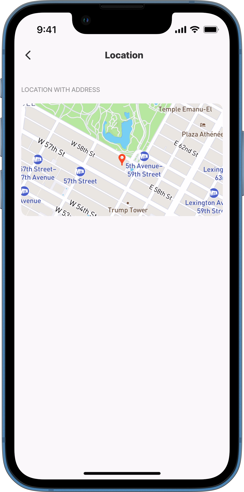
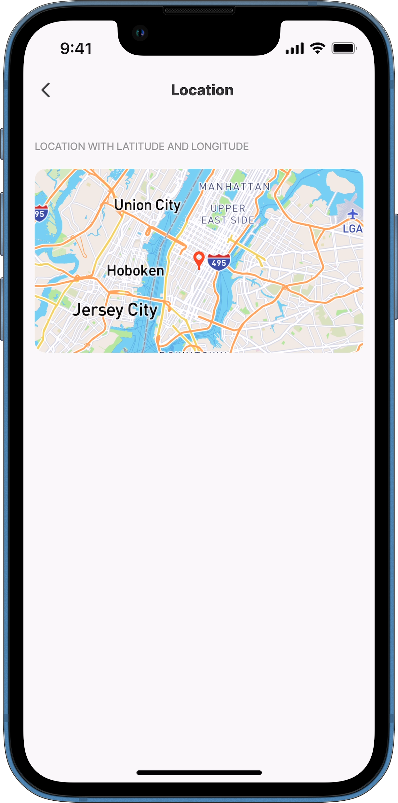
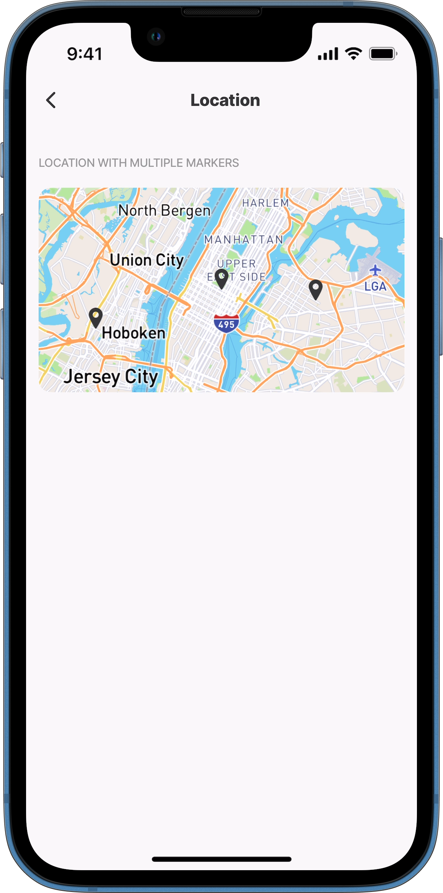
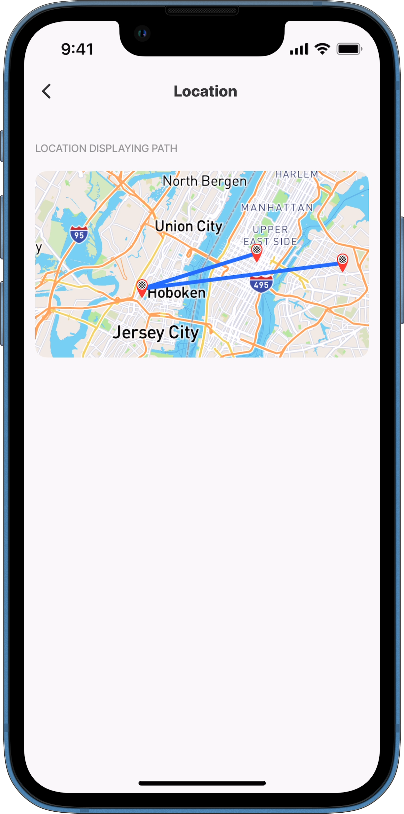
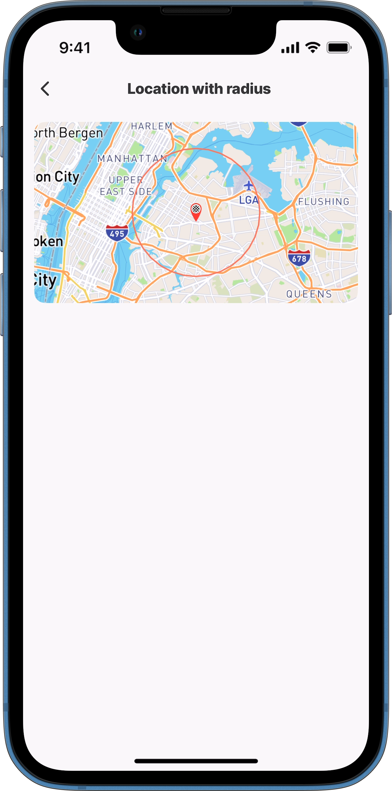
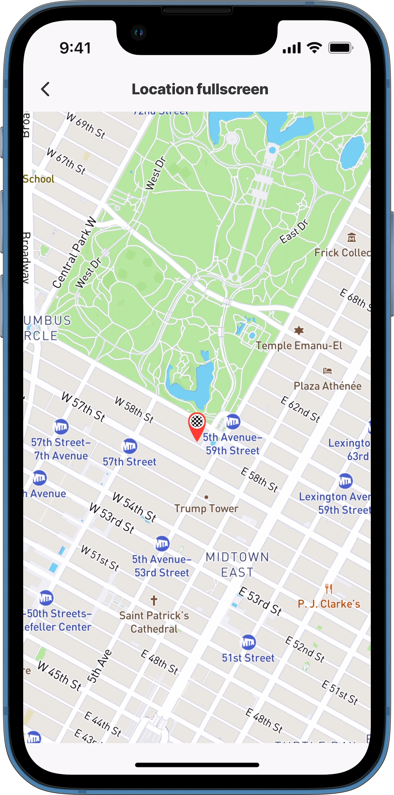
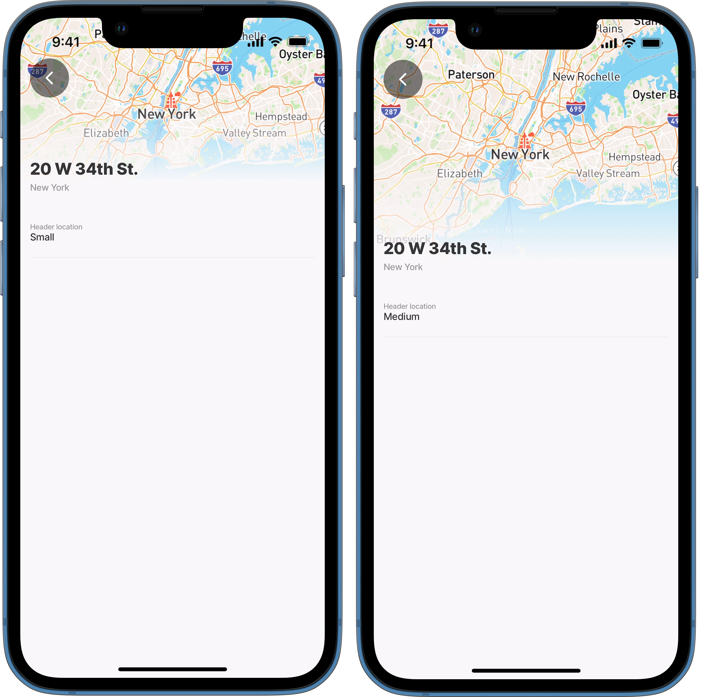

# location

The location component enables users to display a location on a map within a jig. It can be configured to appear in different formats, including the standard component layout, the jig header, or fullscreen mode. Additionally, display options can be set up to show the current location with markers or paths.

## Configuration options

Some properties are common to all components, see [Common component properties](location.md) for a list and their configuration options.

<table><thead><tr><th width="272.02734375">Options</th><th></th></tr></thead><tbody><tr><td><code>address</code></td><td><p>The actual address of the location. Valid formats are:</p><ul><li><strong>address string - city, street</strong>, e.g. <code>address: 20 W 34th St., New York, NY 10001, USA</code> or in an expression calling a datasource <code>=@ctx.datasources.address.street &#x26; ',' &#x26; @ctx.datasources.address.city &#x26; ',' &#x26; @ctx.datasources.address.country</code></li><li><strong>latitude and longitude</strong>, e.g. <code>address: 40.759412, -73.912306</code></li></ul></td></tr><tr><td><code>is AnimationDisabled</code></td><td><code>true</code> or <code>false</code> to determine if map animation is disabled.</td></tr><tr><td><code>isFollowUserLocationEnabled</code></td><td>When enabled, the <code>viewPoint</code> will be centred on the user’s real-time location.</td></tr><tr><td><code>markers</code></td><td>Multiple markers can be configured to display on the map. There is a 10K limit for markers showing on the map. See <em>multi-markers</em> code example below. You can use an expression to provide the latitude and longitude points from a datasource. See <em>multi-datasource</em> code example below.</td></tr><tr><td><code>marker-item</code></td><td><ul><li><code>anchorTo:</code> - Anchor the marker to a specific point, either <code>bottom-center</code> or <code>center</code>.</li><li><code>radius</code> - Display a circle around the marker. In the radius you can configure the <code>color</code>, <code>unit</code> (Default is kilometres).</li><li><code>icon</code> - Choose an icon for the markers. You can style the icon <code>color</code>, <code>emphasis</code>, <code>type</code>, <code>shape</code> and <code>size</code>.</li></ul></td></tr><tr><td><code>paths</code></td><td>Create one path from many points. The first point is the start destination, and the last is the end destination. There is a 10K limit for paths showing on the map. See <em>path-multi-points</em> code example below.</td></tr><tr><td><code>viewPoint</code></td><td>Controls the visible area of the map, defining what the user sees. It allows control over position, zoom and orientation. Options include: <code>centerPosition:</code> <code>middle</code> or <code>top</code></td></tr><tr><td><code>zoomLevel</code></td><td>Defines the initial zoom level of the map. Zooming in enlarges the view, revealing finer details, improving readability, and enhancing location precision.</td></tr></tbody></table>



```yaml
- type: component.location
    options:
      markers:
        data:
        - latitude: 40.759412
          longitude: -73.912306
        - latitude: 40.745368
          longitude: -74.057189
        - latitude: 40.76479429122513
          longitude: -73.97429291692742 
```



```yaml
markers:
   data: |
      =@ctx.datasources.jobs.{"lng": $number($.lng), "lat": $number($.lat)}
```





```yaml
 - type: component.location
    options:
      paths:
        data:
        - latitude: 40.759412
          longitude: -73.912306
        - latitude: 40.803495
          longitude: -73.950694
      address: =@ctx.datasources.location[0].address
```



<table><thead><tr><th width="176.33203125">Action</th><th></th></tr></thead><tbody><tr><td><a href="../Actions/open-map.md">open-map</a></td><td>The <code>action.open-map</code> lets you open your device's default map app (e.g., Google Maps, Apple Maps, or Waze) with the provided destination address. If multiple map apps are available, they will be listed for you to select one.</td></tr><tr><td><a href="../Actions/open-app-settings.md">open-app-settings</a></td><td>The <code>action.open-app-settings</code> can be configured to show when location tracking permission is not granted. Tapping the action opens the device’s settings screen.</td></tr></tbody></table>

<table><thead><tr><th width="213.9453125">State Configuration</th><th width="105.05859375">Key</th><th>Notes</th></tr></thead><tbody><tr><td><code>=@ctx.component.state.</code></td><td>location</td><td>State is the variable of the component.</td></tr></tbody></table>

<table><thead><tr><th width="240.703125">System variable Configuration</th><th width="203.80859375">Key</th><th>Notes</th></tr></thead><tbody><tr><td><code>=@ctx.system.geolocation.</code></td><td>coords timestamp</td><td>See example.</td></tr></tbody></table>

### Considerations

* Test the layout of the location component when combining it with other components, as it can cause spacing issues.
* To display a location as a full screen, use the [jig.fullscreen](<../Jig Types/jig_fullscreen.md>) type with the `component.location`. See the [Fullscreen location](https://docs.jigx.com/examples/location#autxL) example down below.

## Examples and code snippets

### Location using address



<figure><figcaption><p>Location from address</p></figcaption></figure>



An interactive map displaying the location using the address.

**Examples**: \
See the example using static data on [GitHub](https://github.com/jigx-com/jigx-samples/blob/main/quickstart/jigx-samples/jigs/jigx-components/location/static-data/location-with-address.jigx). \
See the example using dynamic data on [GitHub](https://github.com/jigx-com/jigx-samples/blob/main/quickstart/jigx-samples/jigs/jigx-components/location/dynamic-data/location-with-address-dynamic.jigx).

**Datasource**: \
See the full datasource for static data on [GitHub](https://github.com/jigx-com/jigx-samples/blob/main/quickstart/jigx-samples/jigs/jigx-components/location/static-data/location-with-address.jigx). \
See the full datasource for dynamic data in [GitHub](https://github.com/jigx-com/jigx-samples/blob/main/quickstart/jigx-samples/datasources/adhoc-components/location.jigx).





```yaml
- type: component.location
      options:
        viewPoint:
          centerPosition: middle 
          address: 768 5th Ave, New York, US
          zoomLevel: 14 
        # Add a pin to the exact address.  
        markers:
          data: =@ctx.datasources.address
          item:
            type: component.marker-item
            options:
              address: =@ctx.datasources.address.street
              children:
                type: component.icon
                options:
                  color: negative
                  icon: pin-1-map
```



```yaml
- type: component.location
      options:
        viewPoint:
          centerPosition: middle 
          address: =@ctx.datasources.location.address-us
          zoomLevel: 14 
        # Add a pin to the exact address.  
        markers:
          data: =@ctx.datasources.location.address-us
          item:
            type: component.marker-item
            options:
              address: =@ctx.datasources.location.address-us
              children:
                type: component.icon
                options:
                  color: negative
                  icon: pin-1-map
```



```yaml
datasources:
  location:
    type: datasource.sqlite
    options:
      provider: DATA_PROVIDER_DYNAMIC
      entities:
        - entity: default/location
      query: |
        SELECT
          '$.id',
          '$.address',
          '$.address-us',
          '$.category',  
          '$.lat',
          '$.lng'
        FROM [default/location] 
        WHERE '$.category' = "location"
```



```yaml
datasources:
  address: 
    type: datasource.static
    options:
      data:
        - street: 768 5th Ave
          city: New York
          country: US
```



### Location using latitude and longitude



<figure><figcaption><p>Address - Latitude &#x26; Longitude</p></figcaption></figure>



In this example a location is shown using the `latitude` and `longitude` coordinates in the address property.





```yaml
children:
    - type: component.location
          options:
            viewPoint:
              # Center the address in the middle of the screen.
              centerPosition: middle
              # Specify the address using latitude and longitude.
              latitude: =@ctx.datasources.appointments[0].latitude
              longitude: =@ctx.datasources.appointments[0].longitude
            # Add endpoint marker icon for the address.  
            markers:
              data: =@ctx.datasources.appointments[0]
              item:
                type: component.marker-item
                options:
                  latitude: =@ctx.current.item.latitude
                  longitude: =@ctx.current.item.longitude
                  children:
                    type: component.icon
                    options:
                      color: negative
                      icon: pin-1-map      
```



```yaml
datasources:
  appointments:
    type: datasource.static
    options:
      data:
        - id: 1
          name: Empire State Building
          latitude: 40.748676182418976
          longitude: -73.98567513213604
          address: 20 W 34th St., New York, NY 10001, United States
          icon: home
        - id: 2
          name: Great Lawn Softball Field 6
          latitude: 40.782091612607864 
          longitude: -73.9655512166898
          address: 86th St Transverse, New York, NY 10024, United States
          icon: stadium-1-building 
```



### Location with multiple markers



<figure><figcaption><p>Multiple markers</p></figcaption></figure>



An interactive map displaying multiple points.

**Examples**: \
See the example using static data in [GitHub](https://github.com/jigx-com/jigx-samples/blob/main/quickstart/jigx-samples/jigs/jigx-components/location/static-data/location-multiple-markers.jigx).

**Datasources**: \
See the full datasource for static data in [GitHub](https://github.com/jigx-com/jigx-samples/blob/main/quickstart/jigx-samples/jigs/jigx-components/location/static-data/location-multiple-markers.jigx).





```yaml
children:
  - type: component.location
    options:
      viewPoint:
        address: |
          =@ctx.datasources.address.street 
          & ',' & @ctx.datasources.address.city
          & ',' & @ctx.datasources.address.country
      # Use a datasource to define the multiple markers.    
      markers:
        data: =@ctx.datasources.points
```



```yaml
datasources:
 # First datasource with address.
  address: 
    type: datasource.static
    options:
      data:
        - id: 1
          street: 768 5th Ave
          city: New York
          country: US
  # Second datasource for points in latitude and longitude.
  points:
    type: datasource.static
    options:
      data:
        - latitude: 40.759412
          longitude: -73.912306
        - latitude: 40.745368
          longitude: -74.057189
        - latitude: 40.76479429122513
          longitude: -73.97429291692742    
```



### Location displaying paths



<figure><figcaption><p>Location paths</p></figcaption></figure>



An interactive map displaying a path with three points, a starting point, middle and end point, with a marker-item at each point.

**Examples**: \
See the example using static data in [GitHub](https://github.com/jigx-com/jigx-samples/blob/main/quickstart/jigx-samples/jigs/jigx-components/location/static-data/location-path.jigx).

**Datasources**: \
See the full datasource for static data in [GitHub](https://github.com/jigx-com/jigx-samples/blob/main/quickstart/jigx-samples/jigs/jigx-components/location/static-data/location-path.jigx).





```yaml
- type: component.location
          options:
            viewPoint:
              # Starting address specified.
              centerPosition: middle
              latitude: 40.759412
              longitude: -73.912306
              isAnimationEnabled: false
              zoomLevel: 9
            # Add icon markers for the addresses.
            markers:
              data: =@ctx.datasources.points
              item:
                type: component.marker-item
                options:
                  latitude: =@ctx.current.item.latitude
                  longitude: =@ctx.current.item.longitude
                  children:
                    type: component.icon
                    options: 
                      icon: end-marker  
            # Paths defined in a datasource in latitude and longitude.                 
            paths:
              data: =@ctx.datasources.points            
```



```yaml
children:
   - type: component.location
          options:
            markers:
              data: =@ctx.datasources.points
              item:
                type: component.marker-item
                options:
                  latitude: =@ctx.current.item.latitude
                  longitude: =@ctx.current.item.longitude
                  children:
                    type: component.icon
                    options: 
                      icon: end-marker        
            paths:
              data: =@ctx.datasources.points 
            viewPoint:
              centerPosition: middle
              latitude: 40.759412
              longitude: -73.912306
              isAnimationEnabled: true
              zoomLevel: 9
```



```yaml
datasources:
   coordinates:
      type: datasource.static
      options:
        data:
          - id: 1
            latitude: 40.769702
            longitude: -74.038241
          - id: 2
            latitude: 40.759412
            longitude: -73.912306
          - id: 3
            latitude: 40.803495
            longitude: -73.950694
```



### Location radius



This example demonstrates how to add a circular `radius` around the specified location. Determine whether it is in `kilometers` or `miles` and set its size (`value`). Then, select the `color` of the radius.

**Examples:** See the full code example in GitHub.



<figure><figcaption><p>Location with a radius</p></figcaption></figure>





```yaml
title: Location with radius
type: jig.default

children:
  - type: component.location
    options:
      viewPoint:
        # Starting address specified.
        centerPosition: middle
        latitude: 40.759412
        longitude: -73.912306 
        address: =@ctx.datasources.points
      # Add the marker point that the radius will use as the center point.  
      markers:
        data: =@ctx.datasources.points
        item:
          type: component.marker-item
          options:
            latitude: =@ctx.current.item.latitude
            longitude: =@ctx.current.item.longitude
            # Specify the radius units, size (value) and color.
            radius:
              isEnabled: true
              # The value determines the radius circle, e.g. 4km.
              value: 4
              unit: kilometers
              color: color4
            children:
              type: component.icon
              options:
                icon: end-marker      
```



```yaml
datasources:
  points:
    type: datasource.static
    options:
      data:
        - latitude: 40.759412
          longitude: -73.912306
```



### Location full screen



&#x20;In this example the `component.location` is used in the `jig.fullscreen` ensuring the map covers the entire jig.

**Examples**: See the example using dynamic data in [GitHub](https://github.com/jigx-com/jigx-samples/blob/main/quickstart/jigx-samples/jigs/jigx-components/location/dynamic-data/location-fullscreen-dynamic.jigx).

**Datasource**: See the full datasource for dynamic data in [GitHub](https://github.com/jigx-com/jigx-samples/blob/main/quickstart/jigx-samples/datasources/adhoc-components/location.jigx).


Using the code below requires data in the database, the _jigx.sample_ solution has the data provided for location. You can use the location.csv file in [GitHub](https://github.com/jigx-com/jigx-samples/blob/main/quickstart/csv/location.csv) and upload it via the [Data](https://docs.jigx.com/pWWt-data) configuration in Jigx Management.&#x20;




<figure><figcaption><p>Fullscreen location</p></figcaption></figure>





```yaml
title: Location fullscreen
type: jig.full-screen

component: 
  type: component.location
  options:
    viewPoint:
      # Center the address in the middle of the screen.
      centerPosition: middle
      # Specify the address using latitude and longitude.
      address: =@ctx.datasources.address[0].street
      # Zoom in to enlarge the view, reveal finer details, improving readability, 
      # and enhance location precision.
      zoomLevel: 14
    # Add endpoint marker icon for the address.   
    markers:
      data: =@ctx.datasources.address[0].street
      item:
        type: component.marker-item
        options:
          address: =@ctx.datasources.address[0].street
          children:
            type: component.icon
            options:
              # Determine the size of the marker icon.
              size: large
              icon: end-marker
```



```yaml
datasources:
  address: 
    type: datasource.static
    options:
      data:
        - id: 1
          street: 768 5th Ave
          city: New York
          country: US
        - id: 2
          street: 137 W 111th St
          city: New York
          country: US  
```



### Location as a header



<figure><figcaption><p>Location in header</p></figcaption></figure>



The location component can be used as a `small` or `medium` size header in a jig. In the screenshot the difference between the set heights is shown.

**Examples:** See the code samples using static data in GitHub for [small](https://github.com/jigx-com/jigx-samples/blob/main/quickstart/jigx-samples/jigs/jigx-components/jig-header/static-data/jig-header-location/jig-header-location-small.jigx) and [medium](https://github.com/jigx-com/jigx-samples/blob/main/quickstart/jigx-samples/jigs/jigx-components/jig-header/static-data/jig-header-location/jig-header-location-medium.jigx) headers.&#x20;





```yaml
header: 
  type: component.jig-header
  options:
    height: small
    children:
      type: component.location
      options:
        viewPoint:
          # Center the address in the middle of the screen.
          centerPosition: middle
          # Sepcify the address using a datasource.
          address: =@ctx.datasources.sites[0].address
          # Zoom in for map clearly.
          zoomLevel: 8
        # Add endpoint marker icon for the address.  
        markers:
          data: =@ctx.datasources.sites[0].address
          item:
            type: component.marker-item
            options:
              address: =@ctx.datasources.sites[0].address
              children:
                type: component.icon
                options:
                  # Determine the color of the marker icon.
                  color: negative
                  # Define the icon in the datasource.
                  icon: =@ctx.datasources.sites[0].icon
```



```yaml
header: 
  type: component.jig-header
  options:
    height: medium
    children:
      type: component.location
      options:
        viewPoint:
          # Center the address in the middle of the screen.
          centerPosition: middle
          # Sepcify the address using a datasource.
          address: =@ctx.datasources.sites[0].address
          # Zoom in for map clearly.
          zoomLevel: 8
        # Add endpoint marker icon for the address.  
        markers:
          data: =@ctx.datasources.sites[0].address
          item:
            type: component.marker-item
            options:
              address: =@ctx.datasources.sites[0].address
              children:
                type: component.icon
                options:
                  # Determine the color of the marker icon.
                  color: negative
                  # Define the icon in the datasource.
                  icon: =@ctx.datasources.sites[0].icon
```



```yaml
datasources:
  sites:
    type: datasource.static
    options:
      data:
        - id: 1
          name: Empire State Building
          latitude: 40.748676182418976
          longitude: -73.98567513213604
          address: 20 W 34th St., New York, NY 10001, United States
          icon: landmark-empire-state
        - id: 2
          name: Great Lawn Softball Field 6
          latitude: 40.782091612607864 
          longitude: -73.9655512166898
          address: 86th St Transverse, New York, NY 10024, United States
          icon: stadium-1-building 
```



### See also

* [State](https://docs.jigx.com/state)
