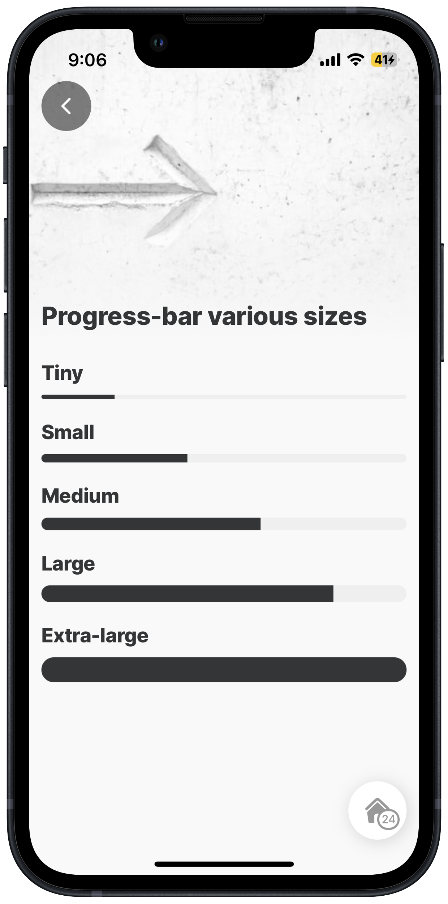

# progress-bar



&#x20;Use the progress-bar component to visually represent a task or process's current status and progression by indicating how much time or work remains until completion.&#x20;



<figure><figcaption><p>Progress-bar</p></figcaption></figure>



### Configuration options

Some properties are common to all components, see [Common component properties](progress-bar.md) for a list and their configuration options.

<table><thead><tr><th width="161.765625">Core structure</th><th></th></tr></thead><tbody><tr><td><code>value</code></td><td><code>current</code> - determines the current status to be shown in the bar. This can be dynamically set with an expression, e.g. <code>=$count(@ctx.components.packList.state.selected)</code> <code>max</code> - numeric, set the maximum value of the progress bar, e.g., the sales target is 5 new customers a month, making the <code>max: 5</code> . You can set the maximum dynamically, e.g., using the datasource <code>=$count(@ctx.datasources.checkbox-list)</code></td></tr></tbody></table>

<table><thead><tr><th width="160.203125">Other options</th><th></th></tr></thead><tbody><tr><td><code>color</code></td><td>Sets the color of the progress -bar, choose a color from the provided color palette. Default color is black if the property is not specified in the YAML.</td></tr><tr><td><code>errorText</code></td><td>Add text, string, or expressions to show in text under the progress bar. Text is shown in red to indicate an error with progress.</td></tr><tr><td><code>helperText</code></td><td>Add text, string, or expressions to guide users by showing text under the progress bar, e.g, Monthly target is $4000.</td></tr><tr><td><code>size</code></td><td>Choose from <code>extra-large</code>, <code>large</code>, <code>medium</code>, <code>small</code>, <code>tiny</code>, with <code>large</code> being the default if property is not specified in the YAML.</td></tr><tr><td><code>steps</code></td><td>Numeric with a maximum of 20. Use steps to divide up the bar. By default, the bar is continuous. For example, <code>steps:5</code> will break down the bar into five equal sections. The higher the number of steps the smaller each bar segment becomes.</td></tr><tr><td><code>style</code></td><td><code>isDisabled</code> can be set to <code>true</code> or <code>false</code>. If <code>true</code> the progress-bar is disabled.</td></tr><tr><td><code>subtitle</code></td><td><ul><li><code>- value</code> - can add text, string or an expression to show as the subtitle, which is visible under the progress-bar.</li><li><code>align</code> - <code>center</code>, <code>left</code>, and <code>right</code> alignment with the default as <code>center</code> if the property is not specified in the YAML.</li><li><code>color</code> - specify the color the subtitle text by choosing a color from the provided color palette.</li><li><code>position</code> - place the subtitle at the <code>bottom</code> or <code>top</code>. The <code>top</code> is the default if the property is not specified in the YAML.</li></ul></td></tr><tr><td><code>title</code></td><td><ul><li><code>value</code> - can add text, string or an expression to show as the title, which is visible under the progress-bar.</li><li><code>align</code> - <code>center</code>, <code>left</code> and <code>right</code> alignment with the default as <code>center</code> if the property is not specified in the YAML.</li><li><code>color</code> - specify the color for the title text by choosing a color from the provided color palette.</li><li><code>position</code> - place the title at the <code>bottom</code> or <code>top</code> of the progress-bar. The <code>top</code> is the default if the property is not specified in the YAML.</li></ul></td></tr></tbody></table>

<table><thead><tr><th width="154.18359375">Actions</th><th></th></tr></thead><tbody><tr><td><code>onPress</code></td><td>Choose from the provided list of available actions, for example, use the <code>go-to</code> action to open a different jig. The action is triggered when the progress-bar is pressed; e.g., navigate to another jig.</td></tr></tbody></table>

### Considerations

* The title, subtitle, and bar can use a `color` property. Ensure the property is added at the correct YAML level for each.
* The `component.progress-bar` can only be used on a `jig.default`.

### Examples and code snippets

#### Progress bar with title and subtitle



<figure><figcaption><p>Title &#x26; Subtitle configurations</p></figcaption></figure>



This example shows the different ways the `title` and `subtitle` can be configured using `position`, `color` and `alignment`.

**Example:** See the full example in [GitHub](https://github.com/jigx-com/jigx-samples/tree/main/quickstart/jigx-samples/jigs/jigx-components/progress-bar).




```yaml
      # with title, and subtitle.
      - type: component.progress-bar
        options:
          subtitle:
            value: 5 new customers
            position: top
          title:
            value: Your monthly goal
          value:
            current: 2
            max: 5
          color: color1
          size: extra-large
      # with title and alignment.
      - type: component.progress-bar
        options:
          title:
            value: Monthly goal is 5
            align: right
            color: color4
          value:
            current: 3
            max: 5 
          color: color2
          size: large
    
      # with title, subtitle, alignment, and color.
      - type: component.progress-bar
        options:
          subtitle:
            value: Your goal is 5 new customers
            position: bottom
            align: right
            color: color10
          title:
            value: Goal
            color: color11
          value:
            current: 4
            max: 5  
          color: color3
          size: medium
      # with subtitle with bottom position.
      - type: component.progress-bar
        options:
          subtitle:
            value: Your goal is 5 new customers
            position: bottom
            align: right
            color: color13  
          title:
            value: Your monthly goal
            color: color10
          value:
            current: 7
            max: 10
          size: tiny
```


#### Progress bar with error and helper text



You can use the `helperText` property to provide a tip or hint to help users read the progress-bar. Use the `errorText` to show an error or negative text at the bottom of the progress-bar. In this example, the `errorText` is used to show that there has been no progress made.

**Example:** See the full example in [GitHub](https://github.com/jigx-com/jigx-samples/blob/main/quickstart/jigx-samples/jigs/jigx-components/progress-bar/progress-error-helper.jigx).&#x20;



<figure><figcaption><p>Error and Helper text</p></figcaption></figure>




```yaml
children:
  - type: component.section
    options:
      title: Helpertext
      children:
        - type: component.progress-bar
          options:
            title:
              value: Your goal
            subtitle:
              value: 2 of 3 new customers
              color: color5
            helperText: Hint - Your monthly goal is 3 new customers  
            value:
              current: 2
              max: 3  
            color: positive
  - type: component.section
    options:
      title: Errortext 
      children:
        - type: component.progress-bar
          options:
            title:
              value: Your goal
            subtitle:
              value: 1 of 3 new customers
            helperText: Your monthly goal is 3 new customers 
            errorText: Progress too slow
            value:
              current: 1
              max: 5         
            color: color14
```


#### Progress bar with colors



<figure><figcaption><p>Progress bar colors</p></figcaption></figure>



In this example we change the `color` of the bar, break the bar up by using `steps` and change the thickness of the bar using the `size` property.

**Example:** See the full example in [GitHub](https://github.com/jigx-com/jigx-samples/blob/main/quickstart/jigx-samples/jigs/jigx-components/progress-bar/progress-bar-color.jigx).&#x20;




```yaml
children:
  - type: component.section
    options:
      title: Color
      children:
        - type: component.progress-bar
          options:
            color: color2
            value:
              current: 3
              max: 7  
  
  - type: component.section
    options:
      title: Color and steps
      children:
        - type: component.progress-bar
          options:
            value:
              current: 5
              max: 10
            steps: 3
            color: color1
  
  - type: component.section
    options:
      title: Color,steps and size
      children:
        - type: component.progress-bar
          options:
            value:
              current: 5
              max: 10
            steps: 5
            color: color3
            size: small
```


#### Progress bar size



The progress-bar can be sized from a thin (`tiny`) to extra thick (`extra-large`) bar using the `size` property. No color is used in this example so the default color black is used.

**Example:** See the full example in [GitHub](https://github.com/jigx-com/jigx-samples/blob/main/quickstart/jigx-samples/jigs/jigx-components/progress-bar/progress-bar-size.jigx).



<figure><figcaption><p>Progess-bar sizes</p></figcaption></figure>




```yaml
children:                
  - type: component.progress-bar
    options:
      title:
        value: Tiny
      size: tiny
      value:
        current: 1
        max: 5 

  - type: component.progress-bar
    options:
      title:
        value: Small
      size: small
      value:
        current: 2
        max: 5                 

  - type: component.progress-bar
    options:
      title:
        value: Medium
      size: medium
      value:
        current: 3
        max: 5         

  - type: component.progress-bar
    options:
      title:
        value: Large
      size: large
      value:
        current: 4
        max: 5       
 
  - type: component.progress-bar
    options:
      title:
        value: Extra-large
      size: extra-large
      value:
        current: 5
        max: 5       
```


#### Progress bar with steps



<figure><figcaption><p>Progress-bar with various steps</p></figcaption></figure>



The progress-bar can be shown as a continuous bar or broken up into segments. Use the `step` property to determine the number of segments required. The larger the number of steps, the smaller the segments as shown in the bars on the left.

**Example:** See the full example in [GitHub](https://github.com/jigx-com/jigx-samples/blob/main/quickstart/jigx-samples/jigs/jigx-components/progress-bar/progress-bar-steps.jigx).




```yaml
children:
  - type: component.section
    options:
      title: " "
      children:
    # with no steps - continuous
      - type: component.progress-bar
        options: 
          title:
            value: no steps - continuous
          value:
            current: 1
            max: 5
 
  - type: component.section
    options:
      title: " "
      children:
      # with steps 5
      - type: component.progress-bar
        options:
          steps: 5
          color: color11
          title:
            value: 5 Steps, title and color
          value:
            current: 4
            max: 5  

  - type: component.section
    options:
      title: " "
      children:
      # with steps 20
      - type: component.progress-bar
        options:
          steps: 20
          color: color12
          title:
            value: 20 Steps 
          value:
            current: 10
            max: 20    
```


### Progress bar with onPress



In this example the `onPress` property uses the `action.set-state` set to `true`. When the progress-bar is pressed the state is evaluated in the `when` property of the `component.image`, which then shows the image.

**Example:** See the full example in [GitHub](https://github.com/jigx-com/jigx-samples/blob/main/quickstart/jigx-samples/jigs/jigx-components/progress-bar/progress-bar-onpress.jigx).&#x20;



<figure><figcaption><p>Progress-bar onPress</p></figcaption></figure>




```yaml
children:                
        - type: component.progress-bar
          options:
            title:
              value: Congrats!
            subtitle:
              value: Press to continue
            size: extra-large
            onPress: 
              type: action.set-state
              options:
                state: =@ctx.solution.state.activeItemId
                value: true
            value:
              current: 5
              max: 5 
            color: positive
        - type: component.image
          when: =@ctx.solution.state.activeItemId = true
          options:
              source:
                uri: https://images.unsplash.com/photo-1576610981602-438b2860eb77?ixlib=rb-4.0.3&ixid=M3wxMjA3fDB8MHxzZWFyY2h8NHx8Y29uZ3JhdHN8ZW58MHx8MHx8fDA%3D&auto=format&fit=crop&w=500&q=60
              resizeMode: cover
              
onRefresh: 
  type: action.reset-state
  options:
    state: =@ctx.solution.state.activeItemId
```


#### Dynamic Progress bar



<figure><figcaption><p>Dynamic progress-bar</p></figcaption></figure>





This example shows how the `component.progress-bar` steps are dynamically updated when the list-item checkbox is selected. The `errorText` property and the `helperText` property are dynamically changed using an expression.

**Example:** See the full example in [GitHub](https://github.com/jigx-com/jigx-samples/blob/main/quickstart/jigx-samples/jigs/jigx-components/progress-bar/progress-bar-dynamic.jigx).&#x20;




```yaml
title: Safari
description: This jig shows how the progress-bar dynamically updates when the list-items are checked. The error- and helperText update dynamically according to the progress made.
type: jig.default

header:
  type: component.jig-header
  options:
    height: small
    children:
      type: component.image
      options:
        source:
          uri: https://images.unsplash.com/photo-1534476478164-b15fec4f091c?ixlib=rb-4.0.3&ixid=M3wxMjA3fDB8MHxzZWFyY2h8MTl8fHNhZmFyaXxlbnwwfHwwfHx8MA%3D%3D&auto=format&fit=crop&w=500&q=60

datasources:             
  checkbox-list:
    type: datasource.static
    options:
      data:
        - id: 1
          title: Binoculars
          icon: binocular
        - id: 2
          title: Shoes for safari hike/walk
          icon: footwear-boots
        - id: 3
          title: Mosquito repellent
          icon: flying-insect-fly
        - id: 4
          title: Swimwear
          icon: swimming-goggles
        - id: 5
          title: Hat
          icon: hat
        - id: 6
          title: Sunscreen 
          icon: sunbathe 
     
children:
  - type: component.progress-bar
    options:
      value:
        current: =$count(@ctx.components.packList.state.selected)
        max: =$count(@ctx.datasources.checkbox-list)
      steps: =$count(@ctx.datasources.checkbox-list)
      size: large
      errorText: =$count(@ctx.components.packList.state.selected) = 6 ? '':'Get Packing!'
      helperText: =$count(@ctx.components.packList.state.selected) = 6 ? 'All packed and ready to go':''
      color: color2
      title:
        value: Are you ready? 
  - type: component.section
    options:
      title: Packing List
      children:
        - type: component.list
          instanceId: packList
          options:
            maximumItemsToRender: =$count(@ctx.datasources.checkbox-list)
            data: =@ctx.datasources.checkbox-list
            item:
              type: component.list-item
              options:
                divider: transparent
                title: =@ctx.current.item.title
                value: =@ctx.solution.state.activeItemId
                rightElement:
                  element: checkbox
                  value: =@ctx.current.item.id = true ? true :false
                leftElement:
                  element: icon
                  icon: =@ctx.current.item.icon
                onPress: 
                  type: action.set-state
                  options:
                    state: =@ctx.solution.state.activeItemId
                    value: =@ctx.current.state.checked
```

