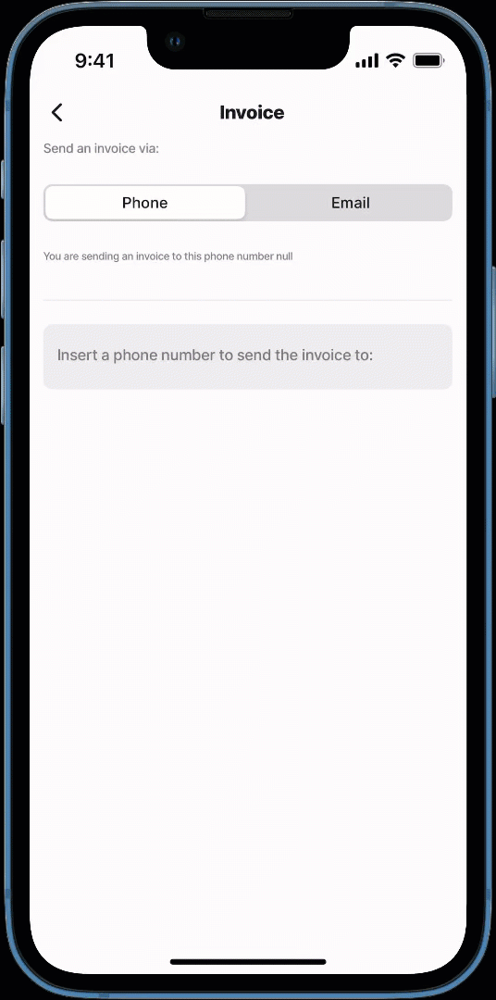

# segmented-control

The segmented-control is a horizontal control consisting of segments that allows you to toggle between multiple options in a compact, efficient way. It is commonly used for filtering content, switching views, or selecting categories within an app.

This component enhances user experience by providing a quick and intuitive way to navigate without needing drop-downs or separate screens. When designing a segmented control, consider:

* Keeping the number of segments minimal for readability
* Providing immediate visual feedback when a selection is made

## Configuration options

Some properties are common to all components, see [Common component properties](https://docs.jigx.com/examples/readme/components/common-component-properties) for a list and their configuration options.

<table><thead><tr><th width="214.85546875">Core structure</th><th></th></tr></thead><tbody><tr><td><code>data</code></td><td>Specify the <code>title</code> to display in each segment and a data <code>value</code>. Repeat the <code>title</code> and <code>value</code> properties to create the number of segments in the control.</td></tr><tr><td><code>title</code></td><td>The label for the segment. You can use in the title.</td></tr><tr><td><code>value</code></td><td>The data value for the segment that is used to display content when toggled. Can be used in an expression or to set the <code>initialValue</code>.</td></tr></tbody></table>

<table><thead><tr><th width="216.66796875">Other options</th><th></th></tr></thead><tbody><tr><td><code>initialValue</code></td><td>Configure which segment to display as active when the jig opens. By default there are no active segments. Tap the segment to activate it.</td></tr><tr><td><code>isDisabled</code></td><td>Set to <code>true</code> disables the segmented-control (ready only mode). By default the property's value is <code>false</code>.</td></tr></tbody></table>

<table><thead><tr><th width="218.76953125">State Configuration</th><th width="148.5390625">Key</th><th>Notes</th></tr></thead><tbody><tr><td><code>=@ctx.component.state.</code></td><td>value</td><td>State is the variable of the component.</td></tr><tr><td><code>=@ctx.solution.state.</code></td><td>activeItemId now</td><td>Global state variable that can be used throughout the solution.</td></tr></tbody></table>

## Examples and code snippets

## Basic segmented-control



<figure><figcaption><p>Segmented-controls</p></figcaption></figure>



This examples displays a basic segmented-control - A `segmented-control` with four segments. When a segment is tapped, its corresponding `value` is displayed in an `entity-field`.

**Example**: See the full example in [GitHub](https://github.com/jigx-com/jigx-samples/blob/main/quickstart/jigx-samples/jigs/jigx-components/segmented-control/segmented-control-basic.jigx).




```yaml
title: Segmented-control
type: jig.default
         
children:
  - type: component.section
    options:
      title: Basic segmented-control
      children:
       # Segment-control - Basic Segmented-control.      
        - type: component.segmented-control
          instanceId: numbers
          options:
            # Configure the number of segments, name and their values.          
            data:
              - title: One
                value: 1
              - title: Two
                value: 2
              - title: Three
                value: 3
              - title: Four
                value: 4  
        - type: component.entity
          options:
            children:
              - type: component.entity-field
                options:
                  label: Numbers
                  # Display the segments values in a field as you toggle the 
                  # segments.                
                  value: =@ctx.components.numbers.state.value      
```


## Segmented-control with a datasource



<figure><figcaption><p>Segment-control with a datasource</p></figcaption></figure>



This examples displays a segmented-control with a datasource - This `segmented-control` dynamically retrieves its `titles` and `values` from a datasource. It consists of three segments, when a segment is tapped, its `value` is displayed in an `entity-field`.

**Example:** See the full example in [GitHub](https://github.com/jigx-com/jigx-samples/blob/main/quickstart/jigx-samples/jigs/jigx-components/segmented-control/segmented-control-datasource.jigx).





```yaml
title: Segmented-control
type: jig.default
         
children:
  - type: component.section
    options:
      title: Segmented-control using datasource
      children:
        # Segment-control - Segmented-control with a datasource.       
        - type: component.segmented-control
          instanceId: work
          options:
            # Configure the number of segments, name and their values. 
            # Use datasources to define the data for the title and value.          
            data: =@ctx.datasources.content
        - type: component.entity
          options:
            children:
            - type: component.entity-field
              options:
                label: Task
               # Display the segments values in a field as you toggle the segments.                
                value: =@ctx.components.work.state.value   
```



```yaml
datasources:
  content:
    type: datasource.static
    options:
      data:
        - id: 1
          title: Home
          icon: home-5g
          value: 35 Sunset boulevard, Hollywood
        - id: 2
          title: Schedule
          icon: scheduled-phone-call
          value: Deliver parcel
        - id: 3
          title: Timesheet
          icon: hourglass-1-alternate 
          value: ⏱️ record time spent on the job 
```



## Disabled segmented-control



<figure><figcaption><p>Disabled segmented-controls</p></figcaption></figure>



This examples displays a disabled segmented-control - A `segmented-control` with three segments that is set to a disabled state, preventing user interaction.

**Example:** See the full example in [GitHub](https://github.com/jigx-com/jigx-samples/blob/main/quickstart/jigx-samples/jigs/jigx-components/segmented-control/segmented-control-disabled.jigx).




```yaml
title: Segmented-control
type: jig.default
         
children:  
  - type: component.section
    options:
      # Segment-control -Disabled segmented-control.
      title: Disabled segmented-control
      children:
        - type: component.segmented-control
          options:
            # Disable the segmented control, rendering in in a read only mode.          
            isDisabled: true
            # Configure the number of segments, name and their values.             
            data:
              - title: Clock In
                value: 1
              - title: Break
                value: 2
              - title: Clock Out
                value: 3  
```


## Preselected segmented-control



<figure><figcaption><p>Segmented-controls</p></figcaption></figure>



This examples displays a preselected segmented-control - A `segmented-control` with three segments, where the second segment is set as active by default when the jig opens. When a segment is tapped, its `value` is displayed in an `entity-field`.

**Example:** See the full example in [GitHub](https://github.com/jigx-com/jigx-samples/blob/main/quickstart/jigx-samples/jigs/jigx-components/segmented-control/segmented-control-preselected.jigx).



<pre class="language-yaml" data-title="segmented-control-preselected.jigx"><code class="lang-yaml"><strong>title: Segmented-control
</strong>type: jig.default
         
children:
  - type: component.section
    options:
      title: Set default segment
      children:
        # Segment-control - Preselected segmented-control. 
        - type: component.segmented-control
          instanceId: default-segment
          options:
            # Configure which segment will be active when the jig opens.          
            initialValue: Manager Group B 
            # Configure the number of segments, name and their values.                
            data:
              - title: Available
                value: Team A
              - title: On Duty
                value: Manager Group B
              - title: Off Duty
                value: Team B         
        - type: component.entity
          options:
            children:
            - type: component.entity-field
              options:
                label: Roster
                # Display the segments values in a field as you toggle the segments.                 
                value: =@ctx.components.default-segment.state.value    
</code></pre>

## Segmented-control using state



This example demonstrates how to configure the `entity-field` and `form` component state to display the relevant content based on the segment tapped. The value entered in the `form` when the _Email_ segment is displayed is used to generate a PDF and share it via email.

**Example:** See the full example in [GitHub](https://github.com/jigx-com/jigx-samples/blob/main/quickstart/jigx-samples/jigs/jigx-components/segmented-control/segmented-control-state.jigx).



<figure><figcaption><p>Segmented-control using state</p></figcaption></figure>





```yaml
title: Invoice
description: "Send an invoice via: "
type: jig.default
# Clear the form's field on refresh.
onRefresh: 
  type: action.reset-state
  options:
    state: =@ctx.components.form.state.data
# Clear the form's field when the app is in focus.
onFocus: 
  type: action.reset-state
  options:
    state: =@ctx.components.form.state.data
                   
children:
    # configure the segment-control to use state.
    - type: component.segmented-control
      instanceId: choice
      options:
        # Configure which segment will be active when the jig opens.
        initialValue: Phone
        # Configure the number of segments, name and their values.
        data:
          - title: Phone
            value: Phone
          - title: Email
            value: Email
    - type: component.entity
      options:
        children:
          - type: component.entity-field
            # Set a condition that defines what content displays,
            # when the Phone segment is tapped.
            when: =@ctx.components.choice.state.value = 'Phone'
            options:
              label: ="You are sending an invoice to this phone number " & @ctx.components.phonenum.state.value
              value: " "
          - type: component.entity-field
            # Set a condition that defines what content displays,
            # when the Email segment is tapped.
            when: =@ctx.components.choice.state.value = 'Email'
            options:
              label: ="You are sending an invoice to this email address " & @ctx.components.emailaddress.state.value
              value: " "
    - type: component.form
      instanceId: form
      options:
        isDiscardChangesAlertEnabled: false
        children:
          - type: component.number-field
            # Set a condition that defines what form field to display,
            # when the Phone segment is tapped.
            when: =@ctx.components.choice.state.value = 'Phone'
            instanceId: phonenum
            options:
              label: "Insert a phone number to send the invoice to:"
          - type: component.email-field
            # Set a condition that defines what form field to display,
            # when the Email segment is tapped.
            when: =@ctx.components.choice.state.value = 'Email'
            instanceId: emailaddress
            options:
              label: "Insert an email to send the invoice to:"

actions:
    - children:
        - type: action.action-list
          options:
            # Only show the action button when Phone segment is tapped.  
            isHidden: =@ctx.components.choice.state.value = 'Phone'
            title: Send
            isSequential: true
            actions:
              - type: action.generate-pdf
                instanceId: generate-pdf-id
                options:
                  html: =@ctx.datasources.monthly-invoice-HTML.invoice-html
                  fileName: invoice-1  
              - type: action.share
                options:
                  email: =@ctx.components.emailaddress.state.value
                  fileUri: =@ctx.actions.generate-pdf-id.outputs.uri
                  message: Global Invoice 
                  subject: Invoice for January       
```



```yaml
type: datasource.static
options:
  data:     
    - id: 1
      invoice-html: |
       <!DOCTYPE html>
          <html lang="en">
          <head>
            <meta charset="UTF-8">
            <meta name="viewport" content="width=device-width, initial-scale=1.0">
            <title>Invoice</title>
            <style>
              body {
                font-family: 'Arial', sans-serif;
                margin: 0;
                padding: 20px;
                background-color: #f6f6f6;
              }
              .invoice-box {
                max-width: 800px;
                margin: auto;
                padding: 30px;
                border: 1px solid #eee;
                box-shadow: 0 0 10px rgba(0, 0, 0, 0.15);
                background-color: #fff;
                color: #555;
              }
              .invoice-box table {
                width: 100%;
                line-height: 1.6;
                text-align: left;
                border-collapse: collapse;
              }
              .invoice-box table td {
                padding: 5px;
                vertical-align: top;
              }
              .invoice-box table tr td:nth-child(2) {
                text-align: right;
              }
              .invoice-box table tr.top table td {
                padding-bottom: 20px;
              }
              .invoice-box table tr.information table td {
                padding-bottom: 40px;
              }
              .invoice-box table tr.heading td {
                background: #eee;
                border-bottom: 1px solid #ddd;
                font-weight: bold;
              }
              .invoice-box table tr.details td {
                padding-bottom: 20px;
              }
              .invoice-box table tr.item td {
                border-bottom: 1px solid #eee;
              }
              .invoice-box table tr.item.last td {
                border-bottom: none;
              }
              .invoice-box table tr.total td:nth-child(2) {
                border-top: 2px solid #eee;
                font-weight: bold;
              }
              h2, h3 {
                margin: 0;
              }
            </style>
          </head>
          <body>
            <div class="invoice-box">
              <table cellpadding="0" cellspacing="0">
                <!-- Invoice Header -->
                <tr class="top">
                  <td colspan="2">
                    <table>
                      <tr>
                        <td class="title">
                          <h2>Company Name</h2>
                        </td>
                        <td>
                          Invoice #: 12345
                          Created: January 1, 2025
                          Due: January 31, 2025
                        </td>
                      </tr>
                    </table>
                  </td>
                </tr>
                <!-- Company & Customer Information -->
                <tr class="information">
                  <td colspan="2">
                    <table>
                      <tr>
                        <td>
                          Company Name, Inc.
                          12345 Street Address
                          City, State, Zip
                        </td>
                        <td>
                          Customer Name
                          Customer Company
                          67890 Customer Address
                        </td>
                      </tr>
                    </table>
                  </td>
                </tr>
                <!-- Payment Method Details -->
                <tr class="heading">
                  <td>Payment Method</td>
                  <td>Check #</td>
                </tr>
                <tr class="details">
                  <td>Check</td>
                  <td>1001</td>
                </tr>
                <!-- Itemized List of Services/Products -->
                <tr class="heading">
                  <td>Item</td>
                  <td>Price</td>
                </tr>
                <tr class="item">
                  <td>Website Design</td>
                  <td>$300.00</td>
                </tr>
                <tr class="item">
                  <td>Hosting (3 months)</td>
                  <td>$75.00</td>
                </tr>
                <tr class="item last">
                  <td>Domain Registration (1 year)</td>
                  <td>$10.00</td>
                </tr>
                <!-- Total -->
                <tr class="total">
                  <td></td>
                  <td>Total: $385.00</td>
                </tr>
              </table>
            </div>
          </body>
          </html>
```


