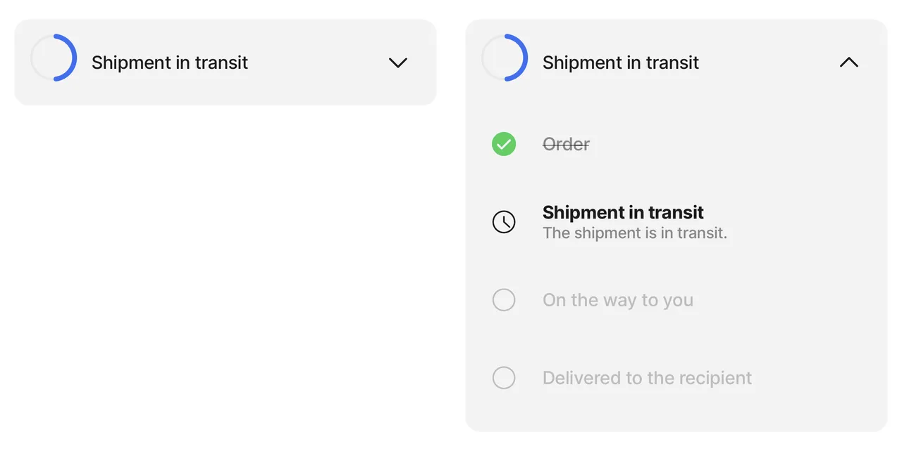

# stepper


{% column width="50%" %}
This component displays the progress status of a task. Useful when tracking deliveries or claims. This component can only be used in a [jig.default](<../Jig Types/jig_default.md>).


{% column width="50%" %}
<figure><figcaption><p>Stepper Preview</p></figcaption></figure>



## Configuration options

Some properties are common to all components, see [Common component properties](stepper.md) for a list and their configuration options.

<table><thead><tr><th width="214.08984375">Core structure</th><th></th></tr></thead><tbody><tr><td><code>data</code></td><td>Define the data to be used in the step items, you can use expressions to reference a datasource.</td></tr><tr><td><code>item</code></td><td>There is only one available option, which is . The <code>item</code> property is core for the stepper component, so even if you are creating a non-expandable stepper you must configure the step component's <code>title</code> and <code>value</code> properties with an empty string: ""</td></tr><tr><td><code>completedPercentage</code></td><td>Define the percentage to be displayed on the chart. Example "0.24" => 24 %. 1 represents 100% complete.</td></tr></tbody></table>

<table><thead><tr><th width="208.49609375">Other options</th><th></th></tr></thead><tbody><tr><td><code>isExpandable</code></td><td>Set to <code>true</code> the stepper will be expandable into steps. Set to <code>false</code> the stepper is not expandable.</td></tr><tr><td><code>style</code></td><td><p>The styling determines the color of the chart. There are three colors options, determined by the standard colors or by your branding color configuration. For example if the status is complete use <code>isPositive</code> to show the chart in green (standard). If no style is specified the chart shows in blue (standard). Available options:</p><ul><li><code>isNegative</code> - red (standard)</li><li><code>isPositive</code> - green (standard)</li><li><code>isWarning</code> - orange (standard)</li></ul></td></tr><tr><td><code>subtitle</code></td><td>The subtitle/short description of the stepper to display under the title. You can use an expression to set the subtitle.</td></tr><tr><td><code>title</code></td><td>The title for the stepper, you can use an expression to set the title.</td></tr></tbody></table>

## Examples and code snippets

### Stepper example



<figure><figcaption><p>Stepper for shipment status</p></figcaption></figure>



In this example, a stepper component shows that the task is half done. For completeness, use it together with the step component. After expanding the stepper, the individual steps will be shown.

**Examples**: See the full example using static data in [GitHub](https://github.com/jigx-com/jigx-samples/blob/main/quickstart/jigx-samples/jigs/jigx-components/stepper/static-data/stepper-example/stepper-example.jigx). See the full example using dynamic data in [GitHub](https://github.com/jigx-com/jigx-samples/blob/main/quickstart/jigx-samples/jigs/jigx-components/stepper/dynamic-data/stepper-example/stepper-example-dynamic.jigx).

**Datasource**: See the full datasource for static data in [GitHub](https://github.com/jigx-com/jigx-samples/blob/main/quickstart/jigx-samples/datasources/adhoc-components/steps.jigx). See the full datasource for dynamic data in [GitHub](https://github.com/jigx-com/jigx-samples/blob/main/quickstart/jigx-samples/datasources/adhoc-components/steps-dynamic.jigx).:





```yaml
children:
  - type: component.stepper
    options:
      data: =@ctx.datasources.steps
      isExpandable: true
      title: Shipment in transit
      item:
        type: component.step
        options:
          title: =@ctx.current.item.title
          description: =@ctx.current.item.description
          value: =@ctx.current.item.value 
          leftElement:
            element: icon
            icon: =@ctx.current.item.icon
          style:
            isPositive: =@ctx.current.item.isCompleted
            isActive: =@ctx.current.item.isActive
            isStrikeThrough: =@ctx.current.item.isCompleted
            isDisabled: =@ctx.current.item.isWaiting
      completedPercentage: 0.5
      style:  
        isPositive: false
        isWarning: false
        isNegative: false
```



```yaml
children:
  - type: component.stepper
    options:
      data: =@ctx.datasources.steps-dynamic
      isExpandable: true
      title: Shipment in transit
      item:
        type: component.step
        options:
          title: =@ctx.current.item.title
          description: =@ctx.current.item.description
          value: =@ctx.current.item.value 
          leftElement:
            element: icon
            icon: =@ctx.current.item.icon
          style:
            isPositive: =@ctx.current.item.iscompleted
            isActive: =@ctx.current.item.isactive
            isStrikeThrough: =@ctx.current.item.iscompleted
            isDisabled: =@ctx.current.item.iswaiting
      completedPercentage: 0.5
      style:  
        isPositive: false
        isWarning: false
        isNegative: false
```



```yaml
datasources:
  steps:
    type: datasource.static
    options:
      data:
        - title: Order
          value: step1
          icon: checkbox-checked
          isActive: false
          isCompleted: true
          isWaiting: false
        - description: The shipment is in transit.
          title: Shipment in transit
          value: step2
          icon: time-clock-circle
          isActive: true
          isCompleted: false
          isWaiting: false
        - title: On the way to you
          value: step3
          isActive: false
          isCompleted: false
          isWaiting: true
        - title: Delivered to the recipient
          value: step4
          isActive: false
          isCompleted: false
          isWaiting: true
```



```yaml
datasources:
  steps-dynamic:
    type: datasource.sqlite
    options:
      provider: DATA_PROVIDER_DYNAMIC
      entities:
        - entity: default/steps
      query: |
        SELECT
          '$.title',
          '$.description',
          '$.value',
          '$.icon',
          '$.isactive',
          '$.iscompleted',
          '$.iswaiting'
        FROM [default/steps]
        ORDER BY value
```


