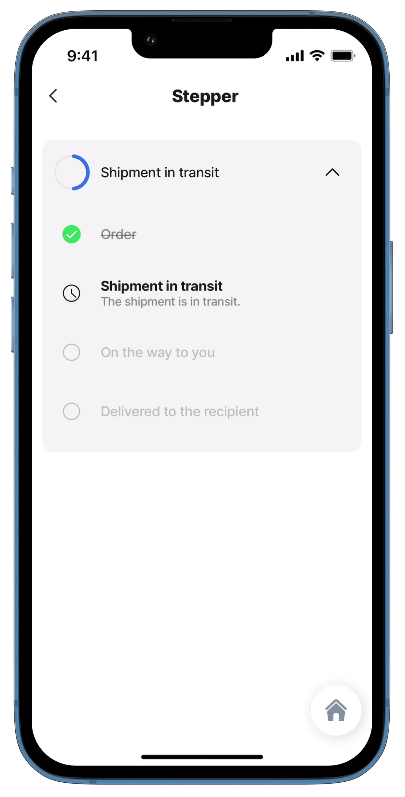

# step

This component displays consecutive steps in a stepper component. You can divide the task into steps, mark them as completed, and gradually get closer to completing the entire task.

<figure><figcaption><p>Step component</p></figcaption></figure>

## Configuration options

Some properties are common to all components, see [Common component properties](step.md) for a list and their configuration options.

<table><thead><tr><th width="142.51171875">Core structure</th><th></th></tr></thead><tbody><tr><td><code>title</code></td><td>Provide a title for the step item. You can use an expression to set the title.</td></tr><tr><td><code>value</code></td><td>The value of the step item. The value is exposed in the jig's state, making it available for use anywhere inside the jig.</td></tr></tbody></table>

<table><thead><tr><th width="146.75">Other options</th><th></th></tr></thead><tbody><tr><td><code>description</code></td><td>Describe the step item that is displayed as the subtitle.</td></tr><tr><td><code>leftElement</code></td><td>The only available element for the step is an <code>icon</code> displayed on the left of the value. A list of icons is available. See for more information. If no icon is specified a checkbox is used on the left.</td></tr><tr><td><code>style</code></td><td><p>The following styling options are available:</p><ul><li><code>isActive</code> - Shows the step as active.</li><li><code>isDisabled</code> - Shows the step <code>value</code>, <code>description</code>, and <code>icon</code> as disabled (greyed out).</li><li><code>isNegative</code> - The step <code>description</code> and <code>icon</code> are shown in red.</li><li><code>isPositive</code> - The <code>description</code> and <code>icon</code> are shown in green.</li><li><code>isStrikeThrough</code> - The step's <code>value</code> and <code>description</code> are shown with a line through it.</li><li><code>isWarning</code> - The <code>description</code> and <code>icon</code> are shown in orange.</li></ul></td></tr></tbody></table>

<table><thead><tr><th width="153.859375">Actions</th><th></th></tr></thead><tbody><tr><td><code>onPress</code></td><td>The action is triggered when pressing on the step item. Use IntelliSense to see the list of available actions.</td></tr></tbody></table>

## Consideration

* The step component can only be used inside the [stepper](https://docs.jigx.com/examples/stepper) component.

## Examples and code snippets

### Step Example



<figure><figcaption><p>Step in Stepper</p></figcaption></figure>



This example shows the steps of delivering a shipment. In this case, the goods have already been ordered, and the shipment is in transit.

**Examples:**\
See the full example using static data on [GitHub](https://github.com/jigx-com/jigx-samples/blob/main/quickstart/jigx-samples/jigs/jigx-components/stepper/static-data/stepper-example/stepper-example.jigx).\
See the full example using dynamic data in [GitHub](https://github.com/jigx-com/jigx-samples/blob/main/quickstart/jigx-samples/jigs/jigx-components/stepper/dynamic-data/stepper-example/stepper-example-dynamic.jigx).

**Datasource:**\
See the full datasource for static data on [GitHub](https://github.com/jigx-com/jigx-samples/blob/main/quickstart/jigx-samples/datasources/adhoc-components/steps.jigx).\
See the full datasource for dynamic data in [GitHub](https://github.com/jigx-com/jigx-samples/blob/main/quickstart/jigx-samples/datasources/adhoc-components/steps-dynamic.jigx).





```yaml
children:
  - type: component.stepper
    options:
      data: =@ctx.datasources.steps
      isExpandable: true
      title: Shipment in transit
      item:
        type: component.step
        options:
          title: =@ctx.current.item.title
          description: =@ctx.current.item.description
          value: =@ctx.current.item.value 
          leftElement:
            element: icon
            icon: =@ctx.current.item.icon
          style:
            isPositive: =@ctx.current.item.isCompleted
            isActive: =@ctx.current.item.isActive
            isStrikeThrough: =@ctx.current.item.isCompleted
            isDisabled: =@ctx.current.item.isWaiting
      completedPercentage: 0.5
```



```yaml
children:
  - type: component.stepper
    options:
      data: =@ctx.datasources.steps-dynamic
      isExpandable: true
      title: Shipment in transit
      item:
        type: component.step
        options:
          title: =@ctx.current.item.title
          description: =@ctx.current.item.description
          value: =@ctx.current.item.value 
          leftElement:
            element: icon
            icon: =@ctx.current.item.icon
          style:
            isPositive: =@ctx.current.item.iscompleted
            isActive: =@ctx.current.item.isactive
            isStrikeThrough: =@ctx.current.item.iscompleted
            isDisabled: =@ctx.current.item.iswaiting
      completedPercentage: 0.5
```



```yaml
datasources:
  steps:
    type: datasource.static
    options:
      data:
        - title: Order
          value: step1
          icon: checkbox-checked
          isActive: false
          isCompleted: true
          isWaiting: false
        - description: The shipment is in transit.
          title: Shipment in transit
          value: step2
          icon: time-clock-circle
          isActive: true
          isCompleted: false
          isWaiting: false
        - title: On the way to you
          value: step3
          isActive: false
          isCompleted: false
          isWaiting: true
        - title: Delivered to the recipient
          value: step4
          isActive: false
          isCompleted: false
          isWaiting: true
```



```yaml
datasources:
  steps-dynamic:
    type: datasource.sqlite
    options:
      provider: DATA_PROVIDER_DYNAMIC
      entities:
        - entity: default/steps
      query: |
        SELECT
          '$.title',
          '$.description',
          '$.value',
          '$.icon',
          '$.isactive',
          '$.iscompleted',
          '$.iswaiting'
        FROM [default/steps]
        ORDER BY value
```


