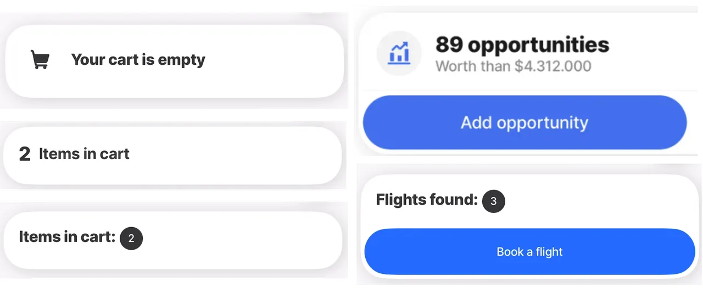
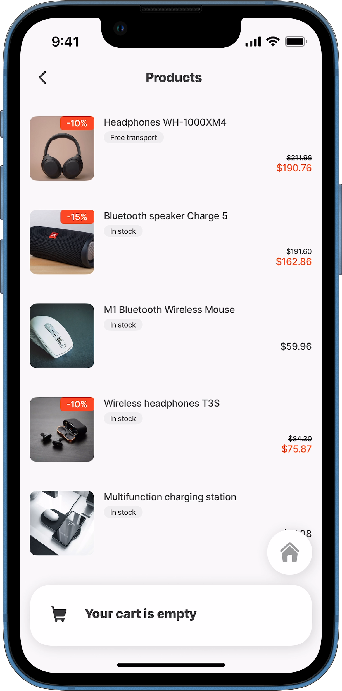
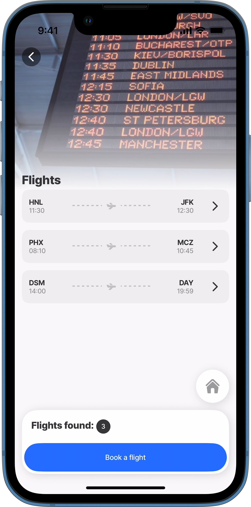

---
layout:
  width: wide
  title:
    visible: true
  description:
    visible: true
  tableOfContents:
    visible: true
  outline:
    visible: true
  pagination:
    visible: true
  metadata:
    visible: true
---

# summary


{% column width="50%" %}
Summarize the information in the jig at the bottom of the screen using the summary component. For example, a count of the number orders, or the number of items in a cart for an online shopping app.

The summary is fixed and displays even when the screen is scrolled. Make the summary actionable by combining it with an [action](broken-reference).


{% column width="50%" %}




## Configuration options

Some properties are common to all components, see [Common component properties](summary.md) for a list and their configuration options.

<table><thead><tr><th width="151.33984375">Core structure</th><th></th></tr></thead><tbody><tr><td><code>layout</code></td><td><p>There are three types to choose from:</p><ol><li><code>default</code> - used to display information. This is the default layout, allowing you to specify what must be shown.</li><li><code>cart</code> - useful for an online shopping app to show the number of items in a cart. The <code>value</code> is shown to the right of the <code>title</code>.</li><li><code>counter</code> - useful for showing a count, for example, the number of sales made in a month. The <code>value</code> is shown to the left of the <code>title</code>.</li></ol></td></tr><tr><td><code>title</code></td><td>The main text to display on the component.</td></tr></tbody></table>

<table><thead><tr><th width="145.49609375">Other options</th><th></th></tr></thead><tbody><tr><td><code>color</code></td><td>Changing color of <code>title</code> and <code>leftIcon</code> based on <code>when</code> conditions. First condition evaluated to <code>true</code> will be used. If the condition evaluates to <code>false</code> the default color (black) is used. Choose a color from the provided color palette as well as the status colors, e.g. <code>isWarning</code>. Default color is black if the property is not specified in the YAML. See the list of available colors in .</td></tr><tr><td><code>description</code></td><td>Provide third level of supporting text to be displayed. The position of the text is under the <code>subtitle</code> property. This property is only available with <code>layout</code> type <code>cart</code>.</td></tr><tr><td><code>leftIcon</code></td><td>Add an icon to show on the left before the <code>title</code>. A list of icons is available. See for more information. <code>leftIcon</code> is only available with the <code>default</code> layout.</td></tr><tr><td><code>subtitle</code></td><td>Provide supporting text to be displayed as a <code>subtitle</code>. The position of the subtitle text depends on the selected <code>layout</code> property.</td></tr><tr><td><code>value</code></td><td>The actual value in your summary configured by a string or an expression that must equal a number. This property is only available for <code>layout</code> types <code>cart</code> and <code>counter</code>.</td></tr></tbody></table>

<table><thead><tr><th width="146.0390625">Actions</th><th></th></tr></thead><tbody><tr><td><code>OnPress</code></td><td>The action is triggered while pressing on the <code>LeftIcon</code> in the summary. Use IntelliSense (ctrl+space) to see the available list of actions.</td></tr><tr><td><a href="broken-reference">Actions</a></td><td>By using the summary component along with actions, you can unlock a powerful feature that enables you to take necessary actions based on the information available from the summary. For instance, adding a sales opportunity. This feature can significantly enhance the usability of your jig and make it more efficient.</td></tr></tbody></table>

## Consideration

* The summary component is available on all [Jig Types](<../Jig Types/Jig Types.md>).
* To show an empty `title` use `title: ' '`.
* To format the `value` property, for example, adding a currency symbol in front of the value or percentage behind the value, use the `Text with Format` option available in IntelliSense (ctrl+space).
* Only numbers can be shown in the `value` property.
* If the `value` property exceeds 100 a default 99+ will be displayed in the property.
* Enhance the usability of your jig and make it more efficient by using the summary component along with an [action](broken-reference).
* **Working with Parent and Child Actions and Summaries:** When configuring `actions` or `summary` buttons across parent and child jigs, the following behavior applies:
  * If both the parent and child jigs have an `action` or `summary` configured, the child’s configuration takes precedence and overrides the parent’s.
  * If only the parent has an `action` or `summary`, it automatically applies to the child.
  * If only the child has an `action` or `summary`, it is used in the parent jig as well.

## Examples and code snippets

### Summary - default



<figure><figcaption><p>Default layout</p></figcaption></figure>



In this example the `default` layout property is used to show a `title` with a cart as a `leftIcon`.

**Example**: The full example is on [GitHub](https://github.com/jigx-com/jigx-samples/blob/main/quickstart/jigx-samples/jigs/jigx-components/summary/summary.jigx).




```yaml
title: Products
type: jig.list

# Add the summary showing an icon with default layout.  
summary:
  children:
    type: component.summary
    options:
      title: Your cart is empty
      layout: default
      leftIcon:
        element: icon
        icon: shopping-cart-empty-1
        
data: =@ctx.datasources.products
item:
  type: component.product-item
  options:
    title: =@ctx.current.item.title
    discount: =@ctx.current.item.discount
    image:
      uri: =@ctx.current.item.uri
    price:
      format:
        numberStyle: currency
      value: =@ctx.current.item.price
    tag: =@ctx.current.item.tag
```


### Summary - cart



n this example the `cart` layout property is used in a `jig.list` with a `product-item` component to show the number of products in the cart. Notice the number of items in the cart is shown in a circle on the right of the `title`.\
**Example**:\
The full example of the summary type: cart using product-item is on [GitHub](https://github.com/jigx-com/jigx-samples/blob/main/quickstart/jigx-samples/jigs/jigx-components/summary/summary-cart.jigx).\
The full example of the summary type: cart using expander is on [GitHub](https://github.com/jigx-com/jigx-samples/blob/main/quickstart/jigx-samples/jigs/jigx-components/summary/summary-cart-expander.jigx).



<figure><figcaption><p>Cart layout</p></figcaption></figure>





```yaml
title: Products
type: jig.list

# Add the summary to show there are two products available using a cart layout.  
summary:
  children:
    type: component.summary
    options:
      title: "Items in cart:"
      layout: cart
      value: 2
      
data: =@ctx.datasources.products
item:
  type: component.product-item
  options:
    title: =@ctx.current.item.title
    discount: =@ctx.current.item.discount
    image:
      uri: =@ctx.current.item.uri
    price:
      format:
        numberStyle: currency
      value: =@ctx.current.item.price
    tag: =@ctx.current.item.tag
```



```yaml
title: Flights
type: jig.list

header:
  type: component.jig-header
  options:
    height: medium
    children:
      type: component.image
      options:
        source:
          uri: https://images.unsplash.com/photo-1490430657723-4d607c1503fc?ixlib=rb-1.2.1&ixid=MnwxMjA3fDB8MHxzZWFyY2h8OHx8ZmxpZ2h0c3xlbnwwfHwwfHw%3D&auto=format&fit=crop&w=500&q=60
 
# Add the summary to show there are three flight available using a cart layout. 
summary:
  children:
    type: component.summary
    options: 
      layout: cart
      title: "Flights found:"
      value: 3
        
data: =@ctx.datasources.flight-schedule-static
item:
  type: component.expander
  options:
    header:
      centerElement: 
        type: component.stage
        options:
          right:
            title: =@ctx.current.item.toabrv
            subtitle: =@ctx.current.item.disembark
          left:
            title: =@ctx.current.item.fromabrv
            subtitle: =@ctx.current.item.board
    children:
      - type: component.entity
        options:
          children:
            - type: component.field-row
              options:
                children:
                  - type: component.entity-field
                    options:
                      label: Boarding
                      value: =@ctx.current.item.from
                  - type: component.entity-field
                    options:
                      label: Destination
                      value: =@ctx.current.item.to
            - type: component.field-row
              options:
                children:
                  - type: component.entity-field
                    options:
                      label: Board Time
                      value: =@ctx.current.item.board
                  - type: component.entity-field
                    options:
                      label: Disembark Time
                      value: =@ctx.current.item.disembark
            - type: component.entity-field
              options:
                label: Passenger
                value: =@ctx.current.item.name
            - type: component.field-row
              options:
                children:
                  - type: component.entity-field
                    options:
                      label: Flight
                      value: =@ctx.current.item.flight
                  - type: component.entity-field
                    options:
                      label: Gate
                      value: =@ctx.current.item.gate
                  - type: component.entity-field
                    options:
                      label: Seat
                      value: =@ctx.current.item.seat
      - type: component.location
        options:
          viewPoint:
            centerPosition: middle
            address: =@ctx.current.item.to         
```



```yaml
datasources:
  products:
    type: datasource.static
    options:
      data:
        - title: Headphones WH-1000XM4
          uri: https://images.unsplash.com/photo-1618366712010-f4ae9c647dcb?ixlib=rb-1.2.1&ixid=MnwxMjA3fDB8MHxwaG90by1wYWdlfHx8fGVufDB8fHx8&auto=format&fit=crop&w=776&q=80
          tag: free transport 
          price: 211.96
          discount: 0.10
        - title: Bluetooth speaker Charge 5
          uri: https://images.unsplash.com/photo-1608043152269-423dbba4e7e1?ixlib=rb-1.2.1&ixid=MnwxMjA3fDB8MHxwaG90by1wYWdlfHx8fGVufDB8fHx8&auto=format&fit=crop&w=2062&q=80
          tag: in stock
          price: 191.6
          discount: 0.15
        - title: M1 Bluetooth Wireless Mouse
          uri: https://images.unsplash.com/photo-1611850698562-ae3d28934080?ixlib=rb-1.2.1&ixid=MnwxMjA3fDB8MHxwaG90by1wYWdlfHx8fGVufDB8fHx8&auto=format&fit=crop&w=1740&q=80
          tag: in stock
          price: 59.96
          discount:
        - title: Wireless headphones T3S
          uri: https://images.unsplash.com/photo-1578319439584-104c94d37305?ixlib=rb-1.2.1&ixid=MnwxMjA3fDB8MHxwaG90by1wYWdlfHx8fGVufDB8fHx8&auto=format&fit=crop&w=1740&q=80
          tag: in stock
          price: 84.3
          discount: 0.10
        - title: Multifunction charging station
          uri: https://images.unsplash.com/photo-1587749091230-fb8a034d695c?ixlib=rb-1.2.1&ixid=MnwxMjA3fDB8MHxwaG90by1wYWdlfHx8fGVufDB8fHx8&auto=format&fit=crop&w=1160&q=80
          tag: in stock
          price: 71.08
          discount:
```



```yaml
datasources:
  flight-schedule-static:
    type: datasource.static
    options:
      data: 
        - id: 1
          airline: Get Stuff Done Airlines
          board: 11:30
          disembark: 12:30
          date: 30 Jul
          flight: A 0123
          from: Hawaii
          fromabrv: HNL
          gate: 16
          name: July Nelson
          seat: 12F
          to: New York
          toabrv: JFK
          image: https://images.unsplash.com/photo-1436491865332-7a61a109cc05?ixlib=rb-1.2.1&ixid=MnwxMjA3fDB8MHxzZWFyY2h8MXx8cGxhbmV8ZW58MHx8MHx8&auto=format&fit=crop&w=500&q=60
        - id: 2
          airline: Get Stuff Done Airlines
          board: 08:10
          disembark: 10:45
          date: 30 Jul
          flight: A 5738
          from: Phoenix
          fromabrv: PHX
          gate: 2
          name: Nora Gordon
          seat: 27A
          to: Alabama
          toabrv: MCZ
          image: https://images.unsplash.com/photo-1464037866556-6812c9d1c72e?ixlib=rb-1.2.1&ixid=MnwxMjA3fDB8MHxzZWFyY2h8Nnx8cGxhbmV8ZW58MHx8MHx8&auto=format&fit=crop&w=500&q=60
        - id: 3
          airline: Get Stuff Done Airlines
          board: 14:00
          disembark: 19:59
          date: 30 Jul
          flight: A 1123
          from: Iowa
          fromabrv: DSM
          gate: 15
          name: Tracy Matthews
          seat: 13F
          to: Columbus, Ohio, US
          toabrv: DAY
          image: https://images.unsplash.com/photo-1488085061387-422e29b40080?ixlib=rb-1.2.1&ixid=MnwxMjA3fDB8MHxzZWFyY2h8MTN8fHBsYW5lfGVufDB8fDB8fA%3D%3D&auto=format&fit=crop&w=500&q=60
```



### Summary - counter



<figure><figcaption><p>Counter layout</p></figcaption></figure>



In this example the `counter` layout property is used in a `jig.list` with a `product-item` component to show the number of products in the cart. Notice the number of products is show on the left of the `title`.

**Example**:\
The full example of the summary type: counter using product-item is on [GitHub](https://github.com/jigx-com/jigx-samples/blob/main/quickstart/jigx-samples/jigs/jigx-components/summary/summary-counter.jigx). The full example of the summary type: counter using expander is on [GitHub](https://github.com/jigx-com/jigx-samples/blob/main/quickstart/jigx-samples/jigs/jigx-components/summary/summary-counter-expander.jigx).





```yaml
title: Products
type: jig.list
# Add the summary to show there are two items.  
summary:
  children:
    type: component.summary
    options:
      title: Items in cart
      layout: counter
      value: 2
      
data: =@ctx.datasources.products
item:
  type: component.product-item
  options:
    title: =@ctx.current.item.title
    discount: =@ctx.current.item.discount
    image:
      uri: =@ctx.current.item.uri
    price:
      format:
        numberStyle: currency
      value: =@ctx.current.item.price
    tag: =@ctx.current.item.tag
```



```yaml
title: Today's Flights
type: jig.list

header:
  type: component.jig-header
  options:
    height: medium
    children:
      type: component.image
      options:
        source:
          uri: https://images.unsplash.com/photo-1490430657723-4d607c1503fc?ixlib=rb-1.2.1&ixid=MnwxMjA3fDB8MHxzZWFyY2h8OHx8ZmxpZ2h0c3xlbnwwfHwwfHw%3D&auto=format&fit=crop&w=500&q=60
 
 # Add the summary to show there are three flight options available. 
summary:
  children:
    type: component.summary
    options:
      title: Flights found
      layout: counter
      value: 3
            
data: =@ctx.datasources.flight-schedule-static
item:
  type: component.expander
  options:
    header:
      centerElement:
        type: component.stage
        options:
          left:
            title: =@ctx.current.item.fromabrv
            subtitle: =@ctx.current.item.board
          right:
            title: =@ctx.current.item.toabrv
            subtitle: =@ctx.current.item.disembark
        
    children:
      - type: component.entity
        options:
          children:
            - type: component.field-row
              options:
                children:
                  - type: component.entity-field
                    options:
                      label: Boarding
                      value: =@ctx.current.item.from
                  - type: component.entity-field
                    options:
                      label: Destination
                      value: =@ctx.current.item.to 
            - type: component.field-row
              options:
                children:
                  - type: component.entity-field
                    options:
                      label: Board Time
                      value: =@ctx.current.item.board  
                  - type: component.entity-field
                    options:
                      label: Disembark Time
                      value: =@ctx.current.item.disembark  
            - type: component.entity-field
              options:
                label: Passenger
                value: =@ctx.current.item.name
            - type: component.field-row
              options:
                children:
                  - type: component.entity-field
                    options:
                      label: Flight
                      value: =@ctx.current.item.flight
                  - type: component.entity-field
                    options:
                      label: Gate
                      value: =@ctx.current.item.gate
                  - type: component.entity-field
                    options:
                      label: Seat
                      value: =@ctx.current.item.seat   
      - type: component.location
        options:
          viewPoint:
            centerPosition: middle
            address: =@ctx.current.item.to
```



```yaml
datasources:
  products:
    type: datasource.static
    options:
      data:
        - title: Headphones WH-1000XM4
          uri: https://images.unsplash.com/photo-1618366712010-f4ae9c647dcb?ixlib=rb-1.2.1&ixid=MnwxMjA3fDB8MHxwaG90by1wYWdlfHx8fGVufDB8fHx8&auto=format&fit=crop&w=776&q=80
          tag: free transport 
          price: 211.96
          discount: 0.10
        - title: Bluetooth speaker Charge 5
          uri: https://images.unsplash.com/photo-1608043152269-423dbba4e7e1?ixlib=rb-1.2.1&ixid=MnwxMjA3fDB8MHxwaG90by1wYWdlfHx8fGVufDB8fHx8&auto=format&fit=crop&w=2062&q=80
          tag: in stock
          price: 191.6
          discount: 0.15
        - title: M1 Bluetooth Wireless Mouse
          uri: https://images.unsplash.com/photo-1611850698562-ae3d28934080?ixlib=rb-1.2.1&ixid=MnwxMjA3fDB8MHxwaG90by1wYWdlfHx8fGVufDB8fHx8&auto=format&fit=crop&w=1740&q=80
          tag: in stock
          price: 59.96
          discount:
        - title: Wireless headphones T3S
          uri: https://images.unsplash.com/photo-1578319439584-104c94d37305?ixlib=rb-1.2.1&ixid=MnwxMjA3fDB8MHxwaG90by1wYWdlfHx8fGVufDB8fHx8&auto=format&fit=crop&w=1740&q=80
          tag: in stock
          price: 84.3
          discount: 0.10
        - title: Multifunction charging station
          uri: https://images.unsplash.com/photo-1587749091230-fb8a034d695c?ixlib=rb-1.2.1&ixid=MnwxMjA3fDB8MHxwaG90by1wYWdlfHx8fGVufDB8fHx8&auto=format&fit=crop&w=1160&q=80
          tag: in stock
          price: 71.08
          discount:
```



```yaml
datasources:
  flight-schedule-static:
    type: datasource.static
    options:
      data: 
        - id: 1
          airline: Get Stuff Done Airlines
          board: 11:30
          disembark: 12:30
          date: 30 Jul
          flight: A 0123
          from: Hawaii
          fromabrv: HNL
          gate: 16
          name: July Nelson
          seat: 12F
          to: New York
          toabrv: JFK
          image: https://images.unsplash.com/photo-1436491865332-7a61a109cc05?ixlib=rb-1.2.1&ixid=MnwxMjA3fDB8MHxzZWFyY2h8MXx8cGxhbmV8ZW58MHx8MHx8&auto=format&fit=crop&w=500&q=60
        - id: 2
          airline: Get Stuff Done Airlines
          board: 08:10
          disembark: 10:45
          date: 30 Jul
          flight: A 5738
          from: Phoenix
          fromabrv: PHX
          gate: 2
          name: Nora Gordon
          seat: 27A
          to: Alabama
          toabrv: MCZ
          image: https://images.unsplash.com/photo-1464037866556-6812c9d1c72e?ixlib=rb-1.2.1&ixid=MnwxMjA3fDB8MHxzZWFyY2h8Nnx8cGxhbmV8ZW58MHx8MHx8&auto=format&fit=crop&w=500&q=60
        - id: 3
          airline: Get Stuff Done Airlines
          board: 14:00
          disembark: 19:59
          date: 30 Jul
          flight: A 1123
          from: Iowa
          fromabrv: DSM
          gate: 15
          name: Tracy Matthews
          seat: 13F
          to: Ohio
          toabrv: DAY
          image: https://images.unsplash.com/photo-1488085061387-422e29b40080?ixlib=rb-1.2.1&ixid=MnwxMjA3fDB8MHxzZWFyY2h8MTN8fHBsYW5lfGVufDB8fDB8fA%3D%3D&auto=format&fit=crop&w=500&q=60
```



### Summary with action



In this example the `cart` layout property is used in a `jig.list` with the `expander` component to show the number of available flights. A `go-to` action is added to take you to book a flight.

**Example**: The full example is on [GitHub](https://github.com/jigx-com/jigx-samples/blob/main/quickstart/jigx-samples/jigs/jigx-components/summary/summary-cart-action.jigx).



<figure><figcaption><p>Summary with action</p></figcaption></figure>





```yaml
title: Flights
type: jig.list

header:
  type: component.jig-header
  options:
    height: medium
    children:
      type: component.image
      options:
        source:
          uri: https://images.unsplash.com/photo-1490430657723-4d607c1503fc?ixlib=rb-1.2.1&ixid=MnwxMjA3fDB8MHxzZWFyY2h8OHx8ZmxpZ2h0c3xlbnwwfHwwfHw%3D&auto=format&fit=crop&w=500&q=60

# Add the summary to show there are three flight options available.
summary:
  children:
    type: component.summary
    options: 
      layout: counter
      value: 3
      title: "Flights found:"
                
data: =@ctx.datasources.flight-schedule-static
item:
  type: component.expander
  options:
    header:
      centerElement: 
        type: component.stage
        options:
          right:
            title: =@ctx.current.item.fromabrv
            subtitle: =@ctx.current.item.board
          left:
            title: =@ctx.current.item.toabrv
            subtitle: =@ctx.current.item.disembark 
    children:
      - type: component.entity
        options:
          children:
            - type: component.entity-field
              options:
                label: Boarding
                value: =@ctx.current.item.from
            - type: component.entity-field
              options:
                  label: Destination
                  value: =@ctx.current.item.to
            - type: component.field-row
              options:
                children:
                  - type: component.entity-field
                    options:
                      label: Board Time
                      value: =@ctx.current.item.board
                  - type: component.entity-field
                    options:
                        label: Disembark Time
                        value: =@ctx.current.item.disembark 
                  - type: component.entity-field
                    options:
                      label: Passenger
                      value: =@ctx.current.item.name
            - type: component.field-row
              options:
                children:
                  - type: component.entity-field
                    options:
                      label: Flight
                      value: =@ctx.current.item.flight 
                  - type: component.entity-field
                    options:
                        label: Gate
                        value: =@ctx.current.item.gate
                  - type: component.entity-field
                    options:
                        label: Seat
                        value: =@ctx.current.item.seat    
      - type: component.location
        options:
            viewPoint:
                address: =@ctx.current.item.to  

# Use the go-to action to navigate to a jig to book a flight.    
actions:
  - children:
      - type: action.go-to
        options:
          title: Book a flight
          linkTo: expander-trip 
```



```yaml
type: datasource.static
options:
  data: 
    - id: 1
      airline: Get Stuff Done Airlines
      board: 11:30
      disembark: 12:30
      date: 30 Jul
      flight: A 0123
      from: Hawaii
      fromabrv: HNL
      gate: 16
      name: July Nelson
      seat: 12F
      to: New York
      toabrv: JFK
      image: https://images.unsplash.com/photo-1436491865332-7a61a109cc05?ixlib=rb-1.2.1&ixid=MnwxMjA3fDB8MHxzZWFyY2h8MXx8cGxhbmV8ZW58MHx8MHx8&auto=format&fit=crop&w=500&q=60
    - id: 2
      airline: Get Stuff Done Airlines
      board: 08:10
      disembark: 10:45
      date: 30 Jul
      flight: A 5738
      from: Phoenix
      fromabrv: PHX
      gate: 2
      name: Nora Gordon
      seat: 27A
      to: Alabama
      toabrv: MCZ
      image: https://images.unsplash.com/photo-1464037866556-6812c9d1c72e?ixlib=rb-1.2.1&ixid=MnwxMjA3fDB8MHxzZWFyY2h8Nnx8cGxhbmV8ZW58MHx8MHx8&auto=format&fit=crop&w=500&q=60
    - id: 3
      airline: Get Stuff Done Airlines
      board: 14:00
      disembark: 19:59
      date: 30 Jul
      flight: A 1123
      from: Iowa
      fromabrv: DSM
      gate: 15
      name: Tracy Matthews
      seat: 13F
      to: Columbus, Ohio, US
      toabrv: DAY
      image: https://images.unsplash.com/photo-1488085061387-422e29b40080?ixlib=rb-1.2.1&ixid=MnwxMjA3fDB8MHxzZWFyY2h8MTN8fHBsYW5lfGVufDB8fDB8fA%3D%3D&auto=format&fit=crop&w=500&q=60 
```


