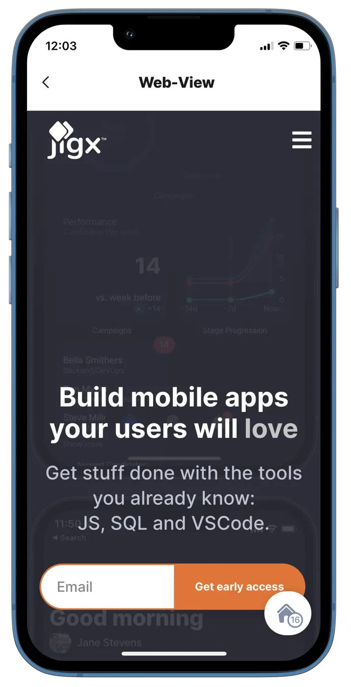
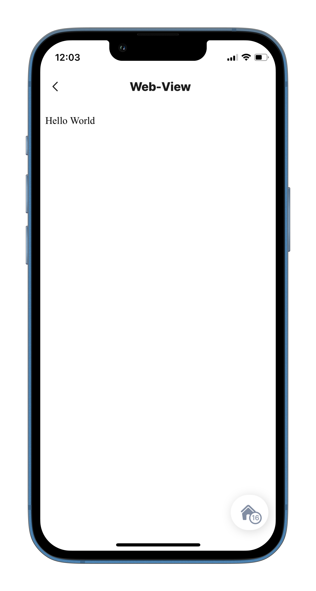
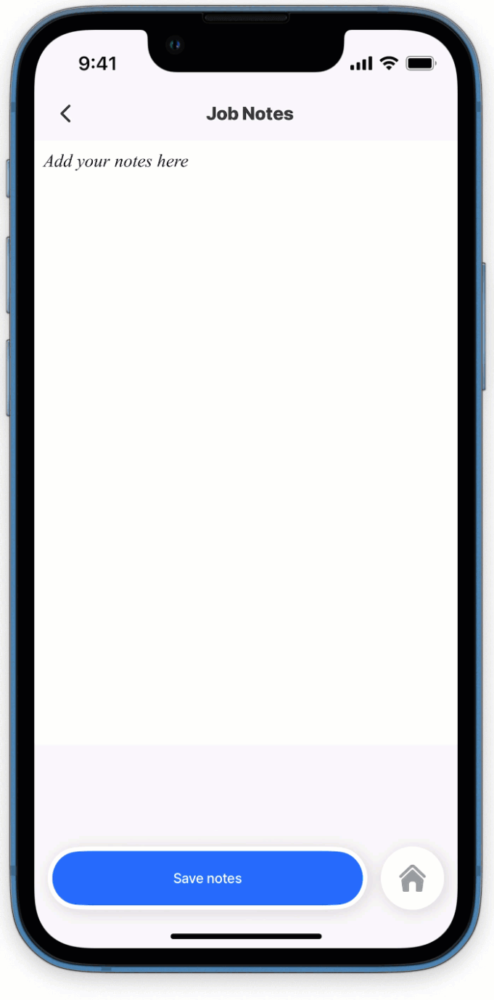

# web-view

This component displays a web page from a URL, content from a datasource, or custom HTML.


Use [jig.document](<../Jig Types/jig_document.md>) when you need a full-screen web page or message passing from HTML content.


## Configuration options



<table><thead><tr><th width="278.1953125">Core structure</th><th></th></tr></thead><tbody><tr><td><code>uri</code></td><td>The source to be displayed in the web-view, for example, a URL.</td></tr></tbody></table>

<table><thead><tr><th width="281.4453125">Other options</th><th></th></tr></thead><tbody><tr><td><code>content</code></td><td>HTML to render in the web-view.</td></tr><tr><td><code>height</code></td><td>The height of the web-view.</td></tr><tr><td><code>isEditable</code></td><td>If set to <code>true</code>, the web-view <code>content</code> becomes editable. This works only with <code>content</code>, not with a <code>uri</code>. Use it in a [jig.fullscreen](/spaces/HcPzbms3kZejTmFd500V/pages/pJexnDt2gmKLRExld1M7).</td></tr><tr><td><code>isTrackingTransparencyRequired</code></td><td>If set to <code>true</code>, Jigx shows the tracking transparency permission modal before opening the URL. The default is <code>true</code>.</td></tr><tr><td><code>allowInAppRedirect</code></td><td>If set to <code>true</code>, Jigx intercepts links tapped inside the web-view and handles them in-app. The default is <code>false</code>.</td></tr></tbody></table>

## Link handling

By default, links keep the existing web-view behavior and load inside the web-view.

Set `allowInAppRedirect: true` to intercept link taps and handle them outside the embedded page.

* Jigx [deeplinks](https://docs.jigx.com/building-apps-with-jigx/additional-functionality/deep-links) open inside the app. This includes `app.jigx.com/...` links and supported custom-scheme links.
* Cross-solution Jigx [deeplinks](https://docs.jigx.com/building-apps-with-jigx/additional-functionality/deep-links) switch to the target solution, then open the target jig.
* `http` and `https` links open in the in-app browser.
* `mailto:`, `tel:`, and similar schemes open in the system app.
* If the target solution is not assigned to the user, Jigx shows _Solution is not available_ and keeps the current web-view open.


`allowInAppRedirect` is off by default. Set it only when you want Jigx to handle links outside the embedded page.


## Considerations

* Use `component.web-view` in [jig.fullscreen](<../Jig Types/jig_fullscreen.md>) when the content should fill the screen.
* `isEditable` works with `content` only. It does not work with `uri`.

## Examples and code snippets

### Web-view example (URL)



<figure><figcaption><p>Web-view with URL</p></figcaption></figure>



In this example, we open a target URL in the web-view component.

If the target URL is tracking data (e.g., cookies etc.), you are required by Apple to ask for user consent using the `isTrackingTransparencyRequired` option. It will ask for user consent the first time any web view in your solution tries to open a target URL.

**Examples**: See the full example using static data on [GitHub](https://github.com/jigx-com/jigx-samples/blob/main/quickstart/jigx-samples/jigs/jigx-components/web-view/static-data/web-view-example/web-view-example.jigx). See the full example using dynamic data in [GitHub](https://github.com/jigx-com/jigx-samples/blob/main/quickstart/jigx-samples/jigs/jigx-components/web-view/dynamic-data/web-view-example-dynamic/web-view-example-dynamic.jigx).

**Datasource**: See the full datasource for static data on [GitHub](https://github.com/jigx-com/jigx-samples/blob/main/quickstart/jigx-samples/datasources/adhoc-components/web-view.jigx). See the full datasource for dynamic data in [GitHub](https://github.com/jigx-com/jigx-samples/blob/main/quickstart/jigx-samples/datasources/adhoc-components/web-view-dynamic.jigx).





```yaml
type: jig.default
title: Web view

children:
  - type: component.web-view
    options:
      uri: =@ctx.datasources.web-view.url
      isTrackingTransparencyRequired: true
      height: 1000
```



```yaml
type: jig.default
title: Web view

children:
  - type: component.web-view
    options:
      uri: =@ctx.datasources.web-view-dynamic.uri
      isTrackingTransparencyRequired: true
      height: 1000
```



```yaml
datasources:
  web-view:
    type: datasource.static
    options:
      data:
        - url: https://jigx.com
```



```yaml
datasources:
  web-view-dynamic:
    type: datasource.sqlite
    options:
      provider: DATA_PROVIDER_DYNAMIC
      entities:
        - entity: default/links
      query: |
        SELECT
          '$.uri',
          '$.category'
        FROM [default/links] 
        WHERE '$.category' = "web-view"
```



### Web-view example (In-app redirects)

Enable `allowInAppRedirect` when links inside the web-view should open in Jigx, in the in-app browser, or in the system app instead of replacing the current page in the web-view.


```yaml
title: WebView Link Navigation
type: jig.full-screen

component:
  type: component.web-view
  options:
    allowInAppRedirect: true
    height: 900
    isEditable: false
    content: |
      <!DOCTYPE html>
      <html lang="en">
        <head>
          <meta charset="UTF-8">
          <meta name="viewport" content="width=device-width, initial-scale=1.0">
          <title>Link navigation test</title>
        </head>
        <body>
          <h1>Link navigation test</h1>
          <p>
            <a href="https://app.jigx.com/app/solution/44b928dd-7fb8-457b-a5de-e6f990e3dd3b/jig/tags-dynamic?title=TestTitle">
              Open a jig
            </a>
          </p>
          <p>
            <a href="https://app.jigx.com/app/solution/9d9a9ff6-6430-453c-89b0-871f41f6054a">
              Open a solution
            </a>
          </p>
          <p>
            <a href="https://www.jigx.com">Open a website</a>
          </p>
          <p>
            <a href="mailto:support@example.com">Send an email</a>
          </p>
          <p>
            <a href="tel:+1234567890">Call support</a>
          </p>
        </body>
      </html>
```


Expected behavior:

* Jigx deeplinks open inside the app.
* Cross-solution links switch solution first when the user has access.
* Web links open in the in-app browser.
* Email and phone links open the system app.
* Unassigned solution links show `Solution is not available`.

### Web-view example (HTML Content)



<figure><figcaption><p>Web-view with HTML content</p></figcaption></figure>



In this example, we are passing raw HTML content to the web-view component. This can either be inline content (see example below) or content from a datasource. If your HTML content does not render as expected (e.g. font too small etc.) embed the meta HTML tag used in the example below in your HTML content.




```yaml
title: Web-View
type: jig.default

children:
  - type: component.web-view
    options:
      content: |
        <html>
          <head>
            <meta name="viewport" content="width=device-width, initial-scale=1">
          </head>
          <body>
            Hello World
          </body>
        </html>
```


### Editable web-view content (Fullscreen)



In this example, the web-view component is used to make notes on a job. It is configured in a `jig.full-screen` to display `content` from a datasource. The `isEditable` property is set to `true`, allowing the text in the web-view to be edited. An `execute-entity` action ensures the updated HTML is saved to the database.



<figure><figcaption><p>Editable web-view</p></figcaption></figure>





```yaml
title: Notes
type: jig.full-screen
icon: notes-add

# Add the web-view component using the content property. 
# Set the isEditable property to true,
# to allow the HTML in the view to be edited by tapping the component.     
component: 
  type: component.web-view
  instanceId: edit-notes
  options:
    isEditable: true
    # Add HTML to the content, the HTML will be editable when tapped.
    content: |
      <!DOCTYPE html>
      <html lang="en">
      <head>
        <meta charset="UTF-8">
        <meta name="viewport" content="width=device-width, initial-scale=1.0">
        <title>Notes</title>
        <p><i>Add your notes here</i></p> 
# Configure an action to save the edited HTML to the database.       
actions:
    - children:
        - type: action.execute-entity
          options:
            title: Save notes
            provider: DATA_PROVIDER_DYNAMIC
            entity: default/jobs
            method: update
            goBack: stay
            data:
              id: =@ctx.datasources.work-notes.id
              job-notes: =@ctx.components.edit-notes.state.content
            # Confirm that the notes were saved successfully.  
            onSuccess:  
              type: action.info-modal
              options:
                modal:
                  element: 
                    type: icon
                    icon: check-2-alternate
                    color: positive
                  title: Notes added successfully
                  buttonText: Exit
```



```yaml
datasources:
  work-notes: 
    type: datasource.sqlite
    options:
      isDocument: true
      provider: DATA_PROVIDER_DYNAMIC
      entities:
        - default/jobs
      query: 
        SELECT id,
         '$.job-notes',
         '$.job-number'
        FROM [default/jobs] 
        WHERE '$.job-number' =@jobNo
      queryParameters:
        jobNo: A1
```


