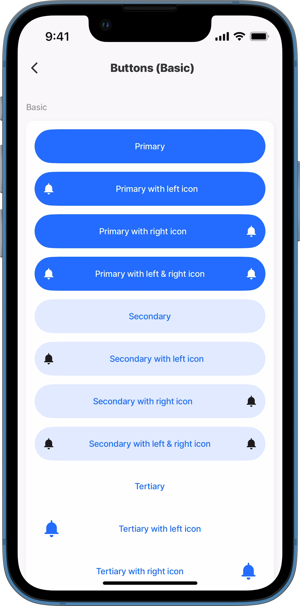
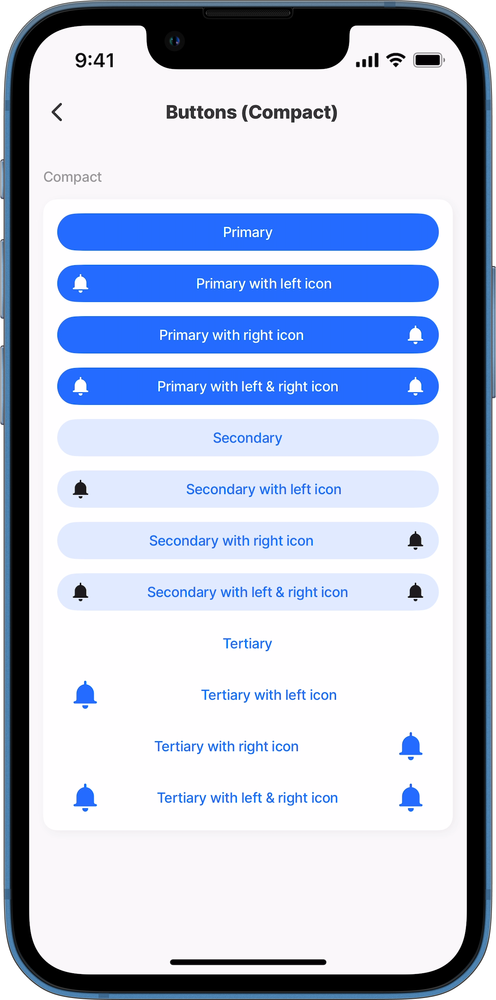
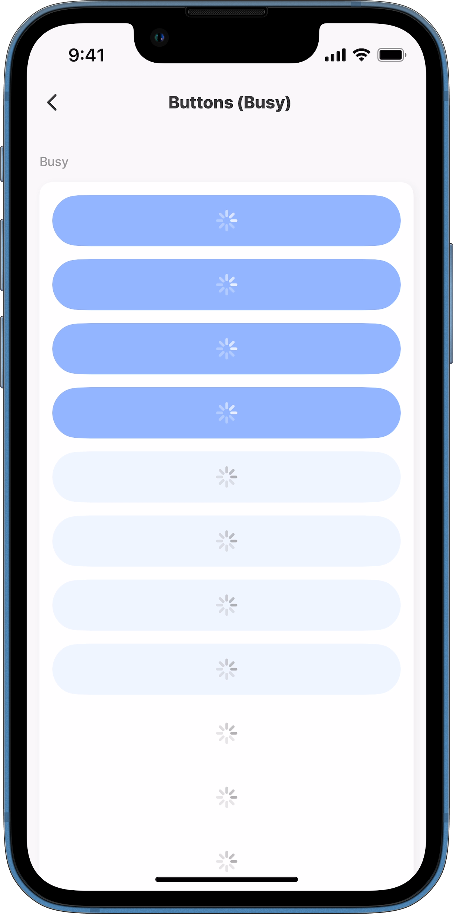
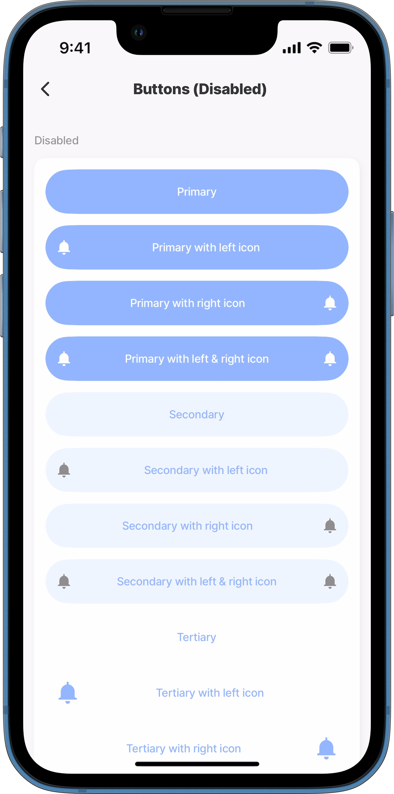
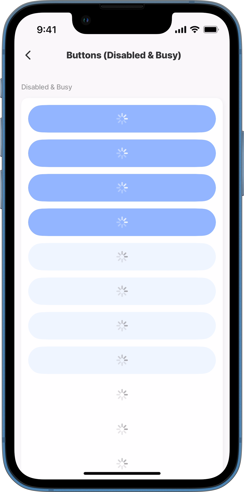

---
layout:
  width: wide
  title:
    visible: true
  description:
    visible: true
  tableOfContents:
    visible: true
  outline:
    visible: true
  pagination:
    visible: true
  metadata:
    visible: true
---

# Button (Alpha)


This feature is currently in its **Alpha** stage of development.

* As an early version, it may not include all planned functionalities and is subject to significant changes based on ongoing development and user feedback.
* In this phase, the feature may contain bugs or behave unpredictably.
* Jigx recommends using standard, fully supported components until this feature has been fully tested and refined.
* We encourage you to provide feedback and report any issues to help us improve and refine the feature for future releases.


The _button_ custom component provides predefined options for designing the UI and tap functionality for a button. For example, your requirement might be a button showing an icon and text with a background color that can be used in multiple jigs in your app.

For steps on creating a custom component, see [How to create a custom component](<Custom components _Alpha_.md>).

## Configuration options

You can use `when` and `instanceId` with `component.button`, add the properties before the `options` property. The available list of options is shown below.

<table><thead><tr><th width="134.7265625">Options</th><th>Value</th></tr></thead><tbody><tr><td><code>icon</code></td><td><code>left</code> - select an icon from the provided list. <code>right</code> - select an icon from the provided list.</td></tr><tr><td><code>isCompact</code></td><td><code>false</code> <code>true</code></td></tr><tr><td><code>onPress</code></td><td>Multiple, use IntelliSense to view the list of available to call. The action is called when the button is pressed.</td></tr><tr><td><code>style</code></td><td><code>isBusy</code> - true/false <code>isDisabled</code> - true/false</td></tr><tr><td><code>title</code></td><td>Provide the text to display on the button. You can use to cater for multiple languages.</td></tr><tr><td><code>type</code></td><td><code>primary</code> - the main button that guides you to complete the most important action on the screen, for example, <em>Approve</em>. <code>secondary</code> - the option that shows when the ellipsis menu is tapped, for example, <em>Reject</em>. <code>tertiary</code> - the second option that shows when the ellipsis menu is tapped, for example, <em>Rework</em>.</td></tr></tbody></table>

## Example and code snippets

The examples use a set of custom components called _sections_. The sections are for titles, spacing, and context. The _sections_ code is available on [GitHub](https://github.com/jigx-com/jigx-samples/tree/main/quickstart/jigx-samples/components/molecules-organisms/sections).

### Buttons-basic



This example shows the custom component that uses the button's basic form. Scroll down for more examples of how you can implement buttons.

**Examples:**

1. See the _section_ component example in [GitHub](https://github.com/jigx-com/jigx-samples/blob/main/quickstart/jigx-samples/components/molecules-organisms/sections/section2.jigx).
2. See the _custom component_ example in [GitHub](https://github.com/jigx-com/jigx-samples/blob/main/quickstart/jigx-samples/components/basic-elements/buttons/button-1.jigx).
3. See the _jig_ example in [GitHub](https://github.com/jigx-com/jigx-samples/blob/main/quickstart/jigx-samples/jigs/custom-components/basic-elements/buttons/buttons-basic.jigx).



<figure><figcaption><p>Buttons basic</p></figcaption></figure>





```yaml
# components/button-1.jigx
type: component.default
children:
  - type: component.card
    options:
      children:
        # Primary buttons
        - type: component.button
          options:
            title: Primary
            type: primary

        - type: component.button
          options:
            title: Primary with left icon
            type: primary
            icon:
              left: alarm-bell

        - type: component.button
          options:
            title: Primary with right icon
            type: primary
            icon:
              right: alarm-bell

        - type: component.button
          options:
            title: Primary with left & right icon
            type: primary
            icon:
              right: alarm-bell
              left: alarm-bell

        # Secondary buttons
        - type: component.button
          options:
            title: Secondary
            type: secondary

        - type: component.button
          options:
            title: Secondary with left icon
            type: secondary
            icon:
              left: alarm-bell

        - type: component.button
          options:
            title: Secondary with right icon
            type: secondary
            icon:
              right: alarm-bell

        - type: component.button
          options:
            title: Secondary with left & right icon
            type: secondary
            icon:
              right: alarm-bell
              left: alarm-bell

        # Tertiary buttons
        - type: component.button
          options:
            title: Tertiary
            type: tertiary

        - type: component.button
          options:
            title: Tertiary with left icon
            type: tertiary
            icon:
              left: alarm-bell

        - type: component.button
          options:
            title: Tertiary with right icon
            type: tertiary
            icon:
              right: alarm-bell

        - type: component.button
          options:
            title: Tertiary with left & right icon
            type: tertiary
            icon:
              right: alarm-bell
              left: alarm-bell
```



```yaml
# jigs/buttons-basic.jigx
title: Buttons (Basic)
type: jig.default
icon: button-play

children:
  # Reference the custom component to display in the jig.
  # This custom component contains the view configuration to show the title.
  - type: component.custom-component
    componentId: section2
    inputs:
      title: "Basic"
  # Reference the custom component to display in the jig
  - type: component.custom-component
    componentId: button-1
```



### Buttons-compact



<figure><figcaption><p>Compact buttons</p></figcaption></figure>



This example shows the custom component that uses compact buttons using the `isCompact` property inside a `component.card`. Compact buttons take up less space, making the screen cleaner and allowing more components to fit on the screen.

**Example:**

1. See the _section_ component example in [GitHub](https://github.com/jigx-com/jigx-samples/blob/main/quickstart/jigx-samples/components/molecules-organisms/sections/section2.jigx).
2. See the _custom component_ example in [GitHub](https://github.com/jigx-com/jigx-samples/blob/main/quickstart/jigx-samples/components/basic-elements/buttons/button-2.jigx).
3. See the _jig_ example in [GitHub](https://github.com/jigx-com/jigx-samples/blob/main/quickstart/jigx-samples/jigs/custom-components/basic-elements/buttons/buttons-compact.jigx).





```yaml
# components/button-2.jigx
type: component.default
children:
  - type: component.card
    options:
      children:
        # Primary button
        - type: component.button
          options:
            title: Primary
            type: primary
            isCompact: true

        - type: component.button
          options:
            title: Primary with left icon
            type: primary
            isCompact: true
            icon:
              left: alarm-bell

        - type: component.button
          options:
            title: Primary with right icon
            type: primary
            isCompact: true
            icon:
              right: alarm-bell

        - type: component.button
          options:
            title: Primary with left & right icon
            type: primary
            isCompact: true
            icon:
              right: alarm-bell
              left: alarm-bell

        # Secondary button
        - type: component.button
          options:
            title: Secondary
            type: secondary
            isCompact: true

        - type: component.button
          options:
            title: Secondary with left icon
            type: secondary
            isCompact: true
            icon:
              left: alarm-bell

        - type: component.button
          options:
            title: Secondary with right icon
            type: secondary
            isCompact: true
            icon:
              right: alarm-bell

        - type: component.button
          options:
            title: Secondary with left & right icon
            type: secondary
            isCompact: true
            icon:
              right: alarm-bell
              left: alarm-bell

        # Tertiary button
        - type: component.button
          options:
            title: Tertiary
            type: tertiary
            isCompact: true

        - type: component.button
          options:
            title: Tertiary with left icon
            type: tertiary
            isCompact: true
            icon:
              left: alarm-bell

        - type: component.button
          options:
            title: Tertiary with right icon
            type: tertiary
            isCompact: true
            icon:
              right: alarm-bell

        - type: component.button
          options:
            title: Tertiary with left & right icon
            type: tertiary
            isCompact: true
            icon:
              right: alarm-bell
              left: alarm-bell
```



```yaml
# jigs/buttons-compact.jigx
title: Buttons (Compact)
type: jig.default
icon: button-play

children:
  # Reference the custom component to display in the jig.
  # This custom component contains the view configuration to show the title.
  - type: component.custom-component
    componentId: section2
    inputs:
      title: "Compact"
  # Reference the custom component to display in the jig.
  # This custom component contains the button configuration.
  - type: component.custom-component
    componentId: button-2
```



### Buttons-busy



This example shows how to set buttons in a custom component to show they are busy by displaying a spinner using the `isBusy` property set to `true` inside a [Card (Alpha)](<Card _Alpha_.md>).

**Examples:**

1. See the _section_ component example in [GitHub](https://github.com/jigx-com/jigx-samples/blob/main/quickstart/jigx-samples/components/molecules-organisms/sections/section2.jigx).
2. See the _custom component_ example in [GitHub](https://github.com/jigx-com/jigx-samples/blob/main/quickstart/jigx-samples/components/basic-elements/buttons/button-3.jigx).
3. See the _jig_ example in [GitHub](https://github.com/jigx-com/jigx-samples/blob/main/quickstart/jigx-samples/jigs/custom-components/basic-elements/buttons/buttons-busy.jigx).



<figure><figcaption><p>Button busy</p></figcaption></figure>





```yaml
# components/button-3.jigx
 type: component.default
children:
  - type: component.card
    options:
      children:
        # Primary button
        - type: component.button
          options:
            title: Primary
            type: primary
            style:
        # Configure the button with a spinner to show it is busy
              isBusy: true

        - type: component.button
          options:
            title: Primary with left icon
            type: primary
            icon:
              left: alarm-bell
            style:
        # Configure the button with a spinner to show it is busy
              isBusy: true

        - type: component.button
          options:
            title: Primary with right icon
            type: primary
            icon:
              right: alarm-bell
            style:
         # Configure the button with a spinner to show it is busy
              isBusy: true

        - type: component.button
          options:
            title: Primary with left & right icon
            type: primary
            icon:
              right: alarm-bell
              left: alarm-bell
            style:
          # Configure the button with a spinner to show it is busy
              isBusy: true

        # Secondary button
        - type: component.button
          options:
            title: Secondary
            type: secondary
            style:
        # Configure the button with a spinner to show it is busy
              isBusy: true

        - type: component.button
          options:
            title: Secondary with left icon
            type: secondary
            icon:
              left: alarm-bell
            style:
          # Configure the button with a spinner to show it is busy
              isBusy: true

        - type: component.button
          options:
            title: Secondary with right icon
            type: secondary
            icon:
              right: alarm-bell
            style:
          # Configure the button with a spinner to show it is busy
              isBusy: true

        - type: component.button
          options:
            title: Secondary with left & right icon
            type: secondary
            icon:
              right: alarm-bell
              left: alarm-bell
            style:
           # Configure the button with a spinner to show it is busy
              isBusy: true

        # Tertiary button
        - type: component.button
          options:
            title: Tertiary
            type: tertiary
            style:
          # Configure the button with a spinner to show it is busy
              isBusy: true
        - type: component.button
          options:
            title: Tertiary with left icon
            type: tertiary
            icon:
              left: alarm-bell
            style:
              isBusy: true
        - type: component.button
          options:
            title: Tertiary with right icon
            type: tertiary
            icon:
              right: alarm-bell
            style:
           # Configure the button with a spinner to show it is busy
              isBusy: true
        - type: component.button
          options:
            title: Tertiary with left & right icon
            type: tertiary
            icon:
              right: alarm-bell
              left: alarm-bell
            style:
           # Configure the button with a spinner to show it is busy
              isBusy: true
```



```yaml
# jigs/buttons-busy.jigx
title: Buttons (Busy)
type: jig.default
icon: button-play

children:
  # Reference the custom component to display in the jig.
  # This custom component contains the view configuration to show the title.
  - type: component.custom-component
    componentId: section2
    inputs:
      title: "Busy"

  - type: component.custom-component
    componentId: button-3
```



### Buttons-disabled



<figure><figcaption><p>Button disabled</p></figcaption></figure>



This example shows how to disable a button on a custom component using the `isDisabled: true` property inside a [Card (Alpha)](<Card _Alpha_.md>).

**Examples:**

1. See the _section_ component example in [GitHub](https://github.com/jigx-com/jigx-samples/blob/main/quickstart/jigx-samples/components/molecules-organisms/sections/section2.jigx).
2. See the _custom component_ example in [GitHub](https://github.com/jigx-com/jigx-samples/blob/main/quickstart/jigx-samples/components/basic-elements/buttons/button-4.jigx).
3. See the _jig_ example in [GitHub](https://github.com/jigx-com/jigx-samples/blob/main/quickstart/jigx-samples/jigs/custom-components/basic-elements/buttons/buttons-disabled.jigx).





```yaml
# components/button-4.jigx
type: component.default
children:
  - type: component.card
    options:
      children:
        # Primary button
        - type: component.button
          options:
            title: Primary
            type: primary
            style:
              # Disable the button to prevent it from being tapped.
              isDisabled: true

        - type: component.button
          options:
            title: Primary with left icon
            type: primary
            icon:
              left: alarm-bell
            style:
              # Disable the button to prevent it from being tapped.
              isDisabled: true

        - type: component.button
          options:
            title: Primary with right icon
            type: primary
            icon:
              right: alarm-bell
            style:
              # Disable the button to prevent it from being tapped.
              isDisabled: true

        - type: component.button
          options:
            title: Primary with left & right icon
            type: primary
            icon:
              right: alarm-bell
              left: alarm-bell
            style:
              # Disable the button to prevent it from being tapped.
              isDisabled: true

        # Secondary button
        - type: component.button
          options:
            title: Secondary
            type: secondary
            style:
              # Disable the button to prevent it from being tapped.
              isDisabled: true

        - type: component.button
          options:
            title: Secondary with left icon
            type: secondary
            icon:
              left: alarm-bell
            style:
              # Disable the button to prevent it from being tapped.
              isDisabled: true

        - type: component.button
          options:
            title: Secondary with right icon
            type: secondary
            icon:
              right: alarm-bell
            style:
              # Disable the button to prevent it from being tapped.
              isDisabled: true

        - type: component.button
          options:
            title: Secondary with left & right icon
            type: secondary
            icon:
              right: alarm-bell
              left: alarm-bell
            style:
              # Disable the button to prevent it from being tapped.
              isDisabled: true

          # Tertiary button
        - type: component.button
          options:
            title: Tertiary
            type: tertiary
            style:
              # Disable the button to prevent it from being tapped.
              isDisabled: true

        - type: component.button
          options:
            title: Tertiary with left icon
            type: tertiary
            icon:
              left: alarm-bell
            style:
              # Disable the button to prevent it from being tapped.
              isDisabled: true

        - type: component.button
          options:
            title: Tertiary with right icon
            type: tertiary
            icon:
              right: alarm-bell
            style:
              # Disable the button to prevent it from being tapped.
              isDisabled: true

        - type: component.button
          options:
            title: Tertiary with left & right icon
            type: tertiary
            icon:
              right: alarm-bell
              left: alarm-bell
            style:
              # Disable the button to prevent it from being tapped.
              isDisabled: true
```



```yaml
# jigs/buttons-disabled.jigx
title: Buttons (Disabled)
type: jig.default
icon: button-play

children:
  # Reference the custom component to display in the jig.
  # This custom component contains the view configuration to show the title.
  - type: component.custom-component
    componentId: section2
    inputs:
      title: "Disabled"
  # Reference the custom component to display the buttons in the jig.
  - type: component.custom-component
    componentId: button-4
```



### Buttons-disabled and busy



This example shows a custom component with a combination of the buttons as disabled and busy using the button `style:` properties, `isDisabled: true` and `isBusy: true`.

**Examples:**

1. See the _section_ component example in [GitHub](https://github.com/jigx-com/jigx-samples/blob/main/quickstart/jigx-samples/components/molecules-organisms/sections/section2.jigx).
2. See the _custom component_ example in [GitHub](https://github.com/jigx-com/jigx-samples/blob/main/quickstart/jigx-samples/components/basic-elements/buttons/button-5.jigx).
3. See the _jig_ example in [GitHub](https://github.com/jigx-com/jigx-samples/blob/main/quickstart/jigx-samples/jigs/custom-components/basic-elements/buttons/buttons-disabled-busy.jigx).



<figure><figcaption><p>Buttons disabled &#x26; busy</p></figcaption></figure>





```yaml
# components/button-5.jigx
type: component.default
children:
  - type: component.card
    options:
      children:
        # Primary button
        - type: component.button
          options:
            title: Primary
            type: primary
            # Combine the style properties to indicate that the button is both busy & disabled.
            style:
              isDisabled: true
              isBusy: true

        - type: component.button
          options:
            title: Primary with left icon
            type: primary
            icon:
              left: alarm-bell
            style:
              # Combine the style properties to indicate that the button is both busy & disabled.
              isDisabled: true
              isBusy: true

        - type: component.button
          options:
            title: Primary with right icon
            type: primary
            icon:
              right: alarm-bell
            style:
              # Combine the style properties to indicate that the button is both busy & disabled.
              isDisabled: true
              isBusy: true

        - type: component.button
          options:
            title: Primary with left & right icon
            type: primary
            icon:
              right: alarm-bell
              left: alarm-bell
            style:
              # Combine the style properties to indicate that the button is both busy & disabled.
              isDisabled: true
              isBusy: true

        # Secondary button
        - type: component.button
          options:
            title: Secondary
            type: secondary
            style:
              # Combine the style properties to indicate that the button is both busy & disabled.
              isDisabled: true
              isBusy: true

        - type: component.button
          options:
            title: Secondary with left icon
            type: secondary
            icon:
              left: alarm-bell
            style:
              # Combine the style properties to indicate that the button is both busy & disabled.
              isDisabled: true
              isBusy: true

        - type: component.button
          options:
            title: Secondary with right icon
            type: secondary
            icon:
              right: alarm-bell
            style:
              # Combine the style properties to indicate that the button is both busy & disabled.
              isDisabled: true
              isBusy: true

        - type: component.button
          options:
            title: Secondary with left & right icon
            type: secondary
            icon:
              right: alarm-bell
              left: alarm-bell
            style:
              # Combine the style properties to indicate that the button is both busy & disabled.
              isDisabled: true
              isBusy: true

        # Tertiary button
        - type: component.button
          options:
            title: Tertiary
            type: tertiary
            style:
              # Combine the style properties to indicate that the button is both busy & disabled.
              isDisabled: true
              isBusy: true

        - type: component.button
          options:
            title: Tertiary with left icon
            type: tertiary
            icon:
              left: alarm-bell
            style:
              # Combine the style properties to indicate that the button is both busy & disabled.
              isDisabled: true
              isBusy: true

        - type: component.button
          options:
            title: Tertiary with right icon
            type: tertiary
            icon:
              right: alarm-bell
            style:
              # Combine the style properties to indicate that the button is both busy & disabled.
              isDisabled: true
              isBusy: true

        - type: component.button
          options:
            title: Tertiary with left & right icon
            type: tertiary
            icon:
              right: alarm-bell
              left: alarm-bell
            style:
              # Combine the style properties to indicate that the button is both busy & disabled.
              isDisabled: true
              isBusy: true
```



```yaml
# jigs/buttons-disabled-busy.jigx
title: Buttons (Disabled & Busy)
type: jig.default
icon: button-play

children:
  # Reference the custom component to display in the jig.
  # This custom component contains the view configuration to show the title.
  - type: component.custom-component
    componentId: section2
    inputs:
      title: "Disabled & Busy"
  # Reference the custom component to display the buttons in the jig.
  - type: component.custom-component
    componentId: button-5
```


