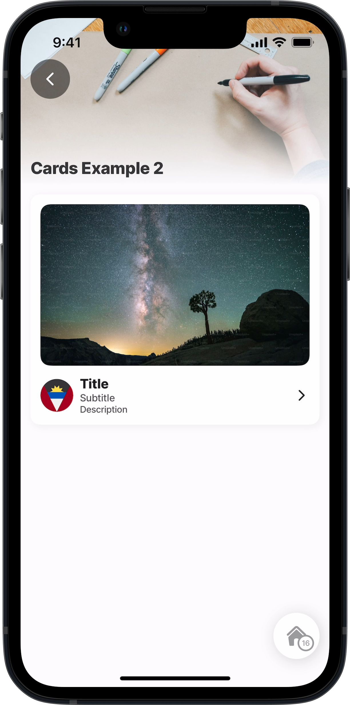
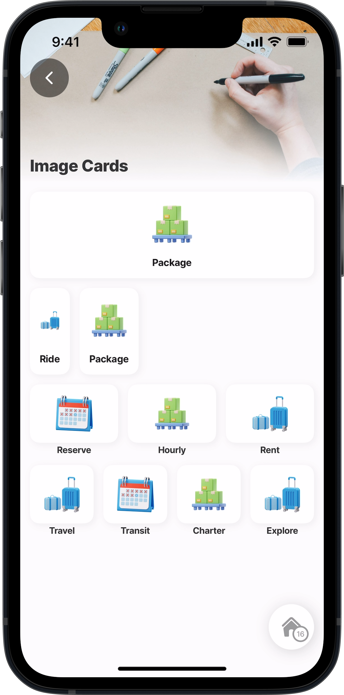
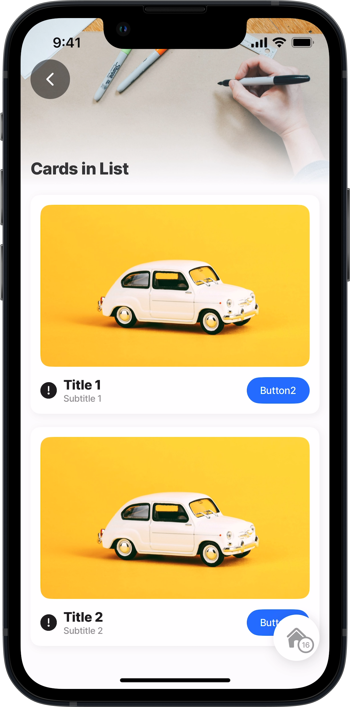
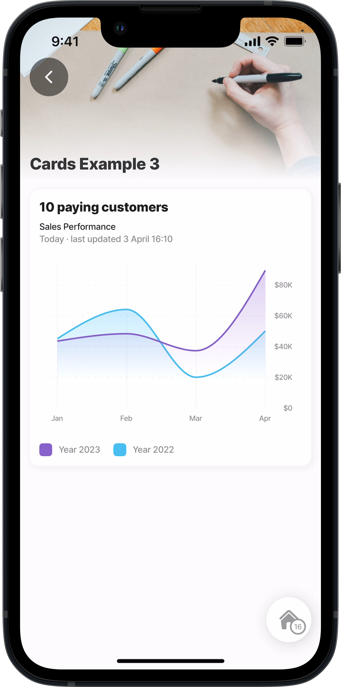
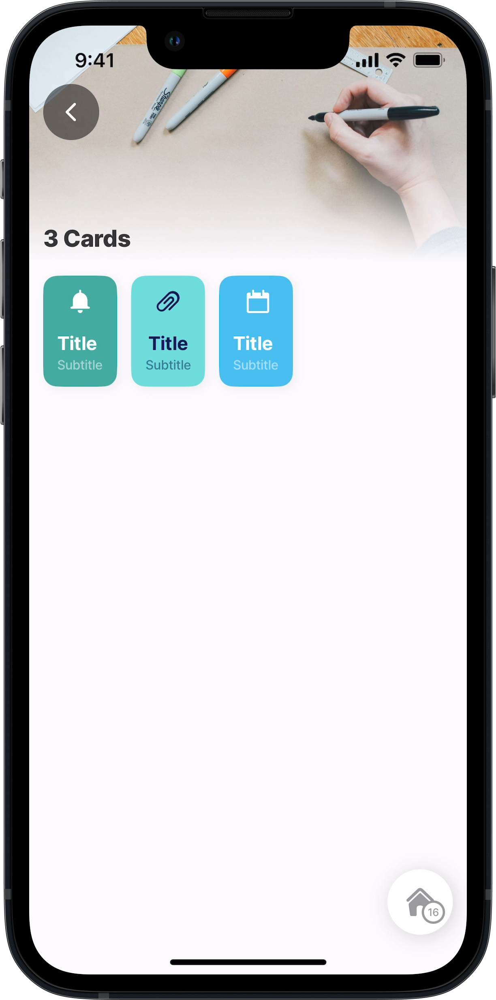

# Card (Alpha)


This feature is currently in its **Alpha** stage of development.

* As an early version, it may not include all planned functionalities and is subject to significant changes based on ongoing development and user feedback.
* In this phase, the feature may contain bugs or behave unpredictably.
* Jigx recommends using standard, fully supported components until this feature has been fully tested and refined.
* We encourage you to provide feedback and report any issues to help us improve and refine the feature for future releases.


The _card_ component adds context or highlights information in the jig. The card itself is a container with integrated padding, background, and row rules, meaning every component placed in the card will be represented as a separate row with spaces between the rows.

For steps on creating a custom component, see [How to create a custom component](<../Custom components _Alpha_.md>).

## Configuration options

You can use `when` and `instanceId` with `component.card`, add the properties before the `options` property. The available list of options is shown below.

<table><thead><tr><th width="135.02734375">Options</th><th>Value</th></tr></thead><tbody><tr><td><code>color</code></td><td>Multiple, use IntelliSense to view the available list.</td></tr><tr><td><code>direction</code></td><td><code>row</code> - creates a vertical layout in a row. <code>column</code> - creates a horizontal layout in a column.</td></tr><tr><td><code>emphasis</code></td><td><code>extra-low</code>, <code>low</code>, <code>low-medium</code>, <code>medium</code>, <code>high</code></td></tr><tr><td><code>onPress</code></td><td>Multiple, use IntelliSense to view the available list of . The action is called when the card is pressed.</td></tr><tr><td><code>style</code></td><td><code>isDisabled</code> - true or false</td></tr></tbody></table>

## Considerations

* The card component has predefined behavior for its children, ensuring the children's components, such as images, are flexible by default.
* The [View (Alpha)](<View _Alpha_.md>) component combined with the card enables the precision of the layout design. For example, the view can be used to create rows to contain cards and provide spacing between the cards.
* When using `component.image` on custom components, the `isFlexible` property is available. If the property is set to `true` the image will take the parent's space. If the parent has zero height or zero width, the image will not render. It would be best if you decided either to set the `height` and `width` on the image or set `isFlexible` to `true`.
* The recommended approach when using `component.image` is to use [component view](<View _Alpha_.md>) as a wrapper component with a defined `height,` e.g., 100, and setting `isFlexible: true` for each image. This allows the images to grow into the parent component space.
* By default, `children` components are stacked in a column.

## Example and code snippets

### Card



This example shows a basic `component.card` containing a `component.image`. A `component.view` is used to create the layout of a row under the card containing the `icons`, and `text` components.

**Examples:**

1. See the _custom component_ example in [GitHub](https://github.com/jigx-com/jigx-samples/blob/d5eb38a64423482ed10703b0b2889709beee309c/quickstart/jigx-samples/components/templates/cards/card2.jigx).
2. See the _jig_ example in [GitHub](https://github.com/jigx-com/jigx-samples/blob/main/quickstart/jigx-samples/jigs/custom-components/molecules-organisms/cards/cards-example2.jigx).



<figure><figcaption><p>Card with icon &#x26; text</p></figcaption></figure>





```yaml
# components/card2.jigx
type: component.default

children:      
  - type: component.card
    options:
      direction: column
      children:
        - type: component.image
          options:
            source:
              uri: https://plus.unsplash.com/premium_photo-1675826774817-fe983ceb0475?ixlib=rb-4.0.3&ixid=MnwxMjA3fDB8MHxwaG90by1wYWdlfHx8fGVufDB8fHx8&auto=format&fit=crop&w=2070&q=80
        - type: component.view
          options:
            style:
              flex: 
                direction: row
                grow: 1
              gap: small
              justifyContent: center              
            children:     
              # Left element
              - type: component.icon
                options:
                  icon: ag                      
              # Content            
              - type: component.view
                options:
                  style:
                    flex: 
                      direction: column
                      grow: 1
                    justifyContent: center              
                  children:
                    # Title
                    - type: component.text
                      options:
                        value: Title
                        size: medium    
                        align: left
                        weight: extra-bold
                    # Subtitle 
                    - type: component.text
                      options:
                        value: Subtitle
                        size: regular
                        align: left
                        emphasis: high
                    # Description 
                    - type: component.text
                      options:
                        value: Description
                        size: small
                        align: left   
                        emphasis: high
                    
              # Right element
              - type: component.icon
                options:
                  icon: arrow-right  
```



```yaml
# jigs/card-example2.jigx
title: Cards Example 2
type: jig.default
icon: credit-card
badge: 1

header:
  type: component.jig-header
  options:
    height: small
    children:
      type: component.image
      options:
        source:
          uri: https://images.unsplash.com/photo-1493932484895-752d1471eab5?ixlib=rb-4.0.3&ixid=MnwxMjA3fDB8MHxwaG90by1wYWdlfHx8fGVufDB8fHx8&auto=format&fit=crop&w=2076&q=80
# Reference the custom component to display the card in the jig.   
children:
  - type: component.custom-component
    componentId: card2
```



### Cards with images



This example shows creating a custom component using the `card` and `image` components. The `view` component creates the screen layout of columns and rows.

**Examples:**

1. See the _custom component_ example in [GitHub](https://github.com/jigx-com/jigx-samples/blob/main/quickstart/jigx-samples/components/templates/cards/cards-images.jigx).
2. See the _jig_ example in [GitHub](https://github.com/jigx-com/jigx-samples/blob/d5eb38a64423482ed10703b0b2889709beee309c/quickstart/jigx-samples/components/templates/cards/cards-images.jigx).



<figure><figcaption><p>Cards with images</p></figcaption></figure>





```yaml
# components/cards-images.jigx
type: component.default
children:
# Use the view component to create the screen layout of columns and rows,
# and padding between the card rows.
- type: component.view
  options:
    style:
      flex: 
        direction: column
        grow: 1
      gap: medium
    children:  
      # One card in a column 
      - type: component.card
        options:
          direction: column
          children:
      # Add the image component    
            - type: component.image
              options:
                source:
                  uri: https://t14345253.p.clickup-attachments.com/t14345253/18ebe021-fdd9-4695-b04d-88ddf0ba08f4/package.png?view=open
                height: 56
                resizeMode: contain
            - type: component.text
              options:
                value: Package
                weight: bold
                align: center      
      # Two cards in a row with a medium gap between the rows
      - type: component.view
        options:
          style:
            flex: 
              direction: row
              grow: 1
            gap: medium
          children:     
            - type: component.card
              options:
                direction: column
                children:
                  - type: component.image
                    options:
                      source:
                        uri: https://t14345253.p.clickup-attachments.com/t14345253/3debc4ea-aa07-48e5-9cec-17253988a98c/luggage.png
                      height: 56                       
                      resizeMode: contain
                  - type: component.text
                    options:
                      value: Ride
                      weight: bold
                      align: left     
            - type: component.card
              options:
                direction: column
                children:
                  - type: component.image
                    options:
                      source:
                        uri: https://t14345253.p.clickup-attachments.com/t14345253/18ebe021-fdd9-4695-b04d-88ddf0ba08f4/package.png?view=open
                      height: 56
                      resizeMode: contain
                  - type: component.text
                    options:
                      value: Package
                      weight: bold
                      align: left                               

      # Three cards in a row with a minimal gap between the rows
      - type: component.view
        options:
          style:
            flex: 
              direction: row
              grow: 1
            gap: medium
          children:
            - type: component.view
              options:
                style:
                  flex: 
                    direction: column
                    grow: 1
                    basis: 1
                  gap: minimal
                children:
                  - type: component.card
                    options:
                      children:
                        - type: component.image
                          options:
                            source:
                              uri: https://t14345253.p.clickup-attachments.com/t14345253/482e8b4f-9580-4f2a-b724-3afaef94e66f/reserve.png
                            height: 48
                            resizeMode: contain
                  - type: component.text
                    options:
                      value: Reserve
                      weight: bold
                      align: center
                      size: small       
            - type: component.view
              options:
                style:
                  flex: 
                    direction: column
                    grow: 1
                    basis: 1
                  gap: minimal
                children:
                  - type: component.card
                    options:
                      children:
                        - type: component.image
                          options:
                            source:
                              uri: https://t14345253.p.clickup-attachments.com/t14345253/18ebe021-fdd9-4695-b04d-88ddf0ba08f4/package.png?view=open
                            height: 48
                            resizeMode: contain
                  - type: component.text
                    options:
                      value: Hourly
                      weight: bold
                      align: center
                      size: small       
            - type: component.view
              options:
                style:
                  flex: 
                    direction: column
                    grow: 1
                    basis: 1                    
                  gap: minimal
                children:
                  - type: component.card
                    options:
                      children:
                        - type: component.image
                          options:
                            source:
                              uri: https://t14345253.p.clickup-attachments.com/t14345253/3debc4ea-aa07-48e5-9cec-17253988a98c/luggage.png
                            height: 48
                            resizeMode: contain
                  - type: component.text
                    options:
                      value: Rent
                      weight: bold
                      align: center
                      size: small       
      # Four cards
      - type: component.view
        options:
          style:
            flex: 
              direction: row
              grow: 1
            gap: medium
          children:
            - type: component.view
              options:
                style:
                  flex: 
                    direction: column
                    grow: 1
                    basis: 1
                  gap: minimal
                children:
                  - type: component.card
                    options:
                      children:
                        - type: component.image
                          options:
                            source:
                              uri: https://t14345253.p.clickup-attachments.com/t14345253/3debc4ea-aa07-48e5-9cec-17253988a98c/luggage.png
                            height: 48
                            resizeMode: contain
                  - type: component.text
                    options:
                      value: Travel
                      weight: bold
                      align: center
                      size: small       
            - type: component.view
              options:
                style:
                  flex: 
                    direction: column
                    grow: 1
                    basis: 1
                  gap: minimal
                children:
                  - type: component.card
                    options:
                      children:
                        - type: component.image
                          options:
                            source:
                              uri: https://t14345253.p.clickup-attachments.com/t14345253/482e8b4f-9580-4f2a-b724-3afaef94e66f/reserve.png
                            height: 48
                            resizeMode: contain
                  - type: component.text
                    options:
                      value: Transit
                      weight: bold
                      align: center
                      size: small       
            - type: component.view
              options:
                style:
                  flex: 
                    direction: column
                    grow: 1
                    basis: 1
                  gap: minimal
                children:
                  - type: component.card
                    options:
                      children:
                        - type: component.image
                          options:
                            source:
                              uri: https://t14345253.p.clickup-attachments.com/t14345253/18ebe021-fdd9-4695-b04d-88ddf0ba08f4/package.png?view=open
                            height: 48
                            resizeMode: contain
                  - type: component.text
                    options:
                      value: Charter
                      weight: bold
                      align: center
                      size: small       
            - type: component.view
              options:
                style:
                  flex: 
                    direction: column
                    grow: 1
                    basis: 1
                  gap: minimal
                children:
                  - type: component.card
                    options:
                      children:
                        - type: component.image
                          options:
                            source:
                              uri: https://t14345253.p.clickup-attachments.com/t14345253/3debc4ea-aa07-48e5-9cec-17253988a98c/luggage.png
                            height: 48
                            resizeMode: contain
                  - type: component.text
                    options:
                      value: Explore
                      weight: bold
                      align: center
                      size: small          
```



```yaml
# jigs/cards-image.jigx
title: Image Cards
type: jig.default
icon: credit-card

header:
  type: component.jig-header
  options:
    height: small
    children: 
      type: component.image
      options:
        source:
          uri: https://images.unsplash.com/photo-1493932484895-752d1471eab5?ixlib=rb-4.0.3&ixid=MnwxMjA3fDB8MHxwaG90by1wYWdlfHx8fGVufDB8fHx8&auto=format&fit=crop&w=2076&q=80

children:
# Reference the custom component to display the card in the jig.  
  - type: component.custom-component
    componentId: cards-images
```



### Cards in a list



This example shows how to use the `component.card` in a `component.list`. In the card is an `image` and `view` component. the `view` is used to create the layout positions for the `icon`, `text,` and `button` components below the `image`.

**Examples:**

1. See the _custom component_ example in [GitHub](https://github.com/jigx-com/jigx-samples/blob/main/quickstart/jigx-samples/components/templates/cards/cards-list.jigx).
2. See the _jig_ example in [GitHub](https://github.com/jigx-com/jigx-samples/blob/d5eb38a64423482ed10703b0b2889709beee309c/quickstart/jigx-samples/jigs/custom-components/molecules-organisms/cards/cards-in-list.jigx).



<figure><figcaption><p>List of cards</p></figcaption></figure>





```yaml
# components/cards-list.jigx   
type: component.default
children:  
# Wrap the images in a card. 
  - type: component.card
    options:
      children:     
      - type: component.image
        options:
          source:
            uri: https://images.unsplash.com/photo-1581235720704-06d3acfcb36f?ixlib=rb-4.0.3&ixid=MnwxMjA3fDB8MHxwaG90by1wYWdlfHx8fGVufDB8fHx8&auto=format&fit=crop&w=1760&q=80 
      # Use the view component to create the screen layout of rows,
      # and padding between the card rows.    
      - type: component.view
        options:
          style:
            padding: 
              bottom: medium
              horizontal: medium
          children:
            # Use the view to add a row in the card and place the icon and 
            # button in the row.          
            - type: component.view
              options:
                style:
                  alignItems: center
                  flex: 
                    direction: row
                    grow: 1
                  gap: small
                  justifyContent: space-between                
                children:             
                  - type: component.icon
                    options:
                     icon: =@ctx.inputs.icon
                  - type: component.text
                    options:
                     align: left
                     size: medium
                     value: =@ctx.inputs.title
                     weight: extra-bold 
                  - type: component.text
                    options:
                      align: left
                      emphasis: medium
                      size: small
                      value: =@ctx.inputs.subtitle  
                  - type: component.button
                    options:
                      title: =@ctx.inputs.button
                      isCompact: true
                      onPress:
                        type: action.go-back
                      type: primary 
```



```yaml
# jigs/cards-in-list.jigx   
title: Cards in List
type: jig.default
icon: credit-card

header:
  type: component.jig-header
  options:
    height: small
    children: 
      type: component.image
      options:
        source:
          uri: https://images.unsplash.com/photo-1493932484895-752d1471eab5?ixlib=rb-4.0.3&ixid=MnwxMjA3fDB8MHxwaG90by1wYWdlfHx8fGVufDB8fHx8&auto=format&fit=crop&w=2076&q=80

datasources:
  cardList:
    type: datasource.static
    options:
      data:
        - icon: alert-circle
          title: Title 1
          subtitle: Subtitle 1
          button: Button2
        - icon: alert-circle
          title: Title 2
          subtitle: Subtitle 2
          button: Button2

children:   
  - type: component.list
    options:
      data: =@ctx.datasources.cardList
      maximumItemsToRender: 8
      item: 
        # Reference the custom component inside the list to display the card
        # in the jig. 
        # Inputs referencing the datasource are required to display the icon, 
        # title, subtitle and button on the card.        
        type: component.custom-component
        componentId: cards-list
        inputs:
          icon: =@ctx.current.item.icon
          title: =@ctx.current.item.title
          subtitle:  =@ctx.current.item.subtitle
          button: =@ctx.current.item.button
```



### Card with charts



<figure><figcaption><p>Chart in a card</p></figcaption></figure>



This example demonstrates how to show a `line-chart` component in a `component.card`. Take note of how the layout configuration is created by using the `component.view` multiple times and even inside another `component.view`. In the jig configuration `inputs` are required for the chart in the custom component to reference the datasource.

**Examples:**

1. See the _custom component_ example in [GitHub](https://github.com/jigx-com/jigx-samples/blob/main/quickstart/jigx-samples/components/templates/cards/cards-chart.jigx)
2. See the _jig_ example in [GitHub](https://github.com/jigx-com/jigx-samples/blob/d5eb38a64423482ed10703b0b2889709beee309c/quickstart/jigx-samples/jigs/custom-components/molecules-organisms/cards/cards-example3.jigx).





```yaml
# components/cards-chart.jigx
type: component.default
children:
- type: component.view
  options:
    style:
      flex: 
        direction: column
        grow: 1
      gap: medium
    children: 
      # One card
      - type: component.card
        options:
          direction: column
          children:
            - type: component.view
              options:
                style:
                  flex: 
                    grow: 1
                    direction: row
                  justifyContent: space-between
                  alignItems: center
                  gap: small
                children:
                  # Content     
                  - type: component.view
                    options:
                      style:
                        flex: 
                          grow: 1
                          direction: column
                        gap: small
                      children:
                        - type: component.text
                          options:
                            value: =@ctx.inputs.title
                            align: left
                            size: medium
                            weight: extra-bold
                        - type: component.view
                          options:
                            style:
                              flex: 
                                grow: 1
                                direction: column
                              gap: minimal
                            children:                            
                              - type: component.text
                                options:
                                  value: =@ctx.inputs.subtitle
                                  align: left
                                  size: small
                              - type: component.text
                                options:
                                  value: =@ctx.inputs.subtitle2
                                  align: left
                                  size: small
                                  emphasis: medium                            
                  
            - type: component.line-chart
              options:
                plotOptions:
                  series:
                    marker:
                      isHidden: true
                yAxis:
                  min: 0
                  labels:
                    format:
                      compactDisplay: short
                      notation: compact
                      numberStyle: currency  
                xAxis:
                  categories:
                    - "Jan"
                    - "Feb"
                    - "Mar"
                    - "Apr"
                  labels:
                    format:
                      compactDisplay: short
                      notation: compact
                      numberStyle: currency
                series:
                  - data: =@ctx.inputs.series1
                    layout: area-gradient
                    animation:
                      direction: bottom-to-top
                    color: =@ctx.inputs.color1
                  - data: =@ctx.inputs.series2
                    layout: area-gradient
                    animation:
                      direction: bottom-to-top
                    color: =@ctx.inputs.color2
                  - data: =@ctx.inputs.series3
                    layout: area-gradient
                    animation:
                      direction: bottom-to-top
                    color: =@ctx.inputs.color3
            - type: component.view
              options:
                style:
                  flex:                 
                    direction: row
                    grow: 0
                  gap: regular
                  alignItems: flex-start
                children:
                  # Content     
                  - type: component.view
                    options:
                      style:
                        flex: 
                          direction: row
                        alignItems: center
                        gap: small
                      children:
                        - type: component.view
                          options:
                            style:
                              height: 16
                              width: 16
                              radius: tiny
                              background:
                                color: =@ctx.inputs.color2
                            children:
                              - type: component.avatar
                                options:
                                  title: test
                                when: false                       
                        - type: component.text
                          options:
                            value: Year 2023
                            align: left
                            size: small
                            emphasis: medium                            
                  - type: component.view
                    options:
                      style:
                        flex:                         
                          direction: row
                        alignItems: center
                        gap: small
                      children:
                        - type: component.view
                          options:
                            style:
                              height: 16
                              width: 16
                              radius: tiny
                              background:
                                color: =@ctx.inputs.color1
                            children:
                              - type: component.avatar
                                options:
                                  title: test
                                when: false
                        - type: component.text
                          options:
                            value: Year 2022
                            align: left
                            size: small
                            emphasis: medium           
```



```yaml
# jigs/cards-custom-components.jigx
title: Cards Example 3
type: jig.default
icon: credit-card

header:
  type: component.jig-header
  options:
    height: small
    children: 
      type: component.image
      options:
        source:
          uri: https://images.unsplash.com/photo-1493932484895-752d1471eab5?ixlib=rb-4.0.3&ixid=MnwxMjA3fDB8MHxwaG90by1wYWdlfHx8fGVufDB8fHx8&auto=format&fit=crop&w=2076&q=80

datasources:
  chart:
    type: datasource.static
    options:
      data:    
        - title: "10 paying customers"
          subtitle: Sales Performance
          subtitle2: Today · last updated 3 April 16:10
          color1: color9
          color2: color5
  
  series1:
    type: datasource.static
    options:
      data:
        - 45000
        - 64000
        - 20000
        - 50000        
  
  series2:
    type: datasource.static
    options:
      data:
        - 43445
        - 48230
        - 37230
        - 89400

children:
  # Reference the custom component to display the card in the jig. 
  # Inputs referencing the datasource are required to display the chart data,
  # on the card.   
  - type: component.custom-component
    componentId: cards-chart
    inputs:
      series1: =@ctx.datasources.series1
      series2: =@ctx.datasources.series2
      title: =@ctx.datasources.chart.title
      subtitle:  =@ctx.datasources.chart.subtitle
      subtitle2:  =@ctx.datasources.chart.subtitle2
      color1:  =@ctx.datasources.chart.color1
      color2:  =@ctx.datasources.chart.color2
```



### Multiple horizontal cards



This example demonstrates how to use the `view` component to create the row layout for multiple `card` components to create three cards displayed horizontally.

Take note of how the layout configuration is created by using the `view` component multiple times and even inside the `card` to create the correct layout for the `icon` and `text` components.

**Examples:**

1. See the _custom component_ example in [GitHub](https://github.com/jigx-com/jigx-samples/blob/main/quickstart/jigx-samples/components/templates/cards/cards.jigx).
2. See the _jig_ example in [GitHub](https://github.com/jigx-com/jigx-samples/blob/d5eb38a64423482ed10703b0b2889709beee309c/quickstart/jigx-samples/jigs/custom-components/molecules-organisms/cards/cards3.jigx).



<figure><figcaption><p>Multiple cards shown horizontally</p></figcaption></figure>





```yaml
# components/cards.jigx
type: component.default
children:
# Create 1 row
  - type: component.view
    options:
      style:
        flex: 
          direction: row
          grow: 1
        gap: medium
      # Add the first card to the row        
      children:
        - type: component.card
          options:
            color: color6
            children:
              # Use the view inside the card to create the layout of the icons
              # and text.            
              - type: component.view
                options:
                  style:
                    alignItems: flex-start
                    gap: regular
                  children:
                    - type: component.icon
                      options:
                        icon: alarm-bell
                    - type: component.view
                      options:
                        style: 
                          gap: minimal
                        children:
                          - type: component.text
                            options:
                              value: Title
                              weight: bold
                              size: medium
                          - type: component.text
                            options:
                              value: Subtitle
                              emphasis: medium
                              size: small
        # Add the second card.
        - type: component.card
          options:
            color: color12
            children:
              - type: component.view
                options:
                  style:
                    alignItems: center
                    gap: regular
                  children:
                    - type: component.icon
                      options:
                        icon: attachment
                    - type: component.view
                      options:
                        style: 
                          gap: minimal
                        children:
                          - type: component.text
                            options:
                              value: Title
                              weight: bold
                              align: center
                              size: medium
                          - type: component.text
                            options:
                              value: Subtitle
                              emphasis: medium
                              align: center
                              size: small
        # Add the third card.
        - type: component.card
          options:
            color: color9
            children:
              - type: component.view
                options:
                  style:
                    alignItems: flex-end
                    gap: regular
                  children:
                    - type: component.view
                      options:
                        style:
                          padding: 
                            right: small
                        children:
                          - type: component.icon
                            options:
                              icon: calendar
                    - type: component.view
                      options:
                        style: 
                          gap: minimal
                        children:
                          - type: component.text
                            options:
                              value: Title
                              weight: bold
                              size: medium   
                          - type: component.text
                            options:
                              value: Subtitle
                              emphasis: medium                      
                              size: small   
```



```yaml
# jigs/cards3.jigx
title: 3 Cards
type: jig.default
icon: card-add-1

header:
  type: component.jig-header
  options:
    height: small
    children: 
      type: component.image
      options:
        source:
          uri: https://images.unsplash.com/photo-1493932484895-752d1471eab5?ixlib=rb-4.0.3&ixid=MnwxMjA3fDB8MHxwaG90by1wYWdlfHx8fGVufDB8fHx8&auto=format&fit=crop&w=2076&q=80

children:
  # Reference the custom component to display the card in the jig. 
  - type: component.custom-component
    componentId: cards
```



### Other card examples

Explore a variety of additional code examples demonstrating the use of the card component on [GitHub](https://github.com/jigx-com/jigx-samples/tree/main/quickstart/jigx-samples/components/templates/cards). These examples showcase different configurations and use cases to help you get the most out of the card component.

* [Card Example 1](https://github.com/jigx-com/jigx-samples/blob/d5eb38a64423482ed10703b0b2889709beee309c/quickstart/jigx-samples/jigs/custom-components/molecules-organisms/cards/cards-example1.jigx)
* [Cards with graph](https://github.com/jigx-com/jigx-samples/blob/d5eb38a64423482ed10703b0b2889709beee309c/quickstart/jigx-samples/jigs/custom-components/molecules-organisms/cards/card-with-graph.jigx)
* [Cards-Flip](https://github.com/jigx-com/jigx-samples/blob/d5eb38a64423482ed10703b0b2889709beee309c/quickstart/jigx-samples/jigs/custom-components/molecules-organisms/cards/flip-cards.jigx)
* [Cards Next Step](https://github.com/jigx-com/jigx-samples/blob/d5eb38a64423482ed10703b0b2889709beee309c/quickstart/jigx-samples/jigs/custom-components/molecules-organisms/cards/cards-next-step.jigx)
* [Cards (Two)](https://github.com/jigx-com/jigx-samples/blob/d5eb38a64423482ed10703b0b2889709beee309c/quickstart/jigx-samples/jigs/custom-components/molecules-organisms/cards/cards2.jigx)
* [Cards with Case Actions](https://github.com/jigx-com/jigx-samples/blob/d5eb38a64423482ed10703b0b2889709beee309c/quickstart/jigx-samples/jigs/custom-components/molecules-organisms/cards/cards-case-actions.jigx)
* [Cards with Case Actions 1](https://github.com/jigx-com/jigx-samples/blob/d5eb38a64423482ed10703b0b2889709beee309c/quickstart/jigx-samples/jigs/custom-components/molecules-organisms/cards/cards-case-actions1.jigx)
