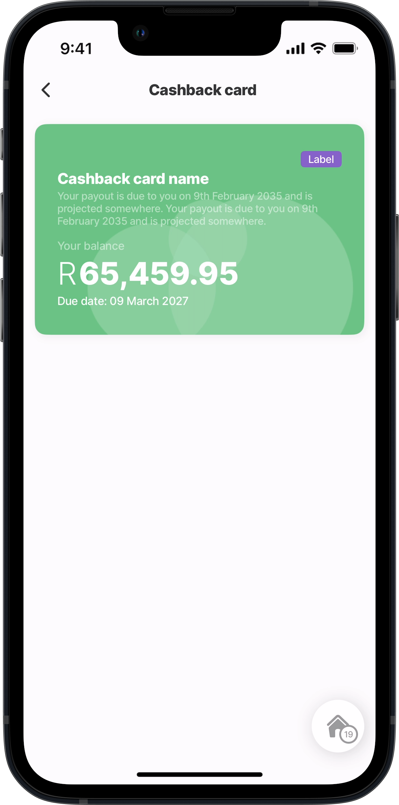
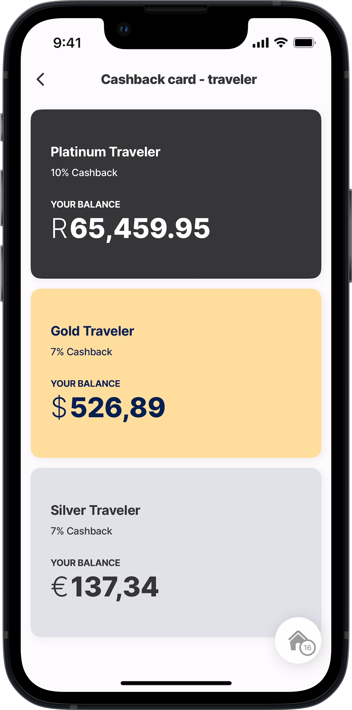
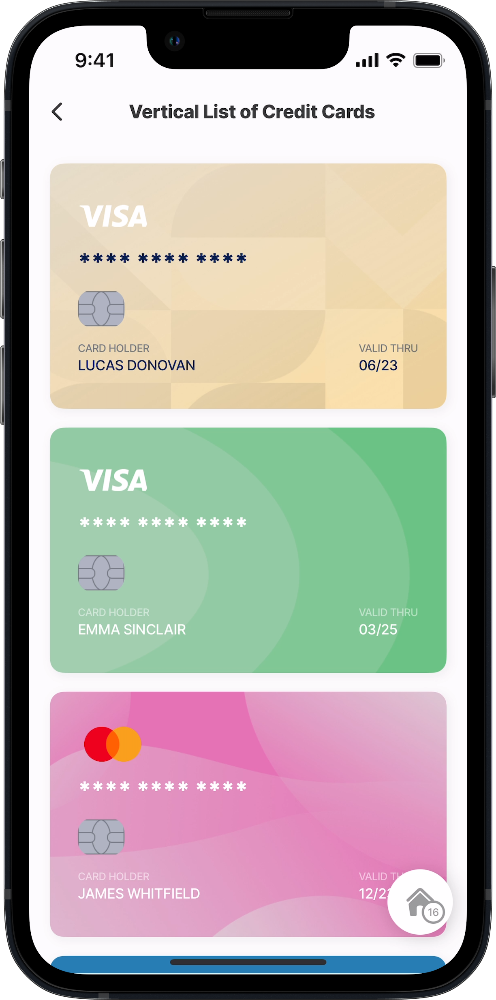
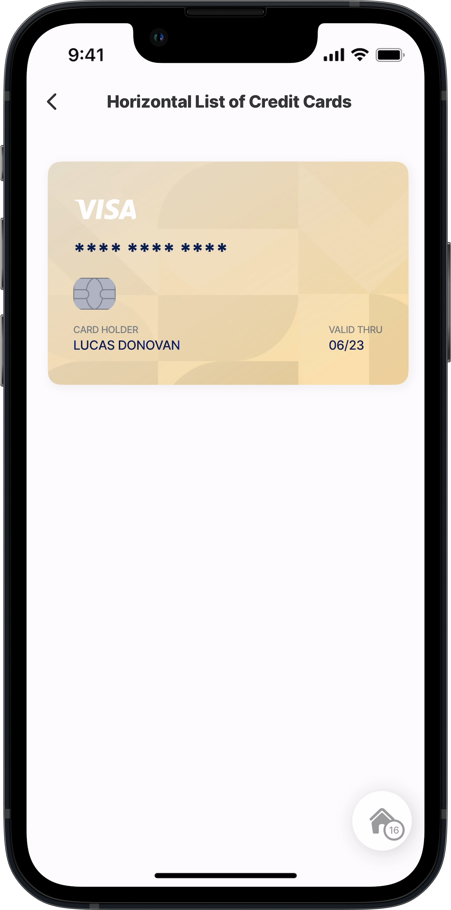
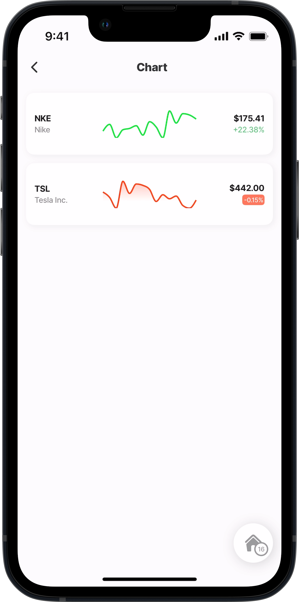
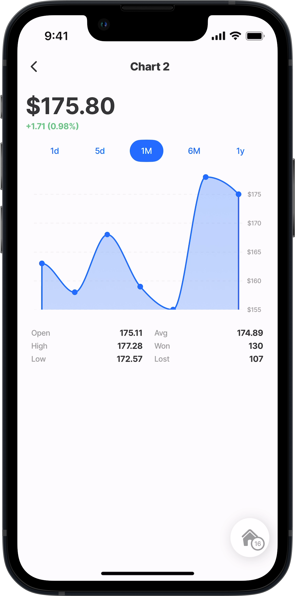
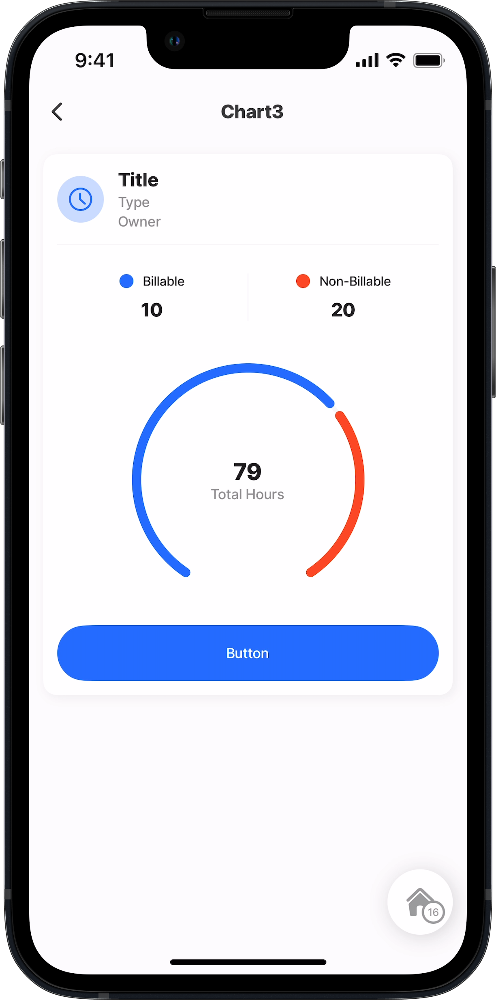

# Cards & Charts (Alpha)


This feature is currently in its **Alpha** stage of development.

* As an early version, it may not include all planned functionalities and is subject to significant changes based on ongoing development and user feedback.
* In this phase, the feature may contain bugs or behave unpredictably.
* Jigx recommends using standard, fully supported components until this feature has been fully tested and refined.
* We encourage you to provide feedback and report any issues to help us improve and refine the feature for future releases.



{% column width="50%" %}

<figure><figcaption></figcaption></figure>

**Business card** \
Get the template on GitHub:

* [component](https://github.com/jigx-com/jigx-samples/blob/main/quickstart/jigx-samples/components/templates/cards/business-card.jigx)
* [jig](https://github.com/jigx-com/jigx-samples/blob/d5eb38a64423482ed10703b0b2889709beee309c/quickstart/jigx-samples/jigs/custom-components/templates/cards/business-card.jigx)


{% column width="50%" %}

<figure><figcaption></figcaption></figure>

**Cashback card sample** Get the template on GitHub:

* [component](../../Custom%20components%20_Alpha_/Templates%20_Alpha_/%22https:/github.com/jigx-com/jigx-samples/blob/main/quickstart/jigx-samples/components/templates/cards/cashback-card.jigx)
* [jig](https://github.com/jigx-com/jigx-samples/blob/d5eb38a64423482ed10703b0b2889709beee309c/quickstart/jigx-samples/jigs/custom-components/templates/cards/cashback-card.jigx)






<figure><figcaption></figcaption></figure>

**Cashback card traveler** Get the template on GitHub:

* [component](https://github.com/jigx-com/jigx-samples/blob/main/quickstart/jigx-samples/components/templates/cards/cashback-card2.jigx)
* [jig](https://github.com/jigx-com/jigx-samples/blob/d5eb38a64423482ed10703b0b2889709beee309c/quickstart/jigx-samples/jigs/custom-components/templates/cards/cashback-card-traveler.jigx)




<figure><figcaption></figcaption></figure>

**Credit card vertical** Get the template on GitHub:

* [component](https://github.com/jigx-com/jigx-samples/blob/main/quickstart/jigx-samples/components/templates/cards/credit-card.jigx)
* [jig](https://github.com/jigx-com/jigx-samples/blob/d5eb38a64423482ed10703b0b2889709beee309c/quickstart/jigx-samples/jigs/custom-components/templates/cards/credit-card-vertical.jigx)






<figure><figcaption></figcaption></figure>

**Credit card horizontal** Get the template on GitHub:

* [component](https://github.com/jigx-com/jigx-samples/blob/main/quickstart/jigx-samples/components/templates/cards/credit-card.jigx)
* [jig](https://github.com/jigx-com/jigx-samples/blob/d5eb38a64423482ed10703b0b2889709beee309c/quickstart/jigx-samples/jigs/custom-components/templates/cards/credit-card-horizontal.jigx)



<figure><figcaption></figcaption></figure>

**Chart 1** Get the template on GitHub:

* [component](https://github.com/jigx-com/jigx-samples/blob/main/quickstart/jigx-samples/components/templates/charts/chart.jigx)
* [jig](https://github.com/jigx-com/jigx-samples/blob/d5eb38a64423482ed10703b0b2889709beee309c/quickstart/jigx-samples/jigs/custom-components/templates/chart/chart1.jigx)






<figure><figcaption></figcaption></figure>

**Chart 2** Get the template on GitHub:

* [component](https://github.com/jigx-com/jigx-samples/blob/main/quickstart/jigx-samples/components/templates/charts/chart2.jigx)
* [jig](https://github.com/jigx-com/jigx-samples/blob/d5eb38a64423482ed10703b0b2889709beee309c/quickstart/jigx-samples/jigs/custom-components/templates/chart/chart2.jigx)




<figure><figcaption></figcaption></figure>

**Chart 3** Get the template on GitHub:

* [component](https://github.com/jigx-com/jigx-samples/blob/main/quickstart/jigx-samples/components/templates/charts/chart3.jigx)
* [jig](https://github.com/jigx-com/jigx-samples/blob/d5eb38a64423482ed10703b0b2889709beee309c/quickstart/jigx-samples/jigs/custom-components/templates/chart/chart3.jigx)


