---
layout:
  width: wide
  title:
    visible: true
  description:
    visible: true
  tableOfContents:
    visible: true
  outline:
    visible: true
  pagination:
    visible: true
  metadata:
    visible: true
---

# Generic (Alpha)


This feature is currently in its **Alpha** stage of development.

* As an early version, it may not include all planned functionalities and is subject to significant changes based on ongoing development and user feedback.
* In this phase, the feature may contain bugs or behave unpredictably.
* Jigx recommends using standard, fully supported components until this feature has been fully tested and refined.
* We encourage you to provide feedback and report any issues to help us improve and refine the feature for future releases.


## Chat




<figure><figcaption></figcaption></figure>

**Chat** \
Get the template on GitHub:

* [component](https://github.com/jigx-com/jigx-samples/tree/main/quickstart/jigx-samples/components/templates/chat)
* [jig](https://github.com/jigx-com/jigx-samples/blob/d5eb38a64423482ed10703b0b2889709beee309c/quickstart/jigx-samples/jigs/custom-components/templates/chat/chat.jigx)







## Gallery




<figure>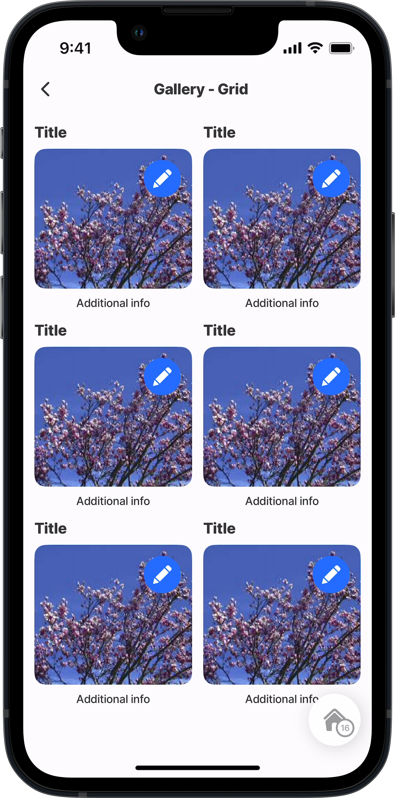<figcaption></figcaption></figure>

**Gallery Grid** \
Get the template on GitHub:

* [component](https://github.com/jigx-com/jigx-samples/blob/main/quickstart/jigx-samples/components/templates/gallery/gallery-2.jigx)
* [jig](https://github.com/jigx-com/jigx-samples/blob/d5eb38a64423482ed10703b0b2889709beee309c/quickstart/jigx-samples/jigs/custom-components/templates/gallery/gallery-grid.jigx)




<figure>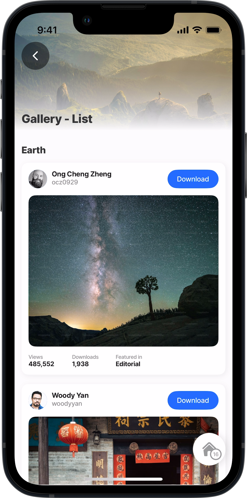<figcaption></figcaption></figure>

**Gallery List** \
Get the template on GitHub:

* [component](https://github.com/jigx-com/jigx-samples/blob/main/quickstart/jigx-samples/components/templates/gallery/gallery.jigx)
* [jig](https://github.com/jigx-com/jigx-samples/blob/d5eb38a64423482ed10703b0b2889709beee309c/quickstart/jigx-samples/jigs/custom-components/templates/gallery/gallery-list.jigx)



## Lists




<figure>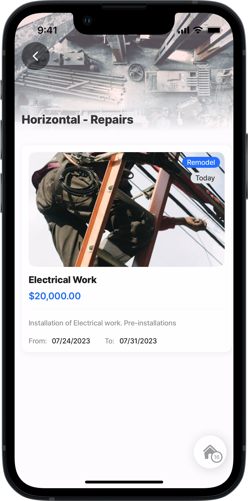<figcaption></figcaption></figure>

**List - Horizontal Repairs** Get the template on GitHub:

* [component](https://github.com/jigx-com/jigx-samples/blob/main/quickstart/jigx-samples/components/templates/list/horizontal-list-components.jigx)
* [jig](https://github.com/jigx-com/jigx-samples/blob/d5eb38a64423482ed10703b0b2889709beee309c/quickstart/jigx-samples/jigs/custom-components/templates/list/list-horizontal-repair.jigx)




<figure><figcaption></figcaption></figure>

**List - Horizontal** Get the template on GitHub:

* [component](https://github.com/jigx-com/jigx-samples/blob/main/quickstart/jigx-samples/components/templates/list/horizontal.jigx)
* [jig](https://github.com/jigx-com/jigx-samples/blob/d5eb38a64423482ed10703b0b2889709beee309c/quickstart/jigx-samples/jigs/custom-components/templates/list/list-horizontal.jigx)






<figure><figcaption></figcaption></figure>

**List Large Description**

Get the template on GitHub:

* [component](https://github.com/jigx-com/jigx-samples/blob/main/quickstart/jigx-samples/components/templates/list/large-description-list.jigx)
* [jig](https://github.com/jigx-com/jigx-samples/blob/d5eb38a64423482ed10703b0b2889709beee309c/quickstart/jigx-samples/jigs/custom-components/templates/list/list-large-description.jigx)&#x20;




<figure>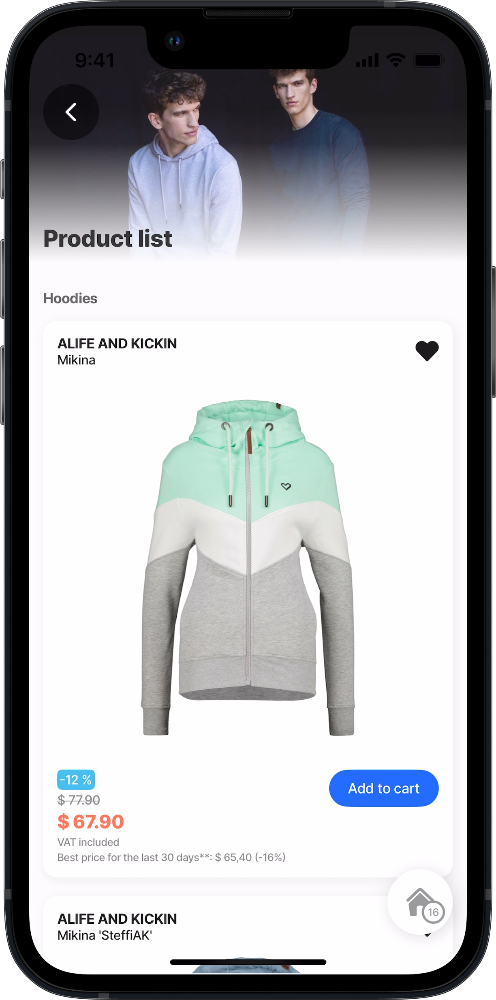<figcaption></figcaption></figure>

**List Product** \
Get the template on GitHub:

* [component](https://github.com/jigx-com/jigx-samples/blob/main/quickstart/jigx-samples/components/templates/list/product-1.jigx)
* [jig](https://github.com/jigx-com/jigx-samples/blob/d5eb38a64423482ed10703b0b2889709beee309c/quickstart/jigx-samples/jigs/custom-components/templates/list/list-products.jigx)&#x20;






<figure>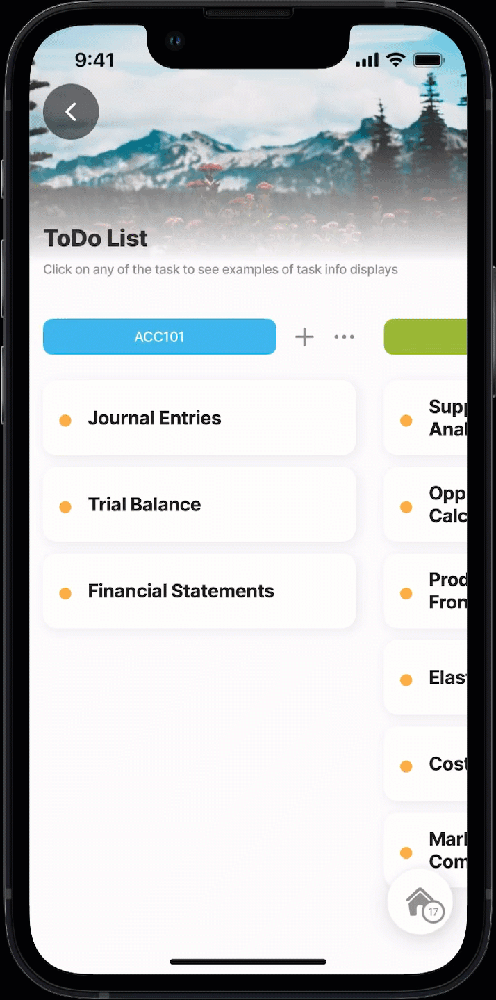<figcaption></figcaption></figure>

**List- ToDo** \
Get the template on GitHub:

* [component](https://github.com/jigx-com/jigx-samples/blob/main/quickstart/jigx-samples/components/templates/to-do/todo.jigx)
* [jig](https://github.com/jigx-com/jigx-samples/blob/d5eb38a64423482ed10703b0b2889709beee309c/quickstart/jigx-samples/jigs/custom-components/templates/list/list-todo.jigx)&#x20;




<figure>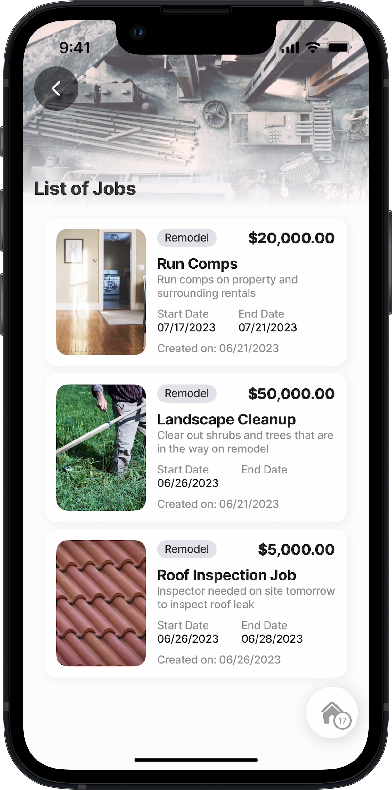<figcaption></figcaption></figure>

**List -Vertical jobs** \
Get the template on GitHub:

* [component](https://github.com/jigx-com/jigx-samples/blob/main/quickstart/jigx-samples/components/templates/list/list-jobs.jigx)
* [jig](https://github.com/jigx-com/jigx-samples/blob/d5eb38a64423482ed10703b0b2889709beee309c/quickstart/jigx-samples/jigs/custom-components/templates/list/list-vertical.jigx)&#x20;



## Profile




<figure><figcaption></figcaption></figure>

**Profile Cards** \
Get the template on GitHub:

* [component](https://github.com/jigx-com/jigx-samples/blob/main/quickstart/jigx-samples/components/templates/profile/user-profile-small-avatar.jigx)
* [jig](https://github.com/jigx-com/jigx-samples/blob/d5eb38a64423482ed10703b0b2889709beee309c/quickstart/jigx-samples/jigs/custom-components/templates/profile/profile-cards.jigx)




<figure><figcaption></figcaption></figure>

**Profile Fullscreen** \
Get the template on GitHub:

* [component](https://github.com/jigx-com/jigx-samples/blob/main/quickstart/jigx-samples/components/templates/profile/profile-image-horizontal.jigx)
* [jig](https://github.com/jigx-com/jigx-samples/blob/d5eb38a64423482ed10703b0b2889709beee309c/quickstart/jigx-samples/jigs/custom-components/templates/profile/profile-fullscreen.jigx)






<figure><figcaption></figcaption></figure>

**Profile Header** \
Get the template on GitHub:

* [component](https://github.com/jigx-com/jigx-samples/blob/main/quickstart/jigx-samples/components/templates/profile/profile-card.jigx)
* [jig](https://github.com/jigx-com/jigx-samples/blob/d5eb38a64423482ed10703b0b2889709beee309c/quickstart/jigx-samples/jigs/custom-components/templates/profile/profile-header.jigx)




<figure>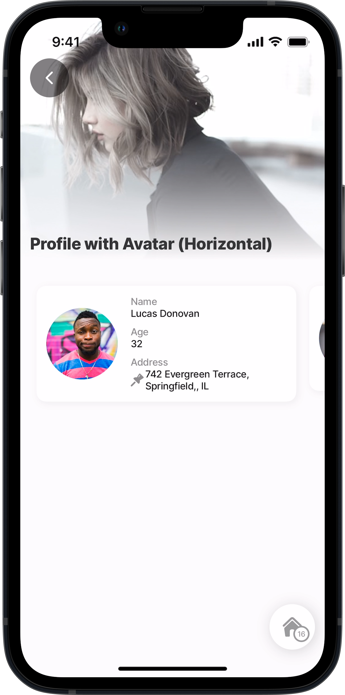<figcaption></figcaption></figure>

**Profile Left Avatar Horizontal** \
Get the template on GitHub:

* [component](https://github.com/jigx-com/jigx-samples/blob/main/quickstart/jigx-samples/components/templates/profile/profile-avatar-horizontal.jigx)
* [jig](https://github.com/jigx-com/jigx-samples/blob/d5eb38a64423482ed10703b0b2889709beee309c/quickstart/jigx-samples/jigs/custom-components/templates/profile/profile-left-avatar-horizontal.jigx)






<figure>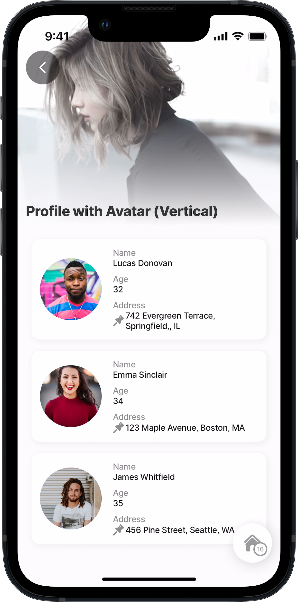<figcaption></figcaption></figure>

**Profile Left Avatar Vertical** \
Get the template on GitHub:

* [component](https://github.com/jigx-com/jigx-samples/blob/main/quickstart/jigx-samples/components/templates/profile/profile-avatar-vertical.jigx)
* [jig](https://github.com/jigx-com/jigx-samples/blob/d5eb38a64423482ed10703b0b2889709beee309c/quickstart/jigx-samples/jigs/custom-components/templates/profile/profile-left-avatar-vertical.jigx)




<figure>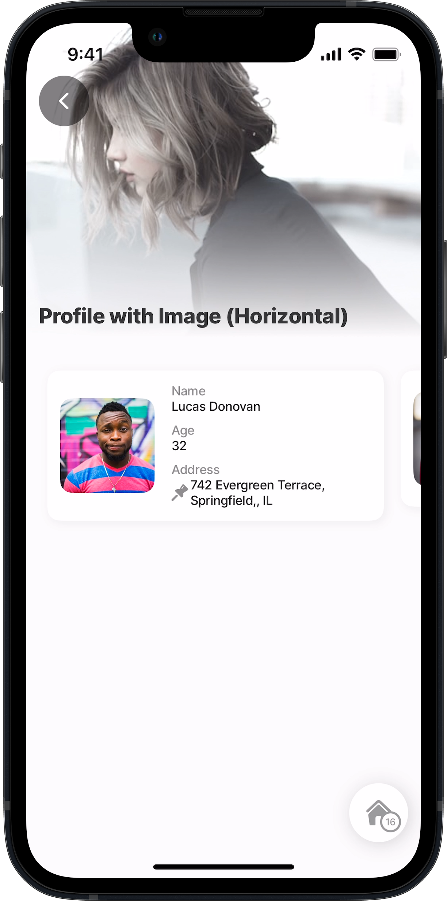<figcaption></figcaption></figure>

**Profile Left Image Horizontal** \
Get the template on GitHub:

* [component](https://github.com/jigx-com/jigx-samples/blob/main/quickstart/jigx-samples/components/templates/profile/profile-image-horizontal.jigx)&#x20;
* [jig](https://github.com/jigx-com/jigx-samples/blob/d5eb38a64423482ed10703b0b2889709beee309c/quickstart/jigx-samples/jigs/custom-components/templates/profile/profile-left-image-horizontal.jigx)






<figure>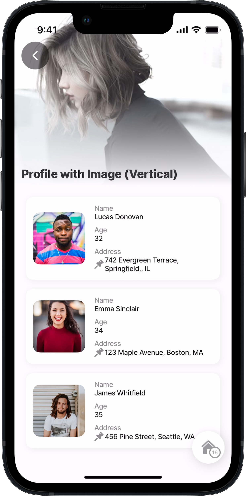<figcaption></figcaption></figure>

**Profile Left Image Vertical** \
Get the template on GitHub:

* [component](https://github.com/jigx-com/jigx-samples/blob/main/quickstart/jigx-samples/components/templates/profile/profile-image-vertical.jigx)&#x20;
* [jig](https://github.com/jigx-com/jigx-samples/blob/d5eb38a64423482ed10703b0b2889709beee309c/quickstart/jigx-samples/jigs/custom-components/templates/profile/profile-left-image-vertical.jigx)




<figure>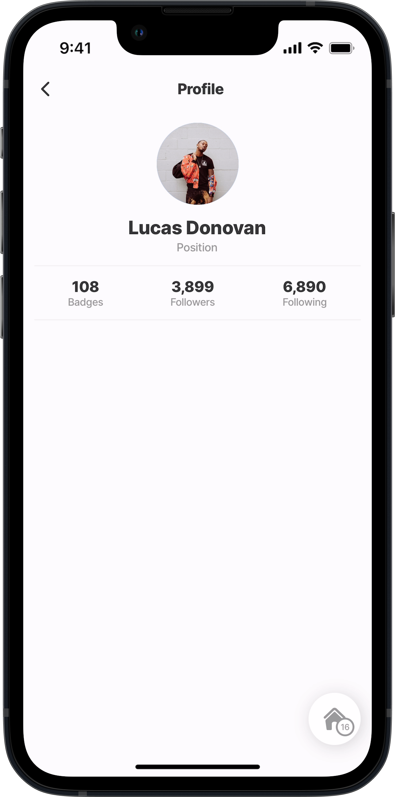<figcaption></figcaption></figure>

**Profile Stats** \
Get the template on GitHub:

* [component](https://github.com/jigx-com/jigx-samples/blob/d5eb38a64423482ed10703b0b2889709beee309c/quickstart/jigx-samples/jigs/custom-components/templates/profile/profile1.jigx)
* [jig](https://github.com/jigx-com/jigx-samples/blob/d5eb38a64423482ed10703b0b2889709beee309c/quickstart/jigx-samples/jigs/custom-components/templates/profile/profile.jigx)






<figure>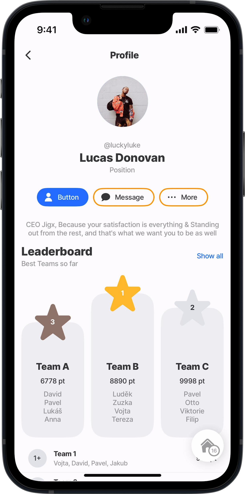<figcaption></figcaption></figure>

**Profile with Leaderboard** \
Get the template on GitHub:

* [component](https://github.com/jigx-com/jigx-samples/blob/main/quickstart/jigx-samples/components/templates/leaderboard/leaderboard.jigx)
* [jig](https://github.com/jigx-com/jigx-samples/blob/d5eb38a64423482ed10703b0b2889709beee309c/quickstart/jigx-samples/jigs/custom-components/templates/profile/profile-leaderboard.jigx)




<figure><figcaption></figcaption></figure>

**Profile with Details** \
Get the template on GitHub:

* [component](https://github.com/jigx-com/jigx-samples/blob/main/quickstart/jigx-samples/components/templates/profile/contact.jigx)
* [jig](https://github.com/jigx-com/jigx-samples/blob/d5eb38a64423482ed10703b0b2889709beee309c/quickstart/jigx-samples/jigs/custom-components/templates/profile/profile1.jigx)






<figure><figcaption></figcaption></figure>

**Profile with Details Compact**\
Get the template on GitHub:

* [component](https://github.com/jigx-com/jigx-samples/blob/main/quickstart/jigx-samples/components/templates/profile/details-2.jigx)
* [jig](https://github.com/jigx-com/jigx-samples/blob/d5eb38a64423482ed10703b0b2889709beee309c/quickstart/jigx-samples/jigs/custom-components/templates/profile/profile2.jigx)






