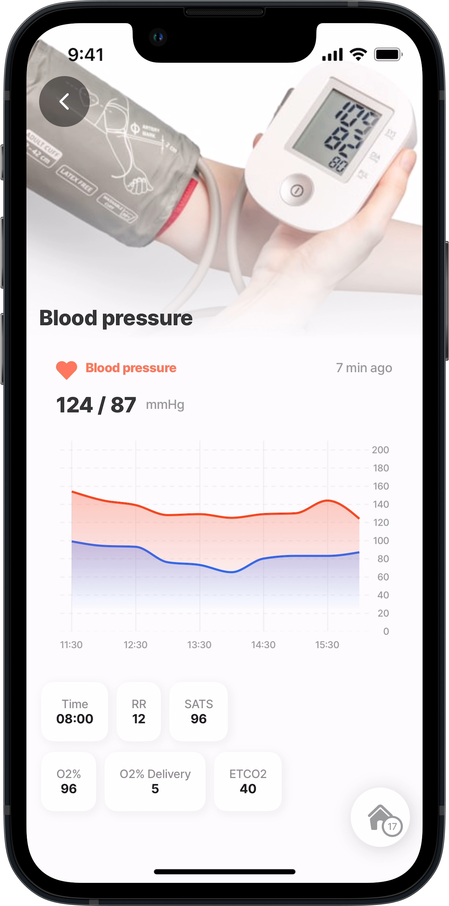
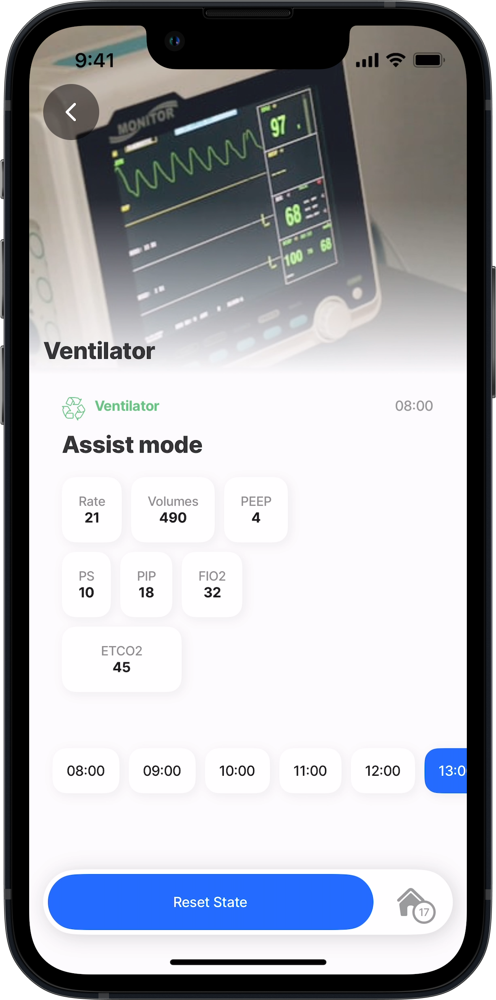

---
layout:
  width: wide
  title:
    visible: true
  description:
    visible: true
  tableOfContents:
    visible: true
  outline:
    visible: true
  pagination:
    visible: true
  metadata:
    visible: true
---

# Industry Specific (Alpha)


This feature is currently in its **Alpha** stage of development.

* As an early version, it may not include all planned functionalities and is subject to significant changes based on ongoing development and user feedback.
* In this phase, the feature may contain bugs or behave unpredictably.
* Jigx recommends using standard, fully supported components until this feature has been fully tested and refined.
* We encourage you to provide feedback and report any issues to help us improve and refine the feature for future releases.


## Health




<figure><figcaption></figcaption></figure>

**Health - Blood** \
Get the template on GitHub:

* [component](https://github.com/jigx-com/jigx-samples/blob/main/quickstart/jigx-samples/components/templates/health/blood.jigx)
* [jig](https://github.com/jigx-com/jigx-samples/blob/d5eb38a64423482ed10703b0b2889709beee309c/quickstart/jigx-samples/jigs/custom-components/templates/health/blood.jigx)




<figure><figcaption></figcaption></figure>

**Health - Ventilator** \
Get the template on GitHub:

* [component](https://github.com/jigx-com/jigx-samples/blob/main/quickstart/jigx-samples/components/templates/health/ventilator.jigx)
* [jig](https://github.com/jigx-com/jigx-samples/blob/d5eb38a64423482ed10703b0b2889709beee309c/quickstart/jigx-samples/jigs/custom-components/templates/health/ventilator.jigx)



## News




<figure><figcaption></figcaption></figure>

**News** \
Get the template on GitHub:

* [component](https://github.com/jigx-com/jigx-samples/blob/main/quickstart/jigx-samples/components/molecules-organisms/news/news-categories.jigx)
* [jig](https://github.com/jigx-com/jigx-samples/blob/d5eb38a64423482ed10703b0b2889709beee309c/quickstart/jigx-samples/jigs/custom-components/templates/news/news.jigx)




<figure><figcaption></figcaption></figure>

**Coffee** \
Get the template on GitHub:

* [component](https://github.com/jigx-com/jigx-samples/tree/main/quickstart/jigx-samples/components/templates/coffee)
* [jig](https://github.com/jigx-com/jigx-samples/blob/d5eb38a64423482ed10703b0b2889709beee309c/quickstart/jigx-samples/jigs/custom-components/templates/hospitality/coffee.jigx)






<figure><figcaption></figcaption></figure>

**Stories Example** \
Get the template on GitHub:

* [component](https://github.com/jigx-com/jigx-samples/tree/main/quickstart/jigx-samples/components/templates/coffee)
* [jig](https://github.com/jigx-com/jigx-samples/blob/main/quickstart/jigx-samples/jigs/custom-components/templates/news/news.jigx)







## Field service




<figure><figcaption></figcaption></figure>

**Plumbing** \
Get the template on GitHub:

* [component](https://github.com/jigx-com/jigx-samples/tree/main/quickstart/jigx-samples/components/templates/plumbing)
* [jig](https://github.com/jigx-com/jigx-samples/blob/d5eb38a64423482ed10703b0b2889709beee309c/quickstart/jigx-samples/jigs/custom-components/templates/plumbing/plumbing.jigx)






