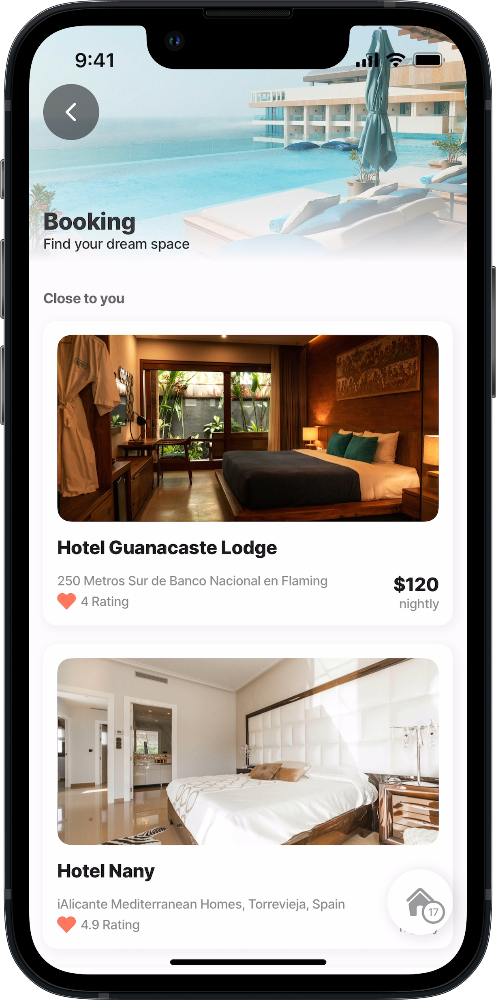
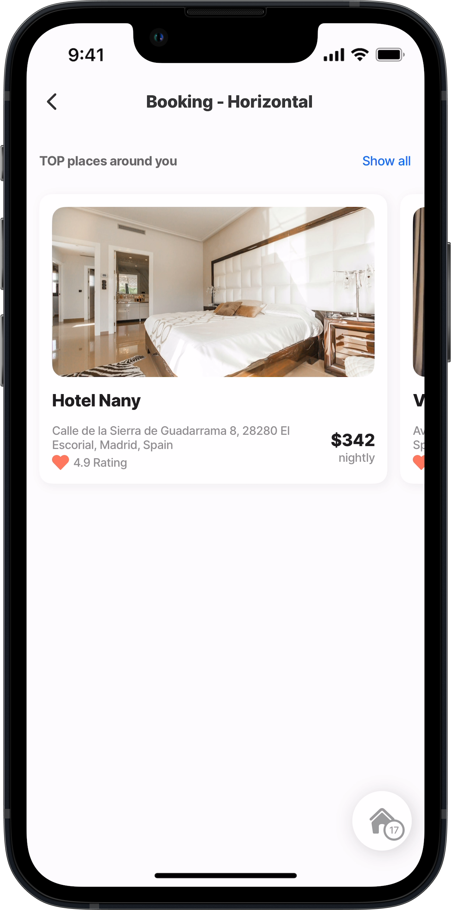
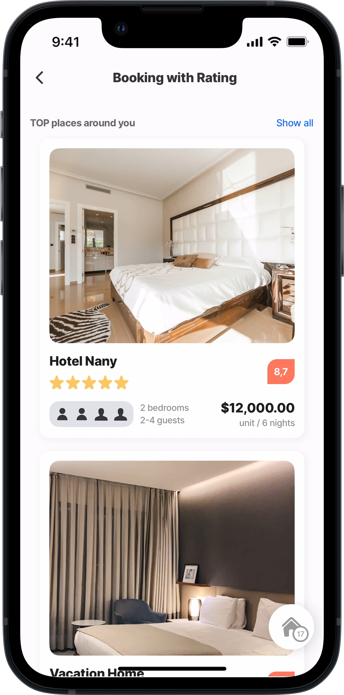
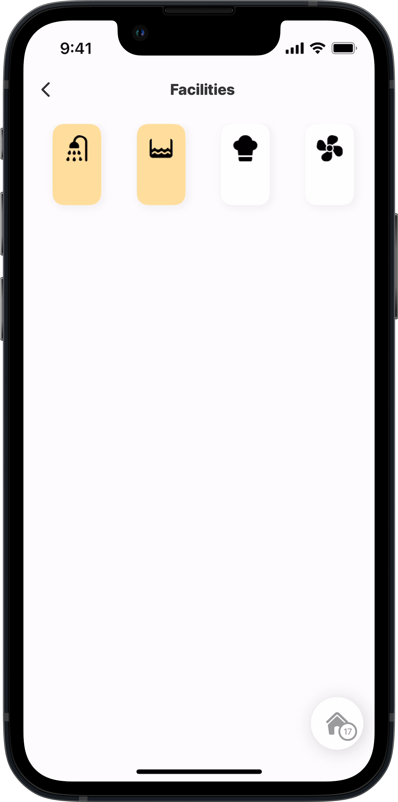
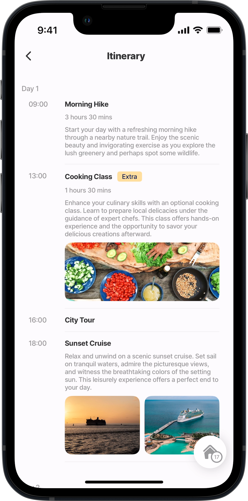
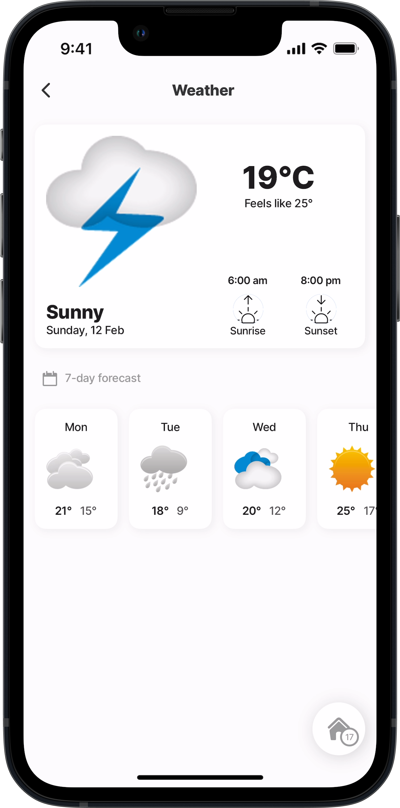
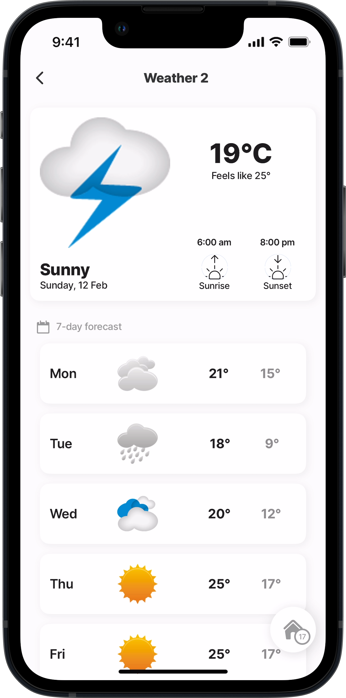

# Travel (Alpha)


This feature is currently in its **Alpha** stage of development.

* As an early version, it may not include all planned functionalities and is subject to significant changes based on ongoing development and user feedback.
* In this phase, the feature may contain bugs or behave unpredictably.
* Jigx recommends using standard, fully supported components until this feature has been fully tested and refined.
* We encourage you to provide feedback and report any issues to help us improve and refine the feature for future releases.





<figure><figcaption></figcaption></figure>

**Booking** Get the template on GitHub:

* [component](https://github.com/jigx-com/jigx-samples/blob/main/quickstart/jigx-samples/components/templates/booking/booking-2.jigx)
* [jig](https://github.com/jigx-com/jigx-samples/blob/d5eb38a64423482ed10703b0b2889709beee309c/quickstart/jigx-samples/jigs/custom-components/templates/booking/booking.jigx)




<figure><figcaption></figcaption></figure>

**Booking Horizontal** Get the template on GitHub:

* [component](https://github.com/jigx-com/jigx-samples/blob/main/quickstart/jigx-samples/components/templates/booking/hotel-list.jigx)
* [jig](https://github.com/jigx-com/jigx-samples/blob/d5eb38a64423482ed10703b0b2889709beee309c/quickstart/jigx-samples/jigs/custom-components/templates/booking/booking-horizontal.jigx)






<figure><figcaption></figcaption></figure>

**Booking with Ratings** Get the template on GitHub:

* [component](https://github.com/jigx-com/jigx-samples/blob/main/quickstart/jigx-samples/components/packages.jigx)
* [jig](https://github.com/jigx-com/jigx-samples/blob/d5eb38a64423482ed10703b0b2889709beee309c/quickstart/jigx-samples/jigs/custom-components/templates/booking/booking-rating.jigx)




<figure><figcaption></figcaption></figure>

**Facilities** Get the template on GitHub:

* [component](https://github.com/jigx-com/jigx-samples/blob/main/quickstart/jigx-samples/components/templates/facilities/horizontal-facilities.jigx)
* [jig](https://github.com/jigx-com/jigx-samples/blob/d5eb38a64423482ed10703b0b2889709beee309c/quickstart/jigx-samples/jigs/custom-components/templates/facilities/facilities.jigx)






<figure><figcaption></figcaption></figure>

**Itinerary** Get the template on GitHub:

* [component](https://github.com/jigx-com/jigx-samples/blob/main/quickstart/jigx-samples/components/templates/itinerary/itinerary-day.jigx)
* [jig](https://github.com/jigx-com/jigx-samples/blob/d5eb38a64423482ed10703b0b2889709beee309c/quickstart/jigx-samples/jigs/custom-components/templates/itinerary/itinerary.jigx)




<figure><figcaption></figcaption></figure>

**Location** Get the template on GitHub:

* [component](https://github.com/jigx-com/jigx-samples/blob/main/quickstart/jigx-samples/components/templates/location/location.jigx)
* [jig](https://github.com/jigx-com/jigx-samples/blob/d5eb38a64423482ed10703b0b2889709beee309c/quickstart/jigx-samples/jigs/custom-components/templates/location/location.jigx)






<figure><figcaption></figcaption></figure>

**Weather Horizontal** Get the template on GitHub:

* [component](https://github.com/jigx-com/jigx-samples/blob/main/quickstart/jigx-samples/components/templates/weather/forecast.jigx)
* [jig](https://github.com/jigx-com/jigx-samples/blob/d5eb38a64423482ed10703b0b2889709beee309c/quickstart/jigx-samples/jigs/custom-components/templates/weather/weather.jigx)




<figure><figcaption></figcaption></figure>

**Weather Vertical** Get the template on GitHub:

* [component](https://github.com/jigx-com/jigx-samples/blob/main/quickstart/jigx-samples/components/templates/weather/forecast-2.jigx)
* [jig](https://github.com/jigx-com/jigx-samples/blob/d5eb38a64423482ed10703b0b2889709beee309c/quickstart/jigx-samples/jigs/custom-components/templates/weather/weather1.jigx)


