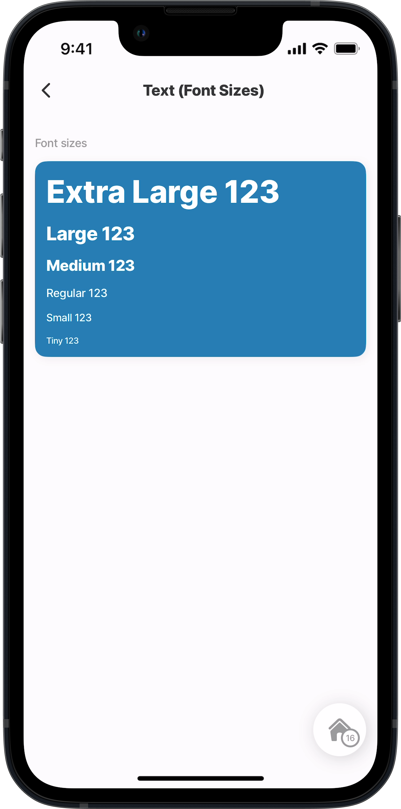
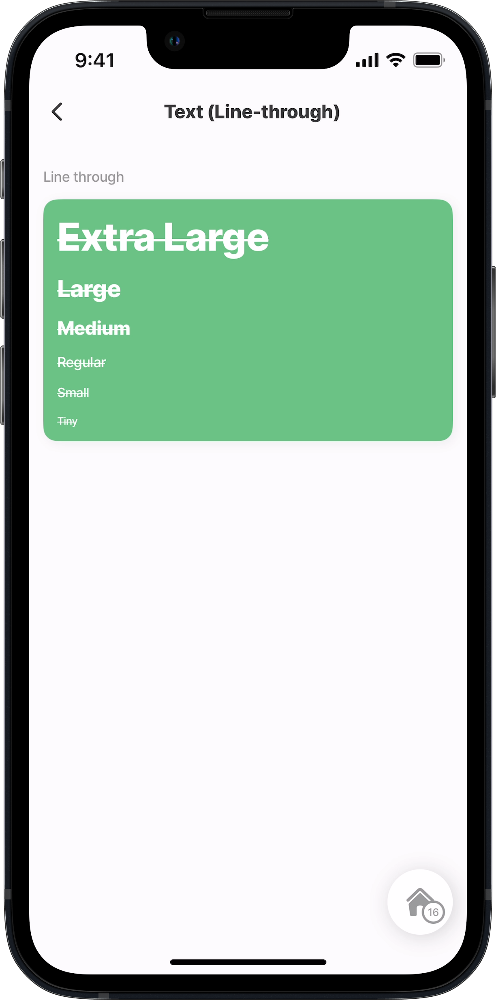
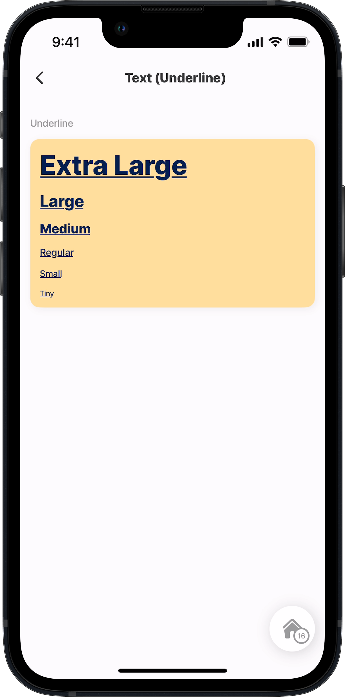
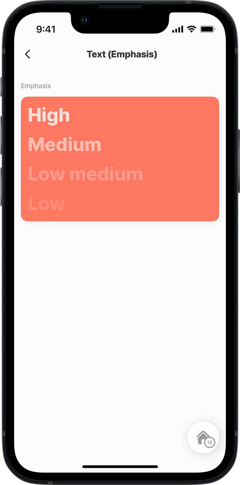
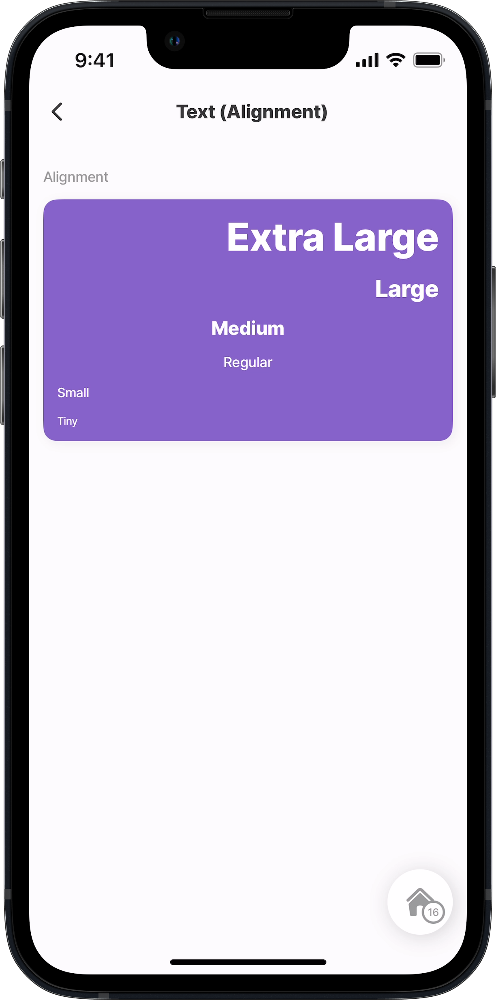
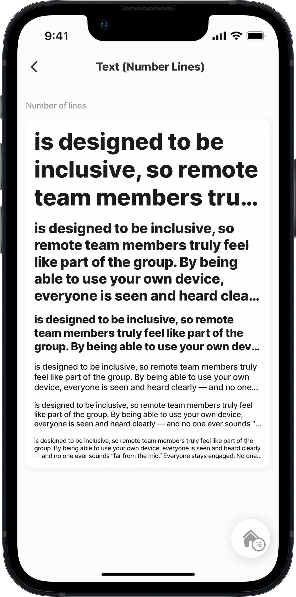
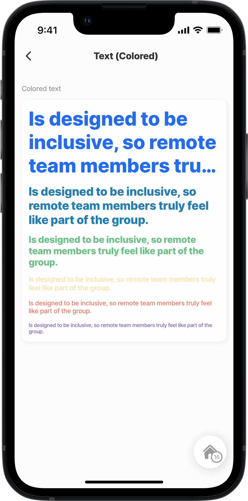
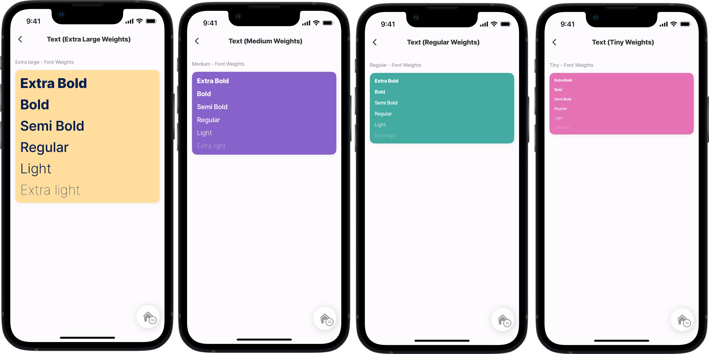

---
layout:
  width: wide
  title:
    visible: true
  description:
    visible: true
  tableOfContents:
    visible: true
  outline:
    visible: true
  pagination:
    visible: true
  metadata:
    visible: true
---

# Text (Alpha)


This feature is currently in its **Alpha** stage of development.

* As an early version, it may not include all planned functionalities and is subject to significant changes based on ongoing development and user feedback.
* In this phase, the feature may contain bugs or behave unpredictably.
* Jigx recommends using standard, fully supported components until this feature has been fully tested and refined.
* We encourage you to provide feedback and report any issues to help us improve and refine the feature for future releases.


The custom component _text_ allows adding text inside custom components. For example, adding text inside a [Card (Alpha)](<Card _Alpha_.md>) or [View (Alpha)](<View _Alpha_.md>).

For steps on creating a custom component, see [How to create a custom component](<Custom components _Alpha_.md>).

## Configuration options

You can use `when` and `instanceId` with `component.text`, add the properties before the `options` property. The available list of options is shown below.

<table><thead><tr><th width="153.96875">Options</th><th></th></tr></thead><tbody><tr><td><code>align</code></td><td>Determine the text alignment, options are: <code>center</code> <code>left</code> <code>right</code></td></tr><tr><td><code>color</code></td><td>Multiple, use IntelliSense to view the available list. See to view the different colors.</td></tr><tr><td><code>decoration</code></td><td><code>line-through</code> <code>underline</code></td></tr><tr><td><code>emphasis</code></td><td>Change the text's brightness and boldness. <code>high</code> <code>low</code> <code>low-medium</code> <code>medium</code></td></tr><tr><td><code>numberOfLines</code></td><td>Use a number to indicate the number of lines of text. Use an expression to determine the number of lines needed.</td></tr><tr><td><code>onPress</code></td><td>Multiple, use IntelliSense to view the list of available to call.</td></tr><tr><td><code>size</code></td><td>Adjust the size of the text, the following sizes are available: <code>extra-large</code> <code>large</code> <code>medium</code> <code>regular</code> <code>small</code> <code>tiny</code></td></tr><tr><td><code>value</code></td><td>Provide the text to be used. You can use an , as well as <a href="https://docs.jigx.com/building-apps-with-jigx/additional-functionality/localization">Localization</a>.</td></tr><tr><td><code>weight</code></td><td>Determine how thick or bold the text must be, the following weights are available: <code>bold</code> <code>extra-bold</code> <code>extra-light</code> <code>light</code> <code>regular</code> <code>semi-bold</code></td></tr></tbody></table>

## Examples and code snippets

The examples use a set of custom components called _sections_. The sections are for titles, spacing, and context. The _sections_ code is available on [GitHub](https://github.com/jigx-com/jigx-samples/tree/main/quickstart/jigx-samples/components/molecules-organisms/sections).

### Text font sizes



<figure><figcaption><p>Text font size</p></figcaption></figure>



This example shows the use of `component.text` with various font sizes configured using the `size` property, all displayed within a [Card (Alpha)](<Card _Alpha_.md>).

**Examples:**

1. See the _section_ component example in [GitHub](https://github.com/jigx-com/jigx-samples/blob/main/quickstart/jigx-samples/components/molecules-organisms/sections/section2.jigx).
2. See the _custom component_ example in [GitHub](https://github.com/jigx-com/jigx-samples/blob/main/quickstart/jigx-samples/components/basic-elements/text/text-1.jigx).
3. See the _jig_ example in [GitHub](https://github.com/jigx-com/jigx-samples/blob/d5eb38a64423482ed10703b0b2889709beee309c/quickstart/jigx-samples/jigs/custom-components/basic-elements/text/text-font-sizes.jigx).





```yaml
# components/text-1.jigx
type: component.default
children:
  - type: component.card
    options:
      color: color1
      direction: column
      children:
        - type: component.text
          options:
            value: Extra Large 123
            # Configure the font size of the text.
            size: extra-large
        - type: component.text
          options:
            value: Large 123
            size: large
        - type: component.text
          options:
            value: Medium 123
            size: medium
        - type: component.text
          options:
            value: Regular 123
            size: regular
        - type: component.text
          options:
            value: Small 123
            size: small
        - type: component.text
          options:
            value: Tiny 123
            size: tiny
```



```yaml
# jigs/text-font-sizes.jigx
title: Text (Font Sizes)
type: jig.default
icon: text-book

children:
  # Reference the custom component to display in the jig.
  # This custom component contains the view configuration to show the title.
  - type: component.custom-component
    componentId: section2
    inputs:
      title: "Font sizes"
  # Reference the custom component to display in the jig.
  - type: component.custom-component
    componentId: text-1
```



### Text with line through



This example shows how to apply strikethrough formatting to font of various sizes by using the `decoration: line-through` property of the `component.text`.

**Examples:**

1. See the _section_ component example in [GitHub](https://github.com/jigx-com/jigx-samples/blob/main/quickstart/jigx-samples/components/molecules-organisms/sections/section2.jigx).
2. See the _custom component_ example in [GitHub](https://github.com/jigx-com/jigx-samples/blob/main/quickstart/jigx-samples/components/basic-elements/text/text-2.jigx).
3. See the _jig_ example in [GitHub](https://github.com/jigx-com/jigx-samples/blob/d5eb38a64423482ed10703b0b2889709beee309c/quickstart/jigx-samples/jigs/custom-components/basic-elements/text/text-line-through.jigx).



<figure><figcaption><p>Text with line through</p></figcaption></figure>





```yaml
# components/text-line-through.jigx
type: component.default
children:
  - type: component.card
    options:
      color: color2
      direction: column
      children:
        - type: component.text
          options:
            value: Extra Large
            size: extra-large
            # decorate the text with a line through the text value
            decoration: line-through
        - type: component.text
          options:
            value: Large
            size: large
            decoration: line-through
        - type: component.text
          options:
            value: Medium
            size: medium
            decoration: line-through
        - type: component.text
          options:
            value: Regular
            size: regular
            decoration: line-through
        - type: component.text
          options:
            value: Small
            size: small
            decoration: line-through
        - type: component.text
          options:
            value: Tiny
            size: tiny
            decoration: line-through
```



```yaml
# jigs/text-line-through.jigx
title: Text (Line-through)
type: jig.default
icon: text-book

children:
  # Reference the custom component to display in the jig.
  # This custom component contains the view configuration to show the title.
  - type: component.custom-component
    componentId: section2
    inputs:
      title: "Line through"
  # Reference the custom component to display in the jig.
  - type: component.custom-component
    componentId: text-2
```



### Text with underlining



<figure><figcaption><p>Underlined text</p></figcaption></figure>



This example shows how to underline text with various font sizes using the `decoration: underline` property. The text is contained in a yellow [Card (Alpha)](<Card _Alpha_.md>).

**Examples:**

1. See the _custom component_ example in [GitHub](https://github.com/jigx-com/jigx-samples/blob/main/quickstart/jigx-samples/components/basic-elements/text/text-3.jigx).
2. See the _jig_ example in [GitHub](https://github.com/jigx-com/jigx-samples/blob/d5eb38a64423482ed10703b0b2889709beee309c/quickstart/jigx-samples/jigs/custom-components/basic-elements/text/text-underline.jigx).
3. See the _section_ component example in [GitHub](https://github.com/jigx-com/jigx-samples/blob/main/quickstart/jigx-samples/components/molecules-organisms/sections/section2.jigx).





```yaml
# components/text-3.jigx
type: component.default
children:
  - type: component.card
    options:
      color: color3
      direction: column
      children:
        - type: component.text
          options:
            value: Extra Large
            size: extra-large
            # Underline text be using the decoration property.
            decoration: underline
        - type: component.text
          options:
            value: Large
            size: large
            decoration: underline
        - type: component.text
          options:
            value: Medium
            size: medium
            decoration: underline
        - type: component.text
          options:
            value: Regular
            size: regular
            decoration: underline
        - type: component.text
          options:
            value: Small
            size: small
            decoration: underline
        - type: component.text
          options:
            value: Tiny
            size: tiny
            decoration: underline
```



```yaml
# jigs/text-custom-component.jigx
title: Text (Underline)
type: jig.default
icon: text-book

children:
  # Reference the custom component to display in the jig.
  # This custom component contains the view configuration to show the title.
  - type: component.custom-component
    componentId: section2
    inputs:
      title: "Underline"
  # Reference the custom component to display in the underlined text in the jig.
  - type: component.custom-component
    componentId: text-3
```



### Text with emphasis



This example shows the `component.text` with various font sizes and emphasis styles, configured using the `emphasis` property, all displayed in a [Card (Alpha)](<Card _Alpha_.md>).

**Examples:**

1. See the _custom component_ example in [GitHub](https://github.com/jigx-com/jigx-samples/blob/main/quickstart/jigx-samples/components/basic-elements/text/text-4.jigx).
2. See the _jig_ example in [GitHub](https://github.com/jigx-com/jigx-samples/blob/d5eb38a64423482ed10703b0b2889709beee309c/quickstart/jigx-samples/jigs/custom-components/basic-elements/text/text-emphasis.jigx).
3. See the _section_ component example in [GitHub](https://github.com/jigx-com/jigx-samples/blob/main/quickstart/jigx-samples/components/molecules-organisms/sections/section2.jigx).



<figure><figcaption><p>Text with emphasis</p></figcaption></figure>





```yaml
# components/text-4.jigx
type: component.default
children:
  - type: component.card
    options:
      color: color4
      direction: column
      children:
        - type: component.text
          options:
            value: High
            size: extra-large
            #Add emphasis to text from bright to lighter
            emphasis: high

        - type: component.text
          options:
            value: Medium
            size: extra-large
            emphasis: medium

        - type: component.text
          options:
            value: Low medium
            size: extra-large
            emphasis: low-medium

        - type: component.text
          options:
            value: Low
            size: extra-large
            emphasis: low
```



```yaml
# jigs/text-emphasis.jigx
title: Text (Emphasis)
type: jig.default
icon: text-book

children:
  - type: component.custom-component
    # Reference the custom component to display in the jig.
    # This custom component contains the view configuration to show the title.
    componentId: section2
    inputs:
      title: "Emphasis"
  # Reference the custom component to display text with emphasis in the jig.
  - type: component.custom-component
    componentId: text-4
```



### Text with alignment



<figure><figcaption><p>Text alignment</p></figcaption></figure>



This example demonstrates various text alignments with varying font sizes using the `align` property, all displayed in a [Card (Alpha)](<Card _Alpha_.md>).

**Examples:**

1. See the _custom component_ example in [GitHub](https://github.com/jigx-com/jigx-samples/blob/main/quickstart/jigx-samples/components/basic-elements/text/text-5.jigx).
2. See the _jig_ example in [GitHub](https://github.com/jigx-com/jigx-samples/blob/d5eb38a64423482ed10703b0b2889709beee309c/quickstart/jigx-samples/jigs/custom-components/basic-elements/text/text-alignment.jigx).
3. See the _section_ component example in [GitHub](https://github.com/jigx-com/jigx-samples/blob/main/quickstart/jigx-samples/components/molecules-organisms/sections/section2.jigx).





```yaml
# components/text-5.jigx
type: component.default
children:
  - type: component.card
    options:
      color: color5
      direction: column
      children:
        - type: component.text
          options:
            value: Extra Large
            size: extra-large
            # Determine the alignment of the text value
            align: right
        - type: component.text
          options:
            value: Large
            size: large
            align: right
        - type: component.text
          options:
            value: Medium
            size: medium
            align: center
        - type: component.text
          options:
            value: Regular
            size: regular
            align: center
        - type: component.text
          options:
            value: Small
            size: small
            align: left
        - type: component.text
          options:
            value: Tiny
            size: tiny
            align: left
```



```yaml
# jigs/text-alignment.jigx
title: Text (Alignment)
type: jig.default
icon: text-book

children:
  # Reference the custom component to display in the jig.
  # This custom component contains the view configuration to show the title.
  - type: component.custom-component
    componentId: section2
    inputs:
      title: "Alignment"
  # Reference the custom component to display text with alignment in the jig.
  - type: component.custom-component
    componentId: text-5
```



### Text over multiple lines



This example demonstrates how to control the number of text lines displayed in `component.text` using the `numberOfLines:` property, with the content displayed inside a [Card (Alpha)](<Card _Alpha_.md>).

**Examples:**

1. See the _custom component_ example in [GitHub](https://github.com/jigx-com/jigx-samples/blob/main/quickstart/jigx-samples/components/basic-elements/text/text-6.jigx).
2. See the _jig_ example in [GitHub](https://github.com/jigx-com/jigx-samples/blob/d5eb38a64423482ed10703b0b2889709beee309c/quickstart/jigx-samples/jigs/custom-components/basic-elements/text/text-number-lines.jigx).
3. See the _section_ component example in [GitHub](https://github.com/jigx-com/jigx-samples/blob/main/quickstart/jigx-samples/components/molecules-organisms/sections/section2.jigx).



<figure><figcaption><p>Multiple lines of text</p></figcaption></figure>





```yaml
# components/text-6.jigx
type: component.default
children:
  - type: component.card
    options:
      direction: column
      children:
        - type: component.text
          options:
            value: is designed to be inclusive, so remote team members truly feel like part of the group. By being able to use your own device, everyone is seen and heard clearly — and no one ever sounds “far from the mic.” Everyone stays engaged. No one steals the spotlight.
            size: extra-large
            # Determine how many lines of the text value can run over.
            numberOfLines: 3
        - type: component.text
          options:
            value: is designed to be inclusive, so remote team members truly feel like part of the group. By being able to use your own device, everyone is seen and heard clearly — and no one ever sounds “far from the mic.” Everyone stays engaged. No one steals the spotlight.
            size: large

            numberOfLines: 5
        - type: component.text
          options:
            value: is designed to be inclusive, so remote team members truly feel like part of the group. By being able to use your own device, everyone is seen and heard clearly — and no one ever sounds “far from the mic.” Everyone stays engaged. No one steals the spotlight.
            size: medium

            numberOfLines: 3
        - type: component.text
          options:
            value: is designed to be inclusive, so remote team members truly feel like part of the group. By being able to use your own device, everyone is seen and heard clearly — and no one ever sounds “far from the mic.” Everyone stays engaged. No one steals the spotlight.
            size: regular
            numberOfLines: 3
        - type: component.text
          options:
            value: is designed to be inclusive, so remote team members truly feel like part of the group. By being able to use your own device, everyone is seen and heard clearly — and no one ever sounds “far from the mic.” Everyone stays engaged. No one steals the spotlight.
            size: small
            numberOfLines: 3
        - type: component.text
          options:
            value: is designed to be inclusive, so remote team members truly feel like part of the group. By being able to use your own device, everyone is seen and heard clearly — and no one ever sounds “far from the mic.” Everyone stays engaged. No one steals the spotlight.
            size: tiny
            numberOfLines: 3
```



```yaml
# jigs/text-number-lines.jigx
title: Text (Number Lines)
type: jig.default
icon: text-book

children:
  # Reference the custom component to display in the jig.
  # This custom component contains the view configuration to show the title.
  - type: component.custom-component
    componentId: section2
    inputs:
      title: "Number of lines"
  # Reference the custom component to display text spread over multiple lnies 
  # in the jig.
  - type: component.custom-component
    componentId: text-6
```



### Text with color



<figure><figcaption><p>Text with color</p></figcaption></figure>



This example shows how to set the color of text of varying font sizes, and spread over a number of lines by using the `color:` property, with the content displayed in a [Card (Alpha)](<Card _Alpha_.md>).

**Examples:**

1. See the _custom component_ example in [GitHub](https://github.com/jigx-com/jigx-samples/blob/main/quickstart/jigx-samples/components/basic-elements/text/text-7.jigx).
2. See the _jig_ example in [GitHub](<Text _Alpha_.md>).
3. See the _section_ component example in [GitHub](https://github.com/jigx-com/jigx-samples/blob/main/quickstart/jigx-samples/components/molecules-organisms/sections/section2.jigx).





```yaml
# components/text-7.jigx
type: component.default
children:
  - type: component.card
    options:
      direction: column

      children:
        - type: component.text
          options:
            value: Is designed to be inclusive, so remote team members truly feel like part of the group.
            size: extra-large
            numberOfLines: 3
            # Change the color of the text value.
            color: primary
        - type: component.text
          options:
            value: Is designed to be inclusive, so remote team members truly feel like part of the group.
            size: large
            numberOfLines: 3
            color: color1
        - type: component.text
          options:
            value: Is designed to be inclusive, so remote team members truly feel like part of the group.
            size: medium
            numberOfLines: 3
            color: color2

        - type: component.text
          options:
            value: Is designed to be inclusive, so remote team members truly feel like part of the group.
            size: regular
            numberOfLines: 3
            color: color3

        - type: component.text
          options:
            value: Is designed to be inclusive, so remote team members truly feel like part of the group.
            size: small
            numberOfLines: 3
            color: color4

        - type: component.text
          options:
            value: Is designed to be inclusive, so remote team members truly feel like part of the group.
            size: tiny
            numberOfLines: 3
            color: color5
```



```yaml
# jigs/text-colored.jigx
title: Text (Colored)
type: jig.default
icon: text-book

children:
  # Reference the custom component to display in the jig.
  # This custom component contains the view configuration to show the title.
  - type: component.custom-component
    componentId: section2
    inputs:
      title: "Colored text"
  # Reference the custom component to display text in different colors in the 
  # jig.
  - type: component.custom-component
    componentId: text-7
```



### Text weights

<figure><figcaption><p>text weights</p></figcaption></figure>

These examples demonstrate the various options for using text weights to ensure thickness and boldness of text combined with varying sizes, displayed in a [Card (Alpha)](<Card _Alpha_.md>). By combining the `size`, and `weight` properties, you can achieve the desired appearance.

**Examples:**

1. See the _custom component_ example in [GitHub](https://github.com/jigx-com/jigx-samples/blob/main/quickstart/jigx-samples/components/basic-elements/text/text-11.jigx).
2. See the _jig_ example in [GitHub](https://github.com/jigx-com/jigx-samples/blob/d5eb38a64423482ed10703b0b2889709beee309c/quickstart/jigx-samples/jigs/custom-components/basic-elements/text/text-regular-weights.jigx).
3. See the _section_ component example in [GitHub](https://github.com/jigx-com/jigx-samples/blob/main/quickstart/jigx-samples/components/molecules-organisms/sections/section2.jigx).



```yaml
# components/text-11.jigx
# See the YAML for text-8.jigx to text-13.jigx in GitHub,
# for the other weight examples, link provided above.
type: component.default
children:
  - type: component.card
    options:
      color: color6
      direction: column
      children:
        - type: component.text
          options:
            value: Extra Bold
            size: regular
            # Change the thickness and boldness of the text value.
            weight: extra-bold
        - type: component.text
          options:
            value: Bold
            size: regular
            weight: bold
        - type: component.text
          options:
            value: Semi Bold
            size: regular
            weight: semi-bold
        - type: component.text
          options:
            value: Regular
            size: regular
            weight: regular
        - type: component.text
          options:
            value: Light
            size: regular
            weight: light
        - type: component.text
          options:
            value: Extra light
            size: regular
            weight: extra-light
```



```yaml
# jigs/text-custom-component.jigx
title: Text
type: jig.default
icon: chat
children:
  # Reference the custom component to display in the jig.
  # This custom component contains the view configuration to show the title.
  - type: component.custom-component
    componentId: section2
    inputs:
      title: Extra large - Font Weights
  # Reference the custom component to display in the jig.
  - type: component.custom-component
    componentId: text-font-weights-extra-large
```


