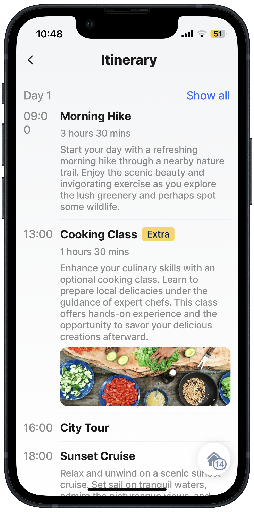

# View (Alpha)


This feature is currently in its **Alpha** stage of development.

* As an early version, it may not include all planned functionalities and is subject to significant changes based on ongoing development and user feedback.
* In this phase, the feature may contain bugs or behave unpredictably.
* Jigx recommends using standard, fully supported components until this feature has been fully tested and refined.
* We encourage you to provide feedback and report any issues to help us improve and refine the feature for future releases.


The `component.view` is an empty container similar to the \<div> element in CSS or HTML. Use the view component for layouts. The YAML always has the `style:` property under which all style elements such as color and direction for rows and columns are located, and the `children:` property for adding other components such as avatar, text, and icons. Multiple layers of the view component can be used to create UI requirements. You can also place a `component.card` inside the view and vice versa. If you are unfamiliar with CSS or HTML, there are several resources available, such as [https://www.w3schools.com/](https://www.w3schools.com/), that can assist you when configuring a view component.

For steps on creating a custom component, see [How to create a custom component](<../Custom components _Alpha_.md>).

## Configuration options

You can use `when` and `instanceId` with `component.view`, add the properties before the `options:` property. The available list of style options is shown below.

<table><thead><tr><th width="161.3515625">Options</th><th>Value</th></tr></thead><tbody><tr><td><code>alignContent</code></td><td>Determine how content in the view will be aligned, applies to any component contained in the view. The following options are available: <code>center</code> <code>flex-end</code> <code>flex-start</code> <code>space-around</code> <code>space-between</code> <code>stretch</code></td></tr><tr><td><code>alignItems</code></td><td>Available options include: <code>baseline</code> <code>center</code> <code>flex-end</code> <code>flex-start</code> <code>stretch</code></td></tr><tr><td><code>alignSelf</code></td><td>Available options include: <code>auto</code> <code>baseline</code> <code>center</code> <code>flex-end</code> <code>flex-start</code> <code>stretch</code></td></tr><tr><td><code>background</code></td><td><code>color</code> - multiple, use IntelliSense to view the available list. See to view the different colors. <code>emphasis</code> - change the brightness and boldness of the content in the view. Available options include: - <code>high</code> - <code>medium</code> - <code>low</code> - <code>extra-low</code> - <code>low-medium</code></td></tr><tr><td><code>border</code></td><td>Configure the border using these properties: <code>bottom</code> <code>color</code> - multiple, use IntelliSense to view the available list. <code>emphasis</code> - <code>color</code>, <code>high</code>, <code>medium</code>, <code>low</code>, <code>extra-low</code>, <code>low-medium</code> <code>end</code> <code>left</code> <code>right</code> <code>start</code> - <code>style</code> <code>style</code> - <code>solid</code>, <code>transparent</code>, <code>true</code> <code>top</code> <code>width</code> - use a number or expression.</td></tr><tr><td><code>bottom</code></td><td>Configure the spacing at the bottom of the view using these properties: <code>large</code> <code>medium</code> <code>small</code> <code>regular</code> <code>minimal</code> <code>none</code></td></tr><tr><td><code>emphasis</code></td><td>Change the brightness and boldness of the content in the view. Available options include: <code>high</code> <code>medium</code> <code>low</code> <code>extra-low</code> <code>low-medium</code></td></tr><tr><td><code>flex</code></td><td>Available options include: <code>basis</code>- use a number or expression. <code>direction</code> - <code>column</code>, <code>column-reverse</code>, <code>row</code>, <code>row-reverse</code> <code>grow</code> - use a number or expression <code>shrink</code> - use a number or expression <code>wrap</code> - <code>wrap</code>, <code>nowrap</code>, <code>wrap-reverse</code> For more information on using the flex property, see</td></tr><tr><td><code>gap</code></td><td>Configure the gap in the view. Available options include: <code>column</code> - <code>large</code>, <code>medium</code>, <code>small</code>, <code>regular</code>, <code>minimal</code>, <code>none</code> <code>large</code> <code>medium</code> <code>none</code> <code>minimal</code> <code>regular</code> <code>row</code> - <code>large</code>, <code>medium</code>, <code>small</code>, <code>regular</code>, <code>minimal</code>, <code>none</code> <code>small</code></td></tr><tr><td><code>hasShadow</code></td><td>A boolean property used to toggle the display of a shadow beneath the component. When set to <code>true</code>, the control renders with a subtle shadow effect, helping it stand out visually against the background. This enhances the visual hierarchy and depth in the mobile app interface. When set to <code>false</code> (or omitted), no shadow is applied.</td></tr><tr><td><code>height</code></td><td>Determine the height of the view. Available options include: <code>max</code> <code>min</code> <code>value</code></td></tr><tr><td><code>justifyContent</code></td><td>Available options include: <code>center</code> <code>flex-end</code> <code>flex-start</code> <code>space-around</code> <code>space-between</code> <code>space-evenly</code></td></tr><tr><td><code>left</code></td><td>Available options include: <code>large</code> <code>medium</code> <code>small</code> <code>regular</code> <code>minimal</code> <code>none</code></td></tr><tr><td><code>margin</code></td><td>Configure different margins in the view, available options include: <code>bottom</code> - <code>large</code>, <code>medium</code>, <code>small</code>, <code>regular</code>, <code>minimal</code>, <code>none</code> <code>end</code> - <code>large</code>, <code>medium</code>, <code>small</code>, <code>regular</code>, <code>minimal</code>, <code>none</code> <code>horizontal</code> - <code>large</code>, <code>medium</code>, <code>small</code>, <code>regular</code>, <code>minimal</code>, <code>none</code> <code>large</code> <code>left</code> - <code>large</code>, <code>medium</code>, <code>small</code>, <code>regular</code>, <code>minimal</code>, <code>none</code> <code>medium</code> <code>minimal</code> <code>none</code> <code>regular</code> <code>right</code> - <code>large</code>, <code>medium</code>, <code>small</code>, <code>regular</code>, <code>minimal</code>, <code>none</code> <code>small</code> <code>start</code> - <code>large</code>, <code>medium</code>, <code>small</code>, <code>regular</code>, <code>minimal</code>, <code>none</code> <code>top</code> - <code>large</code>, <code>medium</code>, <code>small</code>, <code>regular</code>, <code>minimal</code>, <code>none</code> <code>vertical</code> - <code>large</code>, <code>medium</code>, <code>small</code>, <code>regular</code>, <code>minimal</code>, <code>none</code></td></tr><tr><td><code>overflow</code></td><td>Available options include: <code>hidden</code> <code>scroll</code> <code>visible</code></td></tr><tr><td><code>padding</code></td><td>Configure different paddings in the view, available options include: <code>bottom</code> - <code>large</code>, <code>medium</code>, <code>small</code>, <code>regular</code>, <code>minimal</code>, <code>none</code> <code>end</code> - <code>large</code>, <code>medium</code>, <code>small</code>, <code>regular</code>, <code>minimal</code>, <code>none</code> <code>horizontal</code> - <code>large</code>, <code>medium</code>, <code>small</code>, <code>regular</code>, <code>minimal</code>, <code>none</code> <code>large</code> <code>left</code> - <code>large</code>, <code>medium</code>, <code>small</code>, <code>regular</code>, <code>minimal</code>, <code>none</code> <code>medium</code> <code>minimal</code> <code>none</code> <code>regular</code> <code>right</code> - <code>large</code>, <code>medium</code>, <code>small</code>, <code>regular</code>, <code>minimal</code>, <code>none</code> <code>small</code> <code>start</code> - <code>large</code>, <code>medium</code>, <code>small</code>, <code>regular</code>, <code>minimal</code>, <code>none</code> <code>top</code> - <code>large</code>, <code>medium</code>, <code>small</code>, <code>regular</code>, <code>minimal</code>, <code>none</code> <code>vertical</code> - <code>large</code>, <code>medium</code>, <code>small</code>, <code>regular</code>, <code>minimal</code>, <code>none</code></td></tr><tr><td><code>position</code></td><td>Available options include: <code>absolute</code> <code>relative</code></td></tr><tr><td><code>radius</code></td><td>Available options include: <code>large</code> <code>medium</code> <code>regular</code> <code>small</code> <code>tiny</code> <code>bottomLeft</code> - <code>large</code>, <code>medium</code>, <code>regular</code>, <code>small</code>, <code>tiny</code> <code>bottomrRight</code> - <code>large</code>, <code>medium</code>, <code>regular</code>, <code>small</code>, <code>tiny</code> <code>topRight</code> - <code>large</code>, <code>medium</code>, <code>regular</code>, <code>small</code>, <code>tiny</code> <code>topLeft</code> - <code>large</code>, <code>medium</code>, <code>regular</code>, <code>small</code>, <code>tiny</code></td></tr><tr><td><code>right</code></td><td>Available options include: <code>large</code> <code>medium</code> <code>small</code> <code>regular</code> <code>minimal</code> <code>none</code></td></tr><tr><td><code>top</code></td><td>Available options include: <code>large</code> <code>medium</code> <code>small</code> <code>regular</code> <code>minimal</code> <code>none</code></td></tr><tr><td><code>width</code></td><td>Available options include: <code>max</code> <code>min</code> <code>value</code></td></tr></tbody></table>

## Considerations

* When using the `component.image` on custom components, the `isFlexible` property is available. If the property is set to `true`, the image will take the parent's space. If the parent has zero height or zero width, the image will not render. Set the `height` and `width` on the image, or set `isFlexible` to `true`.
* When using the `component.image` in the `component.view` to define the `height`, e.g., 100, and setting `isFlexible: true` for each image. This allows the images to grow into the parent component space.
* In styles, you cannot use `flexGrow` and `width` together. Use one or the other; if combined, the width property does not function, and the UI element will not render as designed.
* By default, `children` components are stacked in a column.
* To ensure that `text` and `icons` do not run over borders in the app, use `flex:grow:1` and `shrink:1` together.

## Example and code samples

### Itinerary using views to create columns and rows



This example shows using the `component.view` to create the layout for an itinerary. The `view` component creates a wrapper for the content, rows to show content in, and columns to create spacing between the content. The `component.text` is used inside the view component to show the content and the `component.image` shows the required images.

Examples:

1. See the _jig_ example in [GitHub](https://github.com/jigx-com/jigx-samples/blob/d5eb38a64423482ed10703b0b2889709beee309c/quickstart/jigx-samples/jigs/custom-components/templates/itinerary/itinerary.jigx).
2. See the custom component in [GitHub](https://github.com/jigx-com/jigx-samples/blob/main/quickstart/jigx-samples/components/templates/itinerary/itinerary-day.jigx).



<figure><figcaption><p>Itinerary view</p></figcaption></figure>





```yaml
type: component.default
children:
  # WRAPPER - use the view component as a container for other components
  - type: component.view
    options:
      style:
        flex:
          direction: row  
          grow: 1
        padding: 
          horizontal: medium
          bottom: medium
        gap: medium
        justifyContent: flex-start
        alignItems: flex-start
      children:
        # TIME - use a view component to create the layout for a time column
        - type: component.view
          options:
            style:
              flex:
                direction: column
              emphasis: medium
              width: 50
            children:
              - type: component.text
                options:
                  value: =@ctx.inputs.time
                  align: left
        # CONTENT - use the view component to design the layout of content such as text in rows, and spaces between text
        - type: component.view
          options:
            style:
              flex:
                direction: column
                grow: 1
                shrink: 1
              gap: small
              border:
                bottom:
                  style: solid
                  emphasis: extra-low
              padding: 
                bottom: medium
                  
            children:
              - type: component.view
                options:
                  style:
                    flex: 
                      direction: row
                    justifyContent: flex-start
                    alignItems: center
                    gap: small
                  children:
                    - type: component.text
                      when: =@ctx.inputs.title
                      options:
                        value: =@ctx.inputs.title
                        align: left
                        weight: bold
                    - type: component.view
                      when: =@ctx.inputs.extra = true ? true:false
                      options:
                        style:
                          background:
                            color: color3
                          padding: 
                            vertical: minimal
                            horizontal: small
                          radius: tiny
                          flex: 
                            grow: 0
                          alignSelf: flex-start
                        children:
                        - type: component.text
                          options:
                            value: Extra
                            size: small
                                    
              - type: component.text
                when: =@ctx.inputs.duration != null ? true :false
                options:
                  value: =@ctx.inputs.duration
                  align: left
                  emphasis: medium
                  size: small
              - type: component.text
                when: =@ctx.inputs.description != null ? true :false
                options:
                  value: =@ctx.inputs.description
                  align: left
                  emphasis: medium
                  size: small
              - type: component.view
                when: =@ctx.inputs.image1 != null ? true :false
                options:
                  style: 
                    flex: 
                      direction: row
                    gap: small
                    height: 100
                  children:
                    - type: component.image
                      options:
                        source:
                          uri: =@ctx.inputs.image1
                        isFlexible: true
                    - type: component.image
                      options:
                        source:
                          uri: =@ctx.inputs.image2
                        isFlexible: true
                    - type: component.image
                      options:
                        source:
                          uri: =@ctx.inputs.image3
                        isFlexible: true                                          
```



```yaml
title: Itinerary
type: jig.default

datasources:
  itinerary-day: 
    # Use static data to populate the itinerary 
    type: datasource.static
    options:
      data:
        - id: 1
          day: 1
          time: 09:00
          title: Morning Hike
          duration: 3 hours 30 mins
          description: Start your day with a refreshing morning hike through a nearby nature trail. Enjoy the scenic beauty and invigorating exercise as you explore the lush greenery and perhaps spot some wildlife.
        - id: 2
          day: 1
          time: 13:00
          title: Cooking Class
          duration: 1 hours 30 mins
          description: Enhance your culinary skills with an optional cooking class. Learn to prepare local delicacies under the guidance of expert chefs. This class offers hands-on experience and the opportunity to savor your delicious creations afterward.
          image1: https://images.unsplash.com/photo-1507048331197-7d4ac70811cf?ixlib=rb-4.0.3&ixid=M3wxMjA3fDB8MHxzZWFyY2h8Mnx8Y29va2luZyUyMGNsYXNzfGVufDB8fDB8fHww&auto=format&fit=crop&w=900&q=60
          extra: true
        - id: 3
          day: 1
          time: 16:00
          title: City Tour
        - id: 4
          day: 1
          time: 18:00
          title: Sunset Cruise
          duration:
          description: Relax and unwind on a scenic sunset cruise. Set sail on tranquil waters, admire the picturesque views, and witness the breathtaking colors of the setting sun. This leisurely experience offers a perfect end to your day.
          image1: https://images.unsplash.com/photo-1642195349088-953f63a7d4df?ixlib=rb-4.0.3&ixid=M3wxMjA3fDB8MHxzZWFyY2h8MTB8fHN1bnNldCUyMGNydWlzZXxlbnwwfHwwfHx8MA%3D%3D&auto=format&fit=crop&w=900&q=60
          image2: https://images.unsplash.com/photo-1580541631950-7282082b53ce?ixlib=rb-4.0.3&ixid=M3wxMjA3fDB8MHxzZWFyY2h8Mnx8Y3J1aXNlfGVufDB8fDB8fHww&auto=format&fit=crop&w=900&q=60
        - id: 5
          day: 2
          time: 09:00
          title: Contemporary Art Museum Visit
          duration: 3 hours
          description:
          image1: https://images.unsplash.com/photo-1534235826754-0a3572d1d6d5?ixlib=rb-4.0.3&ixid=M3wxMjA3fDB8MHxzZWFyY2h8MTF8fG11c2V1bXxlbnwwfHwwfHx8MA%3D%3D&auto=format&fit=crop&w=900&q=60
        - id: 6
          day: 2
          time: 13:00
          title: Guided Wine Tasting
          duration:
          description: Indulge in a guided wine tasting experience at a local vineyard. Discover the flavors and aromas of exquisite wines as you learn about the winemaking process. Expand your knowledge of different varieties and enjoy the sophistication of this activity (additional fee applies).
          image1: https://images.unsplash.com/photo-1568213816046-0ee1c42bd559?ixlib=rb-4.0.3&ixid=M3wxMjA3fDB8MHxzZWFyY2h8M3x8d2luZSUyMHRhc3Rpbmd8ZW58MHx8MHx8fDA%3D&auto=format&fit=crop&w=900&q=60
          image2: https://images.unsplash.com/photo-1513618827672-0d7c5ad591b1?ixlib=rb-4.0.3&ixid=M3wxMjA3fDB8MHxzZWFyY2h8MTh8fHdpbmUlMjB0YXN0aW5nfGVufDB8fDB8fHww&auto=format&fit=crop&w=900&q=60
          image3: https://images.unsplash.com/photo-1598306442928-4d90f32c6866?ixlib=rb-4.0.3&ixid=M3wxMjA3fDB8MHxzZWFyY2h8OXx8d2luZSUyMHRhc3Rpbmd8ZW58MHx8MHx8fDA%3D&auto=format&fit=crop&w=900&q=60
        - id: 7
          day: 2
          time: 15:00
          title:  Outdoor Adventure
          duration: 2 hours
          description: Get your adrenaline pumping with an outdoor adventure activity such as zip-lining, rock climbing, or kayaking. Challenge yourself, enjoy the thrill, and soak up the natural surroundings. This exciting experience will leave you with unforgettable memories.
        - id: 8
          day: 2
          time: 18:00
          title: Dinner and Live Music
          extra: true
            
children:
  # ITINERARY - use the view custom component in a jig        
  - type: component.custom-component      
    componentId: section2
    inputs:
      title: Day 1

  - type: component.list
    options:
      data: =@ctx.datasources.itinerary-day[day=1]
      maximumItemsToRender: 8
      item: 
        type: component.custom-component
        componentId: view-itinerary
        inputs:
          time: =@ctx.current.item.time 
          title: =@ctx.current.item.title
          duration: =@ctx.current.item.duration
          description: =@ctx.current.item.description
          image1: =@ctx.current.item.image1
          image2: =@ctx.current.item.image2
          extra: =@ctx.current.item.extra
                
  - type: component.custom-component      
    componentId: section2
    inputs:
      title: Day 2
  
  - type: component.list
    options:
      data: =@ctx.datasources.itinerary-day[day=2]
      maximumItemsToRender: 8
      item: 
        type: component.custom-component
        componentId: view-itinerary
        inputs:
          time: =@ctx.current.item.time 
          title: =@ctx.current.item.title
          duration: =@ctx.current.item.duration
          description: =@ctx.current.item.description
          image1: =@ctx.current.item.image1
          image2: =@ctx.current.item.image2
          image3: =@ctx.current.item.image3
          extra: =@ctx.current.item.extra     
```



### Other view layout examples

Explore a variety of additional code examples demonstrating the use of the `view` component on GitHub. These examples showcase different configurations and use cases to help you achieve different layouts.

* [Layouts 1 - 10](https://github.com/jigx-com/jigx-samples/tree/main/quickstart/jigx-samples/components/basic-elements/layout)
