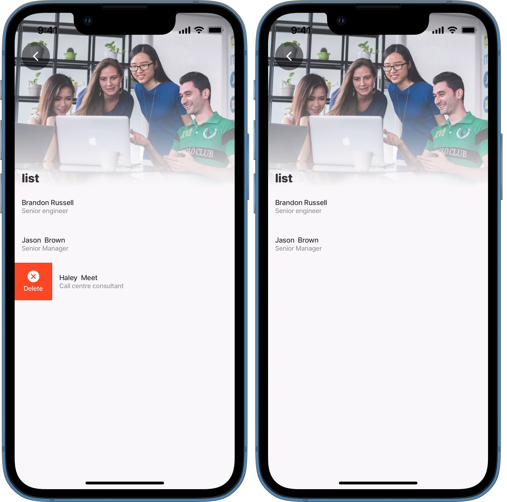
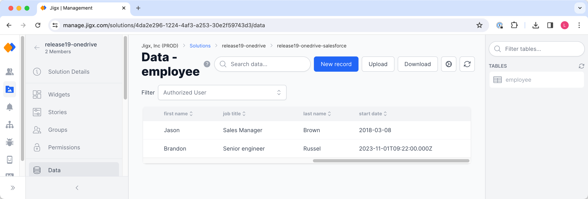
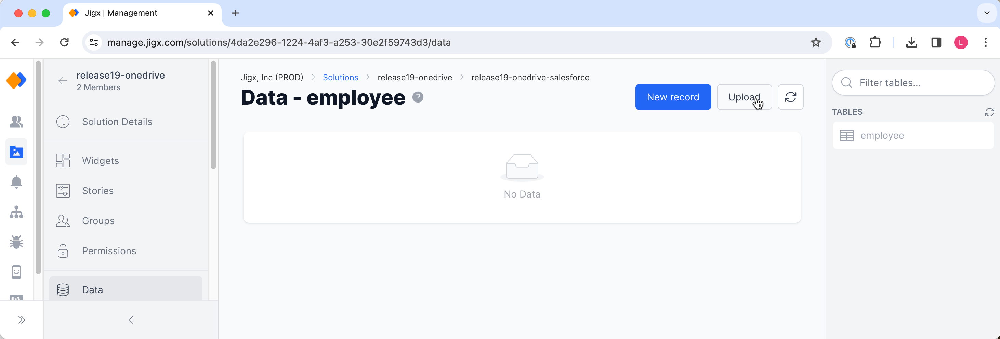

# Deleting Dynamic Data

With the ability to create and update data, you must be able to delete data that is no longer needed. This example shows how to delete a single row of data and then how to delete multiple rows of data from a jig.

### Datasources, jigs, component & actions

1. **default.jigx** is the database where the Dynamic Data table is defined.
2. [sqlite](../../Datasource/sqlite.md) datasource calls the Dynamic Data provider, using an SQL query to return the data.
3. [jig.list](<../../Jig Types/jig_list.md>) is the type of jig used to list the data with a `swipeable: left` action that uses the Dynamic Data provider's `delete` method.

### Examples and code snippets

#### Delete a single data record using execute-entity

<figure><figcaption><p>Deleting Dynamic Data</p></figcaption></figure>

<figure><figcaption><p>Record deleted from table</p></figcaption></figure>




```yaml
title: list
type: jig.list
icon: delete-2

header:
  type: component.jig-header
  options:
    height: medium
    children:
      type: component.image
      options:
        source:
          uri: https://images.unsplash.com/photo-1531545514256-b1400bc00f31?q=80&w=1374&auto=format&fit=crop&ixlib=rb-4.0.3&ixid=M3wxMjA3fDB8MHxwaG90by1wYWdlfHx8fGVufDB8fHx8fA%3D%3D

onFocus:
  type: action.action-list
  options:
    isSequential: true
    actions:
      - type: action.sync-entities
        options:
          provider: DATA_PROVIDER_DYNAMIC
          entities:
            - default/employee

datasources:
  employee-list: 
  # the SQLite datasource calls the Dynamic Data provider, writing a SQL query returns the data from the provider to the jig
    type: datasource.sqlite
    options:
      provider: DATA_PROVIDER_DYNAMIC
  
      entities:
        - default/employee
  
      query: SELECT
               id,
               '$.first_name',
               '$.last_name', 
               '$.job_title',
               '$.email',
               '$.start_date',
               '$.department',
               '$.contact'
              FROM
               [default/employee] 
# reference the datasource to be used in the list
data: =@ctx.datasources.employee-list
item:
  type: component.list-item
  options:
    title: =(@ctx.current.item.first_name & ' ' & @ctx.current.item.last_name)
    subtitle: =@ctx.current.item.job_title
    swipeable:
      right:
        - label: Delete
          icon: delete-2
          color: negative
          onPress: 
   # execute the delete method of the Dynamic Data provider and use the id of the item swiped to identify the data that must be deleted
            type: action.execute-entity
            options:
              provider: DATA_PROVIDER_DYNAMIC
              entity: default/employee
              method: delete
              data:
                id: =@ctx.current.item.id
              onSuccess: 
                type: action.go-back
```





```yaml
tables:
  employee: null
```





```yaml
name: employees
title: Employees
category: business

tabs:
  home:
    jigId: delete-single-record
    icon: home-apps-logo
```




#### Deleting multiple data records using execute-entities

To delete all employees (multiple data records) in the Dynamic Data table use the `action.execute-entities` action with an expression that as shown below. This will delete all records in the table when the _Delete all employees_ button is pressed.

<figure><figcaption><p>Delete multiple records</p></figcaption></figure>

<figure><figcaption><p>All records deleted from table</p></figcaption></figure>




```yaml
title: list
type: jig.list
icon: delete

header:
  type: component.jig-header
  options:
    height: medium
    children:
      type: component.image
      options:
        source:
          uri: https://images.unsplash.com/photo-1531545514256-b1400bc00f31?q=80&w=1374&auto=format&fit=crop&ixlib=rb-4.0.3&ixid=M3wxMjA3fDB8MHxwaG90by1wYWdlfHx8fGVufDB8fHx8fA%3D%3D

onFocus:
  type: action.action-list
  options:
    isSequential: true
    actions:
      - type: action.sync-entities
        options:
          provider: DATA_PROVIDER_DYNAMIC
          entities:
            - default/employee

datasources:
  employee-list: 
  # the SQLite datasource calls the Dynamic Data provider, writing a SQL query returns the data from the provider to the jig
    type: datasource.sqlite
    options:
      provider: DATA_PROVIDER_DYNAMIC
  # specify the table in Dynamic Data that you want to work with
      entities:
        - default/employee
  
      query: SELECT
               id,
               '$.first_name',
               '$.last_name', 
               '$.job_title',
               '$.email',
               '$.start_date',
               '$.department',
               '$.contact'
              FROM
               [default/employee] 

data: =@ctx.datasources.employee-list
item:
  type: component.list-item
  options:
    title: =(@ctx.current.item.first_name & ' ' & @ctx.current.item.last_name)
    subtitle: =@ctx.current.item.job_title
    swipeable:
      right:
        - label: Delete
          icon: delete-2
          color: negative
          onPress: 
            type: action.execute-entity
            options:
              provider: DATA_PROVIDER_DYNAMIC
              entity: default/employee
              method: delete
              data:
                id: =@ctx.current.item.id
              onSuccess: 
                type: action.go-back  
# add a button to the list to detete all records
actions:
  - children:
      - type: action.confirm
        options:
          style:
            isDanger: true
          title: Delete ALL employees
          isConfirmedAutomatically: false
          onConfirmed: 
            type: action.execute-entities
            options:
# execute the delete method of the Dynamic Data provider, use the datasource in the expression to specific all ids to delete
              provider: DATA_PROVIDER_DYNAMIC
              entity: default/employee
              method: delete
              data: =@ctx.datasources.employee-list.{"id" :id}[]
              onSuccess: 
                type: action.go-back
    # Deleting all data is irreversible, use a modal to confirm the delete before actually executing the delete 
          modal:
            title: Are you sure you want to delete ALL?
```





```yaml
tables:
  employee: null
```





```yaml
name: employees
title: Employees
category: business

tabs:
  home:
    jigId: delete-multiple-records
    icon: home-apps-logo    
```



