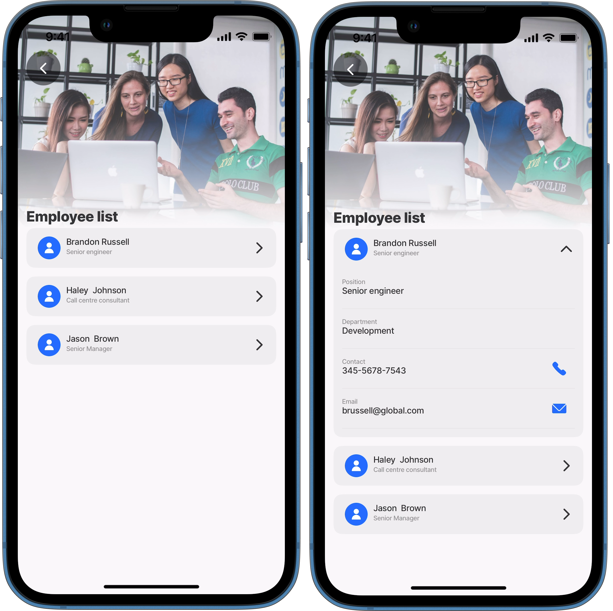
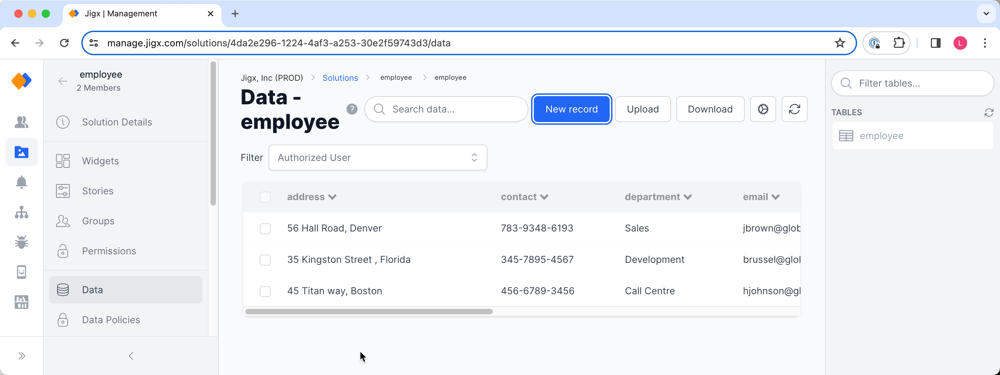

# Reading Dynamic Data

In this example, we **read** the employee data records we created in the employee Dynamic Data table ([Creating Dynamic Data](<Creating Dynamic Data.md>)), to create a list of the employees and their details.

## Datasources, jig & component

1. **default.jigx** is the database where the Dynamic Data table is defined.
2. [sqlite](../../Datasource/sqlite.md) datasource calls the Dynamic Data provider, using an SQL query to return the data.
3. [jig.list](<../../Jig Types/jig_list.md>) is the type of jig we will use to list the data.
4. [expander](../../Components/expander/expander.md) component to show the Dynamic Data in.

## Examples and code snippets

This example uses the Dynamic Data table, columns, and data records created in the [Creating Dynamic Data](<Creating Dynamic Data.md>) example to create a list of employees with their details.

<figure><figcaption><p>Reading Dynamic Data</p></figcaption></figure>

Here is what the data table employee resembles in [Data](https://docs.jigx.com/building-apps-with-jigx/data) in Jigx Management.

<figure><figcaption><p>Employee Dynamic Data</p></figcaption></figure>




```yaml
title: Employee list
type: jig.list
icon: list-stars

header:
  type: component.jig-header
  options:
    height: medium
    children:
      type: component.image
      options:
        source:
          uri: https://images.unsplash.com/photo-1531545514256-b1400bc00f31?q=80&w=1374&auto=format&fit=crop&ixlib=rb-4.0.3&ixid=M3wxMjA3fDB8MHxwaG90by1wYWdlfHx8fGVufDB8fHx8fA%3D%3D
# Use onfocus action to sync the data from the provider everytime the jig is opened
onFocus:
  type: action.action-list
  options:
    isSequential: true
    actions:
      - type: action.sync-entities
        options:
          # The dynamic provider has the employee table and records that must sync when the jig is opened
          provider: DATA_PROVIDER_DYNAMIC
          entities:
            - default/employee

datasources:
  my-employees:
    # Use the SQLite data source to write a select query to return the exact data from the solution's Dynamic Data employee table to be used in the jig
    type: datasource.sqlite
    options:
      provider: DATA_PROVIDER_DYNAMIC

      entities:
        - default/employee

      query: SELECT
        id,
        '$.first_name',
        '$.last_name',
        '$.job_title',
        '$.email',
        '$.start_date',
        '$.department',
        '$.contact'
        FROM
        [default/employee]

# Reference the datasource above to use as the data in the expander component
data: =@ctx.datasources.my-employees
item:
  type: component.expander
  options:
    header:
      centerElement:
        type: component.titles
        options:
          # expressions are used to combine data from two columns to show in the list
          title: =(@ctx.current.item.first_name & ' ' & @ctx.current.item.last_name)
          subtitle: =@ctx.current.item.job_title
          icon: person

    children:
      - type: component.entity
        options:
          children:
            - type: component.entity-field
              options:
                label: Position
                value: =@ctx.current.item.job_title
            - type: component.entity-field
              options:
                label: Department
                value: =@ctx.current.item.department
            - type: component.entity-field
              options:
                label: Contact
                value: =@ctx.current.item.contact
                contentType: phone
            - type: component.entity-field
              options:
                label: Email
                value: =@ctx.current.item.email
                contentType: email
```





```yaml
tables:
  employee: null
```




<pre class="language-yaml" data-full-width="true"><code class="lang-yaml"><strong>name: employees
</strong>title: Employees
category: business

tabs:
  home:
    jigId: list-employees
    icon: home-apps-logo
</code></pre>


