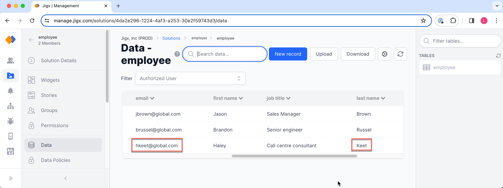

# Updating Dynamic Data

The employee's details are updated using the Dynamic Data provider's **update** method in this example. The same employee list ([Reading Dynamic Data](<Reading Dynamic Data.md>)) is used to select the employee and then populate the employee form ([Creating Dynamic Data](<Creating Dynamic Data.md>)) with the employee's existing details. Edit the required details and update the record in the Dynamic Data table.

## Datasources, jigs, components & actions

1. **default.jigx** is the database where the Dynamic Data table is defined.
2. [sqlite](../../Datasource/sqlite.md) datasource calls the Dynamic Data provider, using an SQL query to return the data.
3. [jig.list](<../../Jig Types/jig_list.md>) is the type of jig used to list the data in an [expander](../../Components/expander/expander.md) component with an `onContentPress` action with `parameters` to transfer the selected employee's details to the form.
4. [form](../../Components/form/form.md) is the component used with `initialValue` properties to populate the employee data into the form fields.
5. [submit-form](../../Actions/submit-form.md) is the action that executes the **update** method of the Dynamic Dataprovider with the `recordId` property configured to identify the record in the table that must be updated

## Examples and code snippets

<figure><figcaption><p>Update Dynamic Data record</p></figcaption></figure>

Use the employee list with `component.expanders` add the `onContentPress` action that will open the employee form, add `parameters` to transfer the employee details to the form.




```yaml
title: Employee list
type: jig.list
icon: upload-bottom

header:
  type: component.jig-header
  options:
    height: medium
    children:
      type: component.image
      options:
        source:
          uri: https://images.unsplash.com/photo-1531545514256-b1400bc00f31?q=80&w=1374&auto=format&fit=crop&ixlib=rb-4.0.3&ixid=M3wxMjA3fDB8MHxwaG90by1wYWdlfHx8fGVufDB8fHx8fA%3D%3D

onFocus:
  type: action.action-list
  options:
    isSequential: true
    actions:
      - type: action.sync-entities
        options:
          provider: DATA_PROVIDER_DYNAMIC
          entities:
            - default/employee

datasources:
  my-employees: 
    type: datasource.sqlite
    options:
      provider: DATA_PROVIDER_DYNAMIC
  
      entities:
        - default/employee
  
      query: SELECT
               id,
               '$.first_name',
               '$.last_name', 
               '$.job_title',
               '$.email',
               '$.start_date',
               '$.department',
               '$.contact',
               '$.address'
              FROM
               [default/employee] 

data: =@ctx.datasources.my-employees
item:
  type: component.expander
  options:
    header:
      centerElement: 
        type: component.titles
        options:
          title: =(@ctx.current.item.first_name & ' ' & @ctx.current.item.last_name)
          subtitle: =@ctx.current.item.job_title
          icon: person  
  
    children:
      - type: component.entity
        options:
          children:
            - type: component.entity-field
              options:
                label: Position
                value: =@ctx.current.item.job_title
            - type: component.entity-field
              options:
                label: Department
                value: =@ctx.current.item.department
            - type: component.entity-field
              options:
                label: Contact
                value: =@ctx.current.item.contact
                contentType: phone
            - type: component.entity-field
              options:
                label: Email
                value: =@ctx.current.item.email
                contentType: email             
    # When the list item is expanded and you press on the details you are directed to the form that is populated with the employee's details
    onContentPress: 
      type: action.go-to
      options:
      # Specifiy the jig to go to
        linkTo: update-employees
      # Set a inputs for the current selected item so that the data record will populate in the form's initialValue field  
        inputs:
          employee-detail: =@ctx.current.item
```





```yaml
tables:
  employee: null
```




<pre class="language-yaml" data-full-width="true"><code class="lang-yaml"><strong>name: employees
</strong>title: Employees
category: business

tabs:
  home:
    jigId: list-employees
    icon: home-apps-logo          
</code></pre>



In the pre-populate _Update Employee_ form add the `action.submit-form` using the Dynamic Data provider with the **update** method to update the data record.


The record is updated instantly and the new employee details are shown in the list





```yaml
title: Update Employee
type: jig.default

header:
  type: component.jig-header
  options:
    height: medium
    children:
      type: component.image
      options:
        source:
          uri: https://images.unsplash.com/photo-1522202176988-66273c2fd55f?q=80&w=1471&auto=format&fit=crop&ixlib=rb-4.0.3&ixid=M3wxMjA3fDB8MHxwaG90by1wYWdlfHx8fGVufDB8fHx8fA%3D%3D

children:
  - type: component.section
    options:
      title: Personal Information
      children:
        - type: component.form
    # Give the form an ID    
          instanceId: update-form
          options:
            children:
              - type: component.text-field
                instanceId: id
                options:
                  label: id
           # populate the field using the input parameter set in the list jig for the selected employee   
                  initialValue: =@ctx.jig.inputs.employee-detail.id
                  isHidden: true
              - type: component.text-field
                instanceId: first_name
                options:
                  label: First Name
            # populate the field using the input parameter set in the list jig for the selected employee  
                  initialValue: =@ctx.jig.inputs.employee-detail.first_name
              - type: component.text-field
                instanceId: last_name
                options:
                  label: Last Name
            # populate the field using the input parameter set in the list jig for the selected employee       
                  initialValue: =@ctx.jig.inputs.employee-detail.last_name
              - type: component.text-field
                instanceId: address
                options:
                  label: Address   
             # populate the field using the input parameter set in the list jig for the selected employee      
                  initialValue: =@ctx.jig.inputs.employee-detail.address
              - type: component.text-field
                instanceId: contact
                options:
                  label: Contact Information
              # populate the field using the input parameter set in the list jig for the selected employee     
                  initialValue: =@ctx.jig.inputs.employee-detail.contact
              - type: component.text-field
                instanceId: email
                options:
                  label: Email
              # populate the field using the input parameter set in the list jig for the selected employee     
                  initialValue: =@ctx.jig.inputs.employee-detail.email
              - type: component.section
                options:
                  title: Employment Information
                  children:
                    - type: component.text-field
                      instanceId: job_title
                      options:
                        label: Job Title 
                  # populate the field using the input parameter set in the list jig for the selected employee       
                        initialValue: =@ctx.jig.inputs.employee-detail.job_title
                    - type: component.text-field
                      instanceId: department
                      options:
                        label: Department
                  # populate the field using the input parameter set in the list jig for the selected employee       
                        initialValue: =@ctx.jig.inputs.employee-detail.department
                   
actions:
  - children:
      - type: action.submit-form
        options:
         # The formId is used to get the context to the fields and values that need updating in the form
          formId: update-form
         # The Dynamic Data provider uses the update method to update the record in the employee table 
          provider: DATA_PROVIDER_DYNAMIC
          title: Update Record
          entity: default/employee
          method: update
        # The specify the record that must be updated in the Dynamic Data table by referencing the current data stata of the components in the form  
          recordId: =@ctx.components.update-form.state.data
          onSuccess: 
            type: action.go-back
```




```yaml
name: employees
title: Employees
category: business

tabs:
  home:
    jigId: list-employees
    icon: home-apps-logo
  update:   
    jigId: update-employee-form
    icon: upload-button-alternate 
```



Navigate to the solution's Data option in Jigx Management and view the updated Dynamic Data employee table and record.

<figure><figcaption><p>Updated Dynamic Data record</p></figcaption></figure>
