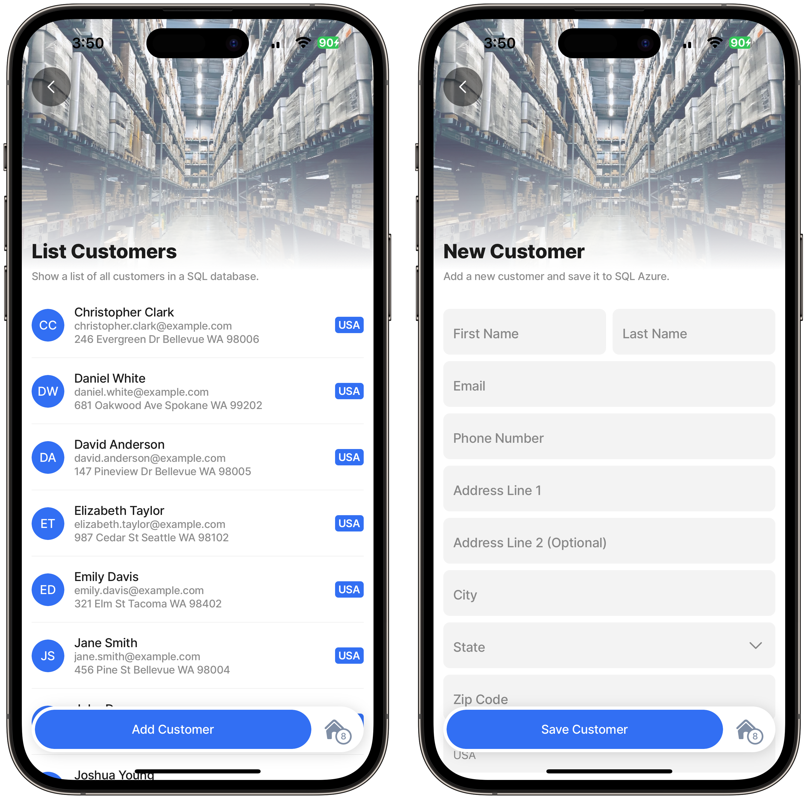

# Create a customer (INSERT)


Best practice for production apps is to use REST as the data layer to access data and not directly integrate to SQL using the SQL data provider. The SQL data provider will be squiggled in blue to indicate it is not recommended, together with a message to use [REST](https://docs.jigx.com/rest) instead. See [REST endpoints from Azure SQL](https://docs.jigx.com/microsoft-azure-sql) for more information.




## Scenario

This example uses a default jig with a form that executes an SQL command to create a new customer record.

### **Resources**

* Scripts for creating Azure SQL tables and stored procedures: [Database Scripts](<Database Scripts.md>).
* [Configuring the SQL Connection](https://docs.jigx.com/configuring-the-sql-connection).
* This sample depends on [List customers (SELECT)](<List customers _SELECT_.md>).

### Jigx Code

The Azure SQL Docs solution is on [GitHub](https://github.com/jigx-com/jigx-samples/tree/main/guides/azure-sql-docs).



<figure><figcaption></figcaption></figure>



## How it works

* The `execute-entity` action allows you to specify the function parameters and their values, as well as the data properties for the SQLite table. You have more granular control over the values being saved and can include expressions.
* The example below uses an `execute-entity` action and maps both the `parameters` of the jig function and the SQLite data in the action's configuration.
* To improve the user experience, data displayed after it has been created or updated should be updated in the local SQLite database and the backend system in the same action.
* If the data is only submitted to the backend system, it must be synced back to the device before the local tables are updated, and the information can be displayed. This can cause a significant lag and latency in the user's experience.
* The example below updates the data in Azure SQL and the SQLite database on the device when the user presses the Save button. This is the best practice for building responsive user experiences when working with remote data. See the [Data lifecycles in Jigx](https://docs.jigx.com/data-lifecycles-in-jigx) section of the documentation for a detailed explanation.

## Functions


The Jigx function below is listed twice, once for executing a stored procedure and once for executing a query.


### A store procedure-based version of create-customer.jigx

The **stored procedure** in the example was designed to create a new record in Azure SQL if no matching id is found. If the id already exists, the Azure SQL record is updated. The same stored procedure is used for creating a new customer and updating a customer.


```yaml
# Jigx SQL function executing a stored procedure to create a new customer record.
provider: DATA_PROVIDER_SQL
connection: customer.azure # Use manage.jigx.com to configure a SQL connection
method: execute #Use SQL stored procedure to interact with the data in SQL
query: |
procedure: sp_InsertOrUpdateCustomer
# The stored procedure parameters are automatically populated by Jigx with the
# matching function parameters.
parameters:
  CustomerId:
    type: string
    location: input
    required: true
  FirstName:
    type: string
    location: input
    required: true
  LastName:
    type: string
    location: input
    required: true
  Email:
    type: string
    location: input
    required: true
  PhoneNumber:
    type: string
    location: input
    required: true
  AddressLine1:
    type: string
    location: input
    required: true
  AddressLine2:
    type: string
    location: input
    required: false
  City:
    type: string
    location: input
    required: true
  ZipCode:
    type: string
    location: input
    required: true
  State:
    type: string
    location: input
    required: true
  Country:
    type: string
    location: input
    required: true
```


### A query-based version of create-customer.jigx

The SQL **query** version of create-customer.jigx below only creates a new record. It does not contain update like the stored procedure above. The only reason for this difference is to provide an alternative example and SQL logic.


```yaml
# Jigx SQL function executing a sql query to create a new customer record in 
# Azure SQL.
provider: DATA_PROVIDER_SQL
connection: customer.azure # Use manage.jigx.com to configure a SQL connection
method: query #Use SQL statements to interact with the data in SQL
query: |
  INSERT INTO customers (
    id,
    first_name,
    last_name,
    email,
    phone_number,
    address_line1,
    address_line2,
    city,
    state,
    zip_code,
    country
  )
  VALUES (
    @CustomerId,
    @FirstName,
    @LastName,
    @Email,
    @PhoneNumber,
    @AddressLine1,
    @AddressLine2,
    @City,
    @State,
    @ZipCode,
    @Country
  )
# Jigx automatically replaces the tokens in the SQL query with the matching function
# parameters.
parameters:
  CustomerId:
    type: string
    location: input
    required: true
  FirstName:
    type: string
    location: input
    required: true
  LastName:
    type: string
    location: input
    required: true
  Email:
    type: string
    location: input
    required: true
  PhoneNumber:
    type: string
    location: input
    required: true
  AddressLine1:
    type: string
    location: input
    required: true
  AddressLine2:
    type: string
    location: input
    required: false
  City:
    type: string
    location: input
    required: true
  ZipCode:
    type: string
    location: input
    required: true
  State:
    type: string
    location: input
    required: true
  Country:
    type: string
    location: input
    required: true
```


## Jigs

### Modify the list customers jig

* The listCustomers.jigx file must be modified to include a jig-level action, allowing a new customer to be added.
* When pressing the **Add customer** action button at the bottom of the list customers jig, Jigx will navigate to the newCustomer jig.
* A new **customer id** is created and used as a parameter in the `GoTo` action. The `customerId` parameter is passed to the newCustomer jig. The generated id is used as the unique identifier when creating both the SQLite record and the new record in Azure SQL in the newCustomer jig.
* The id is used across the SQlite and Azure SQL tables to ensure that the record in the local SQLite customer table and Azure SQL customer table are in sync and have the same value.


```yaml
# A sample list jig that uses a SQL function to return and display a list of 
# customers from Azure SQL.
title: List Customers
description: Show a list of all customers in a SQL database.
type: jig.list
icon: contact

# Header section displaying an image at the top of the screen.
header:
  type: component.jig-header
  options:
    height: medium
    children:
      type: component.image
      options:
        source:
          uri: https://images.unsplash.com/photo-1553413077-190dd305871c?ixlib=rb-4.0.3&ixid=MnwxMjA3fDB8MHxwaG90by1wYWdlfHx8fGVufDB8fHx8&auto=format&fit=crop&w=1035&q=80

# onFocus is triggered whenever the jig is displayed. The sync-entities action calls
# the Jigx SQL function and populates the local SQLite tables on the device with the
# data returned from Azure SQL.
onFocus:
  type: action.sync-entities
  options:
    provider: DATA_PROVIDER_SQL
    entities:
      - entity: customers
        function: get-customers

# The mydata data source selects the data from the local SQLite database.
datasources:
  mydata:
    type: datasource.sqlite
    options:
      provider: DATA_PROVIDER_LOCAL

      entities:
        - entity: customers

      query: |
        SELECT
          id,
          '$.first_name',
          '$.last_name',
          '$.email',
          '$.phone_number',
          '$.address_line1',
          '$.address_line2',
          '$.city',
          '$.state',
          '$.zip_code',
          '$.country'
        FROM
          [customers]
        ORDER BY '$.first_name'

# The list and its list items are configured below. This is a list jig; therefore, 
# its properties, such as data and item, are top-level properties.
# The data property binds the list to a specific data source.
data: =@ctx.datasources.mydata
# The item property specifies the list item type and its attributes.
item:
  type: component.list-item
  options:
    title: =@ctx.current.item.first_name & ' ' & @ctx.current.item.last_name
    subtitle: =@ctx.current.item.email
    description: |
      =@ctx.current.item.address_line1 & ' ' & 
        @ctx.current.item.city & ' ' & 
        @ctx.current.item.state  & ' ' & 
        @ctx.current.item.zip_code
    label:
      title: =@ctx.current.item.country
    leftElement:
      element: avatar
      # The text property of the left element is specified using a JSONata expression that builds a two-letter string by concatenating the first letters of the customer's first and last names.
      text: =$substring(@ctx.current.item.first_name,0,1) & $substring(@ctx.current.item.last_name,0,1)
    divider: solid
    # A go-to action is triggered when pressing on a list item.
    onPress:
      type: action.go-to
      options:
        # The name of the jig to navigate to when the item is pressed.
        linkTo: viewCustomer
        parameters:
          # The id column of the current item being pressed on is passed as a 
          # parameter called customerId to the viewCustomer jig.
          customerId: =@ctx.current.item.id

# Add customer button to navigate to the newCustomer jig
actions:
  - children:
      - type: action.go-to
        options:
          title: Add Customer
          linkTo: newCustomer
          parameters:
            custId: =$uuid_v4()
```


### The new customer jig

* Use an `execute- entity` action to submit the values of the components to the SQL stored procedure and save the new customer to the local SQLite database.
* To save the values of the components on a form, the form is unaware of the saved state, and **isDiscardChangesAlertEnabled** needs to be set to `false` to avoid seeing the dialog even when data has been saved.


```yaml
title: New Customer
description: Add a new customer and save it to SQL Azure.
type: jig.default

# Header section displaying an image at the top of the screen.
header:
  type: component.jig-header
  options:
    height: medium
    children:
      type: component.image
      options:
        source:
          uri: https://images.unsplash.com/photo-1553413077-190dd305871c?ixlib=rb-4.0.3&ixid=MnwxMjA3fDB8MHxwaG90by1wYWdlfHx8fGVufDB8fHx8&auto=format&fit=crop&w=1035&q=80

# A form control with input controls are used to capture the new customer information.
children:
  - type: component.form
    instanceId: frmNewCustomer
    options:
      # When a form submit action is used to save the values of the controls on a 
      # form, the form will warn the user when navigating away without saving the
      # form's content. When any other action type is used to save the values of the
      # controls on a form, the form is unaware of the saved state, and 
      # isDiscardChangesAlertEnabled needs to be set to false to avoid seeing the 
      # dialog even when data has been saved.
      isDiscardChangesAlertEnabled: false
      children:
        - type: component.field-row
          options:
            children:
              - type: component.text-field
                instanceId: FirstName
                options:
                  label: First Name
              - type: component.text-field
                instanceId: LastName
                options:
                  label: Last Name
        - type: component.email-field
          instanceId: Email
          options:
            label: Email
            # The type of keyboard that will be displayed on iOS or Android.
            keyboardType: email-address
        - type: component.text-field
          instanceId: PhoneNumber
          options:
            label: Phone Number
            keyboardType: phone-pad
            # Set the type of text for this field. This will enforce a regex for this
            # field of the type it is set to.
            textContentType: telephoneNumber
        - type: component.text-field
          instanceId: AddressLine1
          options:
            label: Address Line 1
            textContentType: streetAddressLine1
        - type: component.text-field
          instanceId: AddressLine2
          options:
            label: Address Line 2
            textContentType: streetAddressLine2
            isRequired: false
        - type: component.text-field
          instanceId: City
          options:
            label: City
            textContentType: addressCity
        # A dropdown control is used to list the USA states.
        - type: component.dropdown
          instanceId: State
          options:
            label: State
            # The data source for the dropdown options is a static datasource defined
            # in usa-states.jigx.
            data: =@ctx.datasources.usa-states
            item:
              type: component.dropdown-item
              options:
                title: =@ctx.current.item.name
                value: =@ctx.current.item.code
        - type: component.text-field
          instanceId: ZipCode
          options:
            label: Zip Code
            textContentType: postalCode
        - type: component.text-field
          instanceId: Country
          options:
            label: Country
            textContentType: countryName
            # The dropdown only contains USA states. Set the default value of the 
            # country control to USA.
            value: USA
            style:
              # Set the control to read only so the value cannot be changed to an 
              # unsupported country.
              isDisabled: true
actions:
  - children:
      - type: action.action-list
        options:
          title: Save Customer
          isSequential: true
          actions:
            # Use an execute entity action to submit the values of the controls to 
            # the Jigx function to update Azure SQL and to save the new customer to
            # the local SQLite database.
            - type: action.execute-entity
              options:
                # The data provider to use for the remote data. This solution uses 
                # Azure SQL.
                provider: DATA_PROVIDER_SQL
                # The name of the local SQLite database that the new record will be 
                # created in.
                entity: customers
                # The name of the Jigx function used to save the data to Azure SQL.
                function: create-customer
                # Set the function parameters to values of the controls on the form.
                parameters:
                  CustomerId: =@ctx.jig.inputs.custId
                  FirstName: =@ctx.components.FirstName.state.value
                  LastName: =@ctx.components.LastName.state.value
                  Email: =@ctx.components.Email.state.value
                  PhoneNumber: =@ctx.components.PhoneNumber.state.value
                  AddressLine1: =@ctx.components.AddressLine1.state.value
                  AddressLine2: =@ctx.components.AddressLine2.state.value
                  City: =@ctx.components.City.state.value
                  ZipCode: =@ctx.components.ZipCode.state.value
                  State: =@ctx.components.State.state.selected.code
                  Country: =@ctx.components.Country.state.value
                # The command type to be executed on the local SQLite database.
                method: create
                # Navigate to the previous screen after the action has been performed.
                # Set the column values of the new record that will be created in the
                # local SQLite Customers table.
                data:
                  id: =@ctx.jig.inputs.custId
                  FirstName: =@ctx.components.FirstName.state.value
                  LastName: =@ctx.components.LastName.state.value
                  Email: =@ctx.components.Email.state.value
                  PhoneNumber: =@ctx.components.PhoneNumber.state.value
                  AddressLine1: =@ctx.components.AddressLine1.state.value
                  AddressLine2: =@ctx.components.AddressLine2.state.value
                  City: =@ctx.components.City.state.value
                  ZipCode: =@ctx.components.ZipCode.state.value
                  State: =@ctx.components.State.state.selected.code
                  Country: =@ctx.components.Country.state.value
                # Display a dialog box with a message if the new record is created
                # successfully.
                onSuccess:
                  description: New Customer Created Successfully
                  title: Customer Created
            - type: action.go-back
```

