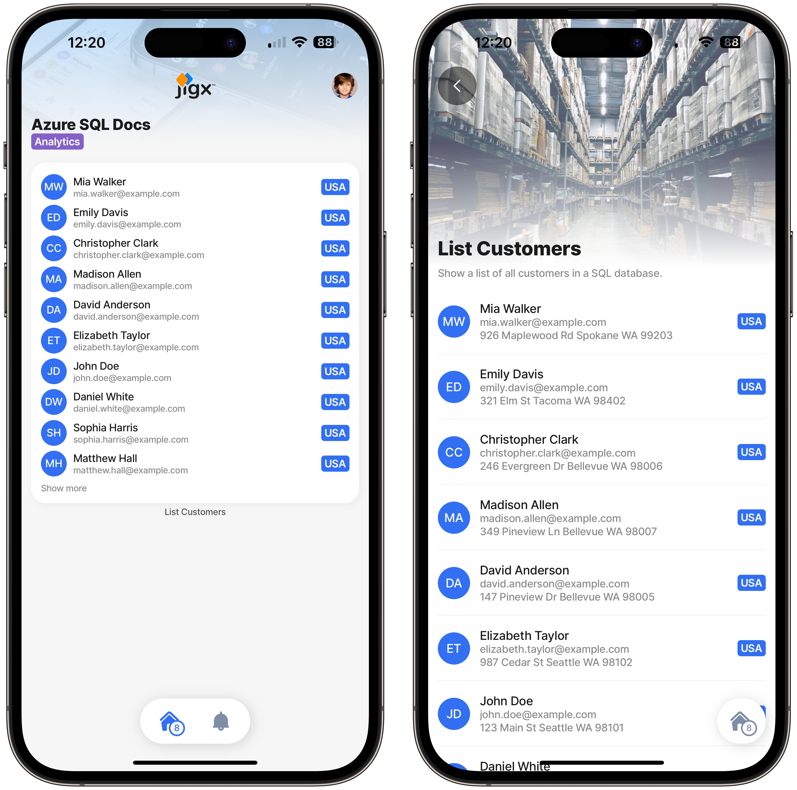

# List customers (SELECT)


Best practice for production apps is to use REST as the data layer to access data and not directly integrate to SQL using the SQL data provider. The SQL data provider will be squiggled in blue to indicate it is not recommended, together with a message to use [REST](docId:jrbaNsm-OJn3nf4_dn_Hu) instead. See [REST endpoints from Azure SQL](docId:eOUi2cPYynsdRuK-TobDp) for more information.




#### Scenario

Create a list of customers showing their names, email addresses, and locations. On the left is an avatar, and on the right is the country the customer resides in.

#### Resources

* Scripts for creating Azure SQL tables and stored procedures [Database Scripts](<Database Scripts.md>)
* [Configuring the SQL Connection](https://docs.jigx.com/building-apps-with-jigx/data/data-providers/microsoft-azure-sql/configuring-the-sql-connection)

#### Jigx Code

The Azure SQL Docs solution is on [GitHub](https://github.com/jigx-com/jigx-samples/tree/main/guides/azure-sql-docs)



<figure><figcaption></figcaption></figure>



## How it works

This example selects a list of data from a customer table in an Azure SQL database and returns it to the Jigx solution on the device using the SQL data provider's function, where it is stored in the SQLite database. In the list jig the data is selected from the SQLite database using a SQL query in a data source which in turn is used by the list jig to render the items.

## Functions


The Jigx function is listed twice, once for executing a stored procedure and once for executing a query.


### A store procedure-based version of get-customers.jigx

The following Jigx function uses a stored procedure to fetch a list of data from Azure SQL.


```yaml
# Jigx SQL function executing a stored procedure to select all customers from a table.
provider: DATA_PROVIDER_SQL
connection: customer.azure # Use manage.jigx.com to configure a SQL connection
method: execute #Use SQL stored procedure to interact with the data in SQL
procedure: sp_GetAllCustomers
```


### A query-based version of get-customers.jigx

The following Jigx function uses a SQL query to fetch a list of data from Azure SQL.


```yaml
# Jigx SQL function executing a query to select all customers from a table.
provider: DATA_PROVIDER_SQL
connection: customer.azure # Use manage.jigx.com to configure a SQL connection
method: query #Use SQL statements to interact with the data in SQL
query: |
  SELECT
    id,
    first_name,
    last_name,
    email,
    phone_number,
    address_line1,
    address_line2,
    city,
    state,
    zip_code,
    country
  FROM
    customers
```


## jig (screen)

* Use a list type to configure a list of customers.
* Since the data is already synced to the local Sqlite data provider, the jigs datasource is configured with a query to provide the data for use in the list.
* Expressions are used to reference the exact data property required in each component.


```yaml
# A sample list jig that uses a SQL function to return and display a list of customers from Azure SQL.
title: List Customers
description: Show a list of all customers in a SQL database.
type: jig.list
icon: contact

# Header section displaying an image at the top of the screen.
header:
  type: component.jig-header
  options:
    height: medium
    children:
      type: component.image
      options:
        source:
          uri: https://images.unsplash.com/photo-1553413077-190dd305871c?ixlib=rb-4.0.3&ixid=MnwxMjA3fDB8MHxwaG90by1wYWdlfHx8fGVufDB8fHx8&auto=format&fit=crop&w=1035&q=80

# onFocus is triggered whenever the jig is displayed. The sync-entities action calls the Jigx SQL function and populates the local SQLite tables on the device with the data returned from Azure SQL.
onFocus:
  type: action.sync-entities
  options:
    provider: DATA_PROVIDER_SQL
    entities:
      - entity: customers
        function: get-customers

# The mydata data source selects the data from the local SQLite database.
datasources:
  mydata:
    type: datasource.sqlite
    options:
      provider: DATA_PROVIDER_LOCAL

      entities:
        - entity: customers

      query: |
        SELECT
          id,
          '$.first_name',
          '$.last_name',
          '$.email',
          '$.phone_number',
          '$.address_line1',
          '$.address_line2',
          '$.city',
          '$.state',
          '$.zip_code',
          '$.country'
        FROM
          [customers]

# The list and its list items are configured below. This is a list jig; therefore, its properties, such as data and item, are top-level properties.
# The data property binds the list to a specific data source.
data: =@ctx.datasources.mydata
# The item property specifies the list item type and its attributes.
item:
  type: component.list-item
  options:
    title: =@ctx.current.item.first_name & ' ' & @ctx.current.item.last_name
    subtitle: =@ctx.current.item.email
    description: |
      =@ctx.current.item.address_line1 & ' ' & 
        @ctx.current.item.city & ' ' & 
        @ctx.current.item.state  & ' ' & 
        @ctx.current.item.zip_code
    label:
      title: =@ctx.current.item.country
    leftElement:
      element: avatar
      # The text property of the left element is specified using a JSONata expression that builds a two-letter string by concatenating the first letters of the customer's first and last names.
      text: =$substring(@ctx.current.item.first_name,0,1) & $substring(@ctx.current.item.last_name,0,1)
    divider: solid  
```


## index

Add the list of customers jig to the home screen.


```yaml
name: azure-sql-docs
title: Azure SQL Docs
category: analytics

tabs:
  home:
    jigId: listCustomers
    icon: home-apps-logo
```

